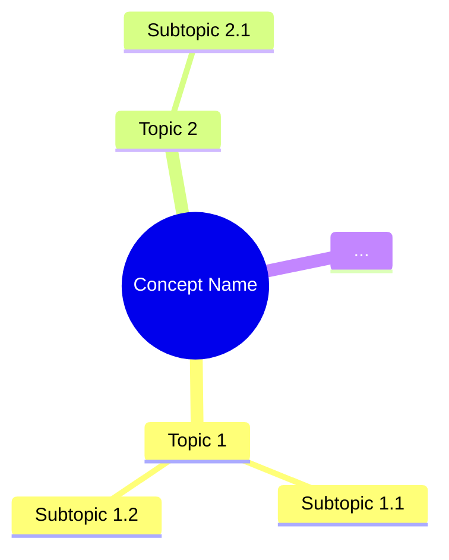

# ExamPreparationClass Workflow

## Overview
This workflow creates a classroom simulation for students learning AI/Machine Learning concepts. It generates two files in a dedicated folder with interactive teacher-student dialogues and comprehensive exam preparation materials.

## Output Structure
```
📁 CL<number>_<ConceptName>/
├── CL<number>_<ConceptName>.md          # Classroom conversation with concepts
└── CL<number>_<ConceptName>_exam_preparation.md  # Exam questions
```

---

## STEP 1: Determine Folder Number
// turbo
1. Check existing `CL*` folders in the workspace to determine the next number.
2. Create folder: `CL<next_number>_<ConceptName>/`

---

## STEP 2: Create Classroom Conversation File (`CL<number>_<ConceptName>.md`)

### 2.1 Language Rule
- **Entire output MUST be in TELGLISH only.**

### 2.2 Mandatory Classroom Roles (ALL MUST PARTICIPATE)

| Role | Description |
|------|-------------|
| **Teacher / Professor** | AI/ML expert. Starts with intuition and real-life analogies. Explains WHY, WHAT, WHEN, WHERE, HOW naturally. Answers patiently. |
| **Clever Student** | Asks intelligent, analytical questions. Connects topics with other AI/ML concepts. |
| **Beginner / Dull Student** | Asks basic/naive questions. Needs slow, step-by-step explanation. |
| **Critique Student** | Questions assumptions, limitations, bias, overfitting, scalability, edge cases. |
| **Debate Student** | Compares with alternative methods. Asks "Why not use another approach?" |
| **Curious Student** | Asks "What happens if…?" Explores edge cases and future possibilities. |
| **Practical Student** | Focused on exams, interviews, industry usage. |

### 2.3 Strict Content Rules

1. **Basic to Advanced Flow**: Teacher MUST list all concepts like a MindMap first, then explain from basics to advanced chronologically.
2. **Exhaustive Coverage**: Do NOT miss any concepts. Explain in-depth.
3. **Analogy-First**: Use strong analogies (Teacher-Student-Classroom, Doctor-Patient, Office-Reports) for EVERY complex concept.
4. **Numerical Examples**: Include simple calculations to demonstrate formulas/models.
5. **Visuals (Mermaid)**: MUST use Mermaid diagrams for processes, workflows, architectures, logical flows.
6. **Student Participation**: EVERY student persona MUST have at least one meaningful interaction.

### 2.4 Conversation Structure (STRICT ORDER)

```markdown
# CL<number>: <Concept Name> - Classroom Session

## 🗺️ Mind Map - Topics to Cover
[Teacher lists all topics/subtopics from source material]



## 🎓 Classroom Conversation

### Topic 1: <Topic Name>

**Teacher:** [Introduction with analogy]

**Beginner Student:** [Basic question]

**Teacher:** [Simple explanation with real-life example]

**Clever Student:** [Analytical question connecting to other concepts]

**Teacher:** [Deeper explanation]

[Continue for each topic with ALL student types participating]

### Mermaid Diagrams
[Insert Mermaid diagrams wherever concepts need visual explanation]

### Python Code Examples
[Include Python code with explanations]

### Topic N: <Last Topic>
[Continue pattern...]

---

## 📝 Teacher Summary

**Teacher:** Okay students, let's summarize what we learned today...

### Key Takeaways
- Point 1
- Point 2
- Point 3
- ...

### Common Mistakes
- Mistake 1: [Description] → Correct approach
- Mistake 2: [Description] → Correct approach
- ...
```

### 2.5 Concepts Structure (MANDATORY 12 POINTS)

For **EACH** concept/import, include these **12 Points** in the classroom dialogue:

1. **Definition**: Simple, 10-year-old friendly
2. **Simple Analogy**: Like what in real life?
3. **Why it is used**: What problem it solves
4. **When to use it**: Best conditions
5. **Where to use it**: Real-world examples
6. **Is this the only way?**: Alternatives comparison table
7. **Mermaid Diagram**: Visual explanation
8. **How to use it**: Syntax + Simple code example
9. **How it works internally**: Step-by-step (like recipe steps)
10. **Visual Summary**: Bullet/Flow recap
11. **Advantages & Disadvantages (WITH PROOF)**:
    - Each advantage/disadvantage MUST have:
      - **Claim**: What is being claimed
      - **Proof**: Code example, comparison table, or numerical evidence
      - **Real-Life Analogy**: Why this matters in simple terms
      - **When it matters**: Practical scenarios
12. **Jargon Glossary**: All technical terms explained simply

### 2.6 Jargon Box (MANDATORY)
Every jargon word MUST have a "Simple Explanation" box:

```markdown
> 💡 **Jargon Alert - <Term>**
> Simple Explanation: [Explain like talking to a 10-year-old]
> Example: [Real-life analogy]
```

---

## STEP 3: Create Exam Preparation File (`CL<number>_<ConceptName>_exam_preparation.md`)

### 3.1 File Structure

```markdown
# CL<number>: <Concept Name> - Exam Preparation

## Section A: Multiple Choice Questions (MCQ) - 10+ Questions

### MCQ 1
**Question:** [Question text]

**Options:**
- A) Option 1
- B) Option 2
- C) Option 3
- D) Option 4

**✅ Correct Answer:** [Letter]

**📖 Explanation:** [Why this is correct - simple language]

**❌ Why Others Are Wrong:**
- A) [Why wrong]
- B) [Why wrong]
- C) [Why wrong]
- D) [Why wrong]

---

### MCQ 2
[Continue pattern for 10+ MCQs]

---

## Section B: Multiple Select Questions (MSQ) - 10+ Questions

### MSQ 1
**Question:** [Question text] (Select ALL that apply)

**Options:**
- A) Option 1
- B) Option 2
- C) Option 3
- D) Option 4
- E) Option 5

**✅ Correct Answers:** [Letters, e.g., A, C, D]

**📖 Explanation:** [Why each correct option is correct]

**❌ Why Others Are Wrong:**
- [Incorrect option]: [Why wrong]

---

### MSQ 2
[Continue pattern for 10+ MSQs]

---

## Section C: Numerical/Calculation Questions - 5+ Questions

### Numerical 1
**Question:** [Question with numbers]

**Given:**
- Value 1 = X
- Value 2 = Y

**Solution Steps:**
1. Step 1: [Calculation]
2. Step 2: [Calculation]
3. Step 3: [Final answer]

**✅ Final Answer:** [Number with units]

**🎨 Mermaid Diagram:** 
```mermaid
[If helpful for understanding]
```

---

### Numerical 2
[Continue pattern for 5+ Numerical questions]

---

## Section D: Fill in the Blanks - 5+ Questions

### Fill 1
**Question:** The process of _______ is used to...

**Answer:** [Correct word/phrase]

**Explanation:** [Simple explanation]

---

### Fill 2
[Continue pattern for 5+ Fill in the Blanks]

---

## 📚 Quick Revision Points

### Key Formulas
- Formula 1: [Formula with explanation]
- Formula 2: [Formula with explanation]

### Key Concepts Summary
| Concept | One-Line Definition | When to Use |
|---------|---------------------|-------------|
| Concept 1 | [Definition] | [Scenario] |
| Concept 2 | [Definition] | [Scenario] |

### Common Exam Traps
1. **Trap 1**: [Description] → **Correct Understanding**: [Explanation]
2. **Trap 2**: [Description] → **Correct Understanding**: [Explanation]
```

---

## STEP 4: Validation Checklist

Before completing, verify:

- [ ] Folder created with correct naming: `CL<number>_<ConceptName>/`
- [ ] `CL<number>_<ConceptName>.md` created with:
  - [ ] Mind Map at the beginning
  - [ ] ALL 7 student types participated
  - [ ] Telglish language used throughout
  - [ ] Mermaid diagrams included
  - [ ] Numerical examples included
  - [ ] Python code examples included
  - [ ] 12-point structure for each concept
  - [ ] Jargon boxes for technical terms
  - [ ] Teacher Summary at the end
  - [ ] Key Takeaways
  - [ ] Common Mistakes
- [ ] `CL<number>_<ConceptName>_exam_preparation.md` created with:
  - [ ] 10+ MCQs with explanations
  - [ ] 10+ MSQs with explanations
  - [ ] 5+ Numerical questions with step-by-step solutions
  - [ ] 5+ Fill in the Blanks
  - [ ] Quick Revision Points

---

## Usage Example

**Input:** User provides a topic like "Gradient Descent" or a source file/notebook.

**Output:**
```
📁 CL01_Gradient_Descent/
├── CL01_Gradient_Descent.md
└── CL01_Gradient_Descent_exam_preparation.md
```

---

## Notes

1. **Conversation Length**: Make the classroom dialogue as long as possible to ensure comprehensive coverage.
2. **Natural Flow**: Students should interrupt naturally with questions; avoid dumping theory.
3. **Analogies**: Use Teacher-Student-Exam-Project analogies consistently.
4. **Technical Depth**: Start with intuition, gradually move to formulas and technical details.
5. **Interview Relevance**: Practical Student should ask about interview questions and industry usage.
