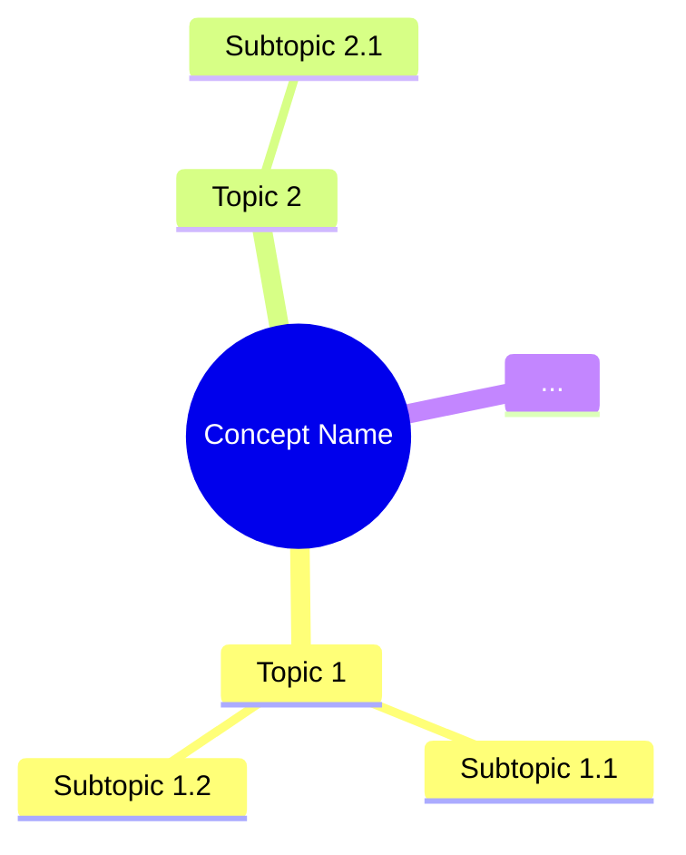
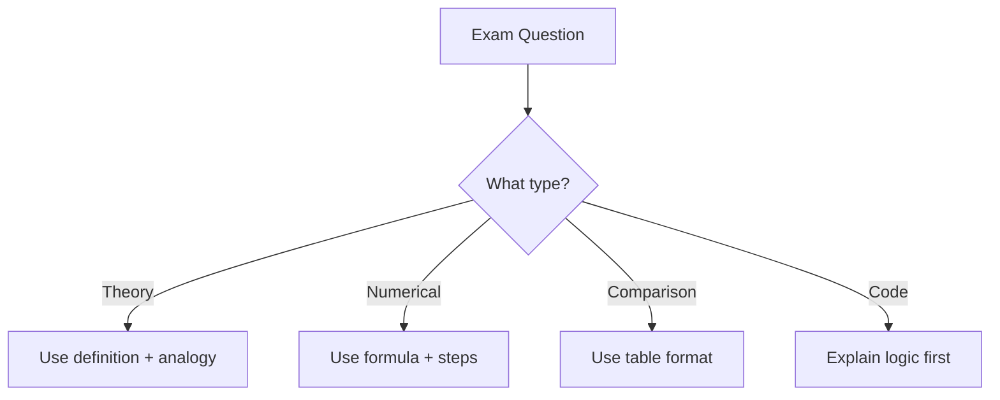

# ExamPreparationClass Workflow

## Overview
This workflow creates a classroom simulation for students learning AI/Machine Learning concepts. It generates two files in a dedicated folder with interactive teacher-student dialogues and comprehensive exam preparation materials.

## Output Structure
```
📁 CL<number>_<ConceptName>/
├── CL<number>_<ConceptName>.md          # Classroom conversation with concepts
└── CL<number>_<ConceptName>_exam_preparation.md  # Exam questions
```

---

## STEP 1: Determine Folder Number
// turbo
1. Check existing `CL*` folders in the workspace to determine the next number.
2. Create folder: `CL<next_number>_<ConceptName>/`

---

## STEP 2: Create Classroom Conversation File (`CL<number>_<ConceptName>.md`)

### 2.1 Language Rule
- **Entire output MUST be in TELGLISH only.**
- **TELGLISH = Telugu + English** (Mix of Telugu and English, written in English alphabets but with Telugu meaning/words)

**Example Telglish sentences:**
- "Ippudu mana CNN concept chuddam" (Now let's see our CNN concept)
- "Idhi chala important concept, interview lo adugutaru" (This is a very important concept, they ask in interview)
- "Oka image ni pixels ga divide cheyyadam" (Dividing an image into pixels)
- "Filters automatically nerchukunattu" (Filters learn automatically)

**Telugu words to use:**
- Ippudu (Now), Mana (Our), Chuddam (Let's see)
- Enduku (Why), Ela (How), Eppudu (When)  
- Chala (Very), Mundu (Before), Tarvata (After)
- Artham (Meaning), Udaharanaku (For example)
- Nenu (I), Meeru (You), Adi (That), Idi (This)

### 2.2 Mandatory Classroom Roles (ALL MUST PARTICIPATE)

#### 1. Teacher / Professor
- AI/ML expert teaching the identified topic.
- Starts with intuition and real-life analogies.
- Explains concepts slowly for mixed-level students.
- Encourages questions.
- Answers all students patiently.
- Explains WHY, WHAT, WHEN, WHERE, HOW naturally.
- Maps concepts to AI/ML models, pipelines, and real systems.

#### 2. Clever Student
- Asks intelligent, analytical questions.
- Connects current topic with other AI/ML concepts.
- Thinks like a future ML engineer / data scientist.

#### 3. Beginner / Dull Student
- Asks very basic or naive questions.
- Represents students new to AI/ML (zero background).
- Needs slow, step-by-step explanation.

#### 4. Critique Student
- Questions assumptions and limitations.
- Asks about drawbacks, failures, bias, overfitting, scalability, edge cases.
- Challenges statements like "This always works".

#### 5. Debate Student
- Compares the topic with alternative methods or algorithms.
- Asks "Why not use another approach?"
- Forces justification of design and choice.

#### 6. Curious Student
- Asks "What happens if…?" and "Why does this work internally?"
- Explores what-if scenarios and edge cases and future possibilities.
- Interested in deeper intuition beyond syllabus.

#### 7. Practical Student
- Focused on exams, interviews, and industry usage.
- Asks:
  - "Will this be asked in exam?"
  - "How will interviewer ask this?"
  - "Where exactly is this used in real ML projects?"
- Interested in implementation intuition (even without code).

### 2.3 Conversation Rules (STRICT)

- Output must be strictly in **dialogue format**.
- Use labels:
  - `Teacher:`
  - `Clever Student:`
  - `Beginner Student:`
  - `Critique Student:`
  - `Debate Student:`
  - `Curious Student:`
  - `Practical Student:`
- Keep explanations friendly and classroom-like.
- Introduce intuition first, formulas later (if any).
- Avoid dumping theory — let it emerge via questions.
- Use student–teacher–exam–project analogies.

### 2.4 Strict Content Rules

1. **Basic to Advanced Flow**: Teacher MUST list all concepts like a MindMap first, then explain from basics to advanced chronologically.
2. **Exhaustive Coverage**: Do NOT miss any concepts. Explain in-depth.
3. **Analogy-First**: Use strong analogies (Teacher-Student-Classroom, Doctor-Patient, Office-Reports) for EVERY complex concept.
4. **Numerical Examples**: Include simple calculations to demonstrate formulas/models.
5. **Visuals (Mermaid)**: MUST use Mermaid diagrams for processes, workflows, architectures, logical flows.
6. **Student Participation**: EVERY student persona MUST have at least one meaningful interaction.

### 2.5 Conversation Structure (STRICT ORDER)

```markdown
# CL<number>: <Concept Name> - Classroom Session

## 🗺️ Mind Map - Topics to Cover
[Teacher lists all topics/subtopics from source material]



## 🎓 Classroom Conversation

### Topic 1: <Topic Name>

**Teacher:** [Introduction with analogy]

**Beginner Student:** [Basic question]

**Teacher:** [Simple explanation with real-life example]

**Clever Student:** [Analytical question connecting to other concepts]

**Teacher:** [Deeper explanation]

[Continue for each topic with ALL student types participating]

### Mermaid Diagrams
[Insert Mermaid diagrams wherever concepts need visual explanation]

### Python Code Examples
[Include Python code with explanations]

### Topic N: <Last Topic>
[Continue pattern...]

---

## 📝 Teacher Summary

**Teacher:** Okay students, let's summarize what we learned today...

### Key Takeaways
- Point 1
- Point 2
- Point 3
- ...

### Common Mistakes
- Mistake 1: [Description] → Correct approach
- Mistake 2: [Description] → Correct approach
- ...
```

### 2.6 Concepts Structure (MANDATORY 12 POINTS)

For **EACH** concept/import, include these **12 Points** in the classroom dialogue:

1. **Definition**: Simple, 10-year-old friendly
2. **Simple Analogy**: Like what in real life?
3. **Why it is used**: What problem it solves
4. **When to use it**: Best conditions
5. **Where to use it**: Real-world examples
6. **Is this the only way?**: Alternatives comparison table
7. **Mermaid Diagram**: Visual explanation
8. **How to use it**: Syntax + Simple code example
9. **How it works internally**: Step-by-step (like recipe steps)
10. **Visual Summary**: Bullet/Flow recap
11. **Advantages & Disadvantages (WITH PROOF)**:
    - Each advantage/disadvantage MUST have:
      - **Claim**: What is being claimed
      - **Proof**: Code example, comparison table, or numerical evidence
      - **Real-Life Analogy**: Why this matters in simple terms
      - **When it matters**: Practical scenarios
12. **Jargon Glossary**: All technical terms explained simply

### 2.7 Jargon Box (MANDATORY)
Every jargon word MUST have a "Simple Explanation" box:

```markdown
> 💡 **Jargon Alert - <Term>**
> Simple Explanation: [Explain like talking to a 10-year-old]
> Example: [Real-life analogy]
```

---

## STEP 3: Create Exam Preparation File (`CL<number>_<ConceptName>_exam_preparation.md`)

### 3.1 File Structure

```markdown
# CL<number>: <Concept Name> - Exam Preparation

## Section A: Multiple Choice Questions (MCQ) - 10+ Questions

### MCQ 1
**Question:** [Question text]

**Options:**
- A) Option 1
- B) Option 2
- C) Option 3
- D) Option 4

**✅ Correct Answer:** [Letter]

**📖 Explanation:** [Why this is correct - simple language]

**❌ Why Others Are Wrong:**
- A) [Why wrong]
- B) [Why wrong]
- C) [Why wrong]
- D) [Why wrong]

---

### MCQ 2
[Continue pattern for 10+ MCQs]

---

## Section B: Multiple Select Questions (MSQ) - 10+ Questions

### MSQ 1
**Question:** [Question text] (Select ALL that apply)

**Options:**
- A) Option 1
- B) Option 2
- C) Option 3
- D) Option 4
- E) Option 5

**✅ Correct Answers:** [Letters, e.g., A, C, D]

**📖 Explanation:** [Why each correct option is correct]

**❌ Why Others Are Wrong:**
- [Incorrect option]: [Why wrong]

---

### MSQ 2
[Continue pattern for 10+ MSQs]

---

## Section C: Numerical/Calculation Questions - 5+ Questions

### Numerical 1
**Question:** [Question with numbers]

**Given:**
- Value 1 = X
- Value 2 = Y

**Solution Steps:**
1. Step 1: [Calculation]
2. Step 2: [Calculation]
3. Step 3: [Final answer]

**✅ Final Answer:** [Number with units]

**🎨 Mermaid Diagram:** 
```mermaid
[If helpful for understanding]
```

---

### Numerical 2
[Continue pattern for 5+ Numerical questions]

---

## Section D: Fill in the Blanks - 5+ Questions

### Fill 1
**Question:** The process of _______ is used to...

**Answer:** [Correct word/phrase]

**Explanation:** [Simple explanation]

---

### Fill 2
[Continue pattern for 5+ Fill in the Blanks]

---

## 📚 Quick Revision Points

### Key Formulas
- Formula 1: [Formula with explanation]
- Formula 2: [Formula with explanation]

### Key Concepts Summary
| Concept | One-Line Definition | When to Use |
|---------|---------------------|-------------|
| Concept 1 | [Definition] | [Scenario] |
| Concept 2 | [Definition] | [Scenario] |

### Common Exam Traps
1. **Trap 1**: [Description] → **Correct Understanding**: [Explanation]
2. **Trap 2**: [Description] → **Correct Understanding**: [Explanation]

---

## 🚀 Section E: Shortcuts & Cheat Codes for Exam

### ⚡ One-Liner Shortcuts
| Concept | Shortcut/Cheat Code | When to Use |
|---------|---------------------|-------------|
| [Concept 1] | [Quick formula/rule] | [Exam scenario] |
| [Concept 2] | [Quick formula/rule] | [Exam scenario] |
| [Concept 3] | [Quick formula/rule] | [Exam scenario] |

### 🎯 Memory Tricks (Mnemonics)
1. **[Concept]**: [Mnemonic] → Helps remember: [What it helps recall]
2. **[Concept]**: [Mnemonic] → Helps remember: [What it helps recall]
3. **[Concept]**: [Mnemonic] → Helps remember: [What it helps recall]

### 🔢 Quick Calculation Hacks
| Scenario | Hack/Shortcut | Example |
|----------|---------------|---------|
| [Scenario 1] | [Quick calculation method] | [Numerical example] |
| [Scenario 2] | [Quick calculation method] | [Numerical example] |

### 📝 Last-Minute Formula Sheet
```
📌 Formula 1: [Formula] → Use when: [Condition]
📌 Formula 2: [Formula] → Use when: [Condition]
📌 Formula 3: [Formula] → Use when: [Condition]
```

### 🎓 Interview One-Liners
| Question Pattern | Safe Answer Template |
|------------------|---------------------|
| "What is [X]?" | "[X] is a technique that..." |
| "Why use [X]?" | "We use [X] because..." |
| "When to use [X] vs [Y]?" | "Use [X] when..., use [Y] when..." |
| "Explain [X] in simple terms" | "[Real-life analogy]" |

### ⚠️ "If You Forget Everything, Remember This"
1. **Golden Rule 1**: [Most important concept to remember]
2. **Golden Rule 2**: [Second most important concept]
3. **Golden Rule 3**: [Third most important concept]

### 🔄 Quick Decision Flowchart


### 🎯 Safe Answer Patterns
- **For "What is X?"** → Definition + One-line use case
- **For "Explain X"** → Analogy + Technical definition + Example
- **For "Compare X vs Y"** → Table with 3-4 differences
- **For "Calculate X"** → Formula + Step-by-step + Final answer with units
- **For "Why X?"** → Problem it solves + Alternative comparison
```

---

## STEP 4: Validation Checklist

Before completing, verify:

- [ ] Folder created with correct naming: `CL<number>_<ConceptName>/`
- [ ] `CL<number>_<ConceptName>.md` created with:
  - [ ] Mind Map at the beginning
  - [ ] ALL 7 student types participated
  - [ ] Telglish language used throughout
  - [ ] Mermaid diagrams included
  - [ ] Numerical examples included
  - [ ] Python code examples included
  - [ ] 12-point structure for each concept
  - [ ] Jargon boxes for technical terms
  - [ ] Teacher Summary at the end
  - [ ] Key Takeaways
  - [ ] Common Mistakes
- [ ] `CL<number>_<ConceptName>_exam_preparation.md` created with:
  - [ ] 10+ MCQs with explanations
  - [ ] 10+ MSQs with explanations
  - [ ] 5+ Numerical questions with step-by-step solutions
  - [ ] 5+ Fill in the Blanks
  - [ ] Quick Revision Points
  - [ ] Shortcuts & Cheat Codes section with:
    - [ ] One-Liner Shortcuts table
    - [ ] Memory Tricks (Mnemonics)
    - [ ] Quick Calculation Hacks
    - [ ] Last-Minute Formula Sheet
    - [ ] Interview One-Liners
    - [ ] Golden Rules ("If You Forget Everything")
    - [ ] Quick Decision Flowchart
    - [ ] Safe Answer Patterns

---

## STEP 0: Analyze ALL Source Files (MANDATORY - DO NOT SKIP)

**⚠️ CRITICAL: Before creating ANY content, you MUST analyze ALL files in the source folder.**

### 0.1 Source Folder Location
- **Primary Source Folder:** `C:\masai\Temp`
- ALL source files (transcripts, notebooks, scripts, docs, presentations) are placed in this folder.

### 0.2 Mandatory Analysis Steps
1. **List ALL files** in `C:\masai\Temp` folder using `list_dir`
2. **Read EVERY file** in the folder:
   - `.txt` files: Read full content using `view_file`
   - `.py` files: Read full content using `view_file`
   - `.ipynb` notebooks: Use `view_file_outline` first, then `view_file` for detailed cells
   - `.md` files: Read full content using `view_file`
   - `.pptx` files: Note the file (cannot read content directly, but mention it exists)
   - `.one` files: OneNote files (cannot read content directly, but mention it exists)
3. **Extract concepts** from ALL files - do not miss any information
4. **Combine information** from all sources into a comprehensive topic coverage

### 0.3 File Types to Analyze
| File Type | How to Analyze |
|-----------|----------------|
| `.txt` | `view_file` - Read entire content |
| `.py` | `view_file` - Read code and comments |
| `.ipynb` | `view_file_outline` + `view_file` for cells |
| `.md` | `view_file` - Read entire content |
| `.pdf` | **LIMITATION:** Cannot be read directly. Ask user to provide key content from PDF or paste PDF text into a .txt file. Note the file exists and inform user. |
| `.pptx` | Note existence (binary file). Ask user if they can export to PDF or copy text content. |
| `.one` | Note existence (binary file). Ask user to export content. |

### 0.3.1 Handling Binary/Unreadable Files
For files that cannot be read directly (`.pdf`, `.pptx`, `.one`, etc.):
1. **Acknowledge** the file exists in your analysis
2. **Inform the user** that these files cannot be read directly
3. **Request** the user to either:
   - Copy-paste key content from the file into a `.txt` file
   - Provide a summary of what the file contains
   - Export the content to a readable format
4. **Continue** with available readable files while waiting for user input on binary files

### 0.4 What to Extract from Each File
- **Transcripts (.txt)**: Concepts explained, examples given, Q&A discussions
- **Pre-reads (.txt)**: Key terms, roadmap, code examples
- **Summaries (.txt)**: Architecture details, key points, term definitions
- **Notebooks (.ipynb)**: Code implementations, practical examples, outputs
- **Notes (.txt/.md)**: Structured concepts, formulas, learning outcomes

---

## Usage Example

**Input Sources:** User can provide any of the following:
- A topic (e.g., "Gradient Descent", "Backpropagation")
- A source file/notebook (.py, .ipynb)
- A transcript (video/audio lecture transcript)
- Documentation, notes, or presentation files
- **Multiple files in `C:\masai\Temp` folder (ALL must be analyzed)**

**📁 Source Folder Location:** `C:\masai\Temp`
- **⚠️ MANDATORY:** Analyze ALL files in this folder, not just one or two.
- Check this folder FIRST and read EVERY file before creating content.
- Combine information from all sources for comprehensive coverage.

**Example Input:** "Gradient Descent" or files from `C:\masai\Temp`

**Output:**
```
📁 CL01_Gradient_Descent/
├── CL01_Gradient_Descent.md
└── CL01_Gradient_Descent_exam_preparation.md
```

---

## Notes

1. **Conversation Length**: Make the classroom dialogue as long as possible to ensure comprehensive coverage.
2. **Natural Flow**: Students should interrupt naturally with questions; avoid dumping theory.
3. **Analogies**: Use Teacher-Student-Exam-Project analogies consistently.
4. **Technical Depth**: Start with intuition, gradually move to formulas and technical details.
5. **Interview Relevance**: Practical Student should ask about interview questions and industry usage.
6. **🚨 DEEP CONVERSATIONS REQUIRED**: Create MORE and MORE deep conversations with **AT LEAST 3000 LINES** in the classroom conversation file. Cover every concept exhaustively with multiple rounds of Q&A, detailed explanations, extended examples, and thorough discussions.

---

## STEP 5: Multiple File Rule (MANDATORY for Large Topics)

**⚠️ CRITICAL: If the topic is too large to cover all concepts comprehensively in a single file, you MUST create multiple MD files.**

### 5.1 When to Split Content
Split content into multiple files when:
- The source material contains too many concepts to cover exhaustively in one file
- The mind map shows more than 10+ major topics with subtopics
- Deep explanations would make a single file exceed manageable reading length
- You need to ensure ALL topics from source/mind map are covered without shortcuts

### 5.2 File Naming Convention
Use incremental numbering with the folder name:
```
📁 <FolderName>/
├── <FolderName>1.md          # Part 1 of classroom conversation
├── <FolderName>2.md          # Part 2 of classroom conversation
├── <FolderName>3.md          # Part 3 of classroom conversation (if needed)
├── ...
└── <FolderName>_exam_preparation.md  # Single exam preparation file
```

**Example:**
```
📁 AS40_RegularizationGeneralization/
├── AS40_RegularizationGeneralization1.md    # Generalization, Underfitting, Overfitting
├── AS40_RegularizationGeneralization2.md    # L1 & L2 Regularization
├── AS40_RegularizationGeneralization3.md    # Dropout & Learning Curves
└── AS40_RegularizationGeneralization_exam_preparation.md
```

### 5.3 Content Distribution Rules
1. **Each file should be self-contained**: Include the relevant section of the mind map at the beginning
2. **Maintain classroom continuity**: Use transition dialogues between files (e.g., "Okay students, let's continue from where we left off...")
3. **Cover ALL topics**: Do NOT skip or summarize any concept - explain each one exhaustively
4. **Balance**: Distribute topics logically based on content relationship

### 5.4 File Content Structure
Each numbered file should have:
1. A continuation note linking to previous files
2. The relevant mind map section for that file's topics
3. Complete classroom dialogue for assigned topics
4. Teacher summary for that portion (if file ends mid-session)

**First file header example:**
```markdown
# AS40: Regularization and Generalization - Classroom Session (Part 1)

> 📚 **This is Part 1** covering: Generalization, Underfitting, Overfitting
> 📘 **See also:** [Part 2](./AS40_RegularizationGeneralization2.md), [Part 3](./AS40_RegularizationGeneralization3.md)
```

**Subsequent file header example:**
```markdown
# AS40: Regularization and Generalization - Classroom Session (Part 2)

> 📚 **This is Part 2** covering: L1 Regularization (Lasso), L2 Regularization (Ridge), Elastic Net
> 📘 **Previous:** [Part 1](./AS40_RegularizationGeneralization1.md)
> 📘 **Next:** [Part 3](./AS40_RegularizationGeneralization3.md)
```
