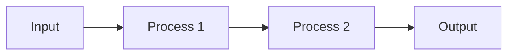

# Per-Line Code Explanation Workflow

This workflow explains a single line of code following the strict 2.1-2.7 format.

## Prerequisites
- The specific line of code to explain
- Context of where the line appears

---

## Explanation Format (MANDATORY)

For EVERY line of code (including imports), create a Markdown explanation with ALL these sections:

```markdown
### 🔹 Line Explanation

**Code Line:**
```python
[the actual line of code]
```

---

#### 2.1 What the Line Does
- Clear, simple description
- What action is performed
- What result is produced

#### 2.2 Why It Is Used
- What problem does it solve
- **Is this the only way?**
  - Alternative approaches
  - Why this approach is better/chosen
  - Comparison table (if applicable)

| Approach | Pros | Cons |
|----------|------|------|
| Current | [pros] | [cons] |
| Alternative 1 | [pros] | [cons] |

#### 2.3 When to Use It
- Specific scenarios
- Conditions that require this
- Triggers for using this

#### 2.4 Where to Use It
- Real-world applications
- Industry examples
- Project types

#### 2.5 How to Use It (Syntax + Examples)
- **Syntax:**
```python
[general syntax pattern]
```
- **Example 1:** [simple example]
- **Example 2:** [variation]
- **Example 3:** [edge case]

#### 2.6 How It Works Internally
- Step-by-step internal process
- Memory/processing explanation
- Behind-the-scenes operations
- Use simple analogies



#### 2.7 Output with Sample Examples
- **Input:**
```python
[sample input]
```
- **Output:**
```
[expected output]
```
- **Explanation:** [what the output means]
```

---

## Example: Explaining an Import Line

### 🔹 Line Explanation

**Code Line:**
```python
import numpy as np
```

---

#### 2.1 What the Line Does
This line imports the NumPy library and gives it the alias `np` for shorter access.

#### 2.2 Why It Is Used
NumPy provides fast numerical operations on arrays.

**Is this the only way?**
| Approach | Pros | Cons |
|----------|------|------|
| `import numpy as np` | Short, standard | Requires alias |
| `import numpy` | Full name | Longer to type |
| `from numpy import *` | No prefix needed | Namespace pollution |

**Chosen:** `import numpy as np` is the industry standard.

#### 2.3 When to Use It
- Working with numerical data
- Need fast array operations
- Scientific computing tasks

#### 2.4 Where to Use It
- Data Science projects
- Machine Learning models
- Scientific simulations
- Image processing

#### 2.5 How to Use It
**Syntax:**
```python
import library_name as alias
```

**Example 1:** Create array
```python
arr = np.array([1, 2, 3])
```

**Example 2:** Mathematical operation
```python
result = np.mean(arr)
```

#### 2.6 How It Works Internally
1. Python searches for `numpy` in installed packages
2. Loads the module into memory
3. Creates reference `np` pointing to the module
4. All NumPy functions accessible via `np.function_name()`

#### 2.7 Output with Sample Examples
```python
import numpy as np
arr = np.array([1, 2, 3])
print(arr)
```
**Output:**
```
[1 2 3]
```

---

## Validation Checklist
- [ ] Section 2.1 present and clear
- [ ] Section 2.2 includes alternatives comparison
- [ ] Section 2.3 gives specific scenarios
- [ ] Section 2.4 includes real-world examples
- [ ] Section 2.5 has syntax + multiple examples
- [ ] Section 2.6 explains internal workings
- [ ] Section 2.7 shows actual input/output
