# 📚 Concepts Explained - AI Landing Zone Safety

## 🗂️ Table of Contents
1. [Machine Learning Classification](#1-machine-learning-classification)
2. [Random Forest Classifier](#2-random-forest-classifier)
3. [Train-Test Split](#3-train-test-split)
4. [Feature Scaling (StandardScaler)](#4-feature-scaling-standardscaler)
5. [Confusion Matrix](#5-confusion-matrix)
6. [Precision, Recall, F1-Score](#6-precision-recall-f1-score)
7. [ROC-AUC Curve](#7-roc-auc-curve)
8. [Feature Importance](#8-feature-importance)
9. [Spatial Heatmap Visualization](#9-spatial-heatmap-visualization)

---

## 1. Machine Learning Classification

### 1.1 Definition
Machine Learning Classification is teaching a computer to **sort things into categories** based on examples.

**Exam-friendly**: "Classification is a supervised learning task where the model predicts discrete class labels."

### 1.2 Why It Is Used
| Problem | Solution |
|---------|----------|
| Can't manually check thousands of landing zones | Train AI to do it automatically |
| Need consistent, fast decisions | Model applies same rules every time |
| Complex patterns in data | ML finds patterns humans miss |

### 1.3 When To Use It
- When you have **labeled data** (examples with known answers)
- When output is **categorical** (safe/unsafe, yes/no, cat/dog)
- When patterns are complex

### 1.4 Where To Use It
- 🏥 Medical diagnosis (disease/healthy)
- 📧 Email (spam/not spam)
- 🏦 Banking (fraud/legitimate)
- 🛬 Our project (safe/unsafe landing zone)

### 1.5 Is This The Only Way?

| Approach | Pros | Cons | When to Use |
|----------|------|------|-------------|
| **ML Classification** | Learns patterns, handles complexity | Needs training data | Complex patterns |
| Rule-based | Simple, interpretable | Rigid, misses patterns | Simple, well-defined rules |
| Deep Learning | Very powerful | Needs huge data | Images, text, speech |

**Why we chose Classification**: We have labeled data and moderate complexity.

### 1.6 Diagram


### 1.7 How To Use It
```python
from sklearn.ensemble import RandomForestClassifier

# Create model
model = RandomForestClassifier()

# Train on examples
model.fit(X_train, y_train)

# Predict new data
predictions = model.predict(X_test)
```

### 1.8 How It Works Internally
1. **Training**: Model sees many examples (features + labels)
2. **Pattern Learning**: Finds rules that map features → labels
3. **Testing**: Uses learned rules on new data
4. **Prediction**: Outputs most likely class

### 1.9 Visual Summary
```
📊 Data → 🔄 Split → 🧠 Train → 📏 Test → ✅ Deploy
```

### 1.10 Advantages
- ✅ Handles complex patterns automatically
- ✅ Fast predictions once trained
- ✅ Consistent decisions
- ✅ Can improve with more data

### 1.11 Disadvantages
- ❌ Needs labeled training data
- ❌ May not generalize to very different data
- ❌ Can be a "black box" (hard to explain)

### 1.12 Exam & Interview Points
> **Q: What is classification?**  
> A: Predicting discrete class labels from input features.

> **Q: Classification vs Regression?**  
> A: Classification = categories (safe/unsafe), Regression = numbers (temperature)

---

## 2. Random Forest Classifier

### 2.1 Definition
Random Forest is an **ensemble** of many decision trees that vote together for the final prediction.

**Exam-friendly**: "Random Forest combines multiple decision trees using bagging to reduce overfitting and improve accuracy."

### 2.2 Why It Is Used
- Single tree → overfits (memorizes training data)
- Many trees → more robust, generalizes better
- Like asking 100 experts instead of 1!

### 2.3 When To Use It
- Medium-sized tabular datasets
- When you want feature importance
- When interpretability is somewhat important

### 2.4 Where To Use It
- Credit scoring, fraud detection
- Medical diagnosis
- Our project: Landing zone safety

### 2.5 Alternatives Comparison

| Algorithm | Pros | Cons | Best For |
|-----------|------|------|----------|
| **Random Forest** | Robust, feature importance | Slower for very large data | Medium data, need interpretability |
| Logistic Regression | Fast, interpretable | Linear only | Simple problems |
| XGBoost/LightGBM | Very accurate | Harder to tune | Competitions, production |
| Neural Network | Handles complex patterns | Needs lots of data | Images, text, big data |

**Why RF here**: Good balance of accuracy and interpretability.

### 2.6 Diagram

```mermaid
flowchart TB
    subgraph Data["📊 Data"]
        D["Training Data"]
    end
    
    subgraph Forest["🌲 Random Forest"]
        T1["Tree 1"]
        T2["Tree 2"]
        T3["Tree 3"]
        TN["Tree N"]
    end
    
    subgraph Vote["🗳️ Voting"]
        V["Majority Vote"]
    end
    
    D --> T1 & T2 & T3 & TN
    T1 & T2 & T3 & TN --> V
    V --> R["Final Prediction"]
```



### 2.7 How To Use It
```python
from sklearn.ensemble import RandomForestClassifier

model = RandomForestClassifier(
    n_estimators=100,    # 100 trees
    max_depth=10,        # Limit depth
    random_state=42      # Reproducibility
)
model.fit(X_train, y_train)
```

### 2.8 How It Works Internally
1. **Bootstrap**: Each tree gets random sample of data
2. **Random Features**: Each split considers random subset of features
3. **Grow Trees**: Build many independent trees
4. **Vote**: For classification, majority wins

### 2.9 Key Parameters

| Parameter | What | Default | Our Value |
|-----------|------|---------|-----------|
| n_estimators | Number of trees | 100 | 100 |
| max_depth | Max tree depth | None | 10 |
| min_samples_split | Min samples to split | 2 | 5 |
| random_state | Random seed | None | 42 |

### 2.10 Advantages
- ✅ Handles non-linear relationships
- ✅ Resistant to overfitting (vs single tree)
- ✅ Gives feature importance
- ✅ Works well out-of-the-box

**Proof**: Single tree accuracy ~75%, Random Forest ~85%

### 2.11 Disadvantages
- ❌ Less interpretable than single tree
- ❌ Slower to train than simple models
- ❌ Can't extrapolate beyond training range

**Proof**: Training time ~5s vs LogisticRegression ~0.1s

### 2.12 Exam & Interview Points
> **Q: Why "Random"?**  
> A: Random sampling of data (bagging) + random feature selection at each split.

> **Q: Random Forest vs Decision Tree?**  
> A: RF = many trees voting, DT = single tree. RF is more robust.

---

## 3. Train-Test Split

### 3.1 Definition
Dividing dataset into two parts: **training set** (to learn) and **test set** (to evaluate).

### 3.2 Why It Is Used
- Training on ALL data → can't tell if model generalizes
- Like studying and taking exam on same questions = cheating!

### 3.3 When To Use It
ALWAYS before training an ML model.

### 3.4 Typical Splits
| Split | Training | Testing | Use Case |
|-------|----------|---------|----------|
| 80/20 | 80% | 20% | Standard |
| 70/30 | 70% | 30% | Smaller datasets |
| 90/10 | 90% | 10% | Large datasets |

### 3.5 Diagram

```mermaid
flowchart LR
    D["📊 Full Dataset\n(100%)"] --> S["🔄 Split"]
    S --> TR["🎓 Training\n(80%)"]
    S --> TE["📝 Testing\n(20%)"]
    TR --> M["🤖 Model"]
    M --> E["📏 Evaluate"]
    TE --> E
```



### 3.6 Code
```python
from sklearn.model_selection import train_test_split

X_train, X_test, y_train, y_test = train_test_split(
    X, y,
    test_size=0.2,      # 20% for testing
    random_state=42,    # Reproducibility
    stratify=y          # Keep class balance
)
```

### 3.7 Important: Stratify
When classes are imbalanced, use `stratify=y` to maintain same class proportions in both sets.

### 3.8 Exam Points
> **Q: Why not train on all data?**  
> A: Can't measure generalization; model may overfit.

---

## 4. Feature Scaling (StandardScaler)

### 4.1 Definition
Transforming features to have **mean=0** and **standard deviation=1**.

**Formula**: `scaled = (value - mean) / std`

### 4.2 Why It Is Used
- Features have different scales (slope: 0-20, roughness: 0-1)
- Some algorithms sensitive to scale
- Larger values would dominate otherwise

### 4.3 Diagram


### 4.4 Code
```python
from sklearn.preprocessing import StandardScaler

scaler = StandardScaler()
X_train_scaled = scaler.fit_transform(X_train)  # Fit + transform
X_test_scaled = scaler.transform(X_test)        # Only transform!
```

### 4.5 Important Warning
> ⚠️ **NEVER** fit scaler on test data - causes data leakage!

---

## 5. Confusion Matrix

### 5.1 Definition
A table showing actual vs predicted classifications.

### 5.2 Structure

```
                  PREDICTED
                Unsafe   Safe
        Unsafe    TN      FP
ACTUAL  
        Safe      FN      TP
```

| Term | Full Name | Meaning |
|------|-----------|---------|
| TN | True Negative | Correctly predicted Unsafe |
| TP | True Positive | Correctly predicted Safe |
| FP | False Positive | Wrongly predicted Safe (actually Unsafe) |
| FN | False Negative | Wrongly predicted Unsafe (actually Safe) |

### 5.3 Diagram


### 5.4 For Safety-Critical Systems
> ⚠️ **False Negative (FN) is DANGEROUS**  
> Predicting "unsafe" when actually SAFE = missed opportunity  
> Predicting "safe" when actually UNSAFE = **CRASH!**

---

## 6. Precision, Recall, F1-Score

### 6.1 Definitions

| Metric | Formula | Meaning |
|--------|---------|---------|
| **Precision** | TP / (TP + FP) | "When I predict Safe, how often am I right?" |
| **Recall** | TP / (TP + FN) | "Of all actually Safe, how many did I find?" |
| **F1-Score** | 2 × (P × R) / (P + R) | Harmonic mean of Precision and Recall |

### 6.2 Real-Life Analogy
- **Precision**: Doctor who only diagnoses when 100% sure (few mistakes, but may miss cases)
- **Recall**: Doctor who catches every possible case (finds all sick, but some false alarms)

### 6.3 Which To Prioritize?

| Situation | Prioritize | Why |
|-----------|------------|-----|
| Medical diagnosis | Recall | Don't miss sick patients |
| Spam filter | Precision | Don't block important emails |
| **Drone landing** | **Recall** | **Don't land on unsafe zones!** |

### 6.4 Diagram

```mermaid
flowchart TB
    subgraph Reality["🌍 Reality"]
        AS["All Safe\n(100)"]
    end
    
    subgraph Prediction["🤖 Model"]
        PS["Predicted Safe\n(90)"]
    end
    
    subgraph Metrics["📏 Metrics"]
        P["Precision = 85/90\n= 94.4%"]
        R["Recall = 85/100\n= 85%"]
    end
    
    AS --> |"Found 85"| PS
    PS --> P
    AS --> R
```



---

## 7. ROC-AUC Curve

### 7.1 Definition
- **ROC**: Receiver Operating Characteristic curve
- **AUC**: Area Under the Curve

Plots True Positive Rate vs False Positive Rate at different thresholds.

### 7.2 How To Read It

| AUC Value | Meaning |
|-----------|---------|
| 1.0 | Perfect classifier |
| 0.9-1.0 | Excellent |
| 0.8-0.9 | Good |
| 0.7-0.8 | Fair |
| 0.5 | Random guessing |
| < 0.5 | Worse than random |

### 7.3 Diagram


### 7.4 Why AUC Matters
- Threshold-independent measure
- Works even with imbalanced classes
- Single number to compare models

---

## 8. Feature Importance

### 8.1 Definition
Measures how much each feature contributes to predictions.

### 8.2 How Random Forest Calculates It
1. For each tree, track how much each feature improves splits
2. Average across all trees
3. Normalize to sum to 1

### 8.3 Our Feature Importance Results

| Feature | Importance | Interpretation |
|---------|------------|----------------|
| slope_deg | High | Steep = unsafe |
| roughness | High | Bumpy = unsafe |
| confidence_score | Medium | Model certainty |
| object_density | Medium | Obstacles = unsafe |
| shadow_fraction | Low | Visibility factor |

### 8.4 Why Useful
- Understand model decisions
- Identify key factors
- Reduce features if needed

---

## 9. Spatial Heatmap Visualization

### 9.1 Definition
A color-coded grid showing safety predictions across geographic areas.

### 9.2 Color Coding

| Color | Safety Score | Meaning |
|-------|--------------|---------|
| 🟢 Green | > 70% | Safe to land |
| 🟡 Yellow | 30-70% | Proceed with caution |
| 🔴 Red | < 30% | Avoid |

### 9.3 Why Heatmaps?
- Humans understand colors faster than numbers
- Shows spatial patterns at a glance
- Enables quick decision-making

### 9.4 Code
```python
import matplotlib.pyplot as plt

plt.imshow(heatmap_data, cmap='RdYlGn', vmin=0, vmax=1)
plt.colorbar(label='Safety Score')
plt.title('Landing Zone Safety Heatmap')
plt.show()
```

---

## 📖 Jargon Glossary

| Term | Simple Meaning |
|------|----------------|
| **Classification** | Sorting into categories |
| **Ensemble** | Combining multiple models |
| **Bagging** | Training on random subsets |
| **Overfitting** | Model memorizes, doesn't generalize |
| **Stratify** | Keep class proportions equal |
| **Threshold** | Cutoff for making decisions |
| **AUC** | Area under curve (quality measure) |
| **Feature** | Input variable (column) |
| **Label** | Target variable (answer) |
| **Hyperparameter** | Setting we choose before training |
