# 📋 Interview Preparation - Quick Revision Sheet

## 🎯 30-Second Project Summary

**Problem**: Classify drone landing zones as safe or unsafe using terrain features.

**Solution**: 
1. Trained Random Forest on 3000 landing zone samples
2. Achieved ~85% accuracy, 0.91 AUC
3. Created safety heatmaps for spatial visualization
4. Generated autonomous landing recommendations

**Key Features**: slope, roughness, edge_density, ndvi, shadow, brightness, object_density, confidence

---

## 📖 Key Terms Glossary

| Term | Definition |
|------|------------|
| **Classification** | Predicting categories (safe/unsafe) |
| **Random Forest** | Ensemble of decision trees that vote |
| **Bagging** | Bootstrap aggregating - random sampling with replacement |
| **Precision** | TP / (TP + FP) - "When I say safe, am I right?" |
| **Recall** | TP / (TP + FN) - "Did I find all safe zones?" |
| **F1-Score** | Harmonic mean of precision and recall |
| **ROC-AUC** | Area under ROC curve (0.5=random, 1=perfect) |
| **Confusion Matrix** | Table: Actual vs Predicted |
| **False Negative** | Predicted unsafe, actually safe (missed!) |
| **False Positive** | Predicted safe, actually unsafe (DANGEROUS!) |
| **Stratify** | Keep class proportions in train/test split |
| **Feature Scaling** | Normalize features to same scale |
| **Overfitting** | Model memorizes, doesn't generalize |
| **Hyperparameter** | Setting chosen before training |
| **Ensemble** | Combining multiple models |

---

## 🔟 Top 10 Points to Remember

1. **Classification = categories, Regression = numbers**

2. **Random Forest = many trees voting together**
   - More robust than single tree
   - Provides feature importance

3. **Never fit scaler on test data** (data leakage!)
   ```python
   scaler.fit_transform(X_train)  # Fit + transform
   scaler.transform(X_test)       # Only transform!
   ```

4. **For safety: prioritize Recall**
   - Missing unsafe zones is DANGEROUS
   - False negatives > False positives (in terms of risk)

5. **Accuracy can be misleading**
   - 95% accuracy possible by predicting "always safe"
   - But misses 100% of unsafe zones!

6. **ROC-AUC interpretation**:
   - 0.5 = random guessing
   - 0.7-0.8 = fair
   - 0.8-0.9 = good
   - 0.9+ = excellent

7. **Feature importance shows what matters**
   - Slope and roughness are top factors
   - Physical terrain > visual features

8. **train_test_split with stratify=y**
   - Maintains class balance in both sets
   - Important for imbalanced data

9. **Confusion Matrix corners**:
   ```
              Predicted
            Unsafe  Safe
   Actual  
   Unsafe    TN      FP ← (falsely safe)
   Safe      FN      TP
   ```

10. **Model is a tool, not a decision-maker**
    - Add human override for low confidence
    - Use multi-sensor verification

---

## 📊 Comparison Tables

### Classification vs Regression
| Aspect | Classification | Regression |
|--------|---------------|------------|
| Output | Discrete (categories) | Continuous (numbers) |
| Example | Safe/Unsafe | Price: $45.50 |
| Metrics | Accuracy, F1, AUC | MSE, MAE, R² |
| Algorithms | RF, SVM, LogReg | Linear Reg, RF Regressor |

### Precision vs Recall
| Aspect | Precision | Recall |
|--------|-----------|--------|
| Formula | TP/(TP+FP) | TP/(TP+FN) |
| Question | "How accurate are positive predictions?" | "How many positives did I find?" |
| Prioritize when | False positives are costly | False negatives are costly |
| Drone safety | Less critical | **More critical** |

### Random Forest vs Other Algorithms
| Algorithm | Pros | Cons | Use When |
|-----------|------|------|----------|
| Random Forest | Robust, feature importance | Slower | Need interpretability |
| XGBoost | Very accurate | Harder to tune | Competitions |
| Logistic Reg | Fast, simple | Linear only | Simple problems |
| Neural Net | Handles complex | Needs lots of data | Images, text |

### Training vs Testing
| Aspect | Training Set | Test Set |
|--------|--------------|----------|
| Purpose | Learn patterns | Evaluate generalization |
| Size | 80% | 20% |
| Model sees | Yes | No (until evaluation) |
| Fit transformers | Yes | No! |

---

## 📝 Cheat Sheet

### Essential Python Code
```python
# Imports
import pandas as pd
from sklearn.model_selection import train_test_split
from sklearn.ensemble import RandomForestClassifier
from sklearn.metrics import accuracy_score, precision_score, recall_score

# Split data
X_train, X_test, y_train, y_test = train_test_split(
    X, y, test_size=0.2, random_state=42, stratify=y
)

# Train model
model = RandomForestClassifier(n_estimators=100, random_state=42)
model.fit(X_train, y_train)

# Predict and evaluate
y_pred = model.predict(X_test)
print(f"Accuracy: {accuracy_score(y_test, y_pred):.2f}")
print(f"Precision: {precision_score(y_test, y_pred):.2f}")
print(f"Recall: {recall_score(y_test, y_pred):.2f}")
```

### Metric Formulas
```
Accuracy   = (TP + TN) / Total
Precision  = TP / (TP + FP)
Recall     = TP / (TP + FN)
F1-Score   = 2 × (P × R) / (P + R)
```

### Key Hyperparameters (Random Forest)
| Parameter | Description | Typical Value |
|-----------|-------------|---------------|
| n_estimators | Number of trees | 100-500 |
| max_depth | Max tree depth | 5-20 |
| min_samples_split | Min samples to split | 2-10 |
| random_state | Seed for reproducibility | 42 |

---

## 📊 Summary Diagram

```mermaid
flowchart LR
    subgraph Data["📊 Data"]
        A["3000 Zones\n8 Features"]
    end
    
    subgraph Split["🔄 Split"]
        B["80% Train\n20% Test"]
    end
    
    subgraph Model["🤖 Model"]
        C["Random Forest\n100 Trees"]
    end
    
    subgraph Metrics["📏 Metrics"]
        D["85% Accuracy\n0.91 AUC"]
    end
    
    subgraph Output["📤 Output"]
        E["Safety Heatmap\nRecommendations"]
    end
    
    Data --> Split --> Model --> Metrics --> Output
```



---

## ⚡ Read in 10 Minutes Revision

1. **What**: Drone landing zone safety classification
2. **Why**: Autonomous drones need to land safely
3. **How**: Random Forest on terrain features
4. **Features**: slope, roughness, vegetation, obstacles, shadows
5. **Target**: Safe (1) or Unsafe (0)
6. **Split**: 80% train, 20% test with stratify
7. **Model**: RandomForestClassifier(n_estimators=100)
8. **Metrics**: Accuracy ~85%, AUC ~0.91
9. **Key insight**: Recall matters more than precision for safety
10. **Output**: Safety heatmap + landing recommendations

**Remember**: 
- False negatives are DANGEROUS (predicted safe, actually unsafe)
- Use human override for low-confidence predictions
- Physical terrain (slope, roughness) matters most
