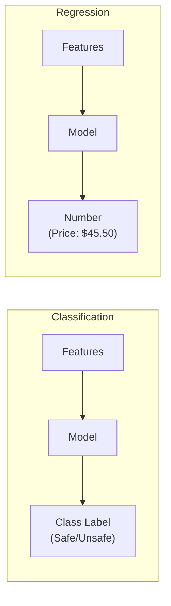
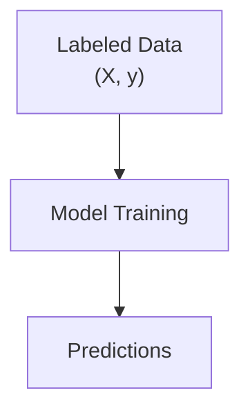
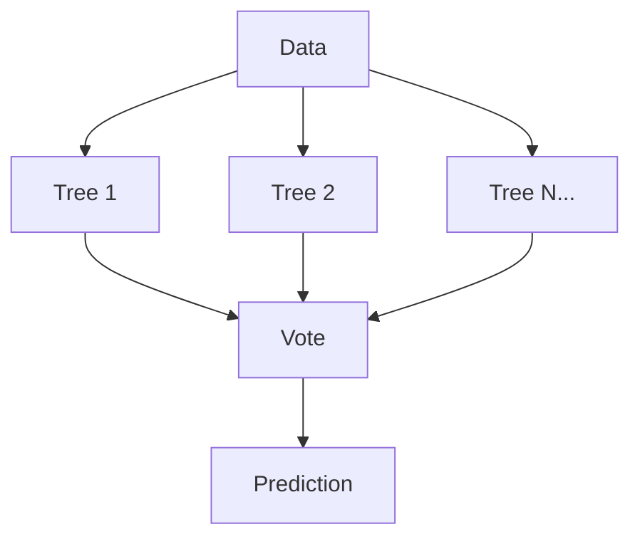
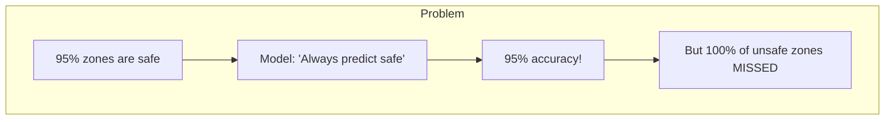
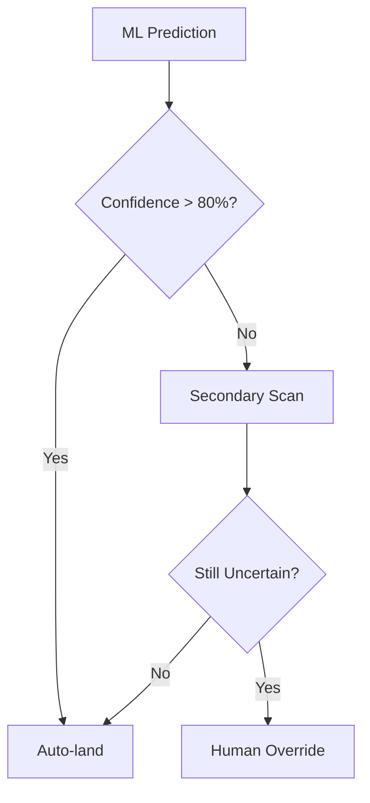

# 🎤 Interview Questions - AI Landing Zone Safety

## 📚 Table of Contents
1. [Machine Learning Basics](#1-machine-learning-basics)
2. [Random Forest Questions](#2-random-forest-questions)
3. [Metrics Questions](#3-metrics-questions)
4. [Safety-Critical AI](#4-safety-critical-ai)
5. [Feature Engineering](#5-feature-engineering)
6. [Deployment Questions](#6-deployment-questions)

---

## 1. Machine Learning Basics

### Q1: What is the difference between Classification and Regression?

**Simple Answer (for 10-year-old)**:
Classification is like sorting fruits into boxes (apple box, orange box). Regression is like guessing how much a fruit weighs.

**Technical Answer**:
- **Classification**: Predicts discrete class labels (safe/unsafe, spam/not spam)
- **Regression**: Predicts continuous numerical values (price, temperature)



**Real-life analogy**: 
- Classification = Which drawer does this sock go in? (sock drawer, t-shirt drawer)
- Regression = How tall will this child be at age 18?

**Common mistakes**: Confusing them! Remember: Categories = Classification, Numbers = Regression.

**Key points**:
- Classification outputs are discrete
- Regression outputs are continuous
- Same algorithms can work for both (e.g., Neural Networks)

---

### Q2: What is Supervised Learning?

**Simple Answer**:
Learning with a teacher! You show the computer examples WITH the correct answers.

**Technical Answer**:
Training a model using labeled data where each input has a known output. The model learns the mapping from inputs to outputs.



**Real-life analogy**: Like flashcards - you see the question AND answer, then learn the pattern.

---

### Q3: Why do we split data into Training and Testing sets?

**Simple Answer**:
You can't grade yourself on the homework you already saw! You need a surprise quiz.

**Technical Answer**:
- **Training set**: Model learns patterns
- **Test set**: Evaluates if model generalizes to unseen data
- Prevents overfitting (memorizing instead of learning)

**Common mistake**: Using test data during training (data leakage)

**Key points**:
- Typical split: 80% train, 20% test
- Use `stratify=y` for imbalanced classes
- Never fit transformers on test data

---

## 2. Random Forest Questions

### Q4: Explain Random Forest in simple terms.

**Simple Answer**:
Imagine 100 teachers grading your exam. Each teacher looks at different things. They vote, and the majority wins!

**Technical Answer**:
Random Forest is an ensemble method that:
1. Creates many decision trees (100+)
2. Each tree trained on random data subset (bagging)
3. Each split considers random features
4. Final prediction = majority vote (classification) or average (regression)



**Why better than single tree?**
- Single tree overfits
- Multiple trees average out errors
- More robust to noise

---

### Q5: What is "bagging"?

**Simple Answer**:
Taking random samples with replacement - like picking names from a hat, but putting them back after each pick.

**Technical Answer**:
- **B**ootstrap **AGG**regat**ING**
- Each tree gets a random sample of data
- Some samples repeated, some left out
- Reduces variance and overfitting

---

### Q6: What are the key hyperparameters in Random Forest?

**Technical Answer**:

| Parameter | What it does | Default | Tuning tip |
|-----------|--------------|---------|------------|
| n_estimators | Number of trees | 100 | More = better but slower |
| max_depth | Tree depth limit | None | Lower = less overfit |
| min_samples_split | Min samples to split | 2 | Higher = less overfit |
| max_features | Features per split | sqrt(n) | Lower = more diversity |

---

## 3. Metrics Questions

### Q7: Why is accuracy not enough for safety-critical systems?

**Simple Answer**:
If 95% of landing zones are safe, just saying "everything is safe" gives 95% accuracy - but misses ALL dangerous zones!

**Technical Answer**:
- Accuracy misleading with imbalanced classes
- For safety: False Negatives (predicting safe when unsafe) are DANGEROUS
- Need to prioritize Recall for the unsafe class



**Key point**: In safety systems, a miss could mean a crash!

---

### Q8: Explain Precision vs Recall with an example.

**Simple Answer**:
- **Precision**: "When I say 'safe', am I right?"
- **Recall**: "Did I find ALL the safe zones?"

**Technical Answer**:
```
Precision = TP / (TP + FP)
Recall = TP / (TP + FN)
```

**Example** (100 zones, 60 safe, 40 unsafe):
| Metric | Value | Meaning |
|--------|-------|---------|
| Precision | 50/55 = 91% | 91% of "safe" predictions correct |
| Recall | 50/60 = 83% | Found 83% of all safe zones |

**Real-life analogy**:
- Precision = Doctor who only diagnoses when SURE (few false alarms)
- Recall = Doctor who catches EVERY possible case (no misses)

---

### Q9: What is ROC-AUC and why is it useful?

**Simple Answer**:
A single number (0-1) that tells how good your model is at separating classes. Higher = better.

**Technical Answer**:
- **ROC**: True Positive Rate vs False Positive Rate at different thresholds
- **AUC**: Area Under the ROC Curve
- AUC = 0.5 → Random guessing
- AUC = 1.0 → Perfect classifier

**Why useful?**
- Threshold-independent
- Works with imbalanced classes
- Single number comparison

---

## 4. Safety-Critical AI

### Q10: How would you handle false negatives in a drone landing system?

**Simple Answer**:
Add backup checks! Don't trust just one system.

**Technical Answer**:
1. **Lower prediction threshold**: Predict "unsafe" unless very confident safe
2. **Secondary sensors**: LiDAR, ultrasonic for verification
3. **Human override**: Alert operator for uncertain cases
4. **Fallback behavior**: Hover and rescan if unsure



---

### Q11: What's the difference between model-based and rule-based safety?

**Technical Answer**:

| Aspect | Model-based | Rule-based |
|--------|-------------|------------|
| Definition | ML learns from data | Hard-coded if-then rules |
| Flexibility | Adapts to patterns | Fixed rules |
| Interpretability | Can be opaque | Very clear |
| Edge cases | May handle | Must be programmed |
| Example | Random Forest | "If slope > 15°, unsafe" |

**Best practice**: Combine both! Use ML for predictions, rules for safety overrides.

---

## 5. Feature Engineering

### Q12: Why is feature scaling important?

**Simple Answer**:
If one feature goes 0-1000 and another 0-1, the big one will dominate unfairly.

**Technical Answer**:
- Algorithms like SVM, Neural Networks, KNN are distance-based
- Large-scale features dominate distance calculations
- StandardScaler: mean=0, std=1

**Note**: Random Forest doesn't need scaling (tree-based), but we do it anyway for consistency.

---

### Q13: How would you improve the drone landing model?

**Technical Answer**:
1. **Feature Engineering**:
   - Combine slope × roughness
   - Add weather features
   - Include GPS coordinates

2. **Model Improvements**:
   - Try XGBoost/LightGBM
   - Ensemble with neural network
   - Calibrate probabilities

3. **Data Improvements**:
   - Collect more data
   - Add real landing outcomes
   - Balance classes if needed

---

## 6. Deployment Questions

### Q14: How would you deploy this model on a drone?

**Simple Answer**:
Make the model smaller, put it on the drone's computer, test it A LOT before flying!

**Technical Answer**:
1. **Model Optimization**:
   - Reduce tree depth
   - Limit n_estimators
   - Quantize if needed

2. **Edge Deployment**:
   - Export to ONNX/TensorFlow Lite
   - Run on embedded GPU (Jetson)
   - Optimize for latency

3. **Safety Measures**:
   - Extensive simulation testing
   - Gradual rollout
   - Kill switch/override

---

### Q15: What monitoring would you set up in production?

**Technical Answer**:
1. **Model Metrics**:
   - Prediction distribution drift
   - Feature drift detection
   - Latency monitoring

2. **Safety Metrics**:
   - False negative rate
   - Override frequency
   - Near-miss incidents

3. **Operational Metrics**:
   - API response times
   - Model version tracking
   - Error logging

---

## 📋 Quick Reference Table

| Concept | One-line Definition |
|---------|---------------------|
| Classification | Predicting categories |
| Random Forest | Multiple trees voting |
| Precision | Correct among predicted positive |
| Recall | Found among actual positive |
| F1-Score | Harmonic mean of P & R |
| ROC-AUC | Area under ROC curve |
| Overfitting | Memorizing, not learning |
| Feature Scaling | Normalizing to same scale |
| Train-Test Split | Separate learning and evaluation |
| Confusion Matrix | Actual vs Predicted table |
