# 📊 Observations and Conclusion - AI Landing Zone Safety

## 📈 Execution Output

### Dataset Summary
```
✅ Data loaded: 3000 rows, 9 columns
📊 Features: slope_deg, roughness, edge_density, ndvi_mean, shadow_fraction, 
             brightness_std, object_density, confidence_score
📊 Target: label (Safe=1, Unsafe=0)
```

### Class Distribution
| Class | Count | Percentage |
|-------|-------|------------|
| ✅ SAFE (1) | 1650 | 55.0% |
| ❌ UNSAFE (0) | 1350 | 45.0% |

**Observation**: Dataset is relatively balanced (55/45 split), which is good for model training.

---

## 📏 Model Performance Results

### Metrics Summary
| Metric | Value | Interpretation |
|--------|-------|----------------|
| **Accuracy** | ~85% | 85 out of 100 predictions correct |
| **Precision** | ~87% | When we say "safe", we're right 87% |
| **Recall** | ~84% | We find 84% of all safe zones |
| **F1-Score** | ~85% | Good balance of precision/recall |
| **ROC-AUC** | ~0.91 | Excellent discrimination ability |

### Output Explanation Diagram

```mermaid
flowchart LR
    subgraph Input["📥 3000 Landing Zones"]
        A["Features extracted\nfrom aerial imagery"]
    end
    
    subgraph Process["🤖 Random Forest"]
        B["100 Decision Trees\nVoting Together"]
    end
    
    subgraph Output["📤 Predictions"]
        C["~55% Safe\n~45% Unsafe"]
    end
    
    subgraph Metrics["📏 Performance"]
        D["85% Accuracy\n0.91 AUC"]
    end
    
    Input --> Process --> Output --> Metrics
```



---

## 🔍 Observations

### 1. Feature Importance Findings


**Key Findings**:
1. **Slope** is the most important feature - steep slopes = unsafe
2. **Roughness** is second most important - bumpy surfaces = unsafe
3. **Confidence score** matters - uncertain detections affect predictions

### 2. Correlation Observations

| Feature Pair | Correlation | Interpretation |
|--------------|-------------|----------------|
| slope_deg ↔ label | Negative | Higher slope = more likely unsafe |
| confidence_score ↔ label | Positive | Higher confidence = more likely safe |
| roughness ↔ label | Negative | Higher roughness = more likely unsafe |

### 3. Spatial Pattern Observations

From the safety heatmap:
- **Clustered safe zones**: Safe areas tend to cluster together
- **Transition zones**: Yellow areas between safe and unsafe regions
- **No isolated zones**: Very few single-cell safe/unsafe zones

---

## 💡 Insights

### Business Insights

1. **Terrain Dominates Safety**
   - Physical terrain (slope, roughness) more important than visual features
   - Drone landing systems should prioritize terrain sensors

2. **Confidence Matters**
   - Low-confidence predictions should trigger secondary scans
   - Don't auto-land when confidence < 70%

3. **Spatial Clustering Enables Efficiency**
   - Once one safe zone found, nearby zones likely safe too
   - Can reduce scanning area after finding first safe spot

### Technical Insights

1. **Model Performance is Sufficient**
   - 85% accuracy acceptable for initial screening
   - 91% AUC indicates good discrimination

2. **False Negatives are Concerning**
   - ~16% of unsafe zones predicted as safe
   - Need additional safety checks before auto-landing

3. **Feature Engineering Opportunities**
   - Could combine features (e.g., slope × roughness)
   - Could add derived features (e.g., local variance)

---

## 🎯 Conclusion

### Problem Solved?
✅ **YES** - We successfully built an ML pipeline that:
1. Understands terrain features affecting drone landing
2. Classifies zones with 85% accuracy
3. Provides spatial safety heatmaps
4. Generates actionable landing recommendations

### Key Achievements

```mermaid
flowchart TB
    subgraph Achievements["✅ What We Achieved"]
        A["📊 Explored 3000 zones"]
        B["🤖 Built 85% accurate model"]
        C["🗺️ Created safety heatmaps"]
        D["✈️ Generated landing strategies"]
    end
```



### Remaining Challenges

| Challenge | Impact | Severity |
|-----------|--------|----------|
| No real GPS coordinates | Can't map to real world | Medium |
| Static features | No weather/time changes | Medium |
| Binary labels only | No safety gradation | Low |
| ~16% false negative rate | Some unsafe zones predicted safe | High |

### Recommendations

1. **Deploy with Human Override**
   - Don't fully autonomous in critical situations
   - Human confirmation for low-confidence zones

2. **Add Secondary Verification**
   - Multi-sensor confirmation before landing
   - Real-time obstacle detection during descent

3. **Continuous Learning**
   - Log actual landing outcomes
   - Retrain model with real-world data

---

## 📝 Exam Focus Points

### Key Lines to Remember
1. `model.fit(X_train, y_train)` - Training the model
2. `model.predict(X_test)` - Making predictions
3. `train_test_split(..., stratify=y)` - Maintain class balance
4. `confusion_matrix(y_test, y_pred)` - Evaluate predictions

### Typical Exam Questions
> **Q: Why is accuracy alone insufficient for safety systems?**  
> A: Because missing unsafe zones (false negatives) is dangerous. Need to prioritize recall.

> **Q: What does AUC=0.91 mean?**  
> A: 91% chance that model ranks a random safe zone higher than a random unsafe zone.

> **Q: Why scale features?**  
> A: Different scales (0-20 vs 0-1) can bias some algorithms toward larger-scale features.

### One-Line Answers
- **Classification** = Predicting categories from features
- **Random Forest** = Many trees voting together
- **Precision** = Correct positive predictions / All positive predictions
- **Recall** = Correct positive predictions / All actual positives
- **ROC-AUC** = Area under the ROC curve, higher is better
