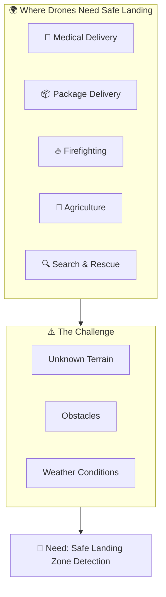
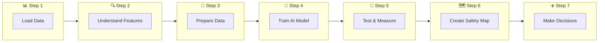
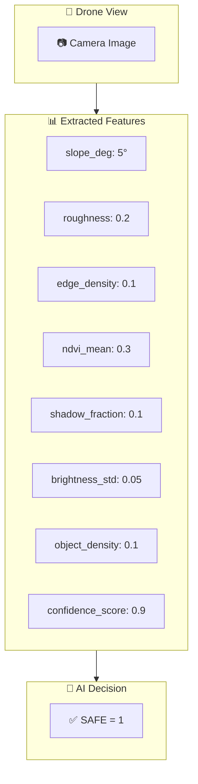
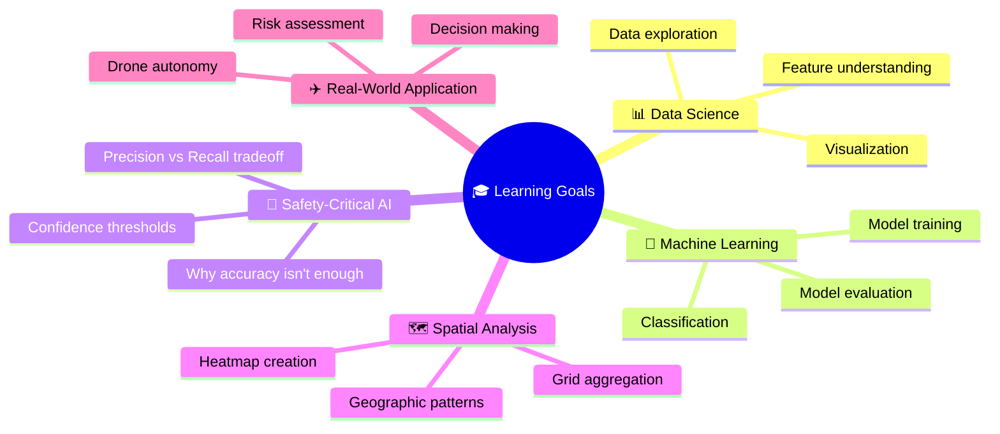

# 🛬 Problem Statement - AI Landing Zone Safety Classification

## 🧩 Problem Statement (Simple Explanation)

### What is the Problem?

Imagine you are a **helicopter pilot** trying to find a safe place to land in an unknown area. You look down and check:
- 🏔️ Is the ground **flat** (not too steep)?
- 🪨 Is it **smooth** (not too rough)?
- 🌿 Are there **plants or trees** blocking the way?
- 🚧 Are there **obstacles** like rocks or buildings?
- 🌑 Can I **see clearly** (not too many shadows)?

Now imagine doing this **automatically** with a **computer program** for a **drone** (a flying robot)!

### Real-Life Analogy: Landing a Paper Airplane 🛩️

Think about where you would land a paper airplane:
- ✅ **Good spot**: Flat table, clear of objects
- ❌ **Bad spot**: Stairs (steep!), grassy lawn (vegetation!), desk with books (obstacles!)

Our AI is like a smart helper that:
1. 👀 **Looks** at terrain features
2. 🧠 **Thinks** about safety
3. ✅ **Decides** if it's safe or not

---

## 🌍 Why Does This Problem Matter?

### Real-World Applications



### Why Not Just Land Anywhere?
| Bad Landing | Consequence |
|-------------|-------------|
| Steep slope | Drone tips over = BROKEN 💥 |
| Rough surface | Damage to landing gear |
| Trees/Plants | Propellers get stuck |
| Obstacles | Collision = CRASH 💥 |
| Shadows | Can't see = Wrong decision |

---

## 🪜 Steps to Solve the Problem

### Simple Breakdown



### Detailed Steps

| Step | What We Do | Why | Real-Life Analogy |
|------|-----------|-----|-------------------|
| 1️⃣ Load Data | Get the terrain information | Need information to make decisions | Reading a report card |
| 2️⃣ Explore Data | Understand what each feature means | Know what we're working with | Understanding the subjects in school |
| 3️⃣ Prepare Data | Split into training and testing | Need to practice AND test | Studying then taking exam |
| 4️⃣ Train Model | Teach AI to recognize patterns | AI learns from examples | Teaching a student with flashcards |
| 5️⃣ Test Model | Check if AI learned correctly | Verify it works | Taking the final exam |
| 6️⃣ Create Heatmap | Show safe/unsafe areas visually | Easy to understand at a glance | Color-coded traffic map |
| 7️⃣ Make Decisions | Recommend landing strategy | Help drone decide where to land | GPS navigation recommendation |

---

## 📊 Understanding the Features

### What Information Do We Have?

Imagine the drone takes a **photo from above** and a computer extracts these measurements:

| Feature | What It Measures | Simple Example | Safe Value | Unsafe Value |
|---------|-----------------|----------------|------------|--------------|
| `slope_deg` | How steep the ground is (degrees) | Flat = 0°, Hill = 30° | 0-10° | >15° |
| `roughness` | How bumpy the surface is | Smooth table = 0, Gravel = 1 | Low (0-0.3) | High (>0.5) |
| `edge_density` | How many sharp edges (obstacles) | Clear = 0, Cluttered = 1 | Low (<0.3) | High (>0.5) |
| `ndvi_mean` | How much vegetation (plants) | Parking lot = 0, Forest = 1 | Low (<0.3) | High (>0.6) |
| `shadow_fraction` | How much shadow coverage | Sunny = 0, Shaded = 1 | Low (<0.3) | High (>0.5) |
| `brightness_std` | How uneven the lighting is | Uniform = 0, Patchy = high | Low | High (>0.2) |
| `object_density` | How many objects in the area | Empty = 0, Crowded = 1 | Low (<0.2) | High (>0.4) |
| `confidence_score` | How sure the detector is | Very sure = 1, Unsure = 0 | High (>0.7) | Low (<0.5) |
| `label` | Final verdict: Safe or Unsafe | Safe = 1, Unsafe = 0 | 1 | 0 |

### Visual Representation



---

## 🎯 Expected Output (Overall)

### What We Will Create

1. **📊 Exploratory Analysis**: Understand the data
2. **🤖 Trained ML Model**: AI that predicts safe/unsafe
3. **📏 Performance Metrics**: 
   - Accuracy, Precision, Recall, F1-Score
   - ROC-AUC Curve
   - Confusion Matrix
4. **🗺️ Safety Heatmap**: Visual map showing safe zones
5. **📋 Landing Recommendations**: Strategy for drone

### Sample Output Format

```
=== MODEL PERFORMANCE ===
Accuracy:  85.2%
Precision: 87.1%  (When we say "safe", we're right 87% of time)
Recall:    83.5%  (We find 83% of all safe zones)
F1-Score:  85.3%  (Balance of precision & recall)
ROC-AUC:   0.912  (Excellent discrimination!)

=== LANDING RECOMMENDATION ===
Zone (3,4): ✅ HIGH CONFIDENCE - CLEAR TO LAND
Zone (2,5): ⚠️ MEDIUM CONFIDENCE - PROCEED WITH CAUTION
Zone (1,6): ❌ LOW CONFIDENCE - AVOID
```

---

## ✅ Success Criteria

| Criteria | Description | Target |
|----------|-------------|--------|
| Model Accuracy | How often we're correct | >80% |
| Precision (Safe) | Correct "safe" predictions | >85% |
| Recall (Safe) | Find all safe zones | >80% |
| ROC-AUC | Classification quality | >0.85 |
| Heatmap | Visual safety map | Clear coloring |
| Recommendations | Actionable advice | Specific zones |

---

## 🧠 Why This Is Important for Learning


