# 🛬 AI-Based Landing Zone Safety Classification

## NotebookLM-Style Slide Deck

---

## Slide 1: Title & Objective

# 🛬 AI-Based Landing Zone Safety

### Classifying Drone Landing Zones as Safe or Unsafe

**Objective**: Build an ML pipeline to predict landing zone safety from aerial terrain features

**Key Deliverables**:
- Trained ML model (85% accuracy)
- Safety heatmaps
- Landing recommendations

---

## Slide 2: Problem Statement

# 🧩 The Problem

### Drones Need Safe Landing Zones

**Challenge**: Autonomous drones must land safely without human intervention

**Question**: How do we automatically determine if a zone is safe?

```
📸 Aerial Image → 📊 Extract Features → 🤖 AI Prediction → ✅ Safe / ❌ Unsafe
```

**Real-life Analogy**: Like a pilot checking terrain before landing

---

## Slide 3: Real-World Use Case

# 🌍 Why This Matters

### Applications of Safe Drone Landing

| Industry | Use Case |
|----------|----------|
| 🏥 Medical | Emergency supply delivery |
| 📦 Delivery | Package drop-off |
| 🔥 Firefighting | Equipment deployment |
| 🌾 Agriculture | Crop monitoring |
| 🔍 Search & Rescue | Remote area access |

**Impact**: Autonomous landing enables unmanned operations in critical situations

---

## Slide 4: Input Data / Features

# 📊 What Data Do We Have?

### 8 Features Extracted from Aerial Imagery

| Feature | Meaning | Safe Value |
|---------|---------|------------|
| slope_deg | Ground steepness | <10° |
| roughness | Surface bumpiness | Low |
| edge_density | Obstacle edges | Low |
| ndvi_mean | Vegetation amount | Low |
| shadow_fraction | Shadow coverage | Low |
| brightness_std | Light variation | Low |
| object_density | Obstacle count | Low |
| confidence_score | Detection certainty | High |

**Target**: `label` (1=Safe, 0=Unsafe)

---

## Slide 5: Concepts Used (High Level)

# 🧠 Key Concepts

### Machine Learning Classification Pipeline

```mermaid
flowchart LR
    A["📊 Data"] --> B["🔄 Split"]
    B --> C["📏 Scale"]
    C --> D["🤖 Train"]
    D --> E["📊 Evaluate"]
    E --> F["🗺️ Visualize"]
```



**Core Technologies**:
- **scikit-learn**: ML framework
- **Random Forest**: Classification algorithm
- **pandas/numpy**: Data handling
- **matplotlib/seaborn**: Visualization

---

## Slide 6: Concepts Breakdown

# 📚 Understanding the Key Concepts

### Random Forest Classifier

> **What**: Ensemble of 100+ decision trees voting together

> **Why**: More robust than single tree

> **How**: Each tree trained on random data subset

### Train-Test Split

> Each tree learns → All trees vote → Majority wins

**80% Training** | **20% Testing**

---

## Slide 7: Step-by-Step Solution Flow

# 🪜 Solution Pipeline

```mermaid
flowchart TB
    A["1️⃣ Load Data<br>3000 samples"] --> B["2️⃣ Explore<br>Understand features"]
    B --> C["3️⃣ Prepare<br>Split & Scale"]
    C --> D["4️⃣ Train<br>Random Forest"]
    D --> E["5️⃣ Evaluate<br>Metrics & Confusion"]
    E --> F["6️⃣ Visualize<br>Heatmaps"]
    F --> G["7️⃣ Recommend<br>Landing Strategy"]
```



---

## Slide 8: Code Logic Summary

# 💻 Key Code Patterns

### Training Pipeline

```python
# 1. Split data
X_train, X_test, y_train, y_test = train_test_split(
    X, y, test_size=0.2, stratify=y
)

# 2. Scale features
scaler = StandardScaler()
X_train_scaled = scaler.fit_transform(X_train)

# 3. Train model
model = RandomForestClassifier(n_estimators=100)
model.fit(X_train_scaled, y_train)

# 4. Predict
y_pred = model.predict(X_test_scaled)
```

---

## Slide 9: Important Functions & Parameters

# ⚙️ Key Parameters

### RandomForestClassifier

| Parameter | Value | Purpose |
|-----------|-------|---------|
| `n_estimators` | 100 | Number of trees |
| `max_depth` | 10 | Limit overfitting |
| `random_state` | 42 | Reproducibility |

### train_test_split

| Parameter | Value | Purpose |
|-----------|-------|---------|
| `test_size` | 0.2 | 20% for testing |
| `stratify` | y | Keep class balance |

---

## Slide 10: Execution Output

# 📏 Model Performance

### Results Summary

| Metric | Value | Meaning |
|--------|-------|---------|
| **Accuracy** | ~85% | 85/100 correct |
| **Precision** | ~87% | "Safe" predictions reliable |
| **Recall** | ~84% | Found most safe zones |
| **F1-Score** | ~85% | Balanced performance |
| **ROC-AUC** | ~0.91 | Excellent discrimination |

### Classification Distribution
- ✅ Safe: 55%
- ❌ Unsafe: 45%

---

## Slide 11: Observations & Insights

# 🔍 Key Findings

### Feature Importance

1. **slope_deg** - Most important (steep = unsafe)
2. **roughness** - Second most (bumpy = unsafe)
3. **confidence_score** - Third (certainty matters)

### Spatial Patterns

- Safe zones cluster together
- Transition zones (yellow) exist between safe/unsafe
- Physical terrain dominates visual features

### Critical Insight

> ⚠️ False Negatives are DANGEROUS
> Predicting "safe" when actually unsafe = crash risk

---

## Slide 12: Advantages & Limitations

# ⚖️ Pros and Cons

### ✅ Advantages

| Advantage | Benefit |
|-----------|---------|
| Automated | No human needed for each zone |
| Fast | Predict thousands instantly |
| Consistent | Same rules every time |
| Interpretable | Feature importance explains decisions |

### ❌ Limitations

| Limitation | Impact |
|------------|--------|
| No GPS | Can't map to real locations |
| Static | No weather/time changes |
| Binary | No safety gradations |
| Simulated data | May not match real sensors |

---

## Slide 13: Interview Key Takeaways

# 💼 Remember for Interviews

### Top 5 Points

1. **Classification** = Categories, **Regression** = Numbers
2. **Random Forest** = Trees voting together (reduces overfitting)
3. **Accuracy misleading** for imbalanced classes
4. **Recall > Precision** for safety-critical systems
5. **Never fit scaler on test data** (data leakage!)

### Quick Formulas

```
Precision = TP / (TP + FP)
Recall    = TP / (TP + FN)
F1-Score  = 2 × (P × R) / (P + R)
```

---

## Slide 14: Conclusion

# ✅ Summary

### What We Achieved

1. ✅ Explored 3000 landing zone samples
2. ✅ Trained Random Forest with 85% accuracy
3. ✅ Created spatial safety heatmaps
4. ✅ Generated autonomous landing recommendations

### Key Takeaway

> **AI can automate safety classification, but always include human oversight for critical decisions**

### Next Steps

- Add real GPS coordinates
- Integrate weather data
- Multi-sensor verification
- Continuous learning from outcomes

---

## 📎 Resources

- **Dataset**: Google Sheets (3000 samples, 9 columns)
- **Framework**: scikit-learn 1.3+
- **Algorithm**: RandomForestClassifier
- **Visualization**: matplotlib + seaborn

---

*Created for AI Landing Zone Safety Capstone Project*
