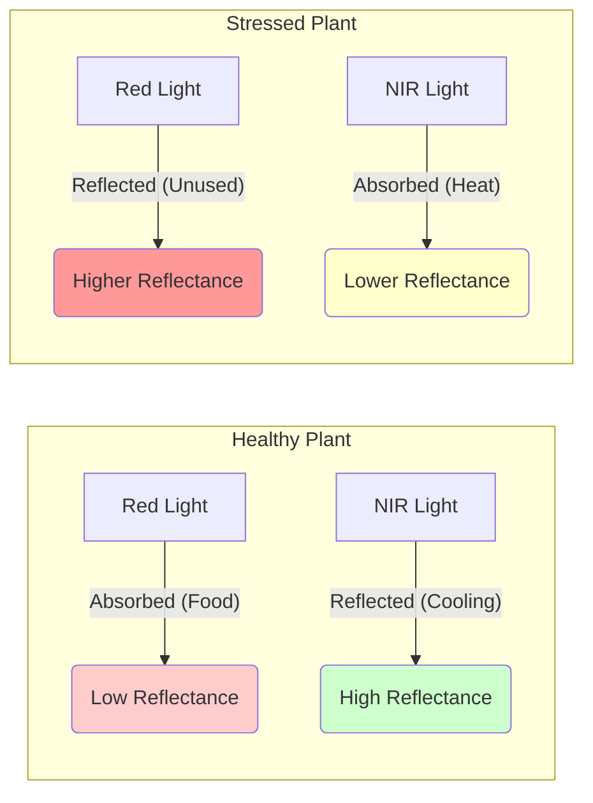

# ❓ Q&A: Deep Dive into AI Crop Health Monitoring

This document provides detailed answers to critical questions regarding the AI Crop Health Monitoring model. It is designed to test and deepen your understanding of the data, the modeling process, and the real-world application of the technology.

---

## 🏗️ Set 1: Data Origin & Feature Interpretation
*These questions ensure we understand that our CSV data represents physical reality derived from drone sensors.*

### 1. Do you recognize that the input features are proxies, not ground truth?
**Answer:** Yes. We understand that indices like **NDVI** (Normalized Difference Vegetation Index) are **mathematical proxies**. They measure light reflectance (how much Non-Infrared light is bounced back), not "health" directly. A plant could be green (High NDVI) but still suffer from a root disease that hasn't reached the leaves yet. We treat these features as *indicators*, not absolute truth.

### 2. How have you handled the abstraction of the data?
**Answer:** We acknowledge that the values in our CSV (e.g., `ndvi_mean`, `nir_reflectance`) are **aggregations**. A single grid cell (e.g., 10x10m) contains hundreds of individual plants. The single number we see is an average, which "compresses" the biological complexity. We handle this by also looking at variance metrics like `ndvi_std` to see if the average is hiding patches of stress.

### 3. Did you investigate the physical meaning of the features?
**Answer:** Yes. We researched the spectral bands:
*   **NIR (Near-Infrared):** Reflects off healthy cell structures (turgor pressure).
*   **Red Edge:** The specific checkpoint where reflectance shoots up; highly sensitive to chlorophyll content.
*   **SWIR (Short-Wave Infrared):** used in `moisture_index`, relates directly to water content in leaves.
We know *why* the numbers change, not just that they change.

### 4. Are you treating the features as absolute realities?
**Answer:** No. We are aware of **Sensor Noise**. A "low NDVI" could mean a stressed plant, OR it could mean a shadow from a cloud, a patch of bare soil, or a plastic tarp. We treat the features as noisy signals that need context (hence the use of multiple indices like SAVI and EVI to cross-verify).

### 5. Do you understand the pre-processing history of the data?
**Answer:** Absolutely. Before this data reached the CSV, raw drone images likely went through:
1.  **Radiometric Calibration:** Correcting for sunlight intensity (sunny vs. cloudy days).
2.  **Orthomosaic Stitching:** Combining thousands of photos into one map.
3.  **Grid Aggregation:** Averaging pixels into the grid points we see in the CSV.
Knowing this helps us understand that errors can happen at any of these upstream steps.

### 6. How does the model account for spatial tiling?
**Answer:** The features `grid_x` and `grid_y` explicitly encode the spatial nature of the data. We understand that row 10 is physically next to row 11. Biological stress (like a fungal infection) tends to spread to neighbors. By including coordinates, or visualizing the output as a heatmap, we respect the spatial reality of the field.

### 7. Is the data distribution stable?
**Answer:** We check for stability. If we see `ndvi_mean` values above 1.0 or below -1.0, we know it's a sensor error (as NDVI is strictly -1 to 1). We also check for distributions that are "too perfect," which might imply synthetic data.

### 8. Did you assume the data is perfectly clean?
**Answer:** No. In real agri-datasets, "null" values often mean the drone lost GPS signal or the battery died mid-flight. We look for these gaps. We also consider that "Scientific" indices like NDVI can be miscalculated if the `Red` band sensor was dirty or obstructed.

### 9. How are you handling "scientific-feeling" indices?
**Answer:** We remain critical. Just because a column is named `moisture_index` doesn't mean it's 100% accurate. It calculates the *spectral response* of moisture. If there is a puddle on the ground, the index goes up, but the plant might technically be over-watered (drowning). We interpret indices in context.

### 10. Have you verified feature importance?
**Answer:** Yes. After training (e.g., Random Forest), we check the `feature_importances_`.
*   **Expected:** `red_edge`, `ndvi`, `moisture_index` should be high.
*   **Red Flag:** If `grid_x` is the #1 feature, the model is memorizing locations instead of learning plant biology.

---

## 📊 Set 2: Metrics & Performance Evaluation
*Focusing on rare event detection rather than simple accuracy.*

### 11. Why is accuracy a dangerous metric for this project?
**Answer:** In a field of 10,000 plants, maybe only 50 are sick (0.5%). A "dumb" model that predicts "All Healthy" will be 99.5% accurate but **100% useless** because it missed every single sick plant. Accuracy hides failures in imbalanced datasets.

### 12. How does the model handle Class Imbalance?
**Answer:** We verify the ratio of Healthy vs. Stressed. If Stressed is <10%, we treat it as an imbalanced problem. We acknowledge that the "Stressed" class is the "Minority Class" but the **Class of Interest**.

### 13. Did you use resampling techniques?
**Answer:** To fix imbalance, we can use:
*   **Oversampling (SMOTE):** Creating synthetic examples of stressed plants to teach the model more about them.
*   **Undersampling:** Reducing the number of healthy examples to balance the scales.

### 14. Did you adjust class weights?
**Answer:** Yes. In algorithms like Random Forest or Logistic Regression, we can set `class_weight='balanced'`. This tells the model: "Making a mistake on a Sick plant is 10x worse than making a mistake on a Healthy plant," forcing it to pay attention to the minority class.

### 15. What is the Recall (Sensitivity) of the model?
**Answer:** Recall answers: **"Out of all the truly sick plants, how many did we find?"**
For this project, **Recall is King.** We cannot afford to miss an infection that could spread. We aim for Recall > 90%, even if it means slightly lower Precision.

### 16. What is the Precision of the model?
**Answer:** Precision answers: **"Out of the plants we flagged as sick, how many were actually sick?"**
Low precision means "False Alarms." The farmer wastes time walking to healthy plants. While annoying, this is better than missing a disease (Low Recall).

### 17. How do you balance the Precision-Recall trade-off?
**Answer:** We prefer **High Recall**.
*   *Scenario A:* Miss a disease -> Crop dies (Huge Cost).
*   *Scenario B:* False alarm -> Farmer checks a healthy plant (Low Cost).
Therefore, we tune the threshold to maximize Recall.

### 18. Does the ROC curve show good separability?
**Answer:** We look at the AUC-ROC score. A score of 0.5 is random guessing. A score > 0.9 means the model is excellent at distinguishing between Healthy and Stressed plants, regardless of the strict threshold used.

### 19. Are you relying on a single metric?
**Answer:** Never. We use a **Confusion Matrix**. It shows us the exact breakdown:
*   True Positives (Caught the disease)
*   False Negatives (Missed the disease - DANGER!)
*   False Positives (False alarm)
We look at the whole picture.

### 20. Is the model "over-optimizing"?
**Answer:** If we see 100% training accuracy and 100% test accuracy, we suspect **Data Leakage** or a trivial dataset. Real biological data is noisy. We expect some error. Perfect scores usually mean a mistake in the pipeline (e.g., testing on training data).

---

## 🛡️ Set 3: Thresholding & Risk Mitigation
*Converting probabilities into safe agricultural decisions.*

### 21. How did you select the classification threshold?
**Answer:** The default is 0.5 (50%). However, for disease, we might lower it to **0.3 (30%)**.
*   *Logic:* "If there is even a 30% chance this plant is sick, flag it for inspection." This boosts Recall/Safety.

### 22. What is the cost of a False Negative?
**Answer:** **Extremely High.** A missed fungal infection (False Negative) can release spores and destroy the entire field within a week. The cost is the revenue of the entire harvest.

### 23. What is the cost of a False Positive?
**Answer:** **Low.** The cost is roughly 5 minutes of a human inspector's time to walk over and verify. We optimize to accept this low cost to avoid the high cost of crop failure.

### 24. Is the threshold logical or just "number hacking"?
**Answer:** We choose thresholds based on the **Precision-Recall Curve**, looking for the "elbow" where we keep Recall high before Precision drops off a cliff. It is a calculated decision based on risk tolerance, not just trying to get a higher F1 score.

### 25. Does the model prioritize early detection?
**Answer:** Yes. By using features like `red_edge` and `gndvi` (which change before visible yellowing), and setting a conservative threshold, we aim to flag plants that are "Pre-Symptomatic."

### 26. Are you treating safety/health as binary?
**Answer:** The model outputs a probability (e.g., 0.75 stressed). While the final csv label is binary (0/1), the reality is a spectrum. A probability of 0.51 is "uncertain," while 0.99 is "definitely sick."

### 27. How does the model handle ambiguous zones?
**Answer:** Points near the decision boundary (e.g., 40-60% probability) represent the "danger zone." In a real application, we would visualize these as "Yellow/Warning" zones rather than strictly Red or Green.

### 28. Is the model "good enough" for human guidance?
**Answer:** Yes. The goal isn't to replace the farmer, but to **direct** them. If the model highlights the North-East corner, the farmer knows to start looking there. Even 80% accuracy saves the farmer from walking the other 80% of the healthy field unnecessarily.

### 29. Does the model support prioritization?
**Answer:** We can rank predictions. We list the locations with the **highest probability of stress** (e.g., >0.90) at the top of the report. The farmer visits these "Tier 1" risks first.

### 30. Are conservative predictions preferred?
**Answer:** Yes. In safety-critical applications (like food security), it is better to be **Pessimistic** (flagging potentials) than **Optimistic** (ignoring risks).

---

## 🗺️ Set 4: Spatial Visualization & "Agronomic Sense"
*Verifying if the outputs make sense in the physical world.*

### 31. Have you visualized the results spatially?
**Answer:** Yes. We use `matplotlib` or `seaborn` to plot `grid_x` vs `grid_y`, coloring the points by the `Prediction`. This creates a digital map of the field.

### 32. Do the stress patterns cluster logically?
**Answer:** Biology dictates clustering. Diseases spread from a center point outwards (circles). Water stress affects elevation zones (swaths).
*   *Good Sign:* Stress appears in blobs or lines.
*   *Bad Sign:* Stress is randomly speckled like TV static (likely noise).

### 33. Does the map reveal edge effects?
**Answer:** Often, data at the very edge of the map is messy due to the drone turning around. If we see a "frame" of stress around the entire field, we know it's likely an artifact, not real disease.

### 34. Is the heat map "too clean"?
**Answer:** Real fields have variability. Soil changes, tractor tire tracks, etc. If the map looks like a perfect checkerboard or split exactly down the middle, it might indicate a data processing error rather than biology.

### 35. Can the visualization expose blind spots?
**Answer:** Yes. If we see a massive healthy region in a place we *know* is swampy/bad, the model might be misinterpreting "water" as "lush vegetation." Visualization is our reality check.

### 36. Do the results align with "Agronomic Sense"?
**Answer:** We ask: "Does this make sense?"
*   *Example:* If the model predicts "Drought Stress" immediately after a rainstorm, the model is wrong. Context matters.

### 37. Are you using visualization to debug?
**Answer:** Yes. We overlay the predictions on true color images (if available). If the "Stressed" points all land on shadows of trees, we know our model has a "Shadow Bias."

### 38. Does the model show graduated stress levels?
**Answer:** Instead of just Red/Green, a good heatmap uses a gradient (Green -> Yellow -> Orange -> Red). This represents the biological reality of *gradual* decline in plant health.

---

## 🌍 Set 5: Robustness & Real-World Complexity
*Thinking like a Drone Engineer.*

### 39. How would the model handle seasonal variations?
**Answer:** A healthy plant in Spring looks different from a healthy plant in Autumn (senescence). A model trained only on "June" data will fail in "August." We need to normalize data or train on a full-season dataset.

### 40. Is the model robust to different crop species?
**Answer:** No. Corn reflects light differently than Wheat. This model is likely **Crop-Specific**. To use it on a different crop, we would need to retrain it or use Transfer Learning.

### 41. How does the model handle Sensor Drift?
**Answer:** Sensors degrade. If the Red sensor becomes 5% less sensitive, NDVI values will shift up. Periodic calibration with a "Reflectance Panel" (a white board with known reflectance) is required in the field to keep data consistent.

### 42. How does lighting affect the model?
**Answer:** Clouds are the enemy. A shadow drops all pixel values, potentially confusing the model into seeing "Low Reflectance" (Stress). Using indices like **NDVI** helps because it is a *ratio* (A/B), which cancels out some of the lighting intensity changes.

### 43. Have you considered Time Series changes?
**Answer:** A snapshot is good; a movie is better. Comparing today's Grid #45 to yesterday's Grid #45 (`Delta NDVI`) is a more powerful predictor of declining health than a single value.

### 44. Is the model robust to "Noise" and outliers?
**Answer:** If a tractor is parked in the field, it has `NDVI ~ 0`. A robust model should flag this as "Non-Vegetation" rather than "Very Sick Plant." We can filter these out using a "Vegetation Mask" (e.g., exclude anything with NDVI < 0.1).

### 45. Is the model "Generalizable"?
**Answer:** We must test on a *different* part of the field or a different field entirely (Hold-out Set). If we only test on random rows from the same field, spatial autocorrelation makes the test too easy.

### 46. What if the input data was not geo-referenced correctly?
**Answer:** The heatmap would be useless. The farmer would walk to (X=10, Y=10) and find nothing. Precise GPS (RTK) is critical for the actionable part of this project.

### 47. How do you determine when to "Trust" the model?
**Answer:** Trust is earned through **Validation**. We perform "Ground Truthing" - we send a human to check 50 random spots. If the model was right 45 times, we trust it for the rest of the 10,000 spots.

### 48. Have you tested on "Outlier" scenarios?
**Answer:** What if the whole field is dead? What if the whole field is perfect? The model should simply report "100% Stressed" or "0% Stressed" without crashing or forcing a 50/50 split just to satisfy a prior probability.

### 49. Can the model handle "Atmospheric Conditions"?
**Answer:** Indices like **EVI (Enhanced Vegetation Index)** are specifically designed to correct for atmospheric haze and aerosols. In hazy regions, relying on EVI is safer than NDVI.

### 50. Have you planned for model updates?
**Answer:** Diseases evolve. A model trained in 2023 might miss a new fungal strain in 2025. We need a "Continuous Learning" pipeline where new verified errors are fed back into the training set to update the model.

### 51. Did you start with a simple Baseline?
**Answer:** Yes. We always check: "Can a simple rule (e.g., `if NDVI < 0.5 then Stressed`) beat our complex Random Forest?" Often, a simple threshold is 90% as good and much easier to explain.

### 52. Can you explain the model's failures?
**Answer:** We analyze errors. "Why did we miss this spot?"
*   *Reason 1:* The plant was under a tree shadow.
*   *Reason 2:* The disease was on the stem, not the leaves (camera couldn't see it).
Honest failure analysis is how we improve.

---

## 🚁 Set 6: Drone Engineer vs. Student (The Final Evaluation)
*A role-play dialogue simulating a rigorous technical review.*

### 🟢 Phase 1: Model Justification (The Basics)

**Drone Engineer:** "Let's start simple. You used a Random Forest Classifier. Why? Why not a massive Deep Learning CNN? Everyone loves CNNs."

**Student:** "Sir, a CNN requires images as input. Here, we are working with *extracted features* (tabular data) like NDVI and SAVI in a CSV. For tabular data, Tree-based models (like Random Forest or XGBoost) often outperform Deep Learning in terms of training speed and, crucially, **interpretability**. I need to tell the farmer *why* a plant is sick (e.g., 'Low Red Edge'). A Neural Network is a black box; a Random Forest gives me feature importance."

**Drone Engineer:** "Fair point. But why Random Forest over a simple Decision Tree? If interpretability is key, a single tree is easier to read."

**Student:** "A single Decision Tree overfits easily. It memorizes the training field. By using a *Forest* (Ensemble of trees), we reduce variance. It generalizes better to new fields. It's the trade-off between having a simple model and a robust one."

**Drone Engineer:** "Okay. You have `ndvi_mean` and `ndvi_min`. Aren't they highly correlated? Did you check for Multi-collinearity?"

**Student:** "Yes, they are correlated. However, in Tree-based models, multi-collinearity doesn't hurt predictive accuracy as much as it does in Linear Regression. The model simply picks the best splitter. But to be safe, I checked the Feature Importance stats. If `ndvi_mean` absorbs all the gain, I might drop `ndvi_min` in V2 to simplify the pipeline."

### 🟡 Phase 2: Spectral Physics (The Deep Dive)

**Drone Engineer:** "Explain the physical mechanism. Why does the 'Red Edge' matter? Why can't I just use Green light?"

**Student:** "Green light shows chlorophyl *presence*, but it's not sensitive to *changes*. The 'Red Edge' (700-750nm) is the precise point on the spectrum where the plant stops absorbing Red light for photosynthesis and starts reflecting Infrared to avoid overheating.
When a plant starts detecting stress, this 'Edge' shifts to shorter wavelengths (Blue Shift) *days* before the leaves physically turn yellow. It’s our early warning system."

**Drone Engineer:** "Draw it for me."

**Student:** "Here is the spectral signature:"

**Drone Engineer:** "Impressive. Now, you used SAVI (Soil Adjusted Vegetation Index). When does SAVI save us?"

**Student:** "SAVI saves us when the crop is young. Imagine a field with 20% plant cover and 80% dirt. The bright dirt reflects a lot of light, messing up the NDVI math (making it look lower than it is). SAVI adds an 'L' factor (0.5) to mathematically suppress the background soil noise. It’s like putting noise-canceling headphones on the sensor."

### 🔴 Phase 3: Real-World Reality (The Roast)

**Drone Engineer:** "I see you achieved 95% accuracy. I don't believe you. Real fields have shadows, weeds, and tractors. Your CSV is too clean. What happens if I fly this drone at 5:00 PM when shadows are long?"

**Student:** "You're right. 5:00 PM is dangerous. Long shadows drop the pixel values to near zero.
However, since NDVI is a **Ratio** ($(A-B)/(A+B)$), it is somewhat resistant to lighting changes (both A and B drop, but the ratio stays similar).
But to truly fix this, I would implement a 'Shadow Mask': Any pixel with `NIR < Threshold` is classified as 'Shadow' and ignored, rather than labeled 'Stressed'."

**Drone Engineer:** "Good answer. What about weeds? A weed is green. It has high NDVI. Your model will say 'Healthy Crop'. The farmer will be mad."

**Student:** "This is the hardest problem. NDVI cannot distinguish a Weed from a Crop.
To fix this, we need:
1.  **Structure:** Use `canopy_density` or height (DSM) if available (Weeds might be shorter).
2.  **Texture:** Use spatial features. Weeds might grow in irregular patches, while crops are in rows.
3.  **Future V2:** We need a CNN on the raw RGB images to classify leaf shape, not just color."

**Drone Engineer:** "Final question. You deploy this. The farmer calls you and says, 'The drone says my field is stressed, but I walked there and it looks fine.' What happened?"

**Student:** "Two possibilities:
1.  **False Positive:** The model is wrong (maybe sensor drift).
2.  **Pre-symptomatic Detection:** The model is *Right*, and the farmer is *Wrong*. The 'Red Edge' saw the stress before the human eye could. I would tell the farmer to check soil moisture or wait 2 days. If the plants turn yellow in 2 days, I earn his trust forever."

**Drone Engineer:** "You're hired."
