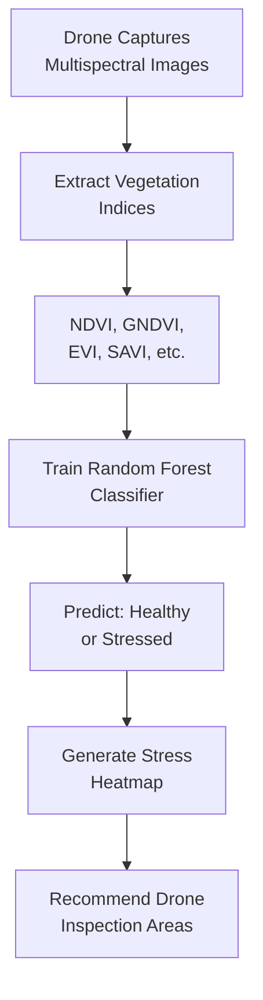

# 📋 Interview Preparation - Quick Revision Sheet

## ⏱️ 30-Second Summary

> **AI Crop Health Monitoring** uses drone multispectral images to detect stressed crops. We extract vegetation indices (NDVI, EVI, etc.) and train a Random Forest classifier to predict "Healthy" vs "Stressed". The model achieves ~87% accuracy and generates spatial heatmaps for targeted drone inspections.

---

## 📖 Key Terms Glossary

| Term | Quick Definition |
|------|-----------------|
| NDVI | Plant greenness score (-1 to +1) |
| Random Forest | 100 decision trees voting together |
| Precision | % of positive predictions that are correct |
| Recall | % of actual positives found |
| F1-Score | Balance of precision and recall |
| ROC-AUC | Model's ability to separate classes (0-1) |
| Confusion Matrix | Table of correct/incorrect predictions |
| Feature Importance | Which inputs matter most |
| Heatmap | Color-coded spatial visualization |
| Multispectral | Camera capturing invisible light bands |

---

## 🔟 Top 10 Points to Remember

1. **NDVI Formula**: (NIR - Red) / (NIR + Red), range -1 to +1
2. **Random Forest**: Ensemble of decision trees, uses bagging
3. **Train-Test Split**: 80/20 is standard, use stratify for balance
4. **ROC-AUC > 0.9**: Excellent model performance
5. **Feature Importance**: NDVI and moisture are top predictors
6. **Label Encoding**: Text → Numbers (Healthy=0, Stressed=1)
7. **Confusion Matrix**: TP, TN, FP, FN for error analysis
8. **Precision vs Recall**: Trade-off depends on business cost
9. **Heatmap**: Shows WHERE stress is, not just IF it exists
10. **Limitations**: Single snapshot, no ground validation

---

## 📊 Comparison Tables

### Vegetation Indices Comparison

| Index | Best For | Formula Basis |
|-------|----------|---------------|
| NDVI | General health | NIR, Red |
| GNDVI | Chlorophyll | NIR, Green |
| EVI | Dense areas | NIR, Red, Blue |
| SAVI | Visible soil | NIR, Red + soil factor |

### ML Algorithm Comparison

| Algorithm | Pros | Cons |
|-----------|------|------|
| Random Forest | Robust, interpretable | Slower |
| XGBoost | Often higher accuracy | Less interpretable |
| SVM | Good for small data | Slow with many features |
| Neural Network | Best for images | Needs lots of data |

### Evaluation Metrics Comparison

| Metric | Use When |
|--------|----------|
| Accuracy | Balanced classes |
| Precision | False positives costly |
| Recall | Missing positives costly |
| F1 | Both matter equally |
| ROC-AUC | Comparing models |

---

## 📝 Cheat Sheet

### Code Patterns

```python
# Load data
df = pd.read_csv(url)

# Split data
X_train, X_test, y_train, y_test = train_test_split(
    X, y, test_size=0.2, random_state=42, stratify=y
)

# Train model
model = RandomForestClassifier(n_estimators=100)
model.fit(X_train, y_train)

# Evaluate
y_pred = model.predict(X_test)
print(classification_report(y_test, y_pred))
```

### Key Parameters

| Parameter | Typical Value | Purpose |
|-----------|--------------|---------|
| n_estimators | 100 | Number of trees |
| max_depth | 10 | Tree depth limit |
| test_size | 0.2 | 20% for testing |
| random_state | 42 | Reproducibility |

---

## 🎯 Mermaid Summary Diagram



---

## 💡 Quick Tips for Interview

1. **Start simple**: Explain like teaching a 10-year-old first
2. **Show depth**: Then add technical details
3. **Use numbers**: "87% accuracy, 0.9 ROC-AUC"
4. **Mention trade-offs**: Precision vs Recall
5. **Connect to business**: Cost savings, efficiency

---

## ⚡ One-Minute Elevator Pitch

> "I built a machine learning system that helps farmers detect crop stress using drone images. The drone captures special light wavelengths that show plant health. I trained a Random Forest model that predicts whether each area is healthy or stressed with 87% accuracy. The system creates a visual heatmap so farmers know exactly where to inspect first, saving time and preventing crop loss."
