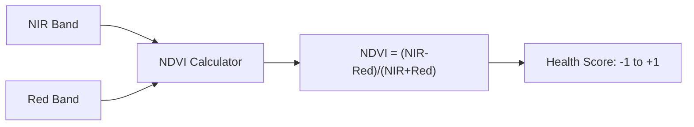
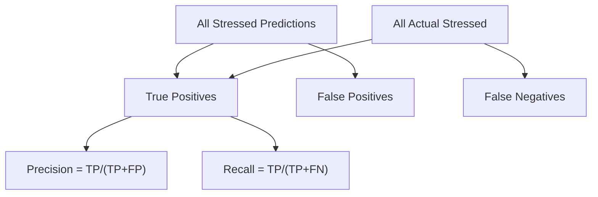

# 🎤 Interview Questions - AI Crop Health Monitoring

This document contains 20 interview questions with simple and technical answers.

---

## Question 1: What is NDVI and why is it used in crop monitoring?

### Simple Answer (For a 10-Year-Old)
NDVI is like a "health score" for plants. Healthy plants are greener and get a high score. Sick plants get a low score. Drones take special photos that show this score for every part of a farm.

### Technical Answer
NDVI (Normalized Difference Vegetation Index) is a spectral index calculated as (NIR - Red) / (NIR + Red). It ranges from -1 to +1, where values >0.6 typically indicate healthy vegetation. It's used because healthy plants absorb red light for photosynthesis and reflect NIR light from their cell structure.

### Diagram

### Common Mistakes
- Saying NDVI can detect all plant stress (it mainly detects chlorophyll-related stress)
- Forgetting the formula bounds (-1 to +1)

---

## Question 2: Why did you choose Random Forest for this project?

### Simple Answer
Random Forest is like asking 100 different experts to vote. Each expert looks at the plants differently, and the final answer is whatever most experts agree on. This makes it very accurate!

### Technical Answer
Random Forest was chosen because:
1. Handles high-dimensional data well (13 features)
2. Provides feature importance for interpretability
3. Resistant to overfitting through bagging
4. No need for feature scaling
5. Works well with tabular vegetation index data

### Key Points
- Ensemble method = multiple decision trees
- Bootstrap aggregating (bagging) reduces variance
- Feature importance helps agronomists

---

## Question 3: What is the difference between Precision and Recall?

### Simple Answer
- **Precision**: When you say "this plant is stressed," how often are you right?
- **Recall**: Of all the stressed plants, how many did you find?

### Technical Answer
- **Precision = TP / (TP + FP)**: Quality of positive predictions
- **Recall = TP / (TP + FN)**: Coverage of actual positives

### Diagram

### When to Prioritize Each
- **Precision**: When false alarms are costly
- **Recall**: When missing positives is dangerous (medical, safety)

---

## Question 4: What is ROC-AUC and how do you interpret a value of 0.9?

### Simple Answer
ROC-AUC is like a game score from 0 to 1. A score of 0.9 means your model is really good at telling healthy from stressed plants - it's right 90% of the time when comparing a random healthy and stressed sample.

### Technical Answer
ROC-AUC measures the area under the Receiver Operating Characteristic curve. AUC of 0.9 means there's a 90% probability that a randomly chosen positive (stressed) sample will be ranked higher than a randomly chosen negative (healthy) sample by the model.

### Interpretation Scale
| AUC | Quality |
|-----|---------|
| 0.9-1.0 | Excellent |
| 0.8-0.9 | Good |
| 0.7-0.8 | Fair |
| 0.5-0.7 | Poor |
| 0.5 | Random |

---

## Question 5: Why do we split data into train and test sets?

### Simple Answer
It's like studying with practice questions (training) and then taking a real exam with different questions (testing). If you only test on what you practiced, you don't know if you really learned!

### Technical Answer
Train-test split prevents overfitting and provides an unbiased estimate of model performance on unseen data. The model learns patterns from training data and is evaluated on test data it has never seen, simulating real-world deployment.

---

## Question 6: What is feature importance and what does it tell us?

### Simple Answer
Feature importance shows which measurements (like plant greenness or water content) are most helpful for deciding if a plant is healthy or stressed. It's like finding out which ingredients make a recipe work best.

### Technical Answer
In Random Forest, feature importance is calculated by averaging the decrease in impurity (Gini or entropy) caused by each feature across all trees. Higher importance indicates the feature contributes more to class separation.

---

## Question 7: What is a confusion matrix?

### Simple Answer
A confusion matrix is a table showing where your model got confused. It shows how many times you were right (predicted healthy and it WAS healthy) and how many times you made mistakes.

### Technical Answer
A confusion matrix is a 2x2 (for binary) table showing True Positives, False Positives, True Negatives, and False Negatives. It enables calculation of precision, recall, accuracy, and F1-score.

---

## Question 8: What are the limitations of this approach?

### Simple Answer
- We only looked at one day (plants change over time)
- This might not work for different farms
- We didn't go check if the predictions are actually correct

### Technical Answer
1. Single temporal snapshot (no seasonal variation)
2. Geographic specificity (may not generalize)
3. No ground truth validation
4. Single crop type assumption
5. Potential label noise in training data

---

## Question 9: What is Label Encoding?

### Simple Answer
Computers only understand numbers, not words. So we change "Healthy" to 0 and "Stressed" to 1.

### Technical Answer
Label Encoding converts categorical labels to integers. For binary classification, LabelEncoder assigns 0 to one class and 1 to another. It's suitable for ordinal or binary targets but not for multi-class nominal features (use OneHotEncoder instead).

---

## Question 10: How would you improve this model?

### Simple Answer
1. Get more data from different times of year
2. Add weather information
3. Try other AI methods
4. Actually go to the farm and check if predictions are right

### Technical Answer
1. Multi-temporal analysis for trend detection
2. Integration of weather/soil data
3. Ensemble with XGBoost/LightGBM
4. Deep learning for raw image features
5. Field validation and expert review
6. Active learning for label improvement

---

## Question 11: What is the difference between EVI and NDVI?

### Simple Answer
Both measure plant greenness, but EVI works better in areas with lots of plants packed together, while NDVI gets "confused" when plants are too dense.

### Technical Answer
EVI (Enhanced Vegetation Index) addresses NDVI's saturation problem in high-biomass regions. EVI incorporates blue band and canopy background adjustment, providing better sensitivity in dense vegetation areas.

---

## Question 12: Why use stratified sampling in train-test split?

### Simple Answer
If 70% of plants are healthy, we want both training and testing data to have about 70% healthy. This keeps things fair.

### Technical Answer
Stratified sampling preserves class proportions in both train and test sets. This is crucial for imbalanced datasets to ensure the model sees representative samples of minority classes during training.

---

## Question 13: What is a heatmap and why is it useful?

### Simple Answer
A heatmap is a colorful map where colors show how stressed plants are. Red means stressed, green means healthy. Farmers can look at it and know exactly where to go!

### Technical Answer
A heatmap is a 2D visualization using color gradients to represent values. In spatial analysis, it enables pattern recognition across geographic coordinates, helping identify stress clusters for targeted intervention.

---

## Question 14: What is overfitting and how does Random Forest prevent it?

### Simple Answer
Overfitting is when a model memorizes the training data like memorizing a test instead of understanding it. Random Forest prevents this by having many different trees vote together.

### Technical Answer
Overfitting occurs when a model learns noise rather than signal. Random Forest prevents overfitting through:
1. Bootstrap aggregating (bagging) - averages many trees
2. Random feature selection at each split
3. Combining predictions reduces variance

---

## Question 15: What is multispectral imaging?

### Simple Answer
Regular cameras see red, green, blue (like our eyes). Multispectral cameras see additional invisible colors that plants reflect, helping us understand plant health better.

### Technical Answer
Multispectral imaging captures data in specific narrow wavelength bands beyond visible light, typically including Red Edge (705-745nm) and NIR (770-900nm). These bands reveal plant physiological properties invisible to RGB cameras.

---

## Question 16-20: Quick Questions

| Question | Answer |
|----------|--------|
| What does n_estimators mean? | Number of trees in Random Forest |
| What is random_state for? | Reproducibility - same results each run |
| Why normalize features? | Random Forest doesn't require it! |
| What is bootstrap sampling? | Random sampling WITH replacement |
| What does max_depth control? | How deep each tree can grow |

---

## 💡 Tips for Interview Success

1. **Start simple**: Give the 10-year-old answer first
2. **Then go technical**: Show depth of knowledge
3. **Use analogies**: Makes concepts memorable
4. **Mention trade-offs**: Shows critical thinking
5. **Connect to business**: Show practical understanding
