# ⚖️ Model Selection Justification: Why Random Forest?

This document explains the reasoning behind choosing the **Random Forest Classifier** for our AI Crop Health Monitoring project over other popular machine learning models.

---

## 🧩 Problem Statement
In our project, we need to classify grid cells into two categories: **Healthy** or **Stressed**. We have 13 features (Vegetation Indices) which are mostly numerical and continuous. The goal is to find a model that is:
1. **Accurate**: Correctly identifies stress.
2. **Robust**: Doesn't fail if some data is slightly messy.
3. **Interpretable**: Tells our farmers *why* a crop is stressed.

---

## 🏫 Real-Life Analogy: The Medical Board
Imagine you have a rare symptoms. You can choose:
1. **The Intern (Decision Tree)**: Makes a single set of yes/no decisions. Fast, but if they make one mistake early on, the whole diagnosis is wrong.
2. **The Rule-Book (Logistic Regression)**: Follows a strict mathematical formula. Very consistent, but might miss complex combinations of symptoms.
3. **The Specialist (SVM)**: Tries to find the perfect "boundary" between healthy and sick. Very precise for small details but can get confused if symptoms are very mixed.
4. **The Medical Board (Random Forest)**: 100 experienced doctors each look at the case. They each come to their own conclusion, and they **vote**. This is the most reliable way to get a correct diagnosis because individual mistakes are outvoted!

---

## 📊 The Contenders (Model Comparison)

| Algorithm | Why NOT chosen for this project? | Why it's good (Pros) | Why it falls short here (Cons) |
|-----------|----------------------------------|----------------------|--------------------------------|
| **Logistic Regression** | Too simple for complex light patterns. | Very fast, easy to explain. | Assumes features have a "linear" relationship. Crop health is more complex! |
| **Single Decision Tree** | High risk of "Overfitting" (learning noise). | Easy to visualize. | Highly unstable. Change one data point, and the whole tree changes. |
| **SVM (Support Vector Machine)** | Needs careful "Scaling" of data. | Great for high dimensions. | Hard to explain "Why" the decision was made. Slower to train. |
| **K-Nearest Neighbors** | Needs to store all data; slow for mapping. | Simple to understand. | Slows down as the field (data size) gets larger. |
| **Neural Networks** | Overkill for a small tabular dataset. | Can learn ANYTHING. | Needs thousands of rows to work well. We have a smaller specific field dataset. |

---

## 🎯 Why Random Forest Wins (12-Point Breakdown)

### 1. Definition
An ensemble model that builds 100+ decision trees from random subsets of data and features, then averages their results.

### 2. Why it is used here
It handles **tabular data** (rows and columns) better than almost any other algorithm right out of the box.

### 3. When to use it
When you have a mix of features (NDVI, Moisture, Temperature) and need a reliable prediction without constant tuning.

### 4. Where it is used in Industry
Precision agriculture, forest fire prediction, and soil quality analysis.

### 5. Is it the only way?
No, we could use **XGBoost** or **Gradient Boosting**, which are even more powerful but much harder for a beginner to understand and tune. Random Forest is the "Sweet Spot".

### 6. Explanation with Comparison Diagram

```mermaid
graph TD
    A[New Crop Data] --> B{Model Tournament}
    B --> C[Logistic Regression]
    B --> D[SVM]
    B --> E[Random Forest]
    
    C --> C1[Result: 78% Accuracy]
    D --> D1[Result: 82% Accuracy]
    E --> E1[Result: 91% Accuracy 🏆]
    
    E1 --> F[Reason 1: Handles 13 features perfectly]
    E1 --> G[Reason 2: Tells us which Index is most important]
    E1 --> H[Reason 3: Doesn't care if data isn't scaled]
```



### 7. How to use it (Syntax)
```python
model = RandomForestClassifier(n_estimators=100)
model.fit(X_train, y_train)
```

### 8. How it works internally: The "Power of 100"
1. **Bagging**: Each of the 100 trees sees a different "slice" of the field.
2. **Feature Randomness**: Each tree is only allowed to look at a few random indices (e.g., just NDVI and SAVI).
3. **Voting**: If 80 trees see stress and 20 don't, the final output is "Stressed".

### 9. Visual Summary (The Strategy)
- **Diversity**: Every tree is different.
- **Independence**: Trees don't talk to each other during training.
- **Wisdom of the Crowd**: The majority is usually right.

### 10. Advantages
- **No Pre-processing**: It doesn't need us to scale NDVI (0-1) to match Temperature (15-40).
- **Feature Importance**: It directly tells us "NDVI is 20% important, Moisture is 15% important".

### 11. Disadvantages
- **Memory**: 100 trees take up more space on a drone's computer than one line of math (Logistic Regression).
- **Black Box**: Hard to trace a specific leaf path across 100 different trees.

### 12. Interview & Exam Perspective
- **Q: Why avoid a single Decision Tree?**
  A: Because they "overfit" (memorize data) easily. Random Forest averages this away.
- **Q: Why is RF better for this tabular data than a Neural Network?**
  A: Neural Networks need massive data and are "power-hungry". RF is efficient and robust for structured CSV data.

---

## ✅ Conclusion
We chose **Random Forest** because it provides the **highest accuracy** for our multispectral data while remaining **user-friendly** and providing **interpretable insights** (Feature Importance) that a farmer can actually use to save their crops.
