# 🌾 Problem Statement: AI-Based Crop Health Monitoring

## 🎯 What Problem Are We Solving?

### Simple Explanation (Like Explaining to a 10-Year-Old)

Imagine you have a HUGE garden - so big that you can't walk to every plant to check if it's healthy. Some plants might be thirsty, sick, or not getting enough sunlight. But how do you find the sick plants in such a big garden?

**Solution:** We use a flying robot (drone) with a special camera that can see "invisible colors" that plants reflect. Just like how you feel hot when you have a fever, plants also show different "colors" when they are sick - but these colors are invisible to our eyes!

Our job is to teach a computer to look at these invisible colors and tell us: "This plant is HEALTHY ✅" or "This plant is STRESSED ⚠️ (needs help)"

### Technical Explanation

We need to build a **machine learning classification model** that:
1. Takes **multispectral vegetation indices** (NDVI, GNDVI, SAVI, EVI, etc.) as input
2. Predicts whether a crop area is **Healthy** or **Stressed**
3. Creates a **spatial heatmap** showing stress patterns across the field
4. Provides **drone inspection recommendations** based on stress severity

---
# 📁 AI_Crop_Health_Monitoring/documentation/concepts_explained.md

## 🌿 Data Features & Vegetation Indices: Statistical & Visual Deep Dive

In this project, we don't just use raw images; we use **multispectral indices** calculated from different light bands. Each index serves as a specific "bio-marker" for plant health.

---

### 1. NDVI_Mean (Normalized Difference Vegetation Index - Average)

#### 1. Definition
*   **Simple:** The "Greenness Score." It tells us how much healthy green vegetation is in an area.
*   **Exam-Friendly:** A standardized index that calculates the ratio between Near-Infrared (NIR) and Red light. Formula: $(NIR - Red) / (NIR + Red)$.

#### 2. Why it is used
*   **Problem:** Farmers can't see "invisible" plant stress with their eyes.
*   **Solution:** NDVI detects Near-Infrared light, which healthy leaves reflect strongly. It is the primary indicator of biomass and photosynthetic vigor.

#### 3. When to use it
*   Use it during the main growing season to track crop development and identify areas with low growth.

#### 4. Where to use it
*   Used in precision agriculture, forestry monitoring, and drought assessment.

#### 5. Is this the only way?
| Approach | Comparison | Why choose NDVI_Mean? |
| :--- | :--- | :--- |
| **Visual Inspection** | Subjective and late. | NDVI catches stress before it's visible. |
| **RGB Photos** | Only sees visible light. | NDVI uses NIR which is more sensitive to leaf structure. |
| **NDVI_Mean** | The industry standard. | Most stable and widely understood metric. |

#### 6. Explanation with Diagram

*   **Healthy Leaves:** Absorb Red light (for food) and reflect NIR (to stay cool).
*   **Stressed Leaves:** Absorb less Red and reflect less NIR.

#### 7. How to use it
```python
# NDVI is calculated per pixel, then averaged for a grid square
# Example: ndvi_mean = df['NDVI_Mean']
```

#### 8. How it works internally
1.  **Capture:** The drone sensor records light intensity in Red and NIR bands.
2.  **Math:** The computer subtracts Red from NIR and divides by their sum.
3.  **Aggregation:** For a specific area (e.g., 10x10 meters), it sums all pixel values and divides by the total number of pixels to get the **Mean**.

#### 9. Visual Summary
*   **High Mean (>0.7):** Dense, healthy forest/crops.
*   **Medium Mean (0.3 - 0.6):** Sparse vegetation or early stress.
*   **Low Mean (<0.2):** Soil, rocks, or dead plants.

#### 10. Advantages
*   Extremely reliable for measuring biomass.
*   Standardized across all satellite and drone platforms.

#### 11. Disadvantages / Limitations
*   **Saturation:** In very thick jungles, the value "maxes out" at 1.0 and can't show more detail.
*   **Soil Interference:** In early stages, brown soil can lower the score unfairly.

#### 12. Exam & Interview Points
*   **Q:** What does a high NDVI_Mean indicate?
*   **A:** High photosynthetic activity and healthy plant biomass.
*   **Key Point:** NDVI values range from -1 to +1.

---

### 2. NDVI_Std (Standard Deviation of NDVI)

#### 1. Definition
*   **Simple:** The "Consistency Check."
*   **Exam-Friendly:** A statistical measure of the amount of variation or dispersion of NDVI values within a specific area.

#### 2. Why it is used
*   **Problem:** A field might have a "Healthy" average, but half of it could be dying.
*   **Solution:** High Standard Deviation (Std) warns the AI that the health is **uneven**.

#### 3. When to use it
*   Use it to detect localized problems like pest outbreaks, broken sprinklers, or soil quality changes.

#### 4. Where to use it
*   Used in insurance claims (to prove crop damage) and large-scale farm management.

#### 5. Is this the only way?
*   **Alternative:** Range (Max - Min).
*   **Why Std?** Std is better because it considers *all* plants in the area, not just the two extremes.

#### 6. Explanation with Diagram


#### 7. How to use it
```python
# std_value = df['NDVI_Std']
# If std_value > threshold: flag as 'Inconsistent'
```

#### 8. How it works internally
1.  Find the average health (Mean).
2.  Calculate how far each plant's health is from that average.
3.  Square those differences, average them, and take the square root.
4.  **Result:** A higher number means the plants are very different from each other.

#### 9. Visual Summary
*   **Low Std:** The field looks like a smooth green carpet.
*   **High Std:** The field looks like a "checkered" or "patchy" map.

#### 10. Advantages
*   Catches "hidden" stress that the average hides.
*   Excellent for early disease detection.

#### 11. Disadvantages / Limitations
*   Does not tell you *what* is wrong, only that *something* is inconsistent.

#### 12. Exam & Interview Points
*   **Q:** Why would a farmer worry about high NDVI_Std?
*   **A:** It indicates heterogeneity, meaning some parts of the field are underperforming compared to others.

---

### 3. GNDVI_Mean (Green Normalized Difference Vegetation Index)

#### 1. Definition
*   **Simple:** The "Nitrogen/Chlorophyll Tracker."
*   **Exam-Friendly:** A vegetation index that uses the Green band instead of the Red band. Formula: $(NIR - Green) / (NIR + Green)$.

#### 2. Why it is used
*   **Problem:** NDVI is not very good at detecting different shades of green (chlorophyll).
*   **Solution:** GNDVI is much more sensitive to chlorophyll and can detect if a plant is "hungry" for nutrients before it turns brown.

#### 3. When to use it
*   Best used during the mid-to-late growth stages when plants are very green and NDVI has "saturated."

#### 4. Where to use it
*   Used for variable-rate fertilization (deciding where to put more Nitrogen).

#### 5. Is this the only way?
*   **Alternative:** Leaf sampling (slow/expensive).
*   **Why GNDVI?** It is fast, remote, and covers the whole field instantly.

#### 6. How it works internally
*   Chlorophyll reflects Green light. By measuring the ratio of NIR to Green, the AI calculates how much "food-making juice" is inside the leaf.

#### 7. Advantages
*   More sensitive to senescence (aging) and nutrient stress than NDVI.

#### 8. Exam & Interview Points
*   **Q:** NDVI vs GNDVI: Which is better for nutrient deficiency?
*   **A:** GNDVI, because it specifically tracks chlorophyll concentration via the Green light band.

## 📋 Data Dictionary: The "DNA" of Our Dataset

This section provides an **exhaustive, line-by-line** breakdown of every column in the dataset. Imagine you are a detective, and these columns are the clues you have collected to solve the mystery of "Is this plant sick?".

---

### GROUP 1: The Vegetation Indices (The "Health Vital Signs")

#### 1. `ndvi_mean` (Average Normalized Difference Vegetation Index)

1.  **What it is & Importance:**
    *   **Simple:** The "Overall Greenness Score" of a specific patch of land.
    *   **Importance:** It is the #1 most used metric in the world to check if plants are alive and growing. If this number is high, plants are happy.
2.  **Why it is used & considered here:**
    *   The drone takes thousands of tiny pixel measurements. We can't feed millions of pixels to the AI. Instead, we take the *average* health of a 10x10 meter grid.
    *   **Used for:** Separating healthy crop areas from dead zones or soil.
3.  **How values are calculated & stored:**
    *   **Formula:** $NDVI = \frac{(NIR - Red)}{(NIR + Red)}$
    *   **Storage:** Float value between -1.0 and 1.0.
    *   *Note:* NIR = Near-Infrared Light (invisible), Red = Visible Red Light.
4.  **How & Where to use in script:**
    *   **Feature Selection:** Use this as a primary input feature (`X = df[['ndvi_mean', ...]]`).
    *   **Thresholding:** In your analysis code, you might write: `if ndvi_mean < 0.2: print("Bare Soil")`.
5.  **Explain with Real-Time Image & Example:**
    *   **Visual:** Imagine a satellite photo. Dark green forests appear bright white on an NDVI map. Brown deserts appear black.
    *   **Example:** A lush wheat field = `0.85`. A parking lot = `0.05`.

#### 2. `ndvi_std` (Standard Deviation of NDVI)

1.  **What it is & Importance:**
    *   **Simple:** The "Messiness Score."
    *   **Importance:** It tells you if the plants in that grid are *all* healthy (uniform) or if some are dying while others are growing (patchy).
2.  **Why it is used & considered here:**
    *   **Why:** An average can lie. If half the plants are dead (0.0) and half are amazing (1.0), the average is 0.5 (Looks okay). But the *Standard Deviation* will be huge (0.5), screaming "Something is wrong!".
3.  **How values are calculated & stored:**
    *   **Math:** Calculated using the standard deviation formula ($\sigma$) on all pixel values inside the grid square.
    *   **Storage:** Float value (usually 0.0 to 0.5).
4.  **How & Where to use in script:**
    *   **Anomaly Detection:** `df[df['ndvi_std'] > 0.3]` helps find pest infestations that start in small spots.
5.  **Explain with Real-Time Image & Example:**
    *   **Visual:** A checkerboard pattern (high std) vs. a smooth green carpet (low std).
    *   **Example:** A field with broken irrigation sprinklers (wet/dry spots) = `0.25` (High). A perfectly watered lawn = `0.02` (Low).

#### 3. `ndvi_min` (Minimum NDVI)

1.  **What it is & Importance:**
    *   **Simple:** The "Worst Plant Score."
    *   **Importance:** Identify the absolute weakest point in the grid.
2.  **Why it is used & considered here:**
    *   **Why:** Even if the field looks good, is there a single dead spot starting to form?
3.  **How values are calculated & stored:**
    *   **Logic:** `min(all_pixels_in_grid)`
    *   **Storage:** Float (-1.0 to 1.0).
4.  **How & Where to use in script:**
    *   **Early Warning:** Use it to detect the *start* of a disease before it spreads.
5.  **Explain with Real-Time Image & Example:**
    *   **Visual:** A single brown spot on a green leaf.
    *   **Example:** A grid with `mean=0.8` but `min=0.1` means "Mostly healthy, but one spot is dead."

#### 4. `ndvi_max` (Maximum NDVI)

1.  **What it is & Importance:**
    *   **Simple:** The "Best Plant Score."
    *   **Importance:** Shows the potential potential of the crop.
2.  **Why it is used & considered here:**
    *   **Why:** Helps distinguish between "poor soil" (where max is low) vs "bad management" (where max is high, but average is low).
3.  **How values are calculated & stored:**
    *   **Logic:** `max(all_pixels_in_grid)`
4.  **How & Where to use in script:**
    *   **Benchmarking:** `if current_mean < ndvi_max * 0.5: warn("Underperforming")`
5.  **Explain with Real-Time Image & Example:**
    *   **Example:** `0.9` implies at least one plant is thriving perfectly.

#### 5. `gndvi` (Green NDVI)

1.  **What it is & Importance:**
    *   **Simple:** The "Chlorophyll/Nutrient Detector."
    *   **Importance:** It uses Green light instead of Red. It is better at telling if a plant is "hungry" (Low Nitrogen) before it turns yellow.
2.  **Why it is used & considered here:**
    *   **Why:** NDVI stops working well when crops are very dense (saturation). GNDVI keeps working and shows more detail in lush fields.
3.  **How values are calculated & stored:**
    *   **Formula:** $GNDVI = \frac{(NIR - Green)}{(NIR + Green)}$
4.  **How & Where to use in script:**
    *   **Fertilizer Logic:** If `gndvi` is low but `ndvi` is high, the script should output: "Add Fertilizer".
5.  **Explain with Real-Time Image & Example:**
    *   **Visual:** Imagine two green plants. One is vibrant deep green (High Nitrogen), one is pale green (Low Nitrogen). NDVI sees them as similar. GNDVI sees the difference.

#### 6. `savi` (Soil Adjusted Vegetation Index)

1.  **What it is & Importance:**
    *   **Simple:** The "Soil-Proof" Index.
    *   **Importance:** Regular NDVI gets confused by bright brown soil between plant rows. SAVI fixes this math.
2.  **Why it is used & considered here:**
    *   **Why:** Essential for **young crops** (seedlings) where there is a lot of visible dirt.
3.  **How values are calculated & stored:**
    *   **Formula:** $SAVI = \frac{(NIR - Red)}{(NIR + Red + L)} \times (1 + L)$ where $L=0.5$.
4.  **How & Where to use in script:**
    *   **Early Season logic:** `if crop_stage == 'seedling': use_feature = 'savi'`
5.  **Explain with Real-Time Image & Example:**
    *   **Visual:** A corn field where plants are only 3 inches tall. From above, it looks mostly brown (soil). SAVI ignores the brown and measures the tiny green plants accurately.

#### 7. `evi` (Enhanced Vegetation Index)

1.  **What it is & Importance:**
    *   **Simple:** The "Jungle-Proof" Index.
    *   **Importance:** Corrects for atmospheric noise (haze/smoke) and dense canopy saturation.
2.  **Why it is used & considered here:**
    *   **Why:** In very thick crops (like full-grown corn or sugarcane), NDVI gets "stuck" at 1.0. EVI can still show differences between "Dense" and "Very Dense".
3.  **How values are calculated & stored:**
    *   **Formula:** Complex formula using Blue light to correct for aerosol scattering.
4.  **How & Where to use in script:**
    *   **High-Biomass detection:** Use EVI when analyzing fully mature fields.
5.  **Explain with Real-Time Image & Example:**
    *   **Visual:** A view through a hazy/misty morning. NDVI visualization would be blurry. EVI visualization cuts through the haze.

---

### GROUP 2: Advanced Spectral & Environmental Features

#### 8. `red_edge_1` & 9. `red_edge_2`

1.  **What it is & Importance:**
    *   **Simple:** The "Early Warning System."
    *   **Importance:** This is a very specific color *between* Red and Infrared. It shifts instantly when a plant is stressed, days before the plant looks sick to humans.
2.  **Why it is used & considered here:**
    *   **Why:** To detect disease **Pre-Symptomatically** (before symptoms appear).
3.  **How values are calculated & stored:**
    *   **Calculation:** Reflectance intensity at ~705nm and ~740nm wavelengths.
4.  **How & Where to use in script:**
    *   **Disease classifier:** These are the most powerful features for the `RandomForest`.
5.  **Explain with Real-Time Image & Example:**
    *   **Visual:** Like a thermometer showing a fever of 99°F before the person feels hot.
    *   **Example:** `0.15`. Values shift left/right on the spectrum based on stress.

#### 10. `nir_reflectance` (Raw Near-Infrared)

1.  **What it is & Importance:**
    *   **Simple:** The "Cell Structure Check."
    *   **Importance:** Healthy plant cells are like inflated balloons; they bounce infrared light back. Collapsed (dehydrated) cells absorb it.
2.  **Why it is used & considered here:**
    *   **Why:** Direct measure of water turgor pressure and cell health.
3.  **How values are calculated & stored:**
    *   **Calculation:** Raw sensor value from the NIR band.
4.  **How & Where to use in script:**
    *   **Water Stress Analysis:** Combine with Temperature to find drought.
5.  **Explain with Real-Time Image & Example:**
    *   **Example:** `0.45` (Bouncy/Healthy), `0.15` (Flat/Wilted).

#### 11. `soil_brightness`

1.  **What it is & Importance:**
    *   **Simple:** How bright the dirt is.
    *   **Importance:** Helps the AI separate "Background" from "Forground".
2.  **Why it is used & considered here:**
    *   **Why:** Wet soil is dark. Dry soil is bright. This acts as a proxy for **Soil Moisture Surface**.
3.  **How values are calculated & stored:**
    *   **Calculation:** Weighted sum of visible bands focusing on soil line.
4.  **How & Where to use in script:**
    *   **Irrigation check:** If `soil_brightness` is high, the ground is likely dry.
5.  **Explain with Real-Time Image & Example:**
    *   **Visual:** Sand (Bright) vs. Mud (Dark).

#### 12. `canopy_density`

1.  **What it is & Importance:**
    *   **Simple:** "How much ground is covered by leaves?"
    *   **Importance:** Distinguishes between a small healthy plant (low coverage) and a large healthy plant (high coverage).
2.  **Why it is used & considered here:**
    *   **Why:** Essential for yield prediction (estimating harvest size).
3.  **How values are calculated & stored:**
    *   **Calculation:** Percentage (0.0 to 1.0) of pixels classified as "Vegetation".
4.  **How & Where to use in script:**
    *   **Yield Estimator:** `Predicted_Harvest = canopy_density * area`.
5.  **Explain with Real-Time Image & Example:**
    *   **Example:** `0.9` (Thick forest), `0.2` (Orchard with space between trees).

#### 13. `moisture_index` (NDMI)

1.  **What it is & Importance:**
    *   **Simple:** The "Thirst Meter."
    *   **Importance:** Directly measures liquid water in the leaves.
2.  **Why it is used & considered here:**
    *   **Why:** Plants can be green but dehydrated. This catches that specific problem.
3.  **How values are calculated & stored:**
    *   **Formula:** Uses SWIR (Short Wave Infrared) bands. $(NIR - SWIR) / (NIR + SWIR)$.
4.  **How & Where to use in script:**
    *   **Irrigation Alert:** `if moisture_index < 0.3: trigger_sprinklers()`.
5.  **Explain with Real-Time Image & Example:**
    *   **Visual:** A sponge. Wet sponge = High Index. Dry sponge = Low Index.

---

### GROUP 3: Spatial & Prediction Targets

#### 14. `grid_x` & 15. `grid_y` (Coordinates)

1.  **What it is & Importance:**
    *   **Simple:** The "GPS Map Address."
    *   **Importance:** Telling a farmer "You have disease" is useless. Telling them "You have disease at Row 14, Column 5" is actionable.
2.  **Why it is used & considered here:**
    *   **Why:** To plot the **Heatmap** visualization.
3.  **How values are calculated & stored:**
    *   **Storage:** Integers representing grid position (e.g., 0 to 100).
4.  **How & Where to use in script:**
    *   **Visualization:** `plt.scatter(df['grid_x'], df['grid_y'], c=pred)`
5.  **Explain with Real-Time Image & Example:**
    *   **Visual:** Like the letters/numbers on a Chess board (A1, B2...).

#### 16. `crop_health_label` (TARGET VARIABLE)

1.  **What it is & Importance:**
    *   **Simple:** The "Answer Key."
    *   **Importance:** This is what we are teaching the AI to learn.
2.  **Why it is used & considered here:**
    *   **Why:** In supervised learning, we need examples of "Truth" to train the model.
3.  **How values are calculated & stored:**
    *   **Values:** Binary.
        *   `1`: **Healthy** (No issues).
        *   `0`: **Stressed** (Needs attention).
4.  **How & Where to use in script:**
    *   **Training:** `y = df['crop_health_label']`.
    *   **Prediction:** `model.predict(X_new)`.
5.  **Explain with Real-Time Image & Example:**
    *   **Visual:** A label sticker on a fruit. "Grade A" vs "Grade B".

---

## 🎯 Expected Output (OVERALL)

The final goal of this project is to produce a **Crop Health Report** which includes:

1.  **Prediction Accuracy:** A score (e.g., 95%) showing how often the AI correctly identified sick plants.
2.  **Stress Heatmap:** A visual map of the field where "Red zones" indicate areas that need immediate drone inspection.
3.  **Actionable Insights:** A list of coordinates where the farmer should send a ground team to check for pests or irrigation leaks.

### 🏆 Success Criteria
*   **Recall for "Stressed" class > 90%:** It is better to accidentally check a healthy plant than to miss a sick one!
*   **Clear Visualization:** A non-technical farmer should be able to look at the heatmap and know exactly where to go.

---

## 🎓 Exam Focus Points

*   **Key Formula to Remember:** $NDVI = \frac{(NIR - Red)}{(NIR + Red)}$. This is the most common question in Remote Sensing exams.
*   **NDVI vs. SAVI:** Remember that **SAVI** is for **low-density** crops (soil interference), while **EVI** is for **high-density** crops (saturation).
*   **Classification Task:** This is a **Binary Classification** problem because we are choosing between two categories: Healthy or Stressed.

---

## 🧒 Real-Life Analogy

| Concept | Real-Life Analogy |
|---------|-------------------|
| **Drone** | Like a flying doctor making house calls to plants |
| **Multispectral Camera** | Like X-ray glasses that see plant health |
| **NDVI** | Like checking a plant's "fever" - high = healthy, low = sick |
| **ML Model** | Like a smart assistant who learns to recognize sick plants |
| **Heatmap** | Like a treasure map showing where problems are |
| **Stressed Crop** | Like a tired student who needs rest and food |

---

## 🪜 Steps to Solve the Problem

```mermaid
flowchart TD
    A[📥 Step 1: Load Dataset] --> B[🔍 Step 2: Explore & Understand Data]
    B --> C[🧹 Step 3: Clean & Prepare Data]
    C --> D[✂️ Step 4: Split into Train/Test]
    D --> E[🤖 Step 5: Train ML Model]
    E --> F[📊 Step 6: Evaluate Model Performance]
    F --> G[🗺️ Step 7: Create Stress Heatmap]
    G --> H[🚁 Step 8: Recommend Drone Actions]
    H --> I[📝 Step 9: Reflect & Improve]
    
    style A fill:#e1f5fe
    style E fill:#fff3e0
    style G fill:#e8f5e9
    style H fill:#fce4ec
```



### Detailed Step Breakdown

#### Step 1: Load Dataset 📥
- **What:** Download the CSV file containing vegetation indices
- **Why:** We need data to train our model
- **Output:** A table with rows (locations) and columns (features)

#### Step 2: Explore & Understand Data 🔍
- **What:** Look at the data, understand each column
- **Why:** To know what "ingredients" we have to work with
- **Output:** Summary statistics, visualizations

#### Step 3: Clean & Prepare Data 🧹
- **What:** Handle missing values, encode labels
- **Why:** ML models need clean, numerical data
- **Output:** Ready-to-use dataset

#### Step 4: Split into Train/Test ✂️
- **What:** Divide data into training (80%) and testing (20%)
- **Why:** To test if our model works on new, unseen data
- **Analogy:** Study with some questions, take exam with different questions

#### Step 5: Train ML Model 🤖
- **What:** Teach Random Forest to recognize patterns
- **Why:** So it can predict Healthy vs Stressed
- **Output:** Trained model

#### Step 6: Evaluate Model Performance 📊
- **What:** Calculate Precision, Recall, F1-Score, ROC-AUC
- **Why:** To know how good our model is
- **Output:** Performance metrics

#### Step 7: Create Stress Heatmap 🗺️
- **What:** Visualize stress across the field using grid coordinates
- **Why:** Farmers can see WHERE the problems are
- **Output:** Color-coded field map

#### Step 8: Recommend Drone Actions 🚁
- **What:** Suggest inspection priorities based on stress levels
- **Why:** Help farmers save time and resources
- **Output:** Inspection strategy document

#### Step 9: Reflect & Improve 📝
- **What:** Discuss what worked, what didn't, future improvements
- **Why:** Learning from results makes us better
- **Output:** Limitations and recommendations

---

## 🎯 Expected Output

### 1. Model Performance Metrics
```
Accuracy: ~85-95%
Precision: ~85-95%
Recall: ~85-95%
F1-Score: ~85-95%
ROC-AUC: ~0.90+
```

### 2. Stress Heatmap Visualization
A color-coded grid showing:
- 🟢 **Green areas:** Healthy crops
- 🔴 **Red areas:** Stressed crops needing attention

### 3. Drone Inspection Recommendations
- **High Priority:** Red zones - inspect immediately
- **Medium Priority:** Yellow zones - monitor closely
- **Low Priority:** Green zones - routine checks only

---

## 🧠 Key Concepts You Will Learn

| Concept | What It Is | Why It Matters |
|---------|------------|----------------|
| **NDVI** | Measures plant greenness | Higher = healthier plants |
| **Random Forest** | Ensemble of decision trees | Robust, accurate predictions |
| **Classification** | Predicting categories | Healthy vs Stressed |
| **Heatmap** | Color-coded visualization | Easy to spot problem areas |
| **Precision/Recall** | Model evaluation metrics | Know how good model is |

---

## 🏆 Success Criteria

Your project is successful if:
1. ✅ Model accuracy > 80%
2. ✅ Heatmap clearly shows stress patterns
3. ✅ Code is well-documented and executable
4. ✅ Recommendations are practical and actionable
5. ✅ You can explain every step to a beginner

---

## 📊 Dataset Quick Facts

| Property | Value |
|----------|-------|
| **Format** | CSV |
| **Rows** | Multiple spatial observations |
| **Features** | 15 (vegetation indices, spatial coords) |
| **Target** | `crop_health_label` (Healthy/Stressed) |
| **Type** | Binary Classification |
