# 🌾 Problem Statement: AI-Based Crop Health Monitoring

## 🎯 What Problem Are We Solving?

### Simple Explanation (Like Explaining to a 10-Year-Old)

Imagine you have a HUGE garden - so big that you can't walk to every plant to check if it's healthy. Some plants might be thirsty, sick, or not getting enough sunlight. But how do you find the sick plants in such a big garden?

**Solution:** We use a flying robot (drone) with a special camera that can see "invisible colors" that plants reflect. Just like how you feel hot when you have a fever, plants also show different "colors" when they are sick - but these colors are invisible to our eyes!

Our job is to teach a computer to look at these invisible colors and tell us: "This plant is HEALTHY ✅" or "This plant is STRESSED ⚠️ (needs help)"

### Technical Explanation

We need to build a **machine learning classification model** that:
1. Takes **multispectral vegetation indices** (NDVI, GNDVI, SAVI, EVI, etc.) as input
2. Predicts whether a crop area is **Healthy** or **Stressed**
3. Creates a **spatial heatmap** showing stress patterns across the field
4. Provides **drone inspection recommendations** based on stress severity

---

## 🧒 Real-Life Analogy

| Concept | Real-Life Analogy |
|---------|-------------------|
| **Drone** | Like a flying doctor making house calls to plants |
| **Multispectral Camera** | Like X-ray glasses that see plant health |
| **NDVI** | Like checking a plant's "fever" - high = healthy, low = sick |
| **ML Model** | Like a smart assistant who learns to recognize sick plants |
| **Heatmap** | Like a treasure map showing where problems are |
| **Stressed Crop** | Like a tired student who needs rest and food |

---

## 🪜 Steps to Solve the Problem

```mermaid
flowchart TD
    A[📥 Step 1: Load Dataset] --> B[🔍 Step 2: Explore & Understand Data]
    B --> C[🧹 Step 3: Clean & Prepare Data]
    C --> D[✂️ Step 4: Split into Train/Test]
    D --> E[🤖 Step 5: Train ML Model]
    E --> F[📊 Step 6: Evaluate Model Performance]
    F --> G[🗺️ Step 7: Create Stress Heatmap]
    G --> H[🚁 Step 8: Recommend Drone Actions]
    H --> I[📝 Step 9: Reflect & Improve]
    
    style A fill:#e1f5fe
    style E fill:#fff3e0
    style G fill:#e8f5e9
    style H fill:#fce4ec
```



### Detailed Step Breakdown

#### Step 1: Load Dataset 📥
- **What:** Download the CSV file containing vegetation indices
- **Why:** We need data to train our model
- **Output:** A table with rows (locations) and columns (features)

#### Step 2: Explore & Understand Data 🔍
- **What:** Look at the data, understand each column
- **Why:** To know what "ingredients" we have to work with
- **Output:** Summary statistics, visualizations

#### Step 3: Clean & Prepare Data 🧹
- **What:** Handle missing values, encode labels
- **Why:** ML models need clean, numerical data
- **Output:** Ready-to-use dataset

#### Step 4: Split into Train/Test ✂️
- **What:** Divide data into training (80%) and testing (20%)
- **Why:** To test if our model works on new, unseen data
- **Analogy:** Study with some questions, take exam with different questions

#### Step 5: Train ML Model 🤖
- **What:** Teach Random Forest to recognize patterns
- **Why:** So it can predict Healthy vs Stressed
- **Output:** Trained model

#### Step 6: Evaluate Model Performance 📊
- **What:** Calculate Precision, Recall, F1-Score, ROC-AUC
- **Why:** To know how good our model is
- **Output:** Performance metrics

#### Step 7: Create Stress Heatmap 🗺️
- **What:** Visualize stress across the field using grid coordinates
- **Why:** Farmers can see WHERE the problems are
- **Output:** Color-coded field map

#### Step 8: Recommend Drone Actions 🚁
- **What:** Suggest inspection priorities based on stress levels
- **Why:** Help farmers save time and resources
- **Output:** Inspection strategy document

#### Step 9: Reflect & Improve 📝
- **What:** Discuss what worked, what didn't, future improvements
- **Why:** Learning from results makes us better
- **Output:** Limitations and recommendations

---

## 🎯 Expected Output

### 1. Model Performance Metrics
```
Accuracy: ~85-95%
Precision: ~85-95%
Recall: ~85-95%
F1-Score: ~85-95%
ROC-AUC: ~0.90+
```

### 2. Stress Heatmap Visualization
A color-coded grid showing:
- 🟢 **Green areas:** Healthy crops
- 🔴 **Red areas:** Stressed crops needing attention

### 3. Drone Inspection Recommendations
- **High Priority:** Red zones - inspect immediately
- **Medium Priority:** Yellow zones - monitor closely
- **Low Priority:** Green zones - routine checks only

---

## 🧠 Key Concepts You Will Learn

| Concept | What It Is | Why It Matters |
|---------|------------|----------------|
| **NDVI** | Measures plant greenness | Higher = healthier plants |
| **Random Forest** | Ensemble of decision trees | Robust, accurate predictions |
| **Classification** | Predicting categories | Healthy vs Stressed |
| **Heatmap** | Color-coded visualization | Easy to spot problem areas |
| **Precision/Recall** | Model evaluation metrics | Know how good model is |

---

## 🏆 Success Criteria

Your project is successful if:
1. ✅ Model accuracy > 80%
2. ✅ Heatmap clearly shows stress patterns
3. ✅ Code is well-documented and executable
4. ✅ Recommendations are practical and actionable
5. ✅ You can explain every step to a beginner

---

## 📊 Dataset Quick Facts

| Property | Value |
|----------|-------|
| **Format** | CSV |
| **Rows** | Multiple spatial observations |
| **Features** | 15 (vegetation indices, spatial coords) |
| **Target** | `crop_health_label` (Healthy/Stressed) |
| **Type** | Binary Classification |
