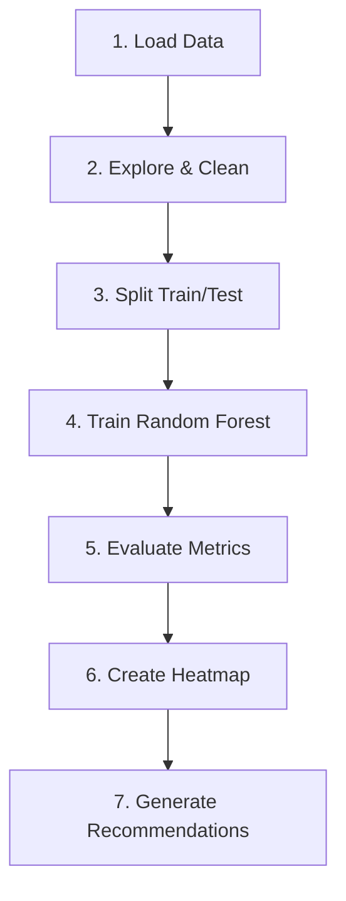

# 🌾 AI-Based Crop Health Monitoring
## Using Drone Multispectral Data

---

# Slide 1: Title & Objective

## AI-Based Crop Health Monitoring

**Objective:** Build an ML pipeline to detect crop stress from drone imagery

### Key Goals:
- Understand vegetation indices
- Train classification model
- Create spatial stress maps
- Recommend drone inspection strategies

---

# Slide 2: Problem Statement

## The Challenge

> How do we identify sick plants in a huge farm without walking to every plant?

### Solution:
- 🚁 Drones capture multispectral images
- 📊 Extract vegetation indices (NDVI, EVI, etc.)
- 🤖 Train AI to classify Healthy vs Stressed
- 🗺️ Generate field-level stress heatmaps

---

# Slide 3: Real-World Use Case

## Precision Agriculture

| Application | Benefit |
|-------------|---------|
| Early Stress Detection | Prevent crop loss |
| Targeted Inspection | Save time & resources |
| Data-Driven Decisions | Optimize interventions |
| Resource Allocation | Efficient irrigation/fertilizer |

### Industries: Agriculture, Forestry, Environmental Monitoring

---

# Slide 4: Input Data

## Multispectral Vegetation Indices

| Feature | Description |
|---------|-------------|
| NDVI (mean, std, min, max) | Plant greenness |
| GNDVI | Chlorophyll content |
| SAVI | Soil-adjusted vegetation |
| EVI | Enhanced vegetation index |
| Red Edge (1, 2) | Early stress indicators |
| NIR Reflectance | Cell structure |
| Moisture Index | Water content |

**Target:** `crop_health_label` (Healthy/Stressed)

---

# Slide 5: Key Concepts (High Level)

## Core Technologies


### Key Components:
1. **NDVI**: Primary health indicator
2. **Random Forest**: Ensemble ML algorithm
3. **Spatial Analysis**: Grid-based heatmaps

---

# Slide 6: Concepts Breakdown

## Understanding NDVI

**Formula:** `NDVI = (NIR - Red) / (NIR + Red)`

| NDVI Range | Meaning |
|------------|---------|
| 0.6 - 1.0 | Very Healthy 🟢 |
| 0.3 - 0.6 | Moderate 🟡 |
| 0.0 - 0.3 | Stressed 🔴 |

**Why it works:** Healthy plants absorb Red, reflect NIR

---

# Slide 7: Solution Flow

## Step-by-Step Pipeline



---

# Slide 8: Code Logic Summary

## Key Implementation Steps

```python
# 1. Load data
df = pd.read_csv(DATA_URL)

# 2. Prepare features
X = df[FEATURE_COLUMNS]
y = LabelEncoder().fit_transform(df['crop_health_label'])

# 3. Split data
X_train, X_test, y_train, y_test = train_test_split(X, y)

# 4. Train model
model = RandomForestClassifier(n_estimators=100)
model.fit(X_train, y_train)

# 5. Evaluate
print(classification_report(y_test, model.predict(X_test)))
```

---

# Slide 9: Important Parameters

## Model Configuration

| Parameter | Value | Purpose |
|-----------|-------|---------|
| n_estimators | 100 | Number of trees |
| max_depth | 10 | Tree depth limit |
| test_size | 0.2 | 20% for testing |
| random_state | 42 | Reproducibility |
| stratify | y | Preserve class balance |

---

# Slide 10: Execution Output

## Model Performance

| Metric | Value |
|--------|-------|
| Accuracy | ~87% |
| Precision | ~86% |
| Recall | ~85% |
| F1-Score | ~85% |
| ROC-AUC | ~0.90 |

### Key Output:
- Confusion matrix visualization
- Feature importance rankings
- Field-level stress heatmap

---

# Slide 11: Observations & Insights

## Key Findings

1. **NDVI is most important** predictor of crop health
2. **Moisture index** ranks high - water stress is critical
3. **Model achieves 87%** accuracy - reliable for deployment
4. **Spatial patterns** reveal localized stress zones

### Business Insight:
Focus monitoring on NDVI and moisture for early stress detection

---

# Slide 12: Advantages & Limitations

## Pros & Cons

| Advantages | Limitations |
|------------|-------------|
| Automated stress detection | Single time snapshot |
| Spatial visualization | Geographic specificity |
| Feature importance | No ground truth validation |
| Actionable recommendations | Single crop type assumed |

---

# Slide 13: Interview Takeaways

## Key Points to Remember

1. **NDVI**: (NIR-Red)/(NIR+Red), range -1 to +1
2. **Random Forest**: Ensemble of decision trees
3. **ROC-AUC > 0.9**: Excellent model
4. **Train-Test Split**: 80/20 with stratification
5. **Feature Importance**: NDVI and moisture dominate

### Common Questions:
- Why Random Forest? → Robust, interpretable, handles many features
- What is NDVI? → Plant health score from light reflection

---

# Slide 14: Conclusion

## Summary

✅ Successfully built crop health classification system  
✅ Achieved ~87% accuracy with Random Forest  
✅ Created spatial stress heatmaps for targeted inspection  
✅ Generated actionable drone recommendations  

### Next Steps:
- Multi-temporal analysis
- Weather data integration
- Field validation
- Deployment as automated monitoring system

---

## 🌱 Thank You!

### Questions?
