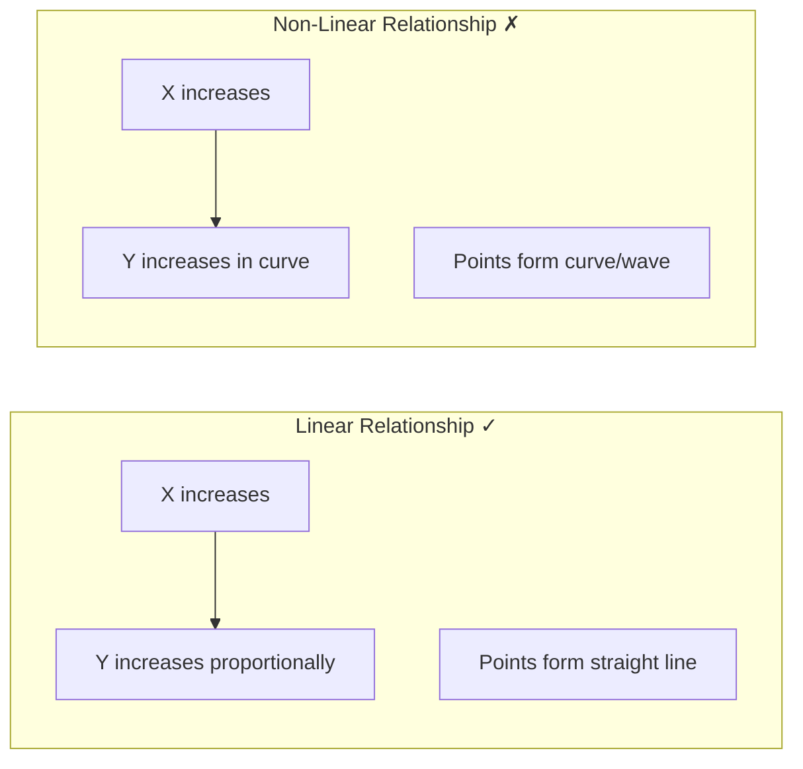
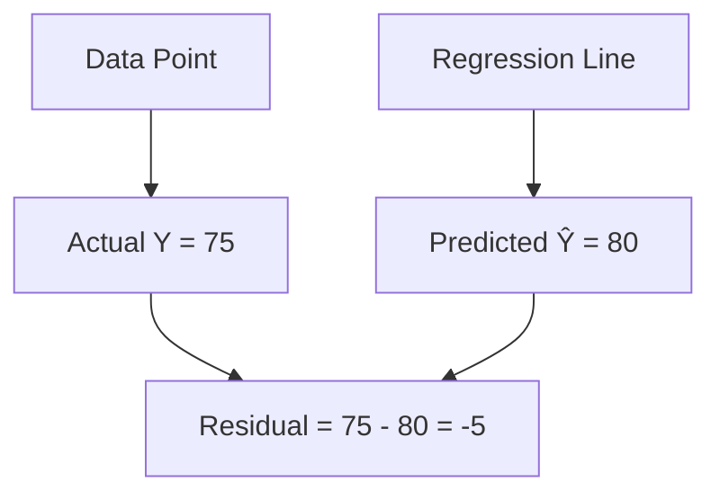
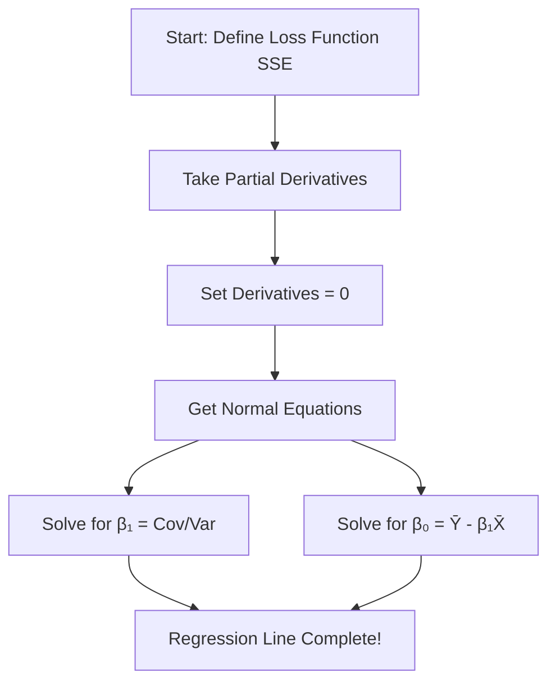

# AS21: Linear Regression Fundamentals - Classroom Session (Part 1)

> 📚 **This is Part 1** covering: Introduction, Regression Line Equation, Slope & Intercept, Least Squares Method, Mathematical Derivation
> 📘 **See also:** [Part 2](./AS21_LinearRegressionFundamentals2.md), [Part 3](./AS21_LinearRegressionFundamentals3.md)

---

## 🗺️ Mind Map - Topics to Cover

```mermaid
mindmap
  root((Linear Regression))
    Basic Concepts
      What is Regression?
      Linear Relationship
      Dependent vs Independent Variable
      Regression Line Equation Y=mX+c
    Slope and Intercept
      What is Slope (Weight)?
      What is Intercept (Bias)?
      Interpreting Slope & Intercept
    Least Squares Method
      Residuals
      Mean Squared Error
      Why Square Errors?
      Minimizing Error
    Mathematical Derivation
      Loss Function
      Partial Derivatives
      Normal Equations
      Closed-form Solution
    Python Implementation
      Using sklearn
      Using statsmodels
      Data Reshaping
    Assumptions
      Linearity
      Independence
      Normality
      Homoscedasticity
    Diagnostic Plots
      Parity Plot
      Residual Plot
      QQ Plot
      Detecting Problems
```

---

## 🎓 Classroom Conversation

### Topic 1: Introduction to Linear Regression

**Teacher:** Namskar students! Ippudu mana Machine Learning journey lo most fundamental algorithm - **Linear Regression** - gurinchi discuss chestamu. Idi supervised learning lo starting point!

**Beginner Student:** Sir, regression ante enti exactly? Classification kanna different aa?

**Teacher:** Excellent question! Let me explain with simple analogy:

> **Classification** = Categories predict chestamu (Yes/No, Cat/Dog, Spam/Not Spam)
> **Regression** = Continuous numbers predict chestamu (Price, Temperature, Sales)

**Real-life examples:**
- House price predict cheyyadam based on size → Regression
- Student pass avthada fail avthada → Classification
- Tomorrow temperature enti → Regression

> 💡 **Jargon Alert - Regression**
> Simple Explanation: Finding a number as output, not a category. Like predicting "how much" instead of "which type"
> Example: Predicting tomorrow's stock price = $150.50 (not "up" or "down")

**Clever Student:** Sir, "Linear" ante enti? Why specifically linear regression?

**Teacher:** Very good! Let's understand:

**Linear** = Straight line relationship

If X increases, Y increases (or decreases) in a **straight line pattern**.



**Example:**
- **Linear**: More study hours → Higher marks (proportionally)
- **Non-Linear**: Age vs Height (grows fast in childhood, slows down)

---

### Topic 2: The Regression Line Equation

**Teacher:** Ab equation samajhte hai. Mana goal enti?

**Goal**: Find a line that best fits the data points!

**The Equation:**
```
Y = mX + c
```
or in ML terms:
```
Y = wX + b
```

Where:
- **Y** = Predicted output (Dependent Variable)
- **X** = Input feature (Independent Variable)
- **m** or **w** = Slope (Weight)
- **c** or **b** = Intercept (Bias)

**Beginner Student:** Sir, slope and intercept ante enti? Confusion vasthundi.

**Teacher:** Let me use school graph analogy!

```
      Y
      |
    10|           /
     8|         /
     6|       /    ← This is our line!
     4|     /
     2|   /
     0|_/_____________ X
       0  1  2  3  4
```

> **Slope (m)** = How steep is the line? How much Y changes when X increases by 1
> 
> **Intercept (c)** = Where does the line cross the Y-axis? Value of Y when X = 0

**Simple Analogy:**
- **Slope** = Speedometer of a car. Higher slope = faster change
- **Intercept** = Starting point of your journey

**Practical Student:** Sir, interview lo "What is slope and intercept?" adigithey ela cheppali?

**Teacher:** Interview one-liner:

> *"Slope is the expected change in Y for one unit increase in X. Intercept is the value of Y when X equals zero. Together they define the position and angle of the regression line."*

---

### Topic 3: Understanding Slope in Detail

**Teacher:** Slope gurinchi deeper chuddam.

#### What Different Slopes Mean:

| Slope Value | Meaning | Visualization |
|------------|---------|---------------|
| Positive (e.g., +2) | Y increases as X increases | Line goes up ↗ |
| Negative (e.g., -1.5) | Y decreases as X increases | Line goes down ↘ |
| Zero (0) | Y doesn't change with X | Horizontal line → |
| Large (e.g., +10) | Y changes rapidly | Steep line |
| Small (e.g., +0.1) | Y changes slowly | Gentle slope |

**Curious Student:** Sir, slope 2 ante exactly emi?

**Teacher:** Slope = 2 means:
- If X increases by 1, Y increases by 2
- If X increases by 5, Y increases by 10

```
Y = 2X + 1

When X = 0: Y = 2(0) + 1 = 1
When X = 1: Y = 2(1) + 1 = 3
When X = 2: Y = 2(2) + 1 = 5

Change in X = 1, Change in Y = 2 → Slope = 2
```

**Critique Student:** Sir, slope negative ayithe emi avthundi?

**Teacher:** Good question! Negative slope means **inverse relationship**:
- More work hours → Less free time (negative)
- Higher price → Lower demand (negative)

```
Y = -1.5X + 10

When X = 0: Y = 10
When X = 2: Y = 7
When X = 4: Y = 4

As X increases, Y decreases!
```

---

### Topic 4: Understanding Intercept in Detail

**Teacher:** Intercept gurinchi chuddam.

**Intercept (c or b)** = Value of Y when X = 0

**Where physically?**
- It's the point where line crosses the Y-axis
- It's the "starting value" or "base value"

```
      Y
      |
    10|           /
     8|         /
     6|       /
     4|     /
   →2|   * ← Intercept = 2 (line crosses Y-axis here)
     0|_/_____________ X
```

**Debate Student:** Sir, intercept negative ayithe emi?

**Teacher:** Negative intercept means line crosses Y-axis below zero!

```
Y = 2X - 3  (intercept = -3)

When X = 0: Y = -3  ← Below zero!
When X = 1: Y = -1
When X = 2: Y = 1   ← Now positive
```

**Real example**: Base cost might be negative in some transformations, but in real-world usually intercept has meaningful interpretation.

---

### Topic 5: Residuals - The Heart of Regression

**Teacher:** Ippudu most important concept - **Residuals**!

**Beginner Student:** Sir, residual ante enti?

**Teacher:** Simple explanation:

> **Residual** = Actual Value - Predicted Value
> **Residual** = Y - Ŷ (Y minus Y-hat)

**Analogy**: 
- You predicted exam marks = 80
- Actual marks = 75
- Residual = 75 - 80 = **-5** (you over-predicted by 5!)



**Visualizing Residuals:**

```
      Y
      |     * Actual point (Y = 75)
      |     |
      |     | ← Residual (distance = 5)
      |     ↓
      |   ----*---- Predicted on line (Ŷ = 80)
      |_____________________________ X
```

> 💡 **Jargon Alert - Residual**
> Simple Explanation: The "mistake" or "error" in prediction. How far off we were.
> Example: Weather app said 30°C, actual was 28°C. Residual = -2°C

**Practical Student:** Sir, interview lo residual explanation ela?

**Teacher:** Interview answer:

> *"Residuals are the differences between observed values and predicted values. They measure how well our regression line fits the data. Smaller residuals mean better fit."*

---

### Topic 6: Least Squares Method

**Teacher:** Ippudu core method - **Least Squares**!

**Goal**: Find the line that minimizes total error across all points.

**But wait - which error to minimize?**

**Clever Student:** Sir, simple ga all residuals add cheste saripodu kadaa?

**Teacher:** NO! That's the problem! Let me show:

```
Point 1: Residual = +5 (above line)
Point 2: Residual = -5 (below line)
Sum = +5 + (-5) = 0  ← Looks perfect but ISN'T!
```

Positive and negative cancel out! That's wrong!

**Solution: SQUARE the residuals!**

```
Point 1: Residual² = (+5)² = 25
Point 2: Residual² = (-5)² = 25
Sum = 25 + 25 = 50  ← Real error!
```

**Why Squaring Works:**
1. ✅ Removes negative signs
2. ✅ Emphasizes larger errors (10² = 100, but 2² = 4)
3. ✅ Mathematically differentiable (for optimization)

> 💡 **Jargon Alert - Least Squares**
> Simple Explanation: Find the line where the sum of squared distances from points to line is MINIMUM
> Example: Among all possible lines, pick the one with smallest total squared error

---

### Topic 7: Mean Squared Error (MSE)

**Teacher:** Least Squares se MSE aata hai:

**MSE Formula:**
```
MSE = (1/n) × Σ(Yᵢ - Ŷᵢ)²
```

Breaking it down:
- **(Yᵢ - Ŷᵢ)** = Residual for point i
- **(Yᵢ - Ŷᵢ)²** = Squared residual
- **Σ** = Sum of all squared residuals
- **(1/n)** = Average (divide by number of points)

**Numerical Example:**

| Point | Actual Y | Predicted Ŷ | Residual | Residual² |
|-------|----------|-------------|----------|-----------|
| 1 | 10 | 12 | -2 | 4 |
| 2 | 20 | 18 | 2 | 4 |
| 3 | 25 | 24 | 1 | 1 |
| 4 | 30 | 33 | -3 | 9 |
| **Sum** | | | | **18** |

```
MSE = 18 / 4 = 4.5
```

**Interview Question:** "What is a good MSE value?"

**Answer:** There's no universal "good" value! It depends on:
- Scale of your data
- Domain requirements
- Comparison with baseline

---

### Topic 8: Mathematical Derivation of Slope and Intercept

**Teacher:** Ippudu maths chuddam - from WHERE do we get the slope formula?

**Debate Student:** Sir, formula just remember cheste saripodu kadaa? Why derivation?

**Teacher:** Good question! Derivation teaches:
1. WHERE the formula comes from
2. WHY it works
3. Interview lo "derive it" adugutharu!

**Step-by-Step Derivation:**

**Step 1: Define the Error Function (Loss Function)**

```
SSE = Σ(Yᵢ - Ŷᵢ)²
SSE = Σ(Yᵢ - (β₀ + β₁Xᵢ))²
```

Where:
- β₀ = Intercept
- β₁ = Slope
- SSE = Sum of Squared Errors

**Step 2: Take Partial Derivatives**

To minimize, we take derivative with respect to both β₀ and β₁:

```
∂SSE/∂β₀ = -2Σ(Yᵢ - β₀ - β₁Xᵢ)
∂SSE/∂β₁ = -2Σ(Yᵢ - β₀ - β₁Xᵢ)Xᵢ
```

**Step 3: Set Derivatives to Zero (for minimum)**

```
∂SSE/∂β₀ = 0  →  ΣYᵢ = nβ₀ + β₁ΣXᵢ
∂SSE/∂β₁ = 0  →  ΣXᵢYᵢ = β₀ΣXᵢ + β₁ΣXᵢ²
```

These are called **Normal Equations**!

**Step 4: Solve for β₁ (Slope)**

After solving:
```
β₁ = Σ(Xᵢ - X̄)(Yᵢ - Ȳ) / Σ(Xᵢ - X̄)²
```

Or equivalently:
```
β₁ = Cov(X,Y) / Var(X)
```

**Step 5: Solve for β₀ (Intercept)**
```
β₀ = Ȳ - β₁X̄
```



**Curious Student:** Sir, Covariance divide by Variance - idi intuitive ga ela samajhali?

**Teacher:** Excellent question!

- **Covariance(X,Y)** = How much X and Y move together
- **Variance(X)** = How much X spreads out

> Slope = "How much Y changes with X" / "How much X spreads"

If X and Y move together strongly (high covariance), slope is high!

---

## 📝 Teacher Summary - Part 1

**Teacher:** Okay students, Part 1 summary:

### Key Takeaways

1. **Linear Regression** = Predict continuous values using straight line
2. **Equation**: Y = mX + c (slope × input + intercept)
3. **Slope** = Rate of change, how steep the line
4. **Intercept** = Starting point where line crosses Y-axis
5. **Residual** = Actual - Predicted (error for each point)
6. **Least Squares** = Minimize sum of squared errors
7. **MSE** = Mean of squared residuals
8. **Slope Formula** = Covariance(X,Y) / Variance(X)

### Common Mistakes

| Mistake | Correct Approach |
|---------|-----------------|
| "Just add all residuals" | Square them to remove negatives |
| "Higher MSE is better" | Lower MSE = better fit |
| "Intercept always meaningful" | Sometimes it's just mathematical anchor |
| "Slope = ratio of X/Y" | Slope = rate of change (Cov/Var) |

### Interview Quick Points

| Question | Answer |
|----------|--------|
| What is Linear Regression? | Supervised ML algorithm to predict continuous values using linear relationship |
| What is MSE? | Average of squared differences between actual and predicted values |
| Why square residuals? | To remove negatives and emphasize larger errors |
| Slope formula? | Covariance(X,Y) / Variance(X) |

---

**Teacher:** Next class lo Python implementation (sklearn, statsmodels) and diagnostic plots chustamu!

> 📘 Continue to [Part 2: Implementation & Assumptions](./AS21_LinearRegressionFundamentals2.md)
