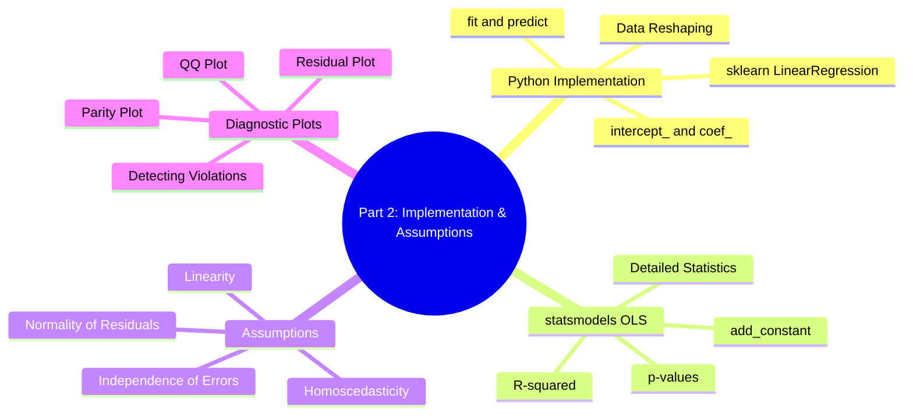
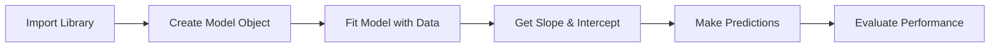
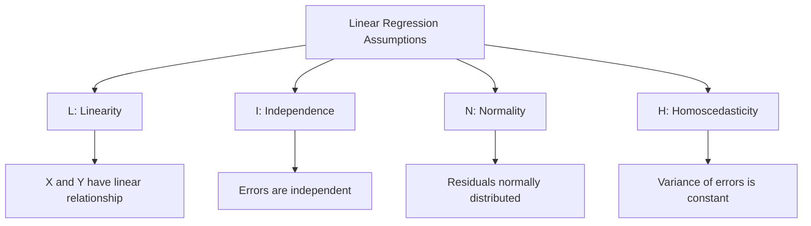

# AS21: Linear Regression Fundamentals - Classroom Session (Part 2)

> 📚 **This is Part 2** covering: Python Implementation (sklearn, statsmodels), Assumptions of Linear Regression, Diagnostic Plots
> 📘 **Previous:** [Part 1](./AS21_LinearRegressionFundamentals1.md)
> 📘 **Next:** [Part 3](./AS21_LinearRegressionFundamentals3.md)

---

## 🗺️ Mind Map - Part 2 Topics



---

## 🎓 Classroom Conversation

### Topic 9: Python Implementation with sklearn

**Teacher:** Welcome back students! Ippudu practical implementation chuddam using Python.

**Beginner Student:** Sir, linear regression eppudu code cheyali? All maths manually aa?

**Teacher:** NO! Libraries use chestamu - **scikit-learn (sklearn)** most popular!

**Basic Flow:**


**Code Example:**

```python
# Step 1: Import the library
import numpy as np
from sklearn.linear_model import LinearRegression

# Step 2: Create sample data
X = np.array([1, 2, 3, 4, 5])  # Input (hours studied)
Y = np.array([10, 20, 25, 30, 35])  # Output (marks)

# Step 3: IMPORTANT - Reshape X to 2D!
X = X.reshape(-1, 1)  # Shape: (5, 1) instead of (5,)

# Step 4: Create model object
model = LinearRegression()

# Step 5: Fit the model (training)
model.fit(X, Y)

# Step 6: Get slope and intercept
print("Slope (coefficient):", model.coef_)      # Output: [6.5]
print("Intercept:", model.intercept_)            # Output: 3.5

# Step 7: Make predictions
X_new = np.array([[6]])  # Predict for 6 hours
prediction = model.predict(X_new)
print("Prediction:", prediction)  # Output: [42.5]
```

**Clever Student:** Sir, reshape(-1, 1) kyun use karthe hai?

**Teacher:** Very important question!

**sklearn expects X in 2D format:**
- **Before reshape:** X = [1, 2, 3, 4, 5] → Shape (5,) - 1D array
- **After reshape:** X = [[1], [2], [3], [4], [5]] → Shape (5, 1) - 2D array

**Why?** Because sklearn is designed for multiple features:
- 1 feature: (n_samples, 1)
- 2 features: (n_samples, 2)
- k features: (n_samples, k)

```python
# Wrong - will give error
X = np.array([1, 2, 3, 4, 5])
model.fit(X, Y)  # ERROR!

# Correct
X = X.reshape(-1, 1)  # -1 means "infer this dimension"
model.fit(X, Y)       # Works!
```

> 💡 **Jargon Alert - reshape(-1, 1)**
> Simple Explanation: Convert 1D array to 2D array with one column
> Example: [1, 2, 3] becomes [[1], [2], [3]]

---

### Topic 10: Understanding sklearn Attributes

**Teacher:** model train ayyaka chala information available:

| Attribute | What it gives | Example |
|-----------|--------------|---------|
| `model.coef_` | Slope (weight) | [6.5] |
| `model.intercept_` | Intercept (bias) | 3.5 |
| `model.predict(X)` | Predictions for X | [42.5, 49.0, ...] |

**Practical Student:** Sir, interview lo sklearn ka workflow explain karne ko bole toh?

**Teacher:** Interview answer structure:

> *"sklearn workflow: (1) Import LinearRegression, (2) Create model object, (3) Call fit() with training data to learn parameters, (4) Use coef_ and intercept_ to see learned values, (5) Call predict() on new data for predictions."*

**Code for Complete Workflow:**

```python
from sklearn.linear_model import LinearRegression
from sklearn.model_selection import train_test_split
from sklearn.metrics import mean_squared_error, r2_score
import numpy as np

# Sample dataset
X = np.array([[1], [2], [3], [4], [5], [6], [7], [8], [9], [10]])
Y = np.array([2.5, 5.1, 7.2, 9.0, 11.5, 13.2, 15.8, 17.5, 20.1, 22.0])

# Split into train and test
X_train, X_test, Y_train, Y_test = train_test_split(X, Y, test_size=0.2, random_state=42)

# Create and train model
model = LinearRegression()
model.fit(X_train, Y_train)

# Predictions
Y_pred = model.predict(X_test)

# Evaluation
mse = mean_squared_error(Y_test, Y_pred)
r2 = r2_score(Y_test, Y_pred)

print(f"Slope: {model.coef_[0]:.4f}")
print(f"Intercept: {model.intercept_:.4f}")
print(f"MSE: {mse:.4f}")
print(f"R²: {r2:.4f}")
```

---

### Topic 11: Implementation with statsmodels

**Teacher:** Another powerful library - **statsmodels** - provides more statistical details!

**Critique Student:** Sir, sklearn already unda, statsmodels enduku?

**Teacher:** Good question! Comparison:

| Aspect | sklearn | statsmodels |
|--------|---------|-------------|
| **Focus** | Machine Learning | Statistical Analysis |
| **Output** | Just predictions | Detailed statistics |
| **R², p-values** | Need separate calculation | Built-in summary |
| **Use case** | Quick modeling | Deep analysis |

**statsmodels Code:**

```python
import numpy as np
import statsmodels.api as sm

# Sample data
X = np.array([1, 2, 3, 4, 5, 6, 7, 8, 9, 10])
Y = np.array([2.5, 5.1, 7.2, 9.0, 11.5, 13.2, 15.8, 17.5, 20.1, 22.0])

# IMPORTANT: Add constant for intercept!
X_with_const = sm.add_constant(X)

# Create OLS model (Ordinary Least Squares)
model = sm.OLS(Y, X_with_const)

# Fit the model
results = model.fit()

# Print detailed summary
print(results.summary())
```

**Beginner Student:** Sir, add_constant kyun zaruri hai?

**Teacher:** statsmodels doesn't automatically add intercept term!

```python
# Without add_constant: fits Y = β₁X (no intercept!)
# With add_constant: fits Y = β₀ + β₁X (proper equation)

# What add_constant does:
# Before: X = [1, 2, 3, 4, 5]
# After:  X = [[1, 1], [1, 2], [1, 3], [1, 4], [1, 5]]
#              ↑ constant column for intercept
```

> 💡 **Jargon Alert - OLS (Ordinary Least Squares)**
> Simple Explanation: The method that minimizes squared errors - same as what sklearn does internally
> Example: Finding best-fit line by minimizing sum of squared distances

---

### Topic 12: Reading statsmodels Summary

**Teacher:** statsmodels summary CHALA information deta hai:

```
                            OLS Regression Results                            
==============================================================================
Dep. Variable:                      y   R-squared:                       0.998
Model:                            OLS   Adj. R-squared:                  0.998
Method:                 Least Squares   F-statistic:                     4234.
Date:                ---------------   Prob (F-statistic):           1.28e-12
==============================================================================
                 coef    std err          t      P>|t|      [0.025      0.975]
------------------------------------------------------------------------------
const          0.2000      0.245      0.816      0.438      -0.364       0.764
x1             2.1818      0.034     65.071      0.000       2.105       2.259
==============================================================================
```

**Key Items to Understand:**

| Metric | What it means |
|--------|--------------|
| **R-squared** | How much variance explained (0 to 1) |
| **Adj. R-squared** | R² adjusted for number of features |
| **const (coef)** | Intercept value |
| **x1 (coef)** | Slope value |
| **P>\|t\|** | p-value (< 0.05 means significant) |

**Curious Student:** Sir, R-squared enti exactly?

**Teacher:** R² (R-squared) = Coefficient of Determination

> **R² = 1 - (SSE / SST)**
> 
> Where:
> - SSE = Sum of Squared Errors (from regression)
> - SST = Total Sum of Squares (variance in Y)

**Interpretation:**
- R² = 0.998 means 99.8% of Y's variance explained by X
- R² = 0.50 means only 50% explained
- R² = 0.10 means poor model (only 10%)

| R² Value | Interpretation |
|----------|----------------|
| 0.90 - 1.00 | Excellent fit |
| 0.70 - 0.89 | Good fit |
| 0.50 - 0.69 | Moderate fit |
| < 0.50 | Poor fit |

---

### Topic 13: Assumptions of Linear Regression

**Teacher:** Ippudu CHALA IMPORTANT topic - **Assumptions**!

**Debate Student:** Sir, assumptions ki importance enti? Model run avthundi kadaa?

**Teacher:** Model RUN avthundi, but **RESULTS may be WRONG!**

> Linear regression assumptions violate aithey:
> - Predictions unreliable
> - Confidence intervals invalid
> - Statistical tests meaningless

**Four Key Assumptions (REMEMBER: L-I-N-H)**



---

### Topic 14: Assumption 1 - Linearity

**Teacher:** First assumption - **Linearity**!

> **Linearity**: The relationship between X and Y is LINEAR (straight line)

**If violated:**
- Linear regression gives WRONG predictions
- Need polynomial or non-linear models instead

**How to check:**
- Scatter plot of X vs Y
- Residual plot (patterns = non-linear)

```python
import matplotlib.pyplot as plt

# Check linearity visually
plt.scatter(X, Y)
plt.xlabel('X')
plt.ylabel('Y')
plt.title('Is relationship linear?')
plt.show()
```

```
LINEAR ✓                    NON-LINEAR ✗
                              
    *                          * *
      *                      *     *
        *                  *         *
          *                            *
            *                          
```

**Practical Student:** Sir, non-linear data pe linear regression use karenge toh?

**Teacher:** **High errors!** Model will try to fit line to curve - doesn't work!

```
Non-linear data + Linear model = Poor fit!

      *     *
    *   * * * * regression line (BAD!)
  *      
 *        
*         
```

---

### Topic 15: Assumption 2 - Independence of Errors

**Teacher:** Second assumption - **Independence**!

> **Independence**: Errors should NOT have pattern or correlation

**If violated (errors correlated):**
- Called "autocorrelation"
- Common in time series data
- Standard errors wrong

**What dependent errors look like:**

```
Independent Errors ✓        Dependent Errors ✗
                              
  *                           * * *
    *   *                         * * *
  *   *                               * * *
    *                                     * * *
  *     *                                     * *
                              Pattern visible!
```

**Critique Student:** Sir, errors correlated hote hai kab?

**Teacher:** Common scenario: **Time series data**
- Today's error affects tomorrow's
- Stock prices, weather, sales trends

**Solution**: Use specialized models like ARIMA for time series.

---

### Topic 16: Assumption 3 - Normality of Residuals

**Teacher:** Third assumption - **Normality**!

> **Normality**: Residuals should follow normal distribution (bell curve)

**Why it matters:**
- Confidence intervals based on normal distribution
- Hypothesis tests assume normality
- Predictions may be biased if non-normal

**How to check:**
1. **Histogram** of residuals
2. **QQ Plot** (Quantile-Quantile Plot)

```python
import scipy.stats as stats

# Calculate residuals
Y_pred = model.predict(X)
residuals = Y - Y_pred

# Histogram
plt.hist(residuals, bins=20, edgecolor='black')
plt.title('Distribution of Residuals')
plt.show()

# QQ Plot
stats.probplot(residuals, dist="norm", plot=plt)
plt.title('QQ Plot')
plt.show()
```

**What QQ Plot Shows:**

```
Normal Residuals ✓           Non-Normal ✗
                              
     * * *                        * *
   * *                          * *
  *                            *
 *                            *
*                            * * * * (heavy tail)
```

If points follow the diagonal line = Normal!
If points deviate = Non-normal!

> 💡 **Jargon Alert - QQ Plot**
> Simple Explanation: Compares your data's distribution to theoretical normal distribution. Points on line = normal!
> Example: If your residuals' QQ plot shows straight line, they're normally distributed

---

### Topic 17: Assumption 4 - Homoscedasticity

**Teacher:** Fourth assumption - **Homoscedasticity** (constant variance)!

**Beginner Student:** Sir, homoscedasticity kya hai? Bahut mushkil word!

**Teacher:** Simple meaning:

> **Homoscedasticity** = Variance of errors is SAME across all X values
> 
> Opposite: **Heteroscedasticity** = Variance CHANGES with X

**Visual Example:**

```
Homoscedasticity ✓           Heteroscedasticity ✗
(Same spread everywhere)     (Funnel shape!)

    * * *                          * * * * *
  *   *   *                      *   *   *
    *   *                          * *
      *                              *
    * * *                            
  *   *   *                          
    *   *                          
                              Spread increases!
```

**Funnel Shape = Heteroscedasticity = Problem!**

**Why it's bad:**
- Standard errors are WRONG
- Confidence intervals unreliable
- Predictions vary in reliability

**How to detect:**
- Plot Residuals vs Fitted Values
- Look for funnel/cone shape

```python
# Residuals vs Fitted plot
Y_pred = model.predict(X)
residuals = Y - Y_pred

plt.scatter(Y_pred, residuals)
plt.axhline(y=0, color='r', linestyle='--')
plt.xlabel('Fitted Values')
plt.ylabel('Residuals')
plt.title('Residuals vs Fitted - Check for Funnel')
plt.show()
```

**Practical Student:** Sir, heteroscedasticity detect ho gaya, fix kaise kare?

**Teacher:** Solutions:
1. **Transform Y** (log transformation)
2. **Weighted Least Squares** (give less weight to high-variance points)
3. **Use robust regression**

---

## 📝 Teacher Summary - Part 2

**Teacher:** Part 2 summary:

### Key Takeaways

1. **sklearn**: Quick modeling with `LinearRegression`, `fit()`, `predict()`
2. **statsmodels**: Detailed statistics with OLS, `summary()`
3. **Reshape X** to 2D for sklearn using `reshape(-1, 1)`
4. **add_constant** required in statsmodels for intercept
5. **R²** measures how much variance explained (0 to 1)
6. **4 Assumptions**: Linearity, Independence, Normality, Homoscedasticity

### Assumption Violations Summary

| Assumption | How to Check | Sign of Violation |
|------------|-------------|-------------------|
| Linearity | Scatter plot | Curved pattern |
| Independence | Residual patterns | Systematic patterns |
| Normality | QQ plot, histogram | Deviation from line |
| Homoscedasticity | Residuals vs Fitted | Funnel shape |

### Interview Quick Points

| Question | Answer |
|----------|--------|
| sklearn vs statsmodels? | sklearn for ML predictions, statsmodels for statistical analysis |
| What is R²? | Proportion of variance in Y explained by model (0-1) |
| What is homoscedasticity? | Constant variance of residuals across all X values |
| How to check normality? | QQ plot - points should follow diagonal line |

---

**Teacher:** Next class lo Diagnostic Plots chustamu - Parity, Residual, QQ in detail!

> 📘 Continue to [Part 3: Diagnostic Plots & Practice](./AS21_LinearRegressionFundamentals3.md)
