# AS21: Linear Regression Fundamentals - Classroom Session (Part 3)

> 📚 **This is Part 3** covering: Diagnostic Plots (Parity, Residual, QQ), Pattern Recognition, What to Do When Assumptions Fail
> 📘 **Previous:** [Part 1](./AS21_LinearRegressionFundamentals1.md), [Part 2](./AS21_LinearRegressionFundamentals2.md)

---

## 🗺️ Mind Map - Part 3 Topics


---

## 🎓 Classroom Conversation

### Topic 18: Diagnostic Plots Overview

**Teacher:** Welcome back students! Ippudu Diagnostic Plots - **model health check** - chuddam!

**Beginner Student:** Sir, diagnostic plots enti? Kyun zaruri hai?

**Teacher:** Simple analogy:

> **Doctor's Check-up for Model!**
> 
> Just like doctor checks blood pressure, heart rate, etc. to see if you're healthy...
> Diagnostic plots check if your LINEAR REGRESSION is healthy!

**Three Main Diagnostic Plots:**

| Plot | What it checks | Good Sign |
|------|---------------|-----------|
| **Parity Plot** | Predicted vs Actual | Points on 45° line |
| **Residual Plot** | Errors vs Fitted | Random scatter |
| **QQ Plot** | Normality of residuals | Points on diagonal |


---

### Topic 19: Parity Plot (Predicted vs Actual)

**Teacher:** First plot - **Parity Plot**!

**What is it?**
- X-axis: Predicted values (Ŷ)
- Y-axis: Actual values (Y)
- Compare how close predictions are to reality

**Perfect Scenario:**
```
If Ŷ = Y for all points → All points on 45° line!
```

```python
import matplotlib.pyplot as plt
import numpy as np
from sklearn.linear_model import LinearRegression

# Sample data
X = np.array([[1], [2], [3], [4], [5], [6], [7], [8]])
Y = np.array([2.1, 4.2, 5.8, 8.1, 9.9, 12.2, 14.0, 16.1])

# Train model
model = LinearRegression()
model.fit(X, Y)
Y_pred = model.predict(X)

# Parity Plot
plt.figure(figsize=(6, 6))
plt.scatter(Y_pred, Y, alpha=0.7)
plt.plot([Y.min(), Y.max()], [Y.min(), Y.max()], 'r--', label='Perfect Fit')
plt.xlabel('Predicted Values')
plt.ylabel('Actual Values')
plt.title('Parity Plot: Predicted vs Actual')
plt.legend()
plt.show()
```

**Interpreting Parity Plot:**

```
GOOD (Points on line)        BAD (Points scattered)
        
     * /                           *    *
    * /                          *    *
   * /                         *   *
  * /                            *    *
 * /                          *     *
                               widespread scatter!
```

**Clever Student:** Sir, parity plot se kya conclusion nikal sakte hai?

**Teacher:** Three scenarios:

| Pattern | Meaning |
|---------|---------|
| Points ON the line | Excellent predictions! |
| Points ABOVE line | Model under-predicting |
| Points BELOW line | Model over-predicting |

---

### Topic 20: Residual Plot

**Teacher:** Most important plot - **Residual Plot**!

**What is it?**
- X-axis: Fitted values (Ŷ)
- Y-axis: Residuals (Y - Ŷ)
- Check if errors are random

**Why Most Important?**
- Reveals linearity violations
- Shows heteroscedasticity
- Detects patterns in errors

```python
# Calculate residuals
residuals = Y - Y_pred

# Residual Plot
plt.figure(figsize=(8, 5))
plt.scatter(Y_pred, residuals, alpha=0.7)
plt.axhline(y=0, color='r', linestyle='--', label='Zero Line')
plt.xlabel('Fitted Values')
plt.ylabel('Residuals')
plt.title('Residual Plot: Look for Patterns!')
plt.legend()
plt.show()
```

**What to Look For:**

```mermaid
flowchart TD
    A[Residual Plot] --> B{What pattern?}
    B -->|Random scatter| C[✓ Good! Linear assumption OK]
    B -->|Curve/S-shape| D[✗ Non-linear relationship]
    B -->|Funnel shape| E[✗ Heteroscedasticity]
    B -->|Trend| F[✗ Independence violated]
```



---

### Topic 21: Residual Plot Patterns in Detail

**Teacher:** Different patterns eppudu dikhthe hai?

#### Pattern 1: Random Scatter (GOOD!)

```
        * 
    *       *
  *   *   *   *
    *       *
        *
0 ─────────────────
        *
    *       *
  *   *   *   *
```

**Meaning**: Linear regression is appropriate!

#### Pattern 2: Curved/U-Shape (BAD!)

```
*                   *
  *               *
    *           *
      * * * * *
0 ─────────────────
```

**Meaning**: Data is NON-LINEAR! Need polynomial or other model.

#### Pattern 3: Funnel Shape (BAD!)

```
      *
    * *
  *   * *   *
*       *     * * *
0 ─────────────────
          * *   * *
            *     * *
              *     * *
```

**Meaning**: Heteroscedasticity! Variance increases with X.

**Critique Student:** Sir, funnel shape dikhne pe kya karna chahiye?

**Teacher:** Solutions for Heteroscedasticity:
1. **Log transform** Y or X
2. **Box-Cox transformation**
3. **Weighted Least Squares** (WLS)
4. **Robust regression**

---

### Topic 22: QQ Plot (Quantile-Quantile Plot)

**Teacher:** Third plot - **QQ Plot** - checks normality!

**What is it?**
- X-axis: Theoretical quantiles (from normal distribution)
- Y-axis: Sample quantiles (from your residuals)
- Compares your data to perfect normal

```python
import scipy.stats as stats

# QQ Plot
fig, ax = plt.subplots(figsize=(6, 6))
stats.probplot(residuals, dist="norm", plot=ax)
ax.set_title('QQ Plot: Check Normality of Residuals')
plt.show()
```

**Interpreting QQ Plot:**

```
NORMAL ✓                    NON-NORMAL ✗
(Points on line)            (Deviations visible)

     * /                         * *
    * /                        * /
   * /                       * /
  * /                       * /
 * /                       * * * (heavy tail)
```

**Beginner Student:** Sir, QQ plot me "quantile" exactly kya hai?

**Teacher:** Simple explanation:

> **Quantile** = Points that divide your data into equal parts
> 
> - 25th percentile (Q1) = 25% data below this
> - 50th percentile (Median) = 50% data below
> - 75th percentile (Q3) = 75% data below

QQ plot compares:
- YOUR data's quantiles (sample)
- PERFECT normal distribution's quantiles (theoretical)

If they match → Points on line → Data is NORMAL!

---

### Topic 23: Common QQ Plot Patterns

**Teacher:** QQ plot me common patterns:

#### Pattern 1: Normal Distribution (GOOD!)

```
     /
    /
   /    ← Points ON the line
  /
 /
```

**Meaning**: Residuals normally distributed. All assumptions OK!

#### Pattern 2: Heavy Tails

```
       * *     ← Points curve UP at right
     * /
    * /
   * /
  * /
* *           ← Points curve DOWN at left
```

**Meaning**: More extreme values than normal (outliers exist)!

#### Pattern 3: Right Skewed

```
         * * *
       * /
      * /
     * /
    * /
   * /
  /
```

**Meaning**: Long tail on right side. Data positively skewed.

#### Pattern 4: Left Skewed

```
 /
  * /
   * /
    * /
     * /
      * /
        * * *
```

**Meaning**: Long tail on left side. Data negatively skewed.

**Practical Student:** Sir, interview me QQ plot explain karne ko bole toh?

**Teacher:** Interview answer:

> *"QQ plot compares sample quantiles to theoretical normal quantiles. If points fall on the diagonal line, residuals are normally distributed. Deviations indicate skewness, heavy tails, or other non-normality, suggesting linear regression assumptions may be violated."*

---

### Topic 24: Complete Diagnostic Workflow

**Teacher:** Ab puri process ek saath dekhte hai:

```python
import numpy as np
import matplotlib.pyplot as plt
from sklearn.linear_model import LinearRegression
from scipy import stats

# Sample data
np.random.seed(42)
X = np.linspace(1, 10, 50).reshape(-1, 1)
Y = 2.5 * X.flatten() + 3 + np.random.randn(50) * 2

# Train model
model = LinearRegression()
model.fit(X, Y)
Y_pred = model.predict(X)
residuals = Y - Y_pred.flatten()

# Create diagnostic plots
fig, axes = plt.subplots(2, 2, figsize=(12, 10))

# 1. Parity Plot
axes[0, 0].scatter(Y_pred, Y)
axes[0, 0].plot([Y.min(), Y.max()], [Y.min(), Y.max()], 'r--')
axes[0, 0].set_xlabel('Predicted')
axes[0, 0].set_ylabel('Actual')
axes[0, 0].set_title('Parity Plot')

# 2. Residual vs Fitted
axes[0, 1].scatter(Y_pred, residuals)
axes[0, 1].axhline(y=0, color='r', linestyle='--')
axes[0, 1].set_xlabel('Fitted Values')
axes[0, 1].set_ylabel('Residuals')
axes[0, 1].set_title('Residual Plot')

# 3. Histogram of Residuals
axes[1, 0].hist(residuals, bins=15, edgecolor='black')
axes[1, 0].set_xlabel('Residuals')
axes[1, 0].set_ylabel('Frequency')
axes[1, 0].set_title('Residual Distribution')

# 4. QQ Plot
stats.probplot(residuals, dist="norm", plot=axes[1, 1])
axes[1, 1].set_title('QQ Plot')

plt.tight_layout()
plt.show()
```

---

### Topic 25: What to Do When Assumptions Fail

**Teacher:** Assumptions fail hone pe solutions:

#### When Linearity Fails:

| Problem | Solution |
|---------|----------|
| Non-linear relationship | Polynomial regression |
| Curved residuals | Feature transformation |
| Complex patterns | Decision trees, neural networks |

#### When Independence Fails:

| Problem | Solution |
|---------|----------|
| Time series correlation | ARIMA, time series models |
| Clustered data | Mixed effects models |
| Spatial correlation | Spatial regression |

#### When Normality Fails:

| Problem | Solution |
|---------|----------|
| Skewed residuals | Transform Y (log, sqrt) |
| Heavy tails | Robust regression |
| Outliers | Remove or down-weight |

#### When Homoscedasticity Fails:

| Problem | Solution |
|---------|----------|
| Funnel shape | Log transform |
| Variance changes | Weighted Least Squares |
| Complex patterns | Generalized Least Squares |

**Curious Student:** Sir, agar multiple assumptions fail ho gayi toh?

**Teacher:** Consider:
1. **Different algorithm** (Random Forest, SVM)
2. **Transform data** (log, Box-Cox)
3. **Feature engineering**
4. **Consult domain expert**

> Remember: Linear regression is SIMPLE - if data doesn't fit, use appropriate tool!

---

## 📝 Teacher Summary - Part 3

**Teacher:** Final summary:

### Key Takeaways

1. **Parity Plot**: Predicted vs Actual - points on 45° line = good
2. **Residual Plot**: Most important - random scatter = good
3. **QQ Plot**: Tests normality - points on line = normal
4. **Funnel shape** in residuals = Heteroscedasticity
5. **Curved pattern** in residuals = Non-linearity
6. **Deviations in QQ** = Non-normal residuals
7. **Solutions exist** for each assumption violation

### Common Mistakes

| Mistake | Correct Approach |
|---------|-----------------|
| "Only look at R²" | Check ALL diagnostic plots |
| "Ignore residual patterns" | Patterns indicate model problems |
| "All data fits linear regression" | Check assumptions first |
| "Heteroscedasticity is minor" | It invalidates standard errors |

### Interview Quick Points

| Question | Answer |
|----------|--------|
| What is residual plot for? | Check linearity and homoscedasticity by looking for patterns |
| What is QQ plot? | Compares sample quantiles to theoretical normal to check normality |
| What does funnel shape indicate? | Heteroscedasticity - variance not constant |
| If assumptions fail? | Transform data, use robust methods, or different algorithms |

---

## 🎯 Complete Topic Summary

| Part | Topics Covered |
|------|---------------|
| Part 1 | Regression basics, Equation, Slope/Intercept, Residuals, Least Squares, MSE, Derivation |
| Part 2 | sklearn/statsmodels implementation, 4 Assumptions (L-I-N-H) |
| Part 3 | Diagnostic Plots (Parity, Residual, QQ), Pattern Recognition, Solutions |

---

**Teacher:** Congratulations students! Linear Regression Fundamentals complete ayyindi!

> 📘 See all parts:
> - [Part 1: Fundamentals](./AS21_LinearRegressionFundamentals1.md)
> - [Part 2: Implementation & Assumptions](./AS21_LinearRegressionFundamentals2.md)
> - [Part 3: Diagnostic Plots](./AS21_LinearRegressionFundamentals3.md)
> - [Exam Preparation](./AS21_LinearRegressionFundamentals_exam_preparation.md)
