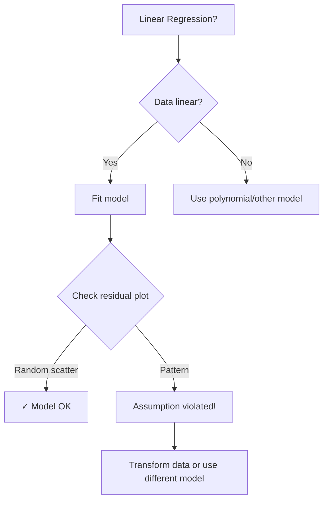

# AS21: Linear Regression Fundamentals - Exam Preparation

> 📚 **Complete exam revision** for Linear Regression topics
> 🎯 Includes MCQs, MSQs, Numerical Questions, Fill-in-the-Blanks, and Quick Revision

---

## 📋 Topic Coverage Checklist

| Topic | Part | Status |
|-------|------|--------|
| Regression Basics | Part 1 | ✅ |
| Slope & Intercept | Part 1 | ✅ |
| Residuals | Part 1 | ✅ |
| Least Squares Method | Part 1 | ✅ |
| MSE (Mean Squared Error) | Part 1 | ✅ |
| Mathematical Derivation | Part 1 | ✅ |
| sklearn Implementation | Part 2 | ✅ |
| statsmodels Implementation | Part 2 | ✅ |
| 4 Assumptions (L-I-N-H) | Part 2 | ✅ |
| Diagnostic Plots | Part 3 | ✅ |

---

## 📝 Multiple Choice Questions (MCQs)

### Section 1: Basic Concepts

**Q1. What type of variable does linear regression predict?**
- A) Categorical variable
- B) Continuous variable
- C) Binary variable
- D) Ordinal variable

**Answer:** B

**Explanation:** Linear regression predicts continuous numeric values (e.g., price, temperature), not categories.

---

**Q2. In the equation Y = mX + c, what does 'm' represent?**
- A) Intercept
- B) Slope (weight)
- C) Residual
- D) Error term

**Answer:** B

**Explanation:** 'm' is the slope, representing the rate of change of Y for unit change in X.

---

**Q3. What is the intercept in a regression line?**
- A) The slope of the line
- B) The value of Y when X = 0
- C) The error in prediction
- D) The maximum value of Y

**Answer:** B

**Explanation:** Intercept is where the line crosses the Y-axis (when X = 0).

---

**Q4. What is a residual?**
- A) Predicted value minus mean
- B) Actual value minus predicted value
- C) Mean minus actual value
- D) Slope minus intercept

**Answer:** B

**Explanation:** Residual = Y - Ŷ (Actual - Predicted), measuring prediction error.

---

**Q5. Why do we square residuals in least squares method?**
- A) To make calculations faster
- B) To remove negative values and emphasize larger errors
- C) To reduce the number of calculations
- D) Because it's a convention

**Answer:** B

**Explanation:** Squaring removes negatives (which would cancel out) and emphasizes larger errors.

---

### Section 2: MSE and Formulas

**Q6. What is MSE?**
- A) Mean of residuals
- B) Sum of residuals
- C) Mean of squared residuals
- D) Sum of absolute residuals

**Answer:** C

**Explanation:** MSE = (1/n) × Σ(Yᵢ - Ŷᵢ)² = average of squared errors.

---

**Q7. The slope formula in linear regression is:**
- A) Variance(X) / Covariance(X,Y)
- B) Covariance(X,Y) / Variance(X)
- C) Covariance(X,Y) / Variance(Y)
- D) Mean(X) / Mean(Y)

**Answer:** B

**Explanation:** Slope = Cov(X,Y) / Var(X), derived from minimizing squared errors.

---

**Q8. What does a negative slope indicate?**
- A) No relationship between X and Y
- B) Y increases when X increases
- C) Y decreases when X increases
- D) Y is always negative

**Answer:** C

**Explanation:** Negative slope means inverse relationship - as X goes up, Y goes down.

---

### Section 3: Python Implementation

**Q9. In sklearn, why must X be reshaped to 2D?**
- A) For faster computation
- B) To match expected format (samples × features)
- C) sklearn doesn't work with 1D
- D) For visualization purposes

**Answer:** B

**Explanation:** sklearn expects X as (n_samples, n_features) array, even for single feature.

---

**Q10. Which method trains the sklearn LinearRegression model?**
- A) model.train()
- B) model.fit()
- C) model.learn()
- D) model.run()

**Answer:** B

**Explanation:** fit() method trains the model by learning slope and intercept.

---

**Q11. What does statsmodels add_constant() do?**
- A) Adds noise to data
- B) Adds a column of 1s for intercept term
- C) Normalizes the data
- D) Removes outliers

**Answer:** B

**Explanation:** add_constant adds intercept column since statsmodels doesn't add it automatically.

---

**Q12. What does R² (R-squared) measure?**
- A) Error rate
- B) Proportion of variance explained by model
- C) Residual sum
- D) Slope of the line

**Answer:** B

**Explanation:** R² shows how much of Y's variance is explained by X (0 to 1).

---

### Section 4: Assumptions

**Q13. Which is NOT an assumption of linear regression?**
- A) Linearity
- B) Independence of errors
- C) Normality of X values
- D) Homoscedasticity

**Answer:** C

**Explanation:** Assumptions are about Y and residuals, not normality of X. The four are: Linearity, Independence, Normality of residuals, Homoscedasticity.

---

**Q14. What does homoscedasticity mean?**
- A) Residuals follow normal distribution
- B) Variance of residuals is constant across all X
- C) X and Y have linear relationship
- D) Errors are independent

**Answer:** B

**Explanation:** Homoscedasticity = constant variance of errors across all X values.

---

**Q15. A funnel-shaped residual plot indicates:**
- A) Perfect fit
- B) Heteroscedasticity
- C) Normality
- D) Good model

**Answer:** B

**Explanation:** Funnel shape means variance increases with X = heteroscedasticity (violation).

---

### Section 5: Diagnostic Plots

**Q16. What does a parity plot compare?**
- A) X vs Y
- B) Predicted vs Actual values
- C) Residuals vs X
- D) Slope vs Intercept

**Answer:** B

**Explanation:** Parity plot shows Predicted (Ŷ) vs Actual (Y). Points on 45° line = good.

---

**Q17. In a QQ plot, points on the diagonal line indicate:**
- A) Non-normal residuals
- B) Normally distributed residuals
- C) Heteroscedasticity
- D) Non-linear relationship

**Answer:** B

**Explanation:** QQ plot compares to theoretical normal. Points on line = residuals are normal.

---

**Q18. Random scatter in residual plot indicates:**
- A) Model is poor
- B) Linearity assumption is satisfied
- C) Heteroscedasticity
- D) Outliers present

**Answer:** B

**Explanation:** Random scatter with no pattern means linear relationship is appropriate.

---

**Q19. A curved pattern in residual plot suggests:**
- A) Perfect linear relationship
- B) Non-linear relationship between X and Y
- C) Normal residuals
- D) Good model fit

**Answer:** B

**Explanation:** Curve/S-shape in residuals means data is non-linear, linear regression inappropriate.

---

**Q20. Which plot best checks for normality of residuals?**
- A) Scatter plot
- B) Parity plot
- C) QQ plot
- D) Bar chart

**Answer:** C

**Explanation:** QQ plot specifically designed to check if data follows normal distribution.

---

---

## ✅ Multiple Select Questions (MSQs)

**MSQ1. Which are components of the regression equation Y = mX + c? (Select ALL)**
- [ ] A) m = slope
- [ ] B) c = intercept
- [ ] C) X = dependent variable
- [ ] D) Y = predicted output

**Answer:** A, B, D

**Explanation:** X is independent (input), not dependent. m=slope, c=intercept, Y=output.

---

**MSQ2. Which are assumptions of linear regression? (Select ALL)**
- [ ] A) Linearity
- [ ] B) Independence of errors
- [ ] C) Normality of residuals
- [ ] D) X must be categorical

**Answer:** A, B, C

**Explanation:** Four assumptions: Linearity, Independence, Normality, Homoscedasticity. X doesn't need to be categorical.

---

**MSQ3. Which indicate problems in residual plot? (Select ALL)**
- [ ] A) Random scatter
- [ ] B) Funnel shape
- [ ] C) U-shaped curve
- [ ] D) S-shaped pattern

**Answer:** B, C, D

**Explanation:** Random scatter is GOOD. Funnel, curves, patterns indicate violations.

---

**MSQ4. Which sklearn methods are used in linear regression? (Select ALL)**
- [ ] A) fit()
- [ ] B) predict()
- [ ] C) coef_
- [ ] D) compile()

**Answer:** A, B, C

**Explanation:** fit() trains, predict() predicts, coef_ gives slope. compile() is for neural networks.

---

**MSQ5. Which are valid solutions for heteroscedasticity? (Select ALL)**
- [ ] A) Log transformation
- [ ] B) Weighted Least Squares
- [ ] C) Increasing sample size only
- [ ] D) Box-Cox transformation

**Answer:** A, B, D

**Explanation:** Transforms and WLS help. More samples alone doesn't fix heteroscedasticity.

---

**MSQ6. What does a positive R² close to 1 indicate? (Select ALL)**
- [ ] A) Good model fit
- [ ] B) Most variance explained
- [ ] C) Low prediction error
- [ ] D) All assumptions met

**Answer:** A, B, C

**Explanation:** High R² means good fit and explained variance. BUT doesn't guarantee assumptions are met!

---

**MSQ7. Which are causes of non-normal residuals? (Select ALL)**
- [ ] A) Outliers
- [ ] B) Wrong model specification
- [ ] C) Skewed dependent variable
- [ ] D) Large sample size

**Answer:** A, B, C

**Explanation:** Large sample actually helps (CLT). Outliers, wrong model, skew cause non-normality.

---

---

## 🔢 Numerical Questions

**N1.** Given: X = [1, 2, 3, 4, 5] and Y = [3, 5, 7, 9, 11]. Calculate the slope using the formula: Slope = Cov(X,Y) / Var(X).

**Solution:**
```
Step 1: Calculate means
X̄ = (1+2+3+4+5)/5 = 3
Ȳ = (3+5+7+9+11)/5 = 7

Step 2: Calculate Covariance
Cov = Σ(Xᵢ - X̄)(Yᵢ - Ȳ) / (n-1)
    = [(1-3)(3-7) + (2-3)(5-7) + (3-3)(7-7) + (4-3)(9-7) + (5-3)(11-7)] / 4
    = [(-2)(-4) + (-1)(-2) + (0)(0) + (1)(2) + (2)(4)] / 4
    = [8 + 2 + 0 + 2 + 8] / 4 = 20/4 = 5

Step 3: Calculate Variance of X
Var(X) = Σ(Xᵢ - X̄)² / (n-1)
       = [(1-3)² + (2-3)² + (3-3)² + (4-3)² + (5-3)²] / 4
       = [4 + 1 + 0 + 1 + 4] / 4 = 10/4 = 2.5

Step 4: Calculate Slope
Slope = Cov/Var = 5/2.5 = 2
```

**Answer:** Slope = **2**

---

**N2.** Calculate MSE given: Actual Y = [10, 15, 20, 25] and Predicted Ŷ = [12, 14, 19, 27].

**Solution:**
```
Step 1: Calculate residuals
Residual₁ = 10 - 12 = -2
Residual₂ = 15 - 14 = 1
Residual₃ = 20 - 19 = 1
Residual₄ = 25 - 27 = -2

Step 2: Square residuals
(-2)² = 4
(1)² = 1
(1)² = 1
(-2)² = 4

Step 3: Sum of squared residuals = 4 + 1 + 1 + 4 = 10

Step 4: MSE = 10/4 = 2.5
```

**Answer:** MSE = **2.5**

---

**N3.** If slope = 3 and intercept = 5, predict Y when X = 10.

**Solution:**
```
Y = mX + c
Y = 3(10) + 5
Y = 30 + 5 = 35
```

**Answer:** Y = **35**

---

**N4.** Given R² = 0.85, what percentage of variance in Y is NOT explained by the model?

**Solution:**
```
R² = 0.85 means 85% variance explained
Unexplained = 1 - 0.85 = 0.15 = 15%
```

**Answer:** **15%**

---

**N5.** If SSE (Sum of Squared Errors) = 100 and SST (Total Sum of Squares) = 400, calculate R².

**Solution:**
```
R² = 1 - (SSE/SST)
R² = 1 - (100/400)
R² = 1 - 0.25 = 0.75
```

**Answer:** R² = **0.75**

---

---

## 📝 Fill in the Blanks

**F1.** The equation Y = mX + c is called the _______ equation.

**Answer:** Regression (or Linear Regression)

---

**F2.** The slope represents the _______ of Y for every one unit increase in X.

**Answer:** Rate of change (or Expected change)

---

**F3.** Residual = _______ value minus _______ value.

**Answer:** Actual, Predicted

---

**F4.** In sklearn, the method used to train a model is _______.

**Answer:** fit()

---

**F5.** The assumption that variance of errors is constant is called _______.

**Answer:** Homoscedasticity

---

**F6.** A _______ plot compares predicted values to actual values.

**Answer:** Parity

---

**F7.** QQ plot is used to check _______ of residuals.

**Answer:** Normality

---

**F8.** Slope = Covariance(X,Y) / _______.

**Answer:** Variance(X)

---

**F9.** In statsmodels, we use _______ to add intercept column.

**Answer:** add_constant()

---

**F10.** A funnel-shaped residual plot indicates _______.

**Answer:** Heteroscedasticity

---

---

## ⚡ Quick Revision Points

### Key Formulas
- **Regression Equation**: Y = mX + c (or Y = wX + b)
- **Slope**: Cov(X,Y) / Var(X)
- **Intercept**: Ȳ - slope × X̄
- **Residual**: Y - Ŷ
- **MSE**: (1/n) × Σ(Yᵢ - Ŷᵢ)²
- **R²**: 1 - (SSE/SST)

### Key Concepts Summary

| Concept | Definition | Key Point |
|---------|-----------|-----------|
| Slope | Rate of change | Higher = steeper line |
| Intercept | Y when X=0 | Starting point |
| Residual | Prediction error | Smaller = better fit |
| MSE | Average squared error | Minimize this! |
| R² | Variance explained | Higher = better |

### 4 Assumptions (L-I-N-H)
1. **L**inearity - X and Y linear relationship
2. **I**ndependence - Errors are independent
3. **N**ormality - Residuals normally distributed
4. **H**omoscedasticity - Constant variance

---

## 🚀 Shortcuts & Cheat Codes

### ⚡ One-Liner Shortcuts

| Concept | Shortcut | When to Use |
|---------|----------|-------------|
| Slope sign | Positive = Y↑ as X↑, Negative = Y↓ as X↑ | Interpreting relationship |
| R² = 0.9+ | Excellent fit | Evaluating model |
| Funnel shape | Heteroscedasticity | Residual plot check |
| Points on QQ line | Normal residuals | Normality check |

### 🎯 Memory Tricks

1. **L-I-N-H**: Remember "LINE H(as)" assumptions - **L**inearity, **I**ndependence, **N**ormality, **H**omoscedasticity
2. **Slope = CoVar**: Cov(X,Y) / Var(X) - "Covariance over Variance"
3. **R² interpretation**: R² = 0.8 means "80% explained, 20% unexplained"

### 🔢 Quick Calculation Hacks

| Scenario | Hack | Example |
|----------|------|---------|
| Predict Y | Y = m×X + c | m=2, c=3, X=5 → Y=13 |
| MSE from SSE | MSE = SSE/n | SSE=100, n=20 → MSE=5 |
| R² | 1 - (SSE/SST) | SSE=50, SST=200 → R²=0.75 |

### 📝 Interview One-Liners

| Question | Safe Answer |
|----------|-------------|
| "What is linear regression?" | "Supervised ML algorithm predicting continuous values using linear relationship" |
| "What is MSE?" | "Average of squared differences between actual and predicted values" |
| "What is R²?" | "Proportion of variance in Y explained by the model, ranges 0 to 1" |
| "Explain homoscedasticity" | "The assumption that variance of residuals remains constant across all X values" |

### ⚠️ "If You Forget Everything, Remember This"

1. **Golden Rule 1**: Slope = Cov/Var, Intercept = Ȳ - slope×X̄
2. **Golden Rule 2**: Check assumptions with diagnostic plots BEFORE trusting results
3. **Golden Rule 3**: Random scatter in residuals = GOOD, patterns = BAD

### 🔄 Quick Decision Flowchart



---

> 📘 **Related Materials:**
> - [Part 1: Fundamentals](./AS21_LinearRegressionFundamentals1.md)
> - [Part 2: Implementation & Assumptions](./AS21_LinearRegressionFundamentals2.md)
> - [Part 3: Diagnostic Plots](./AS21_LinearRegressionFundamentals3.md)
