# AS23: Regression Model Evaluation - Classroom Session (Part 1)

> 📚 **This is Part 1** covering: Introduction, Mean Absolute Error (MAE), Mean Squared Error (MSE), Root Mean Squared Error (RMSE), Sensitivity to Outliers
> 📘 **See also:** [Part 2](./AS23_RegressionModelEvaluation2.md), [Part 3](./AS23_RegressionModelEvaluation3.md)

---

## 🗺️ Mind Map - Topics to Cover

```mermaid
mindmap
  root((Regression Model Evaluation))
    Error Metrics
      Mean Absolute Error - MAE
        Formula & Calculation
        Interpretability
        Same units as Y
      Mean Squared Error - MSE
        Formula & Calculation
        Sensitivity to Outliers
        Squared units
      Root Mean Squared Error - RMSE
        Formula & Calculation
        Back to original units
        Penalization of large errors
    Outlier Sensitivity
      MAE vs MSE comparison
      Mathematical proof
      When to use which
    Coefficient of Determination
      R-Squared - R²
        Formula breakdown
        SS_res - Residual Sum of Squares
        SS_total - Total Sum of Squares
        Interpretation
        Range of values
    Residual Plots
      Pattern detection
      Linear vs Non-linear
      Homoscedasticity
    Model Comparison
      Multiple models evaluation
      Best model selection
      Error metrics comparison
    Practical Implementation
      sklearn functions
      California Housing Dataset
      Real-world interpretation
```



---

## 🎓 Classroom Conversation

### Introduction - Regression Model Evaluation Enduku Important?

**Teacher:** Namaskaram students! Ippudu mana session start cheddham. Ee roju chala important topic - "Regression Model Evaluation" gurinchi discuss cheddham. 

**Beginner Student:** Sir, nenu oka basic doubt adugutanu. Classification lo mana accuracy, precision, recall use chesthamu kada. Regression lo kuda same metrics use cheyacha?

**Teacher:** Chala manchee question! Abbai, idhi fundamental difference understand cheyyali. 

Let me explain with a simple analogy. Suppose meeru oka exam lo marks predict chesthunnaru - classification ante meeru pass or fail ani predict chesthunnaru. Correct or wrong ani easy ga check cheyochu.

But regression lo, meeru actual marks predict chesthunnaru - say 78.5, 82.3, 91.2. Ikkada exact match raadu kada? Suppose nenu 80 predict chesa, but actual marks 82. Is this correct or wrong?

**Beginner Student:** Sir, it's close but not exact. Kani wrong ani kuda chepalem...

**Teacher:** Exactly! Idhi ee regression evaluation complexity. Mana predictions "continuous values" - meaning any number in a range. So mana wrong or right ani binary answer raadu. Instead, manakey "errors" calculate cheyali - how far our predictions are from actual values.

**Clever Student:** Sir, I understand. So basically mana metrics errors measure chesthay, and we try to minimize these errors?

**Teacher:** Perfect understanding! Exactly adi. Mana goal simple - minimize the errors. But "errors" different ways lo measure cheyochu. Ade mana ee session focus.

> 💡 **Jargon Alert - Error / Residual**
> Simple Explanation: Error ante simply difference between what we predicted and what actually happened. Like meeru weather predict chesaru 30°C ani, but actual temperature 32°C. So error = 2°C.
> Example: Meeru house price predict chesaru ₹50 lakhs, but actual price ₹52 lakhs. Error = ₹2 lakhs.

**Practical Student:** Sir, interview lo "What evaluation metrics do you use for regression?" ani adugutaru. Ekka answer emi cheppali?

**Teacher:** Good thinking! Interview lo typically "MAE, MSE, RMSE, and R-squared" ani cheppali. Ee metrics gurinchi in-depth study cheddham.

---

### Topic 1: Mean Absolute Error (MAE)

**Teacher:** Let's start with the simplest metric - Mean Absolute Error. 

#### 1. Definition

MAE is the average of absolute differences between predicted and actual values.

**Formula:**
$$MAE = \frac{1}{n} \sum_{i=1}^{n} |y_i - \hat{y}_i|$$

Ikkada:
- $y_i$ = Actual value (real answer)
- $\hat{y}_i$ = Predicted value (what our model said)
- $n$ = Number of data points
- $| |$ = Absolute value (removes negative sign)

**Beginner Student:** Sir, ee formula lo "absolute" enduku use chesthunnamu? Simple difference use cheyocha?

**Teacher:** Excellent question! Let me give you a simple example.

Suppose mana predictions are:
- Prediction 1: Predicted = 10, Actual = 15 → Error = 10 - 15 = **-5**
- Prediction 2: Predicted = 20, Actual = 15 → Error = 20 - 15 = **+5**

If I just add these errors: (-5) + (+5) = 0

**Beginner Student:** Oh! Errors cancel out ayipothayi!

**Teacher:** Exactly! Positive and negative errors cancel each other. This gives us zero error, but clearly our predictions were wrong by 5 units each time!

So we use absolute value - |−5| = 5 and |+5| = 5. Now average = (5 + 5) / 2 = **5**. This correctly shows our average error is 5 units.

> 💡 **Jargon Alert - Absolute Value**
> Simple Explanation: Absolute value means "ignore the sign" - just take the magnitude. Like distance - whether you walk 5 km forward or backward, the distance is still 5 km.
> Example: |-10| = 10, |+10| = 10, |-0.5| = 0.5

#### 2. Simple Analogy

**Teacher:** Imagine meeru oka archer (bow & arrow person). Target ki aim chesthunnaru. Sometimes arrow target ki 5cm left ki potundi, sometimes 3cm right ki. 

MAE ante - average ga meeru target nunchi entha distance miss avthunnaru? All misses consider chesi, average teesukunte - that's MAE!

**Curious Student:** Sir, so essentially accuracy of the archer meeru measure chesthunnaru?

**Teacher:** Correct! Lower the MAE, better the archer (or our model). If MAE = 0, perfect prediction - every arrow hits bullseye!

#### 3. Why is MAE Used?

**Teacher:** MAE use cheyadaniki multiple reasons unnay:

| Reason | Explanation |
|--------|-------------|
| **Easy to interpret** | Same units as target variable (Y) |
| **Less sensitive to outliers** | Treats all errors equally |
| **Intuitive understanding** | "On average, predictions off by X units" |
| **Business communication** | Easy to explain to non-technical stakeholders |

**Practical Student:** Sir, "same units as Y" ante enti exactly?

**Teacher:** Great practical question! 

Suppose meeru house prices predict chesthunnaru in dollars. 
- If MAE = 30,000, that means "On average, my predictions are wrong by $30,000"
- If predicting temperature in Celsius and MAE = 2.5, means "On average, I'm off by 2.5°C"

Stakeholders ki "Your model has MAE of $30,000" cheppina, they immediately understand it!

#### 4. When to Use MAE?

**Teacher:** MAE best situations:

1. **When all errors are equally important** - ₹1000 error is same as another ₹1000 error
2. **When you have outliers in data** - MAE doesn't get heavily influenced
3. **When easy interpretation is priority** - Business reports, executive summaries
4. **When data doesn't have many extreme values**

**Critique Student:** Sir, meeru "less sensitive to outliers" ani chepparu. But outliers important kaada? If our model makes a huge mistake somewhere, shouldn't we care?

**Teacher:** Chala important point! Nenu adi MSE section lo detailed ga explain chestanu. But for now - yes, sometimes we WANT to penalize large errors more. That's where MSE comes in.

But if outliers are not due to model error but due to data noise (some random extreme values), then we don't want them to dominate our evaluation. In such cases, MAE is better.

#### 5. Where is MAE Used?

**Teacher:** Real-world applications:

| Industry | Use Case | Why MAE? |
|----------|----------|----------|
| **Retail** | Demand forecasting | All prediction errors equally costly |
| **Weather** | Temperature prediction | Easy to communicate to public |
| **Finance** | Budget estimation | Stakeholders understand dollar amounts |
| **Logistics** | Delivery time prediction | Minutes/hours easy to interpret |

#### 6. Is MAE the Only Way?

**Teacher:** No! Alternatives exist. Let's compare:

| Metric | Formula | Pros | Cons |
|--------|---------|------|------|
| **MAE** | Σ\|y - ŷ\| / n | Simple, interpretable | Ignores outliers |
| **MSE** | Σ(y - ŷ)² / n | Penalizes large errors | Hard to interpret units |
| **RMSE** | √MSE | Same units as Y | Still sensitive to outliers |
| **MAPE** | Σ\|y - ŷ\|/y / n × 100 | Percentage-based | Fails when y = 0 |

**Debate Student:** Sir, if MAE simple and interpretable hai, then why do people use MSE more often?

**Teacher:** Excellent debate point! The answer is mathematical - MSE is "differentiable" everywhere, making it easier for optimization algorithms like gradient descent. 

In training neural networks, MSE is preferred because its derivative is smooth. MAE has a "sharp corner" at zero which creates issues in optimization.

But for **evaluation** (not training), MAE is often preferred due to interpretability!

#### 7. Mermaid Diagram - MAE Calculation

```mermaid
flowchart TD
    A[Start: Have Actual Y values and Predicted Y values] --> B[For each data point]
    B --> C[Calculate: y_actual - y_predicted]
    C --> D[Take absolute value: |difference|]
    D --> E[Sum all absolute differences]
    E --> F[Divide by number of data points n]
    F --> G[Result: MAE = Average Absolute Error]
    
    style A fill:#e1f5fe
    style G fill:#c8e6c9
```

#### 8. How to Use MAE - Syntax & Code

**Teacher:** sklearn lo MAE calculate cheyyadam chala easy:

```python
# Import the function
from sklearn.metrics import mean_absolute_error

# Your actual values (ground truth)
y_actual = [100, 150, 200, 180, 220]

# Your model's predicted values
y_predicted = [110, 145, 195, 190, 210]

# Calculate MAE
mae = mean_absolute_error(y_actual, y_predicted)
print(f"Mean Absolute Error: {mae}")
# Output: Mean Absolute Error: 8.0
```

**Beginner Student:** Sir, ee 8.0 meaning enti?

**Teacher:** Excellent! This 8.0 means - "On average, our model predictions deviate by 8 units from the actual values."

If these were house prices in lakhs, you'd say "Our model is off by ₹8 lakhs on average."

#### 9. How MAE Works Internally

**Teacher:** Let's trace through step by step:

```
Actual:    [100, 150, 200, 180, 220]
Predicted: [110, 145, 195, 190, 210]

Step 1 - Calculate differences:
100 - 110 = -10
150 - 145 = +5
200 - 195 = +5
180 - 190 = -10
220 - 210 = +10

Step 2 - Take absolute values:
|-10| = 10
|+5| = 5
|+5| = 5
|-10| = 10
|+10| = 10

Step 3 - Sum all:
10 + 5 + 5 + 10 + 10 = 40

Step 4 - Divide by n (5 data points):
40 / 5 = 8

Result: MAE = 8
```

**Curious Student:** Sir, what if MAE = 0?

**Teacher:** MAE = 0 means perfect predictions! Every predicted value exactly matches actual value. This rarely happens in real-world unless you're overfitting.

#### 10. Visual Summary

```
┌─────────────────────────────────────────────────────────────┐
│                    MAE (Mean Absolute Error)                │
├─────────────────────────────────────────────────────────────┤
│  Formula: MAE = (1/n) × Σ|actual - predicted|               │
├─────────────────────────────────────────────────────────────┤
│  Units: Same as target variable (Y)                         │
│  Range: 0 to ∞ (lower is better)                            │
│  Best for: Simple interpretation, ignore outliers           │
├─────────────────────────────────────────────────────────────┤
│  Interview One-Liner:                                       │
│  "MAE measures average prediction error in original units,  │
│   is robust to outliers, and is easy to interpret."         │
└─────────────────────────────────────────────────────────────┘
```

#### 11. Advantages & Disadvantages (WITH PROOF)

**Advantage 1: Easy Interpretability**

**Claim:** MAE values are in the same units as the target variable, making them easy to understand.

**Proof:**
```python
# House price prediction example
y_actual = [500000, 750000, 600000]  # in dollars
y_predicted = [480000, 770000, 590000]

# Calculate MAE
from sklearn.metrics import mean_absolute_error
mae = mean_absolute_error(y_actual, y_predicted)
print(f"MAE: ${mae:,.0f}")
# Output: MAE: $16,667

# Interpretation: "On average, predictions off by $16,667"
```

**Real-Life Analogy:** Like a speedometer showing km/hr - you immediately understand "I'm going 80 km/hr". MAE gives you error in same units!

**When it matters:** Presenting results to business stakeholders who don't know ML terminology.

---

**Advantage 2: Robust to Outliers**

**Claim:** MAE is less affected by extreme values compared to MSE.

**Proof:**
```python
# Errors: 1, 1, 1, 10 (10 is outlier)
errors = [1, 1, 1, 10]

# MAE calculation
mae = sum(abs(e) for e in errors) / len(errors)
print(f"MAE: {mae}")  # Output: 3.25

# Contribution of outlier to MAE
outlier_contribution = 10 / sum(errors) * 100
print(f"Outlier contributes: {outlier_contribution:.1f}%")
# Output: Outlier contributes: 76.9%

# Compare with MSE
import numpy as np
mse = np.mean([e**2 for e in errors])
print(f"MSE: {mse}")  # Output: 25.75

# Contribution of outlier to MSE
mse_outlier_contribution = (10**2) / sum([e**2 for e in errors]) * 100
print(f"Outlier contributes to MSE: {mse_outlier_contribution:.1f}%")
# Output: Outlier contributes to MSE: 97.1%
```

| Metric | Total Sum | Outlier Contribution |
|--------|-----------|---------------------|
| MAE | 13 | 76.9% |
| MSE | 103 | 97.1% |

**Real-Life Analogy:** Like calculating average salary - if you use simple average with one billionaire included, it skews results. MAE is like using median - less affected by extremes.

**When it matters:** When your data has measurement errors or rare extreme events that shouldn't dominate model evaluation.

---

**Disadvantage 1: Not Differentiable at Zero**

**Claim:** MAE has a "corner" at zero which causes optimization issues.

**Proof:**
```mermaid
graph LR
    A[MAE Function] --> B[|x| has sharp corner at x=0]
    B --> C[Derivative undefined at zero]
    C --> D[Gradient descent struggles]
    D --> E[Not ideal for training neural networks]
```

Mathematical explanation:
- For |x|, derivative = +1 when x > 0
- Derivative = -1 when x < 0
- At x = 0, derivative is undefined (sharp corner)

**Real-Life Analogy:** Like a V-shaped valley - a ball rolling down can't smoothly pass through the bottom point.

**When it matters:** When training deep learning models using gradient-based optimization.

---

**Disadvantage 2: Treats All Errors Equally**

**Claim:** MAE doesn't penalize large errors more than small errors.

**Proof:**
```python
# Model A: Consistent small errors
errors_A = [2, 2, 2, 2]
mae_A = sum(errors_A) / len(errors_A)  # = 2.0

# Model B: One large error, others zero
errors_B = [0, 0, 0, 8]
mae_B = sum(errors_B) / len(errors_B)  # = 2.0

print(f"Model A MAE: {mae_A}")  # 2.0
print(f"Model B MAE: {mae_B}")  # 2.0
# Both have same MAE!
```

| Model | Errors | MAE | Risk Profile |
|-------|--------|-----|--------------|
| A | [2,2,2,2] | 2.0 | Consistent small errors |
| B | [0,0,0,8] | 2.0 | Rare but large errors |

**Real-Life Analogy:** In medical diagnosis, a model that's occasionally VERY wrong might be more dangerous than one consistently slightly wrong. But MAE treats them the same!

**When it matters:** When large errors have serious consequences (medical, financial losses).

---

#### 12. Jargon Glossary

| Term | Simple Explanation | Example |
|------|-------------------|---------|
| **Absolute value** | Remove negative sign | \|-5\| = 5 |
| **Residual** | Difference between actual and predicted | Actual: 100, Pred: 95 → Residual: 5 |
| **Target variable** | What we're trying to predict (Y) | House price, temperature |
| **Metric** | A measurement/score to evaluate performance | MAE, accuracy, F1-score |
| **Robust** | Not easily affected by unusual data | MAE is robust to outliers |

---

### Topic 2: Mean Squared Error (MSE)

**Teacher:** Ippudu mana second metric ki vellam - Mean Squared Error. Idi probably most commonly used metric for regression!

#### 1. Definition

MSE is the average of squared differences between predicted and actual values.

**Formula:**
$$MSE = \frac{1}{n} \sum_{i=1}^{n} (y_i - \hat{y}_i)^2$$

**Beginner Student:** Sir, formula same ga undi, but absolute value kaakunda square use chesthunnamu. Why?

**Teacher:** Correct observation! Square use cheyadam has two purposes:

1. **Remove negative signs** (same as absolute value does)
2. **Penalize large errors more heavily** - this is the KEY difference!

Let me show with example:
- Error = 2 → 2² = 4
- Error = 10 → 10² = 100

The larger error (10) gets penalized 25 times more than the smaller error (2) in MSE.
But in MAE, it's only 5 times more (10 vs 2).

**Clever Student:** So MSE "punishes" the model more if it makes big mistakes?

**Teacher:** Exactly! This is the fundamental difference. MSE says "I really don't like big mistakes, so I'll penalize them heavily!"

> 💡 **Jargon Alert - Penalize / Penalization**
> Simple Explanation: In ML, "penalize" means to increase the error score when something bad happens. Like penalty in football - you lose points.
> Example: If model makes error of 10, MSE penalizes it by 100 (10²), not just 10.

#### 2. Simple Analogy

**Teacher:** Imagine meeru oka taxi driver. You're supposed to drop passengers at their destination. 

- Being 1 km off: Minor inconvenience → Passenger slightly annoyed
- Being 10 km off: Major problem → Passenger VERY angry, multiple complaints

MSE treats it similarly - small errors are okay-ish, but large errors are SEVERELY penalized!

**Critique Student:** Sir, but isn't this unfair sometimes? What if the large error was due to traffic or road construction - not the driver's fault?

**Teacher:** Excellent critique! This is exactly why we need to understand our data. If large errors are due to **outliers in data** (noise), then MSE might unfairly evaluate our model. In such cases, MAE is better.

But if large errors are due to **model failure**, then MSE correctly identifies that the model needs improvement.

#### 3. Why is MSE Used?

| Reason | Explanation |
|--------|-------------|
| **Penalizes large errors** | Important when big mistakes are costly |
| **Mathematically convenient** | Easy to differentiate for optimization |
| **Widely used in ML** | Standard loss function for many algorithms |
| **Gives gradients for training** | Essential for gradient descent |

**Practical Student:** Sir, interview lo "Why is MSE preferred over MAE for training?" ani adugutaru. Answer enti?

**Teacher:** Perfect interview question! The answer has two parts:

1. **Differentiability:** MSE is smooth everywhere. Its derivative exists at all points. MAE has a "corner" at zero where derivative is undefined.

2. **Gradient-based optimization:** Neural networks use gradient descent. MSE gives smooth, continuous gradients. MAE gives gradients of only +1 or -1, which can cause "jumping" around the optimal point.


#### 4. When to Use MSE?

**Teacher:** MSE best situations:

1. **Training machine learning models** - Especially neural networks
2. **When large errors are unacceptable** - Medical predictions, financial forecasts
3. **When data has no outliers** - Or outliers are genuine model failures
4. **When mathematical convenience matters** - Derivative-based optimization

**Debate Student:** Sir, but you said MSE is sensitive to outliers. And also you say use it when no outliers. So basically we should never have outliers?

**Teacher:** Not exactly. The key is understanding WHY outliers exist:

| Outlier Type | What to do |
|--------------|------------|
| **Data noise/errors** | Remove or use MAE |
| **Genuine extreme values** | Keep them, use MSE |
| **Model failure cases** | Keep them, use MSE (model needs to learn) |

#### 5. Where is MSE Used?

| Industry | Use Case | Why MSE? |
|----------|----------|----------|
| **Deep Learning** | Training neural networks | Smooth optimization |
| **Healthcare** | Disease progression prediction | Large errors dangerous |
| **Finance** | Risk assessment | Big losses matter more |
| **Manufacturing** | Quality prediction | Defects have high cost |

#### 6. Is MSE the Only Way?

**Teacher:** No! Let me compare once more:

| Metric | Outlier Sensitivity | Interpretability | Use for Training |
|--------|---------------------|------------------|------------------|
| **MAE** | Low | High (same units) | Difficult |
| **MSE** | High | Low (squared units) | Easy |
| **RMSE** | High | High (same units) | Moderate |
| **Huber** | Moderate | Moderate | Good (hybrid) |

**Curious Student:** Sir, what is Huber loss?

**Teacher:** Good curiosity! Huber loss is a hybrid - it behaves like MSE for small errors and like MAE for large errors. It combines benefits of both!

But that's advanced topic. For now, focus on MAE, MSE, RMSE, and R².

#### 7. Mermaid Diagram - MSE Calculation

```mermaid
flowchart TD
    A[Start: Have Actual Y values and Predicted Y values] --> B[For each data point]
    B --> C[Calculate: y_actual - y_predicted]
    C --> D[Square the difference: difference²]
    D --> E[Sum all squared differences]
    E --> F[Divide by number of data points n]
    F --> G[Result: MSE = Mean Squared Error]
    
    style A fill:#e1f5fe
    style D fill:#fff3e0
    style G fill:#c8e6c9
```



#### 8. How to Use MSE - Syntax & Code

```python
# Import the function
from sklearn.metrics import mean_squared_error

# Your actual values
y_actual = [100, 150, 200, 180, 220]

# Your model's predicted values  
y_predicted = [110, 145, 195, 190, 210]

# Calculate MSE
mse = mean_squared_error(y_actual, y_predicted)
print(f"Mean Squared Error: {mse}")
# Output: Mean Squared Error: 70.0
```

**Beginner Student:** Sir, 70.0 enti? Units evi?

**Teacher:** Idi important point! MSE units are **squared units of Y**.

If Y is in dollars, MSE is in dollars². 
If Y is in meters, MSE is in meters².

This is why MSE is hard to interpret directly. "Your error is 70 dollars-squared" - doesn't make sense to normal people!

**Practical Student:** So how do we interpret MSE?

**Teacher:** Good question! We typically:
1. Compare MSE between models (lower is better)
2. Use RMSE (square root of MSE) for interpretation
3. Don't try to explain raw MSE to business stakeholders

#### 9. How MSE Works Internally

```
Actual:    [100, 150, 200, 180, 220]
Predicted: [110, 145, 195, 190, 210]

Step 1 - Calculate differences:
100 - 110 = -10
150 - 145 = +5
200 - 195 = +5
180 - 190 = -10
220 - 210 = +10

Step 2 - Square the differences:
(-10)² = 100
(+5)² = 25
(+5)² = 25
(-10)² = 100
(+10)² = 100

Step 3 - Sum all:
100 + 25 + 25 + 100 + 100 = 350

Step 4 - Divide by n (5 data points):
350 / 5 = 70

Result: MSE = 70
```

**Curious Student:** Sir, same data ki MAE = 8 vachindi, MSE = 70 vachindi. These numbers directly compare cheyalem kadha?

**Teacher:** Correct! You cannot compare MAE and MSE values directly because:
1. Different scales (linear vs squared)
2. Different units

Only use them to compare different MODELS on the same data, not compare MAE to MSE.

#### 10. Visual Summary

```
┌─────────────────────────────────────────────────────────────┐
│                    MSE (Mean Squared Error)                 │
├─────────────────────────────────────────────────────────────┤
│  Formula: MSE = (1/n) × Σ(actual - predicted)²              │
├─────────────────────────────────────────────────────────────┤
│  Units: Squared units of target variable (Y²)               │
│  Range: 0 to ∞ (lower is better)                            │
│  Best for: Training ML models, penalizing large errors      │
├─────────────────────────────────────────────────────────────┤
│  Interview One-Liner:                                       │
│  "MSE penalizes large errors quadratically, is differentiable│
│   for optimization, but has squared units making            │
│   interpretation difficult."                                │
└─────────────────────────────────────────────────────────────┘
```

#### 11. Advantages & Disadvantages (WITH PROOF)

**Advantage 1: Penalizes Large Errors Heavily**

**Claim:** MSE penalizes large errors quadratically (squared), making it sensitive to big mistakes.

**Proof:**
```python
import numpy as np

# Errors: 1, 1, 1, 10 (10 is outlier)
errors = [1, 1, 1, 10]

# MAE contribution of outlier
mae_total = sum(abs(e) for e in errors)  # 13
mae_outlier_percent = (10 / mae_total) * 100  # 76.9%

# MSE contribution of outlier  
squared_errors = [e**2 for e in errors]  # [1, 1, 1, 100]
mse_total = sum(squared_errors)  # 103
mse_outlier_percent = (100 / mse_total) * 100  # 97.1%

print(f"MAE: Outlier contributes {mae_outlier_percent:.1f}%")
print(f"MSE: Outlier contributes {mse_outlier_percent:.1f}%")
```

| Metric | Outlier (10) Effect | Outlier Contribution |
|--------|---------------------|---------------------|
| MAE | 10 (linear) | 76.9% |
| MSE | 100 (squared) | 97.1% |

**Real-Life Analogy:** In a company, a ₹10 lakh fraud is 100x more serious than ₹1 lakh fraud, not just 10x. MSE captures this non-linear importance!

**When it matters:** Financial fraud detection, medical diagnosis where large errors are catastrophic.

---

**Advantage 2: Smooth for Optimization**

**Claim:** MSE is differentiable everywhere, making it ideal for gradient-based optimization.

**Proof:**
```mermaid
graph LR
    A[MSE = x²] --> B[Derivative = 2x]
    B --> C[Smooth parabola]
    C --> D[Gradient descent works well]
    
    E[MAE = |x|] --> F[Derivative = ±1]
    F --> G[Sharp corner at 0]
    G --> H[Gradient undefined at 0]
```

The derivative of MSE (x²) is 2x - a smooth, continuous function.
The derivative of MAE (|x|) jumps from -1 to +1 at x=0.

**When it matters:** Training any neural network or model using gradient descent.

---

**Disadvantage 1: Hard to Interpret**

**Claim:** MSE values are in squared units, making them non-intuitive.

**Proof:**
```python
y_actual = [50000, 75000, 60000]  # House prices in $
y_predicted = [48000, 77000, 65000]

from sklearn.metrics import mean_squared_error
mse = mean_squared_error(y_actual, y_predicted)
print(f"MSE: {mse:,.0f} $²")
# Output: MSE: 12,333,333 $²

# What does 12 million dollars-squared mean??
# Can't easily explain to stakeholders!
```

**Real-Life Analogy:** Like measuring area in meters² instead of length in meters - technically correct but confusing for everyday use.

**When it matters:** Presenting results to business stakeholders or non-technical audiences.

---

**Disadvantage 2: Very Sensitive to Outliers**

**Claim:** A single outlier can dominate the entire MSE calculation.

**Proof:**
```python
# Normal data
normal_errors = [2, 3, 2, 3, 2, 3, 2, 3, 2, 3]
mse_normal = np.mean([e**2 for e in normal_errors])
print(f"MSE without outlier: {mse_normal}")  # 6.5

# Add one outlier
with_outlier = [2, 3, 2, 3, 2, 3, 2, 3, 2, 50]
mse_outlier = np.mean([e**2 for e in with_outlier])
print(f"MSE with outlier: {mse_outlier}")  # 256.5

change = (mse_outlier - mse_normal) / mse_normal * 100
print(f"Increase: {change:.0f}%")  # ~3846% increase!
```

One outlier increased MSE by nearly 4000%!

**When it matters:** When your data has measurement errors, rare events, or noise that shouldn't dominate evaluation.

---

#### 12. Jargon Glossary

| Term | Simple Explanation | Example |
|------|-------------------|---------|
| **Squared error** | Error value multiplied by itself | Error=5 → Squared=25 |
| **Differentiable** | Math function where slope can be calculated everywhere | x² is differentiable |
| **Gradient descent** | Algorithm that finds minimum by following slope | Ball rolling downhill |
| **Loss function** | What we minimize during training | MSE, Cross-entropy |
| **Optimization** | Process of finding best model parameters | Training a neural network |

---

### Topic 3: Root Mean Squared Error (RMSE)

**Teacher:** RMSE is simply the square root of MSE. But this simple change makes a BIG difference in interpretability!

#### 1. Definition

$$RMSE = \sqrt{MSE} = \sqrt{\frac{1}{n} \sum_{i=1}^{n} (y_i - \hat{y}_i)^2}$$

**Beginner Student:** Sir, MSE ki square root teesukunte what changes?

**Teacher:** The UNITS change back to original! 

If MSE is in dollars², then RMSE is back to dollars.
If MSE is in meters², then RMSE is back to meters.

Now you can say "My model has RMSE of $15,000" - and everyone understands!

#### 2. Simple Analogy

**Teacher:** Think of calculating area of a room. Room is 4m × 4m = 16 m².

If someone asks "How big is the room?" - you can say "16 square meters" but it's hard to visualize.
Or you can say "Each side is 4 meters" - much easier to understand!

RMSE is like converting back to "each side" from "area" - same information, easier to interpret.

#### 3. Why is RMSE Used?

| Reason | Explanation |
|--------|-------------|
| **Same units as Y** | Easy to interpret like MAE |
| **Keeps MSE properties** | Still penalizes large errors |
| **Standard deviation interpretation** | RMSE ≈ Standard deviation of residuals |
| **Commonly used in literature** | Industry standard for many domains |

**Clever Student:** Sir, so RMSE has benefits of both MAE (interpretability) and MSE (penalize large errors)?

**Teacher:** Exactly! That's why RMSE is very popular. It's kind of "best of both worlds" - though it still has high sensitivity to outliers like MSE.

#### 4. When to Use RMSE?

1. **When you need interpretable error in original units**
2. **When large errors should still be penalized**
3. **For comparing models in research papers**
4. **When stakeholders need understandable metrics**

#### 5. RMSE vs MAE - Key Differences

**Debate Student:** Sir, both RMSE and MAE are in same units. Why not just use MAE?

**Teacher:** Excellent debate! Let me show the key difference:

```python
import numpy as np

# Model A: Consistent small errors [2, 2, 2, 2]
errors_A = [2, 2, 2, 2]
mae_A = np.mean(errors_A)  # 2.0
rmse_A = np.sqrt(np.mean([e**2 for e in errors_A]))  # 2.0

# Model B: Mixed errors [0, 0, 0, 8]
errors_B = [0, 0, 0, 8]
mae_B = np.mean(errors_B)  # 2.0
rmse_B = np.sqrt(np.mean([e**2 for e in errors_B]))  # 4.0

print(f"Model A - MAE: {mae_A}, RMSE: {rmse_A}")
print(f"Model B - MAE: {mae_B}, RMSE: {rmse_B}")
```

| Model | Errors | MAE | RMSE |
|-------|--------|-----|------|
| A | [2,2,2,2] | 2.0 | 2.0 |
| B | [0,0,0,8] | 2.0 | 4.0 |

**Teacher:** MAE says both models are equally good (2.0 each).
RMSE says Model A is better (2.0 vs 4.0).

RMSE correctly identifies that Model B has a dangerous large error, even if average error is same!

**Practical Student:** So in interview I should say "RMSE is more sensitive to large errors than MAE"?

**Teacher:** Perfect! That's exactly the key point to mention.

#### 6. RMSE Interpretation Rule

**Teacher:** Here's a useful rule of thumb:

```
RMSE ≥ MAE (always!)

And specifically:
- If RMSE ≈ MAE → Errors are consistent (similar magnitude)
- If RMSE >> MAE → Some errors are much larger than others
```

**Curious Student:** Sir, mathematically why is RMSE always ≥ MAE?

**Teacher:** This comes from the "Root Mean Square inequality":

For any list of numbers, the RMS (root mean square) ≥ Mean.

It's because squaring emphasizes larger values, so even after square root, RMS is higher.

#### 7. Code Example

```python
from sklearn.metrics import mean_squared_error
import numpy as np

y_actual = [100, 150, 200, 180, 220]
y_predicted = [110, 145, 195, 190, 210]

# Calculate MSE first
mse = mean_squared_error(y_actual, y_predicted)
print(f"MSE: {mse}")  # 70.0

# RMSE is square root of MSE
rmse = np.sqrt(mse)
print(f"RMSE: {rmse}")  # 8.37

# Alternative: direct RMSE calculation
rmse_direct = mean_squared_error(y_actual, y_predicted, squared=False)
print(f"RMSE (direct): {rmse_direct}")  # 8.37
```

**Beginner Student:** Sir, `squared=False` use cheste direct RMSE vastadi?

**Teacher:** Yes! sklearn lo recent versions allow `squared=False` parameter to get RMSE directly from `mean_squared_error()` function. Very convenient!

#### 8. Visual Summary

```
┌─────────────────────────────────────────────────────────────┐
│               RMSE (Root Mean Squared Error)                │
├─────────────────────────────────────────────────────────────┤
│  Formula: RMSE = √[(1/n) × Σ(actual - predicted)²]          │
├─────────────────────────────────────────────────────────────┤
│  Units: Same as target variable (Y)                         │
│  Range: 0 to ∞ (lower is better)                            │
│  RMSE ≥ MAE always                                          │
│  Best for: Interpretable error that penalizes large errors  │
├─────────────────────────────────────────────────────────────┤
│  Interview One-Liner:                                       │
│  "RMSE is square root of MSE, bringing error back to        │
│   original units while still penalizing large errors more   │
│   than MAE does."                                           │
└─────────────────────────────────────────────────────────────┘
```

---

### Topic 4: MAE vs MSE - Outlier Sensitivity (Deep Dive)

**Teacher:** Ippudu chala important comparison discuss cheddham - MAE vs MSE sensitivity to outliers. Interview lo definitely adugutaru!

#### The Proof with Numbers

**Teacher:** Let me show you with concrete numbers why MSE is more sensitive:

**Scenario:** Errors = [1, 1, 1, 10] (Three small errors, one outlier error of 10)

```python
errors = [1, 1, 1, 10]

# MAE Calculation
mae = sum(errors) / len(errors)  # (1+1+1+10)/4 = 13/4 = 3.25

# MSE Calculation  
mse = sum([e**2 for e in errors]) / len(errors)  # (1+1+1+100)/4 = 103/4 = 25.75
```

**Now, let's see outlier contribution:**

| Metric | Unit Error | Outlier Error | Outlier Impact |
|--------|------------|---------------|----------------|
| MAE | 1 | 10 | 10× (10 is 10 times bigger than 1) |
| MSE | 1² = 1 | 10² = 100 | 100× (100 is 100 times bigger than 1) |

**Teacher:** In MAE, outlier has 10× impact.
In MSE, outlier has 100× impact. (10²)

This is quadratic vs linear difference!

**Critique Student:** Sir, so are you saying MSE is bad because of this high sensitivity?

**Teacher:** No! It depends on the use case:

| Situation | Better Metric | Reason |
|-----------|---------------|--------|
| Large errors are critical | MSE/RMSE | Need to catch them |
| Outliers are data noise | MAE | Don't want noise to dominate |
| Training neural networks | MSE | Smooth optimization |
| Explaining to stakeholders | MAE/RMSE | Easy interpretation |

#### Key Interview Point

**Practical Student:** Sir, idi interview lo ela explain cheyali?

**Teacher:** Here's a perfect answer:

> "MSE is more sensitive to outliers because it squares the errors. A large error squared becomes disproportionately large. For example, if normal errors are 1 and outlier is 10:
> - In MAE: outlier contributes ~77% of total error
> - In MSE: outlier contributes ~97% of total error
> 
> Choose MAE when outliers are noise. Choose MSE when large errors are critical failures."

---

## 📝 Teacher Summary - Part 1

**Teacher:** Okay students, let's summarize what we learned in Part 1...

### Key Takeaways

1. **MAE (Mean Absolute Error)**
   - Average of absolute differences
   - Same units as Y
   - Less sensitive to outliers
   - Easy to interpret

2. **MSE (Mean Squared Error)**
   - Average of squared differences
   - Squared units (Y²)
   - Very sensitive to outliers
   - Preferred for training ML models

3. **RMSE (Root Mean Squared Error)**
   - Square root of MSE
   - Same units as Y
   - Penalizes large errors
   - RMSE ≥ MAE always

4. **Outlier Sensitivity**
   - MSE penalizes outliers quadratically (100× for error of 10)
   - MAE penalizes linearly (10× for error of 10)
   - Choose based on whether outliers are noise or important

### Common Mistakes

| Mistake | Correct Understanding |
|---------|----------------------|
| Comparing MAE value to MSE value | Can't compare - different scales |
| Using MAE for training neural networks | Use MSE for smooth gradients |
| Thinking higher R² always better | Could be overfitting |
| Ignoring units of metrics | MAE/RMSE in Y units, MSE in Y² |

---

> 📘 **Continue to Part 2:** [AS23_RegressionModelEvaluation2.md](./AS23_RegressionModelEvaluation2.md) for R-Squared (R²), Residual Plots, and Model Comparison.
