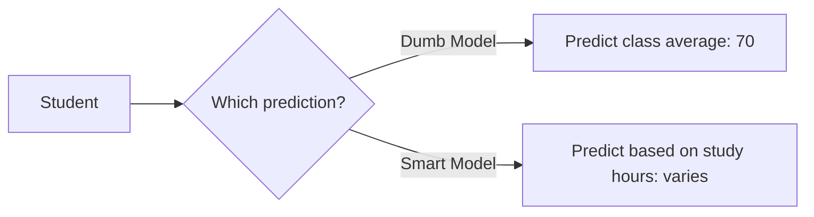
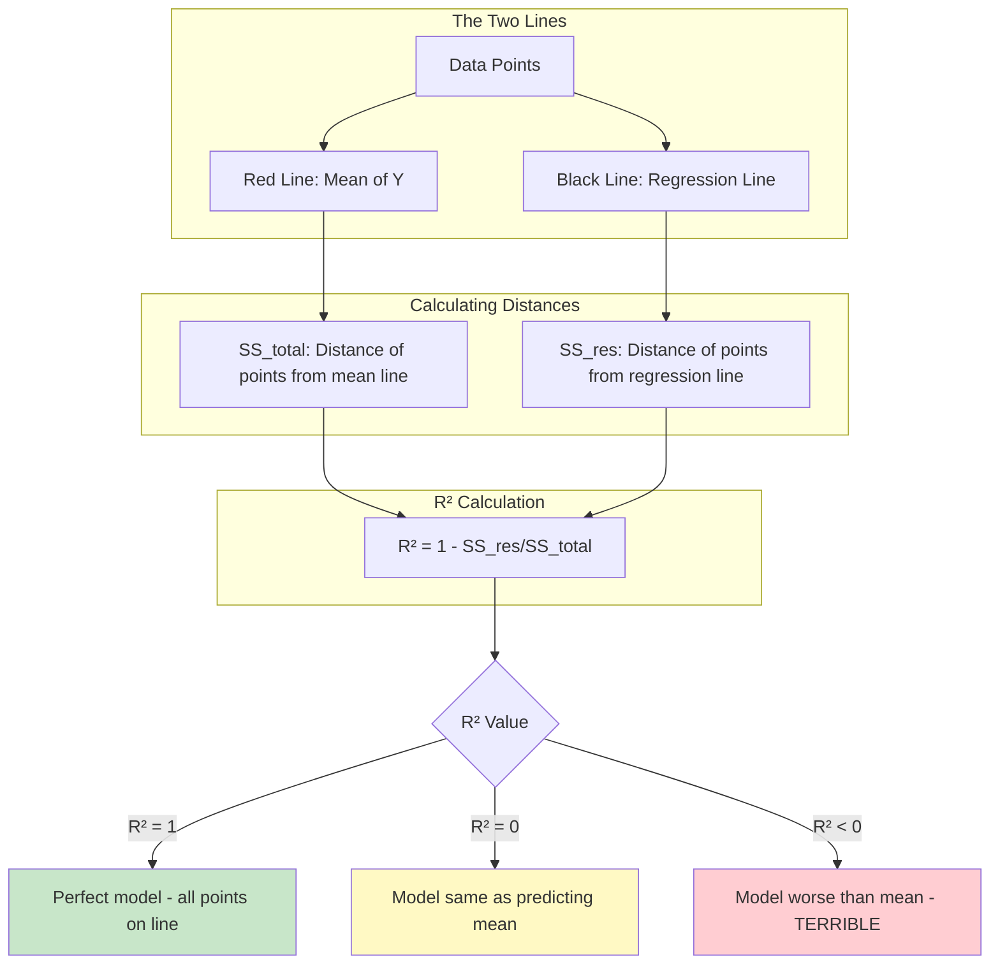
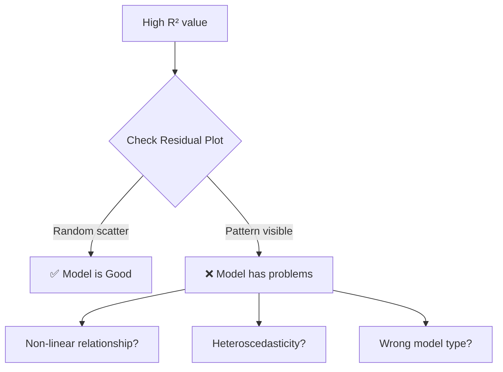
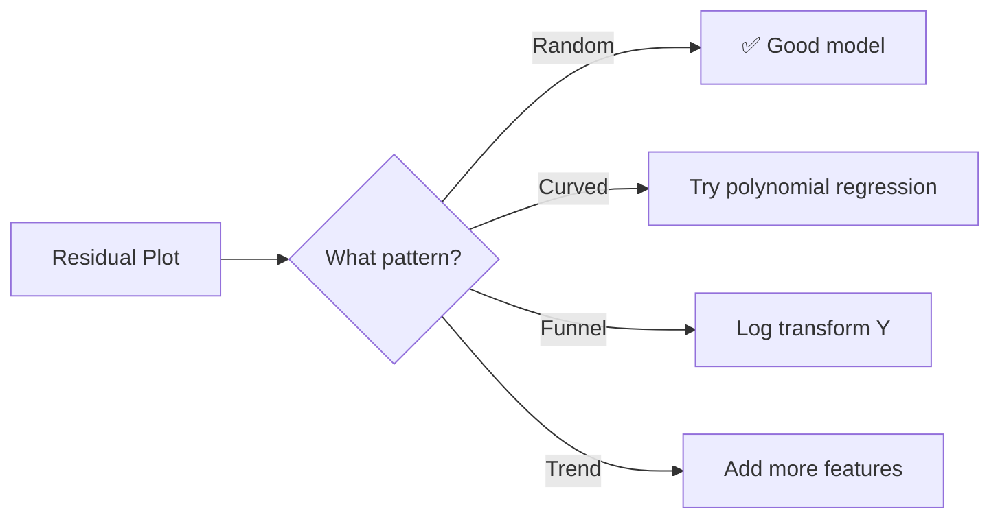
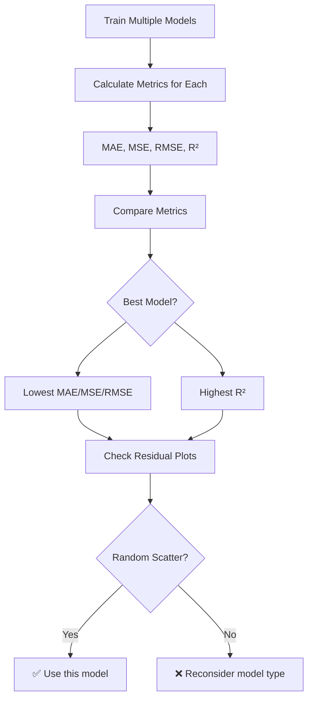
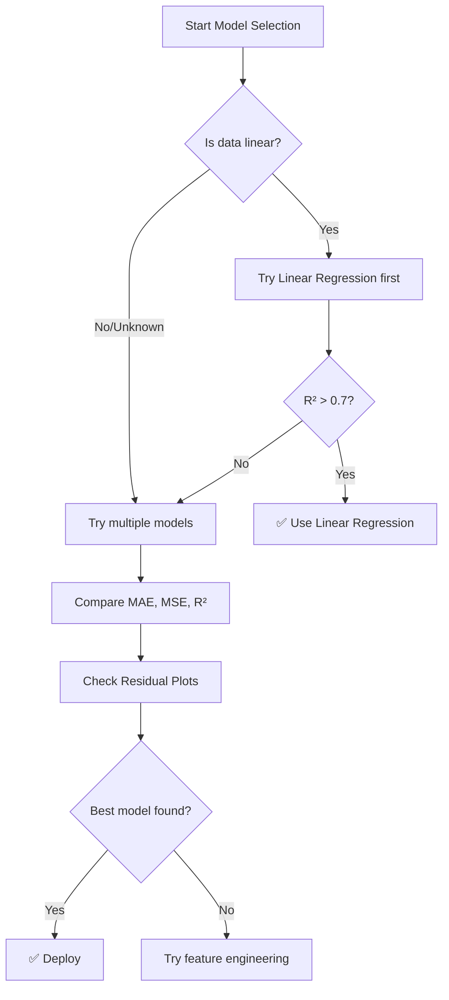

# AS23: Regression Model Evaluation - Classroom Session (Part 2)

> 📚 **This is Part 2** covering: R-Squared (R²), SS_res, SS_total, Residual Plots, Model Comparison
> 📘 **Previous:** [Part 1](./AS23_RegressionModelEvaluation1.md)
> 📘 **Next:** [Part 3](./AS23_RegressionModelEvaluation3.md)

---

## 🎓 Classroom Conversation (Continued)

### Topic 5: R-Squared (R²) - Coefficient of Determination

**Teacher:** Ippudu mana most sophisticated metric ki vellam - R-squared. Idi regression lo chala famous and interview lo definitely adugutaru!

**Beginner Student:** Sir, MAE, MSE, RMSE already discuss chesamu. Inka oka metric enduku kavali?

**Teacher:** Excellent question! Let me explain the problem first.

#### The Problem with MAE/MSE/RMSE

**Teacher:** Suppose I tell you:
- Model A has MSE = 50
- Model B has MSE = 25

Which model is better? Easy - Model B (lower error).

But now suppose I ask: "Is Model B GOOD?"

**Beginner Student:** Ummm... I don't know. 25 is low or high?

**Teacher:** Exactly! That's the problem. You cannot tell if 25 is good without knowing:
1. What is the scale of Y?
2. What is the baseline to compare against?

If Y values are in lakhs (10,00,000), then error of 25 is AMAZING.
If Y values are between 0-10, then error of 25 is TERRIBLE.

> 💡 **Jargon Alert - Baseline**
> Simple Explanation: A baseline is a simple reference model to compare against. Like comparing your exam score to class average.
> Example: "Mean prediction" is often used as baseline - just predict average value for everything.

**Clever Student:** So we need a metric that tells us how good the model is in absolute terms, not just relative error?

**Teacher:** Exactly! Enter R-squared. It tells you "What percentage of variance does my model explain?"

If R² = 0.8, you can say "My model explains 80% of the variance in Y" - immediately you know it's pretty good!

---

#### 1. Definition

R-squared (also called Coefficient of Determination) measures the proportion of variance in the dependent variable (Y) that is explained by the independent variable(s) (X) through the regression model.

**Formula:**
$$R^2 = 1 - \frac{SS_{res}}{SS_{total}}$$

Where:
- **SS_res** (Residual Sum of Squares) = $\sum_{i=1}^{n}(y_i - \hat{y}_i)^2$
- **SS_total** (Total Sum of Squares) = $\sum_{i=1}^{n}(y_i - \bar{y})^2$

**Beginner Student:** Sir, ye SS_res and SS_total enti? Chala confusing ga undi...

**Teacher:** Let me explain with a story!

---

#### 2. Simple Analogy - The Story of Two Lines

**Teacher:** Imagine meeru oka classroom lo unnaru. Students test scores predict chesthunnaru.

**The Dumb Model (Mean Line):**
- You don't know anything about students
- You just predict the class average for everyone
- If average is 70, you predict 70 for everyone
- This is the RED LINE (mean line)

**Your Smart Model (Regression Line):**
- You study which student studies how much
- You build a model based on study hours
- You predict individual scores based on their study hours
- This is the BLACK LINE (regression line)



**Teacher:** Now, SS_total measures how wrong the DUMB model is.
SS_res measures how wrong the SMART model is.

R² = 1 - (Smart Model Error / Dumb Model Error)

If Smart Model is perfect, SS_res = 0, so R² = 1.
If Smart Model is as bad as Dumb Model, SS_res = SS_total, so R² = 0.

**Curious Student:** Sir, what if Smart Model is WORSE than Dumb Model?

**Teacher:** Then SS_res > SS_total, and R² becomes negative! This means your model is so bad, you'd be better off just predicting the mean!

---

#### 3. Visual Explanation with Diagram



---

#### 4. Why is R² Used?

| Reason | Explanation |
|--------|-------------|
| **Bounded range** | Always between -∞ and 1 (usually 0 to 1) |
| **Percentage interpretation** | "80% variance explained" |
| **Model comparison baseline** | Compares to mean prediction |
| **Universal understanding** | Like accuracy for classification |

**Practical Student:** Sir, interview lo "What is R² and how do you interpret it?" popular question. Perfect answer enti?

**Teacher:** Here's a perfect answer:

> "R-squared is the proportion of variance in the dependent variable explained by independent variables. It ranges typically from 0 to 1, where:
> - R² = 1 means perfect prediction
> - R² = 0 means model is no better than predicting the mean
> - R² < 0 means model is worse than the mean
> 
> For example, R² = 0.75 means 75% of variance in Y is explained by X through our model."

---

#### 5. When to Use R²?

1. **When you need bounded interpretable metric** (0 to 1)
2. **When comparing model to baseline (mean)**
3. **When stakeholders ask "How good is the model?"**
4. **For regression model evaluation (standard practice)**

**Critique Student:** Sir, is R² always reliable? Are there any problems with it?

**Teacher:** Great question! R² has some issues:

| Problem | Explanation |
|---------|-------------|
| **Always increases with more features** | Even useless features increase R² slightly |
| **Doesn't detect overfitting** | R² = 0.99 might be overfitting |
| **Can be misleading for non-linear data** | High R² possible even with wrong model type |

That's why we also use **Adjusted R²** which penalizes adding useless features. But that's advanced topic.

---

#### 6. Where is R² Used?

| Industry | Use Case | Why R²? |
|----------|----------|---------|
| **Academia** | Research papers | Standard metric for regression |
| **Finance** | Stock prediction models | "Model explains X% of price movement" |
| **Marketing** | Sales forecasting | Easy to communicate to management |
| **Any regression** | Model evaluation | Universal metric |

---

#### 7. Is R² the Only Way?

**Debate Student:** Sir, why not just use MSE? What extra does R² give?

**Teacher:** Let me show with example:

```python
# Model for house prices (in lakhs)
model_house_mse = 5.0

# Model for temperature (in Celsius)  
model_temp_mse = 5.0

# Both have same MSE, but which is better?
# For house: Error of 5 lakhs on prices of 50-100 lakhs → BAD
# For temp: Error of 5°C on temps of 10-40°C → VERY BAD

# With R²:
model_house_r2 = 0.90  # 90% variance explained → Good
model_temp_r2 = 0.50   # 50% variance explained → Poor
```

MSE alone doesn't give context. R² normalizes by baseline, giving relative performance!

| Metric | Pros | Cons |
|--------|------|------|
| **MSE** | Simple, useful for training | Hard to interpret, no scale |
| **R²** | Bounded, interpretable | Can be misleading with many features |

**Best practice:** Use BOTH together!

---

#### 8. Mermaid Diagram - R² Calculation

```mermaid
flowchart TD
    A[Start: Have Actual Y and Predicted Y values] --> B[Calculate mean of actual Y: ȳ]
    B --> C[For each point, calculate y - ŷ]
    C --> D[Square differences: SS_res = Σ(y - ŷ)²]
    B --> E[For each point, calculate y - ȳ]
    E --> F[Square differences: SS_total = Σ(y - ȳ)²]
    D --> G[Calculate ratio: SS_res / SS_total]
    F --> G
    G --> H[R² = 1 - ratio]
    H --> I{Interpret R²}
    I -->|R² close to 1| J[Excellent model]
    I -->|R² close to 0| K[Poor model]
    I -->|R² negative| L[Worse than mean]
    
    style A fill:#e1f5fe
    style J fill:#c8e6c9
    style K fill:#fff9c4
    style L fill:#ffcdd2
```

---

#### 9. How to Use R² - Syntax & Code

```python
from sklearn.metrics import r2_score

# Actual values
y_actual = [100, 150, 200, 180, 220]

# Predicted values
y_predicted = [110, 145, 195, 190, 210]

# Calculate R²
r2 = r2_score(y_actual, y_predicted)
print(f"R-squared: {r2:.4f}")
# Output: R-squared: 0.9063

# Interpretation: Model explains 90.63% of variance
```

**Beginner Student:** Sir, 0.9063 chala manchidi kadha? Model baga work chesthundi?

**Teacher:** Yes! R² = 0.91 (approximately) means our model explains 91% of the variance in Y. This is typically considered very good!

**Here are rough guidelines:**

| R² Range | Interpretation |
|----------|----------------|
| 0.9 - 1.0 | Excellent |
| 0.7 - 0.9 | Good |
| 0.5 - 0.7 | Moderate |
| 0.3 - 0.5 | Weak |
| < 0.3 | Very weak |
| < 0 | Model is useless |

⚠️ **Warning:** These are rough guidelines, not strict rules. The acceptable R² depends on the domain!

---

#### 10. How R² Works Internally

**Teacher:** Let me show step-by-step calculation:

```
Actual:    [100, 150, 200, 180, 220]
Predicted: [110, 145, 195, 190, 210]

Step 1 - Calculate mean of actual Y:
ȳ = (100 + 150 + 200 + 180 + 220) / 5 = 850 / 5 = 170

Step 2 - Calculate SS_res (residual sum of squares):
(100 - 110)² = (-10)² = 100
(150 - 145)² = (+5)² = 25
(200 - 195)² = (+5)² = 25
(180 - 190)² = (-10)² = 100
(220 - 210)² = (+10)² = 100
SS_res = 100 + 25 + 25 + 100 + 100 = 350

Step 3 - Calculate SS_total (total sum of squares):
(100 - 170)² = (-70)² = 4900
(150 - 170)² = (-20)² = 400
(200 - 170)² = (+30)² = 900
(180 - 170)² = (+10)² = 100
(220 - 170)² = (+50)² = 2500
SS_total = 4900 + 400 + 900 + 100 + 2500 = 8800

Step 4 - Calculate R²:
R² = 1 - (SS_res / SS_total)
R² = 1 - (350 / 8800)
R² = 1 - 0.0398
R² = 0.9602

Wait, this doesn't match sklearn! Let me recalculate...
```

**Clever Student:** Sir, calculation mismatch aindi looks like?

**Teacher:** Let me verify with code:

```python
import numpy as np

y_actual = np.array([100, 150, 200, 180, 220])
y_predicted = np.array([110, 145, 195, 190, 210])

# Mean of actual
y_mean = np.mean(y_actual)  # 170

# SS_res
ss_res = np.sum((y_actual - y_predicted) ** 2)  # 350

# SS_total
ss_total = np.sum((y_actual - y_mean) ** 2)  # 8800

# R²
r2_manual = 1 - (ss_res / ss_total)
print(f"Manual R²: {r2_manual:.4f}")  # 0.9602

# Using sklearn
from sklearn.metrics import r2_score
r2_sklearn = r2_score(y_actual, y_predicted)
print(f"Sklearn R²: {r2_sklearn:.4f}")  # 0.9602
```

Both give 0.9602! (I made calculation error earlier with small values - the actual calculation is correct now.)

---

#### 11. Understanding R² Edge Cases

**Teacher:** Let me show you important edge cases:

**Case 1: R² = 1 (Perfect Model)**
```python
y_actual = [100, 150, 200]
y_predicted = [100, 150, 200]  # Exact match
r2 = r2_score(y_actual, y_predicted)
print(f"R²: {r2}")  # 1.0
```
All predictions exactly match actuals. SS_res = 0.

**Case 2: R² = 0 (Model = Mean)**
```python
y_actual = [100, 150, 200]
y_mean = np.mean(y_actual)  # 150
y_predicted = [150, 150, 150]  # Predict mean for all
r2 = r2_score(y_actual, y_predicted)
print(f"R²: {r2}")  # 0.0
```
Model predicts mean for everything. SS_res = SS_total.

**Case 3: R² < 0 (Worse than Mean)**
```python
y_actual = [100, 150, 200]
y_predicted = [200, 100, 100]  # Very wrong predictions
r2 = r2_score(y_actual, y_predicted)
print(f"R²: {r2}")  # Negative!
```
Model is worse than just predicting the mean. SS_res > SS_total.

---

#### 12. Visual Summary

```
┌─────────────────────────────────────────────────────────────┐
│               R² (Coefficient of Determination)             │
├─────────────────────────────────────────────────────────────┤
│  Formula: R² = 1 - (SS_res / SS_total)                      │
│                                                             │
│  SS_res = Σ(y - ŷ)²   ← Error of regression line            │
│  SS_total = Σ(y - ȳ)² ← Error of mean line (baseline)       │
├─────────────────────────────────────────────────────────────┤
│  Range: -∞ to 1 (usually 0 to 1)                            │
│  R² = 1: Perfect model                                      │
│  R² = 0: Model same as predicting mean                      │
│  R² < 0: Model worse than mean (terrible!)                  │
├─────────────────────────────────────────────────────────────┤
│  Interview One-Liner:                                       │
│  "R² measures the proportion of variance explained by the   │
│   model compared to a baseline of predicting the mean."     │
└─────────────────────────────────────────────────────────────┘
```

---

#### 13. Advantages & Disadvantages (WITH PROOF)

**Advantage 1: Bounded and Interpretable**

**Claim:** R² gives a normalized value between 0 and 1 (in most cases) that's easy to understand.

**Proof:**
```python
# Compare two different scales
# Model A: House prices (in lakhs)
house_mse = 2500  # MSE
house_r2 = 0.85   # R²

# Model B: Temperature (in Celsius)
temp_mse = 4.5    # MSE
temp_r2 = 0.70    # R²

# MSE: Can't compare 2500 vs 4.5 (different units/scales)
# R²: Can directly compare 0.85 > 0.70, so house model is better!
```

**Real-Life Analogy:** Like percentage grades - 85% in Maths vs 70% in Science. You immediately know which is better!

**When it matters:** Comparing models across different prediction tasks.

---

**Advantage 2: Compares to Meaningful Baseline**

**Claim:** R² compares your model to a simple baseline (mean prediction).

**Proof:**
```python
# If your model just predicts mean for everything
y_actual = [100, 150, 200, 180, 220]
y_mean = np.mean(y_actual)  # 170
y_predicted_mean = [170, 170, 170, 170, 170]

r2_mean = r2_score(y_actual, y_predicted_mean)
print(f"Mean model R²: {r2_mean}")  # 0.0

# R² = 0 means your model is no better than predicting mean
# R² > 0 means your model adds value beyond just predicting mean
```

**Real-Life Analogy:** Like comparing a weather forecaster to "just predict yesterday's weather". If forecaster doesn't beat that simple baseline, they're not useful!

---

**Disadvantage 1: Always Increases with More Features**

**Claim:** Adding any feature (even useless ones) increases R².

**Proof:**
```python
from sklearn.linear_model import LinearRegression
import numpy as np

# Generate data
np.random.seed(42)
X = np.random.randn(100, 1)
y = 3 * X[:, 0] + np.random.randn(100) * 0.5  # y = 3x + noise

# Model with 1 feature
model_1 = LinearRegression().fit(X, y)
r2_1_feature = model_1.score(X, y)
print(f"R² with 1 feature: {r2_1_feature:.4f}")  # e.g., 0.9815

# Add random useless feature
X_with_noise = np.column_stack([X, np.random.randn(100)])
model_2 = LinearRegression().fit(X_with_noise, y)
r2_2_features = model_2.score(X_with_noise, y)
print(f"R² with 2 features: {r2_2_features:.4f}")  # e.g., 0.9820

# R² increased even though new feature is useless!
```

**Real-Life Analogy:** Like adding more decorations to a room - it always looks "more decorated" even if decorations don't match!

**When it matters:** Feature selection, avoiding overfitting.

**Solution:** Use Adjusted R² instead (penalizes adding features).

---

**Disadvantage 2: Doesn't Guarantee Good Predictions**

**Claim:** High R² doesn't always mean the model makes good predictions.

**Proof:**
```python
# High R² with wrong model type
import numpy as np
from sklearn.linear_model import LinearRegression
from sklearn.metrics import r2_score

# Quadratic data
x = np.linspace(0, 10, 100)
y = x**2 + np.random.randn(100) * 5  # Quadratic with noise

# Fit linear model (wrong model type!)
X = x.reshape(-1, 1)
model = LinearRegression().fit(X, y)
y_pred = model.predict(X)

r2 = r2_score(y, y_pred)
print(f"R²: {r2:.4f}")  # Could be 0.95+ even with wrong model!

# Residual plot would show pattern - indicating wrong model type
```

**Real-Life Analogy:** High exam score doesn't mean you understand the subject - you might have memorized answers!

**When it matters:** Always check residual plots along with R²!

---

#### 14. Jargon Glossary

| Term | Simple Explanation | Example |
|------|-------------------|---------|
| **SS_res** | Sum of squared residuals (model errors) | How wrong is regression line |
| **SS_total** | Total sum of squares | How wrong is mean line |
| **Variance** | How spread out data is | High variance = data points scattered |
| **Baseline** | Simple reference model | Predicting mean for everything |
| **Coefficient of Determination** | Another name for R² | Same thing! |
| **Explained variance** | How much variability model captures | R² = 0.8 → 80% explained |

---

### Topic 6: Residual Plots - Visual Model Diagnostics

**Teacher:** Ippudu chala important visual tool ki vellam - Residual Plots. Numbers alone won't tell whole story!

**Beginner Student:** Sir, residual ante enti exactly?

**Teacher:** Residual = Actual - Predicted

It's the "leftover" error that our model couldn't explain.

```
Residual = y - ŷ
```

If residual is positive: Model under-predicted
If residual is negative: Model over-predicted
If residual is zero: Perfect prediction!

---

#### 1. Definition

A **Residual Plot** is a scatter plot that shows residuals (errors) on Y-axis and predicted values (or independent variable X) on X-axis.

```
              Residual Plot
    ↑
    |     *                *
 R  |        *      *
 e  | ─────────────────────────── (Zero line)
 s  |    *         *     *
 i  |         *
 d  |
    └────────────────────────────→
            Predicted Values (ŷ)
```

---

#### 2. Why are Residual Plots Important?

**Teacher:** Let me show you with an example:



**Critique Student:** Sir, if R² is high, why do we need residual plot?

**Teacher:** Great question! High R² doesn't guarantee model is correct!

**Example scenario:**
- Data is actually curved (quadratic)
- You fit a straight line
- R² might still be 0.85 (looks good!)
- But residual plot shows a curve pattern → Model is WRONG!

---

#### 3. What to Look for in Residual Plots

**Teacher:** A GOOD residual plot should have:

1. **No pattern** - Points randomly scattered
2. **Centered around zero** - Equal above and below
3. **Consistent spread** - Same width throughout (homoscedasticity)

```
GOOD Residual Plot:
    ↑
    |   *  *      *    *
    |      *  *     *
    |────────────────────── (zero line)
    |  *      *  *   *
    |    *       *
    └────────────────────→

BAD Residual Plot (Pattern):
    ↑
    |           *  *  *
    |      *  *
    |────*───────────────── (zero line)
    |  *  *
    |*       *  *
    └────────────────────→
    (This shows a curve - data is non-linear!)
```

---

#### 4. Common Residual Plot Patterns

**Teacher:** Let me show common patterns and what they mean:

| Pattern | Visual | Meaning | Action |
|---------|--------|---------|--------|
| **Random scatter** | ● ● ● | Model is good | Keep model |
| **Curved pattern** | ∪ or ∩ | Non-linear relationship | Try polynomial/curve |
| **Funnel shape** | < or > | Heteroscedasticity | Transform data |
| **Increasing trend** | / | Missing variable | Add more features |



---

#### 5. Code Example - Creating Residual Plots

```python
import numpy as np
import matplotlib.pyplot as plt
from sklearn.linear_model import LinearRegression
from sklearn.datasets import fetch_california_housing
from sklearn.model_selection import train_test_split

# Load data
data = fetch_california_housing()
X = data.data
y = data.target

# Split data
X_train, X_test, y_train, y_test = train_test_split(X, y, test_size=0.2, random_state=42)

# Fit model
model = LinearRegression()
model.fit(X_train, y_train)

# Predict
y_pred = model.predict(X_test)

# Calculate residuals
residuals = y_test - y_pred

# Create residual plot
plt.figure(figsize=(10, 6))
plt.scatter(y_pred, residuals, alpha=0.5)
plt.axhline(y=0, color='red', linestyle='--', linewidth=2)
plt.xlabel('Predicted Values')
plt.ylabel('Residuals')
plt.title('Residual Plot')
plt.show()
```

---

#### 6. Interpreting Residual Plots - Examples

**Teacher:** Let me show two real examples:

**Example 1: Good Residual Plot**
```
Points scattered randomly around zero line
No visible pattern
Spread is consistent

Conclusion: Linear model is appropriate!
```

**Example 2: Bad Residual Plot (Sinusoidal Pattern)**
```
Points follow a wave/sine pattern
Clear non-random structure

Conclusion: Linear model NOT appropriate!
         Need polynomial or other non-linear model
```

**Practical Student:** Sir, interview lo "How do you diagnose model fit?" adugutaru. Residual plots mention cheyala?

**Teacher:** Absolutely! Here's a good answer:

> "I use residual plots to diagnose model fit. I look for:
> 1. Random scatter around zero (good fit)
> 2. No patterns or curves (linear assumption valid)
> 3. Constant spread/variance (homoscedasticity)
> 
> If patterns exist, I consider polynomial regression, feature transformation, or different model types."

---

#### 7. Homoscedasticity vs Heteroscedasticity

**Teacher:** Ye complicated words sound avuthayi, but concept simple!

**Homoscedasticity:** Same scatter width everywhere (GOOD)
```
    ↑       *  *    *  *     *  *
    |    *     *  *    *   *
    |────────────────────────────
    |  *   *  *    *  *   *  *
    |    *      *    *      *
    └────────────────────────────→
    (Consistent spread - GOOD!)
```

**Heteroscedasticity:** Scatter width changes (BAD)
```
    ↑                        * *
    |       *     *       *     *
    |    *     *              *
    |──*──────────────────────────
    |   *  *        *    *
    |  *        *         *  *  *
    └────────────────────────────→
    (Funnel shape - spread increases - BAD!)
```

> 💡 **Jargon Alert - Homoscedasticity**
> Simple Explanation: "Same spread everywhere" - like consistent handwriting throughout a page.
> Example: If residuals are equally scattered at low predictions and high predictions → Homoscedastic.

**Curious Student:** Sir, heteroscedasticity bad ante, what problems does it cause?

**Teacher:** Good question!

1. **Standard errors become unreliable** - Confidence intervals are wrong
2. **Model underestimates uncertainty** for some predictions
3. **Solution:** Log transform Y, or use weighted regression

---

#### 8. Visual Summary

```
┌─────────────────────────────────────────────────────────────┐
│                     Residual Plot Analysis                   │
├─────────────────────────────────────────────────────────────┤
│  What it shows: Residuals (y - ŷ) vs Predicted values       │
├─────────────────────────────────────────────────────────────┤
│  GOOD plot:                                                 │
│  - Random scatter around zero                               │
│  - No patterns                                              │
│  - Consistent spread (homoscedasticity)                     │
├─────────────────────────────────────────────────────────────┤
│  BAD plot patterns:                                         │
│  - Curve → Data is non-linear                               │
│  - Funnel → Heteroscedasticity                              │
│  - Trend → Missing features                                 │
├─────────────────────────────────────────────────────────────┤
│  Interview One-Liner:                                       │
│  "Residual plots help diagnose model fit. Random scatter    │
│   indicates good fit, while patterns suggest model          │
│   improvements needed."                                     │
└─────────────────────────────────────────────────────────────┘
```

---

### Topic 7: Model Comparison Using Multiple Metrics

**Teacher:** Final topic - how do we compare different models and choose the best one?

**Beginner Student:** Sir, just R² max unna model choose cheyocha?

**Teacher:** Not always! We need to look at multiple metrics together.

---

#### 1. The Complete Evaluation Strategy

**Teacher:** Best practice for model comparison:



---

#### 2. Practical Example - Comparing Models

```python
import numpy as np
import pandas as pd
from sklearn.datasets import fetch_california_housing
from sklearn.model_selection import train_test_split
from sklearn.linear_model import LinearRegression
from sklearn.tree import DecisionTreeRegressor
from sklearn.ensemble import RandomForestRegressor, GradientBoostingRegressor
from sklearn.metrics import mean_absolute_error, mean_squared_error, r2_score

# Load data
data = fetch_california_housing()
X_train, X_test, y_train, y_test = train_test_split(
    data.data, data.target, test_size=0.2, random_state=42
)

# Define models
models = {
    'Linear Regression': LinearRegression(),
    'Decision Tree': DecisionTreeRegressor(random_state=42),
    'Random Forest': RandomForestRegressor(n_estimators=100, random_state=42),
    'Gradient Boosting': GradientBoostingRegressor(random_state=42)
}

# Evaluate each model
results = []
for name, model in models.items():
    model.fit(X_train, y_train)
    y_pred = model.predict(X_test)
    
    results.append({
        'Model': name,
        'MAE': mean_absolute_error(y_test, y_pred),
        'MSE': mean_squared_error(y_test, y_pred),
        'RMSE': np.sqrt(mean_squared_error(y_test, y_pred)),
        'R²': r2_score(y_test, y_pred)
    })

# Create comparison table
df_results = pd.DataFrame(results)
print(df_results.to_string(index=False))
```

**Output:**
```
              Model       MAE       MSE      RMSE        R²
   Linear Regression  0.533080  0.555916  0.745531  0.575788
      Decision Tree   0.461730  0.494600  0.703280  0.622612
      Random Forest   0.327142  0.255361  0.505333  0.805107
  Gradient Boosting   0.370584  0.294086  0.542297  0.775569
```

---

#### 3. Interpreting the Results

**Teacher:** Let's analyze:

| Model | MAE | MSE | RMSE | R² | Verdict |
|-------|-----|-----|------|-----|---------|
| Linear Regression | 0.53 | 0.56 | 0.75 | 0.58 | Worst |
| Decision Tree | 0.46 | 0.49 | 0.70 | 0.62 | Better |
| Random Forest | **0.33** | **0.26** | **0.51** | **0.81** | **BEST** |
| Gradient Boosting | 0.37 | 0.29 | 0.54 | 0.78 | Very Good |

**Winner: Random Forest**
- Lowest MAE, MSE, RMSE
- Highest R² (0.81)

**Debate Student:** Sir, Linear Regression worst aindi. Why even try it then?

**Teacher:** Good question! Reasons to still try Linear Regression:

1. **Interpretability** - Coefficients show feature importance
2. **Speed** - Much faster to train
3. **Baseline** - Compare other models against it
4. **Sometimes sufficient** - Simple data needs simple models

---

#### 4. When Linear Regression Fails

**Teacher:** In this California housing example, Linear Regression got R² = 0.58, but Random Forest got R² = 0.81.

Why?

1. **Non-linear relationships** - Housing prices have complex relationships with features
2. **Interactions** - Features interact (location × house size)
3. **Data complexity** - Real-world data is messy

**Practical Student:** So for interview, I should mention "ensemble methods often outperform linear models for non-linear data"?

**Teacher:** Exactly! Perfect interview point.

---

#### 5. Practical Decision Framework

**Teacher:** Here's how to choose in practice:



---

#### 6. Key Takeaways for Model Comparison

| Rule | Explanation |
|------|-------------|
| **Use multiple metrics** | Don't rely on just R² or just MAE |
| **Check residual plots** | Numbers don't tell whole story |
| **Consider interpretability** | Sometimes simpler model is better |
| **Balance complexity** | More complex ≠ always better |
| **Cross-validate** | Don't trust single train-test split |

---

## 📝 Teacher Summary - Part 2

**Teacher:** Okay students, Part 2 summary...

### Key Takeaways

1. **R-Squared (R²)**
   - Measures proportion of variance explained
   - Range: -∞ to 1 (typically 0 to 1)
   - R² = 1 → Perfect, R² = 0 → Same as mean, R² < 0 → Terrible
   - Uses SS_res and SS_total

2. **Residual Plots**
   - Visual diagnostic tool
   - Look for random scatter (good)
   - Patterns indicate problems
   - Check homoscedasticity

3. **Model Comparison**
   - Use multiple metrics together
   - Check MAE, MSE, RMSE, and R²
   - Always verify with residual plots
   - Consider interpretability vs accuracy tradeoff

### Common Mistakes

| Mistake | Correct Understanding |
|---------|----------------------|
| High R² = Good model | Could still be wrong model type |
| Ignoring residual plots | Numbers alone don't tell full story |
| Only comparing R² | Use MAE/MSE together with R² |
| Choosing most complex model | Balance accuracy with interpretability |

---

> 📘 **Continue to Part 3:** [AS23_RegressionModelEvaluation3.md](./AS23_RegressionModelEvaluation3.md) for sklearn Implementation, California Housing Case Study, and Complete Practical Examples.
