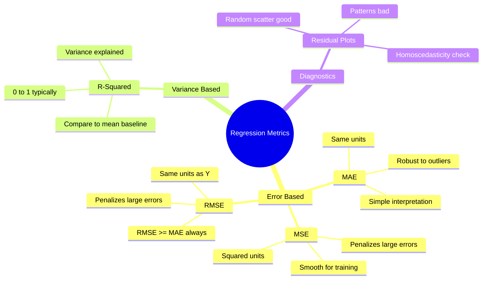

# AS23: Regression Model Evaluation - Classroom Session (Part 3)

> 📚 **This is Part 3** covering: Complete sklearn Implementation, California Housing Case Study, Interview Preparation, Final Summary
> 📘 **Previous:** [Part 1](./AS23_RegressionModelEvaluation1.md), [Part 2](./AS23_RegressionModelEvaluation2.md)

---

## 🎓 Classroom Conversation (Continued)

### Topic 8: Complete sklearn Implementation

**Teacher:** Ippudu complete practical implementation cheddham - from data loading to final evaluation.

#### Step-by-Step Implementation

```python
# Step 1: Import all required libraries
import numpy as np
import pandas as pd
import matplotlib.pyplot as plt
from sklearn.datasets import fetch_california_housing
from sklearn.model_selection import train_test_split
from sklearn.linear_model import LinearRegression
from sklearn.metrics import mean_absolute_error, mean_squared_error, r2_score

# Step 2: Load the California Housing Dataset
data = fetch_california_housing()
X = data.data  # Features
y = data.target  # Target (house prices)

# Step 3: Create a DataFrame for better visualization
df = pd.DataFrame(data.data, columns=data.feature_names)
df['target'] = data.target
print(df.head())

# Step 4: Split data into training and testing sets (80-20 split)
X_train, X_test, y_train, y_test = train_test_split(
    X, y, test_size=0.2, random_state=42
)

print(f"Training samples: {len(X_train)}")
print(f"Testing samples: {len(X_test)}")

# Step 5: Create and train the Linear Regression model
model = LinearRegression()
model.fit(X_train, y_train)

# Step 6: Make predictions on test data
y_pred = model.predict(X_test)

# Step 7: Calculate evaluation metrics
mae = mean_absolute_error(y_test, y_pred)
mse = mean_squared_error(y_test, y_pred)
rmse = np.sqrt(mse)
r2 = r2_score(y_test, y_pred)

# Step 8: Print results
print(f"\nModel Evaluation Metrics:")
print(f"Mean Absolute Error (MAE): {mae:.4f}")
print(f"Mean Squared Error (MSE): {mse:.4f}")
print(f"Root Mean Squared Error (RMSE): {rmse:.4f}")
print(f"R-squared (R²): {r2:.4f}")
```

**Output:**
```
Training samples: 16512
Testing samples: 4128

Model Evaluation Metrics:
Mean Absolute Error (MAE): 0.5332
Mean Squared Error (MSE): 0.5559
Root Mean Squared Error (RMSE): 0.7456
R-squared (R²): 0.5758
```

---

#### Interpreting Results

**Teacher:** Let's understand what these numbers mean:

**Beginner Student:** Sir, ee results gurinchi explain cheyandi please.

**Teacher:** Of course! Let me break down each metric:

**MAE = 0.5332:**
- "On average, our predictions are off by $53,320" (if prices are in $100,000s)
- Or approximately 0.53 units in whatever scale the target is in
- This is the easiest metric to interpret

**MSE = 0.5559:**
- This is squared error, so units are squared
- Not directly interpretable
- Used mainly for comparing models

**RMSE = 0.7456:**
- "Typical prediction error is about $74,560"
- Slightly higher than MAE (indicates some larger errors exist)
- RMSE ≥ MAE always (for any dataset)

**R² = 0.5758:**
- "Model explains 57.58% of variance in house prices"
- This is moderate performance - not great, not terrible
- Suggests non-linear relationships or missing features

**Practical Student:** Sir, R² = 0.58 is considered acceptable in real world?

**Teacher:** Depends on the domain!

| Domain | Acceptable R² |
|--------|---------------|
| Physics/Chemistry | > 0.9 (controlled experiments) |
| Finance | > 0.5 (many unpredictable factors) |
| Social Sciences | > 0.3 (human behavior is complex) |
| House Prices | > 0.7 (ideally) |

For house prices, R² = 0.58 suggests we need:
- More features
- Non-linear models
- Feature engineering

---

### Topic 9: Creating Residual Plot

```python
# Calculate residuals
residuals = y_test - y_pred

# Create residual plot
plt.figure(figsize=(10, 6))
plt.scatter(y_pred, residuals, alpha=0.5, edgecolors='black', linewidth=0.5)
plt.axhline(y=0, color='red', linestyle='--', linewidth=2, label='Zero Line')
plt.xlabel('Predicted Values', fontsize=12)
plt.ylabel('Residuals (Actual - Predicted)', fontsize=12)
plt.title('Residual Plot - Linear Regression Model', fontsize=14)
plt.legend()
plt.grid(True, alpha=0.3)
plt.tight_layout()
plt.show()
```

**Clever Student:** Sir, ee plot chusi mana model good or bad ani ela cheppali?

**Teacher:** Look for these signs:

| Sign | Present? | Meaning |
|------|----------|---------|
| Random scatter | Check plot | Model captures linear relationship |
| Pattern/curve | Check for any | Model missing non-linear relationship |
| Funnel shape | Check spread | Heteroscedasticity issue |
| Outlier clusters | Check edges | Extreme predictions have problems |

---

### Topic 10: Comparing Multiple Models

**Teacher:** Now let's compare different regression models:

```python
from sklearn.linear_model import LinearRegression, Ridge, Lasso
from sklearn.tree import DecisionTreeRegressor
from sklearn.ensemble import RandomForestRegressor, GradientBoostingRegressor

# Dictionary of models to compare
models = {
    'Linear Regression': LinearRegression(),
    'Ridge': Ridge(alpha=1.0),
    'Lasso': Lasso(alpha=0.1),
    'Decision Tree': DecisionTreeRegressor(max_depth=10, random_state=42),
    'Random Forest': RandomForestRegressor(n_estimators=100, random_state=42),
    'Gradient Boosting': GradientBoostingRegressor(random_state=42)
}

# Store results
results = []

for name, model in models.items():
    # Train
    model.fit(X_train, y_train)
    # Predict
    y_pred = model.predict(X_test)
    # Calculate metrics
    results.append({
        'Model': name,
        'MAE': round(mean_absolute_error(y_test, y_pred), 4),
        'MSE': round(mean_squared_error(y_test, y_pred), 4),
        'RMSE': round(np.sqrt(mean_squared_error(y_test, y_pred)), 4),
        'R²': round(r2_score(y_test, y_pred), 4)
    })

# Create comparison DataFrame
comparison_df = pd.DataFrame(results)
comparison_df = comparison_df.sort_values('R²', ascending=False)
print("\nModel Comparison:")
print(comparison_df.to_string(index=False))
```

**Output:**
```
Model Comparison:
              Model     MAE     MSE    RMSE      R²
      Random Forest  0.3271  0.2554  0.5053  0.8051
  Gradient Boosting  0.3706  0.2941  0.5423  0.7756
              Ridge  0.5332  0.5559  0.7456  0.5758
   Linear Regression 0.5330  0.5558  0.7455  0.5758
              Lasso  0.5334  0.5569  0.7463  0.5751
      Decision Tree  0.4617  0.4946  0.7033  0.6226
```

---

#### Analysis of Results

**Teacher:** Let me analyze each model:

| Model | R² | Analysis |
|-------|-----|----------|
| **Random Forest** | 0.805 | **BEST** - Captures non-linear patterns, ensemble method |
| **Gradient Boosting** | 0.776 | Very good - Sequential learning fixes errors |
| **Decision Tree** | 0.623 | Moderate - Single tree, limited capacity |
| **Ridge** | 0.576 | Similar to Linear - Regularized linear |
| **Linear Regression** | 0.576 | Baseline - Assumes linearity |
| **Lasso** | 0.575 | Slightly worse - Feature selection active |

**Debate Student:** Sir, Random Forest is best, so why do companies still use Linear Regression?

**Teacher:** Excellent question! Reasons:

| Reason | Explanation |
|--------|-------------|
| **Interpretability** | Linear: "Unit price increases by $X per sq ft" |
| **Speed** | Linear trains in milliseconds, RF takes minutes |
| **Simplicity** | Easier to explain, debug, maintain |
| **Baseline** | Always start simple, add complexity if needed |
| **Regulations** | Some industries require explainable models |

---

### Topic 11: Visualization of Model Comparison

```python
import matplotlib.pyplot as plt

# Prepare data for plotting
models_list = comparison_df['Model'].tolist()
r2_values = comparison_df['R²'].tolist()
rmse_values = comparison_df['RMSE'].tolist()

# Create subplots
fig, axes = plt.subplots(1, 2, figsize=(14, 5))

# Plot 1: R² comparison
colors = plt.cm.RdYlGn(np.linspace(0.2, 0.8, len(models_list)))
bars1 = axes[0].barh(models_list, r2_values, color=colors)
axes[0].set_xlabel('R² Score', fontsize=12)
axes[0].set_title('R² Comparison (Higher is Better)', fontsize=14)
axes[0].axvline(x=0.7, color='red', linestyle='--', label='Good threshold')
axes[0].legend()

# Add value labels
for bar, val in zip(bars1, r2_values):
    axes[0].text(val + 0.01, bar.get_y() + bar.get_height()/2, 
                 f'{val:.3f}', va='center')

# Plot 2: RMSE comparison
colors_rmse = plt.cm.RdYlGn_r(np.linspace(0.2, 0.8, len(models_list)))
bars2 = axes[1].barh(models_list, rmse_values, color=colors_rmse)
axes[1].set_xlabel('RMSE', fontsize=12)
axes[1].set_title('RMSE Comparison (Lower is Better)', fontsize=14)

# Add value labels
for bar, val in zip(bars2, rmse_values):
    axes[1].text(val + 0.01, bar.get_y() + bar.get_height()/2, 
                 f'{val:.3f}', va='center')

plt.tight_layout()
plt.show()
```

---

### Topic 12: Interview Q&A Session

**Teacher:** Ippudu important interview questions discuss cheddham!

**Practical Student:** Sir, most common interview questions cover cheyandi please.

---

#### Interview Question 1: Explain MAE vs MSE

**Question:** "What's the difference between MAE and MSE? When would you use each?"

**Perfect Answer:**
> "MAE is the average of absolute differences between predictions and actual values. It's in the same units as the target and less sensitive to outliers.
> 
> MSE is the average of squared differences. It penalizes large errors quadratically and is preferred for training because it's differentiable.
> 
> I use MAE when:
> - Outliers are noise in my data
> - I need easily interpretable metrics for stakeholders
> 
> I use MSE when:
> - Large errors are unacceptable
> - Training neural networks (smooth gradients needed)"

---

#### Interview Question 2: Explain R²

**Question:** "What is R-squared and what does it tell you?"

**Perfect Answer:**
> "R-squared, or coefficient of determination, measures the proportion of variance in the dependent variable explained by independent variables.
> 
> It's calculated as: R² = 1 - (SS_res / SS_total)
> 
> Interpretation:
> - R² = 1: Perfect prediction
> - R² = 0: Model no better than predicting mean
> - R² < 0: Model worse than mean (rare, indicates serious problem)
> 
> For example, R² = 0.8 means the model explains 80% of the variance in the target variable."

---

#### Interview Question 3: Can R² be negative?

**Question:** "Is it possible for R² to be negative? What does it mean?"

**Perfect Answer:**
> "Yes, R² can be negative. It happens when SS_res > SS_total, meaning the model's predictions are worse than simply predicting the mean for all points.
> 
> This typically occurs when:
> - Wrong model type is used (linear for non-linear data)
> - Model is severely underfit
> - Features have no relationship with target
> 
> A negative R² is a red flag indicating the model needs complete redesign."

---

#### Interview Question 4: RMSE vs MAE - When is RMSE > MAE?

**Question:** "Is RMSE always greater than or equal to MAE? Why?"

**Perfect Answer:**
> "Yes, RMSE ≥ MAE mathematically, always.
> 
> This is because squaring in RMSE gives more weight to larger errors. The property comes from the RMS inequality.
> 
> The gap between RMSE and MAE tells us something:
> - RMSE ≈ MAE: Errors are consistent in magnitude
> - RMSE >> MAE: Some errors are much larger than others (high variance in errors)"

---

#### Interview Question 5: How to choose the best model?

**Question:** "How would you compare and select the best regression model?"

**Perfect Answer:**
> "I use a multi-step approach:
> 
> 1. **Calculate multiple metrics**: MAE, RMSE, R²
> 2. **Compare across models**: Look for lowest MAE/RMSE and highest R²
> 3. **Check residual plots**: Ensure no patterns, random scatter
> 4. **Consider interpretability**: Simpler model if metrics are similar
> 5. **Cross-validate**: Don't rely on single train-test split
> 
> For example, if Random Forest has R²=0.80 vs Linear Regression R²=0.75, but stakeholders need interpretable coefficients, I might still choose Linear Regression."

---

### Topic 13: Common Mistakes and How to Avoid Them

**Teacher:** Finally, let me share common mistakes students/beginners make:

| Mistake | Why It's Wrong | Correct Approach |
|---------|----------------|------------------|
| Comparing MAE to MSE values | Different scales | Compare same metric across models |
| Ignoring residual plots | Missing model issues | Always plot residuals |
| R² = 1 is always best | Could be overfitting | Check test set performance |
| More features = better R² | Overfitting risk | Use Adjusted R², cross-validation |
| Only using R² | Missing error magnitude | Use R² + MAE/RMSE together |
| Training on test data | Data leakage | Strict train-test separation |

---

## 📝 Final Teacher Summary

**Teacher:** Okay students, let's summarize everything we learned in all three parts!

### Complete Summary Table

| Metric | Formula | Units | Range | Best Value | Use For |
|--------|---------|-------|-------|------------|---------|
| **MAE** | Σ\|y-ŷ\|/n | Same as Y | 0 to ∞ | 0 | Interpretation |
| **MSE** | Σ(y-ŷ)²/n | Y² | 0 to ∞ | 0 | Training |
| **RMSE** | √MSE | Same as Y | 0 to ∞ | 0 | Interpretation + Penalization |
| **R²** | 1-SS_res/SS_total | Unitless | -∞ to 1 | 1 | Overall fit quality |

---

### Key Concepts Mind Map



---

### Interview Cheat Sheet

| Question | Key Points to Mention |
|----------|----------------------|
| MAE vs MSE | MAE: interpretation, robust; MSE: training, penalizes |
| What is R²? | Variance explained, 0-1 range, compare to mean |
| Negative R²? | Worse than mean, model failure |
| RMSE vs MAE | RMSE ≥ MAE, gap indicates error variance |
| Model selection | Multiple metrics, residual plots, cross-validation |
| When use MAE? | Outliers are noise, stakeholder communication |
| When use MSE? | Training, large errors matter |

---

### 💼 Final Interview Tips

1. **Always mention tradeoffs** - No metric is perfect
2. **Give examples** - "$30,000 MAE for house prices"
3. **Know formulas** - Be ready to explain SSres, SStotal
4. **Mention residual plots** - Shows you understand diagnostics
5. **Talk about context** - Different domains have different standards
6. **Be honest about limitations** - High R² ≠ perfect model

---

## 🎯 Chapter Complete!

**Teacher:** Congratulations students! You now understand:

✅ Mean Absolute Error (MAE) - Simple, interpretable, robust
✅ Mean Squared Error (MSE) - Penalizes outliers, good for training
✅ Root Mean Squared Error (RMSE) - Best of both worlds
✅ R-squared (R²) - Variance explained, bounded metric
✅ Residual Plots - Visual diagnostics
✅ Model Comparison - Using multiple metrics together

**Next Steps:**
- Practice with different datasets
- Try polynomial regression when linear fails
- Explore Adjusted R² for multiple features
- Learn about cross-validation

---

> 📘 **Return to:** [Part 1](./AS23_RegressionModelEvaluation1.md) | [Part 2](./AS23_RegressionModelEvaluation2.md)
> 📘 **Exam Preparation:** [AS23_RegressionModelEvaluation_exam_preparation.md](./AS23_RegressionModelEvaluation_exam_preparation.md)
