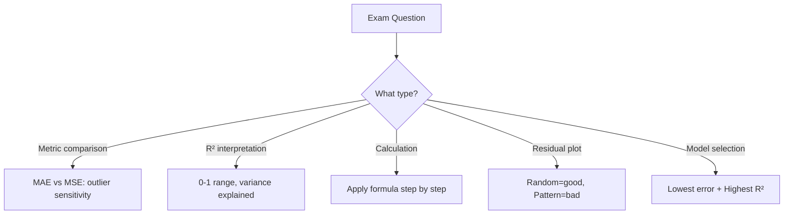

# AS23: Regression Model Evaluation - Exam Preparation

---

## Section A: Multiple Choice Questions (MCQ) - 15 Questions

### MCQ 1
**Question:** Which metric is in the same units as the target variable (Y)?

**Options:**
- A) Mean Squared Error (MSE)
- B) R-squared (R²)
- C) Mean Absolute Error (MAE)
- D) Sum of Squared Errors (SSE)

**✅ Correct Answer:** C

**📖 Explanation:** MAE calculates the average of absolute differences |y - ŷ|. Since we don't square the values, MAE remains in the same units as Y.

**❌ Why Others Are Wrong:**
- A) MSE squares the errors, so units become Y²
- B) R² is unitless (a ratio between 0 and 1)
- D) SSE is sum of squared errors, so units are Y²

---

### MCQ 2
**Question:** If R² = 0.75, what does this mean?

**Options:**
- A) The model has 75% accuracy
- B) The model explains 75% of variance in Y
- C) 75% of predictions are correct
- D) The model has 25% error rate

**✅ Correct Answer:** B

**📖 Explanation:** R² (coefficient of determination) represents the proportion of variance in the dependent variable explained by independent variables. R² = 0.75 means 75% of variance is explained.

**❌ Why Others Are Wrong:**
- A) R² is not the same as classification accuracy
- C) Regression doesn't have "correct/incorrect" predictions
- D) R² doesn't directly translate to error rate

---

### MCQ 3
**Question:** Which metric is MORE sensitive to outliers?

**Options:**
- A) MAE
- B) MSE
- C) Both are equally sensitive
- D) Neither is sensitive to outliers

**✅ Correct Answer:** B

**📖 Explanation:** MSE squares errors, so an outlier error of 10 becomes 100, while in MAE it stays 10. This quadratic effect makes MSE much more sensitive to outliers.

**❌ Why Others Are Wrong:**
- A) MAE treats all errors linearly, so less sensitive
- C) They are NOT equally sensitive - MSE is 10x more sensitive for error of 10
- D) Both are affected by outliers, but to different degrees

---

### MCQ 4
**Question:** What is the relationship between RMSE and MAE?

**Options:**
- A) RMSE = MAE always
- B) RMSE ≤ MAE always
- C) RMSE ≥ MAE always
- D) No fixed relationship

**✅ Correct Answer:** C

**📖 Explanation:** Due to the mathematical property of RMS (Root Mean Square), RMSE is always greater than or equal to MAE. They are equal only when all errors have the same magnitude.

**❌ Why Others Are Wrong:**
- A) They are equal only in special cases (constant errors)
- B) RMSE is never less than MAE
- D) There IS a fixed mathematical relationship

---

### MCQ 5
**Question:** What does it mean if R² is negative?

**Options:**
- A) The calculation is wrong
- B) The model is better than predicting the mean
- C) The model is worse than predicting the mean
- D) The model has no variance

**✅ Correct Answer:** C

**📖 Explanation:** R² < 0 means SS_res > SS_total, indicating the model's predictions are worse than simply predicting the mean for all points. This is a sign of a severely poor model.

**❌ Why Others Are Wrong:**
- A) Negative R² is mathematically valid
- B) Opposite - it's WORSE than predicting mean
- D) Unrelated to variance presence

---

### MCQ 6
**Question:** In the formula R² = 1 - (SS_res / SS_total), what does SS_res represent?

**Options:**
- A) Sum of squared differences between actual Y and mean of Y
- B) Sum of squared differences between predicted Y and mean of Y
- C) Sum of squared differences between actual Y and predicted Y
- D) Total variance in the data

**✅ Correct Answer:** C

**📖 Explanation:** SS_res (Residual Sum of Squares) = Σ(y_i - ŷ_i)², which measures the error between actual values and model predictions.

**❌ Why Others Are Wrong:**
- A) This describes SS_total (total sum of squares)
- B) This describes SS_reg (regression sum of squares)
- D) Total variance is related to SS_total

---

### MCQ 7
**Question:** Which metric should NOT be used alone for model selection?

**Options:**
- A) MAE
- B) MSE
- C) R²
- D) All of the above

**✅ Correct Answer:** D

**📖 Explanation:** Best practice is to use multiple metrics together. Each metric provides different information - R² for variance explained, MAE for interpretable error, MSE for penalizing large errors.

**❌ Why Others Are Wrong:**
- A, B, C) Each has limitations when used alone

---

### MCQ 8
**Question:** In a residual plot, what indicates a good linear regression model?

**Options:**
- A) A curved pattern
- B) A funnel shape
- C) Random scatter around zero
- D) An increasing trend

**✅ Correct Answer:** C

**📖 Explanation:** Random scatter around the zero line indicates residuals are randomly distributed with no pattern, suggesting the linear model captures the relationship well.

**❌ Why Others Are Wrong:**
- A) Curved pattern indicates non-linear relationship
- B) Funnel shape indicates heteroscedasticity
- D) Increasing trend suggests missing variables

---

### MCQ 9
**Question:** For training neural networks, which loss function is preferred and why?

**Options:**
- A) MAE - because it's simpler
- B) MSE - because it's differentiable everywhere
- C) RMSE - because it's in original units
- D) R² - because it's bounded

**✅ Correct Answer:** B

**📖 Explanation:** MSE is fully differentiable with smooth gradients everywhere. MAE has a sharp corner at zero where the derivative is undefined, causing optimization issues.

**❌ Why Others Are Wrong:**
- A) MAE is not differentiable at zero
- C) RMSE is derived from MSE, so same issue if not using MSE
- D) R² is for evaluation, not training loss

---

### MCQ 10
**Question:** What is homoscedasticity in regression?

**Options:**
- A) Residuals increase as predicted values increase
- B) Residuals have constant variance across all predictions
- C) All predictions are exactly correct
- D) The model is overfitting

**✅ Correct Answer:** B

**📖 Explanation:** Homoscedasticity means "same scatter" - the variance of residuals is constant across all predicted values. This is an assumption of linear regression.

**❌ Why Others Are Wrong:**
- A) This describes heteroscedasticity (opposite)
- C) Unrelated to residual variance consistency
- D) Unrelated concept

---

### MCQ 11
**Question:** If Model A has MAE=5 and Model B has MAE=10, which has better performance?

**Options:**
- A) Model B (higher MAE is better)
- B) Model A (lower MAE is better)
- C) Cannot determine from MAE alone
- D) They are equally good

**✅ Correct Answer:** B

**📖 Explanation:** Lower MAE means smaller average prediction error. Model A with MAE=5 has predictions that are on average 5 units off, while Model B is 10 units off.

**❌ Why Others Are Wrong:**
- A) Lower MAE is better, not higher
- C) MAE comparison is valid for same dataset
- D) Different values indicate different performance

---

### MCQ 12
**Question:** What is the formula for RMSE?

**Options:**
- A) Σ|y - ŷ| / n
- B) Σ(y - ŷ)² / n
- C) √[Σ(y - ŷ)² / n]
- D) 1 - (SS_res / SS_total)

**✅ Correct Answer:** C

**📖 Explanation:** RMSE = √MSE = √[Σ(y - ŷ)² / n]. Take the square root of mean squared error.

**❌ Why Others Are Wrong:**
- A) This is MAE formula
- B) This is MSE formula (no square root)
- D) This is R² formula

---

### MCQ 13
**Question:** Why is R² preferred over MSE for explaining model quality to stakeholders?

**Options:**
- A) R² has better mathematical properties
- B) R² is bounded (0 to 1) and comparable across different scales
- C) MSE is always zero
- D) R² is faster to calculate

**✅ Correct Answer:** B

**📖 Explanation:** R² is normalized between 0 and 1 (typically), making it easy to compare models across different datasets/scales. "75% variance explained" is universally understandable.

**❌ Why Others Are Wrong:**
- A) Both have good mathematical properties
- C) MSE is not always zero
- D) Both are equally fast

---

### MCQ 14
**Question:** If all predictions exactly match actual values, what are the metric values?

**Options:**
- A) MAE=0, MSE=0, RMSE=0, R²=1
- B) MAE=1, MSE=1, RMSE=1, R²=1
- C) MAE=0, MSE=0, RMSE=0, R²=0
- D) MAE=∞, MSE=∞, RMSE=∞, R²=1

**✅ Correct Answer:** A

**📖 Explanation:** Perfect predictions mean zero error. All error metrics become 0, and R²=1 indicating 100% variance explained.

**❌ Why Others Are Wrong:**
- B) Perfect predictions give zero error, not 1
- C) R²=1 for perfect fit, not 0
- D) Errors are 0, not infinity

---

### MCQ 15
**Question:** Which statement about SS_total is correct?

**Options:**
- A) SS_total = Σ(y_i - ŷ_i)²
- B) SS_total = Σ(y_i - ȳ)²
- C) SS_total measures prediction error
- D) SS_total is always less than SS_res

**✅ Correct Answer:** B

**📖 Explanation:** SS_total (Total Sum of Squares) = Σ(y_i - ȳ)², measuring the total variance of actual Y values from their mean. It represents the baseline error if we just predict the mean.

**❌ Why Others Are Wrong:**
- A) This formula is for SS_res (residual sum of squares)
- C) SS_total measures variance from mean, not prediction error
- D) SS_total ≥ SS_res for a good model (otherwise R² < 0)

---

## Section B: Multiple Select Questions (MSQ) - 10 Questions

### MSQ 1
**Question:** Which of the following are advantages of MAE? (Select ALL that apply)

**Options:**
- A) Same units as target variable
- B) Penalizes large errors more heavily
- C) Easy to interpret for stakeholders
- D) Less sensitive to outliers
- E) Differentiable everywhere

**✅ Correct Answers:** A, C, D

**📖 Explanation:** 
- A) MAE uses absolute values, keeping original units
- C) Easy to say "error is $X on average"
- D) Linear treatment of errors makes it robust to outliers

**❌ Why Others Are Wrong:**
- B) MSE penalizes large errors more heavily, not MAE
- E) MAE has a corner at zero where derivative is undefined

---

### MSQ 2
**Question:** When should you prefer MSE over MAE? (Select ALL that apply)

**Options:**
- A) When training neural networks
- B) When outliers should be penalized heavily
- C) When data has many outliers that are noise
- D) When smooth optimization is needed
- E) When interpretability is priority

**✅ Correct Answers:** A, B, D

**📖 Explanation:**
- A) MSE provides smooth gradients for backpropagation
- B) Squaring errors penalizes outliers quadratically
- D) MSE is differentiable everywhere, enabling smooth optimization

**❌ Why Others Are Wrong:**
- C) With noisy outliers, MAE is better (less sensitive)
- E) MAE is more interpretable than MSE

---

### MSQ 3
**Question:** Which indicate a POOR regression model? (Select ALL that apply)

**Options:**
- A) R² = negative
- B) Curved pattern in residual plot
- C) RMSE < MAE
- D) High R² on training, low on test
- E) Random scatter in residual plot

**✅ Correct Answers:** A, B, D

**📖 Explanation:**
- A) Negative R² means worse than predicting mean
- B) Curved pattern indicates non-linear relationship missed
- D) This suggests overfitting

**❌ Why Others Are Wrong:**
- C) RMSE ≥ MAE always (mathematically impossible otherwise)
- E) Random scatter is GOOD, not poor

---

### MSQ 4
**Question:** What does R² = 0 indicate? (Select ALL that apply)

**Options:**
- A) Model has zero predictions
- B) Model performs same as predicting the mean
- C) SS_res = SS_total
- D) No variance in the data
- E) Model explains 0% of variance

**✅ Correct Answers:** B, C, E

**📖 Explanation:**
- B) R²=0 means regression line equals mean line in predictive power
- C) From formula: R² = 1 - (SS_res/SS_total), if R²=0, then SS_res=SS_total
- E) 0% of variance explained by the model

**❌ Why Others Are Wrong:**
- A) Model still makes predictions, just poor ones
- D) Variance in data still exists (SS_total > 0)

---

### MSQ 5
**Question:** Which are valid interpretations of RMSE = 10 for house prices in thousands of dollars? (Select ALL that apply)

**Options:**
- A) Typical prediction error is $10,000
- B) Model explains 10% of variance
- C) On average, predictions deviate by $10,000
- D) Maximum error is $10,000
- E) Error is in same units as house prices

**✅ Correct Answers:** A, C, E

**📖 Explanation:**
- A) RMSE represents typical/average error magnitude
- C) RMSE can be interpreted as average deviation
- E) RMSE is in same units as target variable

**❌ Why Others Are Wrong:**
- B) R² represents variance explained, not RMSE
- D) RMSE is average, not maximum error

---

### MSQ 6
**Question:** Which statements about residual plots are TRUE? (Select ALL that apply)

**Options:**
- A) Residual = Actual - Predicted
- B) Ideal plot shows random scatter around zero
- C) Patterns suggest model problems
- D) Should always show a straight line
- E) Helps detect non-linearity

**✅ Correct Answers:** A, B, C, E

**📖 Explanation:**
- A) Correct definition of residuals
- B) Random scatter = model captures relationship well
- C) Patterns = model missing something
- E) Curved patterns reveal non-linear relationships

**❌ Why Others Are Wrong:**
- D) Ideal residual plot shows scattered points, NOT a line

---

### MSQ 7
**Question:** Which can cause negative R²? (Select ALL that apply)

**Options:**
- A) Wrong model type (linear for non-linear data)
- B) Severe underfitting
- C) Perfect predictions
- D) Features unrelated to target
- E) Model predicting constant value different from mean

**✅ Correct Answers:** A, B, D, E

**📖 Explanation:**
- A) Linear model on non-linear data can be worse than mean
- B) Underfitting leads to poor predictions
- D) Random features give random predictions
- E) Constant wrong value is worse than predicting mean

**❌ Why Others Are Wrong:**
- C) Perfect predictions give R² = 1, not negative

---

### MSQ 8
**Question:** For comparing models, which should be done? (Select ALL that apply)

**Options:**
- A) Calculate multiple metrics (MAE, MSE, R²)
- B) Check residual plots
- C) Use only R² for decision
- D) Consider model interpretability
- E) Use same train-test split for fair comparison

**✅ Correct Answers:** A, B, D, E

**📖 Explanation:**
- A) Multiple metrics give complete picture
- B) Visual diagnostics catch issues numbers miss
- D) Simple model may be preferred even with slightly lower metrics
- E) Fair comparison requires same data split

**❌ Why Others Are Wrong:**
- C) Single metric is not sufficient for model selection

---

### MSQ 9
**Question:** Which are true about SS_res and SS_total? (Select ALL that apply)

**Options:**
- A) SS_res uses predicted values (ŷ)
- B) SS_total uses mean of actual values (ȳ)
- C) For good model, SS_res < SS_total
- D) Both are sum of squared values
- E) Both must be positive

**✅ Correct Answers:** A, B, C, D, E

**📖 Explanation:**
- A) SS_res = Σ(y - ŷ)²
- B) SS_total = Σ(y - ȳ)²
- C) This leads to positive R²
- D) Both involve squaring differences
- E) Squared values are always positive

---

### MSQ 10
**Question:** Linear regression performed poorly. Which could help? (Select ALL that apply)

**Options:**
- A) Try polynomial regression
- B) Add more relevant features
- C) Use ensemble methods (Random Forest)
- D) Increase training data
- E) Remove all outliers

**✅ Correct Answers:** A, B, C, D

**📖 Explanation:**
- A) If data is non-linear, polynomial may help
- B) More features can explain more variance
- C) Ensemble methods capture non-linearity
- D) More data can improve generalization

**❌ Why Others Are Wrong:**
- E) Removing ALL outliers is extreme; should analyze why they exist first

---

## Section C: Numerical/Calculation Questions - 6 Questions

### Numerical 1
**Question:** Given actual values [10, 20, 30] and predicted values [12, 18, 33], calculate MAE.

**Given:**
- Actual Y = [10, 20, 30]
- Predicted ŷ = [12, 18, 33]

**Solution Steps:**
1. Calculate absolute differences:
   - |10 - 12| = 2
   - |20 - 18| = 2
   - |30 - 33| = 3
2. Sum = 2 + 2 + 3 = 7
3. MAE = 7 / 3 = 2.33

**✅ Final Answer:** MAE = 2.33

---

### Numerical 2
**Question:** With errors [1, 1, 1, 10], what percentage of MSE is contributed by the outlier (10)?

**Given:**
- Errors = [1, 1, 1, 10]

**Solution Steps:**
1. Square each error:
   - 1² = 1
   - 1² = 1
   - 1² = 1
   - 10² = 100
2. Sum of squared errors = 1 + 1 + 1 + 100 = 103
3. Contribution of outlier = 100 / 103 × 100%

**✅ Final Answer:** 97.09% (approximately 97%)

---

### Numerical 3
**Question:** Calculate R² given SS_res = 200 and SS_total = 1000.

**Given:**
- SS_res = 200
- SS_total = 1000

**Solution Steps:**
1. Apply formula: R² = 1 - (SS_res / SS_total)
2. R² = 1 - (200 / 1000)
3. R² = 1 - 0.2
4. R² = 0.8

**✅ Final Answer:** R² = 0.8 (The model explains 80% of variance)

---

### Numerical 4
**Question:** If MSE = 25, what is RMSE?

**Given:**
- MSE = 25

**Solution Steps:**
1. RMSE = √MSE
2. RMSE = √25
3. RMSE = 5

**✅ Final Answer:** RMSE = 5

---

### Numerical 5
**Question:** Model A has errors [2, 2, 2, 2] and Model B has errors [0, 0, 0, 8]. Calculate MAE and RMSE for both.

**Solution:**

**Model A:**
- MAE = (2 + 2 + 2 + 2) / 4 = 8 / 4 = 2
- MSE = (4 + 4 + 4 + 4) / 4 = 16 / 4 = 4
- RMSE = √4 = 2

**Model B:**
- MAE = (0 + 0 + 0 + 8) / 4 = 8 / 4 = 2
- MSE = (0 + 0 + 0 + 64) / 4 = 64 / 4 = 16
- RMSE = √16 = 4

**✅ Final Answer:**
| Model | MAE | RMSE |
|-------|-----|------|
| A | 2 | 2 |
| B | 2 | 4 |

**Key Insight:** Same MAE but different RMSE shows RMSE detects error variance!

---

### Numerical 6
**Question:** Actual Y = [100, 150, 200]. Mean ȳ = 150. Calculate SS_total.

**Given:**
- Actual Y = [100, 150, 200]
- ȳ = 150

**Solution Steps:**
1. Calculate (y_i - ȳ)² for each:
   - (100 - 150)² = (-50)² = 2500
   - (150 - 150)² = 0² = 0
   - (200 - 150)² = (50)² = 2500
2. SS_total = 2500 + 0 + 2500 = 5000

**✅ Final Answer:** SS_total = 5000

---

## Section D: Fill in the Blanks - 6 Questions

### Fill 1
**Question:** MAE is _______ sensitive to outliers compared to MSE.

**Answer:** less

**Explanation:** MAE treats errors linearly while MSE squares them, making MSE more affected by outliers.

---

### Fill 2
**Question:** R² ranges typically from 0 to _____, where _____ indicates a perfect model.

**Answer:** 1, 1

**Explanation:** R² of 1 means 100% variance explained, indicating perfect predictions.

---

### Fill 3
**Question:** RMSE is calculated by taking the _______ of MSE.

**Answer:** square root

**Explanation:** RMSE = √MSE, which brings the error back to original units.

---

### Fill 4
**Question:** A curved pattern in residual plot suggests the data has a _______ relationship.

**Answer:** non-linear

**Explanation:** Linear models can't capture curves, so residuals show the pattern the model missed.

---

### Fill 5
**Question:** SS_res stands for _______ Sum of Squares.

**Answer:** Residual

**Explanation:** SS_res measures the squared differences between actual and predicted values.

---

### Fill 6
**Question:** When residual variance is constant across all predictions, we say the data has _______.

**Answer:** homoscedasticity

**Explanation:** "Homo" (same) + "scedasticity" (scatter) = same scatter/variance throughout.

---

## 📚 Quick Revision Points

### Key Formulas
| Metric | Formula | Units |
|--------|---------|-------|
| MAE | Σ\|y - ŷ\| / n | Same as Y |
| MSE | Σ(y - ŷ)² / n | Y² |
| RMSE | √MSE | Same as Y |
| R² | 1 - (SS_res / SS_total) | Unitless |

### Key Concepts Summary
| Concept | One-Line Definition | When to Use |
|---------|---------------------|-------------|
| MAE | Average absolute error | Interpretation, outlier-robust |
| MSE | Average squared error | Training, large error penalty |
| RMSE | Root of MSE | Interpretation + penalty |
| R² | Variance explained ratio | Overall model quality |
| Residual | Actual - Predicted | Visual diagnostics |

### Common Exam Traps
1. **Trap:** "MAE = MSE always"
   → **Correct:** Only if all errors are 1 (in special cases)

2. **Trap:** "RMSE < MAE is possible"
   → **Correct:** RMSE ≥ MAE always (mathematically proven)

3. **Trap:** "R² = 0.99 means best model"
   → **Correct:** Could indicate overfitting, check test data

4. **Trap:** "Negative R² is calculation error"
   → **Correct:** Negative R² is valid, means worse than mean

---

## 🚀 Section E: Shortcuts & Cheat Codes for Exam

### ⚡ One-Liner Shortcuts
| Concept | Shortcut/Cheat Code | When to Use |
|---------|---------------------|-------------|
| MAE vs MSE | "MAE = Median vibe, MSE = Mean vibe" | Outlier sensitivity questions |
| R² meaning | "R² = Report card of regression" | R² interpretation |
| RMSE vs MAE | "RMSE ≥ MAE always, equals only when constant errors" | RMSE/MAE comparison |
| SS_res | "Residual = Real - Regular (predicted)" | SS_res formula recall |
| Negative R² | "Negative R² = Not useful model" | R² negative questions |

### 🎯 Memory Tricks (Mnemonics)
1. **MAE** → "Mean Absolute Error = My Average Error" → Average of absolute differences
2. **MSE** → "Mean Squared Error = Makes Small Errors bigger" → Squares makes large errors dominant
3. **R²** → "R-square = Ratio of explained variance" → Proportion explained
4. **RMSE** → "Root of MSE = Returns original units" → Square root brings back units

### 🔢 Quick Calculation Hacks
| Scenario | Hack/Shortcut | Example |
|----------|---------------|---------|
| Find R² from SS values | R² = 1 - (SS_res/SS_total) | SS_res=100, SS_total=400 → R²=1-0.25=0.75 |
| RMSE from MSE | RMSE = √MSE | MSE=49 → RMSE=7 |
| Outlier impact (MSE) | Square the outlier | Error 10 → Impact 100 |
| Check if RMSE > MAE | Always true! | No calculation needed |

### 📝 Last-Minute Formula Sheet
```
📌 MAE = Σ|y - ŷ| / n → Average absolute error
📌 MSE = Σ(y - ŷ)² / n → Average squared error
📌 RMSE = √MSE → Square root of MSE
📌 R² = 1 - (SS_res / SS_total) → Variance explained
📌 SS_res = Σ(y - ŷ)² → Error from predictions
📌 SS_total = Σ(y - ȳ)² → Error from mean
📌 RMSE ≥ MAE → Always true!
```

### 🎓 Interview One-Liners
| Question Pattern | Safe Answer Template |
|------------------|---------------------|
| "What is MAE?" | "MAE is average absolute error, in same units as target, robust to outliers" |
| "What is MSE?" | "MSE is average squared error, penalizes large errors, used for training" |
| "What is R²?" | "R² is proportion of variance explained, ranges 0-1, baseline is mean" |
| "MAE vs MSE?" | "MAE for interpretation, MSE for training. MAE robust, MSE penalizes" |
| "Negative R²?" | "Model worse than predicting mean. Indicates wrong model choice" |

### ⚠️ "If You Forget Everything, Remember This"
1. **Golden Rule 1:** MAE = Interpretation friendly, MSE = Training friendly
2. **Golden Rule 2:** RMSE ≥ MAE always (equal when all errors same)
3. **Golden Rule 3:** R² = 1 best, R² = 0 useless, R² < 0 terrible

### 🔄 Quick Decision Flowchart


### 🎯 Safe Answer Patterns
- **For "What is X?"** → Definition + Units + When to use
- **For "Compare X vs Y"** → Table with 3 differences
- **For "Calculate X"** → Formula → Numbers → Final answer with units
- **For "Why use X?"** → Problem it solves + Alternative comparison
- **For "Interpret X"** → What the number means + Example interpretation
