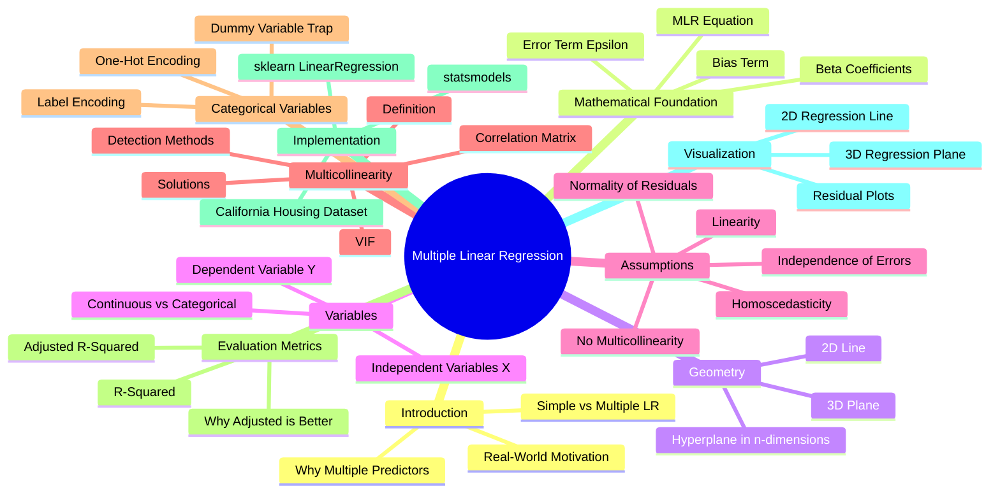
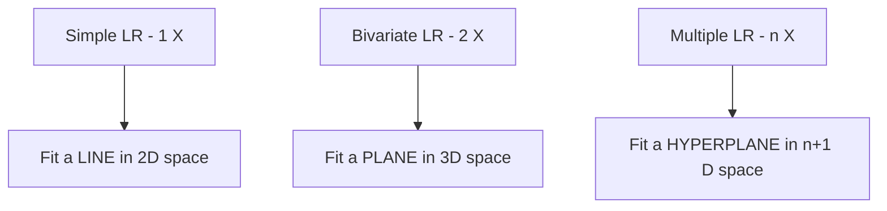

# AS24: Multiple Linear Regression - Classroom Session (Part 1)

> 📚 **This is Part 1** covering: Introduction to MLR, Simple vs Multiple LR, Mathematical Equation, Hyperplanes, Independent/Dependent Variables
> 📘 **Next:** [Part 2](./AS24_MultipleLinearRegression2.md), [Part 3](./AS24_MultipleLinearRegression3.md), [Part 4](./AS24_MultipleLinearRegression4.md)

---

## 🗺️ Mind Map - Topics to Cover



---

## 🎓 Classroom Conversation

### Topic 1: Introduction - Why Do We Need Multiple Linear Regression?

**Teacher:** Good morning students! Ippudu mana journey lo oka chala important topic chuddam - Multiple Linear Regression. Simple linear regression already chusam kadha? Ippudu adhi extend cheddham. Meeru ready ??

**Beginner Student:** Sir, nenu first basic doubt adigutanu. Simple linear regression lo enti chusam? Aa foundation naku clear ga undali kadha?

**Teacher:** Excellent question! Foundation strong undali ani niku correct ga telsu. Let me revise completely.

Simple Linear Regression lo, mana equation idi:

$$Y = \beta_0 + \beta_1 X$$

**Ikkada:**
- **Y** = Dependent variable (What we want to predict)
- **X** = Independent variable (What we use to predict)
- **β₀** = Intercept or Bias (Y value when X is zero)
- **β₁** = Slope or Weight (How much Y changes when X changes by 1)

**Beginner Student:** Sir, oka real example tho cheppandi, better ga artham avuthundi.

**Teacher:** Sure! Oka beautiful real-life example tho explain chesta.

**Example: House Price Prediction (Simple LR)**

Imagine you want to predict house price based on **only** the house size (square feet).

| House Size (sq ft) | Price (₹ Lakhs) |
|-------------------|-----------------|
| 1000 | 50 |
| 1500 | 75 |
| 2000 | 100 |
| 2500 | 125 |
| 3000 | 150 |

Ikkada clear pattern undi - house size increase avuthey price kuda increase avuthundi. This is a LINEAR relationship!

Mana model: **Price = 0 + 0.05 × Size**

Idi simple linear regression - **ONE X predicting ONE Y**.

**Clever Student:** Sir, but real-world lo house price ki only size matter chestha? Location, number of rooms, amenities anni kuda matter avuthayi kadha?

**Teacher:** EXACTLY! Ippudu correct question adigav. Real-world lo:

1. House price depends on **SIZE** ✅
2. House price depends on **LOCATION** ✅
3. House price depends on **NUMBER OF ROOMS** ✅
4. House price depends on **AGE OF HOUSE** ✅
5. House price depends on **NEARBY SCHOOLS** ✅
6. House price depends on **PARKING AVAILABILITY** ✅

**Anni factors ni account cheyali** - Idi simple LR lo possible kaadu!

**Beginner Student:** Sir, then ela chestham? Anni columns use cheyyadaniki oka method undha?

**Teacher:** YES! That method is called **MULTIPLE LINEAR REGRESSION**!

> 💡 **Jargon Alert - Multiple Linear Regression (MLR)**
> **Simple Explanation:** Oka school lo student final marks ni predict cheyyadaniki oka subject marks chaladhu. Math, Science, English anni subjects marks kalisesthey better prediction vasthundi. Similarly, MLR lo multiple inputs use chesthamu for better prediction.
> **Example:** House price = f(size, location, rooms, age, amenities...) - Many inputs, one output!

---

### Topic 2: The Core Difference - Simple vs Multiple Linear Regression

**Teacher:** Ippudu difference clearly understand cheddham with a detailed comparison.

**Practical Student:** Sir, interview lo adi adugutharu? "What's the difference between Simple and Multiple Linear Regression?"

**Teacher:** 100% adugutharu! Idi chala common interview question. Nenu detailed answer nerchupistha.

| Aspect | Simple Linear Regression | Multiple Linear Regression |
|--------|--------------------------|----------------------------|
| **Number of X variables** | Only 1 (Single predictor) | 2 or more (Multiple predictors) |
| **Equation** | Y = β₀ + β₁X | Y = β₀ + β₁X₁ + β₂X₂ + ... + βₙXₙ |
| **Visualization** | 2D (Line in X-Y plane) | 3D+ (Plane/Hyperplane) |
| **Coefficients to find** | 2 (β₀ and β₁) | n+1 (β₀, β₁, β₂, ..., βₙ) |
| **Complexity** | Low | High |
| **Multicollinearity issue** | Not possible | Yes, major problem |
| **Real-world usage** | Limited | Very common |
| **Example** | Price vs Size only | Price vs Size, Location, Rooms... |

**Beginner Student:** Sir, "2 or more predictors" ante exact ga enti? 2 unte different name untunda?

**Teacher:** Wonderful observation! Yes, specific names untayi:

1. **Univariate Regression**: 1 predictor (Simple LR)
   - Example: Price = f(Size)

2. **Bivariate Regression**: 2 predictors
   - Example: Price = f(Size, Location)

3. **Multivariate Regression**: More than 2 predictors
   - Example: Price = f(Size, Location, Rooms, Age, ...)

**Curious Student:** Sir, why is it called "linear" even though we have multiple variables? Adi straight line kaadu kadha?

**Teacher:** BRILLIANT question! Naku idi explain cheyyadaniki chala ishtam.

The word **"Linear"** here does NOT mean "straight line". It means the relationship between Y and each X is **linear** (no X², X³, sin(X), etc.).

**Linear relationship:**
- Y = β₀ + β₁X₁ + β₂X₂ ✅ (Linear)
- Each X has power 1

**Non-linear relationship:**
- Y = β₀ + β₁X₁² + β₂X₂ ❌ (Not linear - has X₁²)
- Y = β₀ + β₁sin(X₁) ❌ (Not linear - has sin function)

Even in Multiple LR, the relationship between Y and each individual X is a straight line - just that there are MANY such straight lines combined!

---

### Topic 3: The Mathematical Equation of Multiple Linear Regression

**Teacher:** Ippudu formal mathematical equation chuddam. Idi mana foundation - chaala carefully understand cheyyandi.

**The Multiple Linear Regression Equation:**

$$Y = \beta_0 + \beta_1 X_1 + \beta_2 X_2 + \beta_3 X_3 + ... + \beta_n X_n + \epsilon$$

**Breaking down each component:**

| Symbol | Name | Meaning | Analogy |
|--------|------|---------|---------|
| **Y** | Dependent Variable | What we predict | Final exam marks |
| **X₁, X₂, ..., Xₙ** | Independent Variables | Inputs for prediction | Subject-wise study hours |
| **β₀** | Intercept/Bias | Y value when all X = 0 | Baseline marks without studying |
| **β₁, β₂, ..., βₙ** | Coefficients/Weights | Impact of each X on Y | Marks per hour for each subject |
| **ε (Epsilon)** | Error Term | Random unexplained variation | Random factors like mood, luck |
| **n** | Number of Variables | How many predictors | Number of subjects |

**Beginner Student:** Sir, idi complex ga undi. Oka example tho step by step cheppandi please.

**Teacher:** Absolutely! Let me create a detailed example that you'll never forget.

---

### Topic 4: Complete Worked Example - House Price Prediction

**Teacher:** Ippudu oka complete example chuddam - House Price Prediction with 3 features.

**Scenario:** Meeru oka real estate company lo data scientist. House price predict cheyalli.

**Features (X variables):**
1. X₁ = Size of house (in 1000 sq ft)
2. X₂ = Number of bedrooms
3. X₃ = Age of house (in years)

**Target (Y variable):**
- Y = Price of house (in ₹ Lakhs)

**After running our MLR model, suppose we get:**

$$Price = 20 + 45 \times Size + 8 \times Bedrooms - 1.5 \times Age$$

**Now let's interpret EACH coefficient:**

**β₀ = 20 (Intercept):**
- When Size = 0, Bedrooms = 0, Age = 0
- Base price = ₹20 Lakhs
- This represents land value or minimum property value

**β₁ = 45 (Size coefficient):**
- For every additional 1000 sq ft, price increases by ₹45 Lakhs
- Larger houses are MORE expensive (positive coefficient)
- **Sign: POSITIVE** ✅

**β₂ = 8 (Bedrooms coefficient):**
- For every additional bedroom, price increases by ₹8 Lakhs
- More bedrooms mean MORE value
- **Sign: POSITIVE** ✅

**β₃ = -1.5 (Age coefficient):**
- For every additional year of age, price DECREASES by ₹1.5 Lakhs
- Older houses are LESS valuable
- **Sign: NEGATIVE** ⚠️ (Makes sense!)

**Clever Student:** Sir, oka specific house ki price calculate cheyyu, then I'll understand better.

**Teacher:** Perfect learning approach! Let's calculate:

**House Details:**
- Size = 2 (meaning 2000 sq ft)
- Bedrooms = 3
- Age = 10 years

**Calculation:**
```
Price = 20 + 45(2) + 8(3) - 1.5(10)
Price = 20 + 90 + 24 - 15
Price = ₹119 Lakhs
```

**Let's verify this makes sense:**
- Base value: ₹20 Lakhs
- Size contribution: ₹90 Lakhs (2000 sq ft is valuable!)
- Bedroom contribution: ₹24 Lakhs (3 bedrooms add value)
- Age penalty: -₹15 Lakhs (10-year-old house loses some value)
- **Final: ₹119 Lakhs** ✓

**Critique Student:** Sir, but idi too simplified kaada? Real-world lo coefficients ila clean numbers undavu kadha?

**Teacher:** 100% Correct! Real-world lo:

```
Price = 19.847 + 44.932 × Size + 8.127 × Bedrooms - 1.483 × Age + ε

Where ε ~ N(0, σ²) is the random error term
```

The error term (epsilon) captures:
- Factors we didn't include (parking, view, neighbors...)
- Random noise in data
- Measurement errors
- Unexplainable variations

---

### Topic 5: What is a Hyperplane? (The Geometry of MLR)

**Teacher:** Ippudu visualization concept chuddam - idi interview lo conceptually adugutharu.

**Beginner Student:** Sir, simple LR lo line fit chestham ani chepparu. Multiple LR lo enti fit chestham?

**Teacher:** Excellent recall! Let me explain step by step:

**Simple LR (1 X variable):**
- X-axis: Independent variable
- Y-axis: Dependent variable
- **We fit a LINE** (2D)

```
    Y
    |      *
    |    *  (Line of Best Fit)
    |  *
    |*
    +-----------> X
```

**Bivariate LR (2 X variables):**
- X₁-axis: First independent variable
- X₂-axis: Second independent variable
- Y-axis (vertical): Dependent variable
- **We fit a PLANE** (3D)



**Curious Student:** Sir, hyperplane ante enti? Adi visualize cheyagalam?

**Teacher:** Great question! Let me explain with an analogy:

> 💡 **Jargon Alert - Hyperplane**
> **Simple Explanation:** Just like how a line is a 1D object in 2D space, and a plane is a 2D object in 3D space, a hyperplane is an (n-1) dimensional object in n-dimensional space. It's a generalization!
>
> **Analogy:** 
> - 2D world: A LINE separates/fits the space
> - 3D world: A PLANE (flat surface) separates/fits the space
> - 4D world: A HYPERPLANE (3D surface) fits the space
> - nD world: An (n-1)D HYPERPLANE fits the space
>
> **Example:** If you have 10 features (10 X variables), you're fitting a 10-dimensional hyperplane in 11-dimensional space. You CANNOT visualize it, but mathematically it exists!

**Debate Student:** Sir, nenu visualize cheyalekapothe ela trust cheyali model works ani?

**Teacher:** VERY valid concern! Data scientists use these methods:

1. **Metrics:** R², Adjusted R², MSE, MAE - Numbers tell if model is good
2. **Residual Plots:** Plot errors to see patterns
3. **Partial Regression Plots:** Show relationship between Y and one X at a time
4. **3D Plots:** For 2 predictors, you CAN visualize in 3D
5. **Trust the Math:** Linear algebra guarantees optimal solution!

---

### Topic 6: Understanding Variables - Dependent vs Independent

**Teacher:** Ippudu variables ni deeply understand cheddham.

**Beginner Student:** Sir, dependent and independent ante enti? Confusing ga undi.

**Teacher:** Let me explain with a beautiful analogy.

**Analogy: Student-Exam-Result**

Think about your exam marks:
- Your **MARKS** depend on: Study hours, Sleep, Coaching, Previous knowledge
- You CANNOT control marks directly
- You CAN control study hours, sleep, etc.

**So:**
- **MARKS = Dependent Variable (Y)** - It DEPENDS on other things
- **Study Hours = Independent Variable (X₁)** - You can independently control it
- **Sleep Hours = Independent Variable (X₂)** - You can independently control it
- **Coaching = Independent Variable (X₃)** - You can independently control it

**Medical Analogy:**
- **Blood Pressure (Y)** = Dependent variable
- **Salt intake (X₁)** = Independent variable
- **Exercise (X₂)** = Independent variable
- **Age (X₃)** = Independent variable

**Business Analogy:**
- **Sales (Y)** = Dependent variable
- **Advertising spend (X₁)** = Independent variable
- **Season (X₂)** = Independent variable
- **Price (X₃)** = Independent variable

**Practical Student:** Sir, interview lo idi kuda aduguthara?

**Teacher:** YES! Common question: "Explain dependent and independent variables with examples."

**Perfect Answer Template:**
> "In regression, the dependent variable (also called target or response variable) is what we want to predict - it DEPENDS on other factors. Independent variables (also called features, predictors, or explanatory variables) are the inputs we use to make the prediction. For example, in predicting house prices (dependent), we use size, location, and age (independent) as predictors."

---

### Topic 7: The Goal of Multiple Linear Regression

**Teacher:** Ippudu mana ultimate goal enti ani clearly understand cheddham.

**The Goal:**
$$\text{Find optimal values of } \beta_0, \beta_1, \beta_2, ..., \beta_n$$

**That minimize the error (difference between actual and predicted Y).**

**Clever Student:** Sir, optimal values ela find chestharu? What method?

**Teacher:** We use a method called **Ordinary Least Squares (OLS)**.

**What OLS Does:**

1. For each data point, calculate the error:
   $$\text{Error}_i = Y_{\text{actual}} - Y_{\text{predicted}}$$

2. Square each error (to make all positive):
   $$\text{Error}_i^2 = (Y_{\text{actual}} - Y_{\text{predicted}})^2$$

3. Sum all squared errors:
   $$\text{SSE} = \sum_{i=1}^{n} (Y_i - \hat{Y}_i)^2$$

4. Find β values that MINIMIZE this SSE

**Why "Least Squares"?**
- We are finding values that give the LEAST (minimum) sum of SQUARED errors!

> 💡 **Jargon Alert - Ordinary Least Squares (OLS)**
> **Simple Explanation:** Like finding the best position for a see-saw so it balances perfectly! OLS finds the coefficients that make our predictions as close to actual values as possible, minimizing the overall "mistake" our model makes.
> **Example:** If actual prices are [100, 150, 80] and model predicts [105, 145, 85], errors are [5, 5, 5]. SSE = 25 + 25 + 25 = 75. OLS tries to make this 75 as small as possible!

---

### Topic 8: Numerical Example - Finding Coefficients Manually

**Teacher:** Ippudu oka simple numerical example chuddam. Idi exam lo kuda adugutharu!

**Beginner Student:** Sir, manually ela calculate chestharu? Formula cheppandi.

**Teacher:** For simple calculation, I'll show you a 2-variable case:

**Data:**
| X₁ (Size) | X₂ (Rooms) | Y (Price) |
|-----------|------------|-----------|
| 1 | 2 | 50 |
| 2 | 3 | 80 |
| 3 | 4 | 110 |
| 4 | 5 | 140 |

**Our model:** Y = β₀ + β₁X₁ + β₂X₂

**By applying matrix algebra (which we won't do manually), sklearn gives us:**
- β₀ ≈ 10
- β₁ ≈ 25
- β₂ ≈ 5

**Verification:**
```
For row 1: Y = 10 + 25(1) + 5(2) = 10 + 25 + 10 = 45 (Actual: 50, Error: 5)
For row 2: Y = 10 + 25(2) + 5(3) = 10 + 50 + 15 = 75 (Actual: 80, Error: 5)
For row 3: Y = 10 + 25(3) + 5(4) = 10 + 75 + 20 = 105 (Actual: 110, Error: 5)
For row 4: Y = 10 + 25(4) + 5(5) = 10 + 100 + 25 = 135 (Actual: 140, Error: 5)
```

**SSE = 5² + 5² + 5² + 5² = 100**

OLS found these values because they give minimum possible SSE!

---

### Topic 9: sklearn Implementation - First Look

**Teacher:** Ippudu Python code chuddam - California Housing Dataset use chesi.

```python
# Step 1: Import required libraries
import pandas as pd
import numpy as np
from sklearn.datasets import fetch_california_housing
from sklearn.linear_model import LinearRegression
from sklearn.model_selection import train_test_split

# Step 2: Load California Housing Dataset
data = fetch_california_housing(as_frame=True)
df = data.frame

print("Dataset Shape:", df.shape)
print("\nFirst 5 rows:")
print(df.head())
```

**Output:**
```
Dataset Shape: (20640, 9)

First 5 rows:
   MedInc  HouseAge  AveRooms  AveBedrms  Population  AveOccup  Latitude  Longitude  MedHouseVal
0  8.3252      41.0  6.984127   1.023810       322.0  2.555556     37.88    -122.23        4.526
1  8.3014      21.0  6.238137   0.971880      2401.0  2.109842     37.86    -122.22        3.585
2  7.2574      52.0  8.288136   1.073446       496.0  2.802260     37.85    -122.24        3.521
3  5.6431      52.0  5.817352   1.073059       558.0  2.547945     37.85    -122.25        3.413
4  3.8462      52.0  6.281853   1.081081       565.0  2.181467     37.85    -122.25        3.422
```

**Beginner Student:** Sir, ye columns enti? Meaning cheppandi.

**Teacher:** Let me explain each column in detail:

| Column | Full Name | Meaning |
|--------|-----------|---------|
| **MedInc** | Median Income | Average income of people in that area (in $10,000s) |
| **HouseAge** | House Age | How old the house is (in years) |
| **AveRooms** | Average Rooms | Average number of rooms per household |
| **AveBedrms** | Average Bedrooms | Average number of bedrooms per household |
| **Population** | Population | Number of people living in that block |
| **AveOccup** | Average Occupancy | Average people per household |
| **Latitude** | Latitude | Geographic latitude coordinate |
| **Longitude** | Longitude | Geographic longitude coordinate |
| **MedHouseVal** | Median House Value | **TARGET (Y)** - House value in $100,000s |

**All columns except MedHouseVal are X (independent variables).
MedHouseVal is Y (dependent variable) - what we predict!**

---

```python
# Step 3: Prepare X and Y
# X = All columns except target (MedHouseVal)
X = df.drop('MedHouseVal', axis=1)

# Y = Target column
y = df['MedHouseVal']

print("X shape:", X.shape)  # (20640, 8) - 8 features
print("y shape:", y.shape)  # (20640,) - 20640 target values
```

```python
# Step 4: Train-Test Split
X_train, X_test, y_train, y_test = train_test_split(
    X, y, 
    test_size=0.2,    # 20% for testing
    random_state=42   # For reproducibility
)

print(f"Training samples: {len(X_train)}")  # 16512
print(f"Testing samples: {len(X_test)}")    # 4128
```

```python
# Step 5: Create and Fit the Model
model = LinearRegression()
model.fit(X_train, y_train)

# Step 6: Get Coefficients
print("Intercept (β₀):", model.intercept_)
print("\nCoefficients (β₁, β₂, ...):")
for feature, coef in zip(X.columns, model.coef_):
    print(f"  {feature:12s}: {coef:10.6f}")
```

**Output:**
```
Intercept (β₀): -36.94192...

Coefficients (β₁, β₂, ...):
  MedInc      :   0.436693
  HouseAge    :   0.009436
  AveRooms    :  -0.107322
  AveBedrms   :   0.645065
  Population  :  -0.000004
  AveOccup    :  -0.003787
  Latitude    :  -0.421314
  Longitude   :  -0.434514
```

**Critique Student:** Sir, AveRooms coefficient NEGATIVE undi! Rooms badithey price decrease avuthunda? Adi wrong anipistundi!

**Teacher:** EXCELLENT observation! Idi chala important point - idi **multicollinearity** valla vastundi. AveRooms and AveBedrms highly correlated, so coefficient signs flip avthunnay.

This is EXACTLY why we study multicollinearity detection and removal. We'll cover this in Part 2!

---

## 📝 Teacher Summary - Part 1

**Teacher:** Okay students, let's summarize Part 1:

### Key Takeaways from Part 1

1. **Simple LR:** Y = β₀ + β₁X (One predictor)
2. **Multiple LR:** Y = β₀ + β₁X₁ + β₂X₂ + ... + βₙXₙ + ε (Many predictors)
3. **Linear means:** Each X has power 1, not that geometry is a line
4. **2D → Line, 3D → Plane, nD → Hyperplane**
5. **β values:** Each β shows how much Y changes when that X changes by 1
6. **Goal:** Find optimal β values using Ordinary Least Squares (OLS)
7. **Multicollinearity** can cause weird coefficient signs (to be covered in Part 2)

### Interview Questions from Part 1

| Question | Key Answer Points |
|----------|-------------------|
| "Difference between Simple and Multiple LR?" | Number of predictors, geometry, complexity |
| "What is a hyperplane?" | Generalization of plane to higher dimensions |
| "What does β coefficient represent?" | Unit change in Y for unit change in that X |
| "What is OLS?" | Method that minimizes sum of squared errors |

---

> 📘 **Continue to Part 2:** [AS24_MultipleLinearRegression2.md](./AS24_MultipleLinearRegression2.md) for Assumptions of MLR, Multicollinearity, Detection Methods, and VIF.
