# AS24: Multiple Linear Regression - Classroom Session (Part 2)

> 📚 **This is Part 2** covering: Assumptions of MLR, Multicollinearity Problem, Detection Methods (Correlation Matrix, VIF), and Solutions
> 📘 **Previous:** [Part 1](./AS24_MultipleLinearRegression1.md)
> 📘 **Next:** [Part 3](./AS24_MultipleLinearRegression3.md), [Part 4](./AS24_MultipleLinearRegression4.md)

---

## 🎓 Classroom Conversation (Continued)

### Topic 10: Assumptions of Multiple Linear Regression

**Teacher:** Okay students, ippudu mana model work cheyyadaniki konni assumptions satisfy avvali. Ivvi violate chesthe, mana results ni trust cheyaleru!

**Beginner Student:** Sir, assumptions ante enti? Rules laga untaya?

**Teacher:** Exactly! Like exam ki rules untayi - time limit, calculator allowed/not - model ki kuda "rules" untayi. Ivvi violate chesthe model output reliable kaadu.

**The 5 Main Assumptions of Multiple Linear Regression:**

1. **Linearity**
2. **Independence of Errors**
3. **Homoscedasticity**
4. **Normality of Residuals**
5. **No Multicollinearity** (NEW in MLR!)

**Practical Student:** Sir, interview lo anni assumptions aduguthara? How important?

**Teacher:** VERY important! Interviewers love this question: "What are the assumptions of Linear Regression and how do you check them?"

Let me explain each one in DEEP detail:

---

### Topic 11: Assumption 1 - Linearity

**Teacher:** First assumption - **Linearity**.

> 💡 **Jargon Alert - Linearity Assumption**
> **Simple Explanation:** The relationship between each X variable and Y must be a straight line relationship, not curved.
> **Example:** If house size increases, price should increase in a CONSISTENT manner (not suddenly jump or curve).

**What it means:**
- Y changes by a CONSTANT amount for every unit change in X
- No curving, no bending, no sudden jumps

**How to check:**
1. **Scatter plots** between each X and Y
2. **Residual plots** - residuals should be randomly scattered

```mermaid
flowchart LR
    A[Linear Relationship ✅] --> B[Straight line pattern]
    C[Non-Linear ❌] --> D[Curved pattern]
    C --> E[U-shaped pattern]
    C --> F[Exponential pattern]
```



**Beginner Student:** Sir, oka picture tho chupinchandi - linear vs non-linear.

**Teacher:** Perfect! Here's a visual comparison:

**LINEAR (Good):**
```
Y |        *
  |      *
  |    *       <- Points follow a straight line
  |  *
  |*
  +-----------> X
```

**NON-LINEAR (Bad):**
```
Y |    *  *
  |  *      *
  |*          *    <- Points follow a curve
  |            *
  |              *
  +----------------> X
```

**Clever Student:** Sir, agar linearity violate avithey ela fix chestham?

**Teacher:** Great question! Solutions include:

| Problem | Solution |
|---------|----------|
| Curved relationship | Transform X or Y (log, sqrt, polynomial) |
| Specific pattern | Add polynomial terms (X², X³) |
| Complex curves | Use non-linear regression instead |

**Example Fix:**
- Original: Y = β₀ + β₁X (Not fitting well)
- Fixed: Y = β₀ + β₁X + β₂X² (Polynomial terms added)

---

### Topic 12: Assumption 2 - Independence of Errors

**Teacher:** Second assumption - **Independence of Errors**.

> 💡 **Jargon Alert - Independence of Errors**
> **Simple Explanation:** Each prediction error should be UNRELATED to other errors. Like tossing a coin - each toss is independent.
> **Example:** If you make a big error predicting Monday's sales, that shouldn't influence Tuesday's prediction error.

**What it means:**
- Error at point i has NO relationship with error at point j
- Errors don't follow any pattern
- Errors are RANDOM

**How to check:**
1. **Residual Plot** - Plot residuals vs predicted values
2. **Durbin-Watson Test** - Statistical test for autocorrelation
3. Visual inspection - No patterns in residuals

**Critique Student:** Sir, idi eppudu violate avuthundi?

**Teacher:** Common scenarios:

1. **Time Series Data:** Today's stock price error is related to yesterday's
2. **Spatial Data:** Errors in neighboring houses might be similar
3. **Grouped Data:** Students from same school might have similar errors

**Good Residual Plot (Random):**
```
Error |   *    *
      | *   *     *  <- Random, no pattern!
      |    *  *
      |  *       *
      +-------------> Predicted Y
```

**Bad Residual Plot (Pattern):**
```
Error |*  *  *
      |   *  *  *
      |       *  *  *  <- Clear pattern! Problem!
      |          *  *
      +-----------------> Predicted Y
```

---

### Topic 13: Assumption 3 - Homoscedasticity

**Teacher:** Third assumption - **Homoscedasticity**. Idi English lo most difficult pronunciation!

**Beginner Student:** Sir, idi ela pronounce cheyalli exactly?

**Teacher:** "Ho-mo-ske-das-ti-city" - Ho-mo-ske-DAS-ti-city! Now the meaning:

> 💡 **Jargon Alert - Homoscedasticity**
> **Simple Explanation:** The "spread" of errors should be CONSTANT across all values of X. Like a band that stays the same width throughout.
> **Opposite:** Heteroscedasticity - when error spread CHANGES (like a growing cone)
> **Example:** Prediction errors for cheap houses should be similar in size to prediction errors for expensive houses.

**Visual Comparison:**

**Homoscedasticity (Good):**
```
Y |    *    *    *
  |  *    *    *       <- Same spread throughout
  |    *    *    *
  +-------------------> X
```

**Heteroscedasticity (Bad):**
```
Y |                  *
  |               *  *  *
  |            *  *       <- Spread INCREASES with X!
  |         *  *
  |      *  *
  |   *
  +-----------------------> X
```

**How to check:**
1. **Residual vs Fitted plot** - Should show constant spread
2. **Breusch-Pagan Test** - Statistical test
3. **Goldfeld-Quandt Test** - Another statistical test

**Practical Student:** Sir, real example kottandi where heteroscedasticity happens.

**Teacher:** Perfect example:

**Income vs Spending:**
- Poor families: Spending around ₹15k ± ₹2k (small variation)
- Middle class: Spending around ₹50k ± ₹10k (medium variation)
- Rich families: Spending around ₹2L ± ₹50k (large variation)

See? As income increases, the SPREAD of spending also increases. This violates homoscedasticity!

**Solutions:**
1. Log transformation of Y
2. Weighted Least Squares
3. Robust standard errors

---

### Topic 14: Assumption 4 - Normality of Residuals

**Teacher:** Fourth assumption - **Normality of Residuals**.

> 💡 **Jargon Alert - Normality of Residuals**
> **Simple Explanation:** The errors (residuals) should follow a bell-curve shape (Normal Distribution). Most errors should be small, with few large errors.
> **Example:** Like student marks in a class - most get average, few fail or get 100.

**What it means:**
- Histogram of residuals → Bell shape
- Most residuals near zero
- Few extreme residuals

**How to check:**
1. **Q-Q Plot (Quantile-Quantile Plot)**
2. **Histogram of Residuals**
3. **Shapiro-Wilk Test**

**Beginner Student:** Sir, Q-Q plot enti?

**Teacher:** Q-Q plot is a powerful visual check. Let me explain in detail.

**Q-Q Plot Explained:**
- X-axis: Theoretical quantiles (what normal distribution expects)
- Y-axis: Sample quantiles (what we actually got)
- If normal → Points fall on a straight line

```
Good Q-Q Plot:
Sample |        *
       |      *        <- Points on diagonal line = NORMAL
       |    *
       |  *
       +-----------> Theory

Bad Q-Q Plot:
Sample |  *  *  *
       |       *
       |      *        <- Points curve away = NOT normal
       |  *
       +-----------> Theory
```

**Important Note:** For large samples (n > 30), this assumption becomes less critical due to Central Limit Theorem!

---

### Topic 15: Assumption 5 - No Multicollinearity (THE BIG ONE!)

**Teacher:** Fifth assumption - **No Multicollinearity**. Idi MLR lo MOST IMPORTANT new assumption!

**Beginner Student:** Sir, multicollinearity ante enti exactly?

**Teacher:** Let me explain with a detailed analogy and definition.

> 💡 **Jargon Alert - Multicollinearity**
> **Simple Explanation:** When two or more X variables are HIGHLY CORRELATED with each other. They're giving SAME information in different forms.
> **Analogy:** Imagine hiring two employees who are twins and do exactly the same work. They're redundant! One is enough.
> **Example:** House size and number of rooms - if house is big, naturally more rooms. These two variables provide SIMILAR information.

**What causes it:**
1. **Direct relationship:** X₁ increases → X₂ increases always
2. **Derived variables:** One variable is calculated from another
3. **Same underlying factor:** Both measure same thing differently

**Clever Student:** Sir, mathematically what happens when multicollinearity exists?

**Teacher:** Excellent deep question! Here's what goes wrong:

**Mathematical Problems:**

1. **Unstable Coefficients:**
   - Small change in data → HUGE change in coefficients
   - Model becomes very sensitive

2. **Sign Flips:**
   - Coefficient that should be POSITIVE becomes NEGATIVE
   - Like what we saw earlier with AveRooms!

3. **Large Standard Errors:**
   - Confidence intervals become very wide
   - Hard to know true coefficient value

4. **Difficulty in Interpretation:**
   - Can't say "increasing X₁ by 1 unit increases Y by β₁"
   - Because X₂ also changes when X₁ changes!

**Visual Representation:**

```mermaid
flowchart TD
    A[Multicollinearity Exists] --> B[X₁ and X₂ highly correlated]
    B --> C[Model confused about weights]
    C --> D[Unstable coefficients]
    C --> E[Sign flips - β becomes negative when should be positive]
    C --> F[Large standard errors]
    D --> G[Wrong predictions]
    E --> G
    F --> G
```



**Practical Student:** Sir, real example tho show cheyandi - where multicollinearity causes problem.

**Teacher:** Perfect! Let me show the EXACT example from our California Housing data:

**Example: AveRooms vs AveBedrms**

| Variable | Meaning |
|----------|---------|
| AveRooms | Average number of rooms per household |
| AveBedrms | Average number of bedrooms per household |

**Common sense:**
- More rooms → Higher price (positive coefficient expected)
- More bedrooms → Higher price (positive coefficient expected)

**What we got from model:**
- AveRooms coefficient: **-0.107** (NEGATIVE! Wrong!)
- AveBedrms coefficient: **+0.645** (Positive)

**Why this happened:**
- AveRooms and AveBedrms are HIGHLY correlated
- A house with more rooms usually has more bedrooms
- Model got confused distributing weight between them
- Gave one negative, one positive to "balance"

**When we removed AveBedrms:**
- AveRooms coefficient became: **+0.14** (POSITIVE! Correct!)
- Now makes logical sense!

---

### Topic 16: Detecting Multicollinearity - Method 1: Correlation Matrix

**Teacher:** Ippudu multicollinearity detect cheyyadaniki methods chuddam. First method: **Correlation Matrix**.

**Beginner Student:** Sir, correlation matrix ante enti?

**Teacher:** Correlation matrix shows the correlation (relationship strength) between EVERY pair of variables.

**Correlation Values:**
- **+1.0:** Perfect positive correlation (both increase together)
- **-1.0:** Perfect negative correlation (one increases, other decreases)
- **0.0:** No correlation (unrelated)
- **|r| > 0.7:** Generally considered HIGH correlation → Problem!

```python
import seaborn as sns
import matplotlib.pyplot as plt

# Calculate correlation matrix
corr_matrix = X.corr()

# Create heatmap
plt.figure(figsize=(10, 8))
sns.heatmap(corr_matrix, annot=True, cmap='coolwarm', center=0)
plt.title('Correlation Matrix - Checking Multicollinearity')
plt.tight_layout()
plt.show()
```

**Reading the Heatmap:**
- **Red cells:** High positive correlation
- **Blue cells:** High negative correlation
- **White cells:** Low/no correlation
- **Diagonal:** Always 1.0 (variable with itself)

**What to look for:**
- Off-diagonal cells with values > 0.7 or < -0.7
- These pairs have multicollinearity!

**Critique Student:** Sir, correlation matrix ki limitations untaya?

**Teacher:** Great critical thinking! Yes, limitations:

1. **Only detects pairwise correlations**
   - Can't detect if X₃ = X₁ + X₂ (three-variable relationship)
   
2. **Threshold is arbitrary**
   - Why 0.7? Why not 0.8?
   - Some use 0.8, some use 0.7

3. **Doesn't quantify impact on regression**
   - Just shows correlation, not how much it affects model

**That's why we need VIF - Variance Inflation Factor!**

---

### Topic 17: Detecting Multicollinearity - Method 2: Variance Inflation Factor (VIF)

**Teacher:** Second and BETTER method: **VIF - Variance Inflation Factor**.

> 💡 **Jargon Alert - Variance Inflation Factor (VIF)**
> **Simple Explanation:** A number that tells you how much the variance (uncertainty) of a coefficient is INFLATED (increased) due to multicollinearity. Higher VIF = More inflation = More problem!
> **Formula:** VIF = 1 / (1 - R²)
> **Example:** If VIF = 10, the variance is 10 times higher than it should be. Very bad!

**VIF Interpretation Guide:**

| VIF Value | Interpretation | Action |
|-----------|----------------|--------|
| **1** | No multicollinearity | Perfect! ✅ |
| **1 - 5** | Low to moderate | Acceptable |
| **5 - 10** | Moderate to high | Concerning ⚠️ |
| **> 10** | Very high | Must address! ❌ |
| **> 100** | Severe | Definitely remove variable! |

**Beginner Student:** Sir, VIF exact ga ela calculate chestharu?

**Teacher:** VIF for each variable is calculated by running regression of that variable against ALL other X variables!

**Step-by-step VIF Calculation for X₁:**

1. Take X₁ as the "target"
2. Use all other X variables (X₂, X₃, ..., Xₙ) as predictors
3. Run regression: X₁ = f(X₂, X₃, ..., Xₙ)
4. Get R² from this regression (call it R₁²)
5. **VIF₁ = 1 / (1 - R₁²)**

**Interpretation:**
- If R₁² is high (X₁ is well-predicted by other Xs) → VIF is high → Multicollinearity!
- If R₁² is low (X₁ is NOT predictable from other Xs) → VIF is low → Good!

**Clever Student:** Sir, example tho samjhao. If R² = 0.9, VIF kitna hoga?

**Teacher:** Great calculation question!

```
If R² = 0.9:
VIF = 1 / (1 - 0.9)
VIF = 1 / 0.1
VIF = 10  ← High! Problem!
```

```
If R² = 0.5:
VIF = 1 / (1 - 0.5)
VIF = 1 / 0.5
VIF = 2  ← Moderate, acceptable
```

```
If R² = 0:
VIF = 1 / (1 - 0)
VIF = 1 / 1
VIF = 1  ← Perfect! No multicollinearity
```

---

### Topic 18: VIF Implementation in Python

**Teacher:** Ippudu Python lo VIF calculate cheddham.

```python
from statsmodels.stats.outliers_influence import variance_inflation_factor
import pandas as pd

# Prepare data - add constant for intercept
from statsmodels.tools.tools import add_constant
X_with_const = add_constant(X)

# Calculate VIF for each variable
vif_data = pd.DataFrame()
vif_data['Feature'] = X_with_const.columns
vif_data['VIF'] = [variance_inflation_factor(X_with_const.values, i) 
                   for i in range(X_with_const.shape[1])]

print("Variance Inflation Factors:")
print(vif_data.sort_values('VIF', ascending=False))
```

**Output Example:**
```
Variance Inflation Factors:
      Feature        VIF
0       const  525.843281
4   AveBedrms   48.543679  ← Very High! Problem!
3    AveRooms   37.442180  ← Very High! Problem!
6    Latitude    8.968420  ← High
7   Longitude    8.657342  ← High
1      MedInc    2.500712  ← Acceptable
5    AveOccup    1.124567  ← Good
2    HouseAge    1.199034  ← Good
```

**Practical Student:** Sir, const ki VIF 525 undi? That's very high!

**Teacher:** Good catch! The constant (intercept) always has very high VIF - this is NORMAL and we ignore it. Only worry about actual feature variables.

**From the output:**
- **AveBedrms (VIF = 48.5):** Severe multicollinearity! Remove it.
- **AveRooms (VIF = 37.4):** Severe multicollinearity! (Will reduce after removing AveBedrms)
- **Latitude (VIF = 9.0):** High, consider
- **Longitude (VIF = 8.7):** High, consider
- Others are fine!

---

### Topic 19: Solutions to Multicollinearity

**Teacher:** Ippudu multicollinearity detect chesam. Ela fix cheyalli?

**Debate Student:** Sir, correlation matrix and VIF rendu same information chupistaya?

**Teacher:** Great comparison question! They're related but different:

| Aspect | Correlation Matrix | VIF |
|--------|-------------------|-----|
| **What it shows** | Pairwise correlations | Multi-way relationships |
| **Can detect A & B related** | Yes | Yes |
| **Can detect C = A + B** | No | Yes! |
| **Quantifies impact** | Limited | Yes (direct interpretation) |
| **Common threshold** | 0.7 | 5-10 |

**Both are useful - use BOTH for complete picture!**

**Solutions to Multicollinearity:**

**Solution 1: Remove One of the Correlated Variables**
```python
# Remove AveBedrms (keep AveRooms as it's more meaningful)
X_reduced = X.drop('AveBedrms', axis=1)

# Recalculate VIF - should improve
```

**When to use:** When one variable provides no additional information.

**Solution 2: Combine Correlated Variables**
```python
# Create a new combined variable
df['RoomsBedrmRatio'] = df['AveRooms'] / df['AveBedrms']

# Use this instead of both
```

**When to use:** When both variables have useful information.

**Solution 3: Use PCA (Principal Component Analysis)**
```python
from sklearn.decomposition import PCA

pca = PCA(n_components=5)  # Reduce dimensions
X_pca = pca.fit_transform(X)

# Use X_pca for regression - no multicollinearity!
```

**When to use:** When interpretability is less important.

**Curious Student:** Sir, PCA use chesthe coefficients ki meaning undada?

**Teacher:** EXCELLENT insight! This is PCA's main disadvantage:

**With Normal Variables:**
- β₁ = 0.45 for MedInc → "For every $10,000 increase in median income, house value increases by $45,000"
- **Clear business interpretation!**

**With PCA:**
- β₁ = 0.45 for PC1 → "For every unit increase in Principal Component 1..."
- **What is PC1? A mix of all original variables!**
- **No clear business meaning!**

**Trade-off:**
- No PCA: Multicollinearity issues, but interpretable
- With PCA: No multicollinearity, but less interpretable

**Solution 4: Regularization (Ridge/Lasso)**
```python
from sklearn.linear_model import Ridge, Lasso

# Ridge Regression - handles multicollinearity
ridge_model = Ridge(alpha=1.0)
ridge_model.fit(X_train, y_train)

# Lasso Regression - can set coefficients to zero
lasso_model = Lasso(alpha=0.1)
lasso_model.fit(X_train, y_train)
```

**When to use:** When you want to keep all variables but reduce multicollinearity impact.

---

### Topic 20: Practical Demonstration - Removing Multicollinearity

**Teacher:** Ippudu practical ga multicollinearity remove chesi results compare cheddham.

```python
# Original model (with multicollinearity)
from sklearn.linear_model import LinearRegression
from sklearn.metrics import r2_score

model_full = LinearRegression()
model_full.fit(X_train, y_train)
y_pred_full = model_full.predict(X_test)
r2_full = r2_score(y_test, y_pred_full)

print("Full Model Coefficients:")
for feature, coef in zip(X.columns, model_full.coef_):
    print(f"  {feature}: {coef:.4f}")
print(f"\nR² Score: {r2_full:.4f}")

# Reduced model (after removing AveBedrms)
X_reduced = X.drop('AveBedrms', axis=1)
X_train_r, X_test_r, y_train_r, y_test_r = train_test_split(
    X_reduced, y, test_size=0.2, random_state=42
)

model_reduced = LinearRegression()
model_reduced.fit(X_train_r, y_train_r)
y_pred_reduced = model_reduced.predict(X_test_r)
r2_reduced = r2_score(y_test_r, y_pred_reduced)

print("\nReduced Model Coefficients:")
for feature, coef in zip(X_reduced.columns, model_reduced.coef_):
    print(f"  {feature}: {coef:.4f}")
print(f"\nR² Score: {r2_reduced:.4f}")
```

**Expected Output:**
```
Full Model Coefficients:
  MedInc: 0.4367
  HouseAge: 0.0094
  AveRooms: -0.1073  ← NEGATIVE (wrong!)
  AveBedrms: 0.6451
  Population: -0.0000
  AveOccup: -0.0038
  Latitude: -0.4213
  Longitude: -0.4345

R² Score: 0.6055

Reduced Model Coefficients:
  MedInc: 0.4395
  HouseAge: 0.0093
  AveRooms: 0.1423  ← POSITIVE (correct!)
  Population: -0.0000
  AveOccup: -0.0036
  Latitude: -0.4189
  Longitude: -0.4312

R² Score: 0.6043
```

**Practical Student:** Sir, R² slightly kam hogaya reduced model mein?

**Teacher:** Yes, R² dropped by 0.0012 (negligible!) But look at the BENEFITS:

1. **AveRooms coefficient is now POSITIVE** - Makes logical sense!
2. **Model is more interpretable** - Can trust the coefficients
3. **More stable** - Small data changes won't flip signs
4. **Faster training** - One less feature

**This is a good trade-off! Small R² loss for much better interpretation!**

---

## 📝 Teacher Summary - Part 2

**Teacher:** Okay students, let's summarize Part 2:

### Key Takeaways from Part 2

1. **5 Assumptions of MLR:**
   - Linearity, Independence of Errors, Homoscedasticity, Normality of Residuals, No Multicollinearity

2. **Multicollinearity:** When X variables are highly correlated
   - Causes: Sign flips, unstable coefficients, large standard errors

3. **Detection Methods:**
   - Correlation Matrix (>0.7 is concerning)
   - VIF (>5 concerning, >10 serious)

4. **Solutions:**
   - Remove one variable
   - Combine variables
   - Use PCA (loses interpretability)
   - Use Ridge/Lasso regularization

### Common Interview Questions

| Question | Key Points |
|----------|------------|
| "What is multicollinearity?" | When X variables are highly correlated |
| "How do you detect it?" | Correlation matrix, VIF |
| "What VIF value is bad?" | >5 concerning, >10 serious |
| "How do you fix it?" | Remove variable, PCA, regularization |
| "Why is it a problem?" | Sign flips, unstable coefficients |

---

> 📘 **Continue to Part 3:** [AS24_MultipleLinearRegression3.md](./AS24_MultipleLinearRegression3.md) for Categorical Variables, Encoding Methods, R-Squared vs Adjusted R-Squared.
