# AS24: Multiple Linear Regression - Classroom Session (Part 3)

> 📚 **This is Part 3** covering: Handling Categorical Variables, One-Hot Encoding, Label Encoding, R-Squared, Adjusted R-Squared, Formula and Interpretation
> 📘 **Previous:** [Part 1](./AS24_MultipleLinearRegression1.md), [Part 2](./AS24_MultipleLinearRegression2.md)
> 📘 **Next:** [Part 4](./AS24_MultipleLinearRegression4.md)

---

## 🎓 Classroom Conversation (Continued)

### Topic 21: Handling Categorical Variables in MLR

**Teacher:** Ippudu important topic - categorical variables ni ela handle cheyali regression lo?

**Beginner Student:** Sir, categorical variables ante enti? Numbers kaadha avi?

**Teacher:** Exactly! Categorical variables are NON-NUMERIC variables. They represent CATEGORIES or GROUPS.

**Examples of Categorical Variables:**

| Variable | Categories | Type |
|----------|------------|------|
| **Gender** | Male, Female | Nominal (no order) |
| **Education** | High School, Bachelor's, Master's, PhD | Ordinal (has order) |
| **City** | Hyderabad, Chennai, Mumbai, Delhi | Nominal |
| **Rating** | Poor, Average, Good, Excellent | Ordinal |
| **Fruit** | Apple, Mango, Orange | Nominal |
| **Day** | Monday, Tuesday, ... Sunday | Ordinal (or Nominal) |

**Practical Student:** Sir, regression ki numbers kavali kadha? Categorical ela use chestham?

**Teacher:** Great question! **Regression models can ONLY work with numbers**. So we must CONVERT categorical to numerical!

Two main methods:
1. **One-Hot Encoding**
2. **Label Encoding**

---

### Topic 22: Label Encoding - Simple But Dangerous

**Teacher:** First, let's understand **Label Encoding** and its problems.

> 💡 **Jargon Alert - Label Encoding**
> **Simple Explanation:** Assign a unique NUMBER to each category. Apple = 0, Mango = 1, Orange = 2.
> **Problem:** Model may think Orange (2) > Mango (1) > Apple (0), which is WRONG for nominal categories!
> **Use Case:** ONLY for ordinal categories (where order matters).

**Example - Label Encoding:**

```python
# Original data
fruits = ['Apple', 'Mango', 'Orange', 'Apple', 'Orange']

# After Label Encoding
fruits_encoded = [0, 1, 2, 0, 2]
```

| Fruit | Label |
|-------|-------|
| Apple | 0 |
| Mango | 1 |
| Orange | 2 |

**Beginner Student:** Sir, simple ga undi. Problem enti?

**Teacher:** The HUGE problem is **implied ordinal relationship**!

**What model thinks:**
- Orange (2) > Mango (1) > Apple (0)
- Orange is "greater" than Apple
- Model might give higher weight to Orange

**Reality:**
- Fruits have NO order! Apple is not "less than" Mango!
- This is a **NOMINAL** category

**Clever Student:** Sir, then label encoding eppudu use cheyali?

**Teacher:** Label encoding is ONLY appropriate for **ORDINAL** categories:

**Good for Label Encoding:**
| Category | Natural Order | Label |
|----------|---------------|-------|
| Education: High School | First | 0 |
| Education: Bachelor's | Second | 1 |
| Education: Master's | Third | 2 |
| Education: PhD | Fourth | 3 |

Here, PhD > Master's > Bachelor's makes SENSE! Order is meaningful!

**Bad for Label Encoding:**
| Category | No Natural Order | Label |
|----------|------------------|-------|
| City: Hyderabad | ? | 0 |
| City: Chennai | ? | 1 |
| City: Mumbai | ? | 2 |

Chennai is NOT greater than Hyderabad! No order exists!

```python
# sklearn implementation
from sklearn.preprocessing import LabelEncoder

le = LabelEncoder()
df['Education_Encoded'] = le.fit_transform(df['Education'])

print(le.classes_)  # ['Bachelor', 'High School', 'Master', 'PhD']
# Alphabetically sorted, not by order! Be careful!
```

---

### Topic 23: One-Hot Encoding - The Preferred Method

**Teacher:** Now the BETTER method - **One-Hot Encoding** (also called Dummy Variables).

> 💡 **Jargon Alert - One-Hot Encoding**
> **Simple Explanation:** Create a SEPARATE COLUMN for each category. Only ONE column is "hot" (1) at a time, rest are "cold" (0).
> **Advantage:** No implied order! Each category is independent.
> **Use Case:** For NOMINAL categories (no natural order).

**Example - One-Hot Encoding:**

**Original Data:**
| ID | Fruit | Price |
|----|-------|-------|
| 1 | Apple | 50 |
| 2 | Mango | 80 |
| 3 | Orange | 40 |
| 4 | Apple | 55 |

**After One-Hot Encoding:**
| ID | Fruit_Apple | Fruit_Mango | Fruit_Orange | Price |
|----|-------------|-------------|--------------|-------|
| 1 | 1 | 0 | 0 | 50 |
| 2 | 0 | 1 | 0 | 80 |
| 3 | 0 | 0 | 1 | 40 |
| 4 | 1 | 0 | 0 | 55 |

**Beginner Student:** Sir, ikkada 3 columns create chesam. Extra space waste kadha?

**Teacher:** Yes, more columns but MUCH better for model! Let me show why:

**How model reads One-Hot Encoded data:**

For Row 1 (Apple):
```
Price = β₀ + β₁(1) + β₂(0) + β₃(0)
      = β₀ + β₁
```

For Row 2 (Mango):
```
Price = β₀ + β₁(0) + β₂(1) + β₃(0)
      = β₀ + β₂
```

**Each fruit gets its OWN coefficient!**
- β₁ = How Apple affects price
- β₂ = How Mango affects price
- β₃ = How Orange affects price

**No confusion about order!**

---

### Topic 24: The Dummy Variable Trap

**Teacher:** Ippudu very important concept - **Dummy Variable Trap**!

**Curious Student:** Sir, trap ante enti? Something dangerous?

**Teacher:** Yes! One-hot encoding lo oka important rule violate chesthe model crash avthundi!

> 💡 **Jargon Alert - Dummy Variable Trap**
> **Simple Explanation:** If you have k categories, you should create only (k-1) dummy columns, not k columns.
> **Reason:** If you know k-1 values, you can automatically determine the k-th value!
> **Example:** If Fruit_Apple = 0 and Fruit_Mango = 0, then it MUST be Orange. No need for Fruit_Orange column!

**Mathematical Problem:**

If you have 3 fruit columns:
- Fruit_Apple + Fruit_Mango + Fruit_Orange = 1 (always!)

This creates **perfect multicollinearity**! The sum is constant!

**Solution - Drop one column:**

| ID | Fruit_Mango | Fruit_Orange | Price |
|----|-------------|--------------|-------|
| 1 | 0 | 0 | 50 |  ← Apple (both 0)
| 2 | 1 | 0 | 80 |  ← Mango
| 3 | 0 | 1 | 40 |  ← Orange
| 4 | 0 | 0 | 55 |  ← Apple

**The dropped category becomes the "baseline" (reference category).**

```python
# pandas get_dummies with drop_first
import pandas as pd

df_encoded = pd.get_dummies(df, columns=['Fruit'], drop_first=True)
# This automatically drops one category!

# Or sklearn OneHotEncoder
from sklearn.preprocessing import OneHotEncoder

ohe = OneHotEncoder(drop='first', sparse=False)
fruit_encoded = ohe.fit_transform(df[['Fruit']])
```

**Practical Student:** Sir, which category ko drop karna chahiye?

**Teacher:** It doesn't matter mathematically - results are equivalent!

But for INTERPRETATION, choose a meaningful baseline:
- For Gender: Male or Female (pick one as baseline)
- For City: Pick most common city as baseline
- For Treatment: "No treatment" as baseline

**Interpretation Example:**
If baseline = Apple:
- β_Mango = +30 means "Mango costs ₹30 MORE than Apple"
- β_Orange = -10 means "Orange costs ₹10 LESS than Apple"

---

### Topic 25: One-Hot Encoding Implementation

**Teacher:** Ippudu complete Python implementation chuddam.

```python
import pandas as pd
from sklearn.preprocessing import OneHotEncoder

# Sample data
data = {
    'Size': [1000, 1500, 2000, 1200, 1800],
    'Location': ['Hyderabad', 'Chennai', 'Mumbai', 'Hyderabad', 'Chennai'],
    'Price': [50, 70, 120, 55, 85]
}
df = pd.DataFrame(data)

print("Original Data:")
print(df)
print()

# Method 1: pandas get_dummies
df_encoded = pd.get_dummies(df, columns=['Location'], drop_first=True)
print("After One-Hot Encoding (pandas):")
print(df_encoded)
print()

# Method 2: sklearn OneHotEncoder
ohe = OneHotEncoder(drop='first', sparse_output=False)
location_encoded = ohe.fit_transform(df[['Location']])
location_df = pd.DataFrame(
    location_encoded, 
    columns=ohe.get_feature_names_out(['Location'])
)
df_final = pd.concat([df.drop('Location', axis=1), location_df], axis=1)
print("After One-Hot Encoding (sklearn):")
print(df_final)
```

**Output:**
```
Original Data:
   Size   Location  Price
0  1000  Hyderabad     50
1  1500    Chennai     70
2  2000     Mumbai    120
3  1200  Hyderabad     55
4  1800    Chennai     85

After One-Hot Encoding (pandas):
   Size  Price  Location_Chennai  Location_Mumbai
0  1000     50               0.0              0.0   # Hyderabad (baseline)
1  1500     70               1.0              0.0   # Chennai
2  2000    120               0.0              1.0   # Mumbai
3  1200     55               0.0              0.0   # Hyderabad
4  1800     85               1.0              0.0   # Chennai
```

**Critique Student:** Sir, Hyderabad column kahan gaya?

**Teacher:** Hyderabad is the **baseline** (reference category). It's represented when BOTH Chennai and Mumbai are 0.

**Reading the coefficients:**
- β_Chennai = +15 means "Chennai houses cost ₹15L more than Hyderabad"
- β_Mumbai = +40 means "Mumbai houses cost ₹40L more than Hyderabad"
- Hyderabad is our reference point!

---

### Topic 26: R-Squared - Review and Deep Understanding

**Teacher:** Ippudu R-Squared concept ni deep ga understand cheddham. Idi interview lo most commonly asked!

**Beginner Student:** Sir, R-squared ante enti? Simple ga explain cheyandi.

**Teacher:** Let me explain with a beautiful analogy first.

**Analogy: Explaining Your Exam Score to Parents**

Your actual marks: 85/100

**Explanation 1 (Poor model):**
"I studied hard" - But this explains only SOME of the variation. Maybe luck also helped.
R² = 0.3 (30% explained)

**Explanation 2 (Good model):**
"I studied 5 hours, did 50 practice problems, got good sleep, ate well"
This explains MOST of the variation.
R² = 0.9 (90% explained)

> 💡 **Jargon Alert - R-Squared (R²)**
> **Simple Explanation:** The percentage of variation in Y that is explained by your X variables. How much of the "why" your model captures.
> **Range:** 0 to 1 (or 0% to 100%)
> **Example:** R² = 0.85 means your model explains 85% of why house prices vary.

**Mathematical Definition:**

$$R^2 = 1 - \frac{SS_{residual}}{SS_{total}} = 1 - \frac{\sum(Y_{actual} - Y_{predicted})^2}{\sum(Y_{actual} - \bar{Y})^2}$$

Where:
- **SS_residual:** Sum of Squared Errors (unexplained variation)
- **SS_total:** Total Sum of Squares (total variation)
- **Ȳ:** Mean of Y

**Clever Student:** Sir, formula ko simple language mein explain karo.

**Teacher:** Perfect! Let me break it down:

**Total Variation (SS_total):**
- How much does Y vary overall?
- If all house prices are same → No variation (SS_total = 0)
- If prices range from 10L to 100L → High variation

**Unexplained Variation (SS_residual):**
- How much variation our model CANNOT explain?
- This is the prediction error squared

**R² Interpretation:**
```
R² = 1 - (Unexplained / Total)
   = 1 - (What we got wrong / Total variation)
   = What we got RIGHT / Total variation
```

**Numerical Example:**
```
Data: Y = [10, 20, 30, 40, 50], Mean = 30
Predicted: [12, 18, 32, 38, 50]

SS_total = (10-30)² + (20-30)² + (30-30)² + (40-30)² + (50-30)²
         = 400 + 100 + 0 + 100 + 400 = 1000

SS_residual = (10-12)² + (20-18)² + (30-32)² + (40-38)² + (50-50)²
            = 4 + 4 + 4 + 4 + 0 = 16

R² = 1 - 16/1000 = 1 - 0.016 = 0.984

Model explains 98.4% of the variation! Very good!
```

---

### Topic 27: R-Squared Interpretation Guide

**Teacher:** R² values ni ela interpret cheyali?

| R² Value | Interpretation | Industry Standard |
|----------|----------------|-------------------|
| **< 0** | Model is WORSE than just using mean | Very bad! |
| **0.0 - 0.3** | Weak | May be acceptable in social sciences |
| **0.3 - 0.5** | Moderate | Acceptable for some applications |
| **0.5 - 0.7** | Substantial | Good for many problems |
| **0.7 - 0.9** | Strong | Very good |
| **> 0.9** | Very Strong | Excellent (but check for overfitting!) |

**Beginner Student:** Sir, R² negative eppudu ostundi?

**Teacher:** Important question! R² can be negative in two cases:

1. **Very bad model:** Model predictions are worse than just predicting mean
2. **No intercept:** If you force the line through origin when it shouldn't

**Example of Negative R²:**
```
Actual Y: [10, 20, 30, 40, 50], Mean = 30
Our predictions: [100, 100, 100, 100, 100]  # Terrible predictions!

SS_total = 1000
SS_residual = (10-100)² + ... = 8100²... = Very large!

R² = 1 - 8100/1000 = 1 - 8.1 = -7.1  ← Negative!

Just predicting mean (30) for everything would be better!
```

**Debate Student:** Sir, R² = 1.0 sab se accha hai na?

**Teacher:** Not necessarily! **R² = 1.0 often indicates OVERFITTING!**

If R² = 1.0:
- Perfect fit on training data
- Likely memorized the data (overfitting)
- Probably performs BADLY on new data

**Healthy R² is typically 0.6 - 0.9 for most regression problems.**

---

### Topic 28: The Problem with R-Squared in MLR

**Teacher:** Ippudu R² ki oka MAJOR problem understand cheddham - specific to Multiple Linear Regression!

**Practical Student:** Sir, R² ki problem undi? Adi good metric kadha?

**Teacher:** R² is good, but has ONE fatal flaw in MLR!

**The Problem:**
> **R² ALWAYS INCREASES (or stays same) when you add more variables - even useless ones!**

**Demonstration Example:**

**Model 1:** Price = f(Size)
- R² = 0.60

**Model 2:** Price = f(Size, Rooms)
- R² = 0.65 ↑

**Model 3:** Price = f(Size, Rooms, Age)
- R² = 0.70 ↑

**Model 4:** Price = f(Size, Rooms, Age, **Random Noise**)
- R² = 0.71 ↑ (Even though Random Noise is useless!)

**Model 5:** Price = f(Size, Rooms, Age, Random Noise, **Coin Flip Result**)
- R² = 0.72 ↑ (Again increased! But Coin Flip means nothing!)

**Beginner Student:** Sir, why does R² increase even with useless variables?

**Teacher:** Mathematical reason:

When you add ANY variable:
- The model has MORE flexibility
- It can fit the training data a BIT better
- Even if that improvement is just noise!

**The Formula Explains:**
```
R² = 1 - (SS_residual / SS_total)

Adding variable → SS_residual can only decrease or stay same (never increase)
                → R² can only increase or stay same (never decrease)
```

This is a **mathematical property**, not a reflection of model quality!

**Critique Student:** Sir, then how do we know if a variable is actually useful?

**Teacher:** EXCELLENT question! That's exactly why we need **Adjusted R-Squared**!

---

### Topic 29: Adjusted R-Squared - The Solution

**Teacher:** Adjusted R-Squared is the solution to R²'s problem!

> 💡 **Jargon Alert - Adjusted R-Squared (R²ₐdj)**
> **Simple Explanation:** R² with a PENALTY for adding useless variables. If you add a useless variable, Adjusted R² will DECREASE!
> **Purpose:** Tells you if adding a variable actually IMPROVES the model.
> **Example:** If R² increases from 0.70 to 0.71 but Adjusted R² drops from 0.69 to 0.68, the new variable is NOT worth adding!

**The Formula:**

$$R^2_{adj} = 1 - \frac{(1 - R^2)(n - 1)}{n - p - 1}$$

Where:
- **n** = Number of data points (observations)
- **p** = Number of predictor variables
- **R²** = Regular R-squared

**Clever Student:** Sir, formula ko step by step explain karo.

**Teacher:** Let's break it down with an example:

**Given:**
- n = 100 (100 data points)
- R² = 0.70

**Case 1: p = 3 (3 variables)**
```
R²_adj = 1 - (1 - 0.70)(100 - 1) / (100 - 3 - 1)
       = 1 - (0.30)(99) / 96
       = 1 - 29.7 / 96
       = 1 - 0.309
       = 0.691
```

**Case 2: p = 5 (5 variables, added 2 more)**
Suppose R² increased to 0.72:
```
R²_adj = 1 - (1 - 0.72)(100 - 1) / (100 - 5 - 1)
       = 1 - (0.28)(99) / 94
       = 1 - 27.72 / 94
       = 1 - 0.295
       = 0.705
```

**Case 3: p = 7 (7 variables, added 2 more useless ones)**
Suppose R² increased to 0.73:
```
R²_adj = 1 - (1 - 0.73)(100 - 1) / (100 - 7 - 1)
       = 1 - (0.27)(99) / 92
       = 1 - 26.73 / 92
       = 1 - 0.290
       = 0.710 → Actually 0.705 if truly useless variables!
```

**Key Insight:**
- When R² increases a tiny bit but p increases by 2
- The denominator (n - p - 1) gets smaller
- The penalty term gets larger
- Adjusted R² can DECREASE!

---

### Topic 30: R² vs Adjusted R² - Complete Comparison

**Teacher:** Ippudu final comparison chuddam.

| Aspect | R² | Adjusted R² |
|--------|-----|-------------|
| **Always increases when adding variables?** | Yes | No! Can decrease |
| **Penalizes useless variables?** | No | Yes |
| **Good for comparing models with different #variables?** | No | Yes |
| **Range** | 0 to 1 (can be negative) | Can be negative |
| **Use case** | Single model evaluation | Model comparison |

**Visual Understanding:**

```mermaid
flowchart TD
    A[Add New Variable] --> B{Is variable useful?}
    B -->|Yes| C[R² increases significantly]
    C --> D[Adjusted R² also increases]
    B -->|No| E[R² increases slightly]
    E --> F[Adjusted R² DECREASES!]
    D --> G[Keep the variable ✅]
    F --> H[Remove the variable ❌]
```



**Practical Student:** Sir, Python mein Adjusted R² calculate kaise karte hain?

**Teacher:** Two methods:

```python
# Method 1: Manual calculation
def adjusted_r2(r2, n, p):
    """
    r2: R-squared value
    n: number of samples
    p: number of predictors
    """
    return 1 - (1 - r2) * (n - 1) / (n - p - 1)

# Example usage
r2 = 0.70
n = 100
p = 5
adj_r2 = adjusted_r2(r2, n, p)
print(f"Adjusted R²: {adj_r2:.4f}")  # 0.6842

# Method 2: Using statsmodels (automatic)
import statsmodels.api as sm

# Add constant for intercept
X_const = sm.add_constant(X_train)

# Fit OLS model
model = sm.OLS(y_train, X_const).fit()

# Get both R² values
print(f"R²: {model.rsquared:.4f}")
print(f"Adjusted R²: {model.rsquared_adj:.4f}")

# Full summary
print(model.summary())
```

---

### Topic 31: Practical Demonstration - R² vs Adjusted R²

**Teacher:** Ippudu practical example chuddam - adding useless variable effects.

```python
import numpy as np
import pandas as pd
from sklearn.linear_model import LinearRegression
from sklearn.model_selection import train_test_split

# Load tips dataset (already available in seaborn)
import seaborn as sns
tips = sns.load_dataset('tips')

# Original features
X1 = tips[['total_bill', 'size']]  # 2 useful features
y = tips['tip']

# Split data
X_train1, X_test1, y_train, y_test = train_test_split(X1, y, test_size=0.2, random_state=42)

# Model 1: Only useful features
model1 = LinearRegression()
model1.fit(X_train1, y_train)
r2_1 = model1.score(X_test1, y_test)

n = len(y_test)
p1 = X1.shape[1]
adj_r2_1 = 1 - (1 - r2_1) * (n - 1) / (n - p1 - 1)

print("Model 1 (total_bill, size):")
print(f"  R²: {r2_1:.4f}")
print(f"  Adjusted R²: {adj_r2_1:.4f}")

# Model 2: Add random noise column
np.random.seed(42)
tips['random_noise'] = np.random.randn(len(tips))

X2 = tips[['total_bill', 'size', 'random_noise']]  # Added useless feature
X_train2, X_test2, _, _ = train_test_split(X2, y, test_size=0.2, random_state=42)

model2 = LinearRegression()
model2.fit(X_train2, y_train)
r2_2 = model2.score(X_test2, y_test)

p2 = X2.shape[1]
adj_r2_2 = 1 - (1 - r2_2) * (n - 1) / (n - p2 - 1)

print("\nModel 2 (total_bill, size, random_noise):")
print(f"  R²: {r2_2:.4f}")
print(f"  Adjusted R²: {adj_r2_2:.4f}")

# Compare
print("\n--- Comparison ---")
print(f"R² change: {r2_2 - r2_1:+.4f}")  # Slight increase
print(f"Adjusted R² change: {adj_r2_2 - adj_r2_1:+.4f}")  # Should decrease!
```

**Expected Output:**
```
Model 1 (total_bill, size):
  R²: 0.4537
  Adjusted R²: 0.4430

Model 2 (total_bill, size, random_noise):
  R²: 0.4560  ← Increased slightly
  Adjusted R²: 0.4390  ← DECREASED! (penalty)

--- Comparison ---
R² change: +0.0023
Adjusted R² change: -0.0040  ← Negative! Don't add random_noise!
```

**Teacher's Interpretation:**
- R² increased by 0.0023 (useless variable still "helps" fit training data)
- Adjusted R² DECREASED by 0.0040 (penalty detected useless variable!)
- **Decision:** Don't add "random_noise" - it's not worth it!

---

## 📝 Teacher Summary - Part 3

**Teacher:** Okay students, let's summarize Part 3:

### Key Takeaways from Part 3

1. **Categorical Variables:** Must convert to numbers for regression
2. **Label Encoding:** Simple but implies order (only for ordinal)
3. **One-Hot Encoding:** Creates dummy columns (preferred for nominal)
4. **Dummy Variable Trap:** Drop one category to avoid perfect multicollinearity
5. **R²:** Measures explained variance, ALWAYS increases with more variables
6. **Adjusted R²:** Penalizes useless variables, better for model comparison

### When to Use What

| Encoding | Use When |
|----------|----------|
| Label Encoding | Variable has natural order (education level, rating) |
| One-Hot Encoding | Variable has no order (city, color, gender) |

| Metric | Use When |
|--------|----------|
| R² | Evaluating single model |
| Adjusted R² | Comparing models with different number of variables |

### Interview Questions

| Question | Answer Points |
|----------|---------------|
| "Difference between R² and Adjusted R²?" | Adjusted penalizes useless variables |
| "Why use One-Hot over Label?" | Avoids implied order for nominal variables |
| "What is dummy variable trap?" | Perfect multicollinearity if all dummies included |
| "When does Adjusted R² decrease?" | When added variable doesn't improve model enough |

---

> 📘 **Continue to Part 4:** [AS24_MultipleLinearRegression4.md](./AS24_MultipleLinearRegression4.md) for Visualization, Complete Implementation, Interview Q&A, and Summary.
