# AS24: Multiple Linear Regression - Classroom Session (Part 4)

> 📚 **This is Part 4** covering: 3D Visualization, Complete Python Implementation, Q&A from Session, Interview Preparation, Final Summary
> 📘 **Previous:** [Part 1](./AS24_MultipleLinearRegression1.md), [Part 2](./AS24_MultipleLinearRegression2.md), [Part 3](./AS24_MultipleLinearRegression3.md)

---

## 🎓 Classroom Conversation (Continued)

### Topic 32: Visualizing Multiple Linear Regression

**Teacher:** Ippudu important topic - MLR ni ela visualize cheyali?

**Beginner Student:** Sir, simple LR lo 2D plot chesam - line fit chesi. MLR lo ela chestham?

**Teacher:** Great recall! Let me explain the visualization for different scenarios:

**Scenario 1: Simple LR (1 predictor) - 2D Plot**
```
    Y (Price)
    |          *
    |      *  /
    |    *  /    <- Regression Line
    |  *  /
    |* /
    +--------------> X (Size)
```
- X-axis: Single predictor
- Y-axis: Target variable
- Fit: **LINE** (1D object in 2D space)

**Scenario 2: Bivariate LR (2 predictors) - 3D Plot**
```
         Y (Price)
         |
         |    ___________
         |   /___________/  <- Regression Plane
         |  /           /
         | /           /
         |/___________/
         +----------------> X₁ (Size)
        /
       /
      X₂ (Age)
```
- X₁-axis: First predictor
- X₂-axis: Second predictor
- Y-axis: Target variable
- Fit: **PLANE** (2D object in 3D space)

**Scenario 3: Multivariate LR (3+ predictors) - Cannot visualize directly!**
- 4D, 5D, ... spaces cannot be plotted
- Use alternative methods:
  1. Partial regression plots
  2. Residual plots
  3. Pair plots
  4. Coefficient bar charts

**Clever Student:** Sir, 3D plot Python mein kaise banate hain?

**Teacher:** Let me show you complete code for 3D visualization:

---

### Topic 33: 3D Visualization Code

```python
import numpy as np
import matplotlib.pyplot as plt
from mpl_toolkits.mplot3d import Axes3D
from sklearn.linear_model import LinearRegression
from sklearn.datasets import fetch_california_housing
import pandas as pd

# Load data
data = fetch_california_housing(as_frame=True)
df = data.frame

# Select 2 predictors for 3D visualization
X = df[['MedInc', 'HouseAge']].values  # 2 features
y = df['MedHouseVal'].values

# Fit model
model = LinearRegression()
model.fit(X, y)

print(f"Intercept: {model.intercept_:.4f}")
print(f"MedInc coefficient: {model.coef_[0]:.4f}")
print(f"HouseAge coefficient: {model.coef_[1]:.4f}")

# Create 3D plot
fig = plt.figure(figsize=(12, 8))
ax = fig.add_subplot(111, projection='3d')

# Plot data points (sample 500 for clarity)
sample_idx = np.random.choice(len(X), 500, replace=False)
ax.scatter(X[sample_idx, 0], X[sample_idx, 1], y[sample_idx], 
           c='blue', alpha=0.3, s=10, label='Actual Data')

# Create mesh grid for regression plane
x1_range = np.linspace(X[:, 0].min(), X[:, 0].max(), 20)
x2_range = np.linspace(X[:, 1].min(), X[:, 1].max(), 20)
X1_grid, X2_grid = np.meshgrid(x1_range, x2_range)

# Predict on grid
X_grid = np.c_[X1_grid.ravel(), X2_grid.ravel()]
Y_grid = model.predict(X_grid).reshape(X1_grid.shape)

# Plot regression plane
ax.plot_surface(X1_grid, X2_grid, Y_grid, alpha=0.5, 
                color='red', label='Regression Plane')

# Labels
ax.set_xlabel('Median Income (×$10,000)')
ax.set_ylabel('House Age (Years)')
ax.set_zlabel('House Value (×$100,000)')
ax.set_title('3D Visualization: Multiple Linear Regression\nPrice = f(Income, Age)')

plt.tight_layout()
plt.show()
```

**What you'll see:**
- Blue dots = Actual data points (houses)
- Red surface = Regression PLANE (our model's predictions)
- The plane is "tilted" based on coefficients

**Practical Student:** Sir, plane ki interpretation enti?

**Teacher:** Great question! The plane tells us:

1. **Tilt towards X₁ (Income):** Steeper = Higher coefficient
   - Our plane is STEEP towards income → Income strongly affects price

2. **Tilt towards X₂ (Age):** Less steep
   - Our plane is almost FLAT towards age → Age has small effect

3. **Height (Z-axis):** Predicted price
   - Points ABOVE plane = Over-priced (actual > predicted)
   - Points BELOW plane = Under-priced (actual < predicted)

---

### Topic 34: Residual Plots - The Universal Visualization

**Teacher:** When we have more than 2 predictors, we can't visualize the hyperplane. But we can ALWAYS use **Residual Plots**!

> 💡 **Jargon Alert - Residual Plot**
> **Simple Explanation:** A plot showing residuals (errors) on Y-axis vs predicted values on X-axis. Should look like random scatter!
> **Purpose:** Check if model assumptions are violated.
> **Rule:** If you see ANY pattern, something is wrong!

```python
import matplotlib.pyplot as plt
from sklearn.model_selection import train_test_split

# Full model with all features
X_full = df.drop('MedHouseVal', axis=1)
y = df['MedHouseVal']

X_train, X_test, y_train, y_test = train_test_split(
    X_full, y, test_size=0.2, random_state=42
)

# Fit and predict
model_full = LinearRegression()
model_full.fit(X_train, y_train)
y_pred = model_full.predict(X_test)

# Calculate residuals
residuals = y_test - y_pred

# Create residual plot
fig, axes = plt.subplots(1, 2, figsize=(14, 5))

# Plot 1: Residuals vs Predicted
axes[0].scatter(y_pred, residuals, alpha=0.3, s=10)
axes[0].axhline(y=0, color='red', linestyle='--', linewidth=2)
axes[0].set_xlabel('Predicted Values')
axes[0].set_ylabel('Residuals')
axes[0].set_title('Residuals vs Predicted Values')

# Plot 2: Histogram of Residuals
axes[1].hist(residuals, bins=50, edgecolor='black', alpha=0.7)
axes[1].axvline(x=0, color='red', linestyle='--', linewidth=2)
axes[1].set_xlabel('Residual Value')
axes[1].set_ylabel('Frequency')
axes[1].set_title('Distribution of Residuals')

plt.tight_layout()
plt.show()

# Summary statistics
print(f"Residual Mean: {residuals.mean():.4f}")  # Should be ~0
print(f"Residual Std: {residuals.std():.4f}")
```

**What to look for:**

| Pattern | What it means | Problem |
|---------|---------------|---------|
| Random scatter around 0 | ✅ All good! | None |
| Funnel shape (spreading) | Heteroscedasticity | Variance not constant |
| Curved pattern | Non-linearity | Relationship not linear |
| Trend (upward/downward) | Systematic error | Model missing something |
| Clusters | Grouped data | Possible subpopulations |

---

### Topic 35: Complete End-to-End Implementation

**Teacher:** Ippudu complete implementation chuddam - start to finish with best practices.

```python
# ============================================
# COMPLETE MULTIPLE LINEAR REGRESSION PIPELINE
# ============================================

# Step 1: Import Libraries
import pandas as pd
import numpy as np
import matplotlib.pyplot as plt
import seaborn as sns
from sklearn.datasets import fetch_california_housing
from sklearn.model_selection import train_test_split
from sklearn.linear_model import LinearRegression
from sklearn.metrics import mean_squared_error, mean_absolute_error, r2_score
from statsmodels.stats.outliers_influence import variance_inflation_factor
import statsmodels.api as sm
import warnings
warnings.filterwarnings('ignore')

print("="*60)
print("MULTIPLE LINEAR REGRESSION - COMPLETE PIPELINE")
print("="*60)

# Step 2: Load and Explore Data
data = fetch_california_housing(as_frame=True)
df = data.frame

print("\n📊 STEP 2: Data Exploration")
print("-"*40)
print(f"Dataset Shape: {df.shape}")
print(f"Features: {list(df.columns[:-1])}")
print(f"Target: {df.columns[-1]}")
print("\nFirst 5 rows:")
print(df.head())
print("\nStatistics:")
print(df.describe().round(2))

# Step 3: Check for Missing Values
print("\n🔍 STEP 3: Missing Values Check")
print("-"*40)
print(df.isnull().sum())
print("✅ No missing values!")

# Step 4: Prepare X and y
X = df.drop('MedHouseVal', axis=1)
y = df['MedHouseVal']

print("\n📐 STEP 4: Data Preparation")
print("-"*40)
print(f"X shape: {X.shape}")
print(f"y shape: {y.shape}")

# Step 5: Check Multicollinearity (VIF)
print("\n⚠️ STEP 5: Multicollinearity Check (VIF)")
print("-"*40)

X_with_const = sm.add_constant(X)
vif_data = pd.DataFrame()
vif_data['Feature'] = X_with_const.columns
vif_data['VIF'] = [variance_inflation_factor(X_with_const.values, i) 
                   for i in range(X_with_const.shape[1])]
print(vif_data[vif_data['Feature'] != 'const'].sort_values('VIF', ascending=False))

# Step 6: Remove high VIF feature
print("\n🔧 STEP 6: Remove High VIF Feature")
print("-"*40)
# AveBedrms has high VIF - remove it
X_reduced = X.drop('AveBedrms', axis=1)
print(f"Removed: AveBedrms")
print(f"Remaining features: {list(X_reduced.columns)}")

# Recalculate VIF
X_reduced_const = sm.add_constant(X_reduced)
vif_reduced = pd.DataFrame()
vif_reduced['Feature'] = X_reduced_const.columns
vif_reduced['VIF'] = [variance_inflation_factor(X_reduced_const.values, i) 
                      for i in range(X_reduced_const.shape[1])]
print("\nVIF after removal:")
print(vif_reduced[vif_reduced['Feature'] != 'const'].sort_values('VIF', ascending=False))

# Step 7: Train-Test Split
print("\n📊 STEP 7: Train-Test Split")
print("-"*40)
X_train, X_test, y_train, y_test = train_test_split(
    X_reduced, y, test_size=0.2, random_state=42
)
print(f"Training samples: {len(X_train)}")
print(f"Testing samples: {len(X_test)}")

# Step 8: Fit Model
print("\n🚀 STEP 8: Model Training")
print("-"*40)
model = LinearRegression()
model.fit(X_train, y_train)
print("✅ Model trained successfully!")

# Step 9: Coefficients Analysis
print("\n📈 STEP 9: Coefficients Analysis")
print("-"*40)
print(f"Intercept (β₀): {model.intercept_:.4f}")
print("\nFeature Coefficients:")
coef_df = pd.DataFrame({
    'Feature': X_reduced.columns,
    'Coefficient': model.coef_
})
coef_df['Abs_Coef'] = np.abs(coef_df['Coefficient'])
coef_df = coef_df.sort_values('Abs_Coef', ascending=False)
print(coef_df.to_string(index=False))

# Step 10: Predictions
print("\n🎯 STEP 10: Predictions")
print("-"*40)
y_pred = model.predict(X_test)

# Show sample predictions
comparison = pd.DataFrame({
    'Actual': y_test.head(10).values,
    'Predicted': y_pred[:10],
    'Error': y_test.head(10).values - y_pred[:10]
})
print("Sample Predictions:")
print(comparison.round(3).to_string(index=False))

# Step 11: Evaluation Metrics
print("\n📊 STEP 11: Evaluation Metrics")
print("-"*40)
mse = mean_squared_error(y_test, y_pred)
rmse = np.sqrt(mse)
mae = mean_absolute_error(y_test, y_pred)
r2 = r2_score(y_test, y_pred)

n = len(y_test)
p = X_reduced.shape[1]
adj_r2 = 1 - (1 - r2) * (n - 1) / (n - p - 1)

print(f"Mean Squared Error (MSE):     {mse:.4f}")
print(f"Root Mean Squared Error:      {rmse:.4f}")
print(f"Mean Absolute Error (MAE):    {mae:.4f}")
print(f"R² Score:                     {r2:.4f}")
print(f"Adjusted R² Score:            {adj_r2:.4f}")

# Step 12: Interpretation
print("\n💡 STEP 12: Model Interpretation")
print("-"*40)
print("The model equation:")
equation = f"Price = {model.intercept_:.3f}"
for feature, coef in zip(X_reduced.columns, model.coef_):
    sign = "+" if coef >= 0 else ""
    equation += f" {sign}{coef:.3f}×{feature}"
print(equation)

print("\n📢 Key Insights:")
print(f"1. Median Income has the HIGHEST positive impact ({coef_df.iloc[0]['Coefficient']:.4f})")
print(f"2. R² = {r2:.2%} of house price variation is explained by the model")
print(f"3. Adjusted R² = {adj_r2:.2%} (accounting for number of features)")
print(f"4. Average prediction error: ±${rmse*100:.0f}K")

print("\n" + "="*60)
print("PIPELINE COMPLETE! ✅")
print("="*60)
```

---

### Topic 36: Q&A from the Session

**Teacher:** Ippudu session lo students ask chesina important questions ki answers chuddam.

---

**Question 1 (Harthik):** "Sir, can you revise the assumptions of MLR?"

**Teacher's Answer:**

The 5 assumptions of MLR (remember acronym: **L-I-H-N-M**):

1. **L - Linearity:** Relationship between X's and Y must be linear
2. **I - Independence of Errors:** Residuals should be independent, no patterns
3. **H - Homoscedasticity:** Constant variance of residuals across all X values
4. **N - Normality of Residuals:** Residuals should follow normal distribution
5. **M - (No) Multicollinearity:** X variables should NOT be highly correlated

The ONLY new assumption in MLR (compared to Simple LR) is **No Multicollinearity**!

---

**Question 2 (Harthik):** "Why is VIF required if we have PCA?"

**Teacher's Answer:**

**VIF and PCA have different purposes:**

| Aspect | VIF | PCA |
|--------|-----|-----|
| **Purpose** | Detect multicollinearity | Remove multicollinearity |
| **Output** | Numbers showing severity | Transformed features |
| **Interpretability** | Original features preserved | Features lose meaning |
| **Action** | Helps you decide what to remove | Automatically creates new features |

**When to use VIF:**
- You want to keep features interpretable
- You can manually remove some features
- Business needs to understand coefficient meaning

**When to use PCA:**
- You don't care about individual feature meaning
- Many correlated features
- Prediction accuracy is more important than interpretation

**Key Insight:** If you use PCA, VIF is NOT needed - PCA automatically handles multicollinearity!

---

**Question 3 (Harthik):** "Which is better - VIF or PCA?"

**Teacher's Answer:**

**Neither is universally "better" - it depends on your goal:**

**Choose VIF when:**
- You need to explain coefficients to business stakeholders
- "House price increases by ₹45L for each extra room"
- Interpretability is REQUIRED

**Choose PCA when:**
- Only prediction accuracy matters
- Many highly correlated features
- You're okay with abstract "components"

**Disadvantage of PCA:**
After PCA, you cannot say "rooms coefficient is 0.45"
Instead, you say "PC1 coefficient is 0.45" - but what IS PC1? It's a mix!

---

**Question 4 (Rajeshwar):** "Is MLR sensitive to outliers? Does it prevent overfitting?"

**Teacher's Answer:**

**Sensitivity to Outliers: YES!**

MLR uses Least Squares which SQUARES the errors. Large outlier = Very large squared error!

**Example:**
- Normal error: 5 → Squared = 25
- Outlier error: 50 → Squared = 2500!

The 50-unit outlier has 100× more influence! This is a problem.

**Solutions for outliers:**
1. Remove outliers before training
2. Use robust regression (Huber, RANSAC)
3. Transform features (log, sqrt)

**Overfitting Prevention: NO! MLR doesn't prevent overfitting automatically!**

You need to:
1. Check training vs test performance
2. Use Adjusted R² (penalizes extra variables)
3. Use regularization (Ridge, Lasso) if needed
4. Properly handle multicollinearity

---

**Question 5 (Karthik):** "How does Ridge/Lasso regression help with multicollinearity?"

**Teacher's Answer:**

**Ridge Regression:**
- Adds penalty term: λ × (sum of β²)
- Shrinks coefficients towards zero
- Correlated variables share similar small coefficients
- Never makes coefficient exactly zero

**Lasso Regression:**
- Adds penalty term: λ × (sum of |β|)
- Can make coefficient EXACTLY zero
- Automatically does feature selection
- Keeps only important features

**Example with multicollinearity:**

| Method | AveRooms | AveBedrms | Effect |
|--------|----------|-----------|--------|
| **OLS** | -0.1 | +0.6 | Signs confused! |
| **Ridge** | +0.15 | +0.18 | Both small, similar |
| **Lasso** | +0.25 | 0.00 | One removed! |

Ridge "shares" the weight; Lasso "picks one"!

---

**Question 6 (Krishnan):** "What is the main difference between Linear and Multiple Linear Regression?"

**Teacher's Answer:**

**Very simple distinction:**

| Type | Number of X variables | Example |
|------|----------------------|---------|
| **Simple/Linear LR** | 1 | Price = f(Size) |
| **Multiple LR** | 2 or more | Price = f(Size, Rooms, Age, ...) |

That's IT! The only difference is NUMBER OF PREDICTORS.

Everything else (OLS, R², residuals) works the same way - just in higher dimensions!

---

### Topic 37: Interview Preparation - Most Common Questions

**Teacher:** Ippudu interview ki most commonly asked questions prepare cheddham.

**Q1: What is Multiple Linear Regression?**
> **Answer:** Multiple Linear Regression is a statistical technique that models the relationship between a dependent variable and TWO OR MORE independent variables. The model finds the best-fitting hyperplane that minimizes the sum of squared residuals.

**Q2: What are the assumptions of MLR?**
> **Answer:** LINM - Linearity, Independence of errors, No multicollinearity, Normality of residuals, and hoMoscedasticity (constant variance).

**Q3: How do you detect multicollinearity?**
> **Answer:** Two main methods:
> 1. Correlation matrix - look for |r| > 0.7
> 2. VIF (Variance Inflation Factor) - values > 5 are concerning, > 10 are serious

**Q4: What is the difference between R² and Adjusted R²?**
> **Answer:** R² always increases when adding variables, even useless ones. Adjusted R² penalizes for unnecessary variables and can DECREASE if a variable doesn't add value. Use Adjusted R² when comparing models with different numbers of predictors.

**Q5: How do you handle categorical variables in regression?**
> **Answer:** Convert them to numerical:
> - One-Hot Encoding for nominal categories (no order) - PREFERRED
> - Label Encoding for ordinal categories (has natural order)
> Remember to drop one dummy to avoid the dummy variable trap!

**Q6: What is the Dummy Variable Trap?**
> **Answer:** When using one-hot encoding, if we include all k dummy variables, they sum to 1 always, creating perfect multicollinearity. Solution: Include only k-1 dummies, using one as the reference category.

**Q7: When would Adjusted R² decrease?**
> **Answer:** When you add a variable that doesn't improve the model's predictive power enough to justify its inclusion. The penalty for adding the variable outweighs the small improvement in R².

**Q8: How do you interpret regression coefficients?**
> **Answer:** Each coefficient βᵢ represents the change in Y for a one-unit change in Xᵢ, holding all other X variables constant. For example, β = 0.45 for "rooms" means each additional room increases house price by 0.45 units.

**Q9: Why might a coefficient have an unexpected sign (like negative when it should be positive)?**
> **Answer:** This usually indicates multicollinearity. When two predictors are highly correlated, the model may give one a negative and one a large positive coefficient to balance out. Solution: Remove one of the correlated variables.

**Q10: How do you decide which features to include in the model?**
> **Answer:** Use a combination of:
> 1. Domain knowledge
> 2. Correlation with target
> 3. VIF for multicollinearity
> 4. Compare Adjusted R² when adding/removing features
> 5. Statistical significance (p-values)

---

## 📝 Final Comprehensive Summary

### Complete MLR Workflow

```mermaid
flowchart TD
    A[Load Data] --> B[Explore & Clean]
    B --> C[Handle Categorical Variables]
    C --> D[Check Multicollinearity]
    D --> E{VIF > 5?}
    E -->|Yes| F[Remove or Combine Variables]
    F --> D
    E -->|No| G[Train-Test Split]
    G --> H[Fit Model]
    H --> I[Check Residuals]
    I --> J{Assumptions OK?}
    J -->|No| K[Transform Variables]
    K --> H
    J -->|Yes| L[Evaluate Metrics]
    L --> M[Compare R² vs Adj R²]
    M --> N[Interpret Coefficients]
    N --> O[Deploy Model]
```



### Key Formulas Summary

| Formula | Purpose |
|---------|---------|
| $Y = \beta_0 + \beta_1 X_1 + ... + \beta_n X_n + \epsilon$ | MLR equation |
| $R^2 = 1 - \frac{SS_{res}}{SS_{tot}}$ | Coefficient of determination |
| $R^2_{adj} = 1 - \frac{(1-R^2)(n-1)}{n-p-1}$ | Adjusted R-squared |
| $VIF = \frac{1}{1 - R^2_i}$ | Variance Inflation Factor |
| $MSE = \frac{1}{n}\sum(Y - \hat{Y})^2$ | Mean Squared Error |

### Quick Reference Table

| Topic | Key Point | Threshold |
|-------|-----------|-----------|
| Multicollinearity | Detect with VIF | VIF > 5 concerning |
| R² | Measures variation explained | 0.7-0.9 is good |
| Correlation | Pairwise relationship | |r| > 0.7 is high |
| Adj R² | Penalized R² | Use for comparison |
| Dummy Trap | Drop one category | Use k-1 dummies |

---

## 🎓 Teacher's Final Message

**Teacher:** Okay students, we've covered Multiple Linear Regression comprehensively!

**Key Takeaways:**
1. MLR extends Simple LR to multiple predictors
2. Always check for multicollinearity (VIF)
3. Use One-Hot Encoding for categorical variables
4. Prefer Adjusted R² over R² for model comparison
5. Validate with residual plots
6. Interpret coefficients carefully!

**For your exam and interviews, remember:**
- The 5 assumptions (L-I-H-N-M)
- VIF > 5 is concerning, > 10 is serious
- One-Hot Encoding with drop_first=True
- Adjusted R² can decrease, R² cannot

**Practice with California Housing dataset - it's a great example!**

All the best! 🎓✨

---

> 📘 **Return to:** [Part 1](./AS24_MultipleLinearRegression1.md) | [Part 2](./AS24_MultipleLinearRegression2.md) | [Part 3](./AS24_MultipleLinearRegression3.md)
> 📘 **Next:** [Exam Preparation](./AS24_MultipleLinearRegression_exam_preparation.md)
