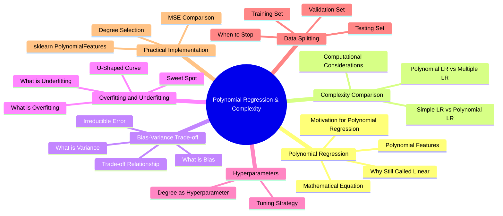
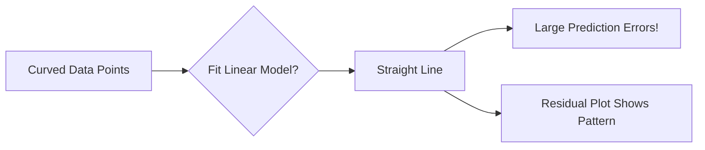
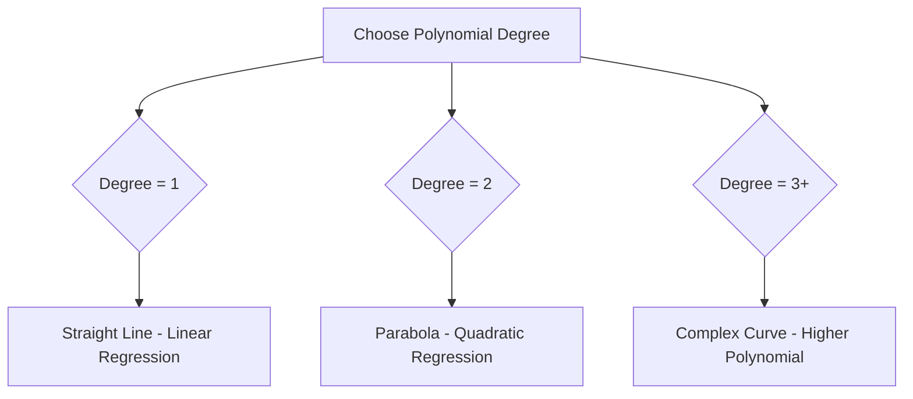
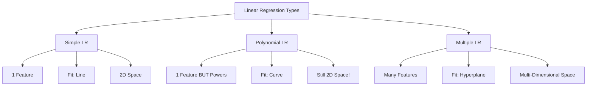

# AS25: Polynomial Regression and Model Complexity - Classroom Session (Part 1)

> 📚 **This is Part 1** covering: Introduction, Why Polynomial Regression, Mathematical Foundation, Why Still Linear
> 📘 **Next:** [Part 2](./AS25_PolynomialRegressionComplexity2.md)

---

## 🗺️ Mind Map - Topics to Cover



---

## 🎓 Classroom Conversation

### Topic 1: Introduction - When Linear Fails

**Teacher:** Ippudu mana Linear Regression cheekipoyinattu chuddam! Simple Linear Regression eppudu work avthundi? Answer: When there is a LINEAR relationship between X and Y!

**Beginner Student:** Sir, linear relationship ante exact ga enti? Every line is linear aa?

**Teacher:** Good question! Linear relationship means Y changes at a CONSTANT rate when X changes.

> 💡 **Jargon Alert - Linear Relationship**
> **Simple Explanation:** Like climbing stairs - each step takes you up the same height. Y increases by the same amount for every unit increase in X.
> **Example:** If every ₹100 spent on marketing gives ₹200 more sales, that's linear!

**Visual Comparison:**

```
LINEAR (Straight Line):          NON-LINEAR (Curve):
Y |        *                    Y |    *     *
  |      *                        |  *         *
  |    *                          |*             *
  |  *                            |               *
  |*                              +-----------------> X
  +---------> X
```

**Teacher:** Dekho, left side linear hai - straight line. Right side non-linear hai - curve ban rahi hai. Simple Linear Regression can ONLY fit the left pattern, not the right!

**Clever Student:** Sir, if data is curved, linear regression will still try to fit a line, right? What happens then?

**Teacher:** Exactly! It will fit a line, but that line won't capture the true relationship. Let me show you:



**Practical Student:** Sir, interview mein ye kaise puchenge?

**Teacher:** Interview question: "When does simple linear regression fail?"

**Answer:** "Simple linear regression fails when the relationship between X and Y is non-linear. In such cases, the model cannot capture the curvature in the data, leading to high bias and systematic errors visible in residual plots."

---

### Topic 2: Residual Plots - Detecting Non-Linearity

**Teacher:** Ek important question: Non-linear relationship hai ya nahi - kaise pata chalega?

**Beginner Student:** Sir, data plot kar ke dekh sakte hai?

**Teacher:** Correct! But there's a more systematic way - RESIDUAL PLOTS!

> 💡 **Jargon Alert - Residual Plot**
> **Simple Explanation:** After fitting a model, plot the errors (residuals = actual - predicted). If you see a pattern, your model is missing something!
> **Example:** Like checking if a student's mistakes in exam follow a pattern - if all science questions are wrong, there's a systematic problem!

**Good Residual Plot (Random Scatter):**
```
Error |    *  *     *    *
      |  *    *   *   *
      |    *    *   *    *
      +-------------------> X
      (No pattern = Model is good!)
```

**Bad Residual Plot (Shows Pattern):**
```
Error |         * * *
      |   * *         * *
      | *                 *
      +--------------------> X
      (U-shape pattern = Missing non-linearity!)
```

**Critique Student:** Sir, pattern dikhe toh linear regression galat hai, ye samajh aaya. But alternative kya hai?

**Teacher:** PERFECT question! That's where POLYNOMIAL REGRESSION comes in!

---

### Topic 3: Polynomial Regression - The Solution

**Teacher:** Ippudu Polynomial Regression samjho. Simple Linear Regression equation kya thi?

**All Students:** Y = β₀ + β₁X

**Teacher:** Correct! Now, Polynomial Regression mein X ke powers add karte hai:

$$Y = β_0 + β_1X + β_2X^2 + β_3X^3 + ... + β_dX^d$$

**Where:**
- d = Degree of polynomial
- β₀, β₁, β₂, ... = Coefficients (what model learns)
- X, X², X³, ... = Features (powers of X)

**Beginner Student:** Sir, X square, X cube - ye toh algebra mein padha tha. Yahan kaise help karega?

**Teacher:** Beautiful question! Let me explain with analogy:

> 💡 **Real-Life Analogy**
> Think of fitting a dress:
> - **Linear Regression:** Fitting a straight rod to your body - doesn't match curves!
> - **Polynomial Regression:** Fitting a flexible wire that can bend - matches your shape better!

**Visual Comparison:**

| Degree | Equation | Shape | When to Use |
|--------|----------|-------|-------------|
| 1 | Y = β₀ + β₁X | Straight line | Linear relationship |
| 2 | Y = β₀ + β₁X + β₂X² | Parabola (U-shape) | One bend |
| 3 | Y = β₀ + β₁X + β₂X² + β₃X³ | S-curve | Two bends |
| 4+ | Higher powers | Complex curves | Multiple bends |



**Clever Student:** Sir, degree kitna rakhna chahiye? Ye kaise decide karte hai?

**Teacher:** That's a HYPERPARAMETER! We'll discuss this in detail - but short answer: Start low (2 or 3), and increase only if needed. Too high = OVERFITTING!

---

### Topic 4: Why is Polynomial Regression Still "Linear"?

**Teacher:** Ek confusing point hai. Humne polynomial regression padhi, but isko POLYNOMIAL LINEAR REGRESSION bhi kehte hai. Kyon?

**Curious Student:** Sir, ye toh mujhe samajh nahi aaya. X² hai toh linear kaise?

**Teacher:** Excellent observation! The KEY insight is:

**The model is LINEAR in WEIGHTS (β), not in X!**

Let me explain:

```python
# Example: Polynomial of degree 3
Y = β₀ + β₁*X + β₂*X² + β₃*X³

# If X = 3:
X² = 9 (calculated beforehand)
X³ = 27 (calculated beforehand)

# Now prediction becomes:
Y = β₀ + β₁*(3) + β₂*(9) + β₃*(27)
#   = weighted SUM of known values!
```

**Teacher:** Dekho - X values pehle se calculate ho jaate hai. Then it's just a LINEAR COMBINATION of weights!

> 💡 **Jargon Alert - Linear in Weights**
> **Simple Explanation:** We're just adding up: weight₁ × known_value₁ + weight₂ × known_value₂ + ...
> **Why it matters:** This means we can still use OLS (Ordinary Least Squares) to find optimal weights!
> **Example:** Shopping bill: Price = 2×₹50 + 3×₹30 + 1×₹100 = LINEAR SUM of quantities × prices!

**Critique Student:** Sir, but curve toh ban rahi hai na? Non-linear visually dikh raha hai.

**Teacher:** Yes! The CURVE is non-linear because of X powers. But the OPTIMIZATION (finding best weights) is still convex and well-behaved. That's what makes polynomial regression computationally simple!

**Comparison Table:**

| Aspect | Non-Linear in... | Linear in... |
|--------|-----------------|--------------|
| Features | X, X², X³... | ❌ |
| Weights | ❌ | β₀, β₁, β₂... ✅ |
| Visual Output | Curve | - |
| Optimization | - | Convex (easy!) |
| Can use OLS? | - | YES! |

**Debate Student:** Sir, agar linear optimization hai toh gradient descent vs OLS - kaunsa use kare?

**Teacher:** Great question! Both work for polynomial regression:
- **OLS:** Direct formula, instant solution (good for small data)
- **Gradient Descent:** Iterative, scales to large data

Since polynomial regression is linear in weights, both converge to the same optimal solution!

---

### Topic 5: Numerical Example - Understanding the Calculation

**Teacher:** Let me show a concrete example to make this crystal clear:

**Given:**
- Polynomial equation: Y = 2 + 3X + 4X² + 5X³
- Input value: X = 3

**Calculation:**

```python
# Step 1: Calculate powers of X
X = 3
X² = 3² = 9
X³ = 3³ = 27

# Step 2: Plug into equation
Y = 2 + 3*(3) + 4*(9) + 5*(27)
Y = 2 + 9 + 36 + 135
Y = 182

# Step 3: Verify it's a linear sum
# Y = β₀ + β₁*feature₁ + β₂*feature₂ + β₃*feature₃
# Y = 2  + 3*3        + 4*9         + 5*27
#     ↑      ↑            ↑             ↑
#   bias  weight×X    weight×X²     weight×X³
```

**Teacher:** Dekho - once X powers are calculated, it's just weighted addition. MODEL LEARNS ONLY β values, NOT X powers!

**Beginner Student:** Sir, X power kaise pata chalega? 2 ya 3 ya 4?

**Teacher:** That's the DEGREE of polynomial - a HYPERPARAMETER that YOU choose. Algorithm doesn't learn it!

---

### Topic 6: Complexity Comparison - Polynomial vs Multiple Linear Regression

**Teacher:** Ab ek important comparison karte hai. Polynomial Regression vs Multiple Linear Regression - dono same hai kya?

**Clever Student:** Sir, dono mein multiple β values hai - toh same lag raha hai.

**Teacher:** Bahut acha observation! But there's a BIG difference:

| Aspect | Simple LR | Polynomial LR | Multiple LR |
|--------|-----------|---------------|-------------|
| **Input Features** | 1 feature (X) | 1 feature (X) | Multiple features (X₁, X₂, X₃...) |
| **What's added** | Nothing | Powers of X | Different variables |
| **Dimensions** | 2D (X, Y) | 2D (X, Y) | Multi-D (X₁, X₂... Y) |
| **Fitting** | Line | Curve | Hyperplane |
| **Example** | Price vs Area | Price vs Area (curved) | Price vs Area, Rooms, Location |



**Practical Student:** Sir, complexity mein kaun zyada hai?

**Teacher:** Excellent question for interviews!

**Answer:**
1. **Simple LR** - Least complex (1 feature, 2 weights)
2. **Polynomial LR** - Medium (1 feature, multiple weights for powers)
3. **Multiple LR** - Most complex (multiple features, dealing with multicollinearity)

**Why Polynomial LR is simpler than Multiple LR:**
- Still working in 2D space
- Only ONE input variable (just transformed)
- No risk of multicollinearity between DIFFERENT features
- (Though X, X², X³ are correlated - but that's different!)

---

### Topic 7: What Does the Model Learn?

**Teacher:** Ek fundamental question: Training ke time model kya learn karta hai?

**Beginner Student:** Sir, model data yaad karta hai?

**Teacher:** No! Model WEIGHTS (coefficients) learn karta hai. Let me explain:

**What model LEARNS:**
- β₀ (bias/intercept)
- β₁, β₂, β₃... (weights for each feature)

**What model does NOT learn:**
- X values (given as input)
- X², X³... (calculated from X)
- Degree of polynomial (hyperparameter)

```python
# Training Process
# Given: X = [1, 2, 3, 4, 5], Y = [2, 8, 18, 32, 50]

# Step 1: Pre-compute features (NOT learned!)
X² = [1, 4, 9, 16, 25]

# Step 2: Model learns optimal β values
# Y = β₀ + β₁X + β₂X²

# After training:
β₀ = 0 (learned)
β₁ = 0 (learned) 
β₂ = 2 (learned)  # This is what OLS computes!

# Result: Y = 2X² (perfect quadratic!)
```

**Curious Student:** Sir, training time kaise affect hota hai polynomial degree se?

**Teacher:** Great question!

| Degree | Parameters to Learn | Training Time | Risk |
|--------|---------------------|---------------|------|
| 1 | 2 (β₀, β₁) | Fast | Underfitting |
| 2 | 3 (β₀, β₁, β₂) | Fast | Usually good |
| 3 | 4 (β₀, β₁, β₂, β₃) | Medium | Good balance |
| 10 | 11 parameters | Slower | OVERFITTING! |

**Teacher:** More degree = More parameters = More learning time. But the REAL problem is not time - it's OVERFITTING!

---

### Topic 8: Interview Perspective - Part 1 Summary

**Teacher:** Let me give you interview-ready answers for Part 1:

**Q1: What is polynomial regression?**
> "Polynomial regression extends linear regression by including powers of the input feature (X², X³, etc.). It captures non-linear relationships while remaining computationally simple because it's linear in weights."

**Q2: Why is polynomial regression called 'polynomial LINEAR regression'?**
> "Because the model is linear in terms of the weights (coefficients). The non-linearity exists only in the features (powers of X), which are pre-computed. This allows us to use OLS for optimization."

**Q3: When should you use polynomial regression over simple linear regression?**
> "When the residual plot shows a systematic pattern (like a U-shape), indicating that a linear model cannot capture the true relationship. The data exhibits curvature that a straight line cannot fit."

**Q4: How is polynomial regression different from multiple linear regression?**
> "Polynomial regression uses powers of a SINGLE input variable (X, X², X³). Multiple linear regression uses MULTIPLE different input variables (X₁, X₂, X₃). Polynomial stays in 2D; multiple LR works in higher dimensions."

---

## 📝 Teacher Summary - Part 1

**Teacher:** Okay students, let's summarize Part 1:

### Key Takeaways

1. **Simple Linear Regression fails** when relationship is non-linear (curved)
2. **Polynomial Regression** adds powers of X: Y = β₀ + β₁X + β₂X² + ...
3. **Still "Linear"** because model is linear in WEIGHTS (not features)
4. **OLS still works** because optimization is convex
5. **Model learns** only the β values, NOT X powers or degree
6. **Less complex** than Multiple Linear Regression (still 2D)

### Quick Reference

| Concept | Key Point |
|---------|-----------|
| Polynomial Equation | Y = β₀ + β₁X + β₂X² + ... + βdXᵈ |
| Why still linear? | Linear in weights (coefficients) |
| What model learns | β₀, β₁, β₂... (weights only) |
| Hyperparameter | Degree (d) - chosen by YOU |
| 2D or Multi-D? | Still 2D (one input variable) |

---

> 📘 **Continue to Part 2:** [AS25_PolynomialRegressionComplexity2.md](./AS25_PolynomialRegressionComplexity2.md) for Bias-Variance Trade-off, Overfitting, Underfitting, and Hyperparameter Tuning.
