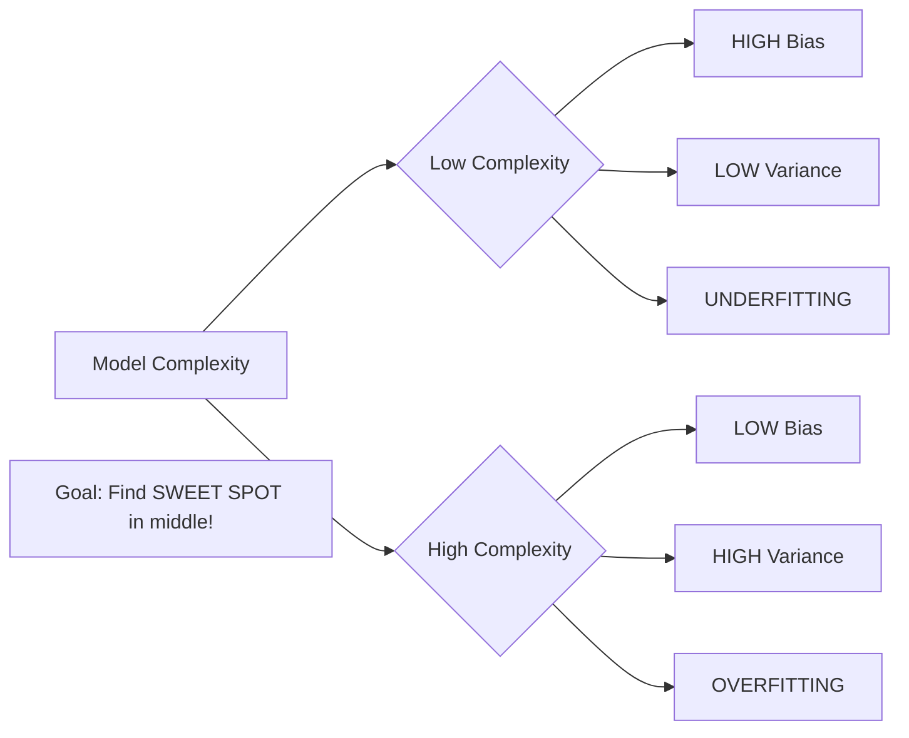

# AS25: Polynomial Regression and Model Complexity - Classroom Session (Part 2)

> 📚 **This is Part 2** covering: Bias-Variance Trade-off, Overfitting, Underfitting, Irreducible Error, Hyperparameters
> 📘 **Previous:** [Part 1](./AS25_PolynomialRegressionComplexity1.md)
> 📘 **Next:** [Part 3](./AS25_PolynomialRegressionComplexity3.md)

---

## 🎓 Classroom Conversation (Continued)

### Topic 9: Introduction to Bias and Variance

**Teacher:** Ippudu chala important concept chuddam - BIAS and VARIANCE. Ye polynomial regression ka heart hai!

**Beginner Student:** Sir, bias aur variance - ye kya hai simple mein?

**Teacher:** Let me explain with a beautiful analogy:

> 💡 **Analogy - Dart Game**
> Imagine throwing darts at a target:
> - **HIGH BIAS:** All darts land in the SAME wrong place (consistent but wrong!) - Like a broken dart that always goes left
> - **HIGH VARIANCE:** Darts land EVERYWHERE scattered (inconsistent!) - Like a shaky hand that can't aim steadily
> - **IDEAL:** All darts land on the CENTER (low bias + low variance!)

```
HIGH BIAS:              HIGH VARIANCE:           IDEAL:
    ○                       ○     ○                 ○
  *****                   *   ○     *             ○***○
  *****  ← Target            ○   ○                *****
                           *   *                    ○
(All left!)            (Scattered!)            (On target!)
```

**Clever Student:** Sir, machine learning mein ye kaise apply hota hai?

**Teacher:** Perfect question! Let me define precisely:

---

### Topic 10: Bias - The Systematic Error

**Teacher:** BIAS is the error from oversimplified assumptions in the model.

> 💡 **Jargon Alert - Bias (in ML)**
> **Simple Explanation:** When your model is too simple to capture the true pattern. It consistently makes the SAME type of mistake.
> **Formula:** Bias = E[Ŷ] - Y_true (how far is average prediction from truth)
> **Example:** Using a straight line to fit curved data - every prediction will be wrong in a systematic way!

**High Bias Model Characteristics:**
- Too simple
- UNDERFITS the data
- High training error
- High testing error
- Doesn't learn patterns properly

**Visual:**
```
Data:  * * * * * * (curved pattern)
             __*__
         __*     *__
     __*             *__
  __*                   *__
  
Model: ____________ (straight line)
       
Bias = Distance from line to curve!
```

**Beginner Student:** Sir, simple example do please.

**Teacher:** 

**Example:**
- True relationship: Y = X² (parabola)
- You fit: Y = β₀ + β₁X (straight line)
- Result: Your line can NEVER capture the curve
- Every prediction has systematic error = HIGH BIAS!

---

### Topic 11: Variance - The Sensitivity Error

**Teacher:** VARIANCE is the error from model being too sensitive to training data.

> 💡 **Jargon Alert - Variance (in ML)**
> **Simple Explanation:** When your model MEMORIZES training data instead of learning general patterns. Works great on training, fails on new data!
> **Formula:** Variance = E[(Ŷ - E[Ŷ])²] (how much predictions vary)
> **Example:** A degree-20 polynomial that passes through every training point but goes crazy between them!

**High Variance Model Characteristics:**
- Too complex
- OVERFITS the data
- Very low training error (near zero!)
- Very high testing error
- Memorizes instead of learns

**Visual:**
```
Training Data: *   *   *   *   *   *
                
High Variance Model:
          /\    /\    /\    /\
        /    \/    \/    \/    \
      /                          \
    /                              \
--- snakes through every point but wild in between!

New Test Point: o
Model goes crazy at o!
```

**Critique Student:** Sir, training error zero hai toh model best nahi hai kya? Error kam chahiye na?

**Teacher:** EXCELLENT trap question! This is where beginners go wrong.

**Training error = 0 is a RED FLAG, not a green signal!**

It means:
1. Model has MEMORIZED training data
2. Model hasn't LEARNED underlying pattern
3. Model will FAIL on new, unseen data
4. This is called OVERFITTING!

---

### Topic 12: The Bias-Variance Trade-off

**Teacher:** Ab sabse important concept - TRADE-OFF!

**The Dilemma:**
- Reduce bias → Increase model complexity → Variance increases!
- Reduce variance → Decrease model complexity → Bias increases!

**You CAN'T minimize both simultaneously!**



**Debate Student:** Sir, toh solution kya hai? Dono kam kaise kare?

**Teacher:** You find the SWEET SPOT - the optimal complexity that balances both!

**The U-Shaped Curve:**

```
Error |
      |   \                    /
      |    \                  /  ← Variance Error
      |     \                /
      |      \    ____      /
      |       \  /    \    /  ← Total Error (U-shape)
      |        \/      \  /
      |         ↑       \/
      |    Sweet Spot! 
      |________________/___  ← Bias Error
      +-------------------------> Model Complexity
           Low          High
```

**Key Insight:**
- Total Error = Bias² + Variance + Irreducible Error
- Sweet spot is at the BOTTOM of the U-curve
- Not too simple, not too complex!

**Practical Student:** Sir, interview mein ye curve bahut important hai?

**Teacher:** 100%! This U-curve is asked in almost EVERY ML interview. Memorize it!

---

### Topic 13: Irreducible Error - What We Can't Control

**Teacher:** Ab third type of error samjho - IRREDUCIBLE ERROR.

> 💡 **Jargon Alert - Irreducible Error**
> **Simple Explanation:** Error that exists in the data itself due to noise or randomness. NO model can fix it!
> **Source:** Measurement errors, missing variables, inherent randomness
> **Example:** Human height depends on genetics, nutrition, etc. Even with all data, some variation is unexplainable!

**Total Error Equation:**

$$\text{Total Error} = \text{Bias}^2 + \text{Variance} + \text{Irreducible Error}$$

**Comparison:**

| Error Type | Can We Control? | How to Reduce? |
|------------|----------------|----------------|
| **Bias** | Yes ✅ | Increase model complexity |
| **Variance** | Yes ✅ | Decrease model complexity, get more data |
| **Irreducible** | No ❌ | Cannot - it's in the nature of data |

**Curious Student:** Sir, irreducible error zero ho sakta hai?

**Teacher:** In real world? Almost NEVER. There's always some randomness in data. That's why RMSE and MAPE will never be exactly zero, even with perfect models!

---

### Topic 14: Overfitting - The Detailed Explanation

**Teacher:** Ab overfitting ko detail mein samjhte hai.

> 💡 **Jargon Alert - Overfitting**
> **Simple Explanation:** Model ne training data YAAD kar liya instead of PATTERN seekhna! Like a student who memorizes answers without understanding.
> **Symptom:** Very low training error, very high testing error
> **Cause:** Model too complex for the amount of data

**When Does Overfitting Happen?**

1. **Polynomial degree too high:**
   - Degree 10 with only 20 data points = OVERFITTING!
   
2. **Too few data points:**
   - High complexity model + small dataset = DANGER!
   
3. **Rule of Thumb:**
   - If Degree ≈ n-1 (where n = number of points), you can fit EVERY point!
   - Zero training error = OVERFITTING!

**Teacher's Example from Lecture:**

```python
# 6 data points
# Degree 5 polynomial

# Result: ZERO training error!
# Why? Degree (5) = n-1 (6-1)
# Model passes through ALL points!

# BUT: Predictions on new points will be TERRIBLE!
```

**Practical Student:** Sir, overfitting detect kaise kare?

**Teacher:** Three ways:

| Method | How it Works |
|--------|--------------|
| **Compare Train vs Test Error** | Large gap = Overfitting |
| **Validation Set** | If validation error increases = Stop! |
| **Cross-Validation** | Average across multiple splits |

---

### Topic 15: Underfitting - The Opposite Problem

**Teacher:** Ab underfitting samjho - ye opposite problem hai.

> 💡 **Jargon Alert - Underfitting**
> **Simple Explanation:** Model bahut simple hai - pattern hi nahi pakad pa raha! Like fitting a straight line through clearly curved data.
> **Symptom:** High training error AND high testing error
> **Cause:** Model too simple for the data complexity

**When Does Underfitting Happen?**

1. **Polynomial degree too low:**
   - Degree 1 (linear) for curved data = UNDERFITTING!
   
2. **Insufficient features:**
   - Using only X when X² pattern exists
   
3. **Not enough training:**
   - Model didn't converge

**Visual Comparison:**

```
UNDERFITTING:               GOOD FIT:                 OVERFITTING:
Data: • • • •              Data: • • • •              Data: • • • •
        ̄                        ~~~~~                     /\/\/\
      /                        /     \                  /      \
    /                        /         \              /        \
  / (straight line)        (smooth curve)           (wiggly mess)
  
Train Error: HIGH          Train Error: MEDIUM        Train Error: NEAR ZERO
Test Error: HIGH           Test Error: MEDIUM         Test Error: VERY HIGH
Bias: HIGH                 Bias: BALANCED             Bias: LOW
Variance: LOW              Variance: BALANCED         Variance: HIGH
```

---

### Topic 16: Hyperparameters - The Degree Choice

**Teacher:** Ab HYPERPARAMETER samjho. Polynomial regression mein main hyperparameter hai DEGREE.

> 💡 **Jargon Alert - Hyperparameter**
> **Simple Explanation:** Settings YOU choose BEFORE training. Model doesn't learn these - YOU set them!
> **Examples:** Polynomial degree, learning rate, number of layers
> **Difference:** Parameters (β₀, β₁...) are LEARNED; Hyperparameters are CHOSEN

**Comparison:**

| Type | Who Sets? | When Set? | Example |
|------|-----------|-----------|---------|
| **Parameters** | Model (learning) | During training | β₀, β₁, β₂... |
| **Hyperparameters** | You (engineer) | Before training | Degree, learning rate |

**Practical Student:** Sir, hyperparameter galat set kiya toh kya hoga?

**Teacher:** 

| Degree Too Low | Degree Just Right | Degree Too High |
|----------------|-------------------|-----------------|
| Underfitting | Good balance | Overfitting |
| High bias | Low total error | High variance |
| Can't capture curve | Captures pattern | Captures noise |
| Increase degree! | Keep it! | Decrease degree! |

**Clever Student:** Sir, optimal degree kaise find kare?

**Teacher:** Multiple methods:

1. **Visual inspection:** Plot MSE vs Degree, find elbow
2. **Validation set:** Pick degree with lowest validation error
3. **Cross-validation:** More robust, average across folds
4. **Grid search:** Try multiple degrees systematically

---

### Topic 17: The Runge Phenomenon

**Teacher:** Ek advanced concept - RUNGE PHENOMENON. High degree polynomials ka ek known problem hai.

> 💡 **Jargon Alert - Runge Phenomenon**
> **Simple Explanation:** High-degree polynomials oscillate wildly near the edges of the data! They become very unstable at boundaries.
> **Discovered by:** Carl Runge (mathematician)
> **Implication:** Even with perfect training fit, predictions at edges can be CRAZY!

**Visual:**
```
Data points:  •        •        •        •        •
              
High degree polynomial:
              /\                              /\
             /  \                            /  \
     ______ /    \                          /    \ ______
                  \          ____          /
                   \        /    \        /
                    \______/      \______/
                    
    ↑ Wild oscillation at edges! ↑
```

**Critique Student:** Sir, solution kya hai?

**Teacher:** 

1. **Use lower degree polynomials** (degree 2-5 usually enough)
2. **Spline regression** (piecewise polynomials - more advanced)
3. **Regularization** (L1/L2 - we'll cover later)
4. **More data points** (especially at edges)

---

### Topic 18: Collinearity in Polynomial Features

**Teacher:** Ek aur problem hai - COLLINEARITY in polynomial features.

**Clever Student:** Sir, multicollinearity Multiple Linear Regression mein thi na? Yahan kaise?

**Teacher:** Great connection! In polynomial regression, X, X², X³ are NATURALLY CORRELATED!

**Example:**
```python
X = [1, 2, 3, 4, 5]
X² = [1, 4, 9, 16, 25]
X³ = [1, 8, 27, 64, 125]

# Correlation between X and X² is HIGH!
# Correlation between X² and X³ is HIGH!
```

**Why this matters:**
- Matrix operations become unstable
- Coefficient estimates may be unreliable
- Model interpretation becomes difficult

**However:** For prediction purposes, polynomial regression usually still works fine. The collinearity is "structured" (from same variable), not "random" (from different sources).

---

### Topic 19: Interview Preparation - Part 2 Summary

**Teacher:** Interview ke liye Part 2 ke important answers:

**Q1: What is the bias-variance trade-off?**
> "It's the fundamental dilemma in ML: simpler models have high bias but low variance (underfitting), while complex models have low bias but high variance (overfitting). The goal is to find the optimal complexity that minimizes total error."

**Q2: What is overfitting and how do you detect it?**
> "Overfitting occurs when a model memorizes training data instead of learning patterns. Symptoms: very low training error but high testing error. Detection: compare train vs validation performance, use cross-validation."

**Q3: What is underfitting?**
> "Underfitting occurs when a model is too simple to capture the underlying pattern. Both training and testing errors are high. Solution: increase model complexity."

**Q4: What is irreducible error?**
> "Error inherent in the data due to noise, randomness, or unmeasured factors. No model can reduce this - it's a fundamental limit on prediction accuracy."

**Q5: What is the degree in polynomial regression?**
> "The degree is a hyperparameter that controls model complexity. It's the highest power of X in the equation. Higher degree = more flexibility but higher overfitting risk."

**Q6: What is Runge phenomenon?**
> "High-degree polynomials tend to oscillate wildly near the boundaries of the data range, causing unstable predictions at edges even if the fit looks good in the middle."

---

## 📝 Teacher Summary - Part 2

**Teacher:** Let's summarize Part 2:

### Key Takeaways

1. **Bias:** Systematic error from oversimplified models (HIGH = underfitting)
2. **Variance:** Error from oversensitivity to training data (HIGH = overfitting)
3. **Trade-off:** Can't minimize both simultaneously - find sweet spot!
4. **Total Error = Bias² + Variance + Irreducible Error**
5. **Overfitting:** Training error ≈ 0, Testing error HIGH
6. **Underfitting:** Both errors HIGH
7. **Degree is a HYPERPARAMETER** - you choose, model doesn't learn
8. **Runge phenomenon:** High degrees oscillate at edges

### The Critical U-Curve

```
Total Error
    |
    |\                    /|
    | \                  / |
    |  \    ________    /  |
    |   \  /        \  /   |
    |    \/          \/    |
    |     ↑ Sweet Spot     |
    +-------------------------> Model Complexity
      Under    Optimal   Over
```

---

> 📘 **Continue to Part 3:** [AS25_PolynomialRegressionComplexity3.md](./AS25_PolynomialRegressionComplexity3.md) for Data Splitting, Validation Strategy, and Complete Python Implementation.
