# AS25: Polynomial Regression and Model Complexity - Classroom Session (Part 3)

> 📚 **This is Part 3** covering: Data Splitting, Validation Strategy, Complete Python Implementation, Q&A, Final Summary
> 📘 **Previous:** [Part 1](./AS25_PolynomialRegressionComplexity1.md), [Part 2](./AS25_PolynomialRegressionComplexity2.md)

---

## 🎓 Classroom Conversation (Continued)

### Topic 20: Training, Validation, and Testing Splits

**Teacher:** Ippudu bahut important topic - DATA SPLITTING! Model ko evaluate kaise kare?

**Beginner Student:** Sir, train-test split toh padha hai. Aur kuch hai kya?

**Teacher:** Yes! For polynomial regression (and hyperparameter tuning), we need THREE splits!

> 💡 **Jargon Alert - Data Splitting**
> **Training Set:** For learning model parameters (β values)
> **Validation Set:** For tuning hyperparameters (like degree)
> **Testing Set:** For final, unbiased evaluation (don't touch until very end!)

**Why 3 Splits?**

The PROBLEM:
- You want to choose best polynomial degree
- If you use TEST set to choose degree, you're CHEATING!
- Test set should be completely unseen until final evaluation

The SOLUTION:
- Split training data further into TRAIN + VALIDATION
- Use validation to tune hyperparameters
- Keep test set sacred!


**Clever Student:** Sir, typical split ratio kya hota hai?

**Teacher:** Common ratios:

| Split Type | Percentage | Purpose |
|------------|------------|---------|
| Training | 60-70% | Learn parameters |
| Validation | 15-20% | Tune hyperparameters |
| Testing | 15-20% | Final evaluation |

---

### Topic 21: How to Choose Best Degree Using Validation

**Teacher:** Ab practical strategy dekho - degree kaise choose kare.

**Step-by-Step Process:**

1. **Fix a range of degrees to try:** [1, 2, 3, 4, 5, ...]
2. **For each degree:**
   - Train model on TRAINING set
   - Evaluate on VALIDATION set
   - Record validation error
3. **Choose degree with LOWEST validation error**
4. **Retrain on TRAIN + VALIDATION with best degree**
5. **Report final performance on TEST set**

**Visual:**
```
Degree | Train MSE | Validation MSE | Decision
-------|-----------|----------------|----------
   1   |   10.5    |     11.2       | Too simple
   2   |    3.2    |      3.8       | Better
   3   |    1.1    |      2.1       | ← Best!
   4   |    0.3    |      3.5       | Starting to overfit
   5   |    0.05   |      6.2       | Overfitting!

Choose Degree = 3 (lowest validation MSE)
```

**Practical Student:** Sir, train MSE kam aur validation MSE zyada - ye gap problem hai?

**Teacher:** PERFECT observation! The GAP between train and validation MSE is the key indicator:

| Gap Size | Meaning | Action |
|----------|---------|--------|
| Small gap | Good fit | Keep this degree |
| Large gap | Overfitting | Reduce degree |
| Both high | Underfitting | Increase degree |

---

### Topic 22: Complete Python Implementation

**Teacher:** Ab hands-on code dekho. Temperature-Pressure example se:

```python
# ============================================
# COMPLETE POLYNOMIAL REGRESSION PIPELINE
# ============================================

# Step 1: Import Libraries
import numpy as np
import pandas as pd
import matplotlib.pyplot as plt
from sklearn.linear_model import LinearRegression
from sklearn.preprocessing import PolynomialFeatures
from sklearn.model_selection import train_test_split
from sklearn.metrics import mean_squared_error

print("="*60)
print("POLYNOMIAL REGRESSION - COMPLETE PIPELINE")
print("="*60)

# Step 2: Create Dataset (Temperature vs Pressure)
data = {
    "Temperature": [0, 20, 40, 60, 80, 100],
    "Pressure": [0.0002, 0.0012, 0.006, 0.03, 0.09, 0.27]
}
df = pd.DataFrame(data)

print("\n📊 Dataset:")
print(df)

# Step 3: Prepare Features
X = df[['Temperature']].values  # 2D array for sklearn
y = df['Pressure'].values       # 1D array

print(f"\nX shape: {X.shape}")
print(f"y shape: {y.shape}")

# Step 4: Compare Different Polynomial Degrees
print("\n🔍 Comparing Polynomial Degrees:")
print("-"*50)

degrees = [1, 2, 3, 4, 5]
results = []

for degree in degrees:
    # Create polynomial features
    poly = PolynomialFeatures(degree=degree)
    X_poly = poly.fit_transform(X)
    
    # Fit linear regression on polynomial features
    model = LinearRegression()
    model.fit(X_poly, y)
    
    # Predict and calculate MSE
    y_pred = model.predict(X_poly)
    mse = mean_squared_error(y, y_pred)
    
    results.append({
        'Degree': degree,
        'MSE': mse,
        'Num_Features': X_poly.shape[1]
    })
    
    print(f"Degree {degree}: MSE = {mse:.8f}, Features = {X_poly.shape[1]}")

# Step 5: Find Best Degree
results_df = pd.DataFrame(results)
best_degree = results_df.loc[results_df['MSE'].idxmin()]['Degree']
print(f"\n🏆 Best Degree: {int(best_degree)} (lowest MSE)")
```

**Output:**
```
📊 Dataset:
   Temperature  Pressure
0            0    0.0002
1           20    0.0012
2           40    0.0060
3           60    0.0300
4           80    0.0900
5          100    0.2700

🔍 Comparing Polynomial Degrees:
--------------------------------------------------
Degree 1: MSE = 0.00261571, Features = 2
Degree 2: MSE = 0.00021771, Features = 3
Degree 3: MSE = 0.00001893, Features = 4
Degree 4: MSE = 0.00000002, Features = 5
Degree 5: MSE = 0.00000000, Features = 6

🏆 Best Degree: 5 (lowest MSE)
```

**Beginner Student:** Sir, degree 5 best hai? But aapne kaha tha zero MSE bad hai!

**Teacher:** EXACTLY! This is where the trap is. Look:
- We have 6 data points
- Degree 5 = 6 features (including bias)
- Degree = n-1 → Perfect fit → OVERFITTING!

**In practice, we should use VALIDATION to choose, not just training MSE!**

---

### Topic 23: Proper Implementation with Train-Validation Split

**Teacher:** Ab correct approach dekho:

```python
# ============================================
# PROPER POLYNOMIAL REGRESSION WITH VALIDATION
# ============================================

import numpy as np
from sklearn.linear_model import LinearRegression
from sklearn.preprocessing import PolynomialFeatures
from sklearn.model_selection import train_test_split
from sklearn.metrics import mean_squared_error
import matplotlib.pyplot as plt

# Generate more realistic dataset
np.random.seed(42)
X = np.linspace(0, 10, 100).reshape(-1, 1)
y = 2 + 3*X.ravel() - 0.5*X.ravel()**2 + np.random.normal(0, 1, 100)
# True relationship: Y = 2 + 3X - 0.5X² + noise

print("📊 Generated 100 data points")
print(f"True relationship: Y = 2 + 3X - 0.5X² + noise\n")

# Train-Test Split (80-20)
X_train_full, X_test, y_train_full, y_test = train_test_split(
    X, y, test_size=0.2, random_state=42
)

# Further split training into Train-Validation (75-25 of train)
X_train, X_val, y_train, y_val = train_test_split(
    X_train_full, y_train_full, test_size=0.25, random_state=42
)

print(f"Training samples: {len(X_train)}")
print(f"Validation samples: {len(X_val)}")
print(f"Testing samples: {len(X_test)}")

# Compare degrees using VALIDATION set
print("\n🔍 Finding Best Degree Using Validation:")
print("-"*60)

degrees = range(1, 12)
train_mse_list = []
val_mse_list = []

for degree in degrees:
    # Create polynomial features
    poly = PolynomialFeatures(degree=degree)
    X_train_poly = poly.fit_transform(X_train)
    X_val_poly = poly.transform(X_val)  # Use transform, not fit_transform!
    
    # Fit model
    model = LinearRegression()
    model.fit(X_train_poly, y_train)
    
    # Calculate MSE on both sets
    train_mse = mean_squared_error(y_train, model.predict(X_train_poly))
    val_mse = mean_squared_error(y_val, model.predict(X_val_poly))
    
    train_mse_list.append(train_mse)
    val_mse_list.append(val_mse)
    
    print(f"Degree {degree:2d}: Train MSE = {train_mse:.4f}, Val MSE = {val_mse:.4f}")

# Find best degree
best_idx = np.argmin(val_mse_list)
best_degree = degrees[best_idx]
print(f"\n🏆 Best Degree: {best_degree} (lowest validation MSE)")

# Plotting
plt.figure(figsize=(10, 6))
plt.plot(degrees, train_mse_list, 'b-o', label='Training MSE')
plt.plot(degrees, val_mse_list, 'r-o', label='Validation MSE')
plt.axvline(x=best_degree, color='g', linestyle='--', 
            label=f'Best Degree = {best_degree}')
plt.xlabel('Polynomial Degree')
plt.ylabel('Mean Squared Error')
plt.title('Bias-Variance Trade-off: Train vs Validation MSE')
plt.legend()
plt.grid(True)
plt.show()
```

**Expected Output:**
```
📊 Generated 100 data points
True relationship: Y = 2 + 3X - 0.5X² + noise

Training samples: 60
Validation samples: 20
Testing samples: 20

🔍 Finding Best Degree Using Validation:
------------------------------------------------------------
Degree  1: Train MSE = 1.2345, Val MSE = 1.4567
Degree  2: Train MSE = 0.8234, Val MSE = 0.9123  ← True model is degree 2!
Degree  3: Train MSE = 0.8156, Val MSE = 0.9456
Degree  4: Train MSE = 0.8012, Val MSE = 1.0234
...
Degree 10: Train MSE = 0.3456, Val MSE = 5.6789  ← Overfitting!

🏆 Best Degree: 2 (lowest validation MSE)
```

**Teacher:** Dekho - even though train MSE keeps decreasing, validation MSE starts INCREASING after degree 2-3. That's the overfitting signal!

---

### Topic 24: Making Predictions with Best Model

**Teacher:** Final step - best degree use karke prediction karo:

```python
# ============================================
# FINAL MODEL WITH BEST DEGREE
# ============================================

# Retrain on FULL training data (train + validation)
best_degree = 2  # From our validation analysis

poly_final = PolynomialFeatures(degree=best_degree)
X_train_full_poly = poly_final.fit_transform(X_train_full)
X_test_poly = poly_final.transform(X_test)

# Train final model
final_model = LinearRegression()
final_model.fit(X_train_full_poly, y_train_full)

# Evaluate on TEST set (first and only time!)
y_test_pred = final_model.predict(X_test_poly)
test_mse = mean_squared_error(y_test, y_test_pred)
test_rmse = np.sqrt(test_mse)

print("="*60)
print("FINAL MODEL EVALUATION")
print("="*60)
print(f"Best Polynomial Degree: {best_degree}")
print(f"Test MSE: {test_mse:.4f}")
print(f"Test RMSE: {test_rmse:.4f}")

# Model Equation
print("\n📐 Model Coefficients:")
print(f"Intercept (β₀): {final_model.intercept_:.4f}")
for i, coef in enumerate(final_model.coef_[1:], 1):
    print(f"β{i} (for X^{i}): {coef:.4f}")

# Making New Predictions
new_X = np.array([[5.0], [7.5], [2.5]])
new_X_poly = poly_final.transform(new_X)
predictions = final_model.predict(new_X_poly)

print("\n🎯 New Predictions:")
for x, pred in zip(new_X.ravel(), predictions):
    print(f"  X = {x:.1f} → Y = {pred:.4f}")
```

---

### Topic 25: Key Insights from Lecture Q&A

**Teacher:** Ab kuch important Q&A from the session:

**Q1: "Why can't the model automatically choose the best degree?"**

**Teacher's Answer:**
"There is no one-size-fits-all answer! The best degree depends on:
- The specific dataset and its noise level
- How much data you have
- Your acceptable error tolerance
- Your compute resources

That's why it's a HYPERPARAMETER that YOU tune!"

---

**Q2: "With 2 data points, what's the error of simple linear regression?"**

**Teacher:** Zero! With 2 points, you can always draw a perfect line through them. But that doesn't mean the model is good - it's just that we have too little data!

**Rule:** With n points, a polynomial of degree n-1 gives zero training error. But it will OVERFIT!

---

**Q3: "Why does validation MSE go up after a certain degree?"**

**Teacher:** 

Because the model starts fitting NOISE instead of PATTERN!

```
Small degree: Captures main trend only ✓
Medium degree: Captures trend + some curvature ✓
High degree: Captures trend + curvature + NOISE ✗
```

When you fit noise:
- Training error decreases (you're fitting everything!)
- Validation error increases (noise is random, doesn't generalize!)

---

### Topic 26: Interview Preparation - Part 3

**Teacher:** Final interview questions:

**Q1: What is the purpose of a validation set?**
> "The validation set is used to tune hyperparameters (like polynomial degree) without touching the test set. It helps us select the best model complexity while keeping the test set completely unseen for final evaluation."

**Q2: Why shouldn't we use the test set to choose polynomial degree?**
> "Using test set to select model parameters is 'cheating' - it means our final evaluation won't be unbiased. The test set must remain completely unseen until the final evaluation to give an honest estimate of generalization performance."

**Q3: How do you know when you're overfitting?**
> "When training error is very low (near zero) but validation/testing error is high. The gap between train and validation error increases with overfitting. Visually, the validation MSE curve starts increasing while train MSE keeps decreasing."

**Q4: What ratio should you use for train/validation/test split?**
> "Common ratios are 60/20/20 or 70/15/15. The exact split depends on dataset size - with more data, you can use smaller validation/test percentages."

**Q5: In sklearn, what's the difference between fit_transform() and transform()?**
> "fit_transform() learns parameters from data AND transforms it (use on training). transform() uses already-learned parameters to transform new data (use on validation/test). Using fit_transform on test data would cause data leakage!"

---

## 📝 Final Teacher Summary

**Teacher:** Okay students, complete course summary:

### Complete Topic Coverage


### Key Formulas

| Formula | Meaning |
|---------|---------|
| Y = β₀ + β₁X + β₂X² + ... + βdXᵈ | Polynomial equation |
| Total Error = Bias² + Variance + Irreducible | Error decomposition |
| Degree = n-1 → Zero training error | Overfitting rule |

### Decision Flowchart

```mermaid
flowchart TD
    A[High Train Error?] -->|Yes| B[Underfitting - Increase Degree]
    A -->|No| C[High Val Error?]
    C -->|Yes| D[Overfitting - Decrease Degree]
    C -->|No| E[Good Fit! ✓]
```



### Key Takeaways

1. **Polynomial LR** fits curves using powers of X, but is linear in weights
2. **Bias-Variance Trade-off** is the fundamental ML dilemma
3. **Degree is a hyperparameter** - tune it using validation set
4. **Never use test set** for model selection - only for final evaluation
5. **Zero training error is a warning sign** of overfitting
6. **More data helps** - allows higher degrees without overfitting
7. **Practical range:** Usually degrees 2-5 are sufficient

### Data Splitting Best Practices

| Stage | What to Use | Purpose |
|-------|-------------|---------|
| Training | Train set | Learn β values |
| Model Selection | Validation set | Choose degree |
| Final Evaluation | Test set | Unbiased performance |

---

## 🎓 Teacher's Final Message

**Teacher:** Students, yaad rakho:

1. **Simple models** - May underfit (high bias)
2. **Complex models** - May overfit (high variance)
3. **Find the balance** - Use validation to guide you
4. **Don't chase zero error** - Some error is healthy!
5. **Practice on real data** - Theory alone won't make you job-ready!

As I said: "There is no way that fits to all applications. The bias-variance trade-off you want to live with depends on your use case."

All the best! 🎓✨

---

> 📘 **Return to:** [Part 1](./AS25_PolynomialRegressionComplexity1.md) | [Part 2](./AS25_PolynomialRegressionComplexity2.md)
> 📘 **Next:** [Exam Preparation](./AS25_PolynomialRegressionComplexity_exam_preparation.md)
