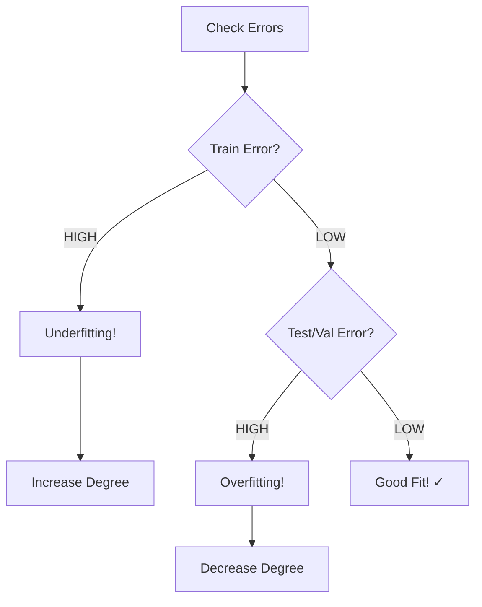

# AS25: Polynomial Regression and Model Complexity - Exam Preparation

> 📚 **Exam Preparation Guide** for Polynomial Regression & Bias-Variance Trade-off
> 📊 Includes: MCQs, MSQs, Numerical Problems, Shortcuts, Quick Revision

---

## Section A: Multiple Choice Questions (MCQ) - 15 Questions

### MCQ 1
**Question:** In polynomial regression Y = β₀ + β₁X + β₂X², what is the degree of the polynomial?

**Options:**
- A) 0
- B) 1
- C) 2
- D) 3

**✅ Correct Answer:** C

**📖 Explanation:** The degree is the highest power of X in the equation. Here, X² has power 2.

**❌ Why Others Are Wrong:**
- A) Degree 0 would be just β₀ (constant)
- B) Degree 1 is simple linear regression (only β₀ + β₁X)
- D) Degree 3 would require X³ term

---

### MCQ 2
**Question:** Why is polynomial regression still called "linear" regression?

**Options:**
- A) Because the curve is a straight line
- B) Because the model is linear in weights (β values)
- C) Because X values are linear
- D) Because the error term is linear

**✅ Correct Answer:** B

**📖 Explanation:** The model is a linear combination of weights (β₀ + β₁×feature₁ + β₂×feature₂...). The non-linearity is only in features (X, X²...), not in weights.

---

### MCQ 3
**Question:** What does HIGH BIAS indicate?

**Options:**
- A) Overfitting
- B) Underfitting
- C) Perfect fit
- D) High variance

**✅ Correct Answer:** B

**📖 Explanation:** High bias means the model is too simple to capture the underlying pattern = UNDERFITTING.

---

### MCQ 4
**Question:** What does HIGH VARIANCE indicate?

**Options:**
- A) Underfitting
- B) Model is too simple
- C) Overfitting
- D) Low training error and low testing error

**✅ Correct Answer:** C

**📖 Explanation:** High variance means model is too sensitive to training data = OVERFITTING. Low train error but high test error.

---

### MCQ 5
**Question:** What is the total error formula in bias-variance decomposition?

**Options:**
- A) Total Error = Bias + Variance
- B) Total Error = Bias² + Variance + Irreducible Error
- C) Total Error = Bias × Variance
- D) Total Error = Bias² - Variance

**✅ Correct Answer:** B

**📖 Explanation:** Total Error = Bias² + Variance + Irreducible Error. Bias is squared in the formula.

---

### MCQ 6
**Question:** You have 10 data points. Which polynomial degree will give ZERO training error?

**Options:**
- A) Degree 5
- B) Degree 8
- C) Degree 9
- D) Degree 10

**✅ Correct Answer:** C

**📖 Explanation:** With n points, degree = n-1 gives zero training error. 10 points → degree 9.

---

### MCQ 7
**Question:** Which sklearn function creates polynomial features?

**Options:**
- A) PolynomialRegression
- B) PolynomialFeatures
- C) PolynomialTransform
- D) PowerFeatures

**✅ Correct Answer:** B

**📖 Explanation:** `sklearn.preprocessing.PolynomialFeatures` creates X, X², X³... from input X.

---

### MCQ 8
**Question:** What is the purpose of a VALIDATION set?

**Options:**
- A) Train model parameters
- B) Final evaluation
- C) Tune hyperparameters like polynomial degree
- D) Store test results

**✅ Correct Answer:** C

**📖 Explanation:** Validation set is used to select best hyperparameters (like degree) without touching the test set.

---

### MCQ 9
**Question:** Training MSE keeps decreasing as degree increases, but validation MSE starts increasing. This indicates:

**Options:**
- A) Underfitting
- B) Good fit
- C) Overfitting
- D) Irreducible error

**✅ Correct Answer:** C

**📖 Explanation:** When training error decreases but validation error increases = model is overfitting (memorizing training data).

---

### MCQ 10
**Question:** What is Runge Phenomenon?

**Options:**
- A) Polynomial underfitting at center
- B) High-degree polynomials oscillate wildly at boundaries
- C) Linear regression failing
- D) Variance becoming zero

**✅ Correct Answer:** B

**📖 Explanation:** Runge phenomenon: high-degree polynomials become unstable and oscillate at edges of data range.

---

### MCQ 11
**Question:** Irreducible error can be reduced by:

**Options:**
- A) Using higher degree polynomial
- B) Getting more data
- C) Using regularization
- D) Cannot be reduced

**✅ Correct Answer:** D

**📖 Explanation:** Irreducible error is inherent noise in data - no model can reduce it.

---

### MCQ 12
**Question:** In sklearn, when should you use transform() instead of fit_transform()?

**Options:**
- A) On training data
- B) On validation and test data
- C) Never
- D) Always

**✅ Correct Answer:** B

**📖 Explanation:** fit_transform() on training, transform() on validation/test. This prevents data leakage.

---

### MCQ 13
**Question:** Model with degree=1 has high training AND testing error. What's the problem?

**Options:**
- A) Overfitting
- B) Underfitting
- C) Too much data
- D) Validation error

**✅ Correct Answer:** B

**📖 Explanation:** Both errors high = model too simple = underfitting. Solution: increase degree.

---

### MCQ 14
**Question:** Polynomial regression vs Multiple Linear Regression - key difference?

**Options:**
- A) Both use multiple different features
- B) Polynomial uses powers of ONE feature, MLR uses multiple DIFFERENT features
- C) Both use same feature
- D) No difference

**✅ Correct Answer:** B

**📖 Explanation:** Polynomial: X, X², X³ (one variable, different powers). MLR: X₁, X₂, X₃ (different variables).

---

### MCQ 15
**Question:** The "sweet spot" in the bias-variance trade-off is:

**Options:**
- A) Minimum training error
- B) Maximum complexity
- C) Minimum total error (bottom of U-curve)
- D) Zero error point

**✅ Correct Answer:** C

**📖 Explanation:** The sweet spot is at the bottom of the U-shaped total error curve, balancing bias and variance.

---

## Section B: Multiple Select Questions (MSQ) - 10 Questions

### MSQ 1
**Question:** Which are symptoms of OVERFITTING? (Select ALL that apply)

**Options:**
- ✅ A) Very low training error
- ❌ B) High training error
- ✅ C) High testing/validation error
- ✅ D) Large gap between train and test error
- ❌ E) Model is too simple

**📖 Explanation:** Overfitting = low train error + high test error + large gap. Model is too COMPLEX, not simple.

---

### MSQ 2
**Question:** Which are hyperparameters in polynomial regression? (Select ALL)

**Options:**
- ✅ A) Polynomial degree
- ❌ B) Coefficients (β values)
- ✅ C) Learning rate (if using gradient descent)
- ❌ D) Intercept value
- ✅ E) Regularization strength

**📖 Explanation:** Hyperparameters are set BEFORE training. β and intercept are LEARNED during training.

---

### MSQ 3
**Question:** Which help DETECT overfitting? (Select ALL)

**Options:**
- ✅ A) Comparing train vs validation error
- ✅ B) Cross-validation
- ✅ C) Plotting learning curves
- ❌ D) Only looking at training error
- ✅ E) Using held-out test set

---

### MSQ 4
**Question:** When does underfitting occur? (Select ALL)

**Options:**
- ✅ A) Polynomial degree too low
- ✅ B) Model too simple for data complexity
- ❌ C) Model too complex
- ✅ D) High bias
- ❌ E) High variance

---

### MSQ 5
**Question:** Valid data splitting strategies: (Select ALL)

**Options:**
- ✅ A) 60% train, 20% validation, 20% test
- ✅ B) 70% train, 15% validation, 15% test
- ❌ C) 100% training, use same for testing
- ✅ D) 80% train, 20% test (when using cross-validation)
- ❌ E) Use test set to select hyperparameters

---

### MSQ 6
**Question:** What increases with polynomial degree? (Select ALL)

**Options:**
- ✅ A) Number of parameters to learn
- ❌ B) Bias
- ✅ C) Risk of overfitting
- ✅ D) Model flexibility
- ✅ E) Variance

---

### MSQ 7
**Question:** Why is polynomial regression computationally cheaper than MLR with many features?

**Options:**
- ✅ A) Still works in 2D space (one input variable)
- ❌ B) Uses different algorithm
- ✅ C) Features (X, X², ...) are from same variable, not independent
- ❌ D) Doesn't use matrices
- ✅ E) No multicollinearity from different independent sources

---

### MSQ 8
**Question:** What can reduce VARIANCE? (Select ALL)

**Options:**
- ✅ A) Decrease polynomial degree
- ✅ B) Get more training data
- ✅ C) Use regularization
- ❌ D) Increase model complexity
- ✅ E) Cross-validation for model selection

---

### MSQ 9
**Question:** Components of Total Error: (Select ALL)

**Options:**
- ✅ A) Bias²
- ✅ B) Variance
- ✅ C) Irreducible Error
- ❌ D) Training Error only
- ❌ E) Validation Error only

---

### MSQ 10
**Question:** When should you STOP increasing polynomial degree? (Select ALL)

**Options:**
- ✅ A) When validation error starts increasing
- ✅ B) When train-validation gap becomes large
- ❌ C) When training error reaches zero
- ✅ D) When further increases don't improve validation
- ❌ E) Never - higher is always better

---

## Section C: Numerical/Calculation Questions - 6 Questions

### Numerical 1
**Question:** Given n = 8 data points, what polynomial degree will give zero training error?

**Solution:**
```
Rule: Degree = n - 1 for zero training error
Degree = 8 - 1 = 7
```

**✅ Final Answer:** Degree = 7

---

### Numerical 2
**Question:** For polynomial Y = 3 + 2X + 4X² - X³, if X = 2, calculate Y.

**Solution:**
```
Y = 3 + 2(2) + 4(2²) - (2³)
Y = 3 + 4 + 4(4) - 8
Y = 3 + 4 + 16 - 8
Y = 15
```

**✅ Final Answer:** Y = 15

---

### Numerical 3
**Question:** PolynomialFeatures(degree=3) on input X. How many features are created (including bias)?

**Solution:**
```
For single input X with degree 3:
Features = 1 (bias) + X¹ + X² + X³ = 4 features

Or formula: For single variable, features = degree + 1
Features = 3 + 1 = 4
```

**✅ Final Answer:** 4 features (1, X, X², X³)

---

### Numerical 4
**Question:** Train MSE = 0.5, Validation MSE = 5.0. What is the train-validation gap?

**Solution:**
```
Gap = Validation MSE - Train MSE
Gap = 5.0 - 0.5 = 4.5

Interpretation: Large gap indicates OVERFITTING
```

**✅ Final Answer:** Gap = 4.5 (indicates overfitting)

---

### Numerical 5
**Question:** If Total Error = 10, Variance = 4, Irreducible Error = 2, what is Bias?

**Solution:**
```
Total Error = Bias² + Variance + Irreducible Error
10 = Bias² + 4 + 2
10 = Bias² + 6
Bias² = 4
Bias = 2
```

**✅ Final Answer:** Bias = 2

---

### Numerical 6
**Question:** Dataset has 100 samples. Using 60-20-20 split, how many samples in each set?

**Solution:**
```
Training: 100 × 0.60 = 60 samples
Validation: 100 × 0.20 = 20 samples
Testing: 100 × 0.20 = 20 samples
```

**✅ Final Answer:** Train=60, Val=20, Test=20

---

## Section D: Fill in the Blanks - 5 Questions

### Fill 1
**Question:** The phenomenon where high-degree polynomials oscillate wildly at data boundaries is called _______.

**Answer:** Runge Phenomenon

---

### Fill 2
**Question:** Error that cannot be reduced by any model is called _______ error.

**Answer:** Irreducible

---

### Fill 3
**Question:** In sklearn, use _______ on validation/test data instead of fit_transform() to avoid data leakage.

**Answer:** transform()

---

### Fill 4
**Question:** Polynomial regression is linear in _______ but non-linear in _______.

**Answer:** weights (coefficients) ; features (X powers)

---

### Fill 5
**Question:** The _______ set is used to tune hyperparameters, while _______ set is for final evaluation.

**Answer:** validation ; test

---

## 📚 Quick Revision Points

### Key Formulas

| Formula | Meaning |
|---------|---------|
| Y = β₀ + β₁X + β₂X² + ... + βdXᵈ | Polynomial regression equation |
| Total Error = Bias² + Variance + Irreducible | Error decomposition |
| n points → degree (n-1) = zero train error | Overfitting rule |
| Features = degree + 1 (single variable) | Feature count |

### Comparison Table

| Aspect | Underfitting | Good Fit | Overfitting |
|--------|--------------|----------|-------------|
| **Bias** | HIGH | Balanced | LOW |
| **Variance** | LOW | Balanced | HIGH |
| **Train Error** | HIGH | Medium | LOW (~0) |
| **Test Error** | HIGH | Medium | HIGH |
| **Degree** | Too low | Just right | Too high |
| **Action** | Increase degree | Keep | Decrease degree |

---

## 🚀 Section E: Shortcuts & Cheat Codes

### ⚡ One-Liner Shortcuts

| Concept | Shortcut | When to Use |
|---------|----------|-------------|
| Zero train error | Degree = n-1 | Checking overfitting potential |
| Feature count | Degree + 1 | Estimating complexity |
| Overfitting signal | Val MSE↑ while Train MSE↓ | Model selection |
| Underfitting signal | Both errors HIGH | Need more complexity |

### 🎯 Memory Tricks (Mnemonics)

1. **BIAS-UNDER:** Bias → Underfitting (both have letter 'i')
2. **VARIANCE-OVER:** Variance → Overfitting (both have letter 'v')
3. **U-CURVE:** Total error is U-shaped, sweet spot at bottom
4. **TVT = Train, Validate, Test:** Order of data usage

### 📝 Last-Minute Formula Sheet

```
📌 Total Error = Bias² + Variance + Irreducible
📌 Zero Train Error when Degree = n - 1
📌 Features = Degree + 1 (for single variable)
📌 Split Ratio: 60% train, 20% val, 20% test
```

### 🎓 Interview One-Liners

| Question | Answer Template |
|----------|-----------------|
| "What is bias-variance trade-off?" | "As model complexity increases, bias decreases but variance increases. Goal is to find optimal balance." |
| "When to use polynomial regression?" | "When relationship is non-linear but has smooth curvature. Check residual plots for patterns." |
| "How to choose degree?" | "Use validation set - pick degree with lowest validation error." |
| "Why is polynomial LR still linear?" | "Because it's linear in weights (coefficients), not in features." |

### ⚠️ "If You Forget Everything, Remember This"

1. **HIGH BIAS = Underfitting = Increase complexity**
2. **HIGH VARIANCE = Overfitting = Decrease complexity**
3. **Use VALIDATION set for hyperparameter tuning, TEST set for final evaluation only**
4. **Sweet spot = Bottom of U-shaped error curve**

### 🔄 Quick Decision Flowchart



---

Good luck with your exams! 🎓✨
