# AS26: Cross-Validation and Generalization - Classroom Session (Part 1)

> 📚 **This is Part 1** covering: Generalization, Why Validation Sets, Holdout Validation, Cross-Validation Introduction, K-Fold CV
> 📘 **Next:** [Part 2](./AS26_CrossValidationGeneralization2.md)

---

## 🗺️ Mind Map - Topics to Cover


---

## 🎓 Classroom Conversation

### Topic 1: What is Generalization?

**Teacher:** Ippudu mana most important concept chuddam - GENERALIZATION! Machine Learning lo ye word chala chala important hai.

**Beginner Student:** Sir, generalization ante simple lo enti? Dictionary meaning kaadu, ML lo enti?

**Teacher:** Perfect question! Let me explain with our favorite analogy:

> 💡 **Jargon Alert - Generalization**
> **Simple Explanation:** Model ability to perform well on UNSEEN data - data it has never seen during training!
> **Example:** Like a student who can solve NEW exam questions, not just memorized questions from textbook!

**Teacher:** Think about it this way:

```
Student A (Bad Generalization):
- Memorizes all textbook questions
- Exam: Gets new questions
- Result: FAILS! 😢

Student B (Good Generalization):
- Understands CONCEPTS
- Exam: Gets new questions
- Result: PASSES! 🎉
```

**Clever Student:** Sir, R-square = 1 on training data good hai na? Model perfect fit kiya!

**Teacher:** NO! This is THE trap! Let me explain:

**The Problem with R² = 1 on Training:**
- Model has MEMORIZED training data
- Like student who only memorizes book
- Throws new data → FAILS!
- This is called OVERFITTING!

```mermaid
flowchart TD
    A[R² = 1 on Training] --> B{Is Model Good?}
    B --> C[NO! It's Overfitting!]
    C --> D[Model Memorized Data]
    D --> E[Will Fail on Test Data]
```



**Practical Student:** Sir, interview mein ye kaise puchenge?

**Teacher:** Common question: "What is the goal of ML?"

**Answer:** "The goal is NOT to minimize training error. The goal is to minimize error on UNSEEN data (test data). A model that memorizes training data will have poor generalization."

---

### Topic 2: Overfitting vs Underfitting - Quick Recap

**Teacher:** Let's connect generalization to overfitting and underfitting:

| Scenario | Training Error | Test Error | Problem | Model |
|----------|----------------|------------|---------|-------|
| **Underfitting** | HIGH | HIGH | Too simple | Can't learn patterns |
| **Good Fit** | LOW | LOW | Just right! | Sweet spot |
| **Overfitting** | VERY LOW | HIGH | Too complex | Memorizes data |

**Curious Student:** Sir, ye R² ya MSE se detect kaise kare?

**Teacher:** Look at the GAP:

```python
# Underfitting Detection
if train_error HIGH and test_error HIGH:
    print("UNDERFITTING! Model too simple")
    
# Good Fit Detection
if train_error LOW and test_error LOW:
    print("GOOD FIT! Keep this model")
    
# Overfitting Detection  
if train_error VERY LOW and test_error HIGH:
    print("OVERFITTING! Model memorized data")
```

**Critique Student:** Sir, train error LOW matlab kitna LOW? Threshold kya hai?

**Teacher:** There's no fixed threshold - it depends on:
- Your data quality
- Problem complexity
- Acceptable error in your application

But the KEY is the GAP between train and test error. Large gap = BAD!

---

### Topic 3: Why Do We Need Validation Sets?

**Teacher:** Ab important question - validation set kyon chahiye?

**Beginner Student:** Sir, train-test split se kaam nahi chalta kya? 80-20 sufficient nahi?

**Teacher:** Let me explain the PROBLEM:

**Scenario 1: Only Train-Test Split (80-20)**
- Train model on 80%
- Test on 20%
- Question: How do you choose DEGREE of polynomial?

**Clever Student:** Sir, test data pe check karke degree choose kar lete hai!

**Teacher:** WRONG! That's CHEATING! 

> 💡 **Jargon Alert - Data Leakage**
> **Simple Explanation:** If you use test data for ANY decision (like choosing degree), you're cheating! Test data should be COMPLETELY UNSEEN until final evaluation.
> **Example:** Like looking at exam paper before exam and then claiming you "prepared well"!

**The Solution - Three-Way Split:**

```mermaid
flowchart TD
    A[Full Dataset 100%] --> B[Training 60%]
    A --> C[Validation 20%]
    A --> D[Testing 20%]
    
    B --> E[Train Model - Learn β values]
    C --> F[Choose Hyperparameters - Degree, etc.]
    D --> G[Final Evaluation - ONLY ONCE!]
```



**Common Split Ratios:**
| Training | Validation | Testing | When to Use |
|----------|------------|---------|-------------|
| 60% | 20% | 20% | Standard |
| 70% | 15% | 15% | Moderate data |
| 80% | 10% | 10% | Large data |

---

### Topic 4: Holdout Validation - The Basic Approach

**Teacher:** This three-way split is called HOLDOUT VALIDATION.

> 💡 **Jargon Alert - Holdout Validation**
> **Simple Explanation:** "Hold out" some data separately for validation and testing. Don't use it for training!
> **Example:** Like keeping some practice questions separate to check your preparation!

**How Holdout Works:**

```python
# Step 1: Split into train and temp (80-20)
X_train, X_temp, y_train, y_temp = train_test_split(X, y, test_size=0.4)

# Step 2: Split temp into validation and test (50-50 of temp)
X_val, X_test, y_val, y_test = train_test_split(X_temp, y_temp, test_size=0.5)

# Result: 60% train, 20% validation, 20% test
```

**Practical Student:** Sir, validation ko kaise use karte hai degree choose karne mein?

**Teacher:** Great question! Here's the process:

```
For each polynomial degree (1, 2, 3, 4, 5...):
    1. Train model on TRAINING data
    2. Evaluate on VALIDATION data
    3. Record validation error
    
Choose degree with LOWEST validation error!
Then test ONCE on test data for final score.
```

**Debate Student:** Sir, ye approach mein kya problem hai? Sab log use karte hai na?

**Teacher:** Good question! Holdout has LIMITATIONS:

---

### Topic 5: Problems with Holdout Validation

**Teacher:** Holdout validation ke kuch problems hai:

**Problem 1: Small Dataset Issue**
- Only 60% data for training
- If you have 100 entries → only 60 for training!
- Model may not learn properly

**Problem 2: Lucky/Unlucky Split**

> 💡 **Jargon Alert - Lucky Split**
> **Simple Explanation:** Random split might give you "easy" test data that matches training well.
> **Unlucky Split:** Random split might give you "hard" test data that model never saw similar examples.
> **Example:** Like getting exam questions exactly from chapters you studied (lucky) vs chapters you skipped (unlucky)!

**Teacher's Example:**

```
Suppose you have dog and human images:
- 500 dogs, 500 humans total

Random Split might give:
- Training: 400 dogs, 200 humans
- Testing: 100 dogs, 300 humans

Problem: Unbalanced! Model will be biased!
```

**Curious Student:** Sir, iska solution kya hai? Random split se bachna kaise?

**Teacher:** This is exactly why we need CROSS-VALIDATION!

---

### Topic 6: Introduction to Cross-Validation

**Teacher:** Cross-Validation ye lucky/unlucky problem solve karta hai!

> 💡 **Jargon Alert - Cross-Validation**
> **Simple Explanation:** Instead of ONE split, create MULTIPLE splits. Train multiple models. Average the results!
> **Example:** Like taking MULTIPLE mock exams instead of just one - gives better estimate of your preparation!

**The Idea:**


**How it Solves Lucky/Unlucky:**
- If one split is "lucky" → high score
- If one split is "unlucky" → low score
- Average of all → TRUE performance!

**Beginner Student:** Sir, K splits matlab kitne parts?

**Teacher:** K is a number YOU choose - commonly 5 or 10. Let's see K-Fold CV in detail!

---

### Topic 7: K-Fold Cross-Validation - The Most Important Method

**Teacher:** K-Fold CV is what you'll use 90% of the time. Samjho carefully!

> 💡 **Jargon Alert - K-Fold Cross-Validation**
> **Simple Explanation:** Split data into K equal parts (folds). Train K times - each time use 1 fold for testing, rest for training. Average all K results.
> **Example:** Like rotating exam duty among 5 students - each gets to be examiner once!

**Visual Explanation (5-Fold CV):**

```
Fold 1: [TEST] [TRAIN] [TRAIN] [TRAIN] [TRAIN]
Fold 2: [TRAIN] [TEST] [TRAIN] [TRAIN] [TRAIN]
Fold 3: [TRAIN] [TRAIN] [TEST] [TRAIN] [TRAIN]
Fold 4: [TRAIN] [TRAIN] [TRAIN] [TEST] [TRAIN]
Fold 5: [TRAIN] [TRAIN] [TRAIN] [TRAIN] [TEST]

Union of all TEST parts = ENTIRE DATASET!
```

**Teacher:** Dekho - every data point becomes test EXACTLY ONCE across all models!

```mermaid
flowchart TD
    A[Dataset with 100 entries] --> B[Split into 5 folds - 20 each]
    
    B --> C[Model 1: Fold 1 test, Folds 2-5 train]
    B --> D[Model 2: Fold 2 test, Folds 1,3-5 train]
    B --> E[Model 3: Fold 3 test, Folds 1-2,4-5 train]
    B --> F[Model 4: Fold 4 test, Folds 1-3,5 train]
    B --> G[Model 5: Fold 5 test, Folds 1-4 train]
    
    C --> H[R² for Model 1]
    D --> I[R² for Model 2]
    E --> J[R² for Model 3]
    F --> K[R² for Model 4]
    G --> L[R² for Model 5]
    
    H --> M[Average = Final CV Score!]
    I --> M
    J --> M
    K --> M
    L --> M
```



**Clever Student:** Sir, total kitne models train hote hai?

**Teacher:** If K = 5, then 5 models!
- Each model trains on 80% data (4 folds)
- Each model tests on 20% data (1 fold)
- Average of 5 test scores = CV Score

**Numerical Example:**

| Fold | Test Fold | Train Size | Test Size | R² Score |
|------|-----------|------------|-----------|----------|
| 1 | Fold 1 | 80 | 20 | 0.92 |
| 2 | Fold 2 | 80 | 20 | 0.88 |
| 3 | Fold 3 | 80 | 20 | 0.90 |
| 4 | Fold 4 | 80 | 20 | 0.85 |
| 5 | Fold 5 | 80 | 20 | 0.95 |
| **Average** | - | - | - | **0.90** |

**CV Score = 0.90** (average of all folds)

---

### Topic 8: Why K-Fold is Better Than Holdout

**Teacher:** K-Fold advantages samjho:

| Aspect | Holdout | K-Fold CV |
|--------|---------|-----------|
| **Splits** | 1 random split | K systematic splits |
| **Models trained** | 1 | K |
| **Lucky/Unlucky** | High risk | Low risk (averaged) |
| **Data utilization** | 60% train | 80% train (K-1/K) |
| **Reliability** | Low | High |
| **Computation** | Fast | K times slower |

**Critique Student:** Sir, K-Fold bhi slow hai na? K models train karne padte hai!

**Teacher:** Yes, that's the trade-off:
- **Speed:** K-Fold is K times slower
- **Reliability:** K-Fold gives much more reliable estimate

For important decisions (model selection, hyperparameter tuning), ALWAYS use K-Fold!

**Practical Student:** Sir, interview mein K value kya recommend kare?

**Teacher:** Standard values:
- **K = 5:** Most common, good balance
- **K = 10:** More reliable, but slower
- **K = n (Leave-One-Out):** Most accurate, but very slow (we'll discuss later)

---

### Topic 9: Python Implementation - KFold Cross-Validation

**Teacher:** Ab code dekho - sklearn makes it easy!

```python
# ============================================
# K-FOLD CROSS-VALIDATION IMPLEMENTATION
# ============================================

# Step 1: Import Libraries
import numpy as np
from sklearn.datasets import load_diabetes
from sklearn.linear_model import LinearRegression
from sklearn.model_selection import cross_val_score, KFold

# Step 2: Load Dataset
X, y = load_diabetes(return_X_y=True)
print(f"Dataset shape: {X.shape}")  # (442, 10)

# Step 3: Define Model
model = LinearRegression()

# Step 4: Create KFold Object
kfold = KFold(n_splits=5, shuffle=True, random_state=42)

# Step 5: Calculate Cross-Validation Scores
scores = cross_val_score(model, X, y, cv=kfold, scoring='r2')

# Step 6: Display Results
print("Fold-wise R² scores:", scores)
print(f"Mean R²: {scores.mean():.4f}")
print(f"Std Dev: {scores.std():.4f}")
```

**Expected Output:**
```
Dataset shape: (442, 10)
Fold-wise R² scores: [0.4878 0.4432 0.4817 0.4923 0.4345]
Mean R²: 0.4679
Std Dev: 0.0241
```

**Beginner Student:** Sir, `cross_val_score` function kya return karta hai?

**Teacher:** It returns array of scores - one for each fold!

**Parameter Explanation:**

| Parameter | Meaning |
|-----------|---------|
| `model` | Your ML model (LinearRegression, etc.) |
| `X` | Feature data (FULL dataset, not split!) |
| `y` | Target data (FULL dataset!) |
| `cv` | KFold object or integer (number of folds) |
| `scoring` | Metric ('r2', 'neg_mean_squared_error', etc.) |

**Important:** Notice we pass FULL X, y - not train_test_split! The function does splitting internally.

---

### Topic 10: Understanding KFold Parameters

**Teacher:** KFold object parameters samjho:

```python
kfold = KFold(n_splits=5, shuffle=True, random_state=42)
```

| Parameter | Meaning | Recommendation |
|-----------|---------|----------------|
| `n_splits` | Number of folds (K) | 5 or 10 |
| `shuffle` | Randomly shuffle before splitting | True (recommended) |
| `random_state` | Seed for reproducibility | Any integer |

**Debate Student:** Sir, shuffle False rakhne se kya hoga?

**Teacher:** Without shuffle:
- Data is split in ORDER (first 20%, then next 20%, etc.)
- If data is sorted by some pattern → BAD splits!
- Always use `shuffle=True` unless you have time-series data

---

### Topic 11: Mean vs Standard Deviation of CV Scores

**Teacher:** CV results mein 2 values important hai - Mean and Std Dev!

**Mean Score:**
- Average performance across all folds
- **Higher mean = Better model**

**Standard Deviation:**
- How much scores vary across folds
- **Lower std = More consistent/stable model**

**Table of Interpretation:**

| Mean | Std Dev | Interpretation |
|------|---------|----------------|
| HIGH | LOW | ✅ Good! Consistent high performance |
| HIGH | HIGH | ⚠️ High but unstable |
| LOW | LOW | ❌ Consistently bad |
| LOW | HIGH | ❌ Bad and unstable |

**Practical Example:**

```
Model A: Mean = 0.85, Std = 0.02 → Good and stable! ✅
Model B: Mean = 0.87, Std = 0.15 → Higher but risky ⚠️
Model C: Mean = 0.45, Std = 0.05 → Bad but stable ❌
```

**Which model to choose?** Model A! Because it's more reliable.

**Curious Student:** Sir, high std dev ka matlab kya hai practically?

**Teacher:** High std means:
- Some folds give VERY HIGH scores
- Some folds give VERY LOW scores
- Model is SENSITIVE to which data it sees
- This is sign of potential OVERFITTING!

---

### Topic 12: Interview Perspective - Part 1

**Teacher:** Part 1 ke interview questions:

**Q1: What is generalization in machine learning?**
> "Generalization is the ability of a trained model to perform well on unseen data, not just the training data. Good generalization means the model learned patterns, not memorized data."

**Q2: Why do we need a validation set?**
> "Validation set is used for hyperparameter tuning and model selection without touching test data. If we use test data for these decisions, we get biased final evaluation."

**Q3: What is the problem with train-test split only?**
> "Single random split can be lucky or unlucky - giving unreliable performance estimates. Cross-validation solves this by averaging over multiple splits."

**Q4: Explain K-Fold Cross-Validation.**
> "Data is split into K equal folds. We train K models - each time using 1 fold for testing and K-1 folds for training. Final score is the average of all K test scores."

**Q5: What does standard deviation of CV scores indicate?**
> "Standard deviation indicates model stability. Low std means consistent performance across different data splits. High std suggests the model is sensitive to training data selection."

**Q6: What value of K should you use?**
> "Common choices are K=5 or K=10. K=5 is a good balance between computation time and reliability. Higher K gives more reliable estimates but takes longer."

---

## 📝 Teacher Summary - Part 1

**Teacher:** Let's summarize Part 1:

### Key Takeaways

1. **Generalization** = Model performance on UNSEEN data
2. **Overfitting** = Train error LOW, Test error HIGH (memorization!)
3. **Underfitting** = Both errors HIGH (too simple!)
4. **Holdout Validation** = Train/Val/Test split (60/20/20)
5. **Problem with Holdout** = Lucky/Unlucky splits
6. **K-Fold CV** = K splits, K models, average scores
7. **Mean CV Score** = Average performance
8. **Std of CV Scores** = Model stability

### Quick Reference

| Concept | Key Formula/Value |
|---------|-------------------|
| K-Fold CV | K models, each tests on 1/K data |
| Common K values | 5 or 10 |
| CV Score | Mean of all fold scores |
| Train size per fold | (K-1)/K of data |
| Test size per fold | 1/K of data |

---

> 📘 **Continue to Part 2:** [AS26_CrossValidationGeneralization2.md](./AS26_CrossValidationGeneralization2.md) for Stratified K-Fold, Leave-One-Out CV, Model Selection via CV, and Complete Python Implementation.
