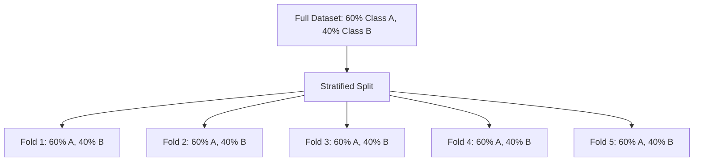
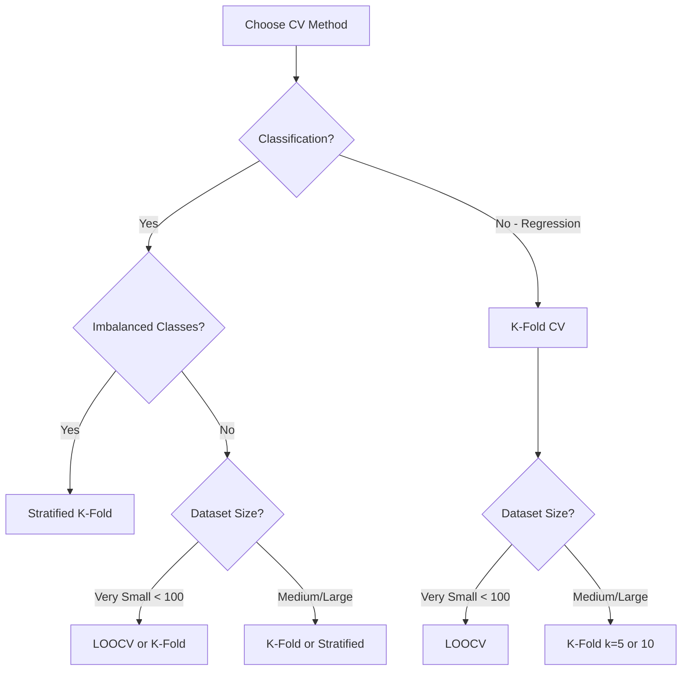
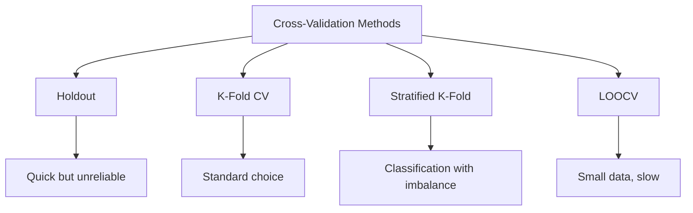

# AS26: Cross-Validation and Generalization - Classroom Session (Part 2)

> 📚 **This is Part 2** covering: Stratified K-Fold CV, Leave-One-Out CV, Model Selection via CV, Bias-Variance with CV, Complete Examples
> 📘 **Previous:** [Part 1](./AS26_CrossValidationGeneralization1.md)

---

## 🎓 Classroom Conversation (Continued)

### Topic 13: Leave-One-Out Cross-Validation (LOOCV)

**Teacher:** Ab ek extreme version of K-Fold samjho - Leave-One-Out CV!

> 💡 **Jargon Alert - Leave-One-Out CV (LOOCV)**
> **Simple Explanation:** Each data point is used as test set ONCE, while ALL other points are used for training. If you have n data points, you train n models!
> **Example:** Like making each student the examiner one by one - every student gets to be the judge exactly once!

**How LOOCV Works:**

```
Dataset: [1] [2] [3] [4] [5] ... [n]

Model 1: Test [1], Train [2,3,4,...,n]
Model 2: Test [2], Train [1,3,4,...,n]
Model 3: Test [3], Train [1,2,4,...,n]
...
Model n: Test [n], Train [1,2,3,...,n-1]

Total models = n (number of data points!)
```

**Beginner Student:** Sir, ye K-Fold se alag kaise hai?

**Teacher:** 

| Aspect | K-Fold CV | LOOCV |
|--------|-----------|-------|
| K value | User chooses (5, 10) | K = n (number of samples) |
| Test size per fold | n/K samples | 1 sample |
| Train size per fold | n - n/K samples | n-1 samples |
| Number of models | K | n |
| Bias | Higher | Lower (uses almost all data) |
| Variance | Lower | Higher |
| Speed | Fast | VERY SLOW! |

**Critique Student:** Sir, LOOCV best hai na? Maximum training data use hota hai!

**Teacher:** Theoretically yes, but practically CRAZY!

**The Problem with LOOCV:**

```python
# If dataset has 10,000 samples:
# LOOCV = 10,000 models to train!
# Each model trains on 9,999 samples!
# Total training = 10,000 × 9,999 = 99,990,000 operations!

# vs K-Fold (K=5):
# 5 models only!
# Each trains on 8,000 samples
# Total = 5 × 8,000 = 40,000 operations!
```

**Practical Student:** Sir, LOOCV kab use kare?

**Teacher:** ONLY when:
1. Dataset is VERY small (< 100-200 samples)
2. Maximum accuracy estimate needed
3. Computation time is not a concern

**Python Code:**

```python
from sklearn.model_selection import LeaveOneOut, cross_val_score
from sklearn.linear_model import LinearRegression

# LOOCV
loo = LeaveOneOut()
model = LinearRegression()
scores = cross_val_score(model, X, y, cv=loo, scoring='r2')

print(f"Number of models: {len(scores)}")  # = number of samples!
print(f"Mean R²: {scores.mean():.4f}")
```

---

### Topic 14: Stratified K-Fold Cross-Validation

**Teacher:** Ab VERY important variant - Stratified K-Fold! This is ONLY for classification!

> 💡 **Jargon Alert - Stratified K-Fold CV**
> **Simple Explanation:** Like K-Fold, but ensures SAME class distribution in each fold as in the full dataset!
> **Example:** If full data has 60% cats, 40% dogs - EACH fold will also have 60% cats, 40% dogs!

**Why Stratification is Needed:**

**Problem with Regular K-Fold for Classification:**

```
Full Dataset: 60 cats, 40 dogs (60%-40%)

Random K-Fold might create:
Fold 1: 50 cats, 50 dogs (50%-50%)  ❌ Different ratio!
Fold 2: 70 cats, 30 dogs (70%-30%)  ❌ Different ratio!
...

Problem: Model learns different patterns in different folds!
```

**Stratified K-Fold Solution:**

```
Full Dataset: 60 cats, 40 dogs (60%-40%)

Stratified K-Fold guarantees:
Fold 1: 12 cats, 8 dogs (60%-40%)  ✅ Same ratio!
Fold 2: 12 cats, 8 dogs (60%-40%)  ✅ Same ratio!
Fold 3: 12 cats, 8 dogs (60%-40%)  ✅ Same ratio!
...
```



**Debate Student:** Sir, Stratified regression ke liye use kar sakte hai?

**Teacher:** NO! Stratified ONLY for classification!

**Why?**
- Classification has discrete CLASSES (cat, dog, spam, not-spam)
- Regression has CONTINUOUS values (25.5, 30.2, 100.7)
- You can't "balance" continuous values the same way!

**Python Code:**

```python
from sklearn.model_selection import StratifiedKFold, cross_val_score
from sklearn.linear_model import LogisticRegression
from sklearn.datasets import load_iris

# Load classification dataset
X, y = load_iris(return_X_y=True)

# Stratified K-Fold
stratified_kfold = StratifiedKFold(n_splits=5, shuffle=True, random_state=42)

# Model
model = LogisticRegression(max_iter=1000)

# Cross-validation
scores = cross_val_score(model, X, y, cv=stratified_kfold, scoring='accuracy')

print(f"Fold-wise Accuracy: {scores}")
print(f"Mean Accuracy: {scores.mean():.4f}")
print(f"Std Dev: {scores.std():.4f}")
```

**Output:**
```
Fold-wise Accuracy: [1.0, 0.9667, 0.9333, 0.9667, 0.9667]
Mean Accuracy: 0.9667
Std Dev: 0.0211
```

---

### Topic 15: Comparison of All CV Methods

**Teacher:** Ab sab methods compare karte hai:

| Method | When to Use | Pros | Cons |
|--------|-------------|------|------|
| **Holdout** | Quick evaluation | Fast, simple | Unreliable, lucky/unlucky |
| **K-Fold** | Most scenarios | Reliable, good balance | K times slower |
| **Stratified K-Fold** | Classification | Balanced classes | Only for classification |
| **LOOCV** | Very small data | Most unbiased | VERY slow |

**Decision Flowchart:**



**Practical Student:** Sir, agar saare same result dete hai toh fastest use kare?

**Teacher:** Good thinking! But they DON'T always give same results:

**Example from Lecture (Iris Dataset):**

| Method | Accuracy | Observation |
|--------|----------|-------------|
| Simple Holdout | 93% | Single split |
| K-Fold (K=5) | 97.33% | Average of 5 |
| Stratified K-Fold | 96.66% | Class balanced |
| LOOCV | 96.66% | Most estimates |

Notice: LOOCV and Stratified K-Fold gave SAME result (96.66%)! This means Stratified K-Fold captured the essence without running 150 models!

---

### Topic 16: Model Selection Using Cross-Validation

**Teacher:** Ab practical use case - CV se best model kaise choose kare?

**Scenario:** Which polynomial degree is best for diabetes dataset?

```python
from sklearn.preprocessing import PolynomialFeatures
from sklearn.pipeline import make_pipeline
from sklearn.linear_model import LinearRegression
from sklearn.model_selection import cross_val_score, KFold
from sklearn.datasets import load_diabetes
import pandas as pd

# Load data
X, y = load_diabetes(return_X_y=True)

# KFold setup
kfold = KFold(n_splits=5, shuffle=True, random_state=42)

# Test different polynomial degrees
cv_results = []
degrees = [1, 2, 3, 4, 5]

for degree in degrees:
    # Create pipeline: PolynomialFeatures + LinearRegression
    model = make_pipeline(
        PolynomialFeatures(degree=degree),
        LinearRegression()
    )
    
    # Cross-validation scores
    scores = cross_val_score(model, X, y, cv=kfold, scoring='r2')
    
    cv_results.append({
        'Degree': degree,
        'Mean R²': scores.mean(),
        'Std Dev': scores.std()
    })
    
    print(f"Degree {degree}: Mean R² = {scores.mean():.4f}, Std = {scores.std():.4f}")

# Results DataFrame
df = pd.DataFrame(cv_results)
print("\n", df)
```

**Expected Output:**
```
Degree 1: Mean R² = 0.4687, Std = 0.0310
Degree 2: Mean R² = 0.1008, Std = 0.1659
Degree 3: Mean R² = -1196.21, Std = 536.47
Degree 4: Mean R² = -24.80, Std = 11.67
Degree 5: Mean R² = -24.71, Std = 11.72

   Degree      Mean R²     Std Dev
0       1     0.468714    0.031005
1       2     0.100798    0.165899
2       3 -1196.214499  536.468930
3       4   -24.795990   11.667560
4       5   -24.706901   11.724150
```

**Clever Student:** Sir, negative R² kaise possible hai?

**Teacher:** Negative R² means model is WORSE than simply predicting the mean!

**Interpretation:**
- **Degree 1:** Mean R² = 0.47, Std = 0.03 → Best! Stable and positive
- **Degree 2+:** Negative R², High Std → OVERFITTING!

**Conclusion:** For diabetes dataset, LINEAR model (degree 1) is best!

---

### Topic 17: Understanding CV Results - The Graphs

**Teacher:** CV results plot karke visualize karo:

```python
import matplotlib.pyplot as plt

degrees = [1, 2, 3, 4, 5, 6]
mean_r2 = [0.47, 0.10, -1196, -24.8, -24.7, -50]  # Example values

plt.figure(figsize=(10, 6))
plt.plot(degrees, mean_r2, 'b-o', linewidth=2, markersize=10)
plt.axhline(y=0, color='r', linestyle='--', label='R² = 0 threshold')
plt.xlabel('Polynomial Degree', fontsize=12)
plt.ylabel('Mean CV R² Score', fontsize=12)
plt.title('Model Selection via Cross-Validation', fontsize=14)
plt.legend()
plt.grid(True)
plt.show()
```

**Pattern to Look For:**

```
CV Score
    |
    |*  ← Degree 1 (Best!)
    |
    | *  ← Degree 2 (Declining)
    |
 0 -------- Threshold ---------
    |
    |           * * *  ← Degree 3-6 (Overfitting!)
    |                   (All negative!)
    +-------------------------> Degree
```

**Key Insight:** When CV score drops sharply and goes negative = OVERFITTING ZONE!

---

### Topic 18: Bias-Variance Trade-off with Cross-Validation

**Teacher:** CV kaise bias-variance trade-off solve karta hai?

**Remember the Detection Rules:**

| Train Error | Validation/CV Error | Diagnosis |
|-------------|---------------------|-----------|
| HIGH | HIGH | Underfitting (High Bias) |
| LOW | LOW | Good Fit! ✅ |
| VERY LOW | HIGH | Overfitting (High Variance) |

**With Cross-Validation:**

Instead of single validation score, you get K scores!
- **Mean of K scores** = Average performance
- **Std of K scores** = Stability/Consistency

**Interpretation:**

| Mean Score | Std | Interpretation |
|------------|-----|----------------|
| HIGH | LOW | Best model! Consistent and accurate |
| HIGH | HIGH | Risky - accurate but unstable |
| LOW | LOW | Bad model but stable |
| LOW | HIGH | Worst - bad and unstable |

**Practical Example from Lecture:**

```
Degree 1: Mean R² = 0.47, Std = 0.03
→ Not great R², but STABLE (low std)
→ Model behaves consistently

Degree 3: Mean R² = -1196, Std = 536
→ Terrible R² AND HIGH Std!
→ Model is COMPLETELY unstable = SEVERE OVERFITTING
```

---

### Topic 19: Complete Classification Example

**Teacher:** Ab classification ka complete example dekho - Iris dataset:

```python
# ============================================
# COMPLETE CROSS-VALIDATION FOR CLASSIFICATION
# ============================================

import numpy as np
from sklearn.datasets import load_iris
from sklearn.linear_model import LogisticRegression
from sklearn.model_selection import (
    train_test_split, 
    KFold, 
    StratifiedKFold, 
    LeaveOneOut,
    cross_val_score
)

# Load Data
X, y = load_iris(return_X_y=True)
print(f"Dataset: {X.shape[0]} samples, {X.shape[1]} features")
print(f"Classes: {np.unique(y)}")

# Model
model = LogisticRegression(max_iter=1000)

# ============================================
# Method 1: Simple Train-Test Split
# ============================================
X_train, X_test, y_train, y_test = train_test_split(
    X, y, test_size=0.3, random_state=42
)
model.fit(X_train, y_train)
accuracy_holdout = model.score(X_test, y_test)
print(f"\n1. Holdout (70-30 split): Accuracy = {accuracy_holdout:.4f}")

# ============================================
# Method 2: K-Fold CV (K=5)
# ============================================
kfold = KFold(n_splits=5, shuffle=True, random_state=42)
scores_kfold = cross_val_score(model, X, y, cv=kfold, scoring='accuracy')
print(f"\n2. K-Fold CV (K=5):")
print(f"   Fold scores: {scores_kfold}")
print(f"   Mean: {scores_kfold.mean():.4f}, Std: {scores_kfold.std():.4f}")

# ============================================
# Method 3: Stratified K-Fold CV (K=5)
# ============================================
strat_kfold = StratifiedKFold(n_splits=5, shuffle=True, random_state=42)
scores_strat = cross_val_score(model, X, y, cv=strat_kfold, scoring='accuracy')
print(f"\n3. Stratified K-Fold CV (K=5):")
print(f"   Fold scores: {scores_strat}")
print(f"   Mean: {scores_strat.mean():.4f}, Std: {scores_strat.std():.4f}")

# ============================================
# Method 4: Leave-One-Out CV
# ============================================
loo = LeaveOneOut()
scores_loo = cross_val_score(model, X, y, cv=loo, scoring='accuracy')
print(f"\n4. Leave-One-Out CV:")
print(f"   Number of models: {len(scores_loo)}")
print(f"   Mean: {scores_loo.mean():.4f}, Std: {scores_loo.std():.4f}")

# ============================================
# Comparison Table
# ============================================
print("\n" + "="*60)
print("COMPARISON OF ALL METHODS")
print("="*60)
print(f"{'Method':<25} {'Accuracy':<15} {'Std Dev':<10}")
print("-"*60)
print(f"{'Holdout (70-30)':<25} {accuracy_holdout:<15.4f} {'N/A':<10}")
print(f"{'K-Fold (K=5)':<25} {scores_kfold.mean():<15.4f} {scores_kfold.std():<10.4f}")
print(f"{'Stratified K-Fold':<25} {scores_strat.mean():<15.4f} {scores_strat.std():<10.4f}")
print(f"{'LOOCV':<25} {scores_loo.mean():<15.4f} {scores_loo.std():<10.4f}")
```

**Expected Output:**
```
Dataset: 150 samples, 4 features
Classes: [0 1 2]

1. Holdout (70-30 split): Accuracy = 1.0000

2. K-Fold CV (K=5):
   Fold scores: [1.0, 0.9667, 0.9333, 0.9667, 1.0]
   Mean: 0.9733, Std: 0.0249

3. Stratified K-Fold CV (K=5):
   Fold scores: [0.9667, 0.9667, 0.9333, 0.9667, 1.0]
   Mean: 0.9667, Std: 0.0211

4. Leave-One-Out CV:
   Number of models: 150
   Mean: 0.9667, Std: 0.1795

============================================================
COMPARISON OF ALL METHODS
============================================================
Method                    Accuracy        Std Dev   
------------------------------------------------------------
Holdout (70-30)           1.0000          N/A       
K-Fold (K=5)              0.9733          0.0249    
Stratified K-Fold         0.9667          0.0211    
LOOCV                     0.9667          0.1795    
```

**Curious Student:** Sir, Holdout gave 100% - why don't we pick that?

**Teacher:** EXCELLENT question! Holdout 100% is MISLEADING because:
- It's based on ONE random split
- That split might be "lucky"
- CV (0.97) is more RELIABLE estimate

---

### Topic 20: Important Q&A from Lecture

**Teacher:** Kuch important questions from the lecture:

**Q1: "CV performance improve karti hai kya?"**

**Answer:** NO! CV does NOT improve model performance. It only gives RELIABLE ESTIMATE of true performance!

```
Without CV: "My model accuracy is 95%" (but based on lucky split)
With CV: "My model accuracy is really 87%" (true estimate)
```

**Q2: "Why can't Stratified CV be used for regression?"**

**Answer:** Regression has CONTINUOUS targets (25.3, 100.7, etc.). There are no "classes" to balance. You can't ensure "equal distribution of continuous values" in each fold the same way.

**Q3: "When should we apply CV - before or after preprocessing?"**

**Answer:** AFTER preprocessing! 
- First clean data (handle missing values, outliers)
- Then scale/normalize
- Then apply CV

**Q4: "Is test set compulsory with CV?"**

**Answer:** YES! Always keep a separate test set for FINAL evaluation. CV is for model selection, not final testing.

---

### Topic 21: Grid Search CV (Brief Introduction)

**Teacher:** One more related topic - GridSearchCV. This is used to find best hyperparameters!

```python
from sklearn.model_selection import GridSearchCV
from sklearn.linear_model import Ridge

# Define parameter grid
param_grid = {
    'alpha': [0.01, 0.1, 1.0, 10.0, 100.0]
}

# Create model
model = Ridge()

# GridSearchCV - tries all combinations with CV!
grid_search = GridSearchCV(
    model, 
    param_grid, 
    cv=5,  # 5-fold CV for each parameter
    scoring='r2'
)

# Fit (will train 5 × 5 = 25 models!)
grid_search.fit(X, y)

print(f"Best alpha: {grid_search.best_params_}")
print(f"Best CV score: {grid_search.best_score_:.4f}")
```

**Beginner Student:** Sir, ye kaafi complicated lag raha hai!

**Teacher:** Don't worry - you'll learn this in detail in hyperparameter tuning class. Main point: CV is used INSIDE GridSearchCV to evaluate each parameter combination!

---

### Topic 22: Interview Preparation - Part 2

**Teacher:** Part 2 ke interview questions:

**Q1: What is Stratified K-Fold and when do you use it?**
> "Stratified K-Fold ensures each fold has the same class distribution as the full dataset. Use it for classification problems, especially with imbalanced classes."

**Q2: What is LOOCV and what are its pros/cons?**
> "Leave-One-Out CV tests on each data point individually. Pros: Most unbiased estimate, uses maximum training data. Cons: Very slow for large datasets (n models for n samples)."

**Q3: Does cross-validation improve model performance?**
> "No, CV does not improve performance. It only provides a reliable estimate of true performance. It helps in model selection, not model improvement."

**Q4: How does CV help with bias-variance trade-off?**
> "CV helps identify overfitting by comparing train error with CV error. If train error is very low but CV error is high (and has high std), the model is overfitting."

**Q5: What do mean and std of CV scores indicate?**
> "Mean indicates average model performance. Low std indicates consistent performance across folds (stable model), while high std suggests the model is sensitive to training data (potential overfitting)."

---

## 📝 Final Teacher Summary

**Teacher:** Okay students, complete summary:

### All CV Methods at a Glance



### Key Takeaways

1. **Generalization** = Performance on unseen data
2. **CV** gives reliable estimate by averaging multiple splits
3. **K-Fold** = Most common (K=5 or 10)
4. **Stratified K-Fold** = For classification (preserves class ratio)
5. **LOOCV** = Most accurate but slowest
6. **Mean CV score** = Average performance
7. **Std of CV scores** = Model stability
8. **CV ≠ Model improvement** - It's for evaluation only!

### Decision Table

| Scenario | Use This CV |
|----------|-------------|
| Quick check | Holdout |
| Standard evaluation | K-Fold (K=5) |
| Classification with imbalanced classes | Stratified K-Fold |
| Very small dataset (< 100) | LOOCV or K-Fold (K=10) |
| Model selection/hyperparameter tuning | GridSearchCV with K-Fold |

### Preprocessing Order

```
1. Handle missing values
2. Remove outliers
3. Scale/Normalize
4. Balance classes (if needed)
5. THEN apply Cross-Validation!
```

---

> 📘 **Return to:** [Part 1](./AS26_CrossValidationGeneralization1.md)
> 📘 **Next:** [Exam Preparation](./AS26_CrossValidationGeneralization_exam_preparation.md)
