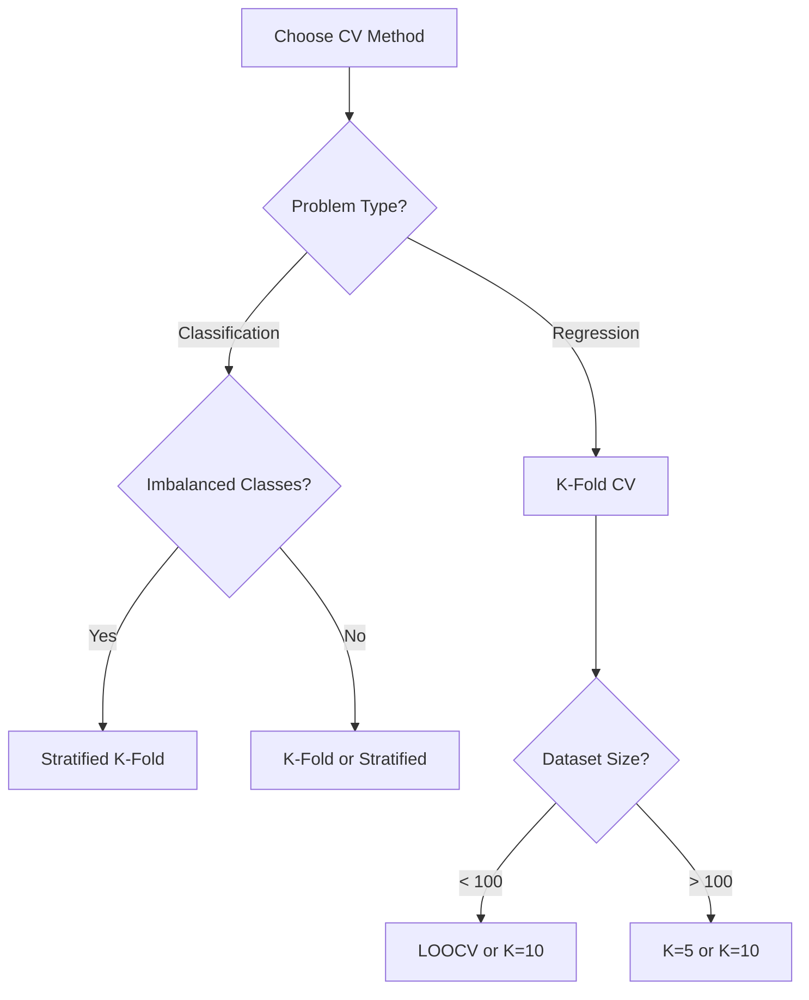

# AS26: Cross-Validation and Generalization - Exam Preparation

> 📚 **Exam Preparation Guide** for Cross-Validation & Generalization
> 📊 Includes: MCQs, MSQs, Numerical Problems, Shortcuts, Quick Revision

---

## Section A: Multiple Choice Questions (MCQ) - 15 Questions

### MCQ 1
**Question:** What does generalization mean in machine learning?

**Options:**
- A) Model performance on training data
- B) Model performance on unseen/test data
- C) Model complexity level
- D) Number of features used

**✅ Correct Answer:** B

**📖 Explanation:** Generalization refers to how well a model performs on NEW, UNSEEN data - not the data it was trained on.

---

### MCQ 2
**Question:** If training error is very low but testing error is high, what is the problem?

**Options:**
- A) Underfitting
- B) Overfitting
- C) Good fit
- D) High bias

**✅ Correct Answer:** B

**📖 Explanation:** Low train error + high test error = model memorized training data = OVERFITTING.

---

### MCQ 3
**Question:** What is the purpose of a validation set?

**Options:**
- A) Final model evaluation
- B) Training the model
- C) Hyperparameter tuning and model selection
- D) Data preprocessing

**✅ Correct Answer:** C

**📖 Explanation:** Validation set is for tuning hyperparameters (like polynomial degree) without touching test data.

---

### MCQ 4
**Question:** In 5-Fold Cross-Validation, how many models are trained?

**Options:**
- A) 1
- B) 3
- C) 5
- D) 10

**✅ Correct Answer:** C

**📖 Explanation:** K-Fold trains K models. With 5 folds, you train 5 models - each with different test fold.

---

### MCQ 5
**Question:** What is the train size per fold in 5-Fold CV with 100 samples?

**Options:**
- A) 20 samples
- B) 60 samples
- C) 80 samples
- D) 100 samples

**✅ Correct Answer:** C

**📖 Explanation:** Train size = (K-1)/K × N = 4/5 × 100 = 80 samples.

---

### MCQ 6
**Question:** Stratified K-Fold is used for:

**Options:**
- A) Regression problems only
- B) Classification problems only
- C) Both regression and classification
- D) Time series problems only

**✅ Correct Answer:** B

**📖 Explanation:** Stratified K-Fold preserves class distribution - only applicable for classification where discrete classes exist.

---

### MCQ 7
**Question:** In Leave-One-Out CV with n=100 samples, how many models are trained?

**Options:**
- A) 5
- B) 10
- C) 50
- D) 100

**✅ Correct Answer:** D

**📖 Explanation:** LOOCV trains n models - one for each sample as test set. 100 samples = 100 models.

---

### MCQ 8
**Question:** What does a negative R² score in CV indicate?

**Options:**
- A) Perfect fit
- B) Model is worse than predicting the mean
- C) Underfitting
- D) High variance

**✅ Correct Answer:** B

**📖 Explanation:** Negative R² means model predictions are WORSE than simply predicting the mean of target values.

---

### MCQ 9
**Question:** What does high standard deviation of CV scores indicate?

**Options:**
- A) Model is stable and consistent
- B) Model performance varies significantly across folds
- C) Model is underfitting
- D) More data is needed

**✅ Correct Answer:** B

**📖 Explanation:** High std = model behaves differently on different data splits = UNSTABLE/inconsistent.

---

### MCQ 10
**Question:** Which sklearn function is used to get CV scores directly?

**Options:**
- A) fit_transform()
- B) predict()
- C) cross_val_score()
- D) train_test_split()

**✅ Correct Answer:** C

**📖 Explanation:** `cross_val_score()` trains models and returns scores for all folds automatically.

---

### MCQ 11
**Question:** Does cross-validation improve model performance?

**Options:**
- A) Yes, always
- B) Yes, for large datasets
- C) No, it only provides reliable evaluation
- D) No, it decreases performance

**✅ Correct Answer:** C

**📖 Explanation:** CV does NOT improve performance - it only gives reliable ESTIMATE of true performance.

---

### MCQ 12
**Question:** What is the main disadvantage of LOOCV?

**Options:**
- A) Biased estimates
- B) Uses less training data
- C) Computationally expensive (n models)
- D) Only works for classification

**✅ Correct Answer:** C

**📖 Explanation:** LOOCV trains n models (one per sample), making it very slow for large datasets.

---

### MCQ 13
**Question:** For a classification problem with imbalanced classes (90% class A, 10% class B), which CV method is best?

**Options:**
- A) Simple Holdout
- B) K-Fold CV
- C) Stratified K-Fold CV
- D) Leave-One-Out CV

**✅ Correct Answer:** C

**📖 Explanation:** Stratified K-Fold ensures each fold has same class distribution (90-10), preventing biased evaluation.

---

### MCQ 14
**Question:** When should preprocessing be done relative to CV?

**Options:**
- A) During CV
- B) After CV
- C) Before CV
- D) Preprocessing is not needed

**✅ Correct Answer:** C

**📖 Explanation:** Always preprocess (handle missing values, scale, balance) BEFORE applying CV.

---

### MCQ 15
**Question:** If the 'shuffle' parameter is False in KFold, what happens?

**Options:**
- A) Data is randomly shuffled
- B) Data is split in original order
- C) CV is not performed
- D) Error occurs

**✅ Correct Answer:** B

**📖 Explanation:** Without shuffle, data is split sequentially (first 20%, then next 20%, etc.). Bad if data is sorted!

---

## Section B: Multiple Select Questions (MSQ) - 10 Questions

### MSQ 1
**Question:** Which are valid reasons to use cross-validation? (Select ALL)

**Options:**
- ✅ A) Get reliable performance estimate
- ✅ B) Avoid lucky/unlucky split problem
- ❌ C) Improve model accuracy
- ✅ D) Help with model selection
- ✅ E) Tune hyperparameters

**📖 Explanation:** CV provides reliable estimates and helps selection/tuning. It does NOT improve accuracy.

---

### MSQ 2
**Question:** Which indicate OVERFITTING? (Select ALL)

**Options:**
- ✅ A) Very low training error
- ✅ B) High validation/test error
- ✅ C) Large gap between train and test error
- ❌ D) Both errors are high
- ✅ E) Mean CV score is negative with high std

---

### MSQ 3
**Question:** Which are valid CV methods? (Select ALL)

**Options:**
- ✅ A) K-Fold
- ✅ B) Stratified K-Fold
- ✅ C) Leave-One-Out
- ❌ D) Leave-All-Out
- ✅ E) Holdout Validation

---

### MSQ 4
**Question:** Advantages of K-Fold CV over single holdout: (Select ALL)

**Options:**
- ✅ A) More reliable performance estimate
- ✅ B) Uses all data for both training and testing
- ❌ C) Faster computation
- ✅ D) Reduces variance from random splits
- ✅ E) Every sample is tested once

---

### MSQ 5
**Question:** When to use LOOCV? (Select ALL)

**Options:**
- ✅ A) Very small dataset (< 100 samples)
- ✅ B) Need most unbiased estimate
- ❌ C) Large dataset with millions of rows
- ❌ D) When speed is priority
- ✅ E) Maximum training data utilization needed

---

### MSQ 6
**Question:** What information can you get from CV results? (Select ALL)

**Options:**
- ✅ A) Average model performance
- ✅ B) Model stability (via std)
- ✅ C) Whether model is overfitting
- ❌ D) Optimal hyperparameters automatically
- ✅ E) Comparison between different models

---

### MSQ 7
**Question:** Which are correct about Stratified K-Fold? (Select ALL)

**Options:**
- ✅ A) Preserves class distribution in each fold
- ❌ B) Can be used for regression
- ✅ C) Best for imbalanced classification
- ✅ D) Available in sklearn as StratifiedKFold
- ✅ E) Uses same K value as regular K-Fold

---

### MSQ 8
**Question:** Parameters of sklearn KFold: (Select ALL)

**Options:**
- ✅ A) n_splits
- ✅ B) shuffle
- ✅ C) random_state
- ❌ D) test_size
- ❌ E) stratify

---

### MSQ 9
**Question:** Correct interpretations of low mean CV score + high std: (Select ALL)

**Options:**
- ✅ A) Model is performing poorly
- ✅ B) Model is inconsistent/unstable
- ✅ C) May indicate overfitting
- ❌ D) Model is good but needs more data
- ✅ E) Model is sensitive to training data

---

### MSQ 10
**Question:** What should you do BEFORE applying CV? (Select ALL)

**Options:**
- ✅ A) Handle missing values
- ✅ B) Remove outliers
- ✅ C) Scale/normalize data
- ❌ D) Split into train/test
- ✅ E) Balance classes if needed (for classification)

---

## Section C: Numerical/Calculation Questions - 6 Questions

### Numerical 1
**Question:** In 10-Fold CV with 500 samples, what is the test size per fold?

**Solution:**
```
Test size per fold = Total samples / K
= 500 / 10
= 50 samples
```

**✅ Final Answer:** 50 samples

---

### Numerical 2
**Question:** In 5-Fold CV, what percentage of data is used for training in each fold?

**Solution:**
```
Training folds = K - 1 = 5 - 1 = 4
Training percentage = (K-1)/K × 100
= 4/5 × 100
= 80%
```

**✅ Final Answer:** 80%

---

### Numerical 3
**Question:** CV scores for 5 folds: [0.85, 0.90, 0.88, 0.87, 0.90]. Calculate mean and std.

**Solution:**
```
Mean = (0.85 + 0.90 + 0.88 + 0.87 + 0.90) / 5
     = 4.40 / 5 = 0.88

Variance = [(0.85-0.88)² + (0.90-0.88)² + (0.88-0.88)² + 
            (0.87-0.88)² + (0.90-0.88)²] / 5
         = [0.0009 + 0.0004 + 0 + 0.0001 + 0.0004] / 5
         = 0.0018 / 5 = 0.00036

Std = √0.00036 ≈ 0.019
```

**✅ Final Answer:** Mean = 0.88, Std ≈ 0.019

---

### Numerical 4
**Question:** With 200 samples and LOOCV, how many total training operations occur?

**Solution:**
```
LOOCV creates n models = 200 models
Each model trains on n-1 samples = 199 samples

Total training operations = 200 × 199 = 39,800
```

**✅ Final Answer:** 39,800 training operations

---

### Numerical 5
**Question:** For model selection, 6 polynomial degrees with 5-fold CV. Total models trained?

**Solution:**
```
Polynomial degrees to test = 6
Folds per degree = 5

Total models = 6 × 5 = 30 models
```

**✅ Final Answer:** 30 models

---

### Numerical 6
**Question:** Dataset: 60 train, 20 validation, 20 test. What split ratio was used?

**Solution:**
```
Total = 60 + 20 + 20 = 100

Train = 60/100 = 60%
Validation = 20/100 = 20%
Test = 20/100 = 20%

Split ratio: 60-20-20
```

**✅ Final Answer:** 60% train, 20% validation, 20% test

---

## Section D: Fill in the Blanks - 5 Questions

### Fill 1
**Question:** Cross-validation provides a reliable estimate of model _______ on unseen data.

**Answer:** performance (or generalization)

---

### Fill 2
**Question:** In 5-Fold CV, each data point is used as test exactly _______ time(s).

**Answer:** one (1)

---

### Fill 3
**Question:** _______ K-Fold preserves class distribution and is used for classification.

**Answer:** Stratified

---

### Fill 4
**Question:** A negative R² score indicates the model is worse than predicting the _______.

**Answer:** mean

---

### Fill 5
**Question:** Low std of CV scores indicates the model is _______ and consistent.

**Answer:** stable

---

## 📚 Quick Revision Points

### Key Formulas

| Formula | Meaning |
|---------|---------|
| Train size = (K-1)/K × n | Training samples per fold |
| Test size = n/K | Test samples per fold |
| CV Score = Mean of K fold scores | Final performance estimate |
| LOOCV models = n | Number of models for LOOCV |

### Comparison Table

| Method | K value | Speed | Reliability | Use Case |
|--------|---------|-------|-------------|----------|
| Holdout | 1 split | Fastest | Lowest | Quick check |
| K-Fold | 5 or 10 | Medium | High | Standard |
| Stratified | 5 or 10 | Medium | High | Classification |
| LOOCV | n | Slowest | Highest | Small data |

---

## 🚀 Section E: Shortcuts & Cheat Codes

### ⚡ One-Liner Shortcuts

| Concept | Shortcut | When to Use |
|---------|----------|-------------|
| Train size in K-Fold | (K-1)/K × n | Quick calculation |
| Test size in K-Fold | n/K | Quick calculation |
| K-Fold models | K | Count models |
| LOOCV models | n | Count models |
| Stratified K-Fold | Only for classification | Remember limitation |

### 🎯 Memory Tricks (Mnemonics)

1. **LOOCV = Leave One Out = n models** (n = number of samples)
2. **Stratified = Strata = Layers = Classes** (for classification only!)
3. **High Std = Shaky model** (unstable performance)
4. **CV ≠ Improvement** (only evaluation, not enhancement!)

### 📝 Last-Minute Formula Sheet

```
📌 K-Fold train size: (K-1)/K × n
📌 K-Fold test size: n/K
📌 LOOCV models: n models, each trains on n-1
📌 CV Score: Mean of all fold scores
📌 Standard split: 60% train, 20% val, 20% test
```

### 🎓 Interview One-Liners

| Question | Answer Template |
|----------|-----------------|
| "What is CV?" | "Evaluating model on multiple train-test splits and averaging" |
| "K-Fold vs LOOCV?" | "K-Fold: K models, faster. LOOCV: n models, most accurate but slow" |
| "Does CV improve model?" | "No, CV only evaluates - doesn't improve performance" |
| "When use Stratified?" | "Classification with imbalanced classes" |

### ⚠️ "If You Forget Everything, Remember This"

1. **CV = Multiple splits = Reliable estimate**
2. **Stratified = Classification ONLY**
3. **High Std = Unstable model = Potential overfitting**
4. **LOOCV = Most accurate but SLOWEST**

### 🔄 Quick Decision Flowchart



---

Good luck with your exams! 🎓✨
