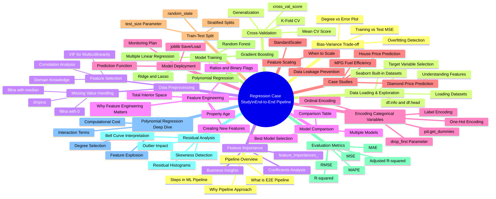
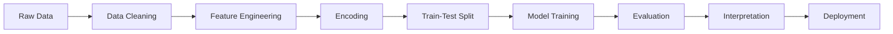
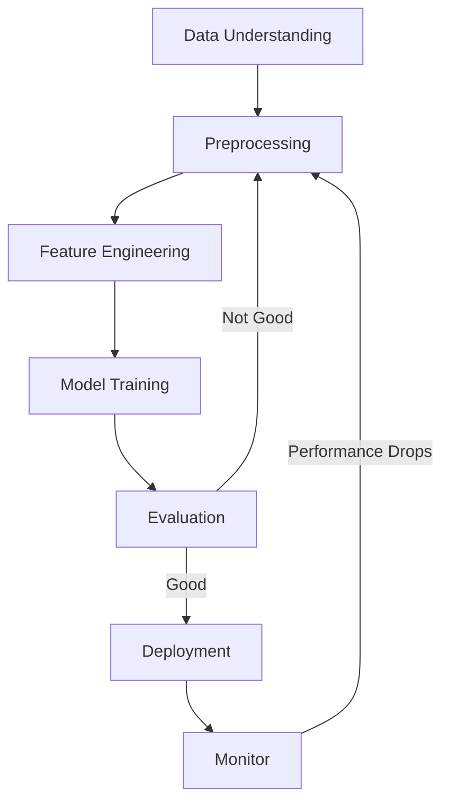
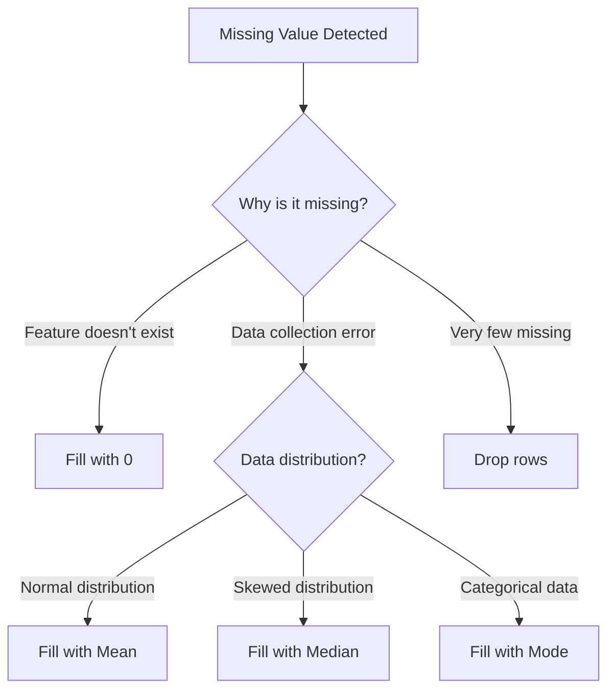
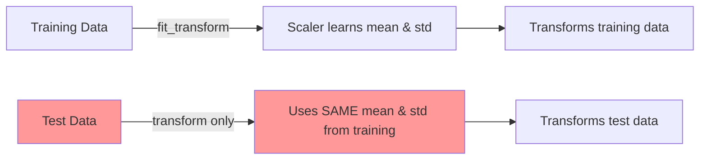

# AS27: Regression Case Study - End-to-End Pipeline - Classroom Session (Part 1)

> 📚 **This is Part 1** covering: Pipeline Overview, Data Loading & Exploration, Data Preprocessing, Feature Engineering, Encoding
> 📘 **See also:** [Part 2](./AS27_RegressionCaseStudy2.md), [Part 3](./AS27_RegressionCaseStudy3.md)

---

## 🗺️ Mind Map - Topics to Cover (Complete Session)



---

## 🎓 Classroom Conversation

---

### Topic 1: End-to-End Regression Pipeline - Introduction

---

**Teacher:** Good evening students! 🎓 Ippudu mana class lo chala interesting topic chuddam — **Regression Case Study: End-to-End Pipeline**. Idi mana regression journey lo oka milestone lanti concept.

Meeru already Linear Regression, Multiple Linear Regression, Polynomial Regression, Error Metrics, Cross-Validation — anni concepts individual ga study chesaru. But ippudu oka real-world problem teesukoni, start nundi end varaku complete pipeline ela build cheyalo — adi nerchukundaam.

Oka simple analogy tho start cheddaam. Meeru oka restaurant owner ani imagine cheyandi. Meeku customer ki food serve cheyyali ante:
1. **Ingredients konali** (Data Loading)
2. **Vegetables wash cheyyali, cut cheyyali** (Data Preprocessing)
3. **Masala prepare cheyyali** (Feature Engineering)
4. **Cook cheyyali** (Model Training)
5. **Taste chudali** (Model Evaluation)
6. **Customer ki serve cheyyali** (Model Deployment)

Oka step miss ayyina, dish bagundadu! ML pipeline kuda exactly ilage.

---

**Beginner Student:** Sir, pipeline ante exactly emi? Nenu first time vintunna idi.

---

**Teacher:** Chala manchidi question! 

> 💡 **Jargon Alert - Pipeline**
> Simple Explanation: Pipeline ante oka sequence of steps — one after another. Oka factory lo assembly line laga. Raw materials vachchi → process avutai → final product vastadi.
> Example: Oka car factory lo, first frame vastadi, then engine fix avtadi, then paint, then testing — idhi pipeline.

ML Pipeline lo:
1. **Data Collection** → Raw data teesukuntam
2. **Data Cleaning** → Missing values, errors fix chestam
3. **Feature Engineering** → New useful features create chestam
4. **Encoding** → Text data ni numbers ki convert chestam
5. **Splitting** → Training and Testing sets ki divide chestam
6. **Model Training** → Algorithm apply chestam
7. **Evaluation** → Model ela perform avutundo chustam
8. **Interpretation** → Results nundi insights extract chestam
9. **Deployment** → Real-world lo use chestam



---

**Clever Student:** Sir, idi sequential ga chepparu, but real-world lo ivi iterative kadha? Evaluation tarvata maalli preprocessing ki vellali sometimes?

---

**Teacher:** Excellent observation! 💯 Avunu, real-world lo ML pipeline **iterative process**. Meeru model build chesaru, evaluation chesaru, R-squared takkuva vachindi ante — meeru venaakki vellipondi! Feature engineering maarchondi, different encoding try cheyandi, polynomial degree marchandi.

Idi oka **cycle** laga work avutundi:



So mana motto undali: **"Start simple, evaluate, improve, repeat."**

---

**Practical Student:** Sir, interview lo "Tell me about an end-to-end ML pipeline" ani adugutaru. Ela answer ivvali?

---

**Teacher:** Chala important interview question idi! Ila answer ivvandi:

> **"An end-to-end ML pipeline is a systematic workflow that takes raw data through several stages — data collection, cleaning, feature engineering, encoding, splitting, model training, evaluation, and deployment — to produce actionable predictions. The key is to iterate between these stages based on model performance metrics."**

Ippudu mana real case studies ki velldam. Memu today 3 case studies cover chestam:
1. 🚗 **MPG Dataset** — Car fuel efficiency prediction
2. 💎 **Diamond Dataset** — Diamond price prediction
3. 🏠 **House Price Dataset** — Real estate valuation

---

**Debate Student:** Sir, 3 case studies enduku? Oka case study detail ga cheppithe saripodu kadha?

---

**Teacher:** Manchidi question! Kani oka case study lo anni scenarios kanapavachu. Udaharanaku:
- **MPG dataset** — chinna dataset (398 entries), simple features, origin categorical
- **Diamond dataset** — pedda dataset (53,940 entries), computational challenges
- **House dataset** — business-oriented, multiple model comparison, deployment planning

Each case study lo different challenges face chestam. Adi real-world laga practice cheyyadaaniki help avutundi.

---

### Topic 2: Data Loading & Exploration

---

**Teacher:** Okay students, ippudu mana first step — **Data Loading**. Mana first case study MPG dataset tho start cheddaam.

MPG ante emi? **Miles Per Gallon** — idi US lo car fuel efficiency measure chestaru. India lo mana "kilometers per liter" laga. Mana goal: car features (cylinders, weight, horsepower, etc.) tho car yooka **mileage predict** cheyyali.

Ippudu code chuddam:

```python
import pandas as pd
import numpy as np
import seaborn as sns
import matplotlib.pyplot as plt
from sklearn.model_selection import train_test_split
from sklearn.linear_model import LinearRegression
from sklearn.preprocessing import PolynomialFeatures
from sklearn.metrics import mean_absolute_error, mean_squared_error, r2_score

# Load the MPG dataset from Seaborn
data = sns.load_dataset("mpg")
print(data.head())
data.info()
```

---

**Beginner Student:** Sir, `sns.load_dataset("mpg")` ante emi? Data ekkadi nundi vastundhi?

---

**Teacher:** Manchidi doubt! 

> 💡 **Jargon Alert - sns.load_dataset()**
> Simple Explanation: Seaborn library lo built-in practice datasets untai. Meeru download cheyyalsina pani ledu — just name cheppandi, data vastadi!
> Example: Library lo already books unnayi — meeru just "give me that book" ante book vasthundi laga.

**`sns.load_dataset("mpg")`** — idi Seaborn library nundi "mpg" ane practice dataset ni load chestundi. Internet nundi download chesi DataFrame ga return chestundi.

Other famous datasets:
- `sns.load_dataset("diamonds")` — Diamond prices
- `sns.load_dataset("iris")` — Flower classification
- `sns.load_dataset("tips")` — Restaurant tips
- `sns.load_dataset("titanic")` — Titanic survival

Real projects lo meeru `pd.read_csv('data.csv')` use chestaru. Kani practice kosam Seaborn built-in datasets chala useful.

---

**Teacher:** Ippudu data load chesamu. Chuddam data ela undi:

```
    mpg  cylinders  displacement  horsepower  weight  acceleration  model_year origin           name
0  18.0          8         307.0       130.0    3504          12.0          70    usa  chevrolet chevelle malibu
1  15.0          8         350.0       165.0    3693          11.5          70    usa          buick skylark 320
2  18.0          8         318.0       150.0    3436          11.0          70    usa         plymouth satellite
3  16.0          8         304.0       150.0    3433          12.0          70    usa              amc rebel sst
4  17.0          8         302.0       140.0    3449          10.5          70    usa                ford torino
```

**Features description:**

| Column | Description | Type |
|--------|-------------|------|
| **mpg** | Miles per gallon (fuel efficiency) — TARGET | float |
| **cylinders** | Number of engine cylinders | int |
| **displacement** | Engine displacement (volume) | float |
| **horsepower** | Engine power | float |
| **weight** | Vehicle weight | int |
| **acceleration** | 0-60 mph time | float |
| **model_year** | Year of manufacture | int |
| **origin** | Country (usa, europe, japan) | category |
| **name** | Car name | string |

---

**Curious Student:** Sir, ivi anni features use cheyyala? "name" feature kuda useful aa?

---

**Teacher:** Chala good thinking! 🤔 

"name" feature use cheyyakudadu. Endukante — "chevrolet chevelle malibu" ane name nundi mileage predict cheyyali ante, adi oka unique identifier. Machine learning model ki meaning ivvadu.

Feature selection ante — **which features will impact our target variable (mpg)?**

Let's think logically:
- ✅ **cylinders** — more cylinders = more fuel consumption = less mileage
- ✅ **displacement** — larger engine = more fuel
- ✅ **horsepower** — more power = more fuel usually
- ✅ **weight** — heavier car = more fuel needed
- ✅ **acceleration** — quick acceleration = more fuel consumed
- ✅ **origin** — manufacturing country could affect design philosophy
- ❌ **name** — just a label, no predictive power
- ❓ **model_year** — older cars might have less efficiency due to wear

```python
# Feature selection
features = ['cylinders', 'displacement', 'horsepower', 'weight', 'acceleration', 'origin']
X = data[features]
y = data['mpg']
```

---

**Critique Student:** Sir, meeru "origin" include chesaru. But adi categorical feature — direct ga regression lo use cheyyaleemu kadha? Enduku include chesaru?

---

**Teacher:** 💯 Correct! "origin" directly use cheyyaleemu — idi text data. Kani **include cheyyadaaniki oka reason undi**: meemu hypothesize chestunnam ki manufacturing country ki mileage ki connection undochi ani.

Udaharanaku:
- Japan lo chesina cars typically fuel-efficient untai (small engines)
- USA lo chesina cars usually heavy, powerful, more fuel consumption
- Europe lo cars usually balanced

So **origin ni encode** chesthe (numbers ki convert chesthe), regression model lo use cheyyochu. Adi tarvata chestam — encoding step lo.

---

**Practical Student:** Sir, feature selection ki oka systematic approach undha? Interview lo "How do you select features?" ani adugutaru.

---

**Teacher:** Avunu! Feature selection ki multiple approaches untai:

| Method | What it Does | When to Use |
|--------|-------------|-------------|
| **Domain Knowledge** | Business understanding tho choose | Always first step |
| **Correlation Analysis** | Features and target correlation check | Numeric features |
| **VIF (Variance Inflation Factor)** | Multicollinearity detect | Multiple features with high correlation |
| **Pair Plots** | Visual relationships | Exploratory phase |
| **Feature Importance** | Model-based importance | After training |

> 💡 **Jargon Alert - VIF (Variance Inflation Factor)**
> Simple Explanation: VIF check chestundi — oka feature yooka information already inko feature lo undi kadha ani. If two features same information carry chestunnai, oka danni remove cheyochu.
> Example: Exam lo 2 questions same answer unte, marks waste avutai laga. Same information ni repeat cheyyadam waste.

**Interview Safe Answer:**
> "I start with domain knowledge to select relevant features, then use correlation analysis and VIF to remove redundant features. After model training, I check feature importance to validate my selection."

---

### Topic 3: Data Preprocessing — Missing Value Handling

---

**Teacher:** Okay students, data load chesamu. Ippudu next step — **Data Cleaning**. Real-world data lo missing values common ga untai.

Mana MPG dataset chuddam:

```python
data.info()
```

Output lo chustam:
```
 0   mpg           398 non-null    float64
 1   cylinders     398 non-null    int64  
 2   displacement  398 non-null    float64
 3   horsepower    392 non-null    float64   ← Only 392! Missing 6 values!
 4   weight        398 non-null    int64  
 5   acceleration  398 non-null    float64
 6   model_year    398 non-null    int64  
 7   origin        398 non-null    object 
 8   name          398 non-null    object 
```

**398 total entries unnai, kani horsepower lo only 392 non-null values unnai.** So 6 values missing!

---

**Beginner Student:** Sir, 6 values missing ante pedda problem aa? 398 lo 6 ante chala takkuva kadha?

---

**Teacher:** Good question! 6 out of 398 is about **1.5%** — idi chala takkuva. Kani missing values handle cheyyalsinde. Endukante:

1. **Scikit-learn models crash avutai** — most ML algorithms NaN values accept cheyyavu
2. **Even 1 missing value** — linear regression error throw chestundi
3. **Small amount aithe impact takkuva** — but still handle cheyyali

Missing values handle cheyyataniki multiple strategies untai:

| Strategy | When to Use | How |
|----------|-------------|-----|
| **Drop rows** (`dropna()`) | Missing values very few (<5%) | Delete entire row |
| **Fill with 0** (`fillna(0)`) | Missing = absence of feature (e.g., no basement) | Replace NaN with 0 |
| **Fill with mean** (`fillna(mean)`) | Numeric, normally distributed | Replace with average |
| **Fill with median** (`fillna(median)`) | Numeric, skewed data | Replace with middle value |
| **Fill with mode** (`fillna(mode)`) | Categorical data | Replace with most common |
| **Forward/Backward fill** | Time series data | Use previous/next value |

Mana MPG case lo only 6 missing values, so simplest approach — **drop** chestam:

```python
# Drop rows with missing values
data = data.dropna()
print(f"Remaining rows: {len(data)}")  # 392
```

> 💡 **Jargon Alert - dropna()**
> Simple Explanation: "Drop Not Available" — oka table lo ekkada aithe empty cells unnayo, aa complete row ni delete chestundi.
> Example: Exam lo oka student answer sheet submit cheylesthe, student ni result list nundi remove chesinattu.

---

**Clever Student:** Sir, Diamond dataset lo kuda missing values handle chesamu kadha? But akkada different strategy use chesamu — `fillna(0)` for basement. Enduku different strategies different datasets ki?

---

**Teacher:** Excellent connection! 🌟 Different missing values ki different reasons untai, adi strategy ni decide chestundi.

**House Price example lo:**
```python
# basement_sqft: Missing = No basement exists → Fill with 0
df['basement_sqft'] = df['basement_sqft'].fillna(0)

# garage_spaces: Missing = Unknown value → Fill with median
df['garage_spaces'] = df['garage_spaces'].fillna(df['garage_spaces'].median())
```

**Logic:**
- **Basement missing** → House ki basement ledhu. So value = 0. Idi **structural zero** — absence of feature.
- **Garage missing** → We don't know. Randomly missing. So median use chestam — idi distribution ni preserve chestundi.



---

**Critique Student:** Sir, `dropna()` use chesthey data lose avutundi kadha? 398 lo 6 rows drop chesamu — adi data waste kadha?

---

**Teacher:** Valid concern! 👍 

**Pros of dropping:**
- Simple, fast
- No artificial data introduced
- 6 out of 398 = 1.5% loss — negligible

**Cons of dropping:**
- Data loss (even small)
- If missing values are related to specific patterns, dropping creates bias

**Rule of thumb:**
- **< 5% missing** → Drop is okay
- **5-20% missing** → Impute (fill) cheyyali
- **> 20% missing** → Feature ni drop cheyyali (column ni delete)

Mana case lo 1.5% loss acceptable. Kani House Price dataset lo basement_sqft 20% missing — akkada column ki drop chesthe chala data potundi, so impute chesamu.

---

**Curious Student:** Sir, missing values randomly undavu correct? Pattern undi ante?

---

**Teacher:** Avunu! Missing data lo 3 types untai:

| Type | Meaning | Example |
|------|---------|---------|
| **MCAR** (Missing Completely At Random) | No pattern — pure random | Data entry mistake |
| **MAR** (Missing At Random) | Related to other observed features | Older cars don't report horsepower |
| **MNAR** (Missing Not At Random) | Related to the missing value itself | High-income people don't report salary |

Mana MPG dataset lo horsepower missing — idi likely **MAR**: older model cars data records lo horsepower mention cheyyaledu. Since pattern minor, dropping is fine.

---

### Topic 4: Feature Engineering — Creating New Features

---

**Teacher:** Ippudu mana data clean ayyindi. Next step — **Feature Engineering**! Idhi ML lo **most powerful** step. 

Oka analogy cheppata: Meeru cooking chestunnaru. Same ingredients (tomato, onion, chilli) tho meeru sambar cheyyochu, rasam cheyyochu, chutney cheyyochu. **Ingredients same, kani combination different ayyithe result different!**

Feature engineering kuda exactly ilane — existing data nundi **new meaningful features** create chestam — model ki better patterns nerchukovadam easier avutundi.

---

**Beginner Student:** Sir, feature engineering ante exact ga emi? Existing features ni change chestama?

---

**Teacher:** 

> 💡 **Jargon Alert - Feature Engineering**
> Simple Explanation: Existing data nundi kotta columns create cheyydam — adi model ki better understand cheyyataniki help chestundi.
> Example: Exam lo marks unnai, but percentage calculate cheyyali — marks ÷ total × 100. New "percentage" feature create chesamu existing "marks" and "total" nundi.

House Price prediction example lo chuddam:

```python
# 1. Property Age — year_built kanna "age" better understand avutundi
current_year = 2024
df['age'] = current_year - df['year_built']

# 2. Total Interior Space — living area + basement
df['total_interior_sqft'] = df['square_feet'] + df['basement_sqft']

# 3. Bathroom-to-Bedroom Ratio — proportion matters more than counts
df['bath_bed_ratio'] = df['bathrooms'] / (df['bedrooms'] + 1)  # +1 to avoid division by zero

# 4. Is the property new? (Binary flag)
df['is_new'] = (df['age'] <= 5).astype(int)

# 5. Has basement indicator
df['has_basement'] = (df['basement_sqft'] > 0).astype(int)
```

---

**Clever Student:** Sir, "age" feature create chesaru "year_built" nundi. Kani year_built already undi kadha? Why not use directly?

---

**Teacher:** Great question! 🧠 

**Year_built = 1990** ante model ki direct ga artham kaadu — "1990 oka big number" laga treat chestundi. Kani **age = 34** ante — "34 years old house" — model ki idi **meaningful relationship** capture cheyyadam easy.

**Why age is better:**
- Older house → more wear and tear → lower price (negative relationship)
- Newer house → modern amenities → higher price
- Model easily captures: "as age increases, price decreases"

**Why year_built is confusing:**
- 2020 > 1950 numerically, but "2020 built" doesn't mean "better" in a mathematical sense for the model
- Model might think higher year = higher price, which happens to be correct but the **relationship is indirect**

So mana transformation: `age = 2024 - year_built` — idhi relationship ni **direct and intuitive** chestundi.

---

**Debate Student:** Sir, feature engineering manually cheyaalsaa? Automatic ga cheyyagala method emaina undaa?

---

**Teacher:** Manchidi! 

| Method | Type | Pros | Cons |
|--------|------|------|------|
| **Manual Feature Engineering** | Human-designed | Domain knowledge use avutundi, interpretable | Time-consuming, requires expertise |
| **Polynomial Features** | Semi-automatic | Captures interactions | Feature explosion, overfitting risk |
| **PCA (Principal Component Analysis)** | Automatic | Dimensionality reduction | Loses interpretability |
| **Autoencoders** | Deep Learning-based | Learns complex representations | Black box, needs lots of data |

**Regression case studies lo manual feature engineering is best** — endukante:
1. Meeku coefficient interpretation kavali
2. Meeku business insights kavali (which feature impacts price most)
3. Polynomial features include chesthe, adi semi-automatic ga interactions capture chestundi

---

**Practical Student:** Sir, interview lo "What is feature engineering? Give examples" ante ela answer ivvali?

---

**Teacher:** Safe answer:

> **"Feature engineering is the process of creating new features from existing data to improve model performance. Examples include:**
> - **Computing age from year_built** (makes temporal relationship direct)
> - **Creating ratios** like bathroom-to-bedroom ratio (relative proportions are more informative)
> - **Binary flags** like is_new or has_basement (captures threshold effects)
> - **Interaction terms** like square_feet × bedrooms (combined effects)
> 
> **Feature engineering often matters more than algorithm choice — a good feature can improve a simple model more than switching to a complex algorithm."**

That last line — **"Feature engineering matters more than algorithm choice"** — idi interview lo gold nugget! 💎

---

**Curious Student:** Sir, `df['bedrooms'] + 1` lo aa `+ 1` enduku? Division by zero avoid cheyyataniki aa?

---

**Teacher:** Exactly! 💯

```python
df['bath_bed_ratio'] = df['bathrooms'] / (df['bedrooms'] + 1)
```

If a property has **0 bedrooms** (like a studio apartment), then:
- `bathrooms / bedrooms` = `1.5 / 0` = **infinity!** 💥
- `bathrooms / (bedrooms + 1)` = `1.5 / 1` = **1.5** ✓

This `+ 1` trick is called **Laplace smoothing** or **additive smoothing** — chala common technique division by zero avoid cheyyataniki.

> 💡 **Jargon Alert - Laplace Smoothing**
> Simple Explanation: Division chesetappudu denominator 0 avvakunda chinna number (usually 1) add cheyydam.
> Example: Class lo oka subject ki 0 students register ayyaru. Average marks calculate cheyyali ante — 0 tho divide cheyyaleemu. So 0 + 1 = 1 tho divide chestam.

---

### Topic 5: Encoding Categorical Variables

---

**Teacher:** Ippudu next critical step — **Encoding**! ML models only numbers understand chestai. Meeru "USA", "Japan", "Europe" string values directly pass cheyyaleeru.

Encoding ante — **text/category data ni numbers ki convert cheyydam**.

Mana MPG dataset lo:
```python
# Origin column has: 'usa', 'japan', 'europe'
# We need to convert to numbers!
```

---

**Beginner Student:** Sir, enduku simply "usa" ni 1, "japan" ni 2, "europe" ni 3 ane numbers ivvakudadu?

---

**Teacher:** Chala important question! 🎯 

Meeru cheppindi — adi **Label Encoding**:
- usa = 1
- japan = 2
- europe = 3

**Problem:** Model think chestundi "europe (3) > japan (2) > usa (1)" — meaning europe is **greater** than japan. But countries ki **no ordering** undahu kadha! Japan better than USA ani meaning ledu.

So idi **wrong encoding for nominal (no-order) categories**.

---

**Clever Student:** Sir, ante Label Encoding epudu use chestam? Never aa?

---

**Teacher:** Label Encoding **ordinal categories** ki use chestam — where order matters!

Udaharanaku — House condition:
- Poor = 1, Fair = 2, Good = 3, Excellent = 4

Ikkada **clear ordering undi** — Excellent > Good > Fair > Poor. So label encoding correct!

```python
# Ordinal Encoding — for ordered categories
condition_mapping = {'Poor': 1, 'Fair': 2, 'Good': 3, 'Excellent': 4}
df['condition_encoded'] = df['condition'].map(condition_mapping)
```

Kani origin (usa, japan, europe) ki — **no order**. So meemu **One-Hot Encoding** use chestam:

```python
# One-Hot Encoding — for nominal (no-order) categories
X = pd.get_dummies(X, columns=['origin'], drop_first=True)
```

**Result:**

| cylinders | displacement | ... | origin_japan | origin_usa |
|-----------|-------------|-----|-------------|-----------|
| 8 | 307.0 | ... | 0 | 1 |
| 8 | 350.0 | ... | 0 | 1 |
| 4 | 97.0 | ... | 1 | 0 |
| 4 | 90.0 | ... | 0 | 0 |

---

> 💡 **Jargon Alert - One-Hot Encoding**
> Simple Explanation: Each category ki separate column create chestam — aa category unte 1, lekapote 0.
> Example: Exam lo subjects: Math, Science, English. "Which subject?" question ki — 3 Yes/No checkboxes iddham: Math=✓, Science=✗, English=✗ → [1, 0, 0].

---

**Debate Student:** Sir, one-hot encoding lo `drop_first=True` enduku? Anni categories ki columns create cheyyochu kadha?

---

**Teacher:** 🔥 Idhi **multicollinearity avoid** cheyyataniki!

If I have 3 origins: usa, japan, europe. I create 3 columns:
- origin_usa, origin_japan, origin_europe

But — if origin_usa = 0 AND origin_japan = 0, then it MUST be europe! So origin_europe is **redundant** — it can be derived from the other two.

Idi **perfect multicollinearity** create chestundi — linear regression ki chala problem!

```
origin_usa + origin_japan + origin_europe = 1 (always!)
```

So **`drop_first=True`** use chesthe — first category (europe) ni drop chestundi. Only 2 columns untai:
- origin_japan = 0, origin_usa = 0 → **europe** (reference category)
- origin_japan = 1, origin_usa = 0 → **japan**
- origin_japan = 0, origin_usa = 1 → **usa**

> 💡 **Jargon Alert - Multicollinearity**
> Simple Explanation: Two or more features ki strong relationship unte — oka feature info nundi inko feature predict cheyyochu. Model confused avutundi — "deeniki credit ivvali?" ani.
> Example: Exam lo meeku total marks and percentage ivvaru. Percentage = marks/total × 100. So rendu same info ichestunnai — oka danni remove cheyyochu.

---

**Curious Student:** Sir, Diamond dataset lo encoding ela chesaru? Akkada cut, color, clarity — anni categorical kadha?

---

**Teacher:** Great question! Diamond dataset lo:

```python
# Diamond dataset encoding
features = ['carat', 'depth', 'table', 'x', 'y', 'z', 'cut', 'color', 'clarity']
X = data[features]

# One-Hot Encode: cut, color, clarity
X = pd.get_dummies(X, columns=['cut', 'color', 'clarity'], drop_first=True)
print(f"Columns after encoding: {X.shape[1]}")  # 23 columns!
```

**Cut categories:** Fair, Good, Very Good, Premium, Ideal → 4 dummy columns (drop first)
**Color categories:** D, E, F, G, H, I, J → 6 dummy columns
**Clarity categories:** I1, SI2, SI1, VS2, VS1, VVS2, VVS1, IF → 7 dummy columns

Original 9 features → **23 features** after encoding! Feature count pedda ga increase ayyindi.

---

**Critique Student:** Sir, 23 features aithe model complexity increase avutundi kadha? Overfitting risk undadha?

---

**Teacher:** Valid concern! 💪

23 features with 53,940 data points — idi fine. **Rule of thumb**: meeku at least **10-20x more data points than features** kavali.

- 23 features × 20 = 460 minimum data points needed
- Mana daggara 53,940 data points unnai — **chala sufficient!**

Kani if meeru polynomial regression (degree 2) use chesthe — 23 features become 23 + 23² + C(23,2) ≈ **300+ features**! Appudu ratio drops to 53,940/300 ≈ 180 — still okay, but getting tight.

Higher degrees (3, 4, ...) lo feature explosion occurs — **curse of dimensionality** vastundi!

---

### Topic 6: Feature Scaling

---

**Teacher:** Encoding tarvata oka mais step undi — **Feature Scaling**. Anni features same scale lo undali.

Chudandi mana House Price data:
- `square_feet`: 1,200 to 4,500
- `school_rating`: 1 to 10
- `bedrooms`: 1 to 6

**Square feet range chala pedda (thousands), school rating range chinna (1-10).** Model ki big numbers ki automatically more importance istundi — which is wrong!

---

**Beginner Student:** Sir, scaling ante emi exactly? Anni numbers same range ki convert chestama?

---

**Teacher:** Exactly! 

> 💡 **Jargon Alert - Feature Scaling (StandardScaler)**
> Simple Explanation: Anni features ni same scale ki convert cheyyadam. Oka feature lo values 1000-5000 range lo untai, inko feature lo 1-10 lo untai — scaling tarvata anni -3 to +3 range lo untai.
> Example: Cricket lo runs and wickets compare cheyyali ante — runs 0-200, wickets 0-10. Direct compare cheyyaleemu. So normalize chestam.

**StandardScaler formula:**
```
z = (x - mean) / std_deviation
```

Each value nundi mean subtract chesi, standard deviation tho divide chestam. Result: mean = 0, std = 1.

```python
from sklearn.preprocessing import StandardScaler

numeric_features = ['square_feet', 'lot_size', 'age', 'distance_downtown',
                   'bathrooms', 'bedrooms', 'garage_spaces', 'basement_sqft',
                   'total_interior_sqft', 'school_rating']

scaler = StandardScaler()
X_train[numeric_features] = scaler.fit_transform(X_train[numeric_features])
X_test[numeric_features] = scaler.transform(X_test[numeric_features])
```

---

**Clever Student:** Sir, important point — `fit_transform` training data ki, `transform` test data ki use chesaru. Enduku different?

---

**Teacher:** ⚡ **Chala critical point idi! Data Leakage prevent cheyyataniki!**

> 💡 **Jargon Alert - Data Leakage**
> Simple Explanation: Test data yooka information training time lo use cheyyadam — idi cheating lanti! Model ki unfair advantage ichchinattu.
> Example: Exam paper mundhe chusi prepare cheyyadam — adi real knowledge kaadu, cheating.

**`fit_transform(X_train)`** — Training data nundi mean and std calculate chesi (FIT), then transform chestundi.
**`transform(X_test)`** — Test data ki **same mean and std** (training nundi) apply chestundi. Test data nundi KOTHA mean/std calculate cheyyadu.

**Why?**
- Real world lo future data yooka statistics meeku teliyadhu
- Model training time lo only past data information use cheyyali
- Test data yooka mean/std use chesthe — model test data "chusi" nerchukunnattu avutundi — data leakage!



---

**Practical Student:** Sir, scaling always required aa? Which models ki scaling kavali?

---

**Teacher:** Excellent practical question! 

| Model | Scaling Required? | Why? |
|-------|-------------------|------|
| **Linear Regression** | Recommended | Coefficient interpretation easier |
| **Ridge/Lasso** | **Required** | Regularization sensitive to feature magnitude |
| **KNN** | **Required** | Distance-based — large features dominate |
| **SVM** | **Required** | Kernel calculations need similar scales |
| **Decision Tree** | Not needed | Split-based — doesn't care about magnitude |
| **Random Forest** | Not needed | Ensemble of trees — scale invariant |
| **Gradient Boosting** | Not needed | Tree-based — scale invariant |
| **Neural Networks** | **Required** | Gradient descent convergence needs similar scales |

**Safe rule:** "When in doubt, scale!"

---

### Topic 7: Train-Test Split

---

**Teacher:** Encoding and scaling tarvata — mana data ready! Ippudu split cheyyali — Training and Testing sets ga.

```python
from sklearn.model_selection import train_test_split

X_train, X_test, y_train, y_test = train_test_split(
    X, y, test_size=0.2, random_state=42
)

print(f"Training set: {X_train.shape[0]} samples")
print(f"Test set: {X_test.shape[0]} samples")
```

---

**Beginner Student:** Sir, enduku split chestam? Full data tho train cheyyochu kadha?

---

**Teacher:** Chala fundamental question! 🎯

Oka analogy: Meeru exam preparation chestunnaru. Practice questions 100 unnai. 

**Option A:** Meeru 100 questions practice chesaru, SAME 100 questions exam lo vasthe — meeru 100% marks vastai! But NEW questions ki answer cheyyagalara? Maybe not.

**Option B:** 80 questions practice chesaru, 20 questions pakkana pettaru exam laga. Aa 20 questions ki ela answer chestunnaro chuste — mee REAL ability telusthundi.

**Same logic ML lo:**
- **Train on 100% data** → Model memorizes answers → Good training accuracy → BUT terrible real-world performance (overfitting!)
- **Train on 80%, test on 20%** → Model learns patterns → We can verify on unseen data → Gives **realistic** performance estimate

> 💡 **Jargon Alert - train_test_split**
> Simple Explanation: Dataset ni random ga 2 parts ki divide cheyyadam — oka pedda part learning kosam, chinna part testing kosam.
> Example: 100 flashcards lo 80 study kosam, 20 self-test kosam separate chesinattu.

---

**Clever Student:** Sir, `test_size=0.2` ante 20%. Kani 80-20 best split aa? 70-30 or 90-10 cheyyochu kadha?

---

**Teacher:** Different scenarios ki different splits work avutai:

| Split | When to Use |
|-------|-------------|
| **80/20** | Most common, good default |
| **70/30** | When dataset is large enough |
| **90/10** | When dataset is small (need more training data) |
| **60/20/20** | Train/Validation/Test — 3-way split for hyperparameter tuning |

MPG dataset lo 392 entries — 80/20 ante ~314 train, 78 test. Reasonable.
Diamond dataset lo 53,940 — 80/20 ante ~43,152 train, 10,788 test. Plenty.

**Rule:** More data → can afford larger test set. Less data → keep more for training.

---

**Curious Student:** Sir, `random_state=42` enduku? 42 special number aa?

---

**Teacher:** 😄 Chala students idi adugutaru! 

`random_state` ante **random seed** — random splitting ni reproducible cheyyataniki. Same random_state use chesthe, every time same split vastundi.

**42** is just a convention from "The Hitchhiker's Guide to the Galaxy" book — "42 is the answer to everything!" 😄. Meeru any number use cheyyochu — 0, 1, 100, 42, 7 — anything.

**Important:** Random state fix cheyyakapothe, every run lo different split, different results, different R-square. Debugging impossible avutundi.

```python
# Same random_state = same split every time
train_test_split(X, y, test_size=0.2, random_state=42)  # Always same result
train_test_split(X, y, test_size=0.2, random_state=42)  # Same result again!
train_test_split(X, y, test_size=0.2, random_state=7)   # DIFFERENT result!
```

---

**Critique Student:** Sir, kani oka fixed split lo unlucky avvochu kadha? Aa 20% data very unusual aithe? Aa specific 20% ki model bad perform chestochu, but other 20% ki bavundochu.

---

**Teacher:** 💯 **Absolutely correct!** 

Idhi oka **major limitation of simple holdout validation**! Mana instructor kuda exact idi chepparu class lo:

> "R square of 0.66 vachindi, but I could be unlucky. That 20% data could be bad for my model. If I choose different 20%, maybe I get better R-square."

Idi fix cheyyataniki — **Cross-Validation** use chestam! Part 2 lo detail ga chustam. Preview ga:

- K-Fold CV lo data ni K parts ki split chestam
- Each part oka turn lo test set avutudi
- K times train and test chestam
- Average score gives reliable estimate

Kani ippudu — simple train-test split tho start cheddaam. Always **start simple, then validate better**.

---

## 📝 Part 1 Summary

**Teacher:** Okay students, Part 1 lo memu cover chesindi:

### Key Takeaways
1. **End-to-End Pipeline** = Data → Clean → Engineer → Encode → Split → Train → Evaluate → Deploy
2. **Missing values** handle strategy depends on WHY they're missing (structural zero vs random)
3. **Feature Engineering** is often MORE important than algorithm choice
4. **One-Hot Encoding** for nominal categories, **Ordinal Encoding** for ordered categories
5. **`drop_first=True`** prevents multicollinearity in one-hot encoding
6. **Feature Scaling** — `fit_transform` on train, `transform` on test (prevent data leakage!)
7. **Train-Test Split** — 80/20 is standard, `random_state` for reproducibility

### Common Mistakes
- **Mistake 1:** Using Label Encoding for nominal categories → Creates false ordering → **Use One-Hot Encoding**
- **Mistake 2:** Fitting scaler on full data (including test) → Data leakage → **Fit only on training data**
- **Mistake 3:** Not handling missing values → Model crashes → **Always check and handle**
- **Mistake 4:** Not understanding domain before feature engineering → Random features → **Understand business context first**
- **Mistake 5:** Dropping columns with many missing values without checking why → Lost useful information → **Analyze missing pattern first**

---

> 📘 **Continue to [Part 2](./AS27_RegressionCaseStudy2.md)** for: Model Training, Evaluation Metrics, Residual Analysis, Polynomial Regression, and Bias-Variance Trade-off
