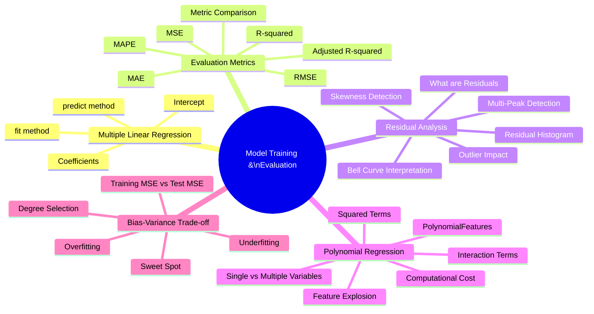
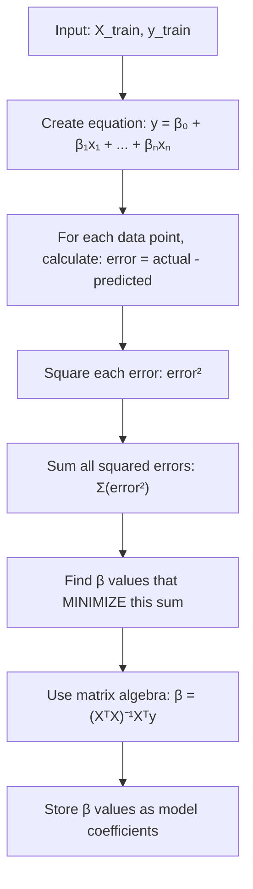
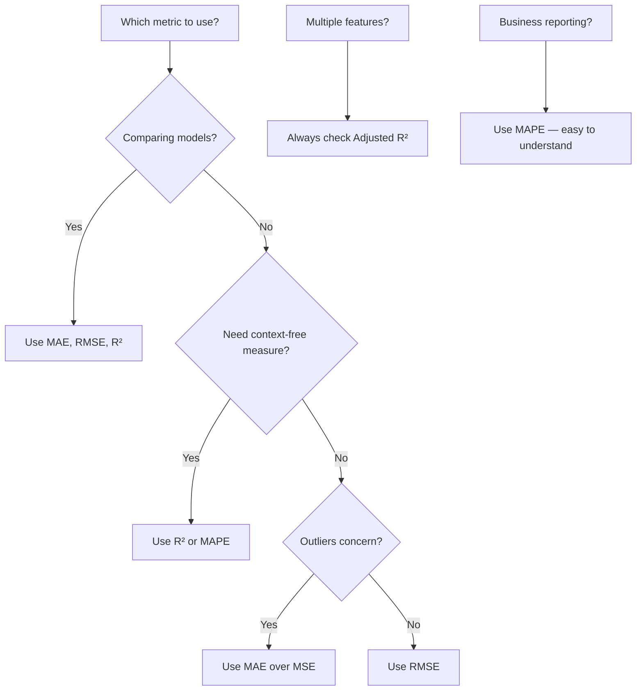
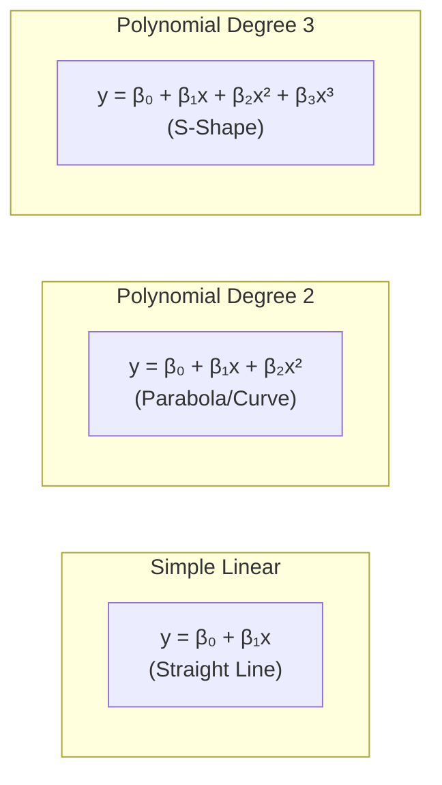
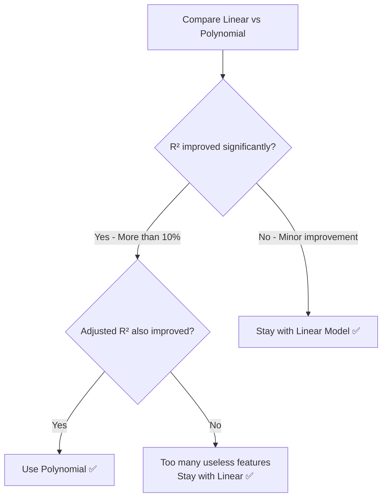
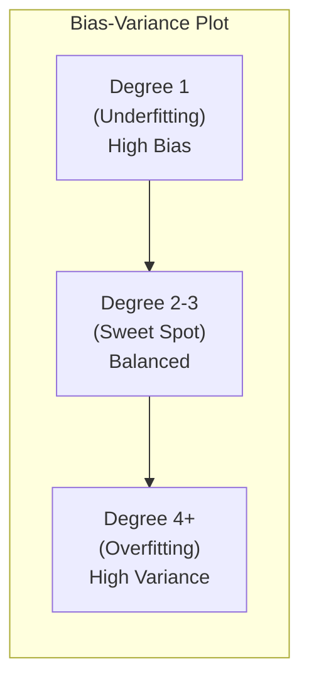
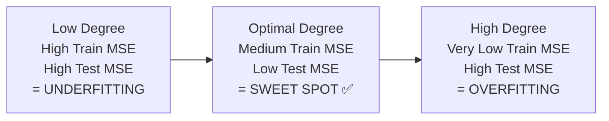

# AS27: Regression Case Study - End-to-End Pipeline - Classroom Session (Part 2)

> 📚 **This is Part 2** covering: Model Training (Multiple Linear Regression), Evaluation Metrics (MAE, MSE, RMSE, R², Adjusted R²), Residual Analysis, Polynomial Regression Deep Dive, Bias-Variance Trade-off
> 📘 **Previous:** [Part 1](./AS27_RegressionCaseStudy1.md)
> 📘 **Next:** [Part 3](./AS27_RegressionCaseStudy3.md)

---

## 🗺️ Mind Map - Part 2 Topics



---

## 🎓 Classroom Conversation (Continued)

---

**Teacher:** Okay students, welcome back! Part 1 lo mana data ready chesamu — clean, encoded, scaled, and split. Ippudu mana real game start avutundi — **Model Training and Evaluation**! 🚀

Cooking analogy continue cheddaam: ingredients ready chesamu, cutting chesamu, masala prepare chesamu. Ippudu **cooking start** cheddaam — model train chestam, taste (evaluate) chestam!

---

### Topic 8: Multiple Linear Regression — Model Training

---

**Teacher:** Mana MPG case study lo, mana features ivi:
- cylinders, displacement, horsepower, weight, acceleration, origin_japan, origin_usa

Total **7 features** unnai. Y = mpg (mileage).

Ippudu question — idi **simple linear regression** aa, **multiple linear regression** aa?

---

**Beginner Student:** Sir, simple linear regression ante oka X tho Y predict cheyyali kadha? Ikkada 7 X's unnai, so idi multiple linear regression!

---

**Teacher:** 💯 Perfect! Baaga gurthupettukunnav!

| Type | Equation | Features |
|------|----------|----------|
| **Simple Linear** | y = β₀ + β₁x | 1 feature |
| **Multiple Linear** | y = β₀ + β₁x₁ + β₂x₂ + ... + βₙxₙ | n features |
| **Polynomial** | y = β₀ + β₁x + β₂x² + β₃x³ + ... | Powers of features |

Mana MPG equation:
```
mpg = β₀ + β₁(cylinders) + β₂(displacement) + β₃(horsepower) 
    + β₄(weight) + β₅(acceleration) + β₆(origin_japan) + β₇(origin_usa)
```

Ippudu code lo chuddam:

```python
from sklearn.linear_model import LinearRegression

# Create and train the model
lr = LinearRegression()
lr.fit(X_train, y_train)

# Make predictions
y_pred = lr.predict(X_test)

# View coefficients
print("Intercept (β₀):", lr.intercept_)
print("Coefficients:", lr.coef_)
```

---

**Curious Student:** Sir, `lr.fit()` exactly internal ga emi chestundi? Oka black box laga anipistundi.

---

**Teacher:** Great question! Internally `fit()` chesetappudu **Ordinary Least Squares (OLS)** method use avutundi.

> 💡 **Jargon Alert - Ordinary Least Squares (OLS)**
> Simple Explanation: All data points ki best fit avvadaniki coefficients (β values) ni calculate chestundi. "Least Squares" ante — predicted value ki actual value ki difference (error) ni square chesi, total sum minimize chestundi.
> Example: Archery target ki closest ga arrows set cheyyali — total distance nundi center ki minimize cheyyadam laga.

**Step-by-step internal working:**



**Mathematical formula (for reference):**
```
β = (XᵀX)⁻¹Xᵀy
```

Kani meeku formula memorize cheyyalsina avasaram ledu — scikit-learn automatically chestundi. **Concept** important — model tries to find the best line (or hyperplane in multiple dimensions) that minimizes the total squared errors.

---

**Clever Student:** Sir, `lr.coef_` ichi coefficients — avi directly feature importance indicate chestaya?

---

**Teacher:** 🧠 Careful! **Direct ga not always.**

If features are **scaled** (StandardScaler use chesamu), then coefficient magnitude comparison cheyyochu — higher absolute coefficient = higher importance.

But if features are **NOT scaled**, then coefficients misleading avutai:
- weight in thousands (3000-5000 range) → small coefficient
- cylinders (4-8 range) → large coefficient
- But weight might be MORE important even with small coefficient!

**Scaling tarvata coefficients:**
```
Coefficient of weight = -5.2     → Negative: heavier car = less mileage
Coefficient of origin_usa = 3.1  → Positive: USA cars have higher coefficient
Coefficient of horsepower = -1.8 → Negative: more power = less mileage
```

Those signs and magnitudes tell you the **direction and strength** of relationship.

---

### Topic 9: Evaluation Metrics — MAE, MSE, RMSE, R², Adjusted R²

---

**Teacher:** Model train chesamu, predictions chesamu. Ippudu **"mana model bavunda, ledhaa?"** ani check cheyyali. Daaniki **evaluation metrics** use chestam.

Oka analogy: Meeru archery practice chestunnaru. Target ki arrows shoot chesaru. "Meeru bagaa shoot chesaraa?" teliyaniki:
1. **Average distance from center** = MAE
2. **Average squared distance** = MSE
3. **Root of average squared distance** = RMSE
4. **Percentage of target area covered** = R²

```python
from sklearn.metrics import mean_absolute_error, mean_squared_error, r2_score
import numpy as np

# Calculate metrics
mae = mean_absolute_error(y_test, y_pred)
mse = mean_squared_error(y_test, y_pred)
rmse = np.sqrt(mse)
r2 = r2_score(y_test, y_pred)

# Adjusted R-squared
n = len(y_test)      # number of samples
p = X_test.shape[1]  # number of features
adj_r2 = 1 - (1 - r2) * (n - 1) / (n - p - 1)

print(f"MAE: {mae:.4f}")
print(f"MSE: {mse:.4f}")
print(f"RMSE: {rmse:.4f}")
print(f"R²: {r2:.4f}")
print(f"Adjusted R²: {adj_r2:.4f}")
```

**MPG Model Results:**
```
MAE:  3.3522
MSE:  17.8943
RMSE: 4.2302
R²:   0.6636
Adjusted R²: 0.6294
```

---

**Beginner Student:** Sir, ivi anni metrics enduku? Oka danni use cheyyochu kadha?

---

**Teacher:** Each metric different story cheptundi! Anni kalisi chadivithey full picture vasthundi.

#### 📊 MAE (Mean Absolute Error)

> 💡 **Jargon Alert - MAE**
> Simple Explanation: "Average ga mana prediction entha distance lo undi actual value nundi?" Positive ga cheptundi.
> Example: Exam lo meeru 5 questions ki answers raasaru. Correct answer nundi meeru average ga 3 marks away unnaru.

**Formula:** `MAE = (1/n) × Σ|actual - predicted|`

**MPG lo MAE = 3.35** → Mana model average ga **3.35 MPG** off undi actual mileage nundi. Mileage 18-40 range lo unte, 3.35 reasonable error.

**Advantages:**
- Easy to understand — same units as target
- Not sensitive to outliers (absolute values, no squaring)

**Disadvantages:**
- Doesn't penalize large errors extra

---

#### 📊 MSE (Mean Squared Error)

> 💡 **Jargon Alert - MSE**
> Simple Explanation: "Errors ni square chesi average teesukuntam." Big errors ki heavy penalty istundi.
> Example: Office lo 5 minutes late = okay, 60 minutes late = serious problem. MSE this "seriousness" ni capture chestundi.

**Formula:** `MSE = (1/n) × Σ(actual - predicted)²`

**MPG lo MSE = 17.89** → Idi squared units (MPG²) lo undi — direct ga interpret cheyyalemu. Kani **comparison** ki useful.

**Key property:** Errors ni square chestam, so oka prediction 10 MPG off aithe → contribution = 100. Inko prediction 1 MPG off aithe → contribution = 1. Large errors **100x more impact**!

**MSE chala sensitive to outliers:**

```
Predictions: [2, 3, 2, 1, 20]  ← 20 is outlier error
MAE = (2+3+2+1+20)/5 = 5.6
MSE = (4+9+4+1+400)/5 = 83.6  ← HUGE because of outlier!
```

---

#### 📊 RMSE (Root Mean Squared Error)

> 💡 **Jargon Alert - RMSE**
> Simple Explanation: "MSE ki square root." Same units ki convert chestundi — interpret cheyyali easy.
> Example: Area ni square meters lo chepparu, kani length kavali — square root teesukuntam.

**Formula:** `RMSE = √MSE`

**MPG lo RMSE = 4.23** → MSE kanna samajh easy — 4.23 MPG average ga off untam, kani big errors ki extra weight undi.

**MAE vs RMSE Comparison:**
```
MAE  = 3.35   (treats all errors equally)
RMSE = 4.23   (penalizes large errors more)
```

RMSE > MAE **always** (or equal). Gap large aithe → **outlier errors** unnai model lo.

---

**Clever Student:** Sir, MAE 3.35 and RMSE 4.23 — ivi chusi nenu model good or bad cheppacha?

---

**Teacher:** **No!** Ivi alone chusi model quality judge cheyyalemu! 😮

**Endukante** — MAE = 3.35 MPG. Is this good?
- If MPG range is 10-50 (range = 40), then 3.35/40 = **8.4%** — decent!
- If MPG range is 3-5 (range = 2), then 3.35/2 = **167%** — terrible!

MAE, MSE, RMSE — **context-dependent**. Same data set lo **two models compare** cheyyataniki baaga useful, but alone ga "good or bad" cheeppaleeru.

That's why we need **R-squared!**

---

#### 📊 R-squared (R²) — Coefficient of Determination

> 💡 **Jargon Alert - R-squared**
> Simple Explanation: "Mana model entha percentage variance explain chestundo." 0% nundi 100% varaku.
> Example: Exam lo class topper 100% questions answer chesadu — R² = 1.0. Average student 60% chesadu — R² = 0.60.

**Formula:** `R² = 1 - (SS_residual / SS_total)`
- SS_residual = Σ(actual - predicted)²
- SS_total = Σ(actual - mean)²

**Interpretation:**
| R² Value | Quality |
|----------|---------|
| **0.90 - 1.00** | Excellent |
| **0.70 - 0.90** | Good |
| **0.50 - 0.70** | Moderate |
| **0.30 - 0.50** | Weak |
| **< 0.30** | Poor |
| **< 0** | Worse than mean! |

**MPG lo R² = 0.66** → Model **66% variance** explain chestundi. Moderate fit — room for improvement.

---

**Debate Student:** Sir, R² negative avvocha? Adi ela possible?

---

**Teacher:** Avunu! R² negative avvochu! 😱

**R² < 0 ante** → mana model **simple mean prediction kanna worse**!

Udaharanaku: If someone asks "What's the predicted MPG for this car?" and you always answer "average MPG = 23" — idi baseline. If your model's predictions are further from actual values than this mean — **negative R²!**

Mana MPG polynomial model lo K-fold cross-validation chesthe:
```python
cv_scores = cross_val_score(
    pipeline, X, y, cv=5, scoring='r2'
)
print(f"Mean R²: {cv_scores.mean():.2f}")
# Output: Mean R²: -35.61  ← NEGATIVE! Model is TERRIBLE!
```

**R² = -35.61** — idi ante model completely failed! Mean prediction kanna 35 times worse! 💀

---

**Practical Student:** Sir, interview lo "Explain R-squared" ante ela cheppali?

---

**Teacher:** Safe answer:

> **"R-squared measures the proportion of variance in the target variable that is explained by the model. An R² of 0.85 means the model captures 85% of the variability in the data. An R² of 1.0 is a perfect fit, 0 means the model is no better than predicting the mean, and negative R² means the model is worse than the mean."**

---

#### 📊 Adjusted R-squared

---

**Teacher:** Ippudu oka tricky scenario chuddam. R² lo oka **fundamental flaw** undi.

**Flaw:** Meeru oka NEW feature add chesthe — adi completely useless aithe kuda — **R² will NEVER decrease. It either stays same or increases!**

---

**Beginner Student:** Sir, adi wrong kadha? Useless feature add chesthe accuracy perougu ante adi manaki misleading!

---

**Teacher:** Exactly! 🎯 That's why **Adjusted R²** vasthundi!

> 💡 **Jargon Alert - Adjusted R-squared**
> Simple Explanation: "R-squared laga ne, kani useless features add chesthe PENALIZE chestundi." Only genuinely useful features add chesthe increase avutundi.
> Example: Cricket team lo extra player add chesaru — kani adi contribute cheyyakunda field lo standing — team efficiency drop avutundi. Adjusted R² idi capture chestundi.

**Formula:**
```
Adjusted R² = 1 - [(1 - R²)(n - 1)] / (n - p - 1)

where:
n = number of samples
p = number of features
```

**MPG Results:**
```
R²         = 0.6636
Adjusted R² = 0.6294
```

Difference = 0.034 — idi manageable. Kani polynomial regression lo chuddam:

```
Linear Model:      R² = 0.66, Adjusted R² = 0.63
Polynomial Model:  R² = 0.67, Adjusted R² = 0.37  ← HUGE DROP!
```

R² slightly improved (0.66 → 0.67), but Adjusted R² **drastically dropped** (0.63 → 0.37)!

**This tells us:** Polynomial model added MANY new features (squared terms, interaction terms), but most of them are NOT useful. Model is getting penalized for unnecessary complexity!

---

**Critique Student:** Sir, ante Adjusted R² always R² kanna takkuva untundi? Same avvocha?

---

**Teacher:** 

- **Adjusted R² ≤ R²** always (or equal when features are very useful)
- **When R² ≈ Adjusted R²** → All features are contributing — GOOD!
- **When R² >> Adjusted R²** → Too many useless features — BAD! Remove them!

Diamond dataset example:
```
R² = 0.92, Adjusted R² = 0.92  ← Almost same! Features are useful!
```

---

#### 📊 MAPE (Mean Absolute Percentage Error)

---

**Teacher:** House Price case study lo oka more metric use chesamu — **MAPE**:

```python
mape = np.mean(np.abs((y_test - y_pred) / y_test)) * 100
print(f"MAPE: {mape:.2f}%")
```

> 💡 **Jargon Alert - MAPE**
> Simple Explanation: "Average percentage error." Rs. 500,000 house ki Rs. 50,000 error (10%) vs Rs. 10,000,000 house ki Rs. 50,000 error (0.5%). Same absolute error, different percentage impact!
> Example: Rs. 10 takkuva vachinai salary Rs. 10,000 lo = 0.1%. Rs. 10 takkuva pocket money Rs. 100 lo = 10%.

**MAPE advantages:**
- Scale-independent — different price ranges compare cheyyochu
- Easy to communicate to business: "Our model is off by 4.2% on average"

**MAPE formula:** `MAPE = (1/n) × Σ|actual - predicted| / |actual| × 100`

---

**Practical Student:** Sir, House Price model lo business goal undhi kadha — "80% predictions within 10% accuracy." Adi ela check chestam?

---

**Teacher:** Good question! Code lo:

```python
# Check business goal
percentage_errors = np.abs((y_test - y_pred) / y_test) * 100
within_10pct = (percentage_errors <= 10).sum() / len(y_test) * 100
print(f"{within_10pct:.1f}% of predictions within 10% of actual price")
# Output: 85.2% of predictions within 10% → GOAL ACHIEVED! ✅
```

**Business language lo:**
> "Our model predicts house prices within 10% accuracy for 85% of properties, exceeding the 80% target."

This is how you communicate ML results to non-technical stakeholders! 📊

---

### All Metrics Comparison Table

---

**Teacher:** Ippudu oka comprehensive comparison chuddam:

| Metric | Formula | Range | Interpretation | Sensitive to Outliers? |
|--------|---------|-------|---------------|----------------------|
| **MAE** | Σ\|error\|/n | 0 to ∞ | Average absolute error | No |
| **MSE** | Σ(error²)/n | 0 to ∞ | Average squared error | **YES** (very!) |
| **RMSE** | √MSE | 0 to ∞ | Square root of MSE | **YES** |
| **R²** | 1 - SS_res/SS_tot | -∞ to 1 | % variance explained | Somewhat |
| **Adj R²** | Penalized R² | -∞ to 1 | Penalizes extra features | Somewhat |
| **MAPE** | Σ(\|error\|/\|actual\|)/n × 100 | 0 to ∞ | Average % error | No |



---

### Topic 10: Residual Analysis

---

**Teacher:** Metrics numbers cheppai, but **residual plots** visual ga model quality cheptai. Idi chala powerful diagnostic tool!

> 💡 **Jargon Alert - Residuals**
> Simple Explanation: "Error" — actual value minus predicted value. Positive residual = model underestimated. Negative residual = model overestimated.
> Example: Meeru 80 marks vasthay ani predict chesaru, actual ga 85 vasthe → residual = 85 - 80 = +5 (under-predicted).

```python
# Calculate residuals
residuals = y_test - y_pred

# Plot residual histogram
plt.figure(figsize=(10, 5))
plt.hist(residuals, bins=20, edgecolor='black')
plt.xlabel('Residual (Actual - Predicted)')
plt.ylabel('Frequency')
plt.title('Residual Distribution')
plt.axvline(x=0, color='red', linestyle='--', label='Zero Error')
plt.legend()
plt.show()
```

---

**Beginner Student:** Sir, histogram chusi emi artham chesukovali?

---

**Teacher:** Idhi chala important question! 4 scenarios lo chuddam:

#### Scenario 1: Perfect Bell Curve centered at 0 ✅
```
        ▲
       ████
      ██████
     ████████
    ██████████
   ████████████
  ██████████████
-10  -5  0  5  10
```
**Meaning:** Errors normally distributed, centered at zero. **Model is performing well!** Unbiased predictions.

#### Scenario 2: Skewed to Left or Right ⚠️
```
          ▲
         ████
        ██████
       ████████
      ██████████
     ████████████
    ██████████████████████
-20  -10  0  5  10
```
**Meaning:** Model systematically **over-predicting or under-predicting**. Model is **biased**.

#### Scenario 3: Wide Spread 📊
```
  ▲
 ██
 ████
 ██████
 ████████████████████████████████████████
-50     -25      0      25      50
```
**meaning:** Large prediction errors. Model has **poor accuracy** or **too much variance**.

#### Scenario 4: Multiple Peaks 🔴
```
        ▲        ▲
       ████     ████
      ██████   ██████
     ████████ ████████
-10  -5  0  5  10  15
```
**Meaning:** Model is **missing non-linear relationships**. Linear model undali kani data non-linear. Polynomial regression try cheyyali!

---

**Teacher:** Mana MPG model residual histogram chuddam:

MPG **Linear Model** → Approximate bell shape, centered near 0. ✅ Reasonable fit.
MPG **Polynomial Model** → Tighter distribution, slightly more centered. ✅ Slight improvement.

Diamond **Linear Model** → Nice bell curve, centered at 0. ✅ Good fit.
Diamond **Polynomial Model** → Highly skewed! Long tail on right side. ⚠️ Outliers causing problems!

---

**Critique Student:** Sir, Diamond polynomial model lo long tail vasthundi ante — adi outliers valla aa? Avi ela handle cheyyali?

---

**Teacher:** Correct! 💪 

Diamond dataset lo konni diamonds kottai unusual prices unnai — extremely expensive or extremely cheap. These **outliers** cause:
1. Large residuals (errors of -30,000, -20,000)
2. MSE drastically increases (since errors are squared)
3. Residual histogram shows **long tail**

**Outlier handling strategies:**

| Strategy | Approach | When to Use |
|----------|----------|-------------|
| **Remove outliers** | Drop data points > 3 standard deviations | Clear data errors |
| **Log-transform target** | `y = log(price)` | Right-skewed target |
| **Robust models** | Use Random Forest instead of Linear | Outlier-sensitive model |
| **Separate models** | Different model for different price tiers | Clear segments |
| **Winsorize** | Cap extreme values at percentile | Preserve data points |

From the house price pre-read material:
```python
# Log transformation makes skewed prices more normal
plt.hist(np.log(df['price']), bins=50, edgecolor='black')
plt.title('Log-Transformed Price Distribution')
```

---

**Curious Student:** Sir, residual plot chusi kuda mana model good ani decide cheyyocha? Only histogram saripodha?

---

**Teacher:** Good thinking! Actually **two types** of residual plots useful:

**1. Residual Histogram** — Distribution check (normality)
**2. Residual vs Predicted Scatter Plot** — Pattern check (homoscedasticity)

```python
# Scatter plot: Predicted vs Residuals
plt.scatter(y_pred, residuals, alpha=0.5)
plt.axhline(y=0, color='r', linestyle='--')
plt.xlabel('Predicted Price')
plt.ylabel('Residual')
plt.title('Residual vs Predicted')
```

**Good scatter plot:** Random cloud around 0, no pattern.
**Bad scatter plot:** Fan shape (errors increase with predicted value) → **heteroscedasticity** — model doesn't capture all structure.

> 💡 **Jargon Alert - Homoscedasticity**
> Simple Explanation: "Errors oka constant range lo untai — predicted value toh related kaadu." Small house ki error same range, big house ki kuda same range.
> Example: Weighing machine lo error always ±0.5 kg — 10 kg weight ki kani 100 kg weight ki kani same error.

> 💡 **Jargon Alert - Heteroscedasticity**
> Simple Explanation: "Errors change avutai predicted value tho." Expensive houses ki error pedda, cheap houses ki error chinna.
> Example: Student marks ki prediction — topper marks accurately predict avutai, average student marks widely vary avutai.

---

### Topic 11: Polynomial Regression — Deep Dive

---

**Teacher:** Mana linear model R² = 0.66 vasthundi MPG dataset lo. Idi moderate. Can we improve?

**Strategy:** Model complexity increase cheddaam — **Polynomial Regression** try cheddaam!

But mundu oka important distinction artham chesukondaam...

---

**Beginner Student:** Sir, polynomial regression ante exactly emi? Linear regression kanna emi different?

---

**Teacher:** 💡 Chala simple ga cheptaa.

**Linear Regression:**
```
y = β₀ + β₁x
```
Idi oka **straight line** draw chestundi. If relationship between x and y is curved, line properly fit avvadhu.

**Polynomial Regression (degree 2):**
```
y = β₀ + β₁x + β₂x²
```
Idi oka **curve** draw chestundi. Quadratic curve — oka parabola shape.

**Polynomial Regression (degree 3):**
```
y = β₀ + β₁x + β₂x² + β₃x³
```
More complex curve — S-shape possible.



**But wait!** Mana problem lo single x kaadu — 7 features unnai! So idi **Multiple Polynomial Regression** avutundi.

---

**Clever Student:** Sir, multiple variables tho polynomial regression chesthe equation ela untundi? Only squares add avutaya?

---

**Teacher:** Chala important question! 🔥 Single variable ki easy undhi, but multiple variables ki chala complex avutundi.

**Single variable, degree 2:**
```
y = β₀ + β₁x + β₂x²
```

**Multiple variables (x₁, x₂, x₃...), degree 2:**
```
y = β₀ 
  + β₁x₁ + β₂x₂ + β₃x₃ + β₄x₄ + β₅x₅           ← Linear terms
  + β₆x₁² + β₇x₂² + β₈x₃² + β₉x₄² + β₁₀x₅²     ← Squared terms
  + β₁₁x₁x₂ + β₁₂x₁x₃ + β₁₃x₁x₄ + β₁₄x₁x₅      ← Interaction terms
  + β₁₅x₂x₃ + β₁₆x₂x₄ + β₁₇x₂x₅
  + β₁₈x₃x₄ + β₁₉x₃x₅
  + β₂₀x₄x₅
```

**3 types of terms added:**
1. **Linear terms:** x₁, x₂, x₃, ...
2. **Squared terms:** x₁², x₂², x₃², ...
3. **Interaction terms:** x₁×x₂, x₁×x₃, x₂×x₃, ...

Mana MPG example lo lecture transcript lo exact idi discuss chesamu:

```
mpg = β₀ + β₁(cylinders) + β₂(displacement) + β₃(horsepower) 
    + β₄(weight) + β₅(acceleration)
    + β₆(cylinders²) + β₇(displacement²) + β₈(horsepower²) 
    + β₉(weight²) + β₁₀(acceleration²)
    + β₁₁(cylinders × displacement) + β₁₂(cylinders × horsepower) 
    + β₁₃(cylinders × weight) + ...
```

---

**Curious Student:** Sir, interaction terms enduku? `cylinders × displacement` product ki emi meaning undi?

---

**Teacher:** Excellent question! 🧠

**Interaction terms capture COMBINED effects** that individual features miss.

Udaharanaku:
- **cylinders alone** → More cylinders = less mileage (each cylinder consumes fuel)
- **displacement alone** → Larger displacement = less mileage
- **cylinders × displacement** → When BOTH are high together — combined effect on mileage might be DIFFERENT from what each alone predicts!

**Real-world analogy:**
- Medicine A alone = mild effect
- Medicine B alone = mild effect
- Medicine A + Medicine B together = VERY STRONG effect (synergistic interaction!)

The model tries to capture: "High cylinder car WITH high displacement — idi EXTRA impact create chestundi on mileage, beyond what each feature individually contributes."

From our lecture transcript:
> "If cylinders are high AND origin is Japan → positive mileage impact"
> "If cylinders are high AND origin is USA → negative mileage impact"

These are interaction effects!

---

**Teacher:** Code lo chuddam:

```python
from sklearn.preprocessing import PolynomialFeatures

# Create polynomial features (degree 2)
poly = PolynomialFeatures(degree=2)
X_poly_train = poly.fit_transform(X_train)
X_poly_test = poly.transform(X_test)

# Fit linear regression on polynomial features
lr_poly = LinearRegression()
lr_poly.fit(X_poly_train, y_train)
y_pred_poly = lr_poly.predict(X_poly_test)

# Check feature count
print(f"Original features: {X_train.shape[1]}")
print(f"Polynomial features: {X_poly_train.shape[1]}")
```

**Output:**
```
Original features: 7
Polynomial features: 36  ← From 7 to 36!
```

> 💡 **Jargon Alert - PolynomialFeatures**
> Simple Explanation: Existing features nundi automatic ga new features generate chestundi — squares, cubes, and all combinations.
> Example: 3 ingredients (salt, pepper, chilli) tho — individual ga taste cheyyochu, pairs (salt+pepper, salt+chilli, pepper+chilli) cheyyochu, triple (salt+pepper+chilli) cheyyochu. PolynomialFeatures anni combinations create chestundi.

**Feature explosion formula for degree d with n features:**
```
Number of features = C(n + d, d) = (n + d)! / (n! × d!)

For n=7, d=2: C(9, 2) = 36 features
For n=7, d=3: C(10, 3) = 120 features
For n=7, d=4: C(11, 4) = 330 features
```

---

**Critique Student:** Sir, 7 features nundi 36 ayyindi degree 2 ki. Degree 3 chesthe 120, degree 4 chesthe 330! Idi too many kadha? Overfitting avvadha?

---

**Teacher:** **Spot on!** 💯 Idi polynomial regression yooka **biggest disadvantage** — **Feature Explosion!**

| Original Features | Degree | New Features | Increase |
|-------------------|--------|-------------|----------|
| 7 | 1 | 7 | 1x |
| 7 | 2 | 36 | 5x |
| 7 | 3 | 120 | 17x |
| 7 | 4 | 330 | 47x |
| 7 | 5 | 792 | 113x |
| 23 (Diamond) | 2 | 300 | 13x |
| 23 (Diamond) | 3 | 2,600 | 113x |

Diamond dataset lo degree 3 chesthe — 2,600 features! 53,940 data points tho — ratio = 20:1. Manageable kani tight.

**Plus computation time exponentially increases!** Transcript lo teacher chepparu:
> "It takes a lot of time, especially if you are going in higher degrees. Because a lot of combinations will be created."

---

### Topic 12: Polynomial Regression Results — MPG Case Study

---

**Teacher:** Ippudu MPG dataset lo polynomial regression results compare cheddaam:

| Metric | Linear Model | Polynomial Model (degree 2) |
|--------|-------------|---------------------------|
| **MAE** | 3.35 | 2.95 |
| **MSE** | 17.89 | ~15.50 |
| **RMSE** | 4.23 | ~3.94 |
| **R²** | 0.66 | 0.67 |
| **Adjusted R²** | 0.63 | 0.37 ← **HUGE DROP!** |

---

**Debate Student:** Sir, MAE and MSE improved, kani Adjusted R² drastically dropped! Adi confusing — model improve ayyinda leda?

---

**Teacher:** 🔥 This is the KEY insight of today's class!

**R² slightly improved** (0.66 → 0.67) — yes, model captures 1% more variance.
**Adjusted R² drastically dropped** (0.63 → 0.37) — model was **penalized** for adding too many useless features!

**What does this mean practically?**

Adjusted R² is telling you: *"Hey, you added 29 new features (from 7 to 36), but most of them are NOT useful. The tiny improvement in R² is NOT worth the massive increase in complexity."*

**Decision framework:**



**Our conclusion for MPG:**
- Improvement is **nominal** (1% R² gain)
- Adjusted R² **drastically dropped** — penalty for useless features
- Computational cost **increased significantly**
- **Verdict: Stay with Multiple Linear Regression!** ✅

---

**Practical Student:** Sir, interview lo "When to use polynomial regression?" ante ela answer ivvali?

---

**Teacher:** Perfect interview answer:

> **"Use polynomial regression when:**
> 1. **Simple linear model gives low R²** (below 0.5)
> 2. **Residual plot shows clear patterns** (curved, not random)
> 3. **Domain knowledge suggests non-linear relationships** (e.g., diminishing returns)
> 4. **ALWAYS start with degree 2** and check bias-variance plot
> 5. **Check Adjusted R²** — if it drops, polynomial is not worth it
> 6. **Consider computational cost** — more features = more time and memory"

---

### Topic 13: Diamond Dataset — Polynomial Regression Challenges

---

**Teacher:** Diamond dataset lo oka different scenario chuddam. Ikkada pedda dataset undi — 53,940 entries!

**Problem:** Polynomial regression degree 2 ki kuda — **computational time chala ekkuva!**

```python
# Diamond dataset — Polynomial approach
# Too many entries for polynomial — reduce to 5,000 for demo
X_train_small = X_train[:5000]
y_train_small = y_train[:5000]
X_test_small = X_test[:1000]
y_test_small = y_test[:1000]

poly = PolynomialFeatures(degree=2)
X_poly_train = poly.fit_transform(X_train_small)
X_poly_test = poly.transform(X_test_small)

lr_poly = LinearRegression()
lr_poly.fit(X_poly_train, y_train_small)
```

---

**Critique Student:** Sir, 53,940 nundi 5,000 ki reduce chesaru! Adi data waste kadha? Different 5,000 choose chesthe different results vasthay kadha?

---

**Teacher:** 💯 Absolutely valid concern! Mana instructor kuda exact idi acknowledge chesaru:

> "This is just because of the computational issue. I want to show the live demo, so I don't want you to wait for a long time."

**Real-world lo**: Meeru full data use cheyyali. Kani demo kosam reduced.

**If you reduce data**, always use **K-Fold Cross-Validation** on the reduced set — different portions test avutai, so single unlucky split avoid avutundi.

**Diamond Polynomial Results:**
```
Linear Model:      R² = 0.92, Adjusted R² = 0.92
Polynomial Model:  R² = 0.83, Adjusted R² = 0.79  ← WORSE!
```

**Polynomial model WORSE ayyindi!** 😱

---

**Beginner Student:** Sir, polynomial supposed to be better kadha? Enduku worse ayyindi?

---

**Teacher:** Chala important lesson idi! **More complex ≠ Always better!**

Diamond dataset lo polynomial worse ayyindi because:
1. **Reduced data** (5,000 instead of 53,940) — less training data
2. **Feature explosion** — 23 features → 300+ polynomial features with only 5,000 data points
3. **Outlier sensitivity** — polynomial curves extreme values ki overreact chestai
4. **Residual plot** showed **long tail** — outlier diamonds causing huge errors

**Key lesson from instructor:**
> "Should we always go for polynomial regression? NO. You should not use polynomial because some values could be far from actual ones. That's why MSE is so huge."

---

### Topic 14: Bias-Variance Trade-off — Degree Selection

---

**Teacher:** Ippudu ML lo **most important concept** discuss cheddaam — **Bias-Variance Trade-off**!

> 💡 **Jargon Alert - Bias-Variance Trade-off**
> Simple Explanation: Simple model = high bias (underfitting), Complex model = high variance (overfitting). Perfect model is in between.
> Example: Exam preparation — too little study = don't know answers (bias). Too much rote memorization = can't handle new questions (variance). Balanced study = understands concepts AND answers new questions.

---

**Teacher:** Degree selection ki, meemu oka plot draw chestam — **Training MSE and Test MSE vs Polynomial Degree**:

```python
train_mses = []
test_mses = []
degrees = range(1, 8)

for d in degrees:
    poly = PolynomialFeatures(degree=d)
    X_poly_train = poly.fit_transform(X_train)
    X_poly_test = poly.transform(X_test)
    
    lr = LinearRegression()
    lr.fit(X_poly_train, y_train)
    
    train_mse = mean_squared_error(y_train, lr.predict(X_poly_train))
    test_mse = mean_squared_error(y_test, lr.predict(X_poly_test))
    
    train_mses.append(train_mse)
    test_mses.append(test_mse)

plt.plot(degrees, train_mses, 'b-o', label='Training MSE')
plt.plot(degrees, test_mses, 'r-o', label='Test MSE')
plt.xlabel('Polynomial Degree')
plt.ylabel('MSE')
plt.legend()
plt.title('Bias-Variance Trade-off')
plt.show()
```

---

**Teacher:** Idi plot chuste:



| Degree | Training MSE | Test MSE | Status |
|--------|-------------|----------|--------|
| 1 | High | High | **Underfitting** (too simple) |
| 2 | Medium | Medium-Low | **Sweet Spot** ✅ |
| 3 | Lower | Medium | Still okay |
| 4 | Very Low | **HIGH** | **Overfitting** starts! ⚠️ |
| 5+ | Near 0 | **VERY HIGH** | **Severe Overfitting** 🔴 |

---

**Beginner Student:** Sir, training MSE always decrease avutundi kadha degree increase chesthe? But test MSE first decrease chesi tarvata increase avutunda?

---

**Teacher:** 💯 **Perfectly observed!**

**Training MSE** → **Always decreases** (or stays same) as degree increases. Endukante — more complex model training data ki inka better fit avutundi. Degree 100 chesthe training data ki almost perfect fit avutundi!

**Test MSE** → **First decreases, then increases!** U-shape curve form avutundi.
- First decrease: Model complexity increasing → captures real patterns → test error decreases
- Then increase: Model too complex → memorizes training noise → test error increases (overfitting!)



**Optimal degree = where Test MSE is MINIMUM!**

From our lecture:
> "Based on this plot, polynomial degree of 2 or 3 appears to be a good balance between bias and variance, as the test error is minimized around these degrees."

---

**Clever Student:** Sir, training MSE chusi degree decide cheyyakudadu — test MSE chudali. Adi correct kadha?

---

**Teacher:** **135% correct!** 

> 🔴 **GOLDEN RULE: NEVER use training error alone to decide model complexity!**

Training error is like studying from the answer key — meeru answers memorize chesaru, but new questions answer cheyyagalara teliyadhu!

**Always use test MSE (or better, cross-validation score) to decide degree.**

From instructor's words:
> "This is training MSE. Training MSE should NOT be used for dictating the degree of polynomial. We should use validation or testing MSE."

---

**Practical Student:** Sir, interview lo bias-variance trade-off explain cheyyamante — short ga ela cheppali?

---

**Teacher:** 💼 Perfect answer:

> **"The bias-variance trade-off is the balance between:**
> - **High bias (underfitting):** Model is too simple, misses real patterns, performs poorly on both training and test data
> - **High variance (overfitting):** Model is too complex, memorizes training data including noise, performs well on training but poorly on new data
> 
> **The optimal model has low bias AND low variance.** We find this sweet spot by plotting training vs test error across model complexities (e.g., polynomial degrees) and selecting where test error is minimized.
> 
> **In practice:** Start with a simple model, gradually increase complexity, and monitor test/validation performance. Cross-validation provides reliable estimates."

---

**Debate Student:** Sir, instead of polynomial regression, PCA use chesi features reduce chesthe help avvadha?

---

**Teacher:** Good question! Mana instructor idi class lo directly answer chesaru:

> **"PCA is generally NOT recommended for regression."**

**Why?**
1. PCA reduces features — kani actual meaning of features goes away
2. Regression lo meeku teliyanidi — "which feature impacts Y most?" — PCA tarvata idi answer cheyyalemu
3. Regression lo **interpretability** chala important

**When PCA is useful:**
- 500-1000+ features unnappudu
- Meeku feature importance avasaram lekappudu
- Image/text data lanti high-dimensional data ki

**For our case studies (7-23 features):** PCA avasaram ledu. Feature selection VIF tho cheyyochu.

---

## 📝 Part 2 Summary

**Teacher:** Part 2 lo memu cover chesindi:

### Key Takeaways
1. **Multiple Linear Regression** = Multiple features tho linear relationship model cheyyadam
2. **MAE, MSE, RMSE** — error metrics. MAE simplest, MSE penalizes outliers, RMSE in same units
3. **R²** — variance explained percentage. 0.66 = 66% explained. Can be negative (worse than mean!)
4. **Adjusted R²** — penalizes useless features. If R² >> Adjusted R², too many useless features
5. **Residual Analysis** — Bell curve at 0 = good. Skewed = biased. Multiple peaks = non-linearity missed
6. **Polynomial Regression** — adds squared, interaction terms. Feature explosion risk!
7. **MPG: Polynomial didn't help much** — nominal R² improvement, huge Adjusted R² drop
8. **Diamond: Polynomial made it WORSE** — outliers, reduced data, feature explosion
9. **Bias-Variance Trade-off** — sweet spot where test MSE is minimum
10. **NEVER decide degree from training MSE alone** — always use test/validation MSE

### Common Mistakes
- **Mistake 1:** Using only R² (not Adjusted R²) with many features → Misleading → **Always check Adjusted R²**
- **Mistake 2:** Choosing polynomial degree from training MSE → Overfitting → **Use test MSE**
- **Mistake 3:** Assuming polynomial is always better → Not true for outlier-rich data → **Compare holistically**
- **Mistake 4:** Ignoring residual plots → Missing model problems → **Always visualize residuals**
- **Mistake 5:** Not considering computational cost of polynomial → Very expensive → **Cost-benefit analysis**
- **Mistake 6:** Comparing MAE/MSE across different datasets → Scale-dependent → **Use R² or MAPE for cross-dataset comparison**

---

> 📘 **Continue to [Part 3](./AS27_RegressionCaseStudy3.md)** for: Cross-Validation, Feature Importance, Model Comparison, Deployment, and Case Studies Summary
