# AS27: Regression Case Study - End-to-End Pipeline - Classroom Session (Part 3)

> 📚 **This is Part 3** covering: Cross-Validation, Feature Importance & Coefficient Interpretation, Model Comparison, Model Deployment, Case Studies Summary
> 📘 **Previous:** [Part 1](./AS27_RegressionCaseStudy1.md), [Part 2](./AS27_RegressionCaseStudy2.md)

---

## 🗺️ Mind Map - Part 3 Topics


---

## 🎓 Classroom Conversation (Continued)

---

**Teacher:** Welcome back students! Part 2 lo model training, evaluation metrics, residual analysis, polynomial regression, and bias-variance trade-off cover chesamu. Ippudu mana journey lo **most practical and industry-relevant** topics ki velldam — Cross-Validation, Feature Importance, Model Comparison, and Deployment! 🚀

---

### Topic 15: Cross-Validation — K-Fold

---

**Teacher:** Part 2 lo mana Critique Student oka chala valid question adigadu — "Oka fixed 80-20 split lo unlucky avvochu kadha?" Remember?

Idi exact ga why **Cross-Validation** vasthundi!

Oka analogy: Meeru oka teacher ni evaluate cheyyali. Oka class lo ONE exam conduct cheste — students luckyga easy paper vasthey teacher good ani anukuntaru. But if meeru **5 different exams** conduct chesthe, average score → **reliable evaluation**!

K-Fold Cross-Validation exactly idi chestundi:


---

**Beginner Student:** Sir, 5-Fold ante data ni 5 equal parts ki divide chestama? Each part oka sari test set avutunda?

---

**Teacher:** 💯 Exactly correct! Chala simple ga cheptaa:

> 💡 **Jargon Alert - K-Fold Cross-Validation**
> Simple Explanation: Data ni K equal parts (folds) ki divide chestam. Each turn lo 1 part testing ki, remaining K-1 parts training ki use avutai. K times repeat chestam. Average score final answer.
> Example: 5 friends lo — each friend oka turn lo examiner avutundi, remaining 4 students avutaru. 5 rounds end lo average score teesukuntam.

**Step-by-step:**

| Iteration | Training Folds | Test Fold | R² Score |
|-----------|---------------|-----------|----------|
| 1 | Folds 2,3,4,5 | Fold 1 | 0.62 |
| 2 | Folds 1,3,4,5 | Fold 2 | 0.68 |
| 3 | Folds 1,2,4,5 | Fold 3 | 0.59 |
| 4 | Folds 1,2,3,5 | Fold 4 | 0.71 |
| 5 | Folds 1,2,3,4 | Fold 5 | 0.64 |
| **Average** | | | **0.648** |

**Average R² = 0.648** — idi MORE RELIABLE than single split R² = 0.66!

---

**Teacher:** Code lo chuddam:

```python
from sklearn.model_selection import cross_val_score

# Create model
lr = LinearRegression()

# 5-Fold Cross-Validation
cv_scores = cross_val_score(lr, X, y, cv=5, scoring='r2')

print(f"CV Scores: {cv_scores}")
print(f"Mean CV Score: {cv_scores.mean():.4f}")
print(f"Std CV Score: {cv_scores.std():.4f}")
```

**Output:**
```
CV Scores: [0.62, 0.68, 0.59, 0.71, 0.64]
Mean CV Score: 0.6480
Std CV Score: 0.0432
```

---

**Curious Student:** Sir, `scoring='r2'` ante R² use chestundi. Kani `scoring='neg_mean_squared_error'` lo aa "neg" enduku? Negative MSE?

---

**Teacher:** Chala important doubt! 🎯

Scikit-learn lo convention undi — **higher score = better model**. R² lo idi natural — 0.95 > 0.80, so higher is better. ✅

But MSE lo — **lower is better** (takkuva error = better). Scikit-learn wants "higher = better", so MSE ni **negate** chestundi — negative sign vestundi.

```python
# MSE scoring — returns NEGATIVE MSE
cv_mse_scores = cross_val_score(lr, X, y, cv=5, scoring='neg_mean_squared_error')
print(cv_mse_scores)
# Output: [-18.2, -15.6, -22.1, -14.3, -19.8]

# Convert to actual MSE
actual_mse = -cv_mse_scores.mean()
print(f"Mean MSE: {actual_mse:.2f}")
# Output: Mean MSE: 18.0
```

> 💡 **Jargon Alert - neg_mean_squared_error**
> Simple Explanation: MSE ki minus sign pedtaru — endukante scikit-learn lo "higher score = better" rule undi. MSE low good, so negative cheyyali.
> Example: Golf lo low score wins. Kani oka leaderboard only "highest first" show chestundi ante — scores ni negative chesi, highest negative score = lowest actual score = winner!

---

**Clever Student:** Sir, K value emiti choose cheyyali? K=5 standard aa, K=10 better aa?

---

**Teacher:** Good question! 

| K Value | Pros | Cons | When to Use |
|---------|------|------|-------------|
| **K=5** | Fast, good balance | Slightly higher variance | **Default choice, most datasets** |
| **K=10** | More reliable estimates | 2x slower than K=5 | Large datasets (10,000+) |
| **K=3** | Very fast | Less reliable | Very large datasets (100,000+) |
| **LOOCV (K=n)** | Uses maximum data for training | Very slow, high variance | Very small datasets (<100) |
| **Stratified K-Fold** | Preserves target distribution | Slightly more complex | Imbalanced data / classification |

> 💡 **Jargon Alert - LOOCV (Leave-One-Out Cross-Validation)**
> Simple Explanation: Each time 1 data point test set, remaining all training. N data points unte N rounds.
> Example: 100 students lo — 1 student exam istundi, 99 students group study chestaru. 100 rounds complete avutai.

**Standard practice:** K=5 is default. K=10 if you want more reliability and have compute time.

From our lecture:
> "We used K=5 — it's the standard default. Each fold uses 80% training, 20% testing."

---

**Critique Student:** Sir, cross-validation chesthe single number vasthundi (mean R² = 0.648). But different folds ki different scores vasthunnayi (0.59 to 0.71 range). Aa variation important kadha?

---

**Teacher:** 💯 **CHALA important!** Standard deviation chudali — adi model **stability** cheptundi.

```
Mean R² = 0.648, Std = 0.043
```

**Interpretation:**
- Low std (< 0.05): Model is **stable** — performs similarly across different data splits ✅
- High std (> 0.1): Model is **unstable** — performance varies a lot with data 😰

**If std is high:**
- Model might be overfitting to specific patterns in certain folds
- More data needed, or simpler model needed

**Practical rule:**
```
Report: "Mean R² = 0.65 ± 0.04 (5-Fold CV)"
```

That "± 0.04" gives confidence interval — model will perform between 0.61 and 0.69 on new data.

---

**Practical Student:** Sir, interview lo "Why do we use cross-validation?" ante:

---

**Teacher:** 

> **"Cross-validation is used because a single train-test split can be misleading — the result depends on which points end up in training vs test. K-Fold CV addresses this by:**
> 1. **Splitting data into K folds**
> 2. **Training K times**, each time using a different fold as test set
> 3. **Averaging results** for a more reliable performance estimate
> 4. **Also shows model stability** through standard deviation of scores
> 
> **It answers: 'Will this model generalize to new, unseen data?'"**

---

### Topic 16: Feature Importance & Coefficient Interpretation

---

**Teacher:** Model build chesamu, evaluate chesamu. Ippudu business insights extract cheddaam — **"Which features matter most?"**

Idi ML lo chala important — endukante:
1. **Business understanding:** Which factors drive the outcome?
2. **Feature selection:** Which features to keep/remove?
3. **Actionable insights:** What can business change to improve outcomes?

---

**Teacher:** MPG Model Coefficients:

```python
# Get coefficients
coef_df = pd.DataFrame({
    'Feature': X.columns,
    'Coefficient': lr.coef_
}).sort_values(by='Coefficient', ascending=False)

print(coef_df)
```

**Output (scaled features):**

| Feature | Coefficient |
|---------|------------|
| origin_japan | +3.85 |
| origin_usa | +1.24 |
| acceleration | +0.92 |
| model_year | +0.75 |
| cylinders | -0.45 |
| displacement | -1.68 |
| horsepower | -2.12 |
| weight | -5.78 |

---

**Beginner Student:** Sir, ivi numbers chusi emi artham chesukovali?

---

**Teacher:** Chala simple ga cheptaa! Each coefficient tells you:
- **Sign (+ or -):** Direction of relationship
- **Magnitude:** Strength of impact

**Interpretation:**

1. **weight = -5.78** (Strongest negative)
   - "Every 1 standard deviation increase in weight → mpg drops by 5.78"
   - **Heavier car = Much less mileage** 🚗💨
   - Weight is the MOST important factor!

2. **horsepower = -2.12** (Negative)
   - "More powerful engine = less mileage"
   - Makes physical sense — more power needs more fuel

3. **origin_japan = +3.85** (Strongest positive)
   - "Japanese cars have 3.85 MPG MORE than European cars (reference category)"
   - Japanese engineering focuses on fuel efficiency!

4. **acceleration = +0.92** (Positive)
   - "Slower acceleration = better mileage"
   - Higher acceleration number means more seconds to reach 60mph = slower car = less fuel

---

**Clever Student:** Sir, "origin_japan = +3.85" — idi relative to origin_europe kadha? Because `drop_first=True` use chesamu, so europe is reference!

---

**Teacher:** 💯 Exactly! Since we dropped "europe" (first category):
- **Coefficient of origin_japan = +3.85** → Japanese cars have **3.85 MPG MORE** than European cars
- **Coefficient of origin_usa = +1.24** → American cars have **1.24 MPG MORE** than European cars

But wait — common sense lo American cars are less fuel-efficient kadha? Let me explain — ivi OTHER features ni constant ga unchina tarvata effect:

> "**Holding all other features constant** (same weight, same horsepower, same cylinders), a Japanese origin car gets 3.85 MPG more than European."

Already weight and horsepower vi heavy lifting chestunnai (pun intended) — vati effects remove chesthe, origin effects ivi.

---

**Debate Student:** Sir, Linear Regression coefficients vs Random Forest feature_importances_ — difference emiti?

---

**Teacher:** Great comparison!

| Aspect | Linear Regression Coefficients | Random Forest Feature Importances |
|--------|-------------------------------|----------------------------------|
| **What it shows** | Direction AND strength | Only strength (no direction) |
| **Sign** | + or - (positive/negative) | Always positive (0 to 1) |
| **Interpretation** | "1 unit increase → β change in y" | "This feature contributed X% to predictions" |
| **Requires scaling** | Yes (for fair comparison) | No (tree-based, scale-invariant) |
| **Handles non-linearity** | No (assumes linear) | Yes (captures complex patterns) |

**House Price example with Random Forest:**
```python
from sklearn.ensemble import RandomForestRegressor

rf = RandomForestRegressor(n_estimators=100, random_state=42)
rf.fit(X_train, y_train)

# Feature importances
importances = pd.DataFrame({
    'Feature': X_train.columns,
    'Importance': rf.feature_importances_
}).sort_values('Importance', ascending=False)

print(importances)
```

**Output:**
```
Feature              Importance
square_feet          0.42
total_interior_sqft  0.18
school_rating        0.12
age                  0.08
distance_downtown    0.07
bathrooms            0.05
lot_size             0.04
bedrooms             0.02
garage_spaces        0.01
has_basement         0.01
```

> 💡 **Jargon Alert - feature_importances_**
> Simple Explanation: Random Forest model cheptundi — "each feature prediction lo entha contribute chesindhi?" Percentage format lo.
> Example: Cricket team lo — batsman 42% runs scored, bowler 18% wickets — each player contribution.

---

**Teacher:** Business insights from House Price feature importance:

```mermaid
flowchart TD
    A[House Price Drivers] --> B["🏠 Square Feet: 42%\n= MOST Important!"]
    A --> C["📏 Total Interior: 18%"]
    A --> D["🏫 School Rating: 12%"]
    A --> E["📅 Property Age: 8%"]
    A --> F["🏙️ Downtown Distance: 7%"]
    A --> G["🛁 Bathrooms: 5%"]
    A --> H["Others: 8%"]
    
    B --> I["Business Insight:\nHomebuyers value SPACE most"]
    D --> J["Business Insight:\nGood schools = premium pricing"]
    E --> K["Business Insight:\nNewer properties = higher value"]
```



**Business stakeholders ki cheppali:**
> "Square feet alone explains 42% of price variation. If you're renovating, focus on adding livable square footage. School district quality is the 3rd most important factor — highlighting nearby schools in listings can justify higher prices."

---

**Practical Student:** Sir, feature importance use chesi feature selection chestama? Low importance features drop cheyyocha?

---

**Teacher:** Avunu! Feature importance-based selection strategy:

```python
# Drop features with importance < 2%
important_features = importances[importances['Importance'] >= 0.02]['Feature'].tolist()
print(f"Keeping: {important_features}")
# Keeping: ['square_feet', 'total_interior_sqft', 'school_rating', 'age', 
#            'distance_downtown', 'bathrooms', 'lot_size', 'bedrooms']

# Dropped: garage_spaces (1%), has_basement (1%)
```

**But careful!** Low importance ≠ useless. Sometimes:
- Feature ki indirect effect undi (through interactions)
- Small importance but statistically significant
- Domain knowledge says it's important

**Best practice:** Try with and without — compare model performance. If performance doesn't change, safe to drop.

---

### Topic 17: Model Comparison — Multiple Models

---

**Teacher:** Ippudu oka production-grade approach chuddam — **Multiple models train chesi best danni choose cheyyali!**

House Price case study lo mana instructor 5 models try chesadu:

```python
from sklearn.linear_model import LinearRegression, Ridge, Lasso
from sklearn.ensemble import RandomForestRegressor, GradientBoostingRegressor

models = {
    'Linear Regression': LinearRegression(),
    'Ridge Regression': Ridge(alpha=1.0),
    'Lasso Regression': Lasso(alpha=1.0),
    'Random Forest': RandomForestRegressor(n_estimators=100, random_state=42),
    'Gradient Boosting': GradientBoostingRegressor(n_estimators=100, random_state=42)
}

results = {}
for name, model in models.items():
    model.fit(X_train, y_train)
    y_pred = model.predict(X_test)
    results[name] = {
        'MAE': mean_absolute_error(y_test, y_pred),
        'RMSE': np.sqrt(mean_squared_error(y_test, y_pred)),
        'R²': r2_score(y_test, y_pred)
    }

results_df = pd.DataFrame(results).T
print(results_df.sort_values('R²', ascending=False))
```

**Results:**

| Model | MAE | RMSE | R² |
|-------|-----|------|-----|
| **Gradient Boosting** | 12,500 | 18,200 | **0.96** |
| **Random Forest** | 13,100 | 19,500 | **0.95** |
| Ridge Regression | 18,200 | 25,100 | 0.92 |
| Linear Regression | 18,500 | 25,400 | 0.92 |
| Lasso Regression | 19,100 | 26,300 | 0.91 |

---

**Beginner Student:** Sir, Ridge and Lasso evi? Ivi new models aa?

---

**Teacher:** 

> 💡 **Jargon Alert - Ridge Regression (L2 Regularization)**
> Simple Explanation: Linear Regression + penalty for large coefficients. Coefficients ni chinna chestundi but zero avvavu. Multicollinearity handle chestundi.
> Example: Office lo budget cut — everyone salary takkuva avutundi, kani evvarini fire cheyyaru.

> 💡 **Jargon Alert - Lasso Regression (L1 Regularization)**
> Simple Explanation: Linear Regression + penalty that can make some coefficients exactly ZERO. Automatic feature selection chestundi!
> Example: Office lo budget cut — konni positions completely eliminate chestaru (coefficient = 0). Remaining positions ki salary reduce.

> 💡 **Jargon Alert - Random Forest**
> Simple Explanation: Multiple decision trees build chesi, average prediction teesukuntam. Each tree different subset of data chudutundi.
> Example: 100 doctors opinion teesukoni, majority vote — oka doctor mistake chesina, overall decision correct avutundi.

> 💡 **Jargon Alert - Gradient Boosting**
> Simple Explanation: Trees ni sequentially build chestundi — each new tree previous tree yooka mistakes correct chestundi.
> Example: Oka teacher students ki exam istundi. Next class lo, teacher specifically aa questions focus chestundi — ekkada students mistakes chesaro.

---

**Debate Student:** Sir, Gradient Boosting best R² icchindi (0.96). Kani always Gradient Boosting use cheyyala? Linear Regression enduku exist avutundi appudu?

---

**Teacher:** 🔥 Excellent debate question!

| Factor | Linear Regression | Gradient Boosting |
|--------|-------------------|-------------------|
| **Accuracy** | Moderate (R² = 0.92) | High (R² = 0.96) |
| **Interpretability** | ✅ High — coefficients explain | ❌ Low — black box |
| **Training Speed** | ✅ Very fast | ❌ Slow |
| **Feature Importance** | Coefficients (direction + strength) | Importance % (strength only) |
| **Overfitting Risk** | Low | Medium-High |
| **Data Required** | Works with small data | Needs more data |
| **Linearity Assumption** | Yes — assumes linear relationship | No — captures non-linear |
| **Business Use** | When "WHY" matters | When "ACCURACY" matters |

**Decision framework:**

```mermaid
flowchart TD
    A[Choose Model] --> B{Need to explain WHY?}
    B -->|Yes - Business needs reasons| C{Accuracy acceptable?}
    B -->|No - Only accuracy matters| D[Tree-based models\nRF or GBM]
    C -->|Yes - R² > 0.85| E["Linear/Ridge/Lasso ✅"]
    C -->|No - R² < 0.85| F{Can sacrifice interpretability?}
    F -->|Yes| D
    F -->|No| G[Feature Engineering\nto improve Linear Model]
```



**From House Price pre-read:**
> "Despite Gradient Boosting being the top performer, we may choose Linear Regression for deployment if stakeholders need to understand WHY a price was predicted — mortgage companies need explainable models."

---

**Clever Student:** Sir, Ridge alpha=1.0 use chesamu. Alpha ante emi? Different alpha values chesthe results change avutaya?

---

**Teacher:** 

**Alpha (α)** = **regularization strength** — penalty amount control chestundi.

| Alpha Value | Effect |
|-------------|--------|
| α = 0 | No penalty = Pure Linear Regression |
| α = 0.01 | Very light penalty |
| α = 1.0 | Default moderate penalty |
| α = 10 | Strong penalty — coefficients chala shrink avutai |
| α = 100 | Very strong — almost all coefficients near 0 |

```python
# Finding best alpha
from sklearn.model_selection import GridSearchCV

ridge = Ridge()
param_grid = {'alpha': [0.01, 0.1, 1.0, 10, 100]}
grid_search = GridSearchCV(ridge, param_grid, cv=5, scoring='r2')
grid_search.fit(X_train, y_train)
print(f"Best alpha: {grid_search.best_params_['alpha']}")
print(f"Best R²: {grid_search.best_score_:.4f}")
```

> 💡 **Jargon Alert - Hyperparameter Tuning (GridSearchCV)**
> Simple Explanation: Different settings try chesi best danni choose cheyyadam. Grid lo anni combinations test chestundi.
> Example: Biryani ki — salt 1 tsp, 2 tsp, 3 tsp try chesi best taste danni select chesinattu.

---

**Practical Student:** Sir, interview lo "How do you choose between Ridge and Lasso?" ante:

---

**Teacher:** 💼 Perfect answer:

> **"Choose Ridge when:**
> - You believe ALL features are somewhat relevant
> - Multicollinearity exists (correlated features)
> - You want to SHRINK coefficients, not eliminate them
> 
> **Choose Lasso when:**
> - You suspect many features are irrelevant
> - You want AUTOMATIC feature selection (Lasso makes coefficients exactly 0)
> - You want a SPARSE model (fewer features)
> 
> **Choose Elastic Net when:**
> - You want BOTH L1 and L2 penalty
> - Combination of Ridge + Lasso
> - Best of both worlds"

---

### Topic 18: Model Deployment

---

**Teacher:** Last phase — mana model production ki deploy cheyyali! Restaurant analogy lo — dish ready, ippudu customer ki serve cheyyali!

---

**Beginner Student:** Sir, deployment ante emi? Model ni ekkadikainaa upload chestama?

---

**Teacher:**

> 💡 **Jargon Alert - Model Deployment**
> Simple Explanation: Trained model ni save chesi, new data vasthe predictions ivvagalige state lo pettadam. API or application lo integrate cheyyadam.
> Example: Oka recipe finalize chesaru — ippudu aa recipe ni restaurant menu lo pettadam, order vasthe cook cheyyagalige ready undadam.

**Deployment Steps:**


---

**Teacher:** Code lo chuddam:

#### Step 1: Save Model

```python
import joblib

# Save the model and scaler
joblib.dump(best_model, 'house_price_model.pkl')
joblib.dump(scaler, 'feature_scaler.pkl')
print("Model and scaler saved!")
```

> 💡 **Jargon Alert - joblib**
> Simple Explanation: Python objects ni file ga save cheyyadam (serialize). Tarvata load chesi use cheyyochu.
> Example: Game lo save point laga — progress save chesi, tarvata load chesi continue cheyyochu.

> 💡 **Jargon Alert - .pkl (Pickle file)**
> Simple Explanation: Python object ni binary format lo save chesina file. Model, scaler, entire pipeline — emaina save cheyyochu.
> Example: Photograph laga — oka moment ni freeze chesi save chestam, tarvata open chesi chudochu.

---

#### Step 2: Load Model and Predict

```python
# Load saved model
loaded_model = joblib.load('house_price_model.pkl')
loaded_scaler = joblib.load('feature_scaler.pkl')

# Create prediction function
def predict_house_price(features_dict):
    """
    Predict house price from raw features.
    
    Parameters:
    features_dict: dict with keys like 'square_feet', 'bedrooms', etc.
    
    Returns:
    Predicted price (float)
    """
    # Convert to DataFrame
    input_df = pd.DataFrame([features_dict])
    
    # Apply same preprocessing as training
    input_df['age'] = 2024 - input_df['year_built']
    input_df['total_interior_sqft'] = input_df['square_feet'] + input_df['basement_sqft']
    input_df['bath_bed_ratio'] = input_df['bathrooms'] / (input_df['bedrooms'] + 1)
    input_df['is_new'] = (input_df['age'] <= 5).astype(int)
    input_df['has_basement'] = (input_df['basement_sqft'] > 0).astype(int)
    
    # Scale numeric features
    input_df[numeric_features] = loaded_scaler.transform(input_df[numeric_features])
    
    # Predict
    predicted_price = loaded_model.predict(input_df)[0]
    return predicted_price

# Example prediction
new_house = {
    'square_feet': 2000,
    'bedrooms': 3,
    'bathrooms': 2,
    'lot_size': 5000,
    'year_built': 2015,
    'basement_sqft': 500,
    'garage_spaces': 2,
    'school_rating': 8,
    'distance_downtown': 5.0
}

price = predict_house_price(new_house)
print(f"Predicted Price: ${price:,.0f}")
# Output: Predicted Price: $385,000
```

---

**Curious Student:** Sir, prediction function lo same preprocessing cheyyali — feature engineering, scaling, encoding — anni. Idi miss chesthe?

---

**Teacher:** **CRITICAL POINT!** 🔴 

**Training time lo evi steps chesamo — SAME steps prediction time lo kuda cheyyali!**

If meeru training lo:
1. Created 'age' from 'year_built' → Prediction lo kuda create cheyyali
2. Scaled with StandardScaler → Prediction lo SAME scaler use cheyyali (not new scaler!)
3. One-Hot encoded 'condition' → Prediction lo same encoding cheyyali

**Miss chesthe → Garbage predictions!**

```mermaid
flowchart LR
    subgraph "Training Pipeline"
    A[Raw Data] --> B[Feature Eng.] --> C[Encoding] --> D[Scaling] --> E[Model.fit]
    end
    
    subgraph "Prediction Pipeline — MUST MATCH!"
    F[New Data] --> G[SAME Feature Eng.] --> H[SAME Encoding] --> I[SAME Scaler] --> J[Model.predict]
    end
    
    style G fill:#ff9999
    style H fill:#ff9999
    style I fill:#ff9999
```



**Best practice:** Use **sklearn Pipeline** to bundle all steps together — saves and loads as single unit.

```python
from sklearn.pipeline import Pipeline

pipeline = Pipeline([
    ('scaler', StandardScaler()),
    ('model', LinearRegression())
])

pipeline.fit(X_train, y_train)
joblib.dump(pipeline, 'complete_pipeline.pkl')
# Now load and predict — preprocessing automatically applied!
```

---

#### Step 3: Monitoring Plan

**Teacher:** Model deploy chesina tarvata — "set it and forget it" cheyyakudadu! Monitor cheyyali.

```python
# Performance monitoring
monitoring_plan = {
    'Metrics to Track': ['MAPE', 'MAE', 'R² on new predictions'],
    'Alert Threshold': 'If MAPE > 15% for 30 consecutive days',
    'Retraining Trigger': 'Quarterly, or when market conditions change',
    'Data Drift Check': 'Monthly review of input feature distributions',
    'Business Review': 'Annual model review with stakeholders'
}
```

---

**Critique Student:** Sir, model deploy chesina tarvata performance degrade avvocha? Enduku?

---

**Teacher:** Avunu! **Model Drift** ante exactly idi!

> 💡 **Jargon Alert - Model Drift**
> Simple Explanation: Model training chesina data ki, real-world new data ki patterns different aithe — model performance drop avutundi.
> Example: 2019 lo house price model train chesamu. 2020 lo COVID vasthe — real estate patterns completely changed! Model outdated ayyindi.

**Types of drift:**
1. **Data Drift**: Input features distribution changes (square_feet average increased)
2. **Concept Drift**: Relationship between features and target changes (school rating impact changed)
3. **Feature Drift**: New important features emerge (e.g., EV charging station proximity)

**Retraining triggers:**
- Scheduled (quarterly/monthly)
- Performance-based (MAPE crosses threshold)
- Event-based (market crash, regulation change)

---

### Topic 19: Case Studies Summary

---

**Teacher:** Ippudu mana 3 case studies nundi key learnings summarize cheddaam!

---

#### 🚗 Case Study 1: MPG Dataset — Key Findings

| Aspect | Details |
|--------|---------|
| **Dataset** | 398 cars, Seaborn built-in |
| **Target** | MPG (fuel efficiency) |
| **Features used** | 7 (cylinders, displacement, horsepower, weight, acceleration, origin) |
| **Missing values** | 6 in horsepower — dropped (1.5%) |
| **Encoding** | One-Hot for origin (drop_first=True) |
| **Best Model** | Multiple Linear Regression |
| **R²** | 0.66 (moderate) |
| **Top Feature** | Weight (-5.78 coefficient) |
| **Polynomial Result** | Nominal improvement, NOT worth the complexity |
| **Key Insight** | Heavier cars consume significantly more fuel |

**Lesson:** Simple linear model sufficient ai chala cases lo. Polynomial costly and minimal improvement ichinappudu, simple lo undadam better.

---

#### 💎 Case Study 2: Diamond Dataset — Key Findings

| Aspect | Details |
|--------|---------|
| **Dataset** | 53,940 diamonds, Seaborn built-in |
| **Target** | Price ($) |
| **Features used** | 9 → 23 after encoding |
| **Missing values** | None |
| **Encoding** | One-Hot for cut, color, clarity (drop_first=True) |
| **Best Model** | Multiple Linear Regression (R² = 0.92) |
| **R²** | 0.92 (excellent!) |
| **Top Feature** | Dimensions (x, y, z) — size matters most! |
| **Polynomial Result** | WORSE (R² dropped, outlier issues) |
| **Key Insight** | Physical dimensions drive price more than cut/color |

**Lesson:** More data doesn't mean more model complexity needed. Simple model excellent ga perform avvochu. Outliers polynomial regression ki disaster avutai.

---

#### 🏠 Case Study 3: House Price Dataset — Key Findings

| Aspect | Details |
|--------|---------|
| **Dataset** | Hypothetical dataset for comprehensive pipeline |
| **Target** | House Price ($) |
| **Features used** | 10+ with engineered features |
| **Missing values** | Multiple strategies (structural zero, median imputation) |
| **Feature Engineering** | age, total_interior_sqft, bath_bed_ratio, binary flags |
| **Best Model** | Gradient Boosting (R² = 0.96) |
| **Multiple Models** | LR, Ridge, Lasso, RF, GBM compared |
| **Top Feature** | Square footage (42% importance) |
| **Deployment** | joblib save, prediction function, monitoring plan |
| **Key Insight** | Square footage is single biggest price driver |

**Lesson:** Production-grade pipeline = multiple models compare, feature engineering crucial, deployment ki monitoring essential.

---

### Topic 20: Lessons Across All Case Studies

---

**Teacher:** 3 case studies ki common lessons:

```mermaid
flowchart TD
    A[Universal Lessons] --> B["1. Always start with\nSimple Model"]
    A --> C["2. Feature Engineering\n> Algorithm Choice"]
    A --> D["3. Evaluate with\nMultiple Metrics"]
    A --> E["4. Check Adjusted R²\nnot just R²"]
    A --> F["5. Residual Analysis\nis MUST"]
    A --> G["6. Cross-Validate\nfor Reliability"]
    A --> H["7. Business Context\nDrives Decisions"]
    A --> I["8. More Complex ≠\nAlways Better"]
```



---

**Practical Student:** Sir, interview lo "Walk me through a regression case study" ante — oka structured answer ela ivvali?

---

**Teacher:** 💼 Gold answer:

> **"Here's how I approach an end-to-end regression problem:**
> 
> **1. Problem Understanding:** Define the target variable and business objective. Is this prediction for automation, insights, or decision-making?
> 
> **2. Data Loading & Exploration:** Load data, check shape, types, missing values, distributions.
> 
> **3. Data Cleaning:** Handle missing values — drop if <5%, impute otherwise. Remove/handle outliers.
> 
> **4. Feature Engineering:** Create domain-relevant features (age from year, ratios, binary flags). This step often matters more than model choice.
> 
> **5. Encoding & Scaling:** One-hot encode nominals, ordinal encode ordered categories. Scale features for linear models.
> 
> **6. Train-Test Split:** 80/20 with random_state for reproducibility.
> 
> **7. Model Training:** Start with Linear Regression, then try Ridge, Lasso, Random Forest, Gradient Boosting.
> 
> **8. Evaluation:** MAE, RMSE, R², Adjusted R². Check residual plots. Cross-validate with 5-fold CV.
> 
> **9. Feature Importance:** Interpret coefficients or feature importances. Extract business insights.
> 
> **10. Model Selection:** Balance accuracy vs interpretability based on business needs.
> 
> **11. Deployment:** Save model with joblib, create prediction function with same preprocessing, set up monitoring."

---

## 📝 Final Session Summary

**Teacher:** Okay students, 3 parts lo end-to-end regression pipeline complete chesamu! Let me give final summary:

### 🔑 Complete Pipeline Key Takeaways

1. **Pipeline is Iterative** — Not one-shot. Build, evaluate, improve, repeat
2. **Data Quality > Algorithm Quality** — Clean data with good features beats complex algorithms
3. **Feature Engineering is an Art** — Domain knowledge converts raw features into predictive power
4. **Encoding Matters** — Wrong encoding introduces false relationships
5. **Prevent Data Leakage** — fit on train, transform on test. ALWAYS.
6. **Start Simple** — Linear Regression first. Add complexity only if needed
7. **Multiple Metrics** — No single metric tells the full story. Use MAE + R² + Adjusted R² + residual plots
8. **Cross-Validate** — Single split is unreliable. 5-Fold CV gives stable estimates
9. **Polynomial is Risky** — Feature explosion, overfitting, computational cost. Use carefully
10. **Interpretability vs Accuracy Trade-off** — Business context decides which matters more
11. **Deploy with Monitoring** — Model drift is real. Set up alerts and retraining schedules
12. **Communicate Results** — Business stakeholders need MAPE ("4% average error") not R² ("0.96 coefficient of determination")

### 🚫 Common Mistakes (Complete List)

| # | Mistake | Consequence | Fix |
|---|---------|-------------|-----|
| 1 | Label encoding nominal features | False ordering | One-hot encoding |
| 2 | Not using drop_first | Multicollinearity | drop_first=True |
| 3 | Fitting scaler on full data | Data leakage | Fit on train only |
| 4 | Using training MSE for degree selection | Overfitting | Use test/CV MSE |
| 5 | Ignoring Adjusted R² | Misleading R² with many features | Always check Adjusted R² |
| 6 | Skipping residual analysis | Missing model problems | Always plot residuals |
| 7 | Always choosing most complex model | Unnecessary complexity | Start simple |
| 8 | Not cross-validating | Unreliable single-split results | K-Fold CV |
| 9 | Forgetting preprocessing in deployment | Wrong predictions | Pipeline or matched preprocessing |
| 10 | Not monitoring deployed models | Model drift | Regular monitoring |

---

**Teacher:** Okay students, idi mana regression case study complete session! Meeru exam lo, interview lo, project lo — ee concepts anni confidently use cheyyochu! 🎓

All students: 🙏 Thank you sir!

---

> 📘 **Full Series:** [Part 1](./AS27_RegressionCaseStudy1.md) | [Part 2](./AS27_RegressionCaseStudy2.md) | Part 3 (Current)
> 📝 **Exam Preparation:** [Exam Prep File](./AS27_RegressionCaseStudy_exam_preparation.md)
