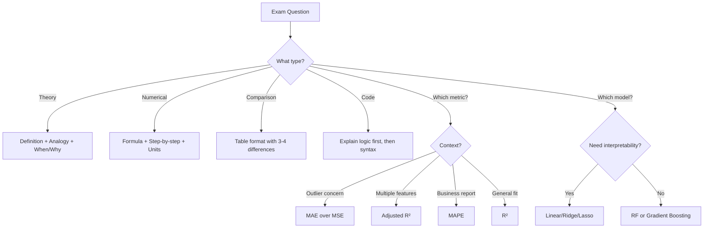

# AS27: Regression Case Study - End-to-End Pipeline — Exam Preparation

---

## Section A: Multiple Choice Questions (MCQ) — 15 Questions

---

### MCQ 1
**Question:** In an end-to-end ML pipeline, which step MUST come before model training?

**Options:**
- A) Model Evaluation
- B) Feature Engineering
- C) Cross-Validation
- D) Deployment

**✅ Correct Answer:** B

**📖 Explanation:** Feature Engineering creates new meaningful features from raw data. This MUST happen before model training because the model needs the processed features as input.

**❌ Why Others Are Wrong:**
- A) Evaluation comes AFTER training — you need predictions first
- C) Cross-Validation is part of evaluation, comes after training
- D) Deployment is the last step after everything else

---

### MCQ 2
**Question:** What happens if you use `fit_transform()` on BOTH training and test data separately?

**Options:**
- A) Model accuracy improves
- B) Data leakage occurs
- C) Training takes longer
- D) No effect

**✅ Correct Answer:** B

**📖 Explanation:** Using `fit_transform()` on test data means the scaler calculates NEW mean/std from test data. This leaks test data statistics into the process. Correct approach: `fit_transform()` on train, `transform()` on test using the SAME scaler.

**❌ Why Others Are Wrong:**
- A) Accuracy may appear to improve but is unreliable — cheating effect
- C) Training time is unrelated to scaling
- D) It definitely has negative effect — inflated metrics

---

### MCQ 3
**Question:** In the MPG dataset, the coefficient for weight is -5.78 (after scaling). What does this mean?

**Options:**
- A) Weight has no impact on mileage
- B) One standard deviation increase in weight decreases MPG by 5.78
- C) Lighter cars consume more fuel
- D) Weight is the least important feature

**✅ Correct Answer:** B

**📖 Explanation:** After Standard Scaling, each coefficient represents the change in target per 1 standard deviation change in the feature. Negative sign = inverse relationship. Weight is actually the MOST important feature (largest absolute coefficient).

**❌ Why Others Are Wrong:**
- A) -5.78 is the largest magnitude — very high impact
- C) Negative coefficient means HEAVIER cars have LESS mileage
- D) It's the MOST important (|5.78| is the highest magnitude)

---

### MCQ 4
**Question:** When should you use Label Encoding instead of One-Hot Encoding?

**Options:**
- A) When features have no ordering (nominal)
- B) When features have a natural ordering (ordinal)
- C) When features have more than 10 categories
- D) When using tree-based models

**✅ Correct Answer:** B

**📖 Explanation:** Label Encoding assigns numbers (1, 2, 3...) to categories. This is appropriate ONLY when categories have natural order (e.g., Poor < Fair < Good < Excellent). For nominal categories (usa, japan, europe), this creates false ordering.

**❌ Why Others Are Wrong:**
- A) Nominal features must use One-Hot Encoding, not Label Encoding
- C) Number of categories doesn't determine encoding type — ordering does
- D) Tree-based models can handle both, but encoding choice depends on data nature

---

### MCQ 5
**Question:** In `pd.get_dummies(X, columns=['origin'], drop_first=True)`, why is `drop_first=True` used?

**Options:**
- A) To save memory
- B) To speed up processing
- C) To avoid multicollinearity (dummy variable trap)
- D) To improve model accuracy

**✅ Correct Answer:** C

**📖 Explanation:** If all dummy columns are included, they sum to 1 always (perfect multicollinearity). This makes the matrix singular — linear regression cannot solve it. Dropping one category (reference category) solves this.

**❌ Why Others Are Wrong:**
- A) Saving one column barely impacts memory
- B) One fewer column has negligible speed impact
- D) It doesn't directly improve accuracy — it prevents mathematical failure

---

### MCQ 6
**Question:** The MPG model has R² = 0.66 and Adjusted R² = 0.63. After polynomial degree 2, R² = 0.67 but Adjusted R² = 0.37. What happened?

**Options:**
- A) Polynomial model is clearly better
- B) Polynomial model added many useless features — penalized by Adjusted R²
- C) Data leakage occurred
- D) Cross-validation was not performed

**✅ Correct Answer:** B

**📖 Explanation:** R² increased marginally (0.66 → 0.67) because R² never decreases with more features. But Adjusted R² dropped drastically (0.63 → 0.37) because most polynomial features are useless — Adjusted R² penalizes unnecessary complexity.

**❌ Why Others Are Wrong:**
- A) Adjusted R² drop proves polynomial is WORSE overall
- C) No data leakage — the metrics themselves show overfitting
- D) CV is separate; the R² vs Adj R² gap alone reveals the problem

---

### MCQ 7
**Question:** What does a NEGATIVE R² value indicate?

**Options:**
- A) Perfect model fit
- B) Model is better than the mean prediction
- C) Model is WORSE than simply predicting the mean
- D) Calculation error

**✅ Correct Answer:** C

**📖 Explanation:** R² < 0 means the model's predictions are further from actual values than simply using the mean of y for every prediction. The model is terrible — worse than the simplest baseline!

**❌ Why Others Are Wrong:**
- A) Perfect fit has R² = 1.0
- B) Better than mean = R² > 0
- D) It's mathematically valid — just indicates a bad model

---

### MCQ 8
**Question:** In Diamond dataset polynomial regression, the model performed WORSE than linear. Why?

**Options:**
- A) Linear data doesn't need polynomial
- B) Feature explosion + reduced data + outlier sensitivity
- C) Encoding was wrong
- D) Features were not scaled

**✅ Correct Answer:** B

**📖 Explanation:** Diamond polynomial used only 5,000 of 53,940 samples (reduced for computation). 23 features → 300+ polynomial features with only 5,000 data points = insufficient data. Plus, outlier diamonds caused extreme residuals with polynomial curves.

**❌ Why Others Are Wrong:**
- A) Partially true, but the main issues are computational constraints and outliers
- C) Encoding was correctly done with one-hot encoding
- D) Scaling doesn't cause worse polynomial performance

---

### MCQ 9
**Question:** Which metric is BEST for communicating model accuracy to non-technical business stakeholders?

**Options:**
- A) MSE
- B) R²
- C) Adjusted R²
- D) MAPE

**✅ Correct Answer:** D

**📖 Explanation:** MAPE (Mean Absolute Percentage Error) is in percentage — "Our model predicts prices within 4.2% accuracy on average." Business people immediately understand percentages. MSE is in squared units, R² requires statistical knowledge.

**❌ Why Others Are Wrong:**
- A) MSE is in squared units — no intuitive meaning for business
- B) R² = 0.92 requires explanation of "variance explained"
- C) Adjusted R² is even more technical than R²

---

### MCQ 10
**Question:** In K-Fold Cross-Validation with K=5, how many times is each data point used as TEST data?

**Options:**
- A) 0 times
- B) Exactly 1 time
- C) Exactly 4 times
- D) 5 times

**✅ Correct Answer:** B

**📖 Explanation:** In 5-Fold CV, data is split into 5 folds. Each fold serves as test set exactly once, while the other 4 folds serve as training. So each data point is tested exactly 1 time and trained on 4 times.

**❌ Why Others Are Wrong:**
- A) Every point IS tested
- C) 4 times is how many times each point is used for TRAINING
- D) 5 folds means 5 iterations, but each point tests only in 1 fold

---

### MCQ 11
**Question:** What is the correct order of preprocessing steps to AVOID data leakage?

**Options:**
- A) Scale → Split → Train
- B) Split → Fit scaler on all data → Transform train and test
- C) Split → Fit scaler on train → Transform train → Transform test with same scaler
- D) Train → Scale → Split

**✅ Correct Answer:** C

**📖 Explanation:** Correct order: (1) Split into train/test, (2) Fit scaler ONLY on training data, (3) Transform training data, (4) Transform test data using the SAME scaler parameters from training.

**❌ Why Others Are Wrong:**
- A) Scaling before splitting leaks test data statistics into training
- B) Fitting on all data includes test data — leakage!
- D) Training before scaling = unscaled features; scaling after training makes no sense

---

### MCQ 12
**Question:** What type of missing value handling is appropriate when `basement_sqft` is missing because the house has NO basement?

**Options:**
- A) Drop the row
- B) Fill with mean
- C) Fill with 0
- D) Fill with median

**✅ Correct Answer:** C

**📖 Explanation:** This is a "structural zero" — the value is missing because the feature literally doesn't exist (no basement = 0 square feet). Filling with 0 correctly represents this absence. Mean/median would create artificial non-zero values.

**❌ Why Others Are Wrong:**
- A) Dropping loses valuable data — the house is valid, just has no basement
- B) Mean would give a positive value — incorrect for "no basement"
- D) Median would also give a positive value — same problem as mean

---

### MCQ 13
**Question:** In the Bias-Variance Trade-off plot (training MSE vs test MSE vs polynomial degree), which degree should you choose?

**Options:**
- A) Degree where TRAINING MSE is minimum
- B) Degree where TEST MSE is minimum
- C) Highest degree available
- D) Degree 1 always

**✅ Correct Answer:** B

**📖 Explanation:** Test MSE reflects generalization performance. Training MSE always decreases with complexity (can even reach 0), which leads to overfitting. The optimal degree is where TEST MSE reaches its minimum — the sweet spot between bias and variance.

**❌ Why Others Are Wrong:**
- A) Training MSE minimum = overfitting (memorized training data)
- C) Highest degree = most complex = severe overfitting
- D) Degree 1 may underfit if relationship is non-linear

---

### MCQ 14
**Question:** Which model is MOST interpretable for explaining WHY a house is priced at $385,000?

**Options:**
- A) Gradient Boosting (R² = 0.96)
- B) Random Forest (R² = 0.95)
- C) Linear Regression (R² = 0.92)
- D) Neural Network (R² = 0.97)

**✅ Correct Answer:** C

**📖 Explanation:** Linear Regression provides clear coefficients: "Each additional square foot adds $125 to the price. Being in a good school district adds $15,000." Business stakeholders understand this. Tree-based models and neural networks are "black boxes."

**❌ Why Others Are Wrong:**
- A) GB has higher accuracy but cannot easily explain individual predictions
- B) RF provides feature importance % but not direction of impact
- D) Neural Networks are the least interpretable despite high accuracy

---

### MCQ 15
**Question:** After deploying a house price model, the MAPE increases from 4% to 12% over 6 months. What is the most likely cause?

**Options:**
- A) Bug in the code
- B) Model drift — real estate market conditions changed
- C) Hardware failure
- D) Too many users

**✅ Correct Answer:** B

**📖 Explanation:** Model drift occurs when the relationship between features and target changes over time. Real estate prices are influenced by market conditions, interest rates, and economic factors that change. A model trained on 2023 data may not work well in 2024 market conditions.

**❌ Why Others Are Wrong:**
- A) If code had bugs, MAPE would be high from day 1
- C) Hardware failure would cause crashes, not gradual MAPE increase
- D) Number of users doesn't affect prediction accuracy

---

## Section B: Multiple Select Questions (MSQ) — 12 Questions

---

### MSQ 1
**Question:** Which of the following are valid strategies for handling missing values? (Select ALL that apply)

**Options:**
- A) Drop rows with missing values
- B) Fill with mean
- C) Fill with 0 for structural zeros
- D) Fill with the most common value (mode)
- E) Multiply by -1

**✅ Correct Answers:** A, B, C, D

**📖 Explanation:**
- A) ✅ Valid when missing % is small (<5%)
- B) ✅ Valid for numeric, normally distributed features
- C) ✅ Valid when missing = absence of feature (e.g., no basement)
- D) ✅ Valid for categorical features (mode = most frequent category)

**❌ Why E Is Wrong:**
- E) Multiplying by -1 makes no sense — it changes existing values, doesn't handle missing ones

---

### MSQ 2
**Question:** Which metrics are SENSITIVE to outliers? (Select ALL that apply)

**Options:**
- A) MAE
- B) MSE
- C) RMSE
- D) MAPE
- E) R²

**✅ Correct Answers:** B, C, E

**📖 Explanation:**
- B) ✅ MSE squares errors — outlier error of 20 becomes 400
- C) ✅ RMSE = √MSE, so inherits MSE's sensitivity
- E) ✅ R² uses SS_residual which includes squared errors

**❌ Why Others Are Wrong:**
- A) MAE uses absolute values, not squares — treats all errors linearly
- D) MAPE uses percentages and absolute values — not squared

---

### MSQ 3
**Question:** Which of the following are advantages of Feature Engineering? (Select ALL that apply)

**Options:**
- A) Makes non-linear relationships linear
- B) Captures domain knowledge
- C) Always improves model accuracy
- D) Creates more meaningful features
- E) Can improve simple models more than switching algorithms

**✅ Correct Answers:** A, B, D, E

**📖 Explanation:**
- A) ✅ E.g., age = 2024 - year_built makes temporal relationship direct
- B) ✅ Domain expertise translates into features (bath_bed_ratio)
- D) ✅ Raw year_built → age is more interpretable
- E) ✅ "Feature engineering matters more than algorithm choice" — common ML wisdom

**❌ Why C Is Wrong:**
- C) Feature engineering CAN hurt accuracy if irrelevant features are created — not guaranteed improvement

---

### MSQ 4
**Question:** Which preprocessing steps are MANDATORY before deploying a prediction function for a trained model? (Select ALL that apply)

**Options:**
- A) Apply same feature engineering as training
- B) Use a new scaler fitted on new data
- C) Apply same encoding as training
- D) Apply same scaling using the SAVED training scaler
- E) Retrain the model from scratch

**✅ Correct Answers:** A, C, D

**📖 Explanation:**
- A) ✅ Same engineered features must be created (age, ratios, flags)
- C) ✅ Same encoding scheme must be applied
- D) ✅ The SAVED scaler (from training) must be used — same mean/std

**❌ Why Others Are Wrong:**
- B) Using a NEW scaler = data leakage/inconsistency — must use SAVED scaler
- E) Retraining is for scheduled updates, not for every prediction

---

### MSQ 5
**Question:** When should you prefer Linear Regression over Gradient Boosting? (Select ALL that apply)

**Options:**
- A) When interpretability is critical
- B) When you need to explain WHY a prediction was made
- C) When you have very little training data
- D) When maximum R² is needed
- E) When model must be auditable by regulators

**✅ Correct Answers:** A, B, C, E

**📖 Explanation:**
- A) ✅ LR coefficients directly show feature impact direction and strength
- B) ✅ "Price increased because square_feet coefficient is +125"
- C) ✅ LR works with small data; GBM needs more data to avoid overfitting
- E) ✅ Regulated industries (banking, healthcare) require explainable models

**❌ Why D Is Wrong:**
- D) Maximum R² usually comes from GBM/RF — LR is simpler and lower accuracy

---

### MSQ 6
**Question:** What does a residual histogram with TWO PEAKS (bimodal) indicate? (Select ALL that apply)

**Options:**
- A) The model is performing well
- B) The model is missing a non-linear pattern
- C) There might be two distinct subgroups in the data
- D) Polynomial regression should be tried
- E) There might be an important categorical feature not included

**✅ Correct Answers:** B, C, D, E

**📖 Explanation:**
- B) ✅ Linear model cannot capture non-linear structure
- C) ✅ Two peaks suggest two data subpopulations with different patterns
- D) ✅ Polynomial regression can capture curvatures missed by linear
- E) ✅ A missing categorical feature (e.g., property type) could create subgroups

**❌ Why A Is Wrong:**
- A) Bimodal residuals = model NOT performing well — something is missing

---

### MSQ 7
**Question:** Which of the following cause feature explosion in polynomial regression? (Select ALL that apply)

**Options:**
- A) Squared terms (x₁², x₂², ...)
- B) Interaction terms (x₁×x₂, x₁×x₃, ...)
- C) Higher polynomial degrees (3, 4, 5...)
- D) More original features
- E) Larger dataset size

**✅ Correct Answers:** A, B, C, D

**📖 Explanation:**
- A) ✅ Each feature gets a squared version
- B) ✅ All pairwise combinations are created
- C) ✅ Higher degrees create more power terms and interactions
- D) ✅ More features = exponentially more combinations

**❌ Why E Is Wrong:**
- E) Larger dataset = more rows, NOT more features. Feature explosion is about columns, not rows.

---

### MSQ 8
**Question:** Which of the following models do NOT require feature scaling? (Select ALL that apply)

**Options:**
- A) Linear Regression
- B) Decision Tree
- C) Random Forest
- D) Gradient Boosting
- E) Ridge Regression

**✅ Correct Answers:** B, C, D

**📖 Explanation:**
- B) ✅ Trees split on thresholds — magnitude doesn't matter
- C) ✅ Random Forest = ensemble of trees — scale-invariant
- D) ✅ Gradient Boosting = sequential trees — scale-invariant

**❌ Why Others Are Wrong:**
- A) LR benefits from scaling for coefficient interpretation (recommended but not strictly required)
- E) Ridge has L2 penalty that IS sensitive to feature scale — REQUIRED

---

### MSQ 9
**Question:** In the House Price case study, which features were CREATED through feature engineering? (Select ALL that apply)

**Options:**
- A) age (from year_built)
- B) total_interior_sqft (from square_feet + basement_sqft)
- C) bath_bed_ratio (from bathrooms / bedrooms)
- D) square_feet (from raw data)
- E) is_new (binary flag from age ≤ 5)

**✅ Correct Answers:** A, B, C, E

**📖 Explanation:**
- A) ✅ `age = 2024 - year_built` — derived from existing column
- B) ✅ `total_interior_sqft = square_feet + basement_sqft` — combination
- C) ✅ `bath_bed_ratio = bathrooms / (bedrooms + 1)` — ratio feature
- E) ✅ `is_new = (age <= 5).astype(int)` — binary threshold feature

**❌ Why D Is Wrong:**
- D) square_feet is an ORIGINAL raw feature, not engineered

---

### MSQ 10
**Question:** Which statements about cross-validation are TRUE? (Select ALL that apply)

**Options:**
- A) Each data point is tested exactly once in K-Fold CV
- B) K-Fold CV makes K models total
- C) Higher K always gives better estimates
- D) Standard deviation of CV scores indicates model stability
- E) Mean CV score is more reliable than a single train-test split

**✅ Correct Answers:** A, B, D, E

**📖 Explanation:**
- A) ✅ Each data point appears in test set exactly once across all K folds
- B) ✅ K iterations = K models trained and evaluated
- D) ✅ Low std = stable model, high std = unstable/data-dependent model
- E) ✅ Averaging K scores removes single-split luck/unluck

**❌ Why C Is Wrong:**
- C) Very high K (LOOCV, K=n) can actually have HIGHER variance and is computationally very expensive

---

### MSQ 11
**Question:** Which factors should influence your choice of polynomial degree? (Select ALL that apply)

**Options:**
- A) Training MSE alone
- B) Test MSE (or cross-validation MSE)
- C) Number of data points relative to polynomial features
- D) Adjusted R² comparison with linear model
- E) Computational cost and time

**✅ Correct Answers:** B, C, D, E

**📖 Explanation:**
- B) ✅ Test MSE minimum = optimal degree (bias-variance sweet spot)
- C) ✅ Need 10-20x more data points than features — check this ratio
- D) ✅ If Adjusted R² drops with polynomial → features are useless
- E) ✅ Degree 3 with 23 features = 2,600 polynomial features — expensive!

**❌ Why A Is Wrong:**
- A) Training MSE always decreases with degree — gives false sense of improvement

---

### MSQ 12
**Question:** What should a model monitoring plan include? (Select ALL that apply)

**Options:**
- A) Track prediction accuracy metrics (MAPE, R²) on new data
- B) Set alert thresholds for performance degradation
- C) Schedule periodic retraining
- D) Monitor input feature distribution changes (data drift)
- E) Only retrain when the model crashes

**✅ Correct Answers:** A, B, C, D

**📖 Explanation:**
- A) ✅ Ongoing accuracy tracking reveals performance degradation
- B) ✅ Automated alerts when MAPE > threshold for N consecutive days
- C) ✅ Quarterly/monthly retraining keeps model current
- D) ✅ Data drift detection catches input distribution shifts early

**❌ Why E Is Wrong:**
- E) Models rarely "crash" — they silently give worse predictions. Waiting for crashes means ignoring gradual degradation

---

## Section C: Numerical/Calculation Questions — 8 Questions

---

### Numerical 1
**Question:** A linear model produces the following predictions vs actuals for 5 test houses:

| House | Actual Price ($) | Predicted Price ($) |
|-------|-----------------|-------------------|
| 1 | 300,000 | 310,000 |
| 2 | 450,000 | 430,000 |
| 3 | 200,000 | 215,000 |
| 4 | 550,000 | 520,000 |
| 5 | 350,000 | 360,000 |

Calculate the **MAE**.

**Given:**
- Errors: |300k-310k|=10k, |450k-430k|=20k, |200k-215k|=15k, |550k-520k|=30k, |350k-360k|=10k

**Solution Steps:**
1. Calculate absolute errors: 10,000 + 20,000 + 15,000 + 30,000 + 10,000 = 85,000
2. Divide by n: 85,000 / 5 = 17,000

**✅ Final Answer:** MAE = $17,000

---

### Numerical 2
**Question:** Using the same data as Numerical 1, calculate the **MSE**.

**Given:**
- Errors: 10k, -20k, 15k, -30k, 10k

**Solution Steps:**
1. Square each error: 10k²=100M, 20k²=400M, 15k²=225M, 30k²=900M, 10k²=100M
2. Sum: 100M + 400M + 225M + 900M + 100M = 1,725M
3. Divide by n: 1,725,000,000 / 5 = 345,000,000

**✅ Final Answer:** MSE = 345,000,000 (or 3.45 × 10⁸)

**RMSE = √345,000,000 = $18,574.18**

**Note:** RMSE ($18,574) > MAE ($17,000) because MSE penalizes the larger errors (the $30k error) more heavily.

---

### Numerical 3
**Question:** A model has R² = 0.85 with 100 samples and 10 features. Calculate the **Adjusted R²**.

**Given:**
- R² = 0.85
- n = 100 (samples)
- p = 10 (features)

**Solution Steps:**
1. Formula: Adjusted R² = 1 - [(1 - R²)(n - 1)] / (n - p - 1)
2. Substitute: = 1 - [(1 - 0.85)(100 - 1)] / (100 - 10 - 1)
3. = 1 - [0.15 × 99] / 89
4. = 1 - 14.85 / 89
5. = 1 - 0.1669
6. = 0.8331

**✅ Final Answer:** Adjusted R² = 0.833

**Observation:** R² = 0.85 but Adjusted R² = 0.833. Small drop suggests features are mostly useful. 10 features with 100 samples = 10:1 ratio (borderline acceptable).

---

### Numerical 4
**Question:** With 7 original features, how many features will PolynomialFeatures(degree=2) create?

**Given:**
- n = 7 features
- d = 2 degree

**Solution Steps:**
1. Formula: C(n + d, d) = C(9, 2)
2. C(9, 2) = 9! / (2! × 7!) = (9 × 8) / (2 × 1) = 72 / 2 = 36

**✅ Final Answer:** 36 features (including bias term)

**Breakdown:** 1 (bias) + 7 (linear) + 7 (squared) + 21 (interactions) = 36

---

### Numerical 5
**Question:** In 5-Fold CV, the R² scores are: [0.72, 0.68, 0.75, 0.65, 0.70]. Calculate the **mean** and **standard deviation**.

**Given:**
- Scores: 0.72, 0.68, 0.75, 0.65, 0.70

**Solution Steps:**
1. Mean = (0.72 + 0.68 + 0.75 + 0.65 + 0.70) / 5 = 3.50 / 5 = 0.70
2. Deviations: (0.02)², (-0.02)², (0.05)², (-0.05)², (0.00)²
3. Variance = (0.0004 + 0.0004 + 0.0025 + 0.0025 + 0.0000) / 5 = 0.0058 / 5 = 0.00116
4. Std = √0.00116 = 0.0341

**✅ Final Answer:** Mean R² = 0.70 ± 0.034

**Interpretation:** Model performs reasonably (R² = 0.70) with good stability (std = 0.034 < 0.05).

---

### Numerical 6
**Question:** A model predicts house prices. For one house: actual = $400,000, predicted = $380,000. What is the percentage error?

**Given:**
- Actual = $400,000
- Predicted = $380,000

**Solution Steps:**
1. Error = |400,000 - 380,000| = 20,000
2. Percentage error = (20,000 / 400,000) × 100 = 5%

**✅ Final Answer:** 5% (within the 10% business goal threshold ✅)

---

### Numerical 7
**Question:** A Random Forest model outputs feature importances: square_feet=0.42, school_rating=0.12, age=0.08, bedrooms=0.02, other=0.36. If you drop features with importance < 5%, how many features remain?

**Given:**
- square_feet: 0.42 (42%) ✅ > 5%
- school_rating: 0.12 (12%) ✅ > 5%
- age: 0.08 (8%) ✅ > 5%
- bedrooms: 0.02 (2%) ❌ < 5%
- other: 0.36 (represents multiple features)

**Solution Steps:**
1. Check each: 42% > 5% ✅, 12% > 5% ✅, 8% > 5% ✅, 2% < 5% ❌
2. Drop bedrooms (2% < 5% threshold)
3. Keep: square_feet, school_rating, age + other features above 5%

**✅ Final Answer:** 3 explicitly listed features remain. bedrooms gets dropped.

---

### Numerical 8
**Question:** Linear model has R² = 0.66 with 7 features (Adjusted R² = 0.63). Polynomial degree 2 gives R² = 0.67 with 36 features. What is the polynomial model's Adjusted R², given n = 314 test samples?

**Given:**
- R² = 0.67, n = 314, p = 36

**Solution Steps:**
1. Adjusted R² = 1 - [(1 - 0.67)(314 - 1)] / (314 - 36 - 1)
2. = 1 - [0.33 × 313] / 277
3. = 1 - 103.29 / 277
4. = 1 - 0.3728
5. = 0.6272

**✅ Final Answer:** Adjusted R² = 0.627

**But wait!** Linear model Adj R² = 0.63, Polynomial Adj R² = 0.627. Nearly same! This confirms polynomial features are NOT worth the added complexity (29 extra features for negligible improvement).

---

## Section D: Fill in the Blanks — 10 Questions

---

### Fill 1
**Question:** The process of creating new meaningful columns from existing data is called _______.

**Answer:** Feature Engineering

**Explanation:** Feature Engineering transforms raw features into more informative ones (e.g., age from year_built, ratios, binary flags). It often has more impact than algorithm selection.

---

### Fill 2
**Question:** When using `pd.get_dummies()` with `drop_first=True`, the dropped category becomes the _______ category.

**Answer:** Reference (or baseline)

**Explanation:** The dropped category serves as reference. All other categories' coefficients are interpreted RELATIVE to this reference. E.g., origin_japan = +3.85 means 3.85 MPG more than the reference (europe).

---

### Fill 3
**Question:** R² can be negative, which means the model is worse than predicting the _______ for every observation.

**Answer:** Mean (average)

**Explanation:** R² = 1 - (SS_residual / SS_total). If SS_residual > SS_total, R² < 0. The baseline is always-predict-mean, so negative R² means the model does worse than this simple baseline.

---

### Fill 4
**Question:** In cross-validation, scikit-learn uses _______ MSE (negative sign) because the convention is "higher = better."

**Answer:** Negative (neg_mean_squared_error)

**Explanation:** Scikit-learn convention: higher scoring = better model. Since lower MSE = better, MSE is negated so that higher (less negative) = better. Multiply by -1 to get actual MSE.

---

### Fill 5
**Question:** The phenomenon where polynomial regression creates an exponentially large number of features is called _______.

**Answer:** Feature Explosion (or Curse of Dimensionality)

**Explanation:** 7 features with degree 2 = 36, degree 3 = 120, degree 4 = 330. The number of features grows combinatorially, leading to computational cost and overfitting risk.

---

### Fill 6
**Question:** Using test data statistics during preprocessing causes _______, which inflates model performance metrics artificially.

**Answer:** Data Leakage

**Explanation:** If you fit a scaler on the full dataset (including test data), the scaler "sees" test data statistics. The model indirectly benefits from test data information, making evaluation unreliable.

---

### Fill 7
**Question:** In the Bias-Variance Trade-off, selecting too simple a model leads to _______, while too complex leads to _______.

**Answer:** Underfitting; Overfitting

**Explanation:** Underfitting = model cannot capture real patterns (high bias). Overfitting = model memorizes noise in training data (high variance). The optimal model balances both.

---

### Fill 8
**Question:** When a deployed model's accuracy gradually decreases over time due to changing data patterns, this is called _______.

**Answer:** Model Drift (or Concept Drift)

**Explanation:** Real-world patterns change over time (market shifts, seasonal effects). A model trained on old data becomes outdated. Regular monitoring and retraining are essential.

---

### Fill 9
**Question:** _______ regression makes some coefficients exactly zero, automatically performing feature selection.

**Answer:** Lasso (L1 Regularization)

**Explanation:** Lasso applies L1 penalty which can shrink some coefficients to exactly 0, effectively removing those features. Ridge (L2) only shrinks coefficients, never to exactly 0.

---

### Fill 10
**Question:** Using `joblib.dump()` to save a trained model to a file is called _______.

**Answer:** Serialization (or Model Persistence)

**Explanation:** Serialization converts Python objects (model, scaler) into bytes and saves to disk. `joblib.load()` deserializes — converts bytes back to Python objects. This allows reusing trained models without retraining.

---

## 📚 Quick Revision Points

### Key Formulas
| Formula | Expression | When to Use |
|---------|-----------|-------------|
| MAE | (1/n) × Σ\|actual - predicted\| | Average absolute error |
| MSE | (1/n) × Σ(actual - predicted)² | Penalizes large errors |
| RMSE | √MSE | Same units as target |
| R² | 1 - (SS_res / SS_total) | % variance explained |
| Adjusted R² | 1 - [(1-R²)(n-1)/(n-p-1)] | Penalizes extra features |
| MAPE | (1/n) × Σ(\|error\|/\|actual\|) × 100 | Percentage error |
| Polynomial features count | C(n+d, d) | Feature explosion check |
| Standard Scaling | z = (x - mean) / std | Normalize features |

### Key Concepts Summary
| Concept | One-Line Definition | When to Use |
|---------|---------------------|-------------|
| End-to-End Pipeline | Systematic workflow from raw data to deployment | Every ML project |
| Feature Engineering | Creating new meaningful features from existing ones | Before model training |
| One-Hot Encoding | Convert nominal categories to binary columns | Categories without order |
| drop_first | Drop one dummy column to prevent multicollinearity | Always with one-hot encoding |
| Data Leakage | Using test data information during training | AVOID — fit on train only |
| Residual Analysis | Plotting prediction errors to diagnose model | After every model training |
| Polynomial Regression | Adding squared/interaction terms | When linear model underfits |
| Bias-Variance Trade-off | Balance model simplicity vs complexity | Degree/complexity selection |
| K-Fold CV | Splitting data K ways, rotating test set | Reliable performance estimate |
| Feature Importance | Identifying which features drive predictions | After training, for insights |
| Model Drift | Performance degradation over time | Post-deployment monitoring |

### Common Exam Traps
1. **Trap:** "R² increased after adding features, so the model improved" → **Correct:** Check Adjusted R². R² never decreases with more features — it's misleading alone!
2. **Trap:** "Training MSE is lower, so polynomial model is better" → **Correct:** Training MSE always decreases. Use TEST MSE.
3. **Trap:** "Scaling doesn't matter for Linear Regression" → **Correct:** Scaling is essential for coefficient comparison and regularized models (Ridge/Lasso).
4. **Trap:** "More complex model always performs better" → **Correct:** Complexity increases overfitting risk. Diamond polynomial was WORSE.
5. **Trap:** "MAE = 3.35 is a good/bad score" → **Correct:** Context-dependent. Compare to target range. Use R² for context-free measure.

---

## 🚀 Section E: Shortcuts & Cheat Codes for Exam

### ⚡ One-Liner Shortcuts
| Concept | Shortcut/Cheat Code | When to Use |
|---------|---------------------|-------------|
| Feature count polynomial | C(n+d, d) where n=features, d=degree | Feature explosion questions |
| R² interpretation | "X% of variance explained" | Any R² question |
| Adjusted R² direction | If R² ≈ Adj R², features are useful | Feature quality assessment |
| MAE vs RMSE | RMSE ≥ MAE always. Gap = outlier impact | Comparing error metrics |
| Missing value rule | <5% → drop, 5-20% → impute, >20% → consider dropping column | Missing data questions |
| Train-test ratio | Need 10-20x more samples than features | Feature-to-samples check |
| CV reporting | "Mean R² = X ± std (K-Fold CV)" | Report format |

### 🎯 Memory Tricks (Mnemonics)
1. **Pipeline = DCFEST-MD**: **D**ata → **C**lean → **F**eature Engineer → **E**ncode → **S**plit → **T**rain → (E)**M**valuate → **D**eploy
2. **Metrics SOS**: **S**imple=MAE, **O**utlier-penalizing=MSE, **S**cale-free=R²
3. **LASSO = Laser**: Laser cuts things to ZERO (coefficients become exactly 0)
4. **RIDGE = Bridge**: Bridge connects all features together (shrinks but keeps all)
5. **CV = Committee Voting**: 5 judges give scores, average = fair result

### 🔢 Quick Calculation Hacks
| Scenario | Hack/Shortcut | Example |
|----------|---------------|---------|
| Polynomial features (degree 2) | n + n(n-1)/2 + n + 1 = roughly n²/2 | 7 features → ~36 |
| RMSE from MAE estimate | RMSE ≈ 1.1 to 1.3 × MAE (if errors ~normal) | MAE=10 → RMSE≈12 |
| Adjusted R² quick check | If p is small relative to n, Adj R² ≈ R² | 5 features, 1000 samples |
| CV mean + std range | 95% of new data performance within mean ± 2×std | R²=0.7±0.03 → 0.64-0.76 |

### 📝 Last-Minute Formula Sheet
```
📌 MAE = Σ|actual - predicted| / n → Use when: Outlier-robust error metric needed
📌 MSE = Σ(actual - predicted)² / n → Use when: Large errors should be penalized
📌 RMSE = √MSE → Use when: Need error in same units as target
📌 R² = 1 - SS_res/SS_total → Use when: Need context-free fit quality measure
📌 Adj R² = 1 - [(1-R²)(n-1)/(n-p-1)] → Use when: Comparing models with different feature counts
📌 MAPE = Σ(|error|/|actual|) × 100 / n → Use when: Need percentage-based business metric
📌 Poly features = C(n+d, d) → Use when: Estimating polynomial feature count
📌 StandardScaler: z = (x - μ) / σ → Use when: Features on different scales
```

### 🎓 Interview One-Liners
| Question Pattern | Safe Answer Template |
|------------------|---------------------|
| "What is a regression pipeline?" | "A systematic workflow from raw data through preprocessing, feature engineering, training, evaluation, to deployment — iterative not one-shot." |
| "Why feature engineering?" | "It transforms raw features into meaningful ones, often more impactful than algorithm choice. E.g., age from year_built makes temporal relationships direct." |
| "R² vs Adjusted R²?" | "R² measures variance explained but never decreases with features. Adjusted R² penalizes useless features — use it when comparing models with different feature counts." |
| "When polynomial regression?" | "When residual plots show patterns, R² is low, and domain knowledge suggests non-linear relationships. Always check Adjusted R² and bias-variance plot." |
| "Why cross-validation?" | "Single train-test split can be misleading. K-Fold CV tests on all data portions, averaging for reliable performance estimates and stability checks." |
| "Ridge vs Lasso?" | "Ridge shrinks all coefficients (keeps all features). Lasso can make coefficients exactly zero (automatic feature selection). Use Lasso for sparse models, Ridge for multicollinearity." |
| "What is data leakage?" | "When test data information is used during training, artificially inflating metrics. Prevent by fitting preprocessing only on training data." |
| "How to deploy a model?" | "Save model+scaler with joblib, create prediction function with same preprocessing as training, integrate with API, set up performance monitoring with retraining triggers." |

### ⚠️ "If You Forget Everything, Remember This"
1. **Golden Rule 1:** Always start with a SIMPLE model and add complexity only when needed — more complex ≠ always better.
2. **Golden Rule 2:** fit_transform on TRAIN, transform on TEST — never the other way around. Data leakage kills real-world performance.
3. **Golden Rule 3:** Check ADJUSTED R², not just R², when you have many features — R² alone is misleading.
4. **Golden Rule 4:** Feature Engineering often matters MORE than algorithm choice — spend time on features, not just models.
5. **Golden Rule 5:** Use Cross-Validation (K-Fold) for reliable evaluation — single splits are gambling.

### 🔄 Quick Decision Flowchart


### 🎯 Safe Answer Patterns
- **For "What is X?"** → Definition + One-line use case + Simple analogy
- **For "Explain X"** → Analogy + Technical definition + Code example + When to use
- **For "Compare X vs Y"** → Table with 4-5 differences (interpretability, speed, accuracy, complexity, use case)
- **For "Calculate X"** → Write formula + Substitute values + Step-by-step + Final answer with units + Interpretation
- **For "Why X?"** → Problem it solves + What happens without it + Alternative comparison
- **For "When to use X?"** → Conditions list + Counter-conditions (when NOT to use) + Decision rule
