# AS28: Introduction to Classification with Logistic Regression — Classroom Session (Part 1)

> 📚 **This is Part 1** covering: Classification vs Regression, Why Linear Regression Fails for Classification, Sigmoid Function, Logistic Regression Fundamentals
> 📘 **See also:** [Part 2](./AS28_IntrotoClassification2.md)

---

## 🗺️ Mind Map — Topics to Cover


---

## 🎓 Classroom Conversation

**Teacher:** Saree students, welcome! 👋 Ippudu mana class lo okka bahut important concept start cheddaam — **Classification**. Idi Machine Learning lo oka pillar concept. Muundu mana regression concepts gurthu cheskondaam — appatlo mana models continuous values predict chesevi, like house price ₹35 lakhs, car mileage 28 MPG, diamond price $5000 ila. But ippudu mana question different — mana model "yes" or "no" cheppali, "spam" or "not spam" cheppali, "disease present" or "absent" cheppali. Idi classification!

**Teacher:** Idi chala important concept because real world lo most decisions binary or categorical — customer churn avutada leda, email spam aa leda, transaction fraud aa leda. So classification chala practical ga essential concept, interview lo adugutaru, exams lo vastundi, real projects lo use chestaru. So dhyanam ga vinandi!

---

### Topic 1: Classification vs Regression — Core Difference

**Teacher:** Okay students, munduga basic difference artham cheskondaam. Regression ante enti antey, mana model oka **continuous number** predict chestundi — like temperature 32.5°C, salary ₹85,000, house price ₹45 lakhs. Idi mana previous classes lo chusaam.

**Teacher:** But Classification ante enti antey, mana model oka **category** or **class** predict chestundi — like:
- Email → "Spam" or "Not Spam"
- Patient → "Disease Present" or "Absent"
- Transaction → "Fraud" or "Legitimate"
- Customer → "Will Buy" or "Won't Buy"

Idi **discrete labels** predict chestundi, continuous values kaadu.

> 💡 **Jargon Alert — Classification**
> Simple Explanation: Classification ante mana model items ni different groups or categories lo sort cheyyadam — eppudu answer "idu" or "adu" la untundi, number kaadu.
> Example: Bouncer at a club — ID check chesi "enter" or "not enter" cheptadu, "you are 0.73 old enough" antaadu kaadu!

> 💡 **Jargon Alert — Supervised Learning**
> Simple Explanation: Mana model ki labeled examples ichi train cheyyadam — like teacher exam papers ki answers ichi, student nerchukovadam la.
> Example: 1000 emails ichi, prathi email ki "spam" or "not spam" label pettu, model learn chestundi.

**Beginner Student:** Sir, classification lo always rendu categories untaya, leda ekkuva categories kuda unda?

**Teacher:** Excellent question! Classification lo rendu main types untayi:

1. **Binary Classification** — rendu categories maatrame: Yes/No, Spam/Not Spam, 0/1. Idi most common.
2. **Multi-class Classification** — ekkuva categories: like image lo "cat", "dog", "bird" ila. leda handwritten digit recognition lo 0-9 = 10 classes.

Ippudu mana focus **Binary Classification** meeda untundi — idi foundation, idi artham aithey multi-class kuda easy.

**Clever Student:** Sir, classification and regression rendu kuda supervised learning ey kadha? Ante training data lo labels untayi kadha?

**Teacher:** Exactly right! Rendu kuda supervised learning — training data lo input features AND target labels untayi. Difference enti antey:
- **Regression** → target = continuous number (like 25.7, 1000, 3.14)
- **Classification** → target = discrete category/label (like 0 or 1, "spam" or "ham")

Idi oka simple but fundamental difference. Questions?

**Practical Student:** Sir, interview lo eppudu adugutaru — "regression vs classification difference cheppu" ante how to answer?

**Teacher:** Great question! Interview lo safe answer template:

> "Regression predicts continuous numerical values like prices or temperatures. Classification predicts discrete categories or classes like spam/not-spam or yes/no. Both are supervised learning — they learn from labeled training data. The key difference is in the TARGET variable — continuous for regression, categorical for classification."

Idi concise ga cheppu, example kuda ivu. 👍

```mermaid
flowchart LR
    A[Supervised Learning] --> B[Regression]
    A --> C[Classification]
    B --> D[Continuous Output<br/>e.g. Price = ₹35L]
    C --> E[Discrete Output<br/>e.g. Spam = Yes/No]
    B --> F[Algorithms:<br/>Linear Regression<br/>Polynomial Regression]
    C --> G[Algorithms:<br/>Logistic Regression<br/>Decision Tree<br/>SVM, KNN]
```



---

### Topic 2: Why Linear Regression Fails for Classification

**Teacher:** Ippudu oka bahut important question — Regression lo mana model continuous values predict chestundi kadha. Ante classification ki kuda linear regression use chesthe enti? Target 0 (fail) and 1 (pass) ante, linear regression fit cheyocha?

**Teacher:** Answer: **NO!** Linear regression classification ki work avvadu. Enduku antey chala important reasons untayi.

**Beginner Student:** Sir, enduku work avvadu? 0 and 1 kuda numbers ey kadha? Linear regression ki 0 and 1 values kuda predict cheyochu kadha?

**Teacher:** Baaga aduguthunnaru! Mana oka example chuddam. Student study hours based on pass/fail predict cheddaam antey:

```python
import numpy as np
import matplotlib.pyplot as plt

# Simple example: study hours vs pass/fail
study_hours = [1, 2, 3, 4, 5, 6, 7, 8, 9, 10, 15]
pass_fail    = [0, 0, 0, 0, 0, 1, 1, 1, 1, 1,  1]

# Linear regression fit
coeffs = np.polyfit(study_hours, pass_fail, 1)
predictions = np.polyval(coeffs, study_hours)

print("Study Hours → Linear Regression Predictions:")
for h, p in zip(study_hours, predictions):
    print(f"  {h} hours → {p:.3f}")
```

**Teacher:** Output chudandi:
```
Study Hours → Linear Regression Predictions:
  1 hours → 0.065
  2 hours → 0.140
  3 hours → 0.215
  ...
  10 hours → 0.740
  15 hours → 1.115  ← PROBLEM! > 1.0
```

Chudandi! 15 hours study chesthey prediction = 1.115 vasthundi. Adi meaning enti? "115% likely to pass"? Idi impossible! Probability 0 to 1 madya ne undali — 0% to 100% madya ne undali.

**Critique Student:** Sir, mari oka student study hours 0 unte negative prediction vasthundhi kadha? Adi kuda meaningless kadha!

**Teacher:** Correct! Perfectly right! Linear regression lo **3 major problems** untayi classification ki:

#### Problem 1: Unbounded Outputs
Linear regression produces any value from **-∞ to +∞**. Ante -2.5 or +158 kuda predict cheyochu. But probability 0 to 1 lo ne undali!

#### Problem 2: No Probability Interpretation
Prediction 1.8 ante "180% likely" — idi meaningless. Prediction -0.3 ante "minus 30% likely" — idi kuda meaningless.

#### Problem 3: Sensitive to Outliers
Extreme data points (outliers) line ni tilt chesthayi, causing **wrong classifications for most data**.

> 💡 **Jargon Alert — Unbounded Output**
> Simple Explanation: Linear regression ki "limits" levu — adi any number produce cheyochu, positive ayina negative ayina. But probability ki 0 to 1 range undali.
> Example: Marks ki 0 to 100 range untundi. Someone ki 150 marks or -20 marks ivvadam meaningless — atla ne linear regression classification lo values outside 0-1 range ivvutundi.

**Debate Student:** Sir, but mana linear regression output ni 0 to 1 ki "clip" chesthey? Ante negative aithey 0 pettey, 1 meeda aithey 1 pettey — idi work avvadha?

**Teacher:** Excellent debate! Beginners ila ane alochistharu — "nenu just round cheytha 0 or 1 ki." But problem idi kaadu — **model learn chesthunna way ne wrong**! Linear regression minimize chestundi **numerical distance** (squared error) between prediction and actual. But classification lo mana goals different — mana correct **classification accuracy** maximize cheyali.

Example chudandi:

```mermaid
flowchart TD
    A[Linear Regression for Classification] --> B[Optimizes: Minimize Squared Error]
    A --> C[Problem: Learns wrong boundary]
    D[Logistic Regression for Classification] --> E[Optimizes: Maximize Classification Probability]
    D --> F[Result: Learns correct boundary]
    B --> G[❌ Wrong approach]
    E --> H[✅ Right approach]
```



**Teacher:** Ante linear regression line fit chestundi — but adi boundary correct ga learn avvadu. Mana ki oka special function kavali — adi **Sigmoid Function**!

**Curious Student:** Sir, ippudu concept artham ayindi — linear regression ki valid probability range ledu, ade main problem. But "what happens internally"? Enduku exactly line ki idi problem?

**Teacher:** Great depth question! Internal ga chusthey:

Linear regression loss function = **MSE (Mean Squared Error)**:
```
Loss = (1/n) × Σ(actual - predicted)²
```

Idi minimize chesthey, model try chestundi actual and predicted values madya **numerical distance** minimize cheyali. But classification lo actual values only 0 and 1. So model oka continuous line fit chestundi 0 and 1 lo — but adi threshold crossing point correct ga learn avvadu.

**Logistic regression** different loss function use chestundi — **Log Loss (Cross-Entropy)**:
```
Loss = -(1/n) × Σ[y×log(p) + (1-y)×log(1-p)]
```

Idi **confident wrong predictions ni heavily penalize** chestundi — so model correct decision boundaries learn chestundi!

> 💡 **Jargon Alert — Loss Function**
> Simple Explanation: Loss function ante "model entha wrong ga predict chestundhi" measure chesthundi — marks lo percentage la. Lower loss = better model!
> Example: Student ki exam marks 0-100 lo score vachundi — 100 ante perfect, 0 ante worst. Loss function kuda ila — model ki "score" ivvutundi, model try chestundi score ni improve cheyali.

**Practical Student:** Sir, interview lo "enduku linear regression classification ki use cheyamu" ante enti cheppali?

**Teacher:** Safe answer:

> "Linear regression outputs unbounded continuous values, which can't be interpreted as probabilities. It uses MSE loss which optimizes numerical distance, not classification accuracy. Logistic regression solves this by wrapping the linear output through a sigmoid function to produce valid probabilities, and uses log loss to optimize classification probability. This ensures the model learns proper decision boundaries."

---

### Topic 3: The Sigmoid Function — The S-Curve

**Teacher:** Ippudu mana hero entrance! 🦸 **Sigmoid Function** — idi classification lo most important mathematical tool. Idi linear regression problem solve chestundi.

**Teacher:** Sigmoid function (logistic function ani kuda antaru) oka mathematical transformation — adi **any input value ni 0 to 1 madya output ki convert chestundi**. Formula:

$$\sigma(z) = \frac{1}{1 + e^{-z}}$$

Ikkada:
- `z` = any real number (-∞ to +∞)
- `e` = Euler's number (≈ 2.718)
- Output = always between 0 and 1

> 💡 **Jargon Alert — Sigmoid Function**
> Simple Explanation: Sigmoid function ante oka "squashing machine" — adi entha peddha or entha chinna number ichi aina, output always 0 to 1 madya ne vasthundi. Idi probability ga interpret cheyochu!
> Example: Marks converter la think cheyandi — student entha marks teccheena aina, adi 0-100% percentage convert chestundi.

**Teacher:** Key values gurthu pettukondhi:

| Input z | Sigmoid(z) | Meaning |
|---------|------------|---------|
| -10 | ≈ 0.00005 | Almost certainly Class 0 |
| -5 | ≈ 0.0067 | Very likely Class 0 |
| -2 | ≈ 0.119 | Likely Class 0 |
| -1 | ≈ 0.269 | Somewhat Class 0 |
| 0 | = 0.500 | Exactly uncertain (50-50) |
| 1 | ≈ 0.731 | Somewhat Class 1 |
| 2 | ≈ 0.881 | Likely Class 1 |
| 5 | ≈ 0.993 | Very likely Class 1 |
| 10 | ≈ 0.99995 | Almost certainly Class 1 |

**Beginner Student:** Sir, formula lo `e` ante enti? Enduku e^(-z) use chestunnamu?

**Teacher:** Wonderful question! `e` (Euler's number = 2.71828...) ante mathematics lo oka special constant — idi natural growth and decay model chesthundi. Bank interest compound chesthey, population growth chesthey — idi naturally vasthundi!

`e^(-z)` enduku use chesthamu:
- z positive (peddha) aithey → e^(-z) chala chinna avutundi → 1/(1+small) ≈ 1 (high probability)
- z negative (chinna) aithey → e^(-z) chala peddha avutundi → 1/(1+large) ≈ 0 (low probability)
- z = 0 aithey → e^0 = 1 → 1/(1+1) = 0.5 (exactly uncertain)

Idi beautiful mathematical property — smooth ga 0 nunchi 1 ki transition avutundi, abruptly kaadu!

**Teacher:** Code lo chuddam:

```python
import numpy as np
import matplotlib.pyplot as plt
import math

def sigmoid(z):
    """Convert any number to probability between 0 and 1."""
    return 1 / (1 + math.exp(-z))

# Test with different z values
z_values = [-10, -5, -2, -1, 0, 1, 2, 5, 10]
for z in z_values:
    prob = sigmoid(z)
    print(f"  sigmoid({z:3d}) = {prob:.5f}")
```

Output:
```
  sigmoid(-10) = 0.00005
  sigmoid( -5) = 0.00669
  sigmoid( -2) = 0.11920
  sigmoid( -1) = 0.26894
  sigmoid(  0) = 0.50000
  sigmoid(  1) = 0.73106
  sigmoid(  2) = 0.88080
  sigmoid(  5) = 0.99331
  sigmoid( 10) = 0.99995
```

**Teacher:** Ippudu sigmoid curve visualize cheddaam:

```python
import numpy as np
import matplotlib.pyplot as plt

z = np.linspace(-10, 10, 200)
sigmoid_values = 1 / (1 + np.exp(-z))

plt.figure(figsize=(8, 5))
plt.plot(z, sigmoid_values, 'b-', linewidth=2)
plt.axhline(y=0.5, color='r', linestyle='--', label='Threshold = 0.5')
plt.axvline(x=0, color='g', linestyle='--', label='z = 0')
plt.title("Sigmoid Function (S-Curve)")
plt.xlabel("z (linear score)")
plt.ylabel("σ(z) (probability)")
plt.legend()
plt.grid(True, alpha=0.3)
plt.show()
```

**Clever Student:** Sir, idi beautiful! Ante sigmoid function linear regression output wrap chestundi — z = wx + b ante, output = sigmoid(wx + b) = valid probability! Idi correct kadha?

**Teacher:** Perfectly correct! Adi exactly logistic regression chesthundi:
1. First linear part calculate — `z = w₁x₁ + w₂x₂ + ... + b` (raw score)
2. Then sigmoid wrap — `probability = σ(z)` (valid probability 0-1)
3. Then threshold apply — "if probability ≥ 0.5, predict Class 1; else Class 0" (decision)

```mermaid
flowchart LR
    A[Input Features<br/>x₁, x₂, ...] --> B[Linear Combination<br/>z = w₁x₁ + w₂x₂ + b]
    B --> C[Sigmoid Function<br/>σ z = 1/1+e⁻ᶻ]
    C --> D[Probability<br/>0 to 1]
    D --> E{Threshold<br/>≥ 0.5?}
    E -->|Yes| F[Predict: Class 1]
    E -->|No| G[Predict: Class 0]
    
    style B fill:#ff9999
    style C fill:#99ff99
    style E fill:#9999ff
```



**Teacher:** Idi mana 3-stage pipeline:
1. **z** = "raw evidence score" (any number, unbounded)
2. **σ(z)** = "confidence converter" (valid probability)
3. **threshold** = "decision policy" (yes/no rule)

#### 12-Point Structure: Sigmoid Function

**1. Definition:**
Sigmoid function oka mathematical function — any real number ni 0 to 1 range lo compress chestundi. Formula: σ(z) = 1/(1+e^(-z)).

**2. Simple Analogy:**
Sigmoid ante oka "confidence meter" la think cheyandi. Evidence ekkuva aithey (z positive and large), confidence 1 ki daggaraga untundi. Evidence takkuva aithey (z negative and large), confidence 0 ki daggaraga. Evidence balanced aithey (z ≈ 0), confidence exactly 50-50.

Real life analogy: Exam marks ni percentage grade ki convert chestunna machine la! Student entha marks teclesteley, output always 0-100% lo ne untundi.

**3. Why it is used:**
Linear regression unbounded values produce chestundi (-∞ to +∞). Classification ki valid probabilities (0 to 1) kavali. Sigmoid idi solve chestundi — any unbounded value ni valid probability ki smoothly convert chestundi.

**4. When to use it:**
- Classification tasks lo
- Binary classification lo specifically
- When you need probability output
- Neural networks lo activation function ga

**5. Where to use it (Real-world):**
- Logistic Regression (core component)
- Neural Networks (activation in output layer for binary classification)
- Email spam filters
- Medical diagnosis probability
- Credit scoring systems

**6. Is this the only way? Alternatives:**

| Function | Range | When to Use | Pros | Cons |
|----------|-------|-------------|------|------|
| **Sigmoid** | (0, 1) | Binary classification | Valid probability, smooth | Vanishing gradient for extreme z |
| **Tanh** | (-1, 1) | Hidden layers in NN | Zero-centered | Not valid probability |
| **ReLU** | [0, ∞) | Hidden layers in NN | No vanishing gradient | Not bounded, not probability |
| **Softmax** | (0, 1) sum=1 | Multi-class classification | Generalizes sigmoid | More complex |

Sigmoid is the BEST choice for binary classification probability output — alternatives are for different purposes.

**7. Mermaid Diagram:**


**8. How to use it (Syntax):**

```python
import math
import numpy as np

# Method 1: Pure Python
def sigmoid(z):
    return 1 / (1 + math.exp(-z))

# Method 2: NumPy (vectorized for arrays)
def sigmoid_np(z):
    return 1 / (1 + np.exp(-z))

# Usage
print(sigmoid(2.5))       # → 0.924
print(sigmoid_np(np.array([-1, 0, 1])))  # → [0.269, 0.5, 0.731]
```

**9. How it works internally (step-by-step):**

Step 1: Input z vasthundi (e.g., z = 2)
Step 2: -z calculate → -2
Step 3: e^(-z) calculate → e^(-2) ≈ 0.1353
Step 4: 1 + e^(-z) → 1 + 0.1353 = 1.1353
Step 5: 1 / (1 + e^(-z)) → 1 / 1.1353 ≈ 0.8808

Result: sigmoid(2) ≈ 0.88 → 88% confidence for Class 1!

**10. Visual Summary:**
- Input z → any number (-∞ to +∞)
- Output σ(z) → always between 0 and 1
- z = 0 → σ = 0.5 (exactly uncertain)
- z very positive → σ ≈ 1 (confident Class 1)
- z very negative → σ ≈ 0 (confident Class 0)
- S-shaped curve with smooth transition
- Differentiable everywhere (important for training!)

**11. Advantages & Disadvantages (WITH PROOF):**

**Advantage 1: Always valid probability**
- **Claim:** Output always between 0 and 1
- **Proof:** e^(-z) always positive → 1+e^(-z) always > 1 → 1/(1+e^(-z)) always < 1 and > 0. QED.
- **Real-Life Analogy:** Like a thermometer that always reads between 0°C and 100°C — no impossible readings!
- **When it matters:** ALWAYS in classification — you need valid probabilities

**Advantage 2: Smooth and differentiable**
- **Claim:** Sigmoid is continuous and smooth — no jumps or breaks
- **Proof:** derivative σ'(z) = σ(z) × (1 - σ(z)) — always exists, always smooth
- **Real-Life Analogy:** Like a dimmer switch (smooth) vs on/off switch (jumpy). Gradient descent needs smooth!
- **When it matters:** During training — gradient descent needs smooth derivatives

**Disadvantage 1: Vanishing gradient problem**
- **Claim:** For extreme z values, gradient becomes nearly 0
- **Proof:** When z = 10, σ(10) ≈ 0.99995, σ'(10) ≈ 0.00005 — almost zero!
- **Real-Life Analogy:** Like pushing a ball uphill — at the top, slope is flat, no movement
- **When it matters:** Deep neural networks — multiple sigmoid layers create "gradient vanishing"

**Disadvantage 2: Not zero-centered**
- **Claim:** Sigmoid output range is (0, 1), not centered around 0
- **Proof:** sigmoid(0) = 0.5, minimum ≈ 0, maximum ≈ 1 — never negative
- **Real-Life Analogy:** Like a scale that starts at 0 instead of center — weights always pull one direction
- **When it matters:** Neural network hidden layers — tanh (range -1 to 1) is better for hidden layers

**12. Jargon Glossary:**
- **Sigmoid:** S-shaped function that squashes values to 0-1
- **Euler's number (e):** Mathematical constant ≈ 2.718
- **Activation function:** Function that transforms neuron output
- **Differentiable:** Smooth enough for calculus/gradient descent
- **Vanishing gradient:** When derivative becomes too small for learning

---

### Topic 4: Logistic Regression — The Full Picture

**Teacher:** Ippudu sigmoid artham ayyindi. Now let's understand **Logistic Regression** fully. Idi name lo "regression" unde, but idi **classification algorithm**!

**Beginner Student:** Sir, adi confusing! Name lo regression aithey classification enduku antaru?

**Teacher:** Great question! Idi historical reason. "Logistic Regression" ante idi actually **probability regression** — idi probability predict chestundi (continuous value 0 to 1). But final output category (0 or 1) avutundi, so idi classification ki use chestaru.

Think of it like this — "regression" part probability predict chestundi, "classification" part that probability ni category ki convert chestundi.

> 💡 **Jargon Alert — Logistic Regression**
> Simple Explanation: Linear Regression ki sigmoid function wrapper add chesi, output ni valid probability (0-1) ga convert chesi, then oka threshold tho final "yes/no" decision chesthundi.
> Example: Doctor patient ni examine chesi internally "85% chance of disease" ane score ivvadlu, then decision chestundhi "refer for testing" — logistic regression kuda ila!

**Teacher:** Full process:


**Clever Student:** Sir, weights w and bias b ela determine avuthayi? Linear regression lo mana OLS (Ordinary Least Squares) use chesam kadha. Ikkada enti?

**Teacher:** Brilliant question! Linear regression lo OLS use chesi closed-form solution undhi. But logistic regression lo **Log Loss (Cross-Entropy)** optimize chestundi — idi closed-form solution ledu, so **Gradient Descent** use chestundi!

**Log Loss formula:**
```
Log Loss = -(1/n) × Σ[y × log(p) + (1-y) × log(1-p)]
```

Idi eppudu:
- **y = 1 and p close to 1** → loss ≈ 0 (correct!)
- **y = 1 and p close to 0** → loss very high (wrong! penalized heavily!)
- **y = 0 and p close to 0** → loss ≈ 0 (correct!)
- **y = 0 and p close to 1** → loss very high (wrong! penalized heavily!)

**Key insight:** Log loss **confident wrong predictions ni heavily penalize chestundi**! Idi MSE kaante better for classification.

> 💡 **Jargon Alert — Log Loss (Cross-Entropy)**
> Simple Explanation: Log Loss ante model "entha confidently wrong" undhi adi measure chesthundi. Model confident ga wrong prediction istey heavy penalty, uncertain ga wrong prediction istey less penalty.
> Example: Exam lo student confidently wrong answer rastey minus marks ekkuva, uncertain ga wrong rastey minus marks takkuva — ila!

**Curious Student:** Sir, "gradient descent" ante enti exactly? Sigmoid training lo idi ela work chestundi?

**Teacher:** Gradient descent ante oka optimization technique — imagine you are on a mountain, blindfolded, and you want to reach the valley bottom. You feel the slope under your feet and take a step DOWNHILL. Repeat until you reach the bottom!

```mermaid
flowchart TD
    A[Start with random w, b] --> B[Calculate predictions p]
    B --> C[Calculate Log Loss]
    C --> D[Calculate gradient<br/>∂Loss/∂w, ∂Loss/∂b]
    D --> E[Update weights:<br/>w = w - lr × ∂Loss/∂w<br/>b = b - lr × ∂Loss/∂b]
    E --> F{Loss small enough?}
    F -->|No| B
    F -->|Yes| G[Training Complete!]
```



Ikkada `lr` = **learning rate** — step size. Too big aithey valley miss avutundi, too small aithey bahut slow.

**Debate Student:** Sir, logistic regression simple linear model ey kadha — idi powerful enough aa? Neural networks, SVM ivi kaante better kadha?

**Teacher:** Excellent debate! Logistic regression ki chala strengths untayi:

| Aspect | Logistic Regression | Neural Networks | SVM |
|--------|-------------------|-----------------|-----|
| Interpretability | ✅ Excellent — coefficients show impact | ❌ Black box | ❌ Limited |
| Training Speed | ✅ Very fast | ❌ Slow for large models | ⚠️ Medium |
| Data Required | ✅ Works with small data | ❌ Needs lots of data | ⚠️ Medium |
| Non-linear Patterns | ❌ Only linear boundaries | ✅ Complex patterns | ✅ With kernels |
| Probability Output | ✅ Natural probability | ⚠️ Needs calibration | ❌ Not direct |

**Key point:** Logistic regression oka **baseline model** — first try logistic regression, performance chaalithe use cheyandi. Performance chaaldukuntey complex models ki go.

**Practical Student:** Sir, exams lo "logistic regression advantages" adugutaru. Quick points?

**Teacher:** Quick exam points:
1. Simple, fast, interpretable
2. Natural probability output (no extra calibration needed)
3. Works well with small datasets
4. No hyperparameters to tune (practically)
5. Foundation for neural networks (sigmoid is building block)
6. Regularizable (can add L1/L2 penalty)
7. Good baseline for any classification task

---

### Topic 5: Practical Implementation with sklearn

**Teacher:** Theory artham ayyindi. Ippudu hands-on code chuddam! sklearn tho logistic regression implement cheddaam.

```python
# Step 1: Import Libraries
import numpy as np
import matplotlib.pyplot as plt
from sklearn.datasets import make_classification
from sklearn.model_selection import train_test_split
from sklearn.linear_model import LogisticRegression
from sklearn.metrics import classification_report, confusion_matrix, accuracy_score
```

**Teacher:** Prathi import explain chesthaanu:

- `numpy` — numerical computing ki, arrays and math operations
- `matplotlib.pyplot` — plotting and visualization ki
- `make_classification` — synthetic classification data generate cheyyadaaniki
- `train_test_split` — data ni train and test sets ga split cheyyadaaniki
- `LogisticRegression` — mana main model class
- `classification_report, confusion_matrix, accuracy_score` — evaluation metrics ki

```python
# Step 2: Create synthetic binary classification dataset
X, y = make_classification(
    n_samples=200,       # 200 data points
    n_features=2,        # 2 features (easy to visualize)
    n_redundant=0,       # no redundant features
    n_informative=2,     # both features are informative
    random_state=42,     # reproducibility ki
    n_clusters_per_class=1  # 1 cluster per class
)

print(f"X shape: {X.shape}")  # (200, 2)
print(f"y shape: {y.shape}")  # (200,)
print(f"Classes: {np.unique(y)}")  # [0, 1]
print(f"Class distribution: 0→{sum(y==0)}, 1→{sum(y==1)}")
```

> 💡 **Jargon Alert — make_classification**
> Simple Explanation: Idi fake but realistic classification data create chestundi — real data leni time lo practice cheyyadaaniki!
> Example: Driving school lo practice track la — real road kaadu but driving nerchukondi!

**Beginner Student:** Sir, `n_redundant=0` ante enti? And `n_informative=2` ante?

**Teacher:** Great question!
- `n_informative=2` → rendu features kuda useful for classification — rendu kuda "helpful" for model
- `n_redundant=0` → no features which are just copies/combinations of other features
- If n_redundant=1 → one extra feature undedi which is just linear combination of informative features — idi useful information add avvadu

```python
# Step 3: Split data into train and test
X_train, X_test, y_train, y_test = train_test_split(
    X, y,
    test_size=0.3,      # 30% data for testing
    random_state=42      # reproducibility ki
)

print(f"Training samples: {len(X_train)}")  # 140
print(f"Testing samples: {len(X_test)}")    # 60
```

**Teacher:** Remember — ALWAYS split data before training. Train data tho model learn chestundi, test data tho evaluate chestundi. Idi data leakage prevent chestundi!

```python
# Step 4: Train model
model = LogisticRegression()
model.fit(X_train, y_train)

print(f"Coefficients (w): {model.coef_}")
print(f"Intercept (b): {model.intercept_}")
```

**Teacher:** Idi chala simple — just 2 lines! `fit()` internally gradient descent run chesi optimal weights learn chestundi.

```python
# Step 5: Predict
y_pred = model.predict(X_test)            # Class labels (0 or 1)
y_proba = model.predict_proba(X_test)      # Probabilities

print("\nFirst 5 predictions:")
for i in range(5):
    print(f"  Sample {i}: Predicted={y_pred[i]}, "
          f"P(Class0)={y_proba[i][0]:.3f}, "
          f"P(Class1)={y_proba[i][1]:.3f}, "
          f"Actual={y_test[i]}")
```

**Clever Student:** Sir, `predict()` and `predict_proba()` differentiation enti exactly?

**Teacher:** Important distinction!
- `predict()` → final class label ivvutundi (0 or 1) — threshold 0.5 default ga apply chesi
- `predict_proba()` → raw probabilities ivvutundi — rendu classes ki probabilities (sum = 1.0)

Example: `predict_proba()` output = [0.15, 0.85]
- P(Class 0) = 0.15 (15%)
- P(Class 1) = 0.85 (85%)
- Since 0.85 > 0.5, `predict()` = Class 1

**Idi chala important** — probabilities ni access cheyochu ante mana own threshold apply cheyochu!

```python
# Step 6: Evaluate
print("\nAccuracy:", accuracy_score(y_test, y_pred))
print("\nConfusion Matrix:")
print(confusion_matrix(y_test, y_pred))
print("\nClassification Report:")
print(classification_report(y_test, y_pred))
```

**Teacher:** Output explained next topic lo chuddam — precision, recall, F1 ivi chala important concepts and ivi Part 2 lo detailed ga cover chesthaamu.

---

## 📝 Teacher Summary (Part 1)

**Teacher:** Okay students, Part 1 lo enti nerchukunnam let me summarize:

### Key Takeaways
1. **Classification ≠ Regression** — Classification predicts categories (spam/not-spam), Regression predicts continuous numbers (price, temperature)
2. **Linear Regression fails for classification** — unbounded outputs (-∞ to +∞), no valid probability, wrong loss function (MSE)
3. **Sigmoid Function is the hero** — squashes any number to (0, 1) range, giving valid probability
4. **Logistic Regression = Linear + Sigmoid + Threshold** — 3-stage pipeline: z → σ(z) → decision
5. **Log Loss (Cross-Entropy)** penalizes confident wrong predictions — better than MSE for classification
6. **Gradient Descent** optimizes weights — iterative optimization, no closed-form solution
7. **sklearn implementation** is simple — `LogisticRegression().fit().predict()`

### Common Mistakes
- **Mistake 1:** "Linear regression ki output round chesthey classification avutundi" → **Wrong!** Model learns wrong boundary. Logistic regression use cheyandi.
- **Mistake 2:** "Logistic Regression oka regression algorithm" → **Wrong!** Despite the name, it's a classification algorithm that predicts probabilities.
- **Mistake 3:** "Sigmoid output = final prediction" → **Wrong!** Sigmoid gives probability, then you need threshold to make decision.
- **Mistake 4:** "z-score ne prediction" → **Wrong!** z is unbounded raw score. Always pass through sigmoid first before interpreting.
- **Mistake 5:** "More complex model always better" → **Wrong!** Logistic regression is excellent baseline — interpretable, fast, works with small data.

---

> 📘 **Continue to Part 2:** [AS28_IntrotoClassification2.md](./AS28_IntrotoClassification2.md)
> Topics: Decision Boundaries, Threshold Tuning, Confusion Matrix, Precision/Recall/F1, Real-World Applications, Practice Problems
