# AS28: Introduction to Classification with Logistic Regression — Classroom Session (Part 2)

> 📚 **This is Part 2** covering: Decision Boundaries & Thresholds, Confusion Matrix, Precision/Recall/F1, Worked Examples, Real-World Applications, Practice Tasks
> 📘 **See also:** [Part 1](./AS28_IntrotoClassification1.md)

---

## 🎓 Classroom Conversation (Continued)

**Teacher:** Welcome back students! 👋 Part 1 lo mana classification basics, sigmoid function, logistic regression fundamentals cover chesaam. Ippudu Part 2 lo — decision boundaries, thresholds, confusion matrix, precision/recall/F1, and real-world applications cover cheddaam. Ivi exam and interview lo bahut important topics!

---

### Topic 6: Decision Boundaries — Where the Model Draws the Line

**Teacher:** Ippudu oka critical concept — **Decision Boundary**. Mana logistic regression model train ayyakka, adi features space lo oka "line" (or surface) draw chestundi — oka side Class 0, other side Class 1.

> 💡 **Jargon Alert — Decision Boundary**
> Simple Explanation: Decision boundary ante oka imaginary line — oka side lo model "Class 0" antundi, other side lo "Class 1" antundi. Idi model internals ki based — mana threshold ki kaadu.
> Example: Cricket pitch lo boundary line la — ball oka side fall aithey 4 runs, other side fall aithey no run. Decision boundary kuda ila — data point oka side fall aithey Class 0, other side aithey Class 1.

**Teacher:** Logistic regression lo decision boundary eppudu draw avutundi? Ippudu mana sigmoid equation gurthu cheskondaam:

```
probability = sigmoid(z) = sigmoid(w₁x₁ + w₂x₂ + b)
```

Decision boundary ante the line where **probability = 0.5**, which means **z = 0**:
```
w₁x₁ + w₂x₂ + b = 0
```

Idi oka **straight line** in 2D! Because logistic regression LINEAR model — decision boundary ALWAYS straight line (or hyperplane in higher dimensions).

**Beginner Student:** Sir, adi straight line ey antara? Curved line kuda draw cheyocha?

**Teacher:** Great question! Standard logistic regression ki decision boundary ALWAYS straight line (linear). Idi "linear classifier" — adi non-linear patterns capture cheyaledu. Curved boundaries ki mana ki polynomial features or other algorithms (like SVM with kernels, decision trees, neural networks) kavali.


**Teacher:** Visualize cheddaam:

```python
import numpy as np
import matplotlib.pyplot as plt
from sklearn.datasets import make_classification
from sklearn.linear_model import LogisticRegression

# Create data
X, y = make_classification(n_samples=200, n_features=2, 
                           n_redundant=0, n_informative=2, 
                           random_state=42, n_clusters_per_class=1)

# Train model
model = LogisticRegression()
model.fit(X, y)

# Create mesh grid for decision boundary
x_min, x_max = X[:, 0].min() - 1, X[:, 0].max() + 1
y_min, y_max = X[:, 1].min() - 1, X[:, 1].max() + 1
xx, yy = np.meshgrid(np.linspace(x_min, x_max, 200),
                     np.linspace(y_min, y_max, 200))

# Predict probabilities on mesh
Z = model.predict_proba(np.c_[xx.ravel(), yy.ravel()])[:, 1]
Z = Z.reshape(xx.shape)

# Plot
plt.figure(figsize=(10, 7))
plt.contourf(xx, yy, Z, levels=50, cmap='RdYlBu', alpha=0.8)
plt.colorbar(label='P(Class 1)')
plt.scatter(X[y==0][:, 0], X[y==0][:, 1], c='blue', label='Class 0', edgecolors='k')
plt.scatter(X[y==1][:, 0], X[y==1][:, 1], c='red', label='Class 1', edgecolors='k')
plt.contour(xx, yy, Z, levels=[0.5], colors='black', linewidths=2)
plt.title("Logistic Regression Decision Boundary")
plt.xlabel("Feature 1")
plt.ylabel("Feature 2")
plt.legend()
plt.show()
```

**Teacher:** Ippudu idi chudandi — black line idi decision boundary (where probability = 0.5). Line oka side blue region (Class 0), other side red region (Class 1). Color intensity probability ni represent chestundi — darker = more confident.

#### 12-Point Structure: Decision Boundary

**1. Definition:**
Decision boundary ante feature space lo oka line (or surface) — idi regions ni separate chestundi where model predicts different classes. Logistic regression lo idi always straight line (linear boundary).

**2. Simple Analogy:**
School exam lo pass marks 35 la — 35 meeda aithey pass, takkuva aithey fail. Idi "decision boundary" marks scale lo. Same concept 2D lo — line draw chesi oka side pass, other side fail.

**3. Why it is used:**
Model ki "where to draw the line" kavali — ante which combinations of features belong to Class 0 and which belong to Class 1. Decision boundary idi visually show chestundi.

**4. When to use it:**
- Model behavior artham cheskodaaniki — visualization
- Model quality assess cheyyadaaniki — boundary correct ga classes separate chestunda
- Debugging ki — why is model misclassifying certain points

**5. Where to use it (Real-world):**
- Medical diagnosis — healthy vs sick patients separate cheyyadaaniki
- Credit scoring — approve vs reject loan applications
- Quality control — defective vs non-defective products
- Any binary classification problem

**6. Is this the only way? Alternatives:**

| Boundary Type | Algorithm | Shape | When to Use |
|--------------|-----------|-------|-------------|
| **Linear** | Logistic Regression | Straight line | Linearly separable data |
| **Non-linear** | SVM (RBF kernel) | Curved | Complex patterns |
| **Rectangular** | Decision Trees | Axis-aligned splits | Categorical features |
| **Any shape** | Neural Networks | Arbitrary | Very complex patterns |
| **Instance-based** | KNN | Irregular | Local patterns |

Logistic regression best when data linearly separable. Non-separable data ki complex models kavali.

**7. Mermaid Diagram:**


**8. How to use it (Visualization Code):**
See the plotting code above — use `plt.contourf()` for probability regions and `plt.contour()` for the boundary line.

**9. How it works internally:**
Decision boundary ki equation: w₁x₁ + w₂x₂ + b = 0
- Points where z > 0 → sigmoid > 0.5 → Class 1
- Points where z < 0 → sigmoid < 0.5 → Class 0
- Points where z = 0 → sigmoid = 0.5 → On boundary

**10. Visual Summary:**
- Decision boundary = line where model is 50-50 uncertain
- Logistic regression → always linear (straight line) boundary
- One side = Class 0, other side = Class 1
- Farther from boundary = more confident prediction
- Equation: w₁x₁ + w₂x₂ + b = 0

**11. Advantages & Disadvantages (WITH PROOF):**

**Advantage: Simple and Interpretable**
- **Claim:** Linear decision boundary is easy to understand and explain
- **Proof:** Boundary equation w₁x₁ + w₂x₂ + b = 0 directly shows which features matter and how much
- **Real-Life Analogy:** "If income > ₹50K AND credit score > 700 → approve loan" — simple rule anyone can understand
- **When it matters:** When you need to explain model decisions to stakeholders

**Disadvantage: Can't capture complex patterns**
- **Claim:** Linear boundary fails when classes overlap in complex patterns
- **Proof:** XOR problem (checkerboard pattern) — no single straight line can separate. Example: positive class at (0,0) and (1,1), negative at (0,1) and (1,0)
- **Real-Life Analogy:** You can't separate mixed fruits in a salad by drawing one straight line through the bowl
- **When it matters:** When data has non-linear relationships

**12. Jargon Glossary:**
- **Decision Boundary:** Line/surface separating class regions
- **Hyperplane:** Decision boundary in higher dimensions (>3D)
- **Linearly Separable:** Data where a straight line can perfectly separate classes
- **Feature Space:** Abstract space where each dimension is a feature

---

### Topic 7: Threshold Tuning — The Business Decision

**Teacher:** Ippudu chala critical concept — **Threshold**! Mana sigmoid probability output avvutundi (0 to 1). But mana ki "yes/no" decision kavali. So oka **cutoff point** decide cheyali — adi threshold.

**Teacher:** Default threshold = **0.5**:
- probability ≥ 0.5 → Predict Class 1
- probability < 0.5 → Predict Class 0

But 0.5 always best kaadu! **Business context** based threshold change avutundi.

> 💡 **Jargon Alert — Threshold (Classification Threshold)**
> Simple Explanation: Threshold ante oka "cutoff percentage" — model ki "entha confident undali before saying YES" ane rule. Higher threshold = more conservative (strict), Lower threshold = more aggressive (lenient).
> Example: Exam pass marks la — 35% (lenient) or 50% (strict) — same student different results ki lead chesthundi!

**Beginner Student:** Sir, threshold part of model training aa? Leda separate?

**Teacher:** **Bahut important point!** Threshold is **NOT** part of model training! Model training lo weights (w) and bias (b) learn avuthayi — adi probabilities predict cheyyadaaniki. Threshold mana ki separate ga mana business needs based decide chesthaamu!

Common confusion: Beginners think threshold training lo learn avutundi. **WRONG!** Model learns probabilities. We choose threshold AFTER training.

**Critique Student:** Sir, antey prathi problem ki different threshold pettali? Standard 0.5 enduku use chesthaamu?

**Teacher:** Great question! 0.5 is default because mathematically idi eppudu model "neutral" — equally uncertain. But real-world lo:

#### Case 1: Medical Diagnosis (Low Threshold — Be Cautious)
- **Problem:** Predict disease present or absent
- **False Negative cost:** Patient has disease but model says "absent" → **LIFE THREATENING!** Disease miss avutundi
- **False Positive cost:** Patient healthy but model says "present" → Unnecessary tests (stressful but not dangerous)
- **Decision:** Use **low threshold like 0.3** — even 30% probability aithey "test further" cheppu
- **Logic:** Better to test 100 healthy people than miss 1 sick person

#### Case 2: Spam Detection (Higher Threshold — Be Conservative)
- **Problem:** Filter spam emails
- **False Negative cost:** Spam email reaches inbox → Annoying but not critical
- **False Positive cost:** Important email goes to spam → **MISS IMPORTANT EMAIL!** (job offer, urgent message)
- **Decision:** Use **higher threshold like 0.7** — only very confident spam gets filtered
- **Logic:** Better to let some spam through than lose important emails

#### Case 3: Fraud Detection (Low Threshold — Catch All)
- **Problem:** Detect fraudulent transactions
- **False Negative cost:** Fraud not detected → **FINANCIAL LOSS!** Customer loses money
- **False Positive cost:** Legitimate transaction blocked → Customer inconvenienced (they can retry)
- **Decision:** Use **low threshold like 0.3** — flag any suspicious transaction
- **Logic:** Better to block some legitimate transactions than allow fraud

**Teacher:** Code example — same probabilities, different decisions:

```python
# Three users with model-predicted probabilities
users = [
    {"id": "User_A", "probability": 0.35},
    {"id": "User_B", "probability": 0.62},
    {"id": "User_C", "probability": 0.89}
]

def make_prediction(prob, threshold):
    """Convert probability to decision using threshold."""
    return "Positive (Class 1)" if prob >= threshold else "Negative (Class 0)"

# Different thresholds
thresholds = [0.3, 0.5, 0.7]

for threshold in thresholds:
    print(f"\n--- Threshold: {threshold} ---")
    for user in users:
        decision = make_prediction(user["probability"], threshold)
        print(f"  {user['id']} (p={user['probability']}): {decision}")
```

Output:
```
--- Threshold: 0.3 ---
  User_A (p=0.35): Positive (Class 1)
  User_B (p=0.62): Positive (Class 1)
  User_C (p=0.89): Positive (Class 1)

--- Threshold: 0.5 ---
  User_A (p=0.35): Negative (Class 0)
  User_B (p=0.62): Positive (Class 1)
  User_C (p=0.89): Positive (Class 1)

--- Threshold: 0.7 ---
  User_A (p=0.35): Negative (Class 0)
  User_B (p=0.62): Negative (Class 0)
  User_C (p=0.89): Positive (Class 1)
```

**Teacher:** Chudandi — same probabilities but different thresholds = different decisions!
- Threshold 0.3 → 3 positives (aggressive, catches everything)
- Threshold 0.5 → 2 positives (balanced)
- Threshold 0.7 → 1 positive (conservative, only very confident)

**Key insight:** Model probabilities same untayi — **only our decision policy changes!** Threshold = business decision, not model parameter.

**Debate Student:** Sir, best threshold ela determine chesthaamu? Trial and error aa?

**Teacher:** No! Systematic methods untayi:
1. **ROC Curve** — plot True Positive Rate vs False Positive Rate at different thresholds
2. **Precision-Recall Curve** — plot Precision vs Recall at different thresholds
3. **F1-Score optimization** — find threshold that maximizes F1-Score
4. **Cost-based analysis** — assign monetary costs to FP and FN, find minimum total cost
5. **Domain expertise** — doctor/banker decides acceptable risk level

Ipppudu mana ki Confusion Matrix artham cheskovalsi undhi — adi next topic!

---

### Topic 8: Confusion Matrix — The Report Card

**Teacher:** Mana model evaluation ki most important tool — **Confusion Matrix**! Idi model performance ki complete picture ivvutundi.

> 💡 **Jargon Alert — Confusion Matrix**
> Simple Explanation: Confusion matrix ante oka 2×2 table — model enni correct predictions chesindhi, enni wrong predictions chesindhi, and **which type of wrong** chesindhi adi show chestundi.
> Example: Teacher correcting exam papers — enni correct, enni wrong, and wrong lo "answers not written" (missed) vs "wrong answers written" (incorrect) idi separate ga count chestundi!

**Teacher:** Confusion Matrix structure:

```
                    Predicted
                 |  Class 0  |  Class 1  |
    Actual  ─────┼───────────┼───────────┤
    Class 0      |    TN     |    FP     |
    Class 1      |    FN     |    TP     |
```



```mermaid
flowchart TD
    A[Confusion Matrix] --> B[True Negative TN]
    A --> C[False Positive FP]
    A --> D[False Negative FN]
    A --> E[True Positive TP]
    
    B --> B1[Actual: 0, Predicted: 0<br/>✅ Correct!]
    C --> C1[Actual: 0, Predicted: 1<br/>❌ False Alarm!]
    D --> D1[Actual: 1, Predicted: 0<br/>❌ Missed!]
    E --> E1[Actual: 1, Predicted: 1<br/>✅ Correct!]
```

**Teacher:** Prathi cell explain chesthaanu:

#### True Positive (TP) — Correct Positive Prediction ✅
- **What:** Model predicted "Positive (1)" AND actually was "Positive (1)"
- **Example:** Model said "SPAM" and email actually WAS spam → Correct!
- **Analogy:** Doctor said "disease present" and patient actually HAS disease → Correct diagnosis!

#### True Negative (TN) — Correct Negative Prediction ✅
- **What:** Model predicted "Negative (0)" AND actually was "Negative (0)"
- **Example:** Model said "NOT SPAM" and email actually was NOT spam → Correct!
- **Analogy:** Doctor said "healthy" and patient actually IS healthy → Correct diagnosis!

#### False Positive (FP) — Wrong Positive Prediction ❌ (Type I Error)
- **What:** Model predicted "Positive (1)" BUT actually was "Negative (0)"
- **Example:** Model said "SPAM" but email was actually NOT spam → Important email lost!
- **Analogy:** Fire alarm rings but there's no fire → False alarm! Unnecessary panic.
- **Also called:** False Alarm, Type I Error

#### False Negative (FN) — Wrong Negative Prediction ❌ (Type II Error)
- **What:** Model predicted "Negative (0)" BUT actually was "Positive (1)"
- **Example:** Model said "NOT SPAM" but email actually WAS spam → Spam reached inbox!
- **Analogy:** Fire alarm DIDN'T ring when there WAS a fire → Dangerous! Alarm failed.
- **Also called:** Miss, Type II Error

**Clever Student:** Sir, FP and FN rendu wrong predictions ey kadha. Difference enti important?

**Teacher:** **Bahut important difference!** Different situations lo different errors are worse:

| Scenario | Worse Error | Why |
|----------|------------|-----|
| Medical Diagnosis | **FN (Miss)** | Missing a disease = death |
| Spam Detection | **FP (False Alarm)** | Important email lost |
| Fraud Detection | **FN (Miss)** | Fraud not caught = financial loss |
| Self-driving Car | **FN (Miss)** | Not detecting obstacle = accident |
| Criminal Justice | **FP (False Alarm)** | Innocent person convicted |

**Key insight:** There's NO single "best" metric — it depends on **which error is more costly** in your specific problem!

**Teacher:** Code example:

```python
from sklearn.metrics import confusion_matrix, ConfusionMatrixDisplay
import matplotlib.pyplot as plt

# Example predictions
y_actual = [1, 0, 1, 1, 0, 1, 0, 0, 1, 0, 1, 0, 1, 0, 0]
y_predicted = [1, 0, 1, 0, 0, 1, 1, 0, 1, 0, 0, 0, 1, 1, 0]

# Create confusion matrix
cm = confusion_matrix(y_actual, y_predicted)
print("Confusion Matrix:")
print(cm)
print()

# Extract values
tn, fp, fn, tp = cm.ravel()
print(f"True Negatives (TN):  {tn}")
print(f"False Positives (FP): {fp}")
print(f"False Negatives (FN): {fn}")
print(f"True Positives (TP):  {tp}")

# Visualize
ConfusionMatrixDisplay.from_predictions(y_actual, y_predicted, 
                                        display_labels=["Class 0", "Class 1"],
                                        cmap='Blues')
plt.title("Confusion Matrix")
plt.show()
```

Output:
```
Confusion Matrix:
[[5 2]
 [2 6]]

True Negatives (TN):  5
False Positives (FP): 2
False Negatives (FN): 2
True Positives (TP):  6
```

**Teacher:** Interpretation:
- 5 times model correctly said "No" (TN) ✅
- 6 times model correctly said "Yes" (TP) ✅
- 2 times model wrongly said "Yes" when answer was "No" (FP) ❌
- 2 times model wrongly said "No" when answer was "Yes" (FN) ❌

Total correct = TN + TP = 5 + 6 = 11 out of 15 → 73.3% accuracy

---

### Topic 9: Precision, Recall, F1-Score — The Holy Trinity

**Teacher:** Ippudu confusion matrix values tho 3 bahut important metrics calculate cheddaam — Precision, Recall, and F1-Score.

#### 9A: Accuracy — The Simple Metric

```
Accuracy = (TP + TN) / (TP + TN + FP + FN) = Correct / Total
```

**Teacher:** Accuracy ante overall correctness — total predictions lo enni correct? Simple ga chepthey "model enni saari correct ga cheppindi?"

**Problem with accuracy:** **Class imbalance** lo accuracy misleading avutundi!

Example: 1000 emails lo 950 NOT spam, 50 spam. Model ALWAYS "NOT SPAM" chepthey:
- Accuracy = 950/1000 = **95%** — looks great!
- But it NEVER caught any spam — 0 out of 50 spam detected!
- Idi **useless model** despite 95% accuracy!

> 💡 **Jargon Alert — Class Imbalance**
> Simple Explanation: Class imbalance ante oka class lo bahut ekkuva samples untayi, other class lo chala takkuva. Model majority class ki bias avutundi.
> Example: 100 students lo 95 pass, 5 fail — model "everyone pass" chepthey 95% accuracy but fail students ni identify cheyaledu!

#### 9B: Precision — "Of all POSITIVE predictions, how many were actually correct?"

```
Precision = TP / (TP + FP) = True Positives / All Predicted Positives
```

**Teacher:** Precision ante "model eppudu 'YES' cheppindho, andulo enni saari correctga 'YES' cheppindi?"

Analogy: Police raid lo 10 people arrest chesaru. Precision = that 10 lo enni mandhi actually criminals? If 8 out of 10 are real criminals → Precision = 80%.

**When precision matters most:**
- When **False Positives are expensive** — wrong "YES" prediction costly
- Spam detection — wrong "spam" label → important email lost
- Criminal justice — wrong "guilty" → innocent person punished
- Recommendation system — wrong recommendation → user annoyed

**Practical Student:** Sir, precision high cheyali ante enti cheyali?

**Teacher:** Precision increase cheyali ante — **threshold increase cheyali!** Conservative ga unte, eppudu "YES" chepthaamo adi bahut confident ga chepthaamu. But disadvantage — some actual positives miss avuthaamu (recall drops).

#### 9C: Recall (Sensitivity) — "Of all ACTUAL positives, how many did we catch?"

```
Recall = TP / (TP + FN) = True Positives / All Actual Positives
```

**Teacher:** Recall ante "actually 'YES' unnavandhi lo, model enni mandhi ni correctly identify chesindhi?"

Analogy: School lo 50 students ki flu undhhi. Doctor check chesi 40 mandhi ni correctly identify chesadlu, 10 mandhi miss ayyaru. Recall = 40/50 = 80%.

**When recall matters most:**
- When **False Negatives are expensive** — missing a positive is costly
- Medical diagnosis — missing disease → patient dies!
- Fraud detection — missing fraud → financial loss!
- Security — missing threat → breach!
- Cancer screening — missing cancer → late treatment!

**Beginner Student:** Sir, recall high cheyali ante enti cheyali?

**Teacher:** Recall increase cheyali ante — **threshold decrease cheyali!** Aggressive ga unte, ekkuva "YES" chepthaamu. But disadvantage — some negatives ki kuda wrong ga "YES" chepthaamu (precision drops).

**Idi famous tradeoff — Precision-Recall Tradeoff!**


**Debate Student:** Sir, precision and recall rendu simultaneously high cheyocha?

**Teacher:** Difficult! Idi **zero-sum game** la — oka metric improve chesthey other degrades. Unless model overall improve avutundi (better features, more data, better algorithm). That's why F1-Score vasthundi!

#### 9D: F1-Score — The Harmonic Mean

```
F1 = 2 × (Precision × Recall) / (Precision + Recall)
```

**Teacher:** F1-Score ante precision and recall yokka **harmonic mean** — idi rendu metrics ni balance chestundi. Single metric lo precision AND recall both capture avuthayi.

> 💡 **Jargon Alert — Harmonic Mean**
> Simple Explanation: Harmonic mean ante oka special type of average — arithmetic mean kaante low values ki more weight ivvutundi. So precision or recall lo oka value takkuva aithey, F1 kuda takkuva avutundi.
> Example: Cricket lo batting average and bowling average — rendu balanced ga undali, one exceptional + one terrible = overall bad.

**Why harmonic mean kaani arithmetic mean kaadu?**

Example:
- Precision = 0.99, Recall = 0.01
- Arithmetic mean = (0.99 + 0.01) / 2 = 0.50 → Looks okay!
- Harmonic mean (F1) = 2 × (0.99 × 0.01) / (0.99 + 0.01) = 0.0198 → **Terrible!**

Harmonic mean correctly penalizes extreme imbalance. F1 high avvali ante BOTH precision AND recall reasonable ga undali, oka metric matrame high aithey F1 takkuva avutundi!

**Teacher:** Complete example:

```python
from sklearn.metrics import precision_score, recall_score, f1_score, classification_report

y_actual    = [1, 0, 1, 1, 0, 1, 0, 0, 1, 0, 1, 0, 1, 0, 0]
y_predicted = [1, 0, 1, 0, 0, 1, 1, 0, 1, 0, 0, 0, 1, 1, 0]

# Individual metrics
precision = precision_score(y_actual, y_predicted)
recall = recall_score(y_actual, y_predicted)
f1 = f1_score(y_actual, y_predicted)

print(f"Precision: {precision:.4f}")
print(f"Recall:    {recall:.4f}")
print(f"F1-Score:  {f1:.4f}")
print()

# Full classification report
print("Classification Report:")
print(classification_report(y_actual, y_predicted, 
                           target_names=["Class 0", "Class 1"]))
```

Output:
```
Precision: 0.7500
Recall:    0.8571
F1-Score:  0.8000

Classification Report:
              precision    recall  f1-score   support
     Class 0       0.83      0.71      0.77         7
     Class 1       0.75      0.86      0.80         7
    accuracy                           0.79        14
   macro avg       0.79      0.79      0.79        14
weighted avg       0.79      0.79      0.79        14
```

**Teacher:** Interpretation:
- **Precision = 0.75** → Model eppudu "Class 1" cheppindho, 75% correct
- **Recall = 0.857** → Actual Class 1 lo 85.7% correctly caught
- **F1 = 0.80** → Balanced score — both decent

**Curious Student:** Sir, classification report lo "support" ante enti? And "macro avg" vs "weighted avg" enti?

**Teacher:** Great questions!
- **support** = actual number of samples in each class (how many Class 0, Class 1 in test data)
- **macro avg** = simple average of both classes' metrics (treats both classes equally)
- **weighted avg** = weighted average by support (gives more weight to class with more samples)

When classes balanced → macro ≈ weighted. When imbalanced → they differ.

#### 12-Point Structure: Precision, Recall, F1-Score

**1. Definition:**
- Precision = TP/(TP+FP) → "How many positive predictions were correct?"
- Recall = TP/(TP+FN) → "How many actual positives were found?"
- F1 = 2×(P×R)/(P+R) → "Harmonic mean of precision and recall"

**2. Simple Analogy:**
- **Precision** = Fishing with a net — of all fish you caught, how many are the type you wanted? (Quality of positive predictions)
- **Recall** = Fishing with your net — of all the fish of your desired type in the lake, how many did you catch? (Coverage of actual positives)
- **F1** = "Overall fishing efficiency" — balances quality and coverage

**3. Why each is used:**
- Accuracy alone misleading in imbalanced data
- Business needs decide which metric matters more
- F1 gives single balanced metric

**4. When to use each:**
- **Precision-focused:** Spam filter, recommendation, criminal conviction
- **Recall-focused:** Medical diagnosis, fraud detection, security threat
- **F1-focused:** When both errors equally costly, or when you need single metric

**5. Where used (Real-world):**

| Industry | Primary Metric | Reason |
|----------|---------------|--------|
| Healthcare | Recall | Can't miss diseases |
| Email Filtering | Precision | Can't lose important emails |
| Fraud Detection | Recall | Can't miss fraud |
| Search Engine | Precision | Irrelevant results frustrate users |
| Manufacturing QC | Recall | Can't ship defective products |

**6. Alternatives:**
- ROC-AUC (threshold-independent metric)
- Average Precision (area under PR curve)
- Cohen's Kappa (agreement metric)
- MCC (Matthews Correlation Coefficient — works well with imbalance)

**7. Mermaid Diagram:**



```mermaid
flowchart TD
    A[Total Predictions] --> B[Predicted Positive<br/>TP + FP]
    A --> C[Predicted Negative<br/>TN + FN]
    D[Total Actual] --> E[Actual Positive<br/>TP + FN]
    D --> F[Actual Negative<br/>TN + FP]
    
    B --> G["Precision = TP / (TP+FP)<br/>Quality of 'Yes' predictions"]
    E --> H["Recall = TP / (TP+FN)<br/>Coverage of actual 'Yes'"]
    G --> I["F1 = 2 × P × R / (P+R)<br/>Balanced metric"]
    H --> I
```

**8. How to use (sklearn):**
```python
from sklearn.metrics import precision_score, recall_score, f1_score
precision = precision_score(y_true, y_pred)  # default: positive label = 1
recall = recall_score(y_true, y_pred)
f1 = f1_score(y_true, y_pred)
```

**9. Internal Calculation (step-by-step):**
Given: TP=6, FP=2, FN=2, TN=5
- Precision = 6/(6+2) = 6/8 = 0.75
- Recall = 6/(6+2) = 6/8 = 0.75
- F1 = 2×(0.75×0.75)/(0.75+0.75) = 1.125/1.5 = 0.75

**10. Visual Summary:**
- Precision → "Of my positive predictions, how accurate?"
- Recall → "Of actual positives, how many found?"
- High precision → few false alarms (FP low)
- High recall → few misses (FN low)
- F1 → single balanced number
- Tradeoff → increasing one typically decreases other

**11. Advantages & Disadvantages (WITH PROOF):**

**Advantage: Precision better than accuracy for imbalanced data**
- **Claim:** Precision reveals true model quality when data is imbalanced
- **Proof:** With 950 negative, 50 positive samples, a "always negative" model: Accuracy = 95%, Precision = 0/0 = undefined (or 0), Recall = 0%. Precision and recall immediately expose the useless model!
- **Real-Life Analogy:** Exam average 90% looks great, but if you scored 100% in easy subjects and 0% in hard subjects — subject-wise scores reveal the truth

**Disadvantage: No single metric is complete**
- **Claim:** Each metric captures only one aspect of performance
- **Proof:** High precision + low recall = conservative model. High recall + low precision = aggressive model. F1 hides which aspect is weak.
- **Real-Life Analogy:** Batting average alone doesn't tell you about fielding. You need multiple statistics.

**12. Jargon Glossary:**
- **Precision:** Positive Predictive Value (PPV)
- **Recall:** Sensitivity, True Positive Rate (TPR), Hit Rate
- **Specificity:** True Negative Rate = TN/(TN+FP)
- **F1-Score:** Harmonic mean of precision and recall
- **Support:** Number of actual occurrences in the dataset

---

### Topic 10: Worked Examples from User Notes

**Teacher:** Now mana notes lo unna examples chuddam — step by step.

#### Example 1: Spam Detector with Single Feature

**Teacher:** Oka simple spam detector — only one feature: number of exclamation marks. Model learned: z = -2 + 0.5 × (num_exclamation_marks).

```python
import math

def sigmoid(z):
    """Convert any number to probability between 0 and 1."""
    return 1 / (1 + math.exp(-z))

# Email 1: 0 exclamation marks
z1 = -2 + 0.5 * 0  # z = -2
prob1 = sigmoid(z1)
print(f"0 exclamation marks: z={z1}, probability={prob1:.4f}")

# Email 2: 4 exclamation marks (tipping point!)
z2 = -2 + 0.5 * 4  # z = 0  
prob2 = sigmoid(z2)
print(f"4 exclamation marks: z={z2}, probability={prob2:.4f}")

# Email 3: 10 exclamation marks
z3 = -2 + 0.5 * 10  # z = 3
prob3 = sigmoid(z3)
print(f"10 exclamation marks: z={z3}, probability={prob3:.4f}")
```

Output:
```
0 exclamation marks: z=-2, probability=0.1192
4 exclamation marks: z=0.0, probability=0.5000
10 exclamation marks: z=3.0, probability=0.9526
```

**Teacher:** Analysis:
- 0 exclamation marks → z = -2 → 11.9% spam probability → **NOT SPAM** ✅
- 4 exclamation marks → z = 0 → exactly 50% → **DECISION BOUNDARY!** Model is uncertain
- 10 exclamation marks → z = 3 → 95.3% spam probability → **SPAM** ✅

**Key insight:** 4 exclamation marks is the **tipping point** — where z = 0, probability = 0.5. Below → not spam, above → spam. This is the decision boundary!

**Curious Student:** Sir, z = 0 always 0.5 avutundi — enduku?

**Teacher:** Mathematical proof:
```
sigmoid(0) = 1 / (1 + e^(-0)) = 1 / (1 + e^0) = 1 / (1 + 1) = 1/2 = 0.5
```
Because e^0 = 1 always! So z = 0 always corresponds to exactly 50% probability — **regardless of features, weights, or data**. Idi mathematical truth!

#### Example 2: Threshold Impact on Business Decisions

**Teacher:** Online store — predict user ki purchase popup show cheyali ki leda:

```python
users = [
    {"id": "User_A", "probability": 0.35},
    {"id": "User_B", "probability": 0.62},
    {"id": "User_C", "probability": 0.89}
]

thresholds = [0.3, 0.5, 0.7]

for t in thresholds:
    print(f"\n--- Threshold: {t} ---")
    positives = sum(1 for u in users if u["probability"] >= t)
    for u in users:
        action = "Show Popup ✅" if u["probability"] >= t else "Don't Show ❌"
        print(f"  {u['id']} (p={u['probability']}): {action}")
    print(f"  Total popups shown: {positives}")
```

Output:
```
--- Threshold: 0.3 ---
  User_A (p=0.35): Show Popup ✅
  User_B (p=0.62): Show Popup ✅
  User_C (p=0.89): Show Popup ✅
  Total popups shown: 3

--- Threshold: 0.5 ---
  User_A (p=0.35): Don't Show ❌
  User_B (p=0.62): Show Popup ✅
  User_C (p=0.89): Show Popup ✅
  Total popups shown: 2

--- Threshold: 0.7 ---
  User_A (p=0.35): Don't Show ❌
  User_B (p=0.62): Don't Show ❌
  User_C (p=0.89): Show Popup ✅
  Total popups shown: 1
```

**Teacher:** Key lesson: **Model probabilities same untayi — only decision policy changes.** 
- Threshold 0.3 → Aggressive: show everyone, risk annoying non-buyers
- Threshold 0.5 → Balanced: standard approach
- Threshold 0.7 → Conservative: only highly likely buyers, but miss some sales

Business context decides! More worried about annoying users? → High threshold. More worried about missing sales? → Low threshold.

#### Example 3: Medical Diagnosis — Life-or-Death Thresholds

**Teacher:** Hospital scenario — predict disease. False Negative (missing disease) = **life-threatening**. False Positive (unnecessary test) = stressful but safe.

```python
import math

def sigmoid(z):
    return 1 / (1 + math.exp(-z))

patients = [
    {"name": "Patient 1", "z_score": -1.5, "actual": "Healthy"},
    {"name": "Patient 2", "z_score": 0.8,  "actual": "Disease"},
    {"name": "Patient 3", "z_score": 2.3,  "actual": "Disease"}
]

# Medical threshold: LOW (0.3) — because false negative is dangerous
medical_threshold = 0.3
standard_threshold = 0.5

print("=== Medical Diagnosis ===\n")
for patient in patients:
    prob = sigmoid(patient["z_score"])
    med_decision = "Test Further" if prob >= medical_threshold else "Clear"
    std_decision = "Test Further" if prob >= standard_threshold else "Clear"
    
    print(f"{patient['name']}:")
    print(f"  z-score: {patient['z_score']}, probability: {prob:.4f}")
    print(f"  Medical threshold (0.3): {med_decision}")
    print(f"  Standard threshold (0.5): {std_decision}")
    print(f"  Actual: {patient['actual']}")
    
    # Check for dangerous false negative
    if patient["actual"] == "Disease" and std_decision == "Clear":
        print(f"  ⚠️  DANGER: Standard threshold MISSED this disease!")
    print()
```

Output:
```
=== Medical Diagnosis ===

Patient 1:
  z-score: -1.5, probability: 0.1824
  Medical threshold (0.3): Clear
  Standard threshold (0.5): Clear
  Actual: Healthy

Patient 2:
  z-score: 0.8, probability: 0.6900
  Medical threshold (0.3): Test Further
  Standard threshold (0.5): Test Further
  Actual: Disease

Patient 3:
  z-score: 2.3, probability: 0.9089
  Medical threshold (0.3): Test Further
  Standard threshold (0.5): Test Further
  Actual: Disease
```

**Teacher:** Ikkada both thresholds same decisions chesayi. But imagine Patient with z_score = -0.5 (probability ≈ 0.38):
- Medical threshold (0.3): **Test Further** → Safe!
- Standard threshold (0.5): **Clear** → If they have disease, it's MISSED!

**This is why domain expertise matters** — metrics alone ki optimal threshold decide cheyaledu!

---

### Topic 11: Complete End-to-End Implementation

**Teacher:** Ippudu everything together — synthetic data tho full implementation:

```python
import numpy as np
import matplotlib.pyplot as plt
from sklearn.datasets import make_classification
from sklearn.model_selection import train_test_split
from sklearn.linear_model import LogisticRegression
from sklearn.metrics import (classification_report, confusion_matrix, 
                              ConfusionMatrixDisplay, accuracy_score,
                              precision_score, recall_score, f1_score)

# ============ Step 1: Create Data ============
X, y = make_classification(
    n_samples=300,
    n_features=2,
    n_redundant=0,
    n_informative=2,
    random_state=42,
    n_clusters_per_class=1
)

# ============ Step 2: Split Data ============
X_train, X_test, y_train, y_test = train_test_split(
    X, y, test_size=0.3, random_state=42
)

# ============ Step 3: Train ============
model = LogisticRegression(random_state=42)
model.fit(X_train, y_train)

# ============ Step 4: Predict ============
y_pred = model.predict(X_test)
y_proba = model.predict_proba(X_test)[:, 1]

# ============ Step 5: Evaluate ============
print("=== Model Evaluation ===")
print(f"Accuracy:  {accuracy_score(y_test, y_pred):.4f}")
print(f"Precision: {precision_score(y_test, y_pred):.4f}")
print(f"Recall:    {recall_score(y_test, y_pred):.4f}")
print(f"F1-Score:  {f1_score(y_test, y_pred):.4f}")

print("\nConfusion Matrix:")
cm = confusion_matrix(y_test, y_pred)
print(cm)

print("\nClassification Report:")
print(classification_report(y_test, y_pred, 
                           target_names=["Class 0", "Class 1"]))

# ============ Step 6: Visualize Decision Boundary ============
fig, axes = plt.subplots(1, 2, figsize=(16, 6))

# Plot 1: Decision boundary
x_min, x_max = X[:, 0].min() - 1, X[:, 0].max() + 1
y_min, y_max = X[:, 1].min() - 1, X[:, 1].max() + 1
xx, yy = np.meshgrid(np.linspace(x_min, x_max, 200),
                     np.linspace(y_min, y_max, 200))
Z = model.predict_proba(np.c_[xx.ravel(), yy.ravel()])[:, 1]
Z = Z.reshape(xx.shape)

axes[0].contourf(xx, yy, Z, levels=50, cmap='RdYlBu', alpha=0.8)
axes[0].scatter(X_test[y_test==0][:, 0], X_test[y_test==0][:, 1], 
               c='blue', label='Class 0', edgecolors='k')
axes[0].scatter(X_test[y_test==1][:, 0], X_test[y_test==1][:, 1], 
               c='red', label='Class 1', edgecolors='k')
axes[0].contour(xx, yy, Z, levels=[0.5], colors='black', linewidths=2)
axes[0].set_title("Decision Boundary")
axes[0].legend()

# Plot 2: Confusion Matrix
ConfusionMatrixDisplay.from_predictions(y_test, y_pred,
                                        display_labels=["Class 0", "Class 1"],
                                        cmap='Blues', ax=axes[1])
axes[1].set_title("Confusion Matrix")

plt.tight_layout()
plt.show()
```

**Teacher:** Idi complete pipeline — data create, split, train, predict, evaluate, visualize. Exam lo "end-to-end classification pipeline" aduguthey idi cheppu!

---

### Topic 12: Sigmoid Function — Deep Visualization

**Teacher:** Sigmoid function ni deeply visualize cheddaam:

```python
import numpy as np
import matplotlib.pyplot as plt

z = np.linspace(-10, 10, 500)
sigmoid = 1 / (1 + np.exp(-z))

fig, axes = plt.subplots(1, 3, figsize=(18, 5))

# Plot 1: Basic Sigmoid
axes[0].plot(z, sigmoid, 'b-', linewidth=2.5)
axes[0].axhline(y=0.5, color='red', linestyle='--', alpha=0.7, label='y = 0.5')
axes[0].axvline(x=0, color='green', linestyle='--', alpha=0.7, label='z = 0')
axes[0].fill_between(z, sigmoid, 0.5, where=(sigmoid > 0.5), 
                     color='red', alpha=0.1, label='Class 1 region')
axes[0].fill_between(z, sigmoid, 0.5, where=(sigmoid < 0.5), 
                     color='blue', alpha=0.1, label='Class 0 region')
axes[0].set_title("Sigmoid Function")
axes[0].set_xlabel("z (linear score)")
axes[0].set_ylabel("σ(z) (probability)")
axes[0].legend(fontsize=8)
axes[0].grid(True, alpha=0.3)

# Plot 2: Sigmoid Derivative
sigmoid_derivative = sigmoid * (1 - sigmoid)
axes[1].plot(z, sigmoid_derivative, 'r-', linewidth=2.5)
axes[1].set_title("Sigmoid Derivative σ'(z)")
axes[1].set_xlabel("z")
axes[1].set_ylabel("σ'(z)")
axes[1].grid(True, alpha=0.3)
axes[1].annotate('Maximum at z=0\nσ\'(0)=0.25', xy=(0, 0.25), 
                xytext=(3, 0.2), arrowprops=dict(arrowstyle='->'))

# Plot 3: Sigmoid vs Linear
linear = 0.1 * z + 0.5  # Simple linear function
axes[2].plot(z, sigmoid, 'b-', linewidth=2.5, label='Sigmoid')
axes[2].plot(z, linear, 'r--', linewidth=2, label='Linear')
axes[2].axhline(y=0, color='k', linewidth=0.5)
axes[2].axhline(y=1, color='k', linewidth=0.5)
axes[2].set_ylim(-0.5, 1.5)
axes[2].set_title("Sigmoid vs Linear")
axes[2].legend()
axes[2].grid(True, alpha=0.3)
axes[2].annotate('Linear goes > 1', xy=(6, 1.1), color='red', fontsize=10)
axes[2].annotate('Linear goes < 0', xy=(-8, -0.3), color='red', fontsize=10)

plt.tight_layout()
plt.show()
```

**Teacher:** 3 plots lo:
1. **Basic Sigmoid** — S-curve with threshold 0.5, Class 0 and Class 1 regions
2. **Sigmoid Derivative** — maximum at z=0 (steepest point), goes to 0 at extremes (vanishing gradient)
3. **Sigmoid vs Linear** — linear goes beyond [0,1] range, sigmoid stays bounded

---

## 📝 Teacher Summary (Part 2)

**Teacher:** Okay students, Part 2 lo enti nerchukunnam:

### Key Takeaways
1. **Decision Boundary** = line where model probability = 0.5 (z = 0). Logistic regression → always linear (straight line) boundary.
2. **Threshold is a business decision, NOT a model parameter** — model learns probabilities, WE choose threshold after training!
3. **Low threshold → high recall, low precision** (catch everything, but many false alarms)
4. **High threshold → high precision, low recall** (few false alarms, but miss some positives)
5. **Confusion Matrix** = TP, TN, FP, FN — each cell tells different story
6. **Precision** = "Of my YES predictions, how many correct?" → Important when FP costly
7. **Recall** = "Of actual YES, how many found?" → Important when FN costly
8. **F1-Score** = harmonic mean → penalizes extreme imbalance between precision/recall
9. **Accuracy alone is misleading** with imbalanced classes — ALWAYS check precision/recall too
10. **Domain expertise** determines which metric and threshold matter most

### Common Mistakes
- **Mistake 1:** "Threshold is learned during training" → **Wrong!** It's chosen after training based on business needs.
- **Mistake 2:** "High accuracy = good model" → **Wrong!** Check precision/recall, especially with imbalanced data!
- **Mistake 3:** "F1-Score = (Precision + Recall) / 2" → **Wrong!** F1 uses harmonic mean, not arithmetic mean!
- **Mistake 4:** "FP and FN are equally bad" → **Wrong!** Context determines which is worse.
- **Mistake 5:** "Default 0.5 threshold is always best" → **Wrong!** Business context determines optimal threshold.
- **Mistake 6:** "Decision boundary is curved for logistic regression" → **Wrong!** Always linear (straight line) for standard logistic regression.

---

### 💼 Interview Preparation

#### Common Interview Questions

**Q1: What is the difference between classification and regression?**
> "Classification predicts discrete categories (e.g., spam/not-spam), while regression predicts continuous values (e.g., house price). Both are supervised learning, the difference is in the target variable type."

**Q2: Why can't we use linear regression for classification?**
> "Linear regression produces unbounded outputs (-∞ to +∞) that can't be interpreted as probabilities. It also uses MSE loss which optimizes numerical distance, not classification accuracy. Logistic regression wraps the linear output through sigmoid to produce valid probabilities (0-1) and uses log loss to learn proper decision boundaries."

**Q3: Explain sigmoid function in one line.**
> "Sigmoid is a mathematical function σ(z) = 1/(1+e^(-z)) that squashes any real number into a probability between 0 and 1."

**Q4: What is a decision boundary?**
> "Decision boundary is the line (or hyperplane) in feature space where the model's predicted probability equals the threshold (typically 0.5). Points on one side are predicted as one class, points on the other side as the other class."

**Q5: When would you use a threshold other than 0.5?**
> "When the costs of different errors are asymmetric. In medical diagnosis, use a lower threshold (like 0.3) because missing a disease (FN) is much worse than unnecessary testing (FP). In spam detection, use a higher threshold (like 0.7) because losing important emails (FP) is worse than letting some spam through (FN)."

**Q6: Explain Precision vs Recall.**
> "Precision = TP/(TP+FP) — of all positive predictions, how many are correct. Recall = TP/(TP+FN) — of all actual positives, how many were found. Precision matters when FP is costly, recall matters when FN is costly."

**Q7: Why F1 uses harmonic mean instead of arithmetic mean?**
> "Harmonic mean penalizes extreme values more. If precision=1.0 and recall=0.01, arithmetic mean=0.505 (looks OK), but harmonic mean (F1)=0.02 (correctly shows terrible performance). F1 requires BOTH metrics to be reasonable for a high score."

**Q8: What is the confusion matrix?**
> "A 2×2 table showing TP (correct positive), TN (correct negative), FP (false alarm), and FN (missed positive). It gives complete picture of model performance, unlike accuracy alone."

**Q9: Why is accuracy misleading with imbalanced data?**
> "With 950 negative and 50 positive samples, a model that always predicts 'negative' gets 95% accuracy but catches zero positives. Precision and recall reveal this failure. Always use multiple metrics."

**Q10: Is logistic regression a regression or classification algorithm?**
> "Despite the name, it's a classification algorithm. The 'regression' refers to regressing on probabilities (continuous 0-1), but the final output is a class label. It internally predicts probability, then applies a threshold to produce categorical output."

---

> 📘 **Back to Part 1:** [AS28_IntrotoClassification1.md](./AS28_IntrotoClassification1.md)
