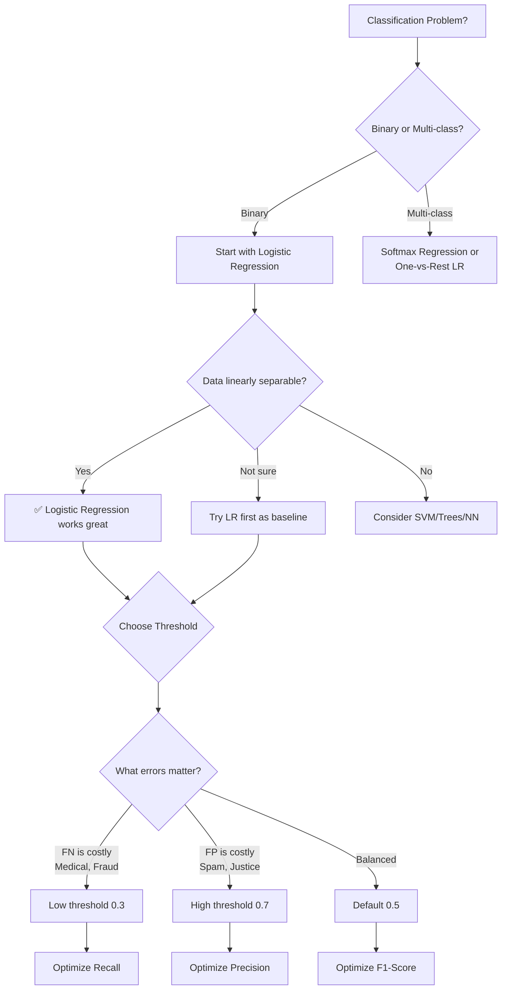

# AS28: Introduction to Classification with Logistic Regression — Exam Preparation

---

## Section A: Multiple Choice Questions (MCQ) — 15 Questions

---

### MCQ 1
**Question:** What type of machine learning task is classification?
- A) Unsupervised learning
- B) Reinforcement learning
- C) Supervised learning
- D) Semi-supervised learning

<details>
<summary>✅ Answer</summary>

**C) Supervised learning**

**Explanation:** Classification is supervised learning because it learns from labeled training data — each data point has both features (input) and a target label (output). The model learns the mapping from features to labels during training.

**Why others are wrong:**
- A) Unsupervised learning has no labels (e.g., clustering)
- B) Reinforcement learning learns through rewards/penalties
- D) Semi-supervised uses mix of labeled and unlabeled
</details>

---

### MCQ 2
**Question:** What is the range of the sigmoid function output?
- A) -1 to 1
- B) 0 to 1
- C) -∞ to +∞
- D) 0 to ∞

<details>
<summary>✅ Answer</summary>

**B) 0 to 1**

**Explanation:** The sigmoid function σ(z) = 1/(1+e^(-z)) always produces output strictly between 0 and 1. When z → +∞, σ(z) → 1. When z → -∞, σ(z) → 0. It never actually reaches 0 or 1, but gets arbitrarily close.

**Why others are wrong:**
- A) This is the range of tanh (hyperbolic tangent), not sigmoid
- C) This is the range of LINEAR regression output, not sigmoid
- D) This is the range of ReLU activation
</details>

---

### MCQ 3
**Question:** What does sigmoid(0) equal?
- A) 0
- B) 1
- C) 0.5
- D) Undefined

<details>
<summary>✅ Answer</summary>

**C) 0.5**

**Explanation:** sigmoid(0) = 1/(1+e^0) = 1/(1+1) = 1/2 = 0.5. This is the point of maximum uncertainty — the model is exactly 50-50. This always holds regardless of the model, features, or data.
</details>

---

### MCQ 4
**Question:** Why does linear regression fail for classification tasks?
- A) Linear regression is too complex for classification
- B) Linear regression produces unbounded outputs that can't be interpreted as probabilities
- C) Linear regression requires more data than classification algorithms
- D) Linear regression doesn't use gradient descent

<details>
<summary>✅ Answer</summary>

**B) Linear regression produces unbounded outputs that can't be interpreted as probabilities**

**Explanation:** Linear regression outputs values from -∞ to +∞. Classification needs probabilities (0-1). A prediction of 1.8 means "180% likely" which is meaningless. Also, linear regression uses MSE loss which optimizes numerical distance, not classification accuracy.

**Why others are wrong:**
- A) Linear regression is simpler, not more complex
- C) Data requirement depends on features, not algorithm type
- D) Linear regression CAN use gradient descent, and also has OLS
</details>

---

### MCQ 5
**Question:** What loss function does logistic regression use?
- A) Mean Squared Error (MSE)
- B) Mean Absolute Error (MAE)
- C) Log Loss (Cross-Entropy)
- D) Hinge Loss

<details>
<summary>✅ Answer</summary>

**C) Log Loss (Cross-Entropy)**

**Explanation:** Log Loss = -(1/n) × Σ[y×log(p) + (1-y)×log(1-p)]. It penalizes confident wrong predictions heavily. If model confidently predicts class 1 (p=0.99) but actual is 0, the loss is enormous. MSE doesn't penalize classification errors proportionally.

**Why others are wrong:**
- A) MSE is for linear regression — doesn't penalize wrong classifications properly
- B) MAE is for regression tasks
- D) Hinge loss is for SVM
</details>

---

### MCQ 6
**Question:** In logistic regression, the decision boundary when z = w₁x₁ + w₂x₂ + b = 0 is:
- A) Always a curve
- B) Always a straight line (in 2D)
- C) Sometimes straight, sometimes curved
- D) A circle

<details>
<summary>✅ Answer</summary>

**B) Always a straight line (in 2D)**

**Explanation:** The equation w₁x₁ + w₂x₂ + b = 0 is a linear equation in 2D, which always represents a straight line. Logistic regression is a LINEAR classifier — its decision boundary is always linear (straight line in 2D, hyperplane in higher dimensions).
</details>

---

### MCQ 7
**Question:** What is the threshold in logistic regression?
- A) A parameter learned during training
- B) The bias term in the model
- C) A probability cutoff chosen AFTER training to convert probabilities to class labels
- D) The learning rate for gradient descent

<details>
<summary>✅ Answer</summary>

**C) A probability cutoff chosen AFTER training to convert probabilities to class labels**

**Explanation:** The threshold is NOT part of model training. During training, the model learns weights and bias to predict probabilities. After training, WE choose a threshold (default 0.5) based on business needs to convert probabilities into final class decisions.

**Common trap:** Many beginners think threshold is learned during training — it's NOT!
</details>

---

### MCQ 8
**Question:** In a confusion matrix, a False Positive (FP) means:
- A) Model predicted Positive AND actual was Positive
- B) Model predicted Negative AND actual was Positive
- C) Model predicted Positive BUT actual was Negative
- D) Model predicted Negative AND actual was Negative

<details>
<summary>✅ Answer</summary>

**C) Model predicted Positive BUT actual was Negative**

**Explanation:** False Positive = the "positive prediction" was "false" (wrong). The model raised a false alarm. Example: Model said "spam" but email was actually NOT spam.

**Memory trick:** Read as "Falsely said Positive" → Predicted positive incorrectly.
</details>

---

### MCQ 9
**Question:** Precision is calculated as:
- A) TP / (TP + FN)
- B) TP / (TP + FP)
- C) TN / (TN + FP)
- D) (TP + TN) / (TP + TN + FP + FN)

<details>
<summary>✅ Answer</summary>

**B) TP / (TP + FP)**

**Explanation:** Precision answers "Of all POSITIVE predictions, how many were actually correct?" Denominator = all positive predictions (TP + FP), numerator = correct positive predictions (TP).

**Why others are wrong:**
- A) This is Recall (TP / All Actual Positives)
- C) This is Specificity or TNR
- D) This is Accuracy
</details>

---

### MCQ 10
**Question:** In medical diagnosis, which metric should be prioritized?
- A) Accuracy
- B) Precision
- C) Recall
- D) Specificity

<details>
<summary>✅ Answer</summary>

**C) Recall**

**Explanation:** In medical diagnosis, missing a disease (False Negative) is life-threatening. Recall = TP/(TP+FN) measures "how many actual disease cases did we catch?" Using a lower threshold maximizes recall — better to test 100 healthy people than miss 1 sick person.

**Why others are wrong:**
- A) Accuracy is misleading, especially if disease is rare
- B) Precision matters when FP is costly, but in medicine, FN (missed disease) is much worse than FP (unnecessary test)
- D) Specificity measures TN rate, not as critical here
</details>

---

### MCQ 11
**Question:** F1-Score uses _____ mean of precision and recall.
- A) Arithmetic
- B) Geometric
- C) Harmonic
- D) Weighted

<details>
<summary>✅ Answer</summary>

**C) Harmonic**

**Explanation:** F1 = 2×(P×R)/(P+R) = harmonic mean. Harmonic mean penalizes extreme values more than arithmetic mean. If precision=0.99 and recall=0.01: arithmetic mean=0.50 (looks OK), harmonic mean=0.02 (correctly terrible).
</details>

---

### MCQ 12
**Question:** Which of the following is TRUE about logistic regression?
- A) It can only handle linearly separable data
- B) Despite its name, it is a classification algorithm
- C) It uses MSE as loss function
- D) It produces unbounded outputs

<details>
<summary>✅ Answer</summary>

**B) Despite its name, it is a classification algorithm**

**Explanation:** The name "logistic regression" is historical — it internally regresses on probabilities (continuous 0-1), but the final output is a class label. It predicts the probability of belonging to class 1, then applies a threshold for classification.

**Why others are wrong:**
- A) It can work with non-separable data too (it just won't achieve perfect accuracy)
- C) It uses Log Loss (Cross-Entropy), not MSE
- D) Sigmoid ensures output is bounded between 0 and 1
</details>

---

### MCQ 13
**Question:** If a model has 95% accuracy on data with 950 negatives and 50 positives, what could this indicate?
- A) Excellent model performance
- B) The model may be predicting "negative" for everything
- C) The model has perfect precision
- D) The model has high recall

<details>
<summary>✅ Answer</summary>

**B) The model may be predicting "negative" for everything**

**Explanation:** With 950/1000 negatives, a trivial model that always predicts "negative" gets 950/1000 = 95% accuracy. But it catches zero positives (recall = 0). This is why accuracy is misleading with imbalanced data. Always check precision and recall alongside accuracy.
</details>

---

### MCQ 14
**Question:** What happens when you LOWER the classification threshold from 0.5 to 0.3?
- A) Both precision and recall increase
- B) Precision increases, recall decreases
- C) Precision decreases, recall increases
- D) Both precision and recall decrease

<details>
<summary>✅ Answer</summary>

**C) Precision decreases, recall increases**

**Explanation:** Lower threshold → more samples predicted as positive → catches more actual positives (recall ↑) but also more false alarms (precision ↓). This is the precision-recall tradeoff.
</details>

---

### MCQ 15
**Question:** The derivative of sigmoid function σ(z) is:
- A) σ(z) + (1 - σ(z))
- B) σ(z) × (1 - σ(z))
- C) 1 / σ(z)
- D) σ(z)²

<details>
<summary>✅ Answer</summary>

**B) σ(z) × (1 - σ(z))**

**Explanation:** The sigmoid derivative σ'(z) = σ(z) × (1 - σ(z)). This means the gradient is maximum at z=0 (where σ=0.5, derivative=0.25) and approaches 0 at extreme z values (vanishing gradient problem). This elegant property makes calculus computations efficient.
</details>

---

## Section B: Multiple Select Questions (MSQ) — 12 Questions

---

### MSQ 1
**Question:** Which of the following are reasons why linear regression fails for classification? (Select ALL that apply)
- A) ☐ Outputs can be less than 0
- B) ☐ Outputs can be greater than 1
- C) ☐ Uses MSE loss instead of log loss
- D) ☐ Cannot handle categorical features
- E) ☐ Sensitive to outliers which shift the decision boundary

<details>
<summary>✅ Answer</summary>

**A, B, C, E**

- ✅A: Linear regression can predict negative values, meaningless as probability
- ✅B: Linear regression can predict >1 values, meaningless as probability
- ✅C: MSE optimizes numerical distance, not classification accuracy
- ❌D: Categorical features can be encoded for linear regression — this is not classification-specific
- ✅E: Outliers tilt the regression line, shifting the decision boundary unfairly
</details>

---

### MSQ 2
**Question:** Which of the following are properties of the sigmoid function? (Select ALL that apply)
- A) ☐ Output is always between 0 and 1
- B) ☐ S-shaped curve
- C) ☐ sigmoid(0) = 0
- D) ☐ Differentiable everywhere
- E) ☐ Output can be interpreted as probability

<details>
<summary>✅ Answer</summary>

**A, B, D, E**

- ✅A: Output always in (0, 1) — mathematical proof: e^(-z) > 0 always
- ✅B: Classic S-shaped curve with smooth transition
- ❌C: sigmoid(0) = 0.5, NOT 0!
- ✅D: Derivative σ'(z) = σ(z)(1-σ(z)) exists everywhere
- ✅E: Output represents P(class=1|x), valid probability interpretation
</details>

---

### MSQ 3
**Question:** In which scenarios should you use a LOW threshold (e.g., 0.3)? (Select ALL that apply)
- A) ☐ Medical disease screening
- B) ☐ Spam email filtering
- C) ☐ Fraud detection
- D) ☐ Security threat detection
- E) ☐ Product recommendation

<details>
<summary>✅ Answer</summary>

**A, C, D**

- ✅A: Missing disease (FN) is life-threatening — catch every possible case
- ❌B: Spam filtering needs HIGH threshold — losing important email (FP) is worse
- ✅C: Missing fraud (FN) = financial loss — flag everything suspicious
- ✅D: Missing threat (FN) = security breach — catch all potential threats
- ❌E: Product recommendation can use balanced threshold — FP just means irrelevant suggestion
</details>

---

### MSQ 4
**Question:** Which of the following correctly describe the confusion matrix terms? (Select ALL that apply)
- A) ☐ True Positive = Model predicted positive, actual was positive
- B) ☐ False Negative = Model predicted negative, actual was positive
- C) ☐ False Positive = Model predicted positive, actual was positive
- D) ☐ True Negative = Model predicted negative, actual was negative

<details>
<summary>✅ Answer</summary>

**A, B, D**

- ✅A: TP — correct positive prediction ✅
- ✅B: FN — model missed a positive (dangerous!) ❌
- ❌C: This describes TRUE Positive, not FALSE Positive. FP = predicted positive, actual was NEGATIVE
- ✅D: TN — correct negative prediction ✅
</details>

---

### MSQ 5
**Question:** Which of these are advantages of logistic regression? (Select ALL that apply)
- A) ☐ Highly interpretable — coefficients show feature impact
- B) ☐ Can capture non-linear decision boundaries
- C) ☐ Produces natural probability output
- D) ☐ Fast to train
- E) ☐ Works well with small datasets
- F) ☐ Foundation for neural networks

<details>
<summary>✅ Answer</summary>

**A, C, D, E, F**

- ✅A: Coefficients directly show how much each feature affects prediction
- ❌B: Standard logistic regression only produces LINEAR boundaries — non-linear needs polynomial features or other algorithms
- ✅C: Sigmoid naturally outputs valid probabilities (0-1)
- ✅D: Convex optimization, converges quickly
- ✅E: Doesn't need large datasets unlike neural networks
- ✅F: Sigmoid appears in neural networks repeatedly
</details>

---

### MSQ 6
**Question:** When accuracy is misleading, which metrics should you check? (Select ALL that apply)
- A) ☐ Precision
- B) ☐ Recall
- C) ☐ F1-Score
- D) ☐ R² Score
- E) ☐ Confusion Matrix

<details>
<summary>✅ Answer</summary>

**A, B, C, E**

- ✅A: Precision reveals if positive predictions are correct
- ✅B: Recall reveals if actual positives are caught
- ✅C: F1 balances precision and recall in single metric
- ❌D: R² is for REGRESSION, not classification
- ✅E: Confusion matrix gives complete breakdown of TP, TN, FP, FN
</details>

---

### MSQ 7
**Question:** Which are components of the logistic regression pipeline? (Select ALL that apply)
- A) ☐ Linear combination z = wx + b
- B) ☐ Sigmoid activation
- C) ☐ Threshold-based decision
- D) ☐ Polynomial feature generation
- E) ☐ Log loss optimization

<details>
<summary>✅ Answer</summary>

**A, B, C, E**

- ✅A: First step — compute raw linear score z
- ✅B: Second step — convert z to probability via sigmoid
- ✅C: Third step — apply threshold for final class prediction
- ❌D: Polynomial features are optional enhancement, not core pipeline component
- ✅E: Training process — optimize weights by minimizing log loss
</details>

---

### MSQ 8
**Question:** Which statements about F1-Score are correct? (Select ALL that apply)
- A) ☐ F1 = harmonic mean of precision and recall
- B) ☐ F1 is high only when BOTH precision and recall are high
- C) ☐ F1 = (precision + recall) / 2
- D) ☐ F1 penalizes extreme imbalance between precision and recall
- E) ☐ F1 ranges from 0 to 1

<details>
<summary>✅ Answer</summary>

**A, B, D, E**

- ✅A: F1 = 2×(P×R)/(P+R) — harmonic mean formula
- ✅B: Harmonic mean requires both values to be high
- ❌C: This is ARITHMETIC mean, not harmonic mean
- ✅D: If one is very low, F1 drops significantly
- ✅E: F1 minimum is 0 (worst), maximum is 1 (perfect)
</details>

---

### MSQ 9
**Question:** Which of the following are valid alternatives to sigmoid for classification? (Select ALL that apply)
- A) ☐ Softmax (for multi-class)
- B) ☐ ReLU (for hidden layers)
- C) ☐ Decision Trees (different algorithm)
- D) ☐ Linear function (unbounded)
- E) ☐ SVM (with probability calibration)

<details>
<summary>✅ Answer</summary>

**A, C, E**

- ✅A: Softmax generalizes sigmoid for multi-class — outputs sum to 1
- ❌B: ReLU is for hidden layers in neural networks, not for classification output (unbounded)
- ✅C: Decision trees are alternative classification algorithm (non-linear boundaries)
- ❌D: Linear function is unbounded — the very problem sigmoid solves
- ✅E: SVM can do classification, and with calibration, can output probabilities
</details>

---

### MSQ 10
**Question:** What happens when the classification threshold is increased from 0.5 to 0.8? (Select ALL that apply)
- A) ☐ Fewer samples predicted as positive
- B) ☐ False positives decrease
- C) ☐ False negatives increase
- D) ☐ Recall increases
- E) ☐ Precision typically increases

<details>
<summary>✅ Answer</summary>

**A, B, C, E**

- ✅A: Higher bar for "positive" → fewer pass the threshold
- ✅B: Only very confident predictions labeled positive → fewer false alarms
- ✅C: Some actual positives below 0.8 threshold get labeled negative → more misses
- ❌D: Recall DECREASES because we miss more actual positives (FN increases)
- ✅E: Positive predictions are more confident → higher proportion are correct
</details>

---

### MSQ 11
**Question:** Which of the following correctly describe the logistic regression training process? (Select ALL that apply)
- A) ☐ Uses gradient descent for optimization
- B) ☐ Has a closed-form solution like OLS
- C) ☐ Minimizes log loss (cross-entropy)
- D) ☐ Learns weights w and bias b
- E) ☐ Learns the optimal threshold

<details>
<summary>✅ Answer</summary>

**A, C, D**

- ✅A: No closed-form solution → iterative gradient descent
- ❌B: Unlike linear regression, logistic regression does NOT have a closed-form solution
- ✅C: Log loss penalizes confident wrong predictions
- ✅D: Model learns optimal weights and bias during training
- ❌E: Threshold is chosen AFTER training by the user, NOT learned by the model
</details>

---

### MSQ 12
**Question:** For spam detection, which design choices are appropriate? (Select ALL that apply)
- A) ☐ Use higher threshold (0.7+) to avoid losing important emails
- B) ☐ Prioritize precision over recall
- C) ☐ Use logistic regression as baseline model
- D) ☐ Use low threshold (0.3) to catch all spam
- E) ☐ Monitor false positive rate in production

<details>
<summary>✅ Answer</summary>

**A, B, C, E**

- ✅A: Higher threshold → fewer false alarms → fewer important emails lost
- ✅B: FP (losing important email) is worse than FN (spam in inbox) → precision matters
- ✅C: Logistic regression is excellent baseline for text classification
- ❌D: Low threshold catches more spam but also marks important emails as spam
- ✅E: Monitoring FP rate ensures important emails aren't being lost
</details>

---

## Section C: Numerical Questions — 8 Questions

---

### Numerical 1
**Question:** Calculate sigmoid(-2). Round to 4 decimal places.

<details>
<summary>✅ Answer</summary>

**0.1192**

**Calculation:**
```
sigmoid(-2) = 1 / (1 + e^(-(-2)))
            = 1 / (1 + e^2)
            = 1 / (1 + 7.389)
            = 1 / 8.389
            = 0.1192
```
</details>

---

### Numerical 2
**Question:** Given TP=40, FP=10, FN=5, TN=45, calculate Precision. Round to 4 decimal places.

<details>
<summary>✅ Answer</summary>

**0.8000**

**Calculation:**
```
Precision = TP / (TP + FP)
          = 40 / (40 + 10)
          = 40 / 50
          = 0.8000
```
</details>

---

### Numerical 3
**Question:** Given TP=40, FP=10, FN=5, TN=45, calculate Recall. Round to 4 decimal places.

<details>
<summary>✅ Answer</summary>

**0.8889**

**Calculation:**
```
Recall = TP / (TP + FN)
       = 40 / (40 + 5)
       = 40 / 45
       = 0.8889
```
</details>

---

### Numerical 4
**Question:** Given Precision=0.80 and Recall=0.8889, calculate F1-Score. Round to 4 decimal places.

<details>
<summary>✅ Answer</summary>

**0.8421**

**Calculation:**
```
F1 = 2 × (Precision × Recall) / (Precision + Recall)
   = 2 × (0.80 × 0.8889) / (0.80 + 0.8889)
   = 2 × 0.7111 / 1.6889
   = 1.4222 / 1.6889
   = 0.8421
```
</details>

---

### Numerical 5
**Question:** Given TP=40, FP=10, FN=5, TN=45, calculate Accuracy. Express as percentage.

<details>
<summary>✅ Answer</summary>

**85.00%**

**Calculation:**
```
Accuracy = (TP + TN) / (TP + TN + FP + FN)
         = (40 + 45) / (40 + 45 + 10 + 5)
         = 85 / 100
         = 0.85 = 85.00%
```
</details>

---

### Numerical 6
**Question:** In the spam detector example, z = -2 + 0.5 × num_exclamation_marks. How many exclamation marks make z = 0 (decision boundary)?

<details>
<summary>✅ Answer</summary>

**4 exclamation marks**

**Calculation:**
```
z = 0 → -2 + 0.5 × x = 0
       → 0.5 × x = 2
       → x = 4
```
At 4 exclamation marks, z=0, sigmoid=0.5, model is exactly uncertain.
</details>

---

### Numerical 7
**Question:** If Precision = 0.95 and Recall = 0.05, what is the F1-Score? Round to 4 decimal places.

<details>
<summary>✅ Answer</summary>

**0.0950**

**Calculation:**
```
F1 = 2 × (0.95 × 0.05) / (0.95 + 0.05)
   = 2 × 0.0475 / 1.00
   = 0.0950
```

**Key insight:** Despite high precision (0.95), low recall (0.05) makes F1 terrible. Harmonic mean correctly penalizes this extreme imbalance. Arithmetic mean would be (0.95+0.05)/2 = 0.50 — misleadingly decent.
</details>

---

### Numerical 8
**Question:** Given confusion matrix [[80, 5], [15, 100]], calculate:
a) Accuracy b) Precision c) Recall d) F1

<details>
<summary>✅ Answer</summary>

**Mapping:** TN=80, FP=5, FN=15, TP=100

**a) Accuracy = (TP+TN)/(Total) = (100+80)/200 = 180/200 = 0.9000 = 90%**

**b) Precision = TP/(TP+FP) = 100/(100+5) = 100/105 = 0.9524**

**c) Recall = TP/(TP+FN) = 100/(100+15) = 100/115 = 0.8696**

**d) F1 = 2×(0.9524 × 0.8696)/(0.9524+0.8696) = 2×0.8283/1.8220 = 1.6566/1.8220 = 0.9091**
</details>

---

## Section D: Fill in the Blanks — 10 Questions

---

### FIB 1
**Question:** Classification predicts __________ labels, while regression predicts __________ values.

<details>
<summary>✅ Answer</summary>

**discrete (categorical)** ; **continuous**
</details>

---

### FIB 2
**Question:** The sigmoid function formula is σ(z) = 1 / (1 + __________).

<details>
<summary>✅ Answer</summary>

**e^(-z)**
</details>

---

### FIB 3
**Question:** sigmoid(0) always equals __________.

<details>
<summary>✅ Answer</summary>

**0.5**
</details>

---

### FIB 4
**Question:** The loss function used by logistic regression is called __________ or __________.

<details>
<summary>✅ Answer</summary>

**Log Loss** ; **Cross-Entropy**
</details>

---

### FIB 5
**Question:** Precision = TP / (TP + __________) and Recall = TP / (TP + __________).

<details>
<summary>✅ Answer</summary>

**FP** ; **FN**
</details>

---

### FIB 6
**Question:** F1-Score uses the __________ mean of precision and recall.

<details>
<summary>✅ Answer</summary>

**harmonic**
</details>

---

### FIB 7
**Question:** The classification threshold is chosen __________ model training, not __________ model training.

<details>
<summary>✅ Answer</summary>

**after** ; **during**
</details>

---

### FIB 8
**Question:** In medical diagnosis, __________ (precision/recall) is prioritized because missing a disease (__________ error) is life-threatening.

<details>
<summary>✅ Answer</summary>

**recall** ; **False Negative (FN)**
</details>

---

### FIB 9
**Question:** The derivative of sigmoid function is σ'(z) = σ(z) × __________.

<details>
<summary>✅ Answer</summary>

**(1 - σ(z))**
</details>

---

### FIB 10
**Question:** Logistic regression decision boundary in 2D is always a __________ because it is a __________ classifier.

<details>
<summary>✅ Answer</summary>

**straight line** ; **linear**
</details>

---

## Section E: Quick Revision Points

---

### 🔑 Top 20 Points to Remember

1. **Classification** = predict categories (discrete labels), NOT numbers
2. **Regression** = predict continuous values (numbers)
3. **Linear regression fails** for classification → unbounded outputs, wrong loss function
4. **Sigmoid** squashes ANY number to (0,1) → valid probability
5. **sigmoid(0) = 0.5** → always, mathematical truth
6. **Logistic Regression** = Linear + Sigmoid + Threshold → 3-stage pipeline
7. **Log Loss** penalizes confident wrong predictions → better than MSE for classification
8. **Gradient Descent** optimizes logistic regression → no closed-form solution
9. **Decision Boundary** = where probability = 0.5 (z = 0) → always LINEAR for logistic regression
10. **Threshold** = business decision, NOT model parameter → chosen AFTER training
11. **Lower threshold** → more positives, higher recall, lower precision
12. **Higher threshold** → fewer positives, higher precision, lower recall
13. **Confusion Matrix** = TP + TN + FP + FN → complete performance picture
14. **Accuracy** = (TP+TN)/Total → misleading with imbalanced data!
15. **Precision** = TP/(TP+FP) → "of my YES predictions, how many correct?"
16. **Recall** = TP/(TP+FN) → "of actual YES, how many found?"
17. **F1-Score** = harmonic mean → penalizes extreme imbalance
18. **Medical** → prioritize Recall (FN = death risk)
19. **Spam** → prioritize Precision (FP = lost important email)
20. **Logistic Regression is classification** despite "regression" in name!

---

## Section F: Shortcuts & Cheat Codes

---

### 🚀 Memory Tricks

**CLASSIFICATION vs REGRESSION:**
> "C for Categories, R for Real numbers" → Classification predicts Categories, Regression predicts Real (continuous) numbers.

**SIGMOID properties:**
> "SOZ → Sigmoid Of Zero = 0.5" → Always remember sigmoid(0) = 0.5

**PRECISION vs RECALL:**
> "P = Predicted Positives quality | R = Real positives coverage"
> Precision = out of Predicted Positives | Recall = out of Real (actual) Positives

**False Positive vs False Negative:**
> "Read backwards: FP = Falsely called Positive | FN = Falsely called Negative"

**When to use LOW threshold:**
> "If MISSING is KILLING → LOW threshold" → Medical, Fraud, Security

**When to use HIGH threshold:**
> "If FALSE ALARM is COSTLY → HIGH threshold" → Spam, Recommendations

---

### 🧮 Quick Calculation Hacks

**Sigmoid shortcut values:**
| z | sigmoid | Memory trick |
|---|---------|-------------|
| -∞ | ≈ 0 | Very negative → very unlikely |
| -2 | ≈ 0.12 | ~12% — "barely there" |
| -1 | ≈ 0.27 | ~27% — "quarter chance" |
| 0 | = 0.50 | "Middle — uncertain" |
| 1 | ≈ 0.73 | ~73% — "three-quarter" |
| 2 | ≈ 0.88 | ~88% — "high confidence" |
| +∞ | ≈ 1 | Very positive → very likely |

**Symmetry trick:** sigmoid(-z) = 1 - sigmoid(z)
Example: sigmoid(-2) = 1 - sigmoid(2) = 1 - 0.88 = 0.12 ✅

**F1-Score quick check:**
- If P = R → F1 = P = R (harmonic mean of equal values = the value)
- If one is 0 → F1 = 0
- F1 is always ≤ min(P, R)... wait NO → F1 is always between min(P,R) values

**Accuracy from confusion matrix:**
> "Diagonal sum / Total" → (TN + TP) / (TN + FP + FN + TP)

---

### 📝 Last-Minute Formula Sheet

```
Sigmoid:       σ(z) = 1 / (1 + e^(-z))
Sigmoid':      σ'(z) = σ(z) × (1 - σ(z))
Log Loss:      -(1/n) Σ [y·log(p) + (1-y)·log(1-p)]
Accuracy:      (TP + TN) / (TP + TN + FP + FN)
Precision:     TP / (TP + FP)
Recall:        TP / (TP + FN)
Specificity:   TN / (TN + FP)
F1-Score:      2 × (P × R) / (P + R)
```

---

### 🎙️ Interview One-Liners

| Question | One-Liner Answer |
|----------|-----------------|
| What is classification? | Predicting discrete categories using supervised learning |
| Why not linear regression? | Unbounded output, wrong loss function, can't produce valid probabilities |
| What does sigmoid do? | Squashes any real number into a probability between 0 and 1 |
| sigmoid(0) = ? | Always 0.5, mathematically guaranteed |
| Is logistic regression actually regression? | No — it's classification that internally computes probabilities |
| What loss function? | Log Loss (Cross-Entropy) — penalizes confident wrong predictions |
| What is a decision boundary? | Line/surface where model probability equals the threshold (typically 0.5) |
| Is threshold learned? | No — chosen AFTER training based on business needs |
| Precision vs Recall? | Precision = quality of positive predictions; Recall = coverage of actual positives |
| When use F1? | When both FP and FN errors are equally costly |
| Why accuracy misleading? | Imbalanced data — majority class predictor gets high accuracy but useless |

---

### 🏆 Golden Rules (Top 5)

1. **Always check class balance** before trusting accuracy
2. **Threshold is your business decision** — model just gives probabilities
3. **Start with logistic regression** as baseline before trying complex models
4. **F1-Score requires BOTH** precision and recall to be good — one alone can't save it
5. **Domain expertise determines** which metric matters most — no universal "best metric"

---

### 🔄 Quick Decision Flowchart



---

### 🚫 Safe Answer Patterns for Exams

**"Why not linear regression for classification?"**
> "Three reasons: (1) unbounded output — can predict values outside 0-1, (2) MSE loss doesn't optimize classification accuracy, (3) outlier sensitivity shifts decision boundary. Logistic regression solves all three via sigmoid function and log loss."

**"Explain logistic regression in 3 sentences."**
> "Logistic regression is a classification algorithm that uses a linear combination of features passed through a sigmoid function to produce probabilities. The sigmoid squashes unbounded values into 0-1 range. A threshold converts these probabilities into final class predictions."

**"Precision vs Recall — when to prioritize which?"**
> "Prioritize Precision when False Positives are costly (spam filter, criminal conviction). Prioritize Recall when False Negatives are costly (medical diagnosis, fraud detection). Use F1-Score when both errors are equally important."

**"What is the confusion matrix?"**
> "A 2×2 table with four cells: TP (correctly predicted positive), TN (correctly predicted negative), FP (incorrectly predicted positive — false alarm), FN (incorrectly predicted negative — missed). It provides complete performance breakdown beyond just accuracy."

---

*End of Exam Preparation — AS28: Introduction to Classification with Logistic Regression*
