# AS29: Classifiers Overview - Classroom Session (Part 1)

> 📚 **This is Part 1** covering: Classification Basics, Binary vs Multi-class vs Multi-label, Linear vs Non-linear Classifiers, K-Nearest Neighbors (KNN)
> 📘 **See also:** [Part 2](./AS29_ClassifiersOverview2.md), [Part 3](./AS29_ClassifiersOverview3.md)

---

## 🗺️ Mind Map - Topics to Cover


---

## 🎓 Classroom Conversation

---

### Topic 1: What is Classification?

**Teacher:** Okay students, andari ki good evening! 🙏 Ippudu mana session start cheddham — **Classifiers Overview**! Idi chala important topic, because machine learning lo classification problems ekkada chuddham annna vastay — email spam detection, disease diagnosis, image recognition — anni classification problems ye.

Classification ante simple ga cheppali ante — **mana data ni categories lo sort cheyyadam**. Manaki training data untundi, aa data lo patterns nerchukunni, oka kotta data point vachhinappudu correct category lo place cheyyadam — idi classification!

> 💡 **Jargon Alert - Classification**
> Simple Explanation: Data ni groups (categories) lo sort cheyyadam, just like post office lo letters ni different cities ki sort cheyyadam
> Example: Email spam detection — "Is this email spam or not spam?"

**Beginner Student:** Sir, classification ante exactly regression ki difference enti? Both lo prediction chestham kadha?

**Teacher:** Chala manchidi question! Regression lo mana output **continuous** value untundi — house price, salary lanti values predict chestham. Classification lo mana output **discrete categories** untundi — spam/not spam, cat/dog, disease/healthy lanti labels predict chestham.

Analogy cheppali ante — Regression is like guessing someone's weight (any number possible: 50kg, 67.5kg, 72.3kg). Classification is like guessing someone's blood group (only A, B, AB, O — fixed categories).

| Aspect | Regression | Classification |
|--------|-----------|---------------|
| Output | Continuous values (numbers) | Discrete categories (labels) |
| Example | House price = ₹45,00,000 | Email = Spam / Not Spam |
| Line | Best fit line | Decision boundary |
| Function | Linear equation | Sigmoid, majority voting, etc. |

**Clever Student:** Sir, classification lo different types untaya? Like only 2 categories or more?

**Teacher:** Excellent question! Classification lo **three types** untayi:

---

### Topic 2: Binary, Multi-class, and Multi-label Classification

**Teacher:** Let me explain all three types clearly:

**1️⃣ Binary Classification:**
- Only **2 classes** untayi
- Yes or No, Spam or Not Spam, Survived or Dead
- Most simple classification problem
- Logistic Regression, which we already learned, is binary classifier

**2️⃣ Multi-class Classification:**
- **More than 2 classes** untayi
- Cat / Dog / Cow / Horse — oka data point **only one class lo** pothadi
- Example: Animal image classification — oka image cat o dog o cow o — only one answer
- Multiple features chudali: shape, color, texture, size

**3️⃣ Multi-label Classification:**
- Oka data point **multiple classes lo** belong avtundi
- Example: Movie recommendation — oka movie action also, comedy also, thriller also avvochu
- Example: News article — "Technology" + "Business" + "Innovation" ani multiple tags untayi


**Beginner Student:** Sir, multi-class and multi-label confusing ga undi. Clear ga cheppandi.

**Teacher:** Baaga cheppatha. Simple analogy use chesthanu:

**Multi-class** = School exam — each student gets **one grade only**: A, B, C, D, or F. Student ki oka grade only vastundi.

**Multi-label** = Student ki skills — one student can have **multiple skills**: Python, Machine Learning, Communication, Leadership. Multiple tags possible.

| Aspect | Multi-class | Multi-label |
|--------|------------|-------------|
| Output per data point | Exactly 1 class | 1 or more classes |
| Example | Image → Cat | Movie → Action + Comedy |
| Complexity | Moderate | Higher |
| Analogy | One blood group | Multiple hobbies |

**Critique Student:** Sir, multi-label classification harder than multi-class kadha? Always multi-class use cheyocha?

**Teacher:** Correct ga cheppav! Multi-label is definitely harder. Kani, some problems inherently multi-label — movie categorization, medical diagnosis lo oka patient ki multiple diseases undochu. Problem nature ki match ayye type use cheyali. Incorrect type use chesthe wrong results vasthay.

**Practical Student:** Sir, interview lo ee three types adugutara?

**Teacher:** Definitely! "What are the types of classification?" is a very common interview question. Three types clearly cheppali: binary, multi-class, multi-label — with examples for each. Real-world use case also mention cheyali — interviewers impress avutharu.

---

### Topic 3: Linear vs Non-linear Classifiers

**Teacher:** Ippudu oka important distinction nerchukundhaam — **Linear vs Non-linear classifiers**. Idi chala critical because mana data ki correct classifier choose cheyyadaniki ee concept clear ga undali.

> 💡 **Jargon Alert - Linear Classifier**
> Simple Explanation: Straight line tho classes ni separate chese classifier. X change chesthe Y also proportionally change avuthundi.
> Example: Road lo oka white line tho left lane and right lane separate chesinatu — simple straight boundary.

> 💡 **Jargon Alert - Non-linear Classifier**
> Simple Explanation: Curves, circles, complex shapes tho classes ni separate chese classifier. Relationship straight line follow avvadu.
> Example: Football ground lo oka curved boundary tho different areas mark chesinatu — complex boundary.

**Teacher:** Linear classifier ante — X and Y relationship **straight line** follow avuthundi. Logistic Regression mana AS28 lo already chudinam — adi linear classifier. Y = WX + B tho start chesi sigmoid apply chesinam.

**Linear Classifiers examples:**
- Logistic Regression
- Linear SVM (kernel = 'linear')
- Single Layer Perceptron
- SGD Classifier (Stochastic Gradient Descent)

**Non-linear Classifiers examples:**
- K-Nearest Neighbors (KNN) — both linear and non-linear handle chestha
- Kernel-based SVM (RBF kernel)
- Decision Trees — completely non-linear
- Neural Networks — proven to be non-linear
- Random Forest — related to trees, so non-linear

**Debate Student:** Sir, linear classifiers real life lo useful ey na? Most data non-linear kadha?

**Teacher:** Very good point! Real life lo, yes, most data non-linear ye. But linear classifiers ni enduku study chesthamu ante:

1. **Starting point** — any problem first simple solution tho try chestham
2. **Baseline** — linear model performance chuddam, then improve chestham
3. **Sometimes lucky** — some problems genuinely linear undochu
4. **Understanding** — linear concept clear unte non-linear ardham avuthundi

**Curious Student:** Sir, data linear o non-linear o ela decide chestharu?

**Teacher:** Great question! Data relationship linear o non-linear o identify cheyyadaniki:

1. **Scatter plot** — data plot chesthe relationship kanipistundi
2. **Residual analysis** — linear model fit chesina tarvata residuals lo pattern unte non-linear
3. **Try both** — linear model train chesi, non-linear model train chesi, accuracy compare cheyandi
4. **Domain knowledge** — some domains lo relationship type mundhe telisipothundi

Simple rule: **If data deviated from straight line, it is non-linear.**


**Practical Student:** Sir, interview lo linear vs non-linear question vasthe ela answer ivvali?

**Teacher:** Perfect interview answer structure:

> "Linear classifiers assume a straight-line decision boundary between classes. Examples include Logistic Regression and Linear SVM. Non-linear classifiers can learn curved, complex boundaries. Examples include Decision Trees, KNN, and Neural Networks. The choice depends on data — if features and output have a linear relationship, use linear classifier for simplicity. Otherwise, use non-linear classifier for better accuracy."

---

### Topic 4: K-Nearest Neighbors (KNN) — Deep Dive

**Teacher:** Ippudu mana first major classifier ki vasthunnam — **K-Nearest Neighbors (KNN)**! Idi machine learning lo **simplest algorithm** — endukante dini lo actual training ye undadu! 😮

#### 12-Point Structure for KNN

---

#### 🔹 Point 1: Definition

**Teacher:** K-Nearest Neighbors (KNN) ante — **oka kotta data point ni classify cheyyadaniki daaniki closest ga unna K training data points ni chuddam, vaati lo majority class enti adi assign cheddham** — idi KNN!

Simple ga cheppali ante: "You are known by the company you keep" — neeku nearest ga unna friends evarante, nuvvu vaari lanti vaadive!

10-year-old ki explain cheyali ante: "Nuvvu school lo kotta ga vasthav. Nee seat daggara 5 students unnaru — 3 mandhi cricketers, 2 mandhi footballers. Nuvvu kuda probably cricketer avutav — because nee neighbors lo majority cricketers!"

> 💡 **Jargon Alert - K-Nearest Neighbors (KNN)**
> Simple Explanation: Nee daggara unna K neighbors ni chuddam, vaari lo majority class lo ninnu classify cheddham. Training time lo maths emi cheyamu — data store chesi, test time lo distances calculate chesi neighbors chuddam.
> Example: New student school lo vasthe — daggara unna 5 seats lo ekkuva mandhi science students unte, new student kuda science group lo count avthadu.

---

#### 🔹 Point 2: Simple Analogy

**Teacher:** Best analogy — **"New student joins a school"** analogy:

Imagine mee class lo new student join avthadu. Teacher ki teliyadu ee student eppudu sports day lo emiti choose chesthado. Kani teacher nee seat around 5 students ni chuddham — 3 mandhi cricket, 1 basketball, 1 football. Teacher conclude chesthadu: "This new student will probably play cricket!"

Idi exactly KNN — **nearest neighbors chuddam, majority voting tho decide cheddham!**

```
Training Data (stored as is — no learning!):
  ✏️ Student 1: [Math=90, Science=85] → Science Group
  ✏️ Student 2: [Math=88, Science=92] → Science Group  
  ✏️ Student 3: [Math=45, Science=30] → Arts Group
  ✏️ Student 4: [Math=50, Science=35] → Arts Group
  ✏️ Student 5: [Math=42, Science=88] → Science Group

New Student: [Math=87, Science=80] → ???
KNN (K=3): 3 nearest = Student1, Student2, Student5 → All Science Group
Result: Science Group! ✅
```

**Beginner Student:** Sir, KNN eppudu training chesthadi? Formula emiti?

**Teacher:** Idi key point — **KNN lo training ye undadu!** 🙅‍♂️ Anduke daanini **"Lazy Learner"** antaru. Training step lo algorithm simply data store chesthadi — that's it! All the real work happens at **inference (prediction) time**.

> 💡 **Jargon Alert - Lazy Learner**
> Simple Explanation: Training time lo emi nerchukovadu — data store chesukuntadu. Test time lo work chesthadu — just like exam mundu study cheyyani student, exam hall lo neighbors answer sheet chuddham copy chesthadu! 😄
> Example: KNN is lazy because it doesn't learn parameters or create a model during training — it simply memorizes all training data.

---

#### 🔹 Point 3: Why KNN is Used

**Teacher:** KNN enduku use chestharu — answer simple: **simplicity and zero assumptions!**

| Problem KNN Solves | How |
|--------------------|-----|
| No math/formula needed | Just store data, calculate distances |
| Works for any data shape | Non-parametric — no assumption about data distribution |
| Quick prototyping | No training — results immediate |
| Multi-class natural | Majority voting works for 2 classes or 200 classes |
| Frequently changing data | Just update stored data — no retraining |

**Clever Student:** Sir, KNN linear or non-linear handle chestha?

**Teacher:** KNN **both** handle chestha! Endukante adi **no fixed mathematical function** follow avvadu. Data distribution lo implicit ga decision boundary emerge avuthundi. If data is linearly separable — KNN works. If data has complex non-linear patterns — KNN still works because it's just checking neighbors!

**Critique Student:** Sir, kani real life lo KNN ekkadaina use chesthara actually? Adi chala simple ga kanipisthundi.

**Teacher:** Valid concern! KNN is actually used in:
1. **Small recommendation systems** — Spotify, Netflix small-scale similar item finding
2. **Pattern recognition** — Handwriting recognition (initial systems)
3. **Anomaly detection** — Finding unusual patterns (outlier detection)
4. **Medical diagnosis** — When you have very few samples
5. **Image classification** — Small-scale simple image classifiers

Production lo directly rare — but as **baseline model** and **quick prototyping** chala useful!

---

#### 🔹 Point 4: When to Use KNN

**Teacher:** KNN use cheyyali conditions:

| Condition | Why KNN Works |
|-----------|---------------|
| Small dataset (< 50,000 samples) | Distance calculation manageable |
| Low dimensions (few features) | Less curse of dimensionality |
| No time for training | KNN has zero training time |
| Irregular decision boundaries | KNN adapts to any data shape |
| Quick baseline needed | Immediate results, no tuning |
| Data changes frequently | Just update stored data |

**When NOT to use KNN:**
- Large datasets (> 100,000 samples) — too slow
- High dimensional data (many features) — curse of dimensionality
- Real-time predictions needed — inference too slow
- Production systems with latency requirements

---

#### 🔹 Point 5: Where KNN is Used (Real-World)

**Teacher:** KNN use cases real projects lo:


---

#### 🔹 Point 6: Is KNN the Only Way? (Alternatives Comparison)

**Teacher:** KNN oke kaadu — alternatives kuda unnay:

| Algorithm | Type | Training | Inference | Memory | Best For |
|-----------|------|----------|-----------|--------|----------|
| **KNN** | Lazy / Distance-based | None (stores data) | Slow (distance calc) | High | Small data, prototyping |
| **Logistic Regression** | Boundary-based | Fast (learns W, B) | Very Fast | Low | Binary linear problems |
| **SVM** | Boundary-based | Slow (optimization) | Fast | Medium | High-dimensional |
| **Decision Tree** | Rule-based | Fast (builds tree) | Very Fast | Low | Interpretable results |
| **Neural Network** | Complex non-linear | Very Slow | Fast | High | Large complex data |

**Debate Student:** Sir, KNN simple kadha, enduku adi use chestharu? Logistic Regression better kadha?

**Teacher:** Good debate! KNN advantages over Logistic Regression:
- **No assumption** — KNN assumes nothing about data. Logistic Regression assumes linear relationship
- **Multi-class natural** — KNN naturally handles any number of classes
- **No training** — Instant results
- **Any shape boundary** — KNN creates complex boundaries that Logistic Regression cannot

But Logistic Regression advantages:
- **Faster predictions** — Just evaluate equation
- **Less memory** — Only stores learned parameters
- **Scalable** — Works with large datasets
- **Probability output** — Natural probability estimates

---

#### 🔹 Point 7: Mermaid Diagram — KNN Process

```mermaid
flowchart TD
    A["🆕 New Data Point<br>Features: [x1, x2]"] --> B["📏 Calculate Distance<br>to ALL training points"]
    B --> C["🔢 Sort by Distance<br>Smallest to Largest"]
    C --> D["🎯 Select K Nearest<br>Neighbors"]
    D --> E["🗳️ Majority Voting<br>Count class of each neighbor"]
    E --> F{"Which class<br>has majority?"}
    F -->|"Class A wins"| G["✅ Classify as Class A"]
    F -->|"Class B wins"| H["✅ Classify as Class B"]
    
    style A fill:#ff6b6b,color:#fff
    style G fill:#51cf66,color:#fff
    style H fill:#339af0,color:#fff
```



---

#### 🔹 Point 8: How to Use KNN (Syntax + Code)

**Teacher:** KNN algorithm step by step:

**Step 1: Choose K (number of neighbors)**
**Step 2: Calculate distance from new point to ALL training points**
**Step 3: Sort distances and pick K smallest**
**Step 4: Majority voting — which class majority?**
**Step 5: Assign that class to new point**

```python
# ============================================
# KNN from Scratch — Understand the Algorithm
# ============================================
import numpy as np

# Training data — already stored (no training!)
# Each row: [feature1, feature2, class_label]
training_data = np.array([
    [2, 3],    # Class A
    [3, 3],    # Class A
    [1, 1],    # Class B
    [2, 1],    # Class B
])
labels = ['A', 'A', 'B', 'B']

# New point to classify
new_point = np.array([2.5, 2.5])

# Step 1: K = 3
K = 3

# Step 2: Calculate Euclidean distance to ALL training points
distances = []
for i, point in enumerate(training_data):
    dist = np.sqrt(np.sum((new_point - point) ** 2))
    distances.append((dist, labels[i]))
    print(f"Distance to {point} (Class {labels[i]}): {dist:.2f}")

# Step 3: Sort by distance
distances.sort(key=lambda x: x[0])
print(f"\nSorted distances: {distances}")

# Step 4: Pick K nearest neighbors
k_nearest = distances[:K]
print(f"K={K} nearest neighbors: {k_nearest}")

# Step 5: Majority voting
from collections import Counter
votes = Counter([label for _, label in k_nearest])
prediction = votes.most_common(1)[0][0]
print(f"\nPrediction: Class {prediction}")
```

**Expected Output:**
```
Distance to [2 3] (Class A): 0.71
Distance to [3 3] (Class A): 0.71
Distance to [1 1] (Class B): 2.12
Distance to [2 1] (Class B): 1.58

Sorted distances: [(0.71, 'A'), (0.71, 'A'), (1.58, 'B'), (2.12, 'B')]
K=3 nearest neighbors: [(0.71, 'A'), (0.71, 'A'), (1.58, 'B')]

Prediction: Class A
```

**Using sklearn:**

```python
# ============================================
# KNN using sklearn — Industry Standard Way
# ============================================
from sklearn.neighbors import KNeighborsClassifier
from sklearn.preprocessing import StandardScaler
import numpy as np

# Training data
X_train = np.array([[2, 3], [3, 3], [1, 1], [2, 1]])
y_train = np.array(['A', 'A', 'B', 'B'])

# IMPORTANT: Scale features BEFORE using KNN!
scaler = StandardScaler()
X_train_scaled = scaler.fit_transform(X_train)

# Create KNN classifier with K=3
knn = KNeighborsClassifier(n_neighbors=3)  # K=3
knn.fit(X_train_scaled, y_train)  # "Training" = just storing data

# Predict for new point
new_point = np.array([[2.5, 2.5]])
new_point_scaled = scaler.transform(new_point)
prediction = knn.predict(new_point_scaled)
print(f"Prediction: {prediction[0]}")  # Output: A
```

---

#### 🔹 Point 9: How KNN Works Internally

**Teacher:** KNN internal working step-by-step — recipe la cheppatha:

```
Step 1: TRAINING PHASE (Lazy — No actual learning!)
   ├── Receive training data (X_train, y_train)
   ├── Store ALL data points in memory
   └── Done! (No math, no optimization, no parameters learned)

Step 2: INFERENCE PHASE (All the work happens here!)
   ├── Receive new point to classify
   ├── Calculate distance from new point to EVERY stored point
   │   ├── Euclidean: sqrt(sum((x_new - x_stored)²))
   │   └── OR Manhattan: sum(|x_new - x_stored|)
   ├── Sort all distances (smallest first)
   ├── Pick top K distances (K nearest neighbors)
   ├── Count class labels of K neighbors
   └── Return the class with maximum votes
```

> 💡 **Jargon Alert - Euclidean Distance**
> Simple Explanation: Two points madhya "as the crow flies" — straight line distance. Like ruler tho measure chesinatu.
> Formula: d = √((x₁-x₂)² + (y₁-y₂)²)
> Example: Points (1,2) and (4,6) → d = √((4-1)² + (6-2)²) = √(9+16) = √25 = 5

> 💡 **Jargon Alert - Manhattan Distance**
> Simple Explanation: Two points madhya road lo walking distance — only horizontal + vertical moves. Like city blocks lo walk chesinatu.
> Formula: d = |x₁-x₂| + |y₁-y₂|
> Example: Points (1,2) and (4,6) → d = |4-1| + |6-2| = 3 + 4 = 7

```mermaid
flowchart TD
    A["Training Phase"] --> B["Store ALL data<br>in memory"]
    B --> C["No parameters learned<br>No model created<br>Just memorize!"]
    
    D["Inference Phase"] --> E["New point arrives"]
    E --> F["Calculate distance<br>to ALL stored points"]
    F --> G["Euclidean: √Σ(xi-yi)²<br>Manhattan: Σ|xi-yi|"]
    G --> H["Sort distances<br>Pick K smallest"]
    H --> I["Majority vote<br>among K neighbors"]
    I --> J["Return majority class"]
    
    style C fill:#ff6b6b,color:#fff
    style J fill:#51cf66,color:#fff
```



**Curious Student:** Sir, Euclidean vs Manhattan — eppudu edi use cheyali?

**Teacher:** Interesting question!

| Scenario | Use Euclidean | Use Manhattan |
|----------|---------------|---------------|
| Normal continuous data | ✅ Default choice | ❌ |
| High-dimensional data | ❌ Suffers from curse | ✅ Better in high dims |
| Outliers in data | ❌ Sensitive (squared) | ✅ More robust |
| Grid-like features | ❌ | ✅ Natural fit |
| Default recommendation | ✅ Most common | Alternative |

Euclidean distance lo squaring hota hai — so outliers ka impact zyada badhta hai. Manhattan distance more robust hai because you're just taking absolute differences, no squaring.

---

#### 🔹 Point 10: Visual Summary

**Teacher:** Let me give you a visual summary of KNN:

```
🔑 KNN = No Training + Distance-Based Prediction

📋 TRAINING:
   Input Data → [Store Everything] → Done! (Lazy!)

🔮 PREDICTION:
   New Point → [Calculate ALL Distances] → [Sort] → [Pick K Nearest] → [Majority Vote] → Class Label

⚙️ KEY HYPERPARAMETER:
   K = Number of neighbors to consider
   ├── Small K (1-3): Sensitive to noise/outliers → OVERFITTING risk
   ├── Medium K (5-9): Good balance → Usually best
   └── Large K (50+): Smooth but miss local patterns → UNDERFITTING risk

📏 DISTANCE METRICS:
   ├── Euclidean Distance: √Σ(xi-yi)² → Default, straight-line distance
   └── Manhattan Distance: Σ|xi-yi| → City-block distance, robust to outliers

⚠️ MANDATORY PREPROCESSING:
   Feature Scaling REQUIRED! (StandardScaler or MinMaxScaler)
   Without scaling → features with large ranges dominate!
```

---

#### 🔹 Point 11: Advantages & Disadvantages (WITH PROOF)

**Teacher:** KNN advantages and disadvantages — proof tho cheptham, just claims kaadu!

##### ✅ Advantages:

**Advantage 1: Zero Training Time**
- **Claim:** KNN has no training phase — instant availability
- **Proof:** In sklearn, `knn.fit()` just stores data internally. No iterations, no gradient descent, no parameter optimization happens.
- **Real-Life Analogy:** Like a new employee who doesn't study company policies — instead, when a question comes, he asks 5 nearest colleagues and goes with majority opinion.
- **When it matters:** When data changes frequently and retraining is expensive. New data? Just add to storage!

```python
# Proof: KNN "training" is just storing data
import time
from sklearn.neighbors import KNeighborsClassifier
import numpy as np

X_train = np.random.randn(10000, 10)  # 10000 samples, 10 features
y_train = np.random.randint(0, 3, 10000)  # 3 classes

knn = KNeighborsClassifier(n_neighbors=5)

start = time.time()
knn.fit(X_train, y_train)  # Just stores!
train_time = time.time() - start
print(f"KNN 'Training' time: {train_time:.4f} seconds")
# Output: ~0.001 seconds — because no actual training!
```

**Advantage 2: No Assumptions About Data Distribution**
- **Claim:** KNN works for any data shape — linear, circular, irregular
- **Proof:** Since KNN just checks neighbors, it adapts to any data distribution. Unlike Logistic Regression which assumes linear boundary.
- **Real-Life Analogy:** Like a student who doesn't follow any rulebook — just copies from nearest classmates regardless of subject.
- **When it matters:** When you don't know the data distribution and want a safe first try.

**Advantage 3: Naturally Handles Multi-class Problems**
- **Claim:** KNN works same for 2 classes or 200 classes — no modification needed
- **Proof:** Majority voting naturally extends to any number of classes. SVM needs special modifications (One-vs-One, One-vs-Rest) for multi-class.
- **Real-Life Analogy:** In election, counting votes works whether there are 2 candidates or 20 candidates — same process!
- **When it matters:** When you have many categories to classify into.

##### ❌ Disadvantages:

**Disadvantage 1: Slow Predictions (High Inference Time)**
- **Claim:** KNN is extremely slow at prediction time, especially with large datasets
- **Proof:** For each prediction, KNN must calculate distance to ALL N training points. With 1 million training points and 100 features, that's 1 million distance calculations per prediction!
- **Real-Life Analogy:** Exam lo oka question ka answer likhne ke liye, puri class ke sabhi students ka answer sheet check karna padta hai — bahut slow!
- **When it matters:** Real-time applications (voice assistants, fraud detection in milliseconds) — KNN too slow!

```python
# Proof: KNN prediction is SLOW compared to trained models
import time
from sklearn.neighbors import KNeighborsClassifier
from sklearn.linear_model import LogisticRegression
import numpy as np

X = np.random.randn(50000, 20)
y = np.random.randint(0, 2, 50000)
X_test = np.random.randn(100, 20)

# KNN prediction
knn = KNeighborsClassifier(n_neighbors=5)
knn.fit(X, y)
start = time.time()
knn.predict(X_test)
knn_time = time.time() - start

# Logistic Regression prediction
lr = LogisticRegression(max_iter=1000)
lr.fit(X, y)
start = time.time()
lr.predict(X_test)
lr_time = time.time() - start

print(f"KNN prediction time: {knn_time:.4f}s")
print(f"LR prediction time: {lr_time:.4f}s")
print(f"KNN is {knn_time/lr_time:.0f}x slower!")
# KNN typically 10-100x slower!
```

**Disadvantage 2: High Memory Usage**
- **Claim:** KNN must store the entire training dataset in memory
- **Proof:** Unlike trained models that store only learned parameters (W, B), KNN stores every single data point. 1GB of training data = 1GB of memory always occupied.
- **Real-Life Analogy:** Like carrying all your textbooks to every exam instead of just a formula sheet!
- **When it matters:** Embedded systems, mobile apps, any memory-constrained environment.

**Disadvantage 3: Curse of Dimensionality**
- **Claim:** KNN performs poorly in high-dimensional spaces
- **Proof:** As dimensions increase, all points become roughly equidistant from each other. In 100 dimensions, the concept of "nearest neighbor" becomes meaningless because everyone is far from everyone!
- **Real-Life Analogy:** In a small room (2D), you can easily find your nearest friend. In a huge stadium with 100 floors (100D), everyone is roughly equally far from you — "nearest" lost meaning.
- **When it matters:** Text classification (thousands of word features), genomics (millions of gene features).

> 💡 **Jargon Alert - Curse of Dimensionality**
> Simple Explanation: Dimensions (features) ekkuva ayithe, data points chala sparse (doranga) avuthayi — neighbors finding difficult avuthundi, concept of "near" meaningless avuthundi.
> Example: 2D room lo nearest friend easy ga kanipistadu. 100D hyperspace lo — everyone equally far!

**Disadvantage 4: Sensitive to Irrelevant Features and Outliers**
- **Claim:** All features contribute equally to distance — irrelevant features add noise
- **Proof:** If you have features [age, income, shoe_size] for predicting disease, shoe_size (irrelevant) still contributes to distance, pulling neighbors incorrectly.
- **Real-Life Analogy:** Exam preparation lo — if you study 3 important chapters and 7 irrelevant chapters equally, you waste time and get confused.
- **When it matters:** Always! Feature selection is CRITICAL before using KNN.

---

#### 🔹 Point 12: Jargon Glossary

| Term | Simple Explanation |
|------|-------------------|
| **KNN** | Algorithm that classifies by majority vote of K nearest neighbors |
| **K** | Number of neighbors to consider — hyperparameter chosen by user |
| **Lazy Learner** | Algorithm that doesn't learn during training — just memorizes data |
| **Instance-based Learning** | Learning by comparing new data with stored instances (examples) |
| **Non-parametric** | Doesn't assume any mathematical formula for the relationship |
| **Euclidean Distance** | Straight-line distance between two points |
| **Manhattan Distance** | City-block distance — only horizontal + vertical moves |
| **Majority Voting** | Classification by counting which class has most votes among neighbors |
| **Curse of Dimensionality** | Problems that arise in high-dimensional spaces — points become sparse |
| **Feature Scaling** | Normalizing features to same range so no feature dominates distance |
| **Hyperparameter** | Parameters set by user (not learned) — K in KNN |
| **Inference** | Prediction time — when model answers questions on new data |

---

### Topic 5: Choosing K — The Critical Hyperparameter

**Teacher:** Ippudu KNN lo most important decision — **K value ela choose cheyali?** Idi chala critical!

> 💡 **Jargon Alert - Hyperparameter**
> Simple Explanation: Machine learning model ki user manually set chese values — model nerchukovadu, mana choice!
> Example: KNN lo K = number of neighbors. Polynomial Regression lo degree. Decision Tree lo tree depth. These are all hyperparameters.

**Teacher:** K value effect chuddam:

| K Value | Effect | Risk |
|---------|--------|------|
| K = 1 | Only 1 neighbor decides — very sensitive | **Overfitting** — memorizes noise |
| K = 3 | 3 neighbors — decent accuracy | Still noise sensitive |
| K = 5-9 | Good balance — typical sweet spot | Usually optimal |
| K = large (50+) | Too many neighbors — loses locality | **Underfitting** — misses patterns |
| K = N (all data) | Everyone votes — always predicts majority class | Useless! |

**Beginner Student:** Sir, K = 1 lo enti problem?

**Teacher:** K = 1 ante — closest oka point only decide chesthundi! If that one point is an outlier (wrong data), completely wrong prediction vasthundi!

```python
# Example: K=1 is dangerous with outliers!

# Training data with one OUTLIER
# Class A: [1,1], [1,2], [2,1], [2,2]
# Class B: [8,8], [8,9], [9,8], [9,9]  
# OUTLIER: [1.5, 1.5] labeled as Class B (WRONG label!)

# New test point at [1.4, 1.4]
# With K=1: Nearest is outlier [1.5, 1.5] → Predicts B (WRONG! ❌)
# With K=5: 4 Class A + 1 outlier → Predicts A (CORRECT! ✅)
```

**Teacher:** Anduke K = 1 dangerous! **Training accuracy 100% vasthundi** (each point's nearest neighbor is itself), but test accuracy terrible!

**Clever Student:** Sir, K enduku odd number tiskuntamu?

**Teacher:** Excellent observation! Binary classification lo (2 classes only) — **odd K avoids ties!**

Example: K = 4
- 2 neighbors say Class A, 2 neighbors say Class B → TIE! 🤷 What to do?

K = 5
- 3 neighbors say Class A, 2 say Class B → Class A wins! No tie possible!

But multi-class lo (3+ classes) — even odd K can have ties:
- K = 5, Class A: 2, Class B: 2, Class C: 1 → TIE between A and B!
- In such cases, random selection or distance-weighted voting used.

**Teacher:** K optimal value kanukkovadaniki — **Cross-Validation and Elbow Plot!**

```python
# ============================================
# Finding Optimal K using Cross-Validation
# ============================================
from sklearn.neighbors import KNeighborsClassifier
from sklearn.model_selection import cross_val_score
import numpy as np
import matplotlib.pyplot as plt

# Generate sample data
from sklearn.datasets import make_classification
X, y = make_classification(n_samples=500, n_features=10, 
                           n_classes=3, n_informative=5,
                           random_state=42)

# Test multiple K values
k_values = range(1, 31, 2)  # Odd values: 1, 3, 5, ..., 29
cv_scores = []

for k in k_values:
    knn = KNeighborsClassifier(n_neighbors=k)
    scores = cross_val_score(knn, X, y, cv=5, scoring='accuracy')
    cv_scores.append(scores.mean())
    print(f"K={k:2d}: CV Accuracy = {scores.mean():.4f}")

# Plot Elbow Plot
plt.figure(figsize=(10, 6))
plt.plot(list(k_values), cv_scores, 'bo-', linewidth=2, markersize=8)
plt.xlabel('K (Number of Neighbors)', fontsize=14)
plt.ylabel('Cross-Validation Accuracy', fontsize=14)
plt.title('Elbow Plot: Finding Optimal K', fontsize=16)
plt.axvline(x=list(k_values)[np.argmax(cv_scores)], 
            color='red', linestyle='--', label=f'Best K = {list(k_values)[np.argmax(cv_scores)]}')
plt.legend(fontsize=12)
plt.grid(True, alpha=0.3)
plt.show()

best_k = list(k_values)[np.argmax(cv_scores)]
print(f"\n✅ Optimal K = {best_k} with accuracy = {max(cv_scores):.4f}")
```



```mermaid
flowchart TD
    A["How to Choose K?"] --> B["Step 1: Try K = √N<br>(N = training samples)"]
    B --> C["Step 2: Try range of<br>odd K values around it"]
    C --> D["Step 3: Cross-validation<br>for each K"]
    D --> E["Step 4: Plot Elbow Plot<br>K vs Accuracy"]
    E --> F["Step 5: Pick K with<br>highest CV accuracy"]
    
    style F fill:#51cf66,color:#fff
```

**Practical Student:** Sir, interview lo "How to choose K in KNN?" question vasthe?

**Teacher:** Interview answer:
> "K in KNN is a hyperparameter. We use cross-validation to find the optimal K. Start with K = √N (N = number of training samples), then test a range of odd values. Plot an Elbow Plot (K vs accuracy) and choose the K with highest cross-validation accuracy. Small K causes overfitting (noise sensitive), large K causes underfitting (loses local patterns). Always use odd K for binary classification to avoid ties."

---

### Topic 6: Feature Scaling for KNN — MANDATORY!

**Teacher:** Idi KNN lo **critical rule** — **Feature Scaling MUST before KNN!** idi lekundha KNN wrong results isthundi!

**Teacher:** Why? Simple example:

```python
# ============================================
# WITHOUT Feature Scaling — WRONG Results!
# ============================================
import numpy as np

# Two patients
patient_1 = np.array([25, 50000])   # [age, income]
patient_2 = np.array([26, 51000])   # [age, income] — similar to patient_1
patient_3 = np.array([60, 50500])   # [age, income] — VERY different age!

# Distance between patient_1 and patient_2 (similar patients)
dist_12 = np.sqrt(np.sum((patient_1 - patient_2) ** 2))
print(f"Distance (Patient1 → Patient2): {dist_12:.2f}")  # ≈ 1000

# Distance between patient_1 and patient_3 (VERY different age!)  
dist_13 = np.sqrt(np.sum((patient_1 - patient_3) ** 2))
print(f"Distance (Patient1 → Patient3): {dist_13:.2f}")  # ≈ 502

# PROBLEM: Patient_3 appears CLOSER even though age differs by 35 years!
# Income scale (thousands) completely dominates distance calculation
# Age (25 vs 60 = 35 difference) is IGNORED because income range is much larger!
```

**Teacher:** Idi problem — income range 0-200,000. Age range 0-100. Income completely DOMINATES distance!

**Solution: StandardScaler!**

```python
from sklearn.preprocessing import StandardScaler

# After scaling — both features contribute equally
scaler = StandardScaler()
data = np.array([[25, 50000], [26, 51000], [60, 50500]])
data_scaled = scaler.fit_transform(data)

# Now distances make sense!
dist_12_scaled = np.sqrt(np.sum((data_scaled[0] - data_scaled[1]) ** 2))
dist_13_scaled = np.sqrt(np.sum((data_scaled[0] - data_scaled[2]) ** 2))

print(f"Scaled Distance (P1 → P2): {dist_12_scaled:.2f}")
print(f"Scaled Distance (P1 → P3): {dist_13_scaled:.2f}")
# Now P3 correctly shows as FARTHER because of big age difference
```

> 💡 **Jargon Alert - Feature Scaling**
> Simple Explanation: All features ni same range lo convert cheyyadam — so that no single feature dominates distance calculations.
> Example: Age (0-100) and Income (0-200000) — without scaling, Income dominates. After scaling, both contribute equally.

**Curious Student:** Sir, Decision Trees ki kuda feature scaling kavala?

**Teacher:** No! Decision Trees ki feature scaling AVASARAM LEDU! Why? Decision Trees compare values using thresholds: "Is age > 50?" — this comparison works same whether age is 0-100 or 0-10000. Just checking order, not magnitude.

KNN and SVM **need feature scaling** because they use **distance calculations** — magnitude matters!

| Algorithm | Feature Scaling Needed? | Why? |
|-----------|------------------------|------|
| KNN | ✅ YES — Mandatory | Distance calculations — large features dominate |
| SVM | ✅ YES — Recommended | Optimization depends on feature magnitudes |
| Decision Tree | ❌ NO | Threshold comparisons — order matters, not magnitude |
| Logistic Regression | ✅ YES — Recommended | Gradient descent convergence |

---

### Topic 7: KNN for Regression

**Teacher:** Quick point — KNN classification ke alawaala kaadu, **regression ke liye bhi use ho sakta hai**!

Classification lo — K neighbors ka **majority vote** → class label
Regression lo — K neighbors ka **average Y value** → predicted value

```python
# KNN for Regression — take average of K neighbors' Y values
# K=5 neighbors have Y values: 15, 30, 25, 20, 35
# Predicted Y = (15 + 30 + 25 + 20 + 35) / 5 = 25
```

**Critique Student:** Sir, KNN regression actually koi use karta hai?

**Teacher:** Honestly — bahut rare! KNN classification ke liye popular hai, regression ke liye log Linear Regression, Decision Tree Regression, or Neural Networks prefer karte hain. But theoretically possible hai and exam me puch sakte hain!

---

## 📝 Teacher Summary (Part 1)

**Teacher:** Okay students, let's summarize Part 1:

### Key Takeaways
1. **Classification** = Mapping data to discrete categories (unlike regression's continuous output)
2. **Three types:** Binary (2 classes), Multi-class (many classes, one label), Multi-label (many labels per data point)
3. **Linear classifiers** assume straight-line boundaries; **Non-linear** can learn complex patterns
4. **KNN** is a **lazy learner** — no training, stores all data, predicts by majority voting of K nearest neighbors
5. **K choice is CRITICAL** — small K → overfitting, large K → underfitting, use cross-validation
6. **Feature scaling is MANDATORY** for KNN — without it, large-scale features dominate distance
7. **Curse of dimensionality** makes KNN poor for high-dimensional data
8. **Euclidean** (default) and **Manhattan** are the two main distance metrics
9. KNN is great for **small datasets, prototyping, irregular boundaries** but terrible for **large datasets, production, real-time**

### Common Mistakes
- **Mistake 1:** Using KNN without feature scaling → Wrong results because large-scale features dominate
- **Mistake 2:** Using K=1 → Overfitting, sensitive to outliers, 100% train accuracy but terrible test accuracy
- **Mistake 3:** Using KNN on large dataset → Extremely slow predictions, high memory
- **Mistake 4:** Not using cross-validation for K selection → Arbitrary K choice leads to suboptimal performance
- **Mistake 5:** Using KNN on high-dimensional data without PCA → Curse of dimensionality destroys performance

---

> 📘 **Continue to [Part 2](./AS29_ClassifiersOverview2.md) for SVM and Decision Trees deep dive!**
