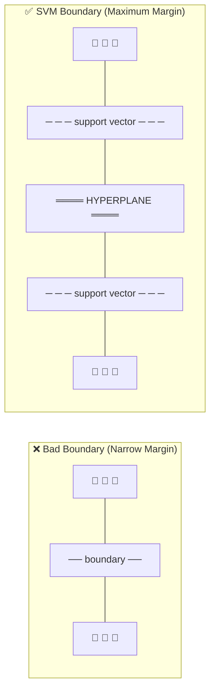
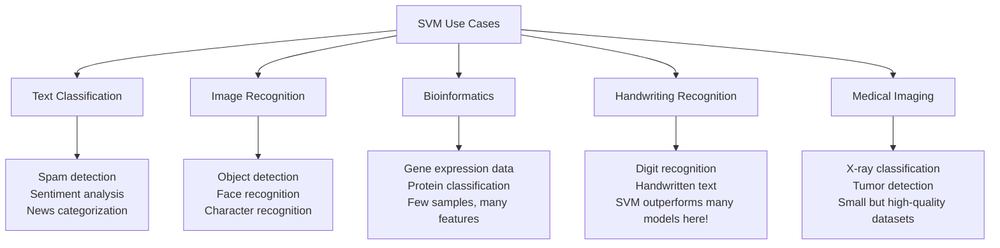
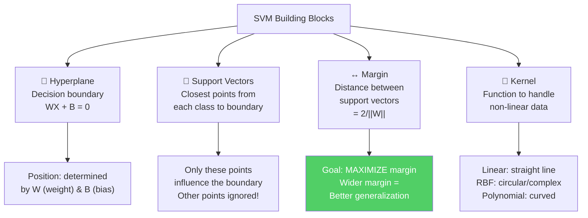
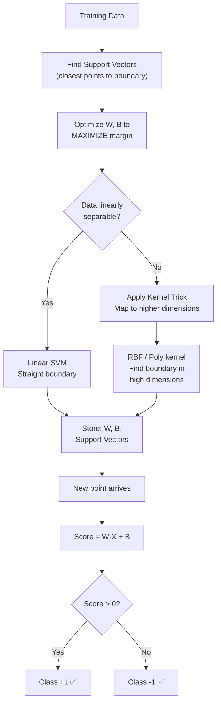
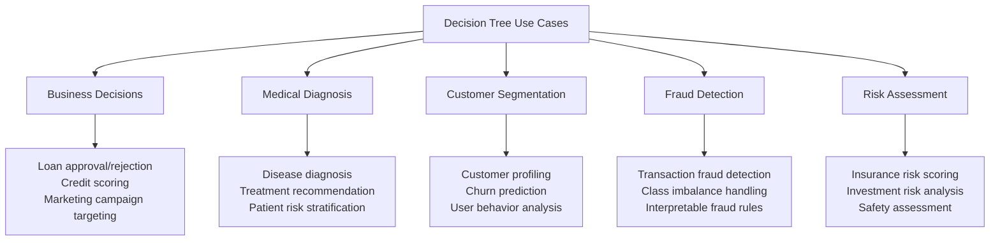
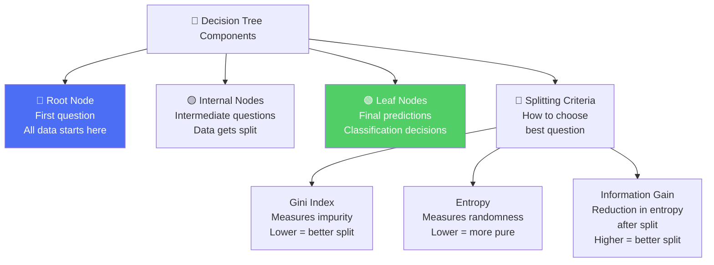

# AS29: Classifiers Overview - Classroom Session (Part 2)

> 📚 **This is Part 2** covering: Support Vector Machine (SVM), Decision Trees
> 📘 **Previous:** [Part 1](./AS29_ClassifiersOverview1.md) | **Next:** [Part 3](./AS29_ClassifiersOverview3.md)

---

## 🎓 Classroom Conversation (Continued)

**Teacher:** Okay students, Part 1 lo manaamu Classification Basics and KNN chala detail ga chusinamu. Ippudu mana second major classifier ki vasthunnam — **Support Vector Machine (SVM)**! Idi machine learning lo **most mathematical and sophisticated** algorithm!

---

### Topic 1: Support Vector Machine (SVM) — Deep Dive

#### 12-Point Structure for SVM

---

#### 🔹 Point 1: Definition

**Teacher:** Support Vector Machine (SVM) ante — **two classes madhya maximum separating boundary (hyperplane) kanukkovadaniki optimize chese algorithm**. Just any boundary kaadu — **best possible boundary** — which is as far away as possible from the nearest points of every class.

Simple ga cheppali ante: "SVM builds the widest possible highway between two cities, keeping maximum distance from both sides"

10-year-old ki explain cheyali ante: "Cricket ground lo two teams practice chesthunnaru — red team oka side, blue team oka side. SVM is the referee who draws the widest possible chalk line in the middle, keeping maximum distance from both teams' players!"

> 💡 **Jargon Alert - Support Vector Machine (SVM)**
> Simple Explanation: Two classes madhya widest possible boundary draw chese algorithm. "Support Vectors" are the closest points from each class to the boundary — they "support" (define) the boundary position.
> Example: Road lo partition — divider maximum distance lo place chesinatu, both sides ki accidents avoid avvadaniki.

> 💡 **Jargon Alert - Hyperplane**
> Simple Explanation: Classes ni separate chese decision boundary. 2D lo it's a LINE. 3D lo it's a PLANE. Higher dimensions lo it's a HYPERPLANE.
> Example: Cricket ground lo boundary line — divides two playing areas.

---

#### 🔹 Point 2: Simple Analogy

**Teacher:** Best analogy — **"Road Divider"** analogy:

Imagine oka road — left side lo cars (Class A), right side lo trucks (Class B). You want to build a divider.

- **Bad divider:** Cars ki chala daggaraga — accident risk high!
- **Good divider:** Cars and trucks rendu ki maximum distance lo — SAFEST!
- **SVM's divider:** Widest possible gap in the middle — **maximum margin!**

Now imagine some cars are parked wrong side — these are **misclassifications**. SVM lo:
- **Hard margin:** No car should be on wrong side — strict! (Only if perfectly separable)
- **Soft margin:** Few cars on wrong side allowed, but with penalty — practical!

The closest cars/trucks to the divider are **Support Vectors** — they define where the divider goes!

```
                Support Vector (red)
                      🔴
        🔴     🔴     |  ← Margin →  |     🔵     🔵
   Red Class           |  HYPERPLANE  |          Blue Class
        🔴     🔴     |              |     🔵
                      🔵
                Support Vector (blue)
```

---

#### 🔹 Point 3: Why SVM is Used

**Teacher:** SVM enduku use chestharu?

| Problem SVM Solves | How |
|--------------------|-----|
| Need maximum separation between classes | Maximizes margin — best generalization |
| High-dimensional data | Works well even with more features than samples |
| Non-linear data | Kernel trick transforms to higher dimensions |
| Outlier handling | Soft margin ignores/penalizes outliers |
| Binary classification | Originally designed for binary — very strong |

**Clever Student:** Sir, SVM ki Logistic Regression ki difference enti? Both boundary draw chesthay kadha?

**Teacher:** Excellent question! Key differences:

| Aspect | Logistic Regression | SVM |
|--------|-------------------|-----|
| Boundary optimization | Any separating line | **Maximum margin** line |
| Loss function | Log Loss (Cross Entropy) | **Hinge Loss** |
| Output | Probabilities (0 to 1) | Decision (which side) — no natural probabilities |
| Outlier handling | All points influence | Only **support vectors** matter |
| Non-linear | Cannot handle | **Kernel trick** handles non-linear |
| Interpretability | Moderate | Low |

**Beginner Student:** Sir, "maximum margin" ante exact ga enti?

**Teacher:** Beautiful question! Let me explain with diagram:



Good boundary — widest possible gap between the closest points of each class. Narrow margin = risky. Wide margin = safe, generalizes better to new data!

---

#### 🔹 Point 4: When to Use SVM

**Teacher:** SVM best use cheyali conditions:

| Condition | Why SVM Works |
|-----------|---------------|
| High-dimensional data | Mathematical optimization handles high dims well |
| More features than samples | Works even when features > samples |
| Need best accuracy | Maximum margin gives strong generalization |
| Non-linear data | Kernel trick elegantly handles non-linearity |
| Medium-sized dataset | Best for 1,000 - 100,000 samples |
| Binary classification | Originally designed for binary — strongest here |

**When NOT to use SVM:**
- Very large datasets (> 100,000 samples) — training too slow (O(n²) to O(n³))
- Need probability estimates — SVM doesn't give natural probabilities
- Need interpretability — SVM is black box
- Need fast training — SVM training is computationally expensive
- Limited tuning time — kernel and parameter selection is tricky

---

#### 🔹 Point 5: Where SVM is Used (Real-World)



**Practical Student:** Sir, industry lo SVM actually use hota hai? Neural networks zyada popular hain na?

**Teacher:** Very good observation! Neural networks definitely more popular now for large datasets. But SVM still shines in:
1. **Small datasets, high features** — Gene expression analysis (1000 samples, 20000 genes)
2. **Text classification** — Still competitive with simpler SVMs
3. **When interpretability not needed but accuracy is critical** — Medical diagnosis with limited data
4. **Handwriting recognition** — SVMs historically outperformed neural networks on MNIST

---

#### 🔹 Point 6: Is SVM the Only Way? (Alternatives Comparison)

| Algorithm | Boundary Type | Non-linear? | Memory | Interpretable? | Best Scenario |
|-----------|--------------|-------------|--------|---------------|---------------|
| **SVM** | Maximum margin hyperplane | Yes (kernels) | Low (support vectors only) | ❌ No | High-dim, accuracy-critical |
| **Logistic Regression** | Any separating line | ❌ No | Very Low | ✅ Moderate | Simple binary, probabilities |
| **KNN** | Implicit (from neighbors) | ✅ Yes | High (all data) | ❌ No | Small data, prototyping |
| **Decision Tree** | Axis-aligned rectangles | ✅ Yes | Low | ✅ High | Interpretable, mixed data |
| **Random Forest** | Ensemble of trees | ✅ Yes | Medium | ✅ Moderate | General purpose, robust |

**Debate Student:** Sir, SVM vs Neural Network — eppudu edi better?

**Teacher:** Really good debate topic!

| Aspect | SVM | Neural Network |
|--------|-----|----------------|
| Small data (< 10K) | ✅ Better | ❌ Needs more data |
| Large data (> 100K) | ❌ Too slow | ✅ Better |
| High features, few samples | ✅ Excellent | ❌ Overfits |
| Training time | Moderate | Very Long |
| Interpretability | Low | Very Low |
| Probability output | ❌ Not natural | ✅ Natural (softmax) |
| Non-linear patterns | ✅ Via kernels | ✅ Via hidden layers |

Rule of thumb: **Small data + high features → SVM. Large data + complex patterns → Neural Network.**

---

#### 🔹 Point 7: Mermaid Diagram — SVM Concepts



---

#### 🔹 Point 8: How to Use SVM (Key Concepts + Code)

**Teacher:** SVM key concepts samjham karte hain:

##### 🔑 Concept 1: Hard Margin vs Soft Margin

**Hard Margin:**
- **Zero misclassification** allowed
- Only works if data is **perfectly separable**
- Very sensitive to noise — one outlier can destroy boundary
- Not practical for real data!

**Soft Margin:**
- **Some misclassification** allowed with **penalty**
- Penalty controlled by parameter **C (regularization)**
- Practical for real-world noisy data!
- Trade-off between margin width and classification errors

> 💡 **Jargon Alert - Soft Margin**
> Simple Explanation: "Kuch galtiyan hone do, lekin penalty lagao!" — Some errors allowed but you pay a price.
> Example: Like exam evaluation — spelling mistakes allowed but some marks deducted per mistake.

> 💡 **Jargon Alert - C Parameter (Regularization)**
> Simple Explanation: C controls penalty for mistakes. Large C = strict teacher, no mistakes allowed. Small C = lenient teacher, some mistakes okay.
> Example: C = 1000 → narrow margin, very few errors. C = 0.01 → wide margin, more errors tolerated.

| C Value | Margin Width | Misclassification Tolerance | Risk |
|---------|-------------|---------------------------|------|
| Large C (100+) | Narrow | Almost zero | **Overfitting** |
| Medium C (1-10) | Balanced | Some allowed | **Usually best** |
| Small C (0.01) | Wide | Many allowed | **Underfitting** |

##### 🔑 Concept 2: Hinge Loss

> 💡 **Jargon Alert - Hinge Loss**
> Simple Explanation: SVM ka loss function — agar classification correct hai aur margin ke andar nahi hai, then loss = 0. Agar wrong side hai ya margin violate karta hai, then penalty milti hai!
> Example: Like parking fine — park in correct zone = no fine. Park slightly outside = small fine. Park completely wrong = big fine!

```
Hinge Loss:
  If correctly classified AND outside margin → Loss = 0 (no penalty!)
  If inside margin or misclassified → Loss > 0 (penalty!)
  
  L = max(0, 1 - y * (W·X + B))
  
  Where y = actual label (+1 or -1)
        W·X + B = prediction score
```

##### 🔑 Concept 3: Kernel Trick

**Teacher:** Idi SVM's **superpower!** 🦸

Problem: Data is NOT linearly separable in current dimensions — no straight line can separate classes.

Solution: **Transform data to higher dimensions where it BECOMES separable!**

> 💡 **Jargon Alert - Kernel Trick**
> Simple Explanation: Data ni higher dimensions lo transform chesi, linearly separable cheyyadam — without actually computing the higher-dimensional coordinates! Math magic!
> Example: Imagine mixing colored balls on a table (2D) — red and blue mixed, no straight line separates them. Now THROW them up in the air (3D) — suddenly a flat sheet of paper can separate red (flying high) from blue (flying low)!

**Kernel types:**

| Kernel | Type | Boundary Shape | When to Use |
|--------|------|---------------|-------------|
| `linear` | Linear | Straight line | Linearly separable data |
| `rbf` (default) | Non-linear | Circular, complex curves | **Most common** — works for most data |
| `poly` | Non-linear | Polynomial curves | When polynomial relationship expected |
| `sigmoid` | Non-linear | S-shaped | Similar to neural network behavior |

```python
# ============================================
# SVM with Different Kernels
# ============================================
from sklearn.svm import SVC
from sklearn.datasets import make_classification, make_moons
from sklearn.model_selection import train_test_split
from sklearn.preprocessing import StandardScaler
from sklearn.metrics import accuracy_score

# Non-linear data (two half-moons)
X, y = make_moons(n_samples=500, noise=0.2, random_state=42)

# IMPORTANT: Scale features before SVM!
scaler = StandardScaler()
X_scaled = scaler.fit_transform(X)

X_train, X_test, y_train, y_test = train_test_split(
    X_scaled, y, test_size=0.2, random_state=42
)

# Try different kernels
kernels = ['linear', 'rbf', 'poly']
for kernel in kernels:
    svm = SVC(kernel=kernel, C=1.0, random_state=42)
    svm.fit(X_train, y_train)
    
    train_acc = accuracy_score(y_train, svm.predict(X_train))
    test_acc = accuracy_score(y_test, svm.predict(X_test))
    n_sv = svm.n_support_  # Number of support vectors per class
    
    print(f"Kernel: {kernel:8s} | Train: {train_acc:.3f} | Test: {test_acc:.3f} | "
          f"Support Vectors: {n_sv}")
```

**Expected Output:**
```
Kernel: linear   | Train: 0.860 | Test: 0.850 | Support Vectors: [78 82]
Kernel: rbf      | Train: 0.990 | Test: 0.980 | Support Vectors: [25 28]
Kernel: poly     | Train: 0.975 | Test: 0.960 | Support Vectors: [35 32]
```

**Clever Student:** Sir, RBF kernel lo "gamma" parameter kya hai?

**Teacher:** Great question! `gamma` defines how far the influence of a single training example reaches.

| Gamma | Effect | Risk |
|-------|--------|------|
| Small gamma | Large influence radius → Smooth boundary | Underfitting |
| Large gamma | Small influence radius → Tight, complex boundary | Overfitting |

```python
# ============================================
# Effect of C and Gamma on SVM
# ============================================
from sklearn.svm import SVC
import numpy as np

X, y = make_moons(n_samples=300, noise=0.2, random_state=42)
X_train, X_test, y_train, y_test = train_test_split(X, y, test_size=0.2)

# Different C and gamma combinations
params = [
    {'C': 0.01, 'gamma': 'scale', 'desc': 'Small C (lenient)'},
    {'C': 1.0,  'gamma': 'scale', 'desc': 'Medium C (balanced)'},
    {'C': 100,  'gamma': 'scale', 'desc': 'Large C (strict)'},
    {'C': 1.0,  'gamma': 0.01,   'desc': 'Small gamma (smooth)'},
    {'C': 1.0,  'gamma': 10,     'desc': 'Large gamma (complex)'},
]

for p in params:
    svm = SVC(kernel='rbf', C=p['C'], gamma=p['gamma'])
    svm.fit(X_train, y_train)
    print(f"{p['desc']:30s} | Train: {svm.score(X_train, y_train):.3f} "
          f"| Test: {svm.score(X_test, y_test):.3f}")
```

---

#### 🔹 Point 9: How SVM Works Internally

**Teacher:** SVM internal working — recipe steps:

```
Step 1: OPTIMIZATION SETUP
   ├── Define objective: MAXIMIZE margin (= 2/||W||)
   ├── Subject to constraint: All points correctly classified
   │   (yi * (W·Xi + B) ≥ 1 for all training points)
   └── This is a constrained optimization problem!

Step 2: TRAINING (Quadratic Programming)
   ├── Solve optimization to find W and B
   ├── Only support vectors (closest points) matter for solution
   ├── Non-support-vector points can be removed without changing result!
   └── Training time: O(n²) to O(n³) — slow for large n

Step 3: KERNEL TRICK (if non-linear)
   ├── Instead of explicitly computing high-dim features
   ├── Use kernel function K(xi, xj) to compute dot products
   ├── RBF kernel: K(xi,xj) = exp(-γ ||xi-xj||²)
   └── Avoids "curse of dimensionality" of explicit transformation

Step 4: PREDICTION (Fast! Only need W, B, support vectors)
   ├── Compute score = W·X_new + B
   ├── If score > 0 → Class +1
   ├── If score < 0 → Class -1
   └── Prediction time: O(n_sv * d) where n_sv = support vectors, d = dimensions
```



**Curious Student:** Sir, SVM learns parameters? KNN toh lazy tha, SVM?

**Teacher:** Yes! SVM **actively learns** — it learns W (weights) and B (bias) during training. This is opposite of KNN:

| Aspect | KNN | SVM |
|--------|-----|-----|
| Training | No learning — stores data | Learns W, B through optimization |
| Prediction | Calculates distances (slow) | Evaluates W·X+B (fast) |
| Memory | Stores ALL training data | Stores only support vectors |
| Model size | = Full dataset | = Support vectors only (much smaller!) |

---

#### 🔹 Point 10: Visual Summary

```
🔑 SVM = Find Maximum Margin Boundary

📋 TRAINING:
   Input Data → [Optimization: Maximize Margin] → [Find W, B, Support Vectors] → Done!

🔮 PREDICTION:
   New Point → [Score = W·X + B] → Score > 0? → Class +1 or Class -1

⚙️ KEY HYPERPARAMETERS:
   C = Regularization (penalty for misclassification)
   ├── Large C: Strict → Narrow margin → Overfitting risk
   └── Small C: Lenient → Wide margin → Underfitting risk
   
   Kernel = How to handle non-linear data
   ├── 'linear': Straight line boundary
   ├── 'rbf': Complex curves (DEFAULT, most common)
   └── 'poly': Polynomial curves
   
   gamma = Influence radius (for RBF kernel)
   ├── Small gamma: Smooth, simple boundary
   └── Large gamma: Complex, tight boundary

⚠️ MANDATORY PREPROCESSING:
   Feature Scaling REQUIRED! (StandardScaler recommended)
```

---

#### 🔹 Point 11: Advantages & Disadvantages (WITH PROOF)

##### ✅ Advantages:

**Advantage 1: Excellent in High-Dimensional Spaces**
- **Claim:** SVM performs remarkably well with many features, even more features than samples
- **Proof:** In text classification, you might have 50,000+ word features but only 5,000 documents. SVM handles this because it finds the optimal separating hyperplane regardless of dimensionality.
- **Real-Life Analogy:** Like finding the thinnest wall that separates two rooms — works whether rooms are 2D, 3D, or 100D!
- **When it matters:** Bioinformatics (20,000 genes, 200 patients), text classification (huge vocabulary)

**Advantage 2: Memory Efficient**
- **Claim:** SVM only stores support vectors, not entire training dataset
- **Proof:** If training data has 100,000 points, SVM might only store 500 support vectors (0.5% of data!)
- **Real-Life Analogy:** Instead of remembering every student in school, you only remember the "borderline" students — those barely passing and barely failing. Others don't affect the pass/fail boundary!
- **When it matters:** Deployment on memory-constrained devices

```python
# Proof: SVM stores much less data than KNN
from sklearn.svm import SVC
import numpy as np

X = np.random.randn(10000, 20)  # 10,000 samples
y = np.random.randint(0, 2, 10000)

svm = SVC(kernel='rbf')
svm.fit(X, y)

print(f"Training samples: {len(X)}")
print(f"Support vectors: {len(svm.support_vectors_)}")
print(f"% stored: {len(svm.support_vectors_)/len(X)*100:.1f}%")
# Support vectors ≈ 30-50% (much less than KNN's 100%)
```

**Advantage 3: Versatile Through Kernels**
- **Claim:** Can handle linear AND non-linear boundaries with same algorithm
- **Proof:** Just change kernel parameter — `kernel='linear'` vs `kernel='rbf'` — same SVC class!
- **Real-Life Analogy:** Like a Swiss Army knife — same tool, different blade for different situations!
- **When it matters:** When you don't know if data is linear or non-linear

**Advantage 4: Robust to Outliers (Soft Margin)**
- **Claim:** With soft margin (C parameter), SVM can handle noisy data and outliers
- **Proof:** Unlike hard margin SVM, soft margin allows controlled misclassifications. Small C = more tolerance for outliers.
- **Real-Life Analogy:** Like a flexible exam grader — gives partial marks for partially correct answers instead of only perfect answers.
- **When it matters:** Real-world data always has noise and outliers!

##### ❌ Disadvantages:

**Disadvantage 1: Slow Training**
- **Claim:** SVM training is O(n²) to O(n³) — extremely slow for large datasets
- **Proof:** Training 100K samples takes minutes to hours. 1M samples can take days!
- **Real-Life Analogy:** Building the widest possible highway is much harder than just drawing any road!
- **When it matters:** Datasets > 100K samples — use Random Forest or Neural Networks instead

**Disadvantage 2: Difficult Parameter Tuning**
- **Claim:** C, gamma, kernel choice — multiple parameters and each impacts performance significantly
- **Proof:** Wrong C or gamma can change accuracy by 20%+ — must use grid search with cross-validation
- **When it matters:** Need expertise and computational budget for proper tuning

**Disadvantage 3: Low Interpretability**
- **Claim:** Impossible to explain "why" a prediction was made in simple terms
- **Proof:** "Your loan was denied because support vector #347 in 50-dimensional space is 0.85 units away" — meaningless to a customer!
- **When it matters:** Regulated industries (banking, healthcare) where explanations are legally required

**Disadvantage 4: No Natural Probability Output**
- **Claim:** SVM outputs decision (Class A or B) but NOT probability
- **Proof:** You can enable `probability=True` in sklearn, but it uses Platt scaling internally — calibrated probabilities, not natural ones
- **When it matters:** Risk assessment, ranking tasks where "how confident?" matters

---

#### 🔹 Point 12: Jargon Glossary for SVM

| Term | Simple Explanation |
|------|-------------------|
| **SVM** | Algorithm that finds maximum margin boundary between classes |
| **Hyperplane** | The decision boundary — line in 2D, plane in 3D, hyperplane in higher D |
| **Support Vectors** | Closest data points from each class to the hyperplane — they define the boundary |
| **Margin** | Distance between the hyperplane and the support vectors = 2/‖W‖ |
| **Hard Margin** | Zero misclassification allowed — only for perfectly separable data |
| **Soft Margin** | Some misclassification allowed with penalty — practical for real data |
| **C Parameter** | Regularization — controls penalty for misclassification. High C = strict, Low C = lenient |
| **Kernel** | Function to handle non-linear data by implicitly transforming to higher dimensions |
| **Kernel Trick** | Computing in high dimensions without actually transforming — mathematical shortcut |
| **RBF Kernel** | Most popular non-linear kernel — creates circular/complex boundaries |
| **Gamma** | Controls influence radius of each training point (RBF kernel) |
| **Hinge Loss** | Loss function for SVM — zero for correct classifications outside margin |

---

### Topic 2: Decision Trees — Deep Dive

**Teacher:** Ippudu mana third major classifier — **Decision Trees!** 🌳 Idi machine learning lo **most interpretable** algorithm! You can literally see WHY the model made a decision!

#### 12-Point Structure for Decision Trees

---

#### 🔹 Point 1: Definition

**Teacher:** Decision Tree ante — **data ni yes/no questions series tho split chesi, final classification leaves lo chese tree-structured model.** Root node lo start chesi, each node lo oka question ask chesi, answer based chesi left or right branches follow chesi, finally leaf node lo classification decision ivvadam.

Simple ga cheppali ante: "Decision Tree is like 20 Questions game — you keep asking yes/no questions until you figure out the answer!"

10-year-old ki explain cheyali ante: "Doctor ki velthav — Doctor aduguthadu: 'Fever undi a?' → Yes → 'Cough undi a?' → Yes → 'Chest pain undi a?' → No → 'You have a cold, take rest!' — Idi decision tree!"

> 💡 **Jargon Alert - Decision Tree**
> Simple Explanation: Yes/No questions tho data ni split chesi, final classification leaf node lo chese tree model. Like a flowchart — start from top, follow arrows based on answers, reach bottom for final answer.
> Example: Loan approval — Is credit score > 700? → Yes → Is income > 50K? → Yes → Loan APPROVED ✅

---

#### 🔹 Point 2: Simple Analogy

**Teacher:** Best analogy — **"Doctor Diagnosis"** analogy:

```
Patient comes to Doctor

Doctor: "Do you have fever?" 
  → Yes:
    Doctor: "Do you have cough?"
      → Yes: "You have FLU" 🤧
      → No:
        Doctor: "Body pains?"
          → Yes: "You have DENGUE" 🦟
          → No: "You have MALARIA" 💊
  → No:
    Doctor: "Do you have headache?"
      → Yes: "You have MIGRAINE" 🤕
      → No: "You are HEALTHY!" 😊
```

This IS a decision tree! Doctor asks questions series, based on answers takes branches, reaches diagnosis at the end!

Key insight: **Questions are chosen to best separate different diseases!** "Do you have fever?" separates much better than "What's your favorite color?" — because fever is INFORMATIVE for diagnosis!

---

#### 🔹 Point 3: Why Decision Trees are Used

**Teacher:** Decision Trees enduku use chestharu:

| Problem DT Solves | How |
|-------------------|-----|
| Need interpretable predictions | Every path from root → leaf is explainable |
| Mixed data types | Handles numerical + categorical naturally |
| No preprocessing needed | No feature scaling, no encoding required |
| Quick baseline model | Fast training, immediate results |
| Multi-class natural | Just more leaf nodes for more classes |
| Non-linear relationships | Automatically captures complex patterns |

**Beginner Student:** Sir, why Decision Trees are called "most interpretable"?

**Teacher:** Because you can literally TRACE the decision:

"Customer X was predicted to CHURN because:
1. Contract = Month-to-month (went right branch)
2. Monthly charges > $70 (went left branch)  
3. Tenure < 12 months (went left branch)
→ Reached leaf: CHURN (85% confidence)"

Try explaining SVM's decision: "Customer X was predicted to churn because support vector #2847 in 30-dimensional space with RBF kernel gamma=0.1 produced a decision score of -0.342" — meaningless! 😵

⚡ That's why regulated industries (banks, hospitals) LOVE decision trees — they NEED to explain WHY!

---

#### 🔹 Point 4: When to Use Decision Trees

| Condition | Why DT Works |
|-----------|--------------|
| Interpretability required | You can explain every decision |
| Mixed data types | Handles numeric + categorical |
| No preprocessing time | No scaling, no encoding |
| Quick baseline needed | Fast training |
| Business decisions | "Why was loan denied?" answerable |
| Medical diagnosis | Doctor can verify logic |

**When NOT to use Decision Trees (alone):**
- Need highest accuracy — single trees not best, use ensemble (Random Forest) instead
- Data shifts frequently — trees are unstable, small changes can create completely different tree
- Diagonal patterns — trees create axis-aligned splits, inefficient for diagonal boundaries
- High-stakes without pruning — overfitting risk

---

#### 🔹 Point 5: Where Decision Trees are Used (Real-World)



**Practical Student:** Sir, Decision Trees ko ensemble methods mein kaise use karte hain?

**Teacher:** Bahut important point! Single decision tree can be weak and overfit. But **ensemble methods** combine many trees for superior performance:

- **Random Forest** — 100s of trees, each trained on random subset of data + features. Final prediction = majority vote of all trees.
- **Gradient Boosting (XGBoost, LightGBM)** — Trees trained **sequentially**, each correcting errors of previous. Industry standard for tabular data!
- **Bagging** — Trees trained on random bootstrap samples. Reduces variance (overfitting).

> 💡 **Jargon Alert - Ensemble Methods**
> Simple Explanation: Multiple weak models combine to make a strong model. Like asking 100 average doctors and going with majority opinion — better than asking 1 expert doctor!
> Example: Random Forest = 100 decision trees voting together → much more accurate than single tree.

---

#### 🔹 Point 6: Alternatives Table

| Algorithm | Interpretable? | Non-linear? | Scaling Needed? | Speed | Best For |
|-----------|---------------|-------------|-----------------|-------|----------|
| **Decision Tree** | ✅ Very High | ✅ Yes | ❌ No | Fast train + predict | Interpretable decisions |
| **Random Forest** | ✅ Moderate | ✅ Yes | ❌ No | Moderate | General purpose, robust |
| **KNN** | ❌ Low | ✅ Yes | ✅ Required | No train, slow predict | Small data, prototyping |
| **SVM** | ❌ Low | ✅ Via kernel | ✅ Required | Slow train, fast predict | High-dimensional |
| **Logistic Regression** | ✅ Moderate | ❌ No | ✅ Recommended | Fast | Binary, probabilities |

---

#### 🔹 Point 7: Mermaid Diagram — Decision Tree Concepts



---

#### 🔹 Point 8: How to Use Decision Trees (Concepts + Code)

**Teacher:** Decision Tree key concepts:

##### 🔑 Splitting Criteria — How the Tree Decides Questions

**Teacher:** Tree eppudu split cheyali, which feature use cheyali, which threshold use cheyali — ivi ela decide avuthundi? Answer: **Information Gain, Gini Index, Entropy!**

> 💡 **Jargon Alert - Gini Index (Gini Impurity)**
> Simple Explanation: Oka group lo "impurity" measure — group lo different classes mix unte Gini HIGH, only one class unte Gini LOW (pure!).
> Formula: Gini = 1 - Σ(pᵢ²) where pᵢ = proportion of class i
> Example: Box lo 5 red, 5 blue balls → Gini = 1 - (0.5² + 0.5²) = 0.5 (impure!)  
> Box lo 10 red, 0 blue balls → Gini = 1 - (1.0² + 0.0²) = 0.0 (PURE! ✅)

> 💡 **Jargon Alert - Entropy**
> Simple Explanation: "Randomness" or "uncertainty" ka measure. Pure group = entropy 0. Mixed group = entropy HIGH.
> Formula: Entropy = -Σ(pᵢ * log₂(pᵢ))
> Example: All same class → Entropy = 0 (no uncertainty)  
> 50-50 split → Entropy = 1.0 (maximum uncertainty)

> 💡 **Jargon Alert - Information Gain**
> Simple Explanation: Split karne se kitna information mila? HIGH information gain = GOOD split!
> Formula: IG = Entropy(parent) - Weighted Average Entropy(children)
> Example: Split that perfectly separates classes → IG = maximum!

**Teacher:** Numerical example:

```
Before split: [5 cats, 5 dogs] → Gini = 1 - (0.5² + 0.5²) = 0.5

Split on "Has tail > 5cm":
  Left:  [4 cats, 1 dog]  → Gini = 1 - (0.8² + 0.2²) = 0.32
  Right: [1 cat, 4 dogs]  → Gini = 1 - (0.2² + 0.8²) = 0.32

Weighted Gini after split = (5/10)*0.32 + (5/10)*0.32 = 0.32
Gini Decrease = 0.5 - 0.32 = 0.18 → GOOD split! ✅

Alternative split on "Color = white":
  Left:  [3 cats, 3 dogs]  → Gini = 1 - (0.5² + 0.5²) = 0.5  
  Right: [2 cats, 2 dogs]  → Gini = 1 - (0.5² + 0.5²) = 0.5

Weighted Gini = 0.5 → Gini Decrease = 0.0 → BAD split! ❌
```

**Tree chooses "Has tail > 5cm" because it reduces impurity more!**

##### 🔑 Greedy Algorithm

> 💡 **Jargon Alert - Greedy Algorithm**
> Simple Explanation: "Right now ka best decision le lo, future ke baare mein mat socho!" At each node, tree picks the BEST split at THAT MOMENT without considering how it affects future nodes.
> Example: Like choosing road at every junction — take the road that looks best NOW, even if overall path may not be optimal. Fast but not always perfect!

**Critique Student:** Sir, greedy algorithm optimal nahi hai toh kaise trust kare?

**Teacher:** Very valid concern! You're right — greedy is NOT globally optimal. But:
1. **Finding globally optimal tree is NP-hard** — impossibly slow for any reasonably sized dataset
2. **In practice**, greedy approach gives **good enough** results
3. **Ensemble methods** (Random Forest) compensate by combining many greedy trees
4. **Pruning** helps remove bad greedy decisions

##### 🔑 Code Example

```python
# ============================================
# Decision Tree Classifier — Complete Example
# ============================================
from sklearn.tree import DecisionTreeClassifier, plot_tree
from sklearn.datasets import load_iris
from sklearn.model_selection import train_test_split
from sklearn.metrics import accuracy_score, classification_report
import matplotlib.pyplot as plt

# Load Iris dataset (3 classes of flowers)
iris = load_iris()
X, y = iris.data, iris.target

# Split data
X_train, X_test, y_train, y_test = train_test_split(
    X, y, test_size=0.2, random_state=42
)

# ⚠️ NO feature scaling needed for Decision Trees!
# Decision Trees use threshold comparisons, not distances

# Train Decision Tree
dt = DecisionTreeClassifier(
    max_depth=3,           # Limit depth to prevent overfitting
    min_samples_split=10,  # Minimum 10 samples to split a node
    min_samples_leaf=5,    # Minimum 5 samples in each leaf
    criterion='gini',      # Use Gini impurity (default)
    random_state=42
)
dt.fit(X_train, y_train)

# Evaluate
y_pred = dt.predict(X_test)
print(f"Training Accuracy: {dt.score(X_train, y_train):.3f}")
print(f"Test Accuracy: {accuracy_score(y_test, y_pred):.3f}")
print(f"Tree Depth: {dt.get_depth()}")
print(f"Number of Leaves: {dt.get_n_leaves()}")

print("\nClassification Report:")
print(classification_report(y_test, y_pred, 
                            target_names=iris.target_names))

# Visualize the tree — THIS is why DT is interpretable!
plt.figure(figsize=(20, 10))
plot_tree(dt, 
          feature_names=iris.feature_names,
          class_names=iris.target_names,
          filled=True, 
          rounded=True,
          fontsize=10)
plt.title("Decision Tree for Iris Classification", fontsize=16)
plt.tight_layout()
plt.show()
```

---

#### 🔹 Point 9: How Decision Trees Work Internally

```
Step 1: START AT ROOT (all training data)
   ├── For each feature and each possible threshold:
   │   ├── Calculate Gini impurity (or entropy) of resulting split
   │   └── Pick the split with HIGHEST information gain
   ├── Split data into left and right children
   └── This is the GREEDY choice at this node

Step 2: RECURSE on each child node
   ├── Apply same splitting logic
   ├── Keep splitting until STOPPING CRITERIA met:
   │   ├── max_depth reached
   │   ├── min_samples_split not met
   │   ├── min_samples_leaf not met
   │   ├── Node is PURE (all same class)
   │   └── No further improvement possible
   └── When stopped → This node becomes a LEAF

Step 3: LEAF NODES = PREDICTIONS
   ├── Each leaf stores the majority class of its training data
   └── Also stores class probabilities (e.g., 85% Class A, 15% Class B)

Step 4: PREDICTION (traverse tree)
   ├── Start at root
   ├── At each node, evaluate the condition (e.g., "age > 50?")
   ├── Go left (yes) or right (no)
   ├── Continue until reaching a leaf
   └── Return leaf's majority class as prediction
```

---

#### 🔹 Point 10: Pruning — Preventing Overfitting

**Teacher:** Idi CRITICAL concept! Decision Trees prone to overfitting — **pruning** prevents this!

> 💡 **Jargon Alert - Pruning**
> Simple Explanation: Tree lo unnecessary branches cut cheyyadam — overfitting reduce cheyyadaniki. Like a gardener pruning a real tree — removing unnecessary branches makes the tree healthier!
> Example: max_depth=3 means tree can only go 3 levels deep — no more questions after 3!

**Two types of pruning:**

| Type | When | How | Example |
|------|------|-----|---------|
| **Pre-pruning** | DURING training | Set limits before tree is built | `max_depth=5, min_samples_split=20` |
| **Post-pruning** | AFTER training | Build full tree, then trim branches | Cost-complexity pruning (ccp_alpha) |

```python
# ============================================
# Overfitting Problem and Pruning Solution
# ============================================
from sklearn.tree import DecisionTreeClassifier
from sklearn.datasets import make_classification
from sklearn.model_selection import train_test_split

X, y = make_classification(n_samples=1000, n_features=20, random_state=42)
X_train, X_test, y_train, y_test = train_test_split(X, y, test_size=0.2)

# ❌ Unpruned tree — OVERFITTING!
deep_tree = DecisionTreeClassifier()  # No limits!
deep_tree.fit(X_train, y_train)
print(f"Unpruned Tree:")
print(f"  Depth: {deep_tree.get_depth()}")
print(f"  Train: {deep_tree.score(X_train, y_train):.3f}")
print(f"  Test:  {deep_tree.score(X_test, y_test):.3f}")

# ✅ Pruned tree — GENERALIZED!
pruned_tree = DecisionTreeClassifier(
    max_depth=5,
    min_samples_split=20,
    min_samples_leaf=10
)
pruned_tree.fit(X_train, y_train)
print(f"\nPruned Tree:")
print(f"  Depth: {pruned_tree.get_depth()}")
print(f"  Train: {pruned_tree.score(X_train, y_train):.3f}")
print(f"  Test:  {pruned_tree.score(X_test, y_test):.3f}")
```

**Expected Output:**
```
Unpruned Tree:
  Depth: 20+
  Train: 1.000 (memorized!)
  Test:  0.750 (bad generalization!)

Pruned Tree:
  Depth: 5
  Train: 0.880
  Test:  0.860 (much better generalization!)
```

**Clever Student:** Sir, pruning parameters kya choose karein?

**Teacher:** Cross-validation use cheyandi!

```python
# Finding optimal max_depth using cross-validation
from sklearn.model_selection import cross_val_score
import numpy as np

depths = range(1, 21)
cv_scores = []

for d in depths:
    dt = DecisionTreeClassifier(max_depth=d, random_state=42)
    scores = cross_val_score(dt, X, y, cv=5, scoring='accuracy')
    cv_scores.append(scores.mean())

best_depth = depths[np.argmax(cv_scores)]
print(f"Optimal max_depth: {best_depth}")
print(f"Best CV accuracy: {max(cv_scores):.3f}")
```

---

#### 🔹 Point 11: Advantages & Disadvantages (WITH PROOF)

##### ✅ Advantages:

**Advantage 1: Highly Interpretable**
- **Claim:** You can explain EXACTLY why each prediction was made
- **Proof:** Tree path from root to leaf IS the explanation: "Loan denied because credit_score < 650 AND income < 30K AND debt_ratio > 0.5"
- **Real-Life Analogy:** Like a doctor explaining step-by-step why they diagnosed flu: "Because you have fever AND cough AND no chest pain"
- **When it matters:** Banking (loan decisions), Healthcare (diagnosis), Legal (decisions must be explainable)

**Advantage 2: No Feature Scaling Required**
- **Claim:** Decision Trees work directly with raw features — no normalization needed
- **Proof:** Trees split on thresholds: "Is income > 50000?" — this comparison is the same whether income is in units of 1 or 1000. Only ORDER matters, not magnitude.
- **Real-Life Analogy:** Like sorting students by height — you just compare "who is taller?" — doesn't matter if you measure in cm or inches!
- **When it matters:** When you want quick results without preprocessing pipeline

**Advantage 3: Handles Mixed Data Types**
- **Claim:** Can split on categorical AND numerical features naturally
- **Proof:** Categorical: "Is country == 'India'?" Numerical: "Is age > 30?" — both work!
- **When it matters:** Real datasets often have mixed types. Other algorithms (KNN, SVM) need encoding for categorical features.

**Advantage 4: Very Fast Predictions**
- **Claim:** Prediction = just following one path from root to leaf — O(log n) time
- **Proof:** Tree with depth 10 = at most 10 comparisons per prediction, regardless of training set size!
- **When it matters:** Real-time applications, mobile deployment

##### ❌ Disadvantages:

**Disadvantage 1: Prone to Overfitting**
- **Claim:** Unrestricted trees memorize training data including noise
- **Proof:** Unpruned tree → Training accuracy 100%, Test accuracy 70% — classic overfitting!
- **When it matters:** Always! Must use pruning or ensemble methods

**Disadvantage 2: Unstable**
- **Claim:** Small changes in data can create completely different tree
- **Proof:** Remove or change a few training samples → tree structure can change drastically
- **Real-Life Analogy:** Like a house of cards — move one card and the whole structure changes!
- **When it matters:** When data shifts over time or you need consistent predictions

**Disadvantage 3: Cannot Learn Diagonal Boundaries**
- **Claim:** Trees always create axis-aligned splits — inefficient for diagonal patterns
- **Proof:** If true boundary is y = x (diagonal line), tree needs MANY rectangular splits to approximate it
- **When it matters:** When features have interactions that create diagonal patterns

**Disadvantage 4: Biased Toward Features with Many Values**
- **Claim:** Features with more unique values get preferred for splits
- **Proof:** Feature with 1000 unique values has more possible split points than feature with 2 values — more chances to find a "good" split by luck
- **When it matters:** When you have features with very different cardinalities

---

#### 🔹 Point 12: Jargon Glossary for Decision Trees

| Term | Simple Explanation |
|------|-------------------|
| **Decision Tree** | Tree-shaped model that makes yes/no decisions to classify data |
| **Root Node** | Top of the tree — first question asked, all data starts here |
| **Internal Node** | Middle nodes — intermediate questions that split data |
| **Leaf Node** | Bottom of the tree — final prediction made here |
| **Split** | Dividing data into sub-groups based on a feature threshold |
| **Gini Index** | Impurity measure — 0 = pure (one class), 0.5 = most impure (50-50) |
| **Entropy** | Uncertainty measure — 0 = certain (one class), 1 = most uncertain (50-50) |
| **Information Gain** | How much entropy decreases after a split — higher = better split |
| **Pruning** | Removing unnecessary branches to prevent overfitting |
| **Pre-pruning** | Setting limits BEFORE tree is built (max_depth, min_samples) |
| **Post-pruning** | Trimming branches AFTER full tree is built |
| **Greedy Algorithm** | Picks best split at each node without considering future — fast but not globally optimal |
| **Overfitting** | Tree memorizes training data including noise — poor generalization |

---

## 📝 Teacher Summary (Part 2)

**Teacher:** Okay students, Part 2 summary:

### Key Takeaways
1. **SVM** finds the **maximum margin boundary** between classes — widest possible highway!
2. **Support Vectors** are the closest points from each class — they DEFINE the boundary
3. **C parameter** controls trade-off: Large C = strict (narrow margin), Small C = lenient (wide margin)
4. **Kernel Trick** transforms non-linear data to higher dimensions where it's separable — RBF most common
5. **Hinge Loss** = SVM's loss function — zero for correct classifications outside margin
6. **Decision Trees** use yes/no questions to split data — most interpretable algorithm!
7. **Gini Index / Entropy / Information Gain** decide which question to ask at each node
8. **Pruning** prevents overfitting — pre-pruning (set limits) or post-pruning (trim after)
9. **Decision Trees DON'T need feature scaling** — threshold comparisons, not distances
10. **Ensemble methods** (Random Forest, XGBoost) combine many trees for superior performance

### Common Mistakes
- **Mistake 1:** Using SVM without feature scaling → Poor performance, optimization struggles
- **Mistake 2:** Using SVM on very large dataset → Training takes forever, use Random Forest instead
- **Mistake 3:** Not tuning C and kernel in SVM → Suboptimal performance, must grid search
- **Mistake 4:** Unpruned Decision Tree → Overfitting, memorizes training data
- **Mistake 5:** Expecting best accuracy from single Decision Tree → Use ensemble methods!
- **Mistake 6:** Using Decision Trees for diagonal boundary patterns → Very inefficient axis-aligned splits

---

> 📘 **Continue to [Part 3](./AS29_ClassifiersOverview3.md) for Comparison, Practical Tips, and When to Use Which Classifier!**
