# AS29: Classifiers Overview - Classroom Session (Part 3)

> 📚 **This is Part 3** covering: Classifier Comparison, Feature Scaling Rules, Hyperparameter Tuning, Evaluation Metrics, Ensemble Methods, Common Pitfalls, Interview Preparation
> 📘 **Previous:** [Part 1](./AS29_ClassifiersOverview1.md) | [Part 2](./AS29_ClassifiersOverview2.md)

---

## 🎓 Classroom Conversation (Continued)

**Teacher:** Okay students! Part 1 lo KNN, Part 2 lo SVM and Decision Trees — sab detail mein padh liye! 💪 Ab Part 3 mein — comparison, practical tips, aur interview preparation. Yeh section **exam ke liye sabse important** hai!

---

### Topic 1: Head-to-Head Comparison — KNN vs SVM vs Decision Tree

**Teacher:** Ab teen classifiers ko side-by-side compare karein — yahi exam mein sabse zyada puchte hain!

#### 📊 Master Comparison Table

| Feature | KNN | SVM | Decision Tree |
|---------|-----|-----|---------------|
| **Type** | Instance-based, Lazy | Boundary-based, Eager | Rule-based, Eager |
| **Training** | ❌ None (stores data) | ✅ Learns W, B (slow!) | ✅ Builds tree (fast!) |
| **Training Time** | O(1) — instant! | O(n²) to O(n³) — slow | O(n × d × log n) — moderate |
| **Prediction Time** | O(n × d) — SLOW | O(n_sv × d) — fast | O(depth) — VERY fast |
| **Memory** | High (stores ALL data) | Low (support vectors only) | Low (tree structure) |
| **Feature Scaling** | ✅ MANDATORY | ✅ RECOMMENDED | ❌ NOT needed |
| **Handles Non-linear** | ✅ Naturally | ✅ Via kernel trick | ✅ Naturally |
| **Handles Multi-class** | ✅ Naturally | ⚠️ Needs OvO/OvR | ✅ Naturally |
| **Interpretability** | ❌ Low | ❌ Very Low | ✅ Very High |
| **Overfitting Risk** | Medium (small K) | Medium (large C) | HIGH (deep tree) |
| **Large Dataset** | ❌ Very slow | ❌ Slow training | ✅ Handles well |
| **High Dimensions** | ❌ Curse of dim | ✅ Excellent | ⚠️ Okay |
| **Outlier Sensitivity** | ✅ High | ⚠️ Moderate (soft margin) | ⚠️ Moderate |
| **Probability Output** | ❌ No | ❌ Not natural | ✅ Yes (leaf proportions) |
| **Parametric?** | Non-parametric | Parametric | Non-parametric |
| **Main Hyperparameter** | K (neighbors) | C, kernel, gamma | max_depth, min_samples |

**Beginner Student:** Sir, itne saare aspects hain — ek simple rule batao na kab kaunsa use karna hai?

**Teacher:** Great question! Here's the **"When to Use Which"** decision flowchart:

```mermaid
flowchart TD
    A["New Classification Problem 🤔"] --> B{"Need to explain<br>WHY prediction<br>was made?"}
    B -->|"Yes — Interpretability<br>required"| C["🌳 Decision Tree<br>(or Random Forest)"]
    B -->|"No — Accuracy<br>more important"| D{"Dataset size?"}
    D -->|"Small<br>(< 10K samples)"| E{"High dimensions<br>(many features)?"}
    D -->|"Medium<br>(10K-100K)"| F["🎯 SVM (RBF kernel)<br>Best accuracy for medium data"]
    D -->|"Large<br>(> 100K)"| G["🌳 Decision Tree<br>Random Forest / XGBoost"]
    E -->|"Yes — features > samples"| H["🎯 SVM<br>Excellent in high dims"]
    E -->|"No — few features"| I["📏 KNN<br>Quick baseline + prototyping"]
    
    C --> J["⚠️ Prune to prevent<br>overfitting!"]
    F --> K["⚠️ Scale features +<br>Tune C, gamma!"]
    H --> K
    I --> L["⚠️ Scale features +<br>Tune K value!"]
    G --> M["⚠️ Use ensemble for<br>better accuracy!"]
    
    style C fill:#51cf66,color:#fff
    style F fill:#339af0,color:#fff
    style H fill:#339af0,color:#fff
    style I fill:#ff6b6b,color:#fff
    style G fill:#51cf66,color:#fff
```



**Debate Student:** Sir, but real life mein log toh directly XGBoost ya Neural Network use karte hain — yeh basic classifiers kab use karte hain?

**Teacher:** Very honest and important point! Real life mein:

1. **Basic classifiers = BASELINE** → Pehle simple model try karo, then improve karo
2. **Decision Tree ki value** = Interpretability. Banking, healthcare mein LEGALLY required!
3. **SVM still wins** for small + high-dimensional data (bioinformatics, text)
4. **KNN = Quick prototype** when you need results in 5 minutes

But yes, production mein most commonly:
- **Tabular data** → XGBoost, LightGBM (Decision Tree ensembles!)
- **Images, Text, Audio** → Neural Networks
- **Small data + high features** → SVM

So basic classifiers ARE the foundation of advanced methods! Random Forest = 100 Decision Trees. XGBoost = boosted Decision Trees. Understanding basic classifiers = understanding advanced ones!

---

### Topic 2: Feature Scaling — When and Why?

**Teacher:** Feature scaling rules — **exam mein guaranteed question!** 💯

| Algorithm | Feature Scaling Needed? | Why? | Which Scaler? |
|-----------|------------------------|------|---------------|
| **KNN** | ✅ MANDATORY | Distance calculations — large features dominate | StandardScaler recommended |
| **SVM** | ✅ STRONGLY RECOMMENDED | Optimization convergence + distance-based | StandardScaler recommended |
| **Decision Tree** | ❌ NOT needed | Threshold comparisons — only ORDER matters | N/A |
| **Random Forest** | ❌ NOT needed | Collection of Decision Trees | N/A |
| **Logistic Regression** | ✅ RECOMMENDED | Gradient descent convergence | StandardScaler |
| **Neural Networks** | ✅ REQUIRED | Gradient descent + activation functions | MinMaxScaler / StandardScaler |
| **XGBoost** | ❌ NOT needed | Tree-based | N/A |

> 💡 **Jargon Alert - StandardScaler**
> Simple Explanation: Values ko mean = 0, std = 1 mein convert karna. "Sabko same scale pe lao!"
> Formula: z = (x - mean) / std
> Example: Age [20, 30, 50] → Scaled [-1.1, -0.2, 1.3]

**Clever Student:** Sir, StandardScaler vs MinMaxScaler — eppudu edi use cheyali?

**Teacher:** Important distinction!

| Scaler | Formula | Range | Best For |
|--------|---------|-------|----------|
| **StandardScaler** | z = (x-μ)/σ | Unbounded (roughly -3 to +3) | When outliers present |
| **MinMaxScaler** | z = (x-min)/(max-min) | [0, 1] | When no outliers, neural networks |

**Golden Rule: StandardScaler for KNN and SVM. MinMaxScaler for Neural Networks.**

```python
# ============================================
# Feature Scaling Impact on Different Algorithms
# ============================================
from sklearn.preprocessing import StandardScaler
from sklearn.neighbors import KNeighborsClassifier
from sklearn.svm import SVC
from sklearn.tree import DecisionTreeClassifier
from sklearn.datasets import make_classification
from sklearn.model_selection import train_test_split
from sklearn.metrics import accuracy_score

# Create data with features on VERY different scales
import numpy as np
np.random.seed(42)
X = np.random.randn(500, 2)
X[:, 0] *= 1000     # Feature 1: scale 0-1000
X[:, 1] *= 1        # Feature 2: scale 0-1
y = (X[:, 0] / 1000 + X[:, 1] > 0).astype(int)

X_train, X_test, y_train, y_test = train_test_split(X, y, test_size=0.2)

# Scale features
scaler = StandardScaler()
X_train_scaled = scaler.fit_transform(X_train)
X_test_scaled = scaler.transform(X_test)

print("="*60)
print(f"{'Algorithm':<20} {'Without Scaling':>15} {'With Scaling':>15}")
print("="*60)

# KNN
for method, X_tr, X_te in [('Without', X_train, X_test), ('With', X_train_scaled, X_test_scaled)]:
    knn = KNeighborsClassifier(n_neighbors=5)
    knn.fit(X_tr, y_train)
    acc = knn.score(X_te, y_test)
    if method == 'Without':
        knn_wo = acc
    else:
        knn_w = acc
print(f"{'KNN':<20} {knn_wo:>15.3f} {knn_w:>15.3f}")

# SVM
for method, X_tr, X_te in [('Without', X_train, X_test), ('With', X_train_scaled, X_test_scaled)]:
    svm = SVC(kernel='rbf')
    svm.fit(X_tr, y_train)
    acc = svm.score(X_te, y_test)
    if method == 'Without':
        svm_wo = acc
    else:
        svm_w = acc
print(f"{'SVM':<20} {svm_wo:>15.3f} {svm_w:>15.3f}")

# Decision Tree — NO difference expected!
for method, X_tr, X_te in [('Without', X_train, X_test), ('With', X_train_scaled, X_test_scaled)]:
    dt = DecisionTreeClassifier(max_depth=5, random_state=42)
    dt.fit(X_tr, y_train)
    acc = dt.score(X_te, y_test)
    if method == 'Without':
        dt_wo = acc
    else:
        dt_w = acc
print(f"{'Decision Tree':<20} {dt_wo:>15.3f} {dt_w:>15.3f}")
print("="*60)
print("\n⚡ Notice: KNN and SVM improve with scaling!")
print("⚡ Decision Tree: NO change — doesn't need scaling!")
```

---

### Topic 3: Hyperparameter Tuning — Cross-Validation

**Teacher:** Each classifier ke key hyperparameters aur kaise tune karein:

| Algorithm | Key Hyperparameters | Tuning Method |
|-----------|-------------------|---------------|
| **KNN** | K (n_neighbors) | Cross-validation + Elbow Plot |
| **SVM** | C, kernel, gamma | GridSearchCV (try all combinations) |
| **Decision Tree** | max_depth, min_samples_split, min_samples_leaf | GridSearchCV or RandomizedSearchCV |

> 💡 **Jargon Alert - Cross-Validation**
> Simple Explanation: Data ko K parts (folds) mein divide karo, ek part test ke liye, baaki training ke liye — har part ko ek baar test banao. Average result = final performance!
> Example: 5-fold CV = Data ko 5 parts mein baanto, 5 baar train+test, average accuracy report karo.

> 💡 **Jargon Alert - GridSearchCV**
> Simple Explanation: Har possible parameter combination try karo, cross-validation se best combination dhundho. Like trying every key on a keychain to find the right one!
> Example: C = [0.1, 1, 10], kernel = ['linear', 'rbf'] → Try all 6 combinations, pick best!

```python
# ============================================
# Complete GridSearchCV Example for All 3 Classifiers
# ============================================
from sklearn.model_selection import GridSearchCV, cross_val_score
from sklearn.neighbors import KNeighborsClassifier
from sklearn.svm import SVC
from sklearn.tree import DecisionTreeClassifier
from sklearn.datasets import make_classification
from sklearn.preprocessing import StandardScaler
from sklearn.pipeline import Pipeline

# Create data
X, y = make_classification(n_samples=500, n_features=10, 
                           n_classes=3, n_informative=5, random_state=42)

# ─── KNN Tuning ─────────────────────
knn_pipe = Pipeline([
    ('scaler', StandardScaler()),  # Scale features!
    ('knn', KNeighborsClassifier())
])
knn_params = {'knn__n_neighbors': [3, 5, 7, 9, 11, 15, 21]}
knn_grid = GridSearchCV(knn_pipe, knn_params, cv=5, scoring='accuracy')
knn_grid.fit(X, y)
print(f"KNN Best: K={knn_grid.best_params_['knn__n_neighbors']}, "
      f"Accuracy={knn_grid.best_score_:.3f}")

# ─── SVM Tuning ─────────────────────
svm_pipe = Pipeline([
    ('scaler', StandardScaler()),  # Scale features!
    ('svm', SVC())
])
svm_params = {
    'svm__C': [0.1, 1, 10],
    'svm__kernel': ['linear', 'rbf'],
    'svm__gamma': ['scale', 'auto']
}
svm_grid = GridSearchCV(svm_pipe, svm_params, cv=5, scoring='accuracy')
svm_grid.fit(X, y)
print(f"SVM Best: C={svm_grid.best_params_['svm__C']}, "
      f"kernel={svm_grid.best_params_['svm__kernel']}, "
      f"Accuracy={svm_grid.best_score_:.3f}")

# ─── Decision Tree Tuning ───────────
dt_params = {
    'max_depth': [3, 5, 7, 10, None],
    'min_samples_split': [2, 5, 10, 20],
    'min_samples_leaf': [1, 5, 10]
}
dt_grid = GridSearchCV(
    DecisionTreeClassifier(random_state=42), 
    dt_params, cv=5, scoring='accuracy'
)
dt_grid.fit(X, y)  # No scaler needed!
print(f"DT Best: depth={dt_grid.best_params_['max_depth']}, "
      f"Accuracy={dt_grid.best_score_:.3f}")
```

---

### Topic 4: Evaluation Metrics — Beyond Accuracy!

**Teacher:** Idi chala important topic! Single classifier ki different metrics se evaluate karein:

**Teacher:** Lecture mein bataya tha — **"Don't just use accuracy, use ROC curve and F1 score!"** 

| Metric | What it Measures | When to Use |
|--------|-----------------|-------------|
| **Accuracy** | Overall correct predictions / total | Balanced classes only! |
| **Precision** | Of all predicted positive, how many actually positive? | When false positives costly (spam detection) |
| **Recall** | Of all actual positive, how many correctly found? | When false negatives costly (disease detection) |
| **F1 Score** | Harmonic mean of precision and recall | Imbalanced classes |
| **ROC-AUC** | Area under ROC curve — overall discriminating ability | Comparing classifiers |

```python
# ============================================
# Comparing 3 Classifiers on Same Dataset
# ============================================
from sklearn.datasets import make_classification
from sklearn.model_selection import train_test_split, cross_val_score
from sklearn.preprocessing import StandardScaler
from sklearn.neighbors import KNeighborsClassifier
from sklearn.svm import SVC
from sklearn.tree import DecisionTreeClassifier
from sklearn.metrics import (accuracy_score, precision_score, recall_score, 
                             f1_score, classification_report)
import numpy as np

# Create imbalanced dataset
X, y = make_classification(n_samples=1000, n_features=15,
                           n_classes=2, weights=[0.7, 0.3],
                           random_state=42)

X_train, X_test, y_train, y_test = train_test_split(X, y, test_size=0.2, random_state=42)

# Scale for KNN and SVM
scaler = StandardScaler()
X_train_scaled = scaler.fit_transform(X_train)
X_test_scaled = scaler.transform(X_test)

# Train all 3
models = {
    'KNN (K=7)': KNeighborsClassifier(n_neighbors=7),
    'SVM (RBF)': SVC(kernel='rbf', C=1.0),
    'Decision Tree': DecisionTreeClassifier(max_depth=5, random_state=42)
}

print(f"{'Model':<20} {'Accuracy':>10} {'Precision':>10} {'Recall':>10} {'F1':>10}")
print("="*62)

for name, model in models.items():
    if 'Tree' in name:
        model.fit(X_train, y_train)  # No scaling needed
        y_pred = model.predict(X_test)
    else:
        model.fit(X_train_scaled, y_train)  # Scaled data
        y_pred = model.predict(X_test_scaled)
    
    acc = accuracy_score(y_test, y_pred)
    prec = precision_score(y_test, y_pred)
    rec = recall_score(y_test, y_pred)
    f1 = f1_score(y_test, y_pred)
    
    print(f"{name:<20} {acc:>10.3f} {prec:>10.3f} {rec:>10.3f} {f1:>10.3f}")
```

**Critique Student:** Sir, accuracy high but F1 low ho sakta hai kya?

**Teacher:** Yes! Idi **class imbalance trap!** 

Example: 1000 emails — 950 not spam, 50 spam. Model says "Everything is NOT spam":
- Accuracy = 950/1000 = 95% 🎉 (looks great!)
- But Recall for spam = 0/50 = 0% 😱 (caught ZERO spam!)
- F1 for spam = 0 (terrible!)

That's why **accuracy alone is misleading for imbalanced data!** Always use F1 score!

---

### Topic 5: Common Pitfalls & Mistakes

**Teacher:** Idi exam mein trick questions ke roop mein aata hai! Common mistakes jo beginners karte hain:

#### ❌ Pitfall 1: Forgetting Feature Scaling for KNN/SVM

```python
# ❌ WRONG — KNN without scaling
knn = KNeighborsClassifier(n_neighbors=5)
knn.fit(X_train, y_train)  # Feature 1 range: 0-100000, Feature 2: 0-1
# Feature 1 completely dominates distance!

# ✅ CORRECT — KNN with scaling
scaler = StandardScaler()
X_train_scaled = scaler.fit_transform(X_train)
X_test_scaled = scaler.transform(X_test)  # Use transform, NOT fit_transform!
knn.fit(X_train_scaled, y_train)
```

> ⚠️ **Common Exam Trap:** "Why do we use `scaler.transform(X_test)` NOT `scaler.fit_transform(X_test)`?"
> **Answer:** Because scaler should learn mean/std ONLY from training data. If you fit_transform on test, you're using test data statistics — **data leakage!**

#### ❌ Pitfall 2: Using KNN on Large Dataset

```python
# ❌ WRONG — KNN on 1 million samples
knn.fit(X_million, y_million)  # Stores ALL 1 million points!
knn.predict(X_new)  # Calculates distance to ALL 1 million — EXTREMELY slow!

# ✅ CORRECT — Use SVM or Decision Tree for large data
dt = DecisionTreeClassifier(max_depth=10)
dt.fit(X_million, y_million)  # Trains fast!
dt.predict(X_new)  # Prediction = just follow tree path — instant!
```

#### ❌ Pitfall 3: Unpruned Decision Tree

```python
# ❌ WRONG — No pruning → Overfitting
dt = DecisionTreeClassifier()  # Default: no max_depth, no min_samples
dt.fit(X_train, y_train)
# Train accuracy: 100%, Test accuracy: 65% → OVERFITTING!

# ✅ CORRECT — Pruned tree
dt = DecisionTreeClassifier(
    max_depth=5,           # Limit depth
    min_samples_split=10,  # Need 10 samples to split
    min_samples_leaf=5     # Need 5 samples in each leaf
)
```

#### ❌ Pitfall 4: Not Using Cross-Validation

```python
# ❌ WRONG — single train-test split
knn = KNeighborsClassifier(n_neighbors=5)
knn.fit(X_train, y_train)
print(f"Test accuracy: {knn.score(X_test, y_test):.3f}")
# This accuracy depends on the specific random split!

# ✅ CORRECT — cross-validation
from sklearn.model_selection import cross_val_score
scores = cross_val_score(knn, X, y, cv=5, scoring='accuracy')
print(f"CV accuracy: {scores.mean():.3f} ± {scores.std():.3f}")
# More reliable — averaged over 5 splits!
```

#### ❌ Pitfall 5: SVM on Very Large Dataset

```python
# ❌ WRONG — SVM on 500K samples
svm = SVC(kernel='rbf')
svm.fit(X_500k, y_500k)  # Takes HOURS! O(n²) to O(n³)

# ✅ CORRECT — Use LinearSVC or SGDClassifier for large data
from sklearn.svm import LinearSVC
# OR
from sklearn.linear_model import SGDClassifier  # Online learning, scales to millions
```

#### ❌ Pitfall 6: Ignoring Class Imbalance

```python
# ❌ WRONG — Ignoring imbalanced classes
dt = DecisionTreeClassifier()
dt.fit(X_train, y_train)  # 95% class 0, 5% class 1 → biased!

# ✅ CORRECT — Handle class imbalance
dt = DecisionTreeClassifier(class_weight='balanced')
# OR
from sklearn.utils import resample  # Oversampling minority class
```

---

### Topic 6: Ensemble Methods — Combining Classifiers

**Teacher:** Lecture mein ek important point tha — **"Single classifiers alone don't work well in complex problems. Combine multiple classifiers!"**

> 💡 **Jargon Alert - Ensemble Methods**
> Simple Explanation: Bahut ke weak models ko milake ek strong model banana! Like asking 100 doctors instead of 1 — majority opinion more reliable!
> Example: Random Forest = 100 Decision Trees voting together. Their combined decision is much better than any single tree.

```mermaid
flowchart TD
    A["Ensemble Methods"] --> B["🗳️ Bagging<br>(Bootstrap Aggregating)"]
    A --> C["📈 Boosting"]
    A --> D["🤝 Voting Classifier"]
    
    B --> B1["Random Forest<br>Multiple trees, random subsets<br>Majority vote<br>Reduces VARIANCE"]
    
    C --> C1["XGBoost / LightGBM<br>Trees trained sequentially<br>Each corrects previous<br>Reduces BIAS"]
    
    D --> D1["Combine KNN + SVM + DT<br>Majority vote or average<br>Diverse models = better!"]
    
    style B1 fill:#51cf66,color:#fff
    style C1 fill:#339af0,color:#fff
    style D1 fill:#ff922b,color:#fff
```



| Ensemble Method | Base Model | Strategy | Best For |
|----------------|-----------|----------|----------|
| **Random Forest** | Decision Tree | Many trees, random features, vote | General tabular data |
| **XGBoost** | Decision Tree | Sequential correction | Competitions, production |
| **LightGBM** | Decision Tree | Leaf-wise growth, very fast | Large tabular data |
| **Voting Classifier** | Any mix | Combine diverse models | When one model not enough |
| **Stacking** | Any mix | Model learns to combine predictions | Advanced competitions |

```python
# ============================================
# Voting Classifier — Combining All Three!
# ============================================
from sklearn.ensemble import VotingClassifier, RandomForestClassifier
from sklearn.neighbors import KNeighborsClassifier
from sklearn.svm import SVC
from sklearn.tree import DecisionTreeClassifier
from sklearn.pipeline import Pipeline
from sklearn.preprocessing import StandardScaler
from sklearn.model_selection import cross_val_score
from sklearn.datasets import make_classification

X, y = make_classification(n_samples=500, n_features=10, random_state=42)

# Individual classifiers
knn_pipe = Pipeline([('scaler', StandardScaler()), ('knn', KNeighborsClassifier(n_neighbors=5))])
svm_pipe = Pipeline([('scaler', StandardScaler()), ('svm', SVC(kernel='rbf'))])
dt = DecisionTreeClassifier(max_depth=5, random_state=42)

# Voting Classifier — majority vote!
voting = VotingClassifier(
    estimators=[('knn', knn_pipe), ('svm', svm_pipe), ('dt', dt)],
    voting='hard'
)

# Compare all
models = {
    'KNN alone': knn_pipe,
    'SVM alone': svm_pipe,
    'DT alone': dt,
    'Random Forest': RandomForestClassifier(n_estimators=100, random_state=42),
    'Voting (KNN+SVM+DT)': voting
}

print(f"{'Model':<25} {'CV Accuracy':>12}")
print("="*40)
for name, model in models.items():
    scores = cross_val_score(model, X, y, cv=5, scoring='accuracy')
    print(f"{name:<25} {scores.mean():>12.3f} ± {scores.std():.3f}")
```

**Expected Output (approximate):**
```
Model                      CV Accuracy
========================================
KNN alone                        0.870 ± 0.035
SVM alone                        0.895 ± 0.030
DT alone                         0.830 ± 0.040
Random Forest                    0.910 ± 0.025
Voting (KNN+SVM+DT)              0.900 ± 0.028
```

**Curious Student:** Sir, Random Forest best hai toh single Decision Tree kab use karein?

**Teacher:** Decision Tree single use karein jab:
1. **Interpretability zaroori** — Random Forest mein 100 trees ka explanation impossible!
2. **Quick baseline** — 2 minute mein result chahiye
3. **Debugging** — understanding data ke liye

Production mein accuracy chahiye → Random Forest / XGBoost!

---

### Topic 7: KNN for Regression (Alternative View)

**Teacher:** Quick clarification — transcript mein mention tha ki **KNN regression ke liye bhi use ho sakta hai:**

```python
# KNN Regression — average of K neighbors' Y values
from sklearn.neighbors import KNeighborsRegressor

# Instead of classification (majority vote), use regression (average vote)
knn_reg = KNeighborsRegressor(n_neighbors=5)
knn_reg.fit(X_train, y_continuous)  # y is now continuous (prices, temperatures)
prediction = knn_reg.predict(X_new)  # Returns average of 5 nearest neighbors' Y values
```

**But practically, KNN regression is rarely used. Better options:**
- Linear Regression (simple, fast)
- Decision Tree Regression
- Random Forest Regression

---

### Topic 8: Special Q&A Insights from Transcript

**Teacher:** Lecture ke Q&A session mein kuch important insights aaye — ee sab exam perspective se important hain:

#### ❓ Q: How to decide K value in KNN?

**Teacher (transcript):** "There is no lowest and highest. If you take a very large value of K, you are actually killing the purpose of the algorithm because you are seeing everybody — underfitting. Very small K and those two points that are your neighbors are outliers — overfitting. You have to find a sweet spot using cross-validation and elbow plots."

**Key Exam Point:** K is NOT lowest or highest — it's a balance. Use cross-validation to find sweet spot!

#### ❓ Q: KNN memorizes data — less preprocessing needed?

**Teacher (transcript):** "Memorizing has nothing to do with preprocessing. You should always do preprocessing. KNN takes a lot of space because you store entire dataset. All decisions based on entire dataset — distances to every point."

**Key Exam Point:** KNN memorizing ≠ less preprocessing! Preprocessing still important! KNN memory usage = entire dataset size!

#### ❓ Q: All categorical features for KNN?

**Teacher (transcript):** "All features need to be in numeric form. Then only you can calculate distance. Categorical features converted into one-hot encoding to numeric form. Then you have K dimensions and calculate distance."

**Key Exam Point:** KNN needs ALL numeric features! Categorical → one-hot encoding mandatory!

#### ❓ Q: KNN misclassification possible?

**Teacher (transcript):** "You can make wrong calls. There is no perfect algorithm. Machine learning means you are just trying to do some approximations. You cannot be sure every time."

**Key Exam Point:** ALL classification algorithms can make mistakes! ML is approximation, not perfect!

#### ❓ Q: Decision Tree questions decided by model or user?

**Teacher (transcript):** "Model itself will decide all these questions. That's what learning is. If you are handholding and telling, it will be a simple if-else condition. Machine has to learn itself."

**Key Exam Point:** Decision Tree LEARNS which questions to ask — we don't tell it! If we handhold → not ML, just if-else!

---

### Topic 9: Interview Preparation — Classifiers Overview

**Teacher:** Ab final section — **interview preparation!** Ye section exam aur interview dono ke liye critical hai!

#### 💼 Top Interview Questions & Answers

**Q1: What is the difference between a lazy learner and an eager learner?**

| Aspect | Lazy Learner (KNN) | Eager Learner (SVM, DT) |
|--------|--------------------|-----------------------|
| Training | No learning — stores data | Actively learns model parameters |
| Prediction | Expensive (compute at test time) | Fast (use learned model) |
| Memory | High (stores all data) | Low (stores model only) |
| Adaptation | Easy — just add new data | Need retraining |
| Example | KNN | SVM, Decision Tree, Neural Network |

**Q2: What is the Kernel Trick in SVM?**
> "Kernel trick transforms data to higher-dimensional space where classes become linearly separable, without actually computing the coordinates in that space. It uses a mathematical shortcut — computing dot products in high dimensions using a kernel function (like RBF: K(x,y) = exp(-γ||x-y||²)). This allows SVM to find non-linear decision boundaries efficiently."

**Q3: What is pruning in Decision Trees?**
> "Pruning removes unnecessary branches to prevent overfitting. Pre-pruning sets limits during training (max_depth, min_samples). Post-pruning builds full tree first, then trims. Without pruning, decision trees achieve 100% training accuracy by memorizing data, but generalize poorly."

**Q4: When would you choose SVM over Random Forest?**
> "SVM when: (1) dataset is small but features are many (bioinformatics), (2) need maximum margin boundary, (3) text classification. Random Forest when: (1) large dataset, (2) need interpretable feature importances, (3) mixed data types, (4) quick good results."

**Q5: What is the Curse of Dimensionality?**
> "As the number of features (dimensions) increases, the volume of the feature space grows exponentially. Data becomes sparse — all points become roughly equidistant. Nearest neighbor concept loses meaning. KNN particularly suffers. Solution: dimensionality reduction (PCA) or use algorithms that handle high dimensions (SVM)."

**Q6: Why doesn't Decision Tree need feature scaling?**
> "Decision Trees make threshold comparisons ('Is age > 50?'). This comparison works the same whether age is in years (0-100) or in months (0-1200). Only the ORDER of values matters, not the magnitude. KNN and SVM use DISTANCE calculations where magnitude directly affects results — hence they need scaling."

**Q7: What happens when you increase C in SVM?**
> "Higher C → stricter penalty for misclassification → narrower margin → model tries to classify every point correctly → overfitting risk. Lower C → more misclassification tolerance → wider margin → better generalization → underfitting risk. C balances accuracy vs generalization."

**Q8: KNN vs Decision Tree — When to use which?**
> "KNN: Small dataset, no time for training, irregular boundaries, quick prototype. Decision Tree: Need interpretability, mixed data types, no preprocessing time, fast predictions. KNN is slow at prediction (O(n)), DT is fast (O(log n))."

---

### Topic 10: Quick Revision — Golden Rules

```
📋 GOLDEN RULES FOR CLASSIFIERS

1️⃣ Always start with a simple model (baseline) before complex ones
2️⃣ Feature scale for KNN and SVM — NEVER for Decision Trees
3️⃣ Use cross-validation for hyperparameter tuning — NEVER single split
4️⃣ Use odd K for binary classification in KNN — avoids ties
5️⃣ Always prune Decision Trees — prevents overfitting
6️⃣ SVM best for high-dimensional, small datasets
7️⃣ KNN best for quick prototyping and small datasets
8️⃣ Decision Trees best for interpretability and business rules
9️⃣ Don't use accuracy alone for imbalanced data — use F1 score
🔟 Compare models using ROC-AUC and F1, not just accuracy
```


---

## 📝 Teacher Final Summary (Part 3)

**Teacher:** Okay students, Part 3 aur overall summary:

### Key Takeaways
1. **Feature Scaling:** Mandatory for KNN, SVM. NOT needed for Decision Trees.
2. **Hyperparameter Tuning:** Use GridSearchCV with cross-validation
3. **Evaluation:** Use F1 score and ROC-AUC, not just accuracy
4. **Ensemble Methods:** Random Forest (bagging) and XGBoost (boosting) beat single classifiers
5. **Common Pitfall:** fit_transform on test data = DATA LEAKAGE!
6. **Choosing Classifier:** Interpretability → DT, High dims → SVM, Quick prototype → KNN
7. **Real production:** XGBoost/LightGBM for tabular, Neural Networks for images/text
8. **ML is approximation** — no perfect algorithm, always evaluate and compare!

### Memory Tricks
- **KNN** = "**K**now your **N**earest **N**eighbors" (distance-based, lazy)
- **SVM** = "**S**trongest **V**ictory **M**argin" (maximum margin)
- **DT** = "**D**ecision **by T**ree" (yes/no questions)
- Feature Scaling Rule: "**KiSS** = **K**NN and **S**VM need **S**caling"
- Pruning: "**Prune or Pay**" (prune tree or pay with overfitting!)

---

> 📘 **Complete! Review all parts:**
> - [Part 1: Classification Basics + KNN](./AS29_ClassifiersOverview1.md)
> - [Part 2: SVM + Decision Trees](./AS29_ClassifiersOverview2.md)  
> - [Part 3: Comparison + Practical Tips](./AS29_ClassifiersOverview3.md) (This file)
> - [Exam Preparation](./AS29_ClassifiersOverview_exam_preparation.md)
