# AS29: Classifiers Overview — Exam Preparation 📝

> 📚 **Companion to:** [Part 1](./AS29_ClassifiersOverview1.md) | [Part 2](./AS29_ClassifiersOverview2.md) | [Part 3](./AS29_ClassifiersOverview3.md)
> 🎯 **Coverage:** KNN, SVM, Decision Trees — Classification Types, Algorithms, Comparison, Practical Tips

---

## Section 1: Multiple Choice Questions (MCQs) — 20 Questions

---

### Q1. KNN algorithm classify kaise karta hai?
- A) Training mein model learn karke
- B) Data ko tree structure mein split karke
- C) K nearest neighbors ka majority vote lekar ✅
- D) Maximum margin hyperplane draw karke

**Answer: C**
**Explanation:** KNN is a lazy learner — it stores all training data and at prediction time, finds K nearest neighbors by distance and assigns the majority class. No model is learned during training.

---

### Q2. SVM ka primary objective kya hai?
- A) All training data store karna
- B) Maximum margin hyperplane找karna ✅
- C) Tree structure build karna
- D) Nearest neighbors calculate karna

**Answer: B**
**Explanation:** SVM finds the decision boundary (hyperplane) that MAXIMIZES the margin between classes. Larger margin = better generalization to unseen data.

---

### Q3. Decision Tree mein kaunsi metric split decision ke liye use hoti hai?
- A) Euclidean Distance
- B) Hinge Loss
- C) Gini Index / Entropy ✅
- D) Mean Squared Error

**Answer: C**
**Explanation:** Decision Trees use Gini Index or Entropy to measure impurity at each node. The split that gives maximum information gain (maximum impurity reduction) is chosen.

---

### Q4. Kaunsa algorithm "Lazy Learner" hai?
- A) SVM
- B) Decision Tree
- C) Logistic Regression
- D) KNN ✅

**Answer: D**
**Explanation:** KNN is called "lazy learner" because it does no computation during training — it simply stores the data. All work (distance calculations) happens at prediction time.

---

### Q5. Feature scaling kaunsi algorithm ke liye MANDATORY hai?
- A) Decision Tree
- B) Random Forest
- C) KNN ✅
- D) XGBoost

**Answer: C**
**Explanation:** KNN uses distance calculations. Without scaling, features with larger ranges completely dominate the distance metric. Decision Trees use threshold comparisons where scaling doesn't matter.

---

### Q6. SVM mein "C" parameter kya control karta hai?
- A) Number of support vectors
- B) Kernel type
- C) Misclassification ke liye penalty ✅
- D) Learning rate

**Answer: C**
**Explanation:** C is the regularization parameter. High C = strict penalty for misclassification (narrow margin, overfitting risk). Low C = lenient (wide margin, underfitting risk).

---

### Q7. Decision Tree mein pruning ka main purpose kya hai?
- A) Training speed increase karna
- B) Feature scaling karna
- C) Overfitting prevent karna ✅
- D) More branches add karna

**Answer: C**
**Explanation:** Without pruning, Decision Trees keep splitting until every leaf is pure — this memorizes training data (overfitting). Pruning removes unnecessary branches to improve generalization.

---

### Q8. Kaunsa classifier high-dimensional data mein best perform karta hai?
- A) KNN — curse of dimensionality se suffer karta hai
- B) SVM — mathematically optimized for high dimensions ✅
- C) Decision Tree — unstable hota hai
- D) Logistic Regression — linear only

**Answer: B**
**Explanation:** SVM works well in high-dimensional spaces, even when features > samples (e.g., bioinformatics). KNN suffers from curse of dimensionality in high dims.

---

### Q9. KNN mein K=1 ka kya problem hai?
- A) Underfitting
- B) Slow training
- C) Sensitive to noise/outliers (overfitting) ✅
- D) Cannot handle multi-class

**Answer: C**
**Explanation:** K=1 means only 1 nearest neighbor decides the class. If that point is an outlier or noisy, the prediction is wrong. K=1 gives 100% training accuracy (each point's nearest neighbor is itself) but poor test accuracy.

---

### Q10. SVM mein "Support Vectors" kya hain?
- A) All training data points
- B) Points farthest from boundary
- C) Closest data points from each class to the hyperplane ✅
- D) Outlier points

**Answer: C**
**Explanation:** Support vectors are the data points closest to the decision boundary (hyperplane). Only these points define the boundary position. All other points can be removed without changing the SVM model!

---

### Q11. Decision Tree kaunsa algorithm follow karta hai?
- A) Dynamic Programming
- B) Divide and Conquer
- C) Greedy Algorithm ✅
- D) Backtracking

**Answer: C**
**Explanation:** Decision Trees use a greedy algorithm — at each node, they pick the BEST split at THAT MOMENT without considering future implications. Fast but not globally optimal.

---

### Q12. Kernel Trick ka purpose kya hai?
- A) Training speed increase karna
- B) Data ko higher-dimensional space mein transform karke linear separation possible banana ✅
- C) Feature scaling karna
- D) K value optimize karna

**Answer: B**
**Explanation:** When data is not linearly separable, the kernel trick transforms it to a higher-dimensional space where a linear hyperplane can separate the classes — without actually computing coordinates in that space (mathematical shortcut).

---

### Q13. Kaunse algorithm ko feature scaling ki zaroorat NAHI hai?
- A) KNN
- B) SVM
- C) Decision Tree ✅
- D) Logistic Regression

**Answer: C**
**Explanation:** Decision Trees use threshold comparisons ("Is age > 50?"). This comparison works the same regardless of scale. KNN and SVM use magnitude-dependent calculations (distances, optimization).

---

### Q14. Gini Index ka value 0 hone ka kya matlab hai?
- A) Maximum impurity — all classes mixed
- B) Pure node — only one class present ✅
- C) No data in node
- D) Information Gain is maximum

**Answer: B**
**Explanation:** Gini = 1 - Σ(pᵢ²). If only one class, p=1, Gini = 1 - 1² = 0. This means the node is PURE — only one class remains. This is the best possible state for a leaf node.

---

### Q15. SVM ka default kernel sklearn mein kaunsa hai?
- A) linear
- B) poly
- C) sigmoid
- D) rbf ✅

**Answer: D**
**Explanation:** In sklearn, `SVC()` defaults to `kernel='rbf'` (Radial Basis Function). RBF is the most versatile kernel, handling both linear and non-linear data well.

---

### Q16. KNN mein odd K binary classification ke liye kyon recommended hai?
- A) Better accuracy milti hai
- B) Tie (equal votes) avoid hota hai ✅
- C) Training faster hoti hai
- D) Memory kam lagti hai

**Answer: B**
**Explanation:** Binary classification mein (2 classes), even K can cause ties (e.g., K=4: 2 votes each class). Odd K (3, 5, 7) ensures one class always has majority — no tie possible!

---

### Q17. Kaunsa classifier prediction time mein SLOWEST hai?
- A) SVM
- B) Decision Tree
- C) KNN ✅
- D) Logistic Regression

**Answer: C**
**Explanation:** KNN calculates distance to ALL training points at prediction time — O(n×d). Decision Tree just traverses — O(depth). SVM evaluates equation with support vectors only.

---

### Q18. Decision Tree mein "leaf node" ka kya role hai?
- A) First question ask karna
- B) Data split karna
- C) Final prediction/classification dena ✅
- D) Feature select karna

**Answer: C**
**Explanation:** Leaf nodes are at the bottom of the tree — they contain the final classification decision. All the data that reaches a leaf gets assigned the majority class of that leaf.

---

### Q19. Kaunsa algorithm training ke time koi learning NAHI karta?
- A) SVM (learns W, B)
- B) Decision Tree (learns splits)
- C) Neural Network (learns weights)
- D) KNN (just stores data) ✅

**Answer: D**
**Explanation:** KNN stores all training data as-is. No parameters learned, no model built, no optimization done. Training = storing. That's why it's called "lazy learner."

---

### Q20. Soft Margin aur Hard Margin SVM mein kya difference hai?
- A) Hard margin = slow, Soft margin = fast
- B) Hard margin = zero misclassification allowed, Soft margin = some allowed with penalty ✅
- C) Hard margin = kernel, Soft margin = no kernel
- D) Hard margin = classification, Soft margin = regression

**Answer: B**
**Explanation:** Hard margin SVM allows zero misclassification — works only if data is perfectly linearly separable. Soft margin SVM allows some misclassification with penalty (controlled by C parameter) — practical for real noisy data.

---

## Section 2: Multiple Select Questions (MSQs) — 15 Questions

---

### Q1. KNN ke advantages kya hain? (Select all that apply)
- [x] A) Zero training time
- [x] B) Non-parametric — no assumptions about data distribution
- [ ] C) Very fast predictions
- [x] D) Naturally handles multi-class
- [ ] E) Works well with high-dimensional data

**Answer: A, B, D**
**Explanation:** KNN has no training (A), makes no assumptions (B), and naturally handles multi-class via majority voting (D). However, predictions are SLOW because it calculates distances to all points (C wrong), and it suffers from curse of dimensionality (E wrong).

---

### Q2. SVM ke strengths kya hain? (Select all that apply)
- [x] A) Excellent in high-dimensional spaces
- [ ] B) Very fast training on large datasets
- [x] C) Memory efficient — stores only support vectors
- [x] D) Handles non-linear data via kernels
- [ ] E) Highly interpretable

**Answer: A, C, D**
**Explanation:** SVM excels in high dims (A), stores only support vectors (C), and uses kernels for non-linear data (D). Training is SLOW O(n²-n³) (B wrong), and SVM is a black box — low interpretability (E wrong).

---

### Q3. Decision Tree ke disadvantages kya hain? (Select all that apply)
- [x] A) Prone to overfitting without pruning
- [x] B) Unstable — small data changes create very different trees
- [ ] C) Requires feature scaling
- [x] D) Cannot learn diagonal decision boundaries
- [ ] E) Cannot handle categorical data

**Answer: A, B, D**
**Explanation:** DT overfits without pruning (A), is unstable (B), and creates axis-aligned splits — inefficient for diagonal patterns (D). Decision Trees DON'T need scaling (C wrong) and NATURALLY handle categorical data (E wrong).

---

### Q4. Feature scaling kaunse algorithms ke liye zaroori hai? (Select all that apply)
- [x] A) KNN
- [x] B) SVM
- [ ] C) Decision Tree
- [ ] D) Random Forest
- [x] E) Logistic Regression

**Answer: A, B, E**
**Explanation:** Algorithms that use distance (KNN) or gradient-based optimization (SVM, Logistic Regression) need feature scaling. Tree-based methods (Decision Tree, Random Forest) don't need scaling — they use threshold comparisons.

---

### Q5. Kaunse statements KNN ke baare mein SAHI hain? (Select all that apply)
- [x] A) Lazy learner — stores all data without learning
- [ ] B) Training time O(n²) — very slow
- [x] C) Prediction time is slow because distance calculation to all points
- [x] D) High memory usage — stores entire training dataset
- [ ] E) Feature scaling not required

**Answer: A, C, D**
**Explanation:** KNN is lazy (A), slow at prediction (C), high memory (D). Training is O(1) not O(n²) — that's SVM (B wrong). Feature scaling IS required for KNN (E wrong).

---

### Q6. SVM mein kaunse kernels available hain? (Select all that apply)
- [x] A) Linear
- [x] B) RBF (Radial Basis Function)
- [x] C) Polynomial
- [x] D) Sigmoid
- [ ] E) Euclidean

**Answer: A, B, C, D**
**Explanation:** All four (linear, rbf, poly, sigmoid) are valid SVM kernels in sklearn. Euclidean is a distance metric used by KNN, not a kernel (E wrong).

---

### Q7. Decision Tree Training mein kya hota hai? (Select all that apply)
- [x] A) Best feature select hoti hai for each split
- [x] B) Best threshold determine hota hai
- [x] C) Gini Index / Entropy calculate hota hai
- [ ] D) Gradient Descent use hota hai
- [x] E) Greedy algorithm follow hota hai

**Answer: A, B, C, E**
**Explanation:** DT selects best feature (A), finds best threshold (B), uses Gini/Entropy to measure impurity (C), and follows greedy approach (E). No gradient descent — that's for neural networks/logistic regression (D wrong).

---

### Q8. Kaunse algorithms multi-class classification naturally handle karte hain? (Select all that apply)
- [x] A) KNN — majority voting from K neighbors
- [ ] B) Logistic Regression — binary by default, needs OvR
- [x] C) Decision Tree — more leaf nodes for more classes
- [ ] D) SVM — needs OvO or OvR modification

**Answer: A, C**
**Explanation:** KNN naturally extends to any number of classes via majority voting (A). Decision Tree adds more leaf nodes naturally (C). Logistic Regression (B) and SVM (D) need special modifications (One-vs-Rest or One-vs-One) for multi-class.

---

### Q9. Pruning ke benefits kya hain? (Select all that apply)
- [x] A) Overfitting prevention
- [x] B) Faster predictions (shorter tree)
- [x] C) Better generalization to unseen data
- [x] D) Less memory usage (smaller tree)
- [ ] E) Better interpretability (Note: actually yes, simpler trees are more interpretable)

**Answer: A, B, C, D, E**
**Explanation:** All five are correct! Pruning reduces overfitting (A), makes shorter tree for faster predictions (B), improves generalization (C), uses less memory (D), and simpler trees are easier to understand (E).

---

### Q10. Which statements about the Curse of Dimensionality are TRUE? (Select all that apply)
- [x] A) All points become roughly equidistant in high dimensions
- [x] B) KNN suffers the most from this
- [ ] C) Decision Trees are highly affected
- [x] D) Concept of "nearest neighbor" becomes meaningless
- [x] E) PCA can help reduce this effect

**Answer: A, B, D, E**
**Explanation:** In high dimensions, distances converge (A), making nearest neighbor meaningless (D), especially hurting KNN (B). PCA reduces dimensions (E). Decision Trees are NOT highly affected — they split one feature at a time, independent of total dimensions (C wrong).

---

### Q11. Ensemble methods ke benefits kya hain? (Select all that apply)
- [x] A) Better accuracy than single classifiers
- [x] B) Reduced overfitting (bagging reduces variance)
- [x] C) More robust to noise
- [ ] D) Always more interpretable than single models
- [ ] E) Always faster than single models

**Answer: A, B, C**
**Explanation:** Ensembles improve accuracy (A), reduce overfitting via averaging (B), and are more noise-robust (C). They are LESS interpretable (100 trees vs 1 tree) (D wrong) and SLOWER (train 100 models vs 1) (E wrong).

---

### Q12. KNN prediction ke liye kya steps zaroori hain? (Select all that apply)
- [x] A) Distance calculate karna to ALL training points
- [x] B) Distances sort karna
- [x] C) K nearest neighbors select karna
- [x] D) Majority voting karna
- [ ] E) Gradient descent run karna

**Answer: A, B, C, D**
**Explanation:** KNN prediction requires all four steps in order: distance calculation (A), sorting (B), K selection (C), majority vote (D). No gradient descent involved — that's for neural networks/logistic regression (E wrong).

---

### Q13. SVM training mein kya optimize hota hai? (Select all that apply)
- [x] A) Weight vector W
- [x] B) Bias term B
- [x] C) Margin maximization
- [ ] D) Number of support vectors
- [ ] E) K value optimization

**Answer: A, B, C**
**Explanation:** SVM optimizes W (A) and B (B) to maximize the margin (C). Number of support vectors is a RESULT of optimization, not directly optimized (D wrong). K value is KNN's hyperparameter, not SVM's (E wrong).

---

### Q14. Kaunse use cases Decision Tree ke liye best hain? (Select all that apply)
- [x] A) Loan approval decisions (interpretability needed)
- [x] B) Medical diagnosis (explaining why important)
- [ ] C) Image classification (complex patterns)
- [x] D) Customer segmentation
- [x] E) Fraud detection with class imbalance

**Answer: A, B, D, E**
**Explanation:** DT excels where interpretability matters: loan approval (A), medical diagnosis (B), customer segmentation (D), fraud detection (E). Image classification needs complex pattern recognition — neural networks better (C wrong).

---

### Q15. KNN mein distance metrics kaunse use hoti hain? (Select all that apply)
- [x] A) Euclidean Distance
- [x] B) Manhattan Distance
- [x] C) Minkowski Distance
- [ ] D) Hinge Loss
- [ ] E) Gini Index

**Answer: A, B, C**
**Explanation:** Euclidean (A), Manhattan (B), and Minkowski (C — generalized form) are distance metrics used by KNN. Hinge Loss is SVM's loss function (D wrong). Gini Index is Decision Tree's splitting criterion (E wrong).

---

## Section 3: Numerical Questions — 10 Questions

---

### Q1. Gini Index Calculate Karo
A node has 30 samples: 20 belong to Class A, 10 to Class B.
Calculate the Gini Index.

**Solution:**
```
p(A) = 20/30 = 2/3 = 0.667
p(B) = 10/30 = 1/3 = 0.333

Gini = 1 - [p(A)² + p(B)²]
Gini = 1 - [(0.667)² + (0.333)²]
Gini = 1 - [0.444 + 0.111]
Gini = 1 - 0.555
Gini = 0.444
```
**Answer: Gini Index = 0.444**

---

### Q2. Entropy Calculate Karo
A binary classification node has 8 samples: 6 positive, 2 negative.

**Solution:**
```
p(+) = 6/8 = 0.75
p(-) = 2/8 = 0.25

Entropy = -Σ(pᵢ × log₂(pᵢ))
Entropy = -[0.75 × log₂(0.75) + 0.25 × log₂(0.25)]
Entropy = -[0.75 × (-0.415) + 0.25 × (-2.0)]
Entropy = -[-0.311 + (-0.5)]
Entropy = -[-0.811]
Entropy = 0.811
```
**Answer: Entropy = 0.811 bits**

---

### Q3. KNN Prediction — Find the Class
Training data:
| Point | Feature1 | Feature2 | Class |
|-------|----------|----------|-------|
| P1 | 1 | 1 | A |
| P2 | 2 | 2 | A |
| P3 | 5 | 5 | B |
| P4 | 6 | 6 | B |
| P5 | 3 | 2 | A |

New point: (4, 4). K = 3. What is the predicted class?

**Solution:**
```
Distances (Euclidean) from (4,4) to each point:
d(P1) = √((4-1)² + (4-1)²) = √(9+9) = √18 = 4.24
d(P2) = √((4-2)² + (4-2)²) = √(4+4) = √8 = 2.83
d(P3) = √((4-5)² + (4-5)²) = √(1+1) = √2 = 1.41
d(P4) = √((4-6)² + (4-6)²) = √(4+4) = √8 = 2.83
d(P5) = √((4-3)² + (4-2)²) = √(1+4) = √5 = 2.24

Sorted: P3(1.41), P5(2.24), P2(2.83), P4(2.83), P1(4.24)

K=3 nearest: P3(B), P5(A), P2(A) or P4(B) — tie at position 3-4
Taking P3(B), P5(A), P2(A):
Majority: A=2, B=1 → CLASS A
```
**Answer: Class A** (depending on tie-breaking for distances)

---

### Q4. Information Gain Calculate Karo
Parent node entropy = 1.0 (50-50 split, 20 samples)
After splitting:
- Left child: 12 samples, entropy = 0.65
- Right child: 8 samples, entropy = 0.40

Calculate Information Gain.

**Solution:**
```
Weighted average entropy of children:
= (12/20) × 0.65 + (8/20) × 0.40
= 0.6 × 0.65 + 0.4 × 0.40
= 0.39 + 0.16
= 0.55

Information Gain = Parent entropy - Weighted children entropy
IG = 1.0 - 0.55
IG = 0.45
```
**Answer: Information Gain = 0.45**

---

### Q5. SVM Margin Width Calculate Karo
If the weight vector W = [3, 4], what is the margin width?

**Solution:**
```
||W|| = √(3² + 4²) = √(9+16) = √25 = 5

Margin = 2 / ||W|| = 2 / 5 = 0.4
```
**Answer: Margin width = 0.4**

---

### Q6. KNN — Find Optimal K
Given the following cross-validation accuracies:
| K | CV Accuracy |
|---|-------------|
| 1 | 0.82 |
| 3 | 0.87 |
| 5 | 0.91 |
| 7 | 0.89 |
| 9 | 0.85 |

What is the optimal K?

**Solution:**
```
Highest CV accuracy = 0.91 at K = 5
```
**Answer: Optimal K = 5** (highest cross-validation accuracy)

---

### Q7. Gini Index — Pure Node
A leaf node has 15 samples: ALL belong to Class X.
Calculate Gini Index.

**Solution:**
```
p(X) = 15/15 = 1.0
Gini = 1 - [1.0²] = 1 - 1 = 0
```
**Answer: Gini = 0 (Pure node)**

---

### Q8. Euclidean Distance Calculation
Point A = (3, 7), Point B = (6, 3).
Calculate Euclidean distance.

**Solution:**
```
d = √((6-3)² + (3-7)²)
d = √(9 + 16)
d = √25
d = 5
```
**Answer: Euclidean Distance = 5**

---

### Q9. Manhattan Distance Calculation
Point A = (3, 7), Point B = (6, 3).  
Calculate Manhattan distance.

**Solution:**
```
d = |6-3| + |3-7|
d = 3 + 4
d = 7
```
**Answer: Manhattan Distance = 7**

---

### Q10. Weighted Gini after Split
Parent: 100 samples
After split on "Age > 30":
- Left (Age ≤ 30): 60 samples → 45 Class A, 15 Class B
- Right (Age > 30): 40 samples → 10 Class A, 30 Class B

Calculate weighted Gini after split and Gini decrease (parent Gini = 0.48).

**Solution:**
```
Left Gini = 1 - [(45/60)² + (15/60)²] 
         = 1 - [0.75² + 0.25²] 
         = 1 - [0.5625 + 0.0625] 
         = 1 - 0.625 = 0.375

Right Gini = 1 - [(10/40)² + (30/40)²]
           = 1 - [0.25² + 0.75²]
           = 1 - [0.0625 + 0.5625]
           = 1 - 0.625 = 0.375

Weighted Gini = (60/100) × 0.375 + (40/100) × 0.375
             = 0.225 + 0.15
             = 0.375

Gini Decrease = 0.48 - 0.375 = 0.105
```
**Answer: Weighted Gini = 0.375, Gini Decrease = 0.105**

---

## Section 4: Fill in the Blanks (FIBs) — 15 Questions

---

**Q1.** KNN is called a _______ learner because it does no computation during training.
**Answer:** **Lazy**

**Q2.** SVM finds the _______ margin hyperplane between classes.
**Answer:** **Maximum**

**Q3.** Decision Trees use _______ Index or _______ to decide the best split.
**Answer:** **Gini, Entropy**

**Q4.** The closest data points to the SVM boundary are called _______.
**Answer:** **Support Vectors**

**Q5.** Feature scaling is MANDATORY for _______ and _______ but NOT needed for _______.
**Answer:** **KNN, SVM, Decision Trees**

**Q6.** K value bahut large lene se KNN mein _______ hota hai.
**Answer:** **Underfitting**

**Q7.** SVM mein C value bahut large karne se margin _______ ho jata hai aur _______ ka risk badhta hai.
**Answer:** **narrow, overfitting**

**Q8.** Decision Tree _______ algorithm follow karta hai — local best decision lete jaata hai.
**Answer:** **Greedy**

**Q9.** Pruning Decision Trees ko _______ prevent karta hai.
**Answer:** **Overfitting**

**Q10.** SVM mein non-linear data handle karne ke liye _______ trick use hota hai.
**Answer:** **Kernel**

**Q11.** KNN prediction time complexity O(______) hai, jahan n = training samples aur d = dimensions.
**Answer:** **n × d**

**Q12.** Decision Tree ka top node _______ node kehlata hai.
**Answer:** **Root**

**Q13.** Gini Index = 0 hone ka matlab _______ node hai.
**Answer:** **Pure (only one class)**

**Q14.** SVM's loss function _______ Loss kehlata hai.
**Answer:** **Hinge**

**Q15.** SVM ka default kernel sklearn mein _______ hai.
**Answer:** **RBF (Radial Basis Function)**

---

## Section 5: Quick Revision Points ⚡

### KNN Quick Revision
1. **What:** Classify by majority vote of K nearest neighbors
2. **Training:** NONE — stores all data → Lazy learner
3. **Prediction:** Calculate distance to ALL points → Slow!
4. **K choice:** Small K = overfit, Large K = underfit, Use CV + elbow plot
5. **Distance:** Euclidean (default), Manhattan (robust to outliers)
6. **Scaling:** MANDATORY — StandardScaler before KNN
7. **Best for:** Small datasets, prototyping, irregular boundaries
8. **Weakness:** Slow predictions, high memory, curse of dimensionality

### SVM Quick Revision
1. **What:** Find maximum margin hyperplane between classes
2. **Training:** Optimization to find W, B → Learns parameters
3. **Support Vectors:** Closest points — define the boundary
4. **C parameter:** Penalty for misclassification. High C = strict. Low C = lenient
5. **Kernel trick:** Transform to higher dimensions for non-linear data
6. **Default kernel:** RBF (most versatile)
7. **Scaling:** STRONGLY recommended
8. **Best for:** High-dimensional, small-medium datasets, text classification
9. **Weakness:** Slow training O(n²-n³), low interpretability, no natural probabilities

### Decision Tree Quick Revision
1. **What:** Yes/No questions → split data → final classification at leaves
2. **Training:** Build tree using Gini/Entropy → Greedy algorithm
3. **Splitting:** Choose feature + threshold with maximum information gain
4. **Gini:** 0 = pure, 0.5 = maximum impurity (binary)
5. **Entropy:** 0 = certain, 1 = maximum uncertainty (binary)
6. **Pruning:** Required! Pre-pruning (max_depth) or Post-pruning
7. **Scaling:** NOT needed — threshold comparisons
8. **Best for:** Interpretability, mixed data types, business decisions
9. **Weakness:** Overfits without pruning, unstable, axis-aligned only

---

## Section 6: Formula Sheet 📐

### KNN Formulas
```
Euclidean Distance: d = √(Σ(xᵢ - yᵢ)²)
Manhattan Distance: d = Σ|xᵢ - yᵢ|
Minkowski Distance: d = (Σ|xᵢ - yᵢ|ᵖ)^(1/p)
  - p=2 → Euclidean
  - p=1 → Manhattan
```

### SVM Formulas
```
Hyperplane: W·X + B = 0
Margin Width: 2 / ||W||
Hinge Loss: L = max(0, 1 - y(W·X + B))
RBF Kernel: K(x,y) = exp(-γ||x-y||²)
Decision: sign(W·X + B)
```

### Decision Tree Formulas
```
Gini Index: Gini = 1 - Σ(pᵢ²)
Entropy: H = -Σ(pᵢ × log₂(pᵢ))
Information Gain: IG = H(parent) - Σ(|child|/|parent|) × H(child)
```

### Feature Scaling Formulas
```
StandardScaler: z = (x - μ) / σ
MinMaxScaler: z = (x - min) / (max - min)
```

---

## Section 7: Shortcuts & Memory Tricks 🧠

### Algorithm Selection Shortcuts
```
🎯 Need to explain WHY → Decision Tree
🎯 Small data + high features → SVM  
🎯 Quick prototype needed → KNN
🎯 Large tabular data → Random Forest / XGBoost
🎯 Images / Text / Audio → Neural Networks
```

### Memory Tricks
```
🔑 "KiSS" = KNN and SVM need Scaling
🔑 "Lazy KNN" = K = Keeps Nearest Neighbors (No training!)
🔑 "SVM MASK" = SVM Maximizes All Separation Kinds
🔑 "DT GRIP" = Decision Trees use Greedy, Rule-based, Interpretable, Pruning
🔑 "Prune or Pay" = Without pruning → Pay with overfitting!
🔑 "Pure Gini = Zero" = Gini 0 means pure node
🔑 Odd K for KNN = "Odd K, No Tie, No Cry"
```

### Comparison Tricks
| What | KNN | SVM | Decision Tree |
|------|-----|-----|---------------|
| **Memory trick** | "Knows Nearest Neighbors" | "Support Victory Margin" | "Decides with Tree" |
| **Training** | O(1) — instant | O(n²) — slow | O(n·d·log n) — moderate |
| **Prediction** | O(n·d) — slow! | O(sv·d) — fast | O(depth) — very fast! |
| **Scaling** | YES | YES | NO |

---

## Section 8: Interview One-Liners 🎤

1. **KNN:** "Distance-based lazy learner that classifies by majority vote of K nearest neighbors."
2. **SVM:** "Finds maximum margin hyperplane, uses kernel trick for non-linear data."
3. **Decision Tree:** "Tree of yes/no questions — most interpretable classifier."
4. **Support Vectors:** "Closest points to boundary from each class — define the hyperplane position."
5. **Kernel Trick:** "Maps data to higher dimensions for linear separation — without computing coordinates."
6. **Pruning:** "Removing branches to prevent overfitting — like trimming a real tree."
7. **Gini:** "Impurity measure — 0 means pure, 0.5 means most mixed."
8. **Lazy Learner:** "Algorithm that stores data instead of learning — all work at prediction time."
9. **Feature Scaling:** "Making all features same scale — mandatory for distance-based algorithms."
10. **Greedy Algorithm:** "Takes best decision at each step without considering future — fast but not optimal."

---

## Section 9: Golden Rules 🏆

```
📌 Rule 1: Always scale features for KNN and SVM — NEVER for Decision Trees
📌 Rule 2: Start with simple models (baseline), then try complex ones
📌 Rule 3: Use cross-validation for hyperparameter tuning — NEVER single split
📌 Rule 4: Use odd K for binary classification in KNN — avoids ties
📌 Rule 5: Always prune Decision Trees — max_depth, min_samples_split, min_samples_leaf
📌 Rule 6: Large C in SVM = overfitting risk, Small C = underfitting risk
📌 Rule 7: Don't use accuracy alone for imbalanced data — use F1 score + ROC-AUC
📌 Rule 8: Use scaler.transform() on test data, NOT fit_transform() — prevents data leakage!
📌 Rule 9: For large datasets (>100K) — avoid KNN and SVM, use tree-based ensembles
📌 Rule 10: Combine classifiers (ensemble) for better results than any single classifier
```

---

## Section 10: Decision Flowchart 📊

```mermaid
flowchart TD
    A["📋 New Classification Problem<br>Which Classifier?"] --> B{"Need<br>interpretability?"}
    B -->|"Yes — Must explain<br>WHY prediction made"| C["🌳 Decision Tree"]
    B -->|"No — Focus on<br>accuracy"| D{"Dataset size?"}
    
    D -->|"Small < 10K"| E{"More features<br>than samples?"}
    D -->|"Medium 10K–100K"| F["🎯 SVM (RBF)<br>or Random Forest"]
    D -->|"Large > 100K"| G["🌲 Random Forest<br>XGBoost / LightGBM"]
    
    E -->|"Yes (e.g., genomics)"| H["🎯 SVM"]
    E -->|"No"| I["📏 KNN (prototype)<br>Then try SVM"]
    
    C --> J["⚙️ Tune: max_depth<br>min_samples_split"]
    F --> K["⚙️ Tune: C, kernel<br>gamma + Scale features"]
    G --> L["⚙️ Tune: n_estimators<br>learning_rate"]
    H --> K
    I --> M["⚙️ Tune: K value<br>Scale features!"]
    
    J --> N["📊 Evaluate:<br>F1, AUC, Accuracy"]
    K --> N
    L --> N
    M --> N
    
    N --> O{"Satisfied with<br>results?"}
    O -->|"Yes ✅"| P["Deploy! 🚀"]
    O -->|"No ❌"| Q["Try ensemble methods<br>or Neural Networks"]
    
    style P fill:#51cf66,color:#fff
    style Q fill:#ff6b6b,color:#fff
```



---

> 📘 **Complete! Review all materials:**
> - [Part 1: Classification Basics + KNN](./AS29_ClassifiersOverview1.md)
> - [Part 2: SVM + Decision Trees](./AS29_ClassifiersOverview2.md)
> - [Part 3: Comparison + Practical Tips](./AS29_ClassifiersOverview3.md)
> - **[Exam Preparation (This file)](./AS29_ClassifiersOverview_exam_preparation.md)**
