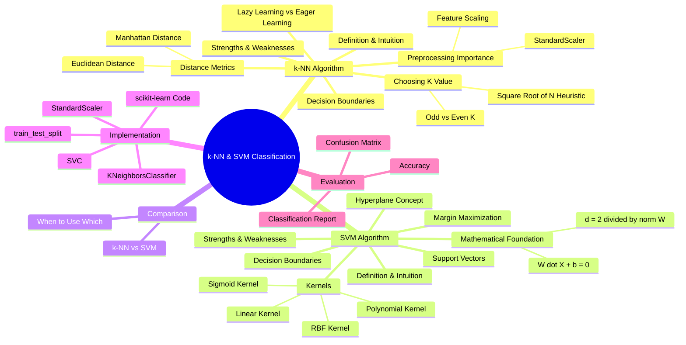
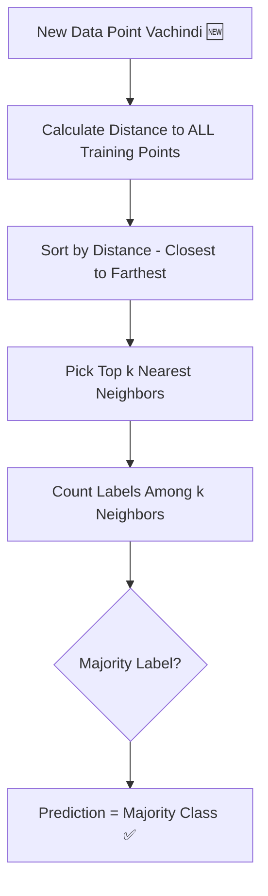
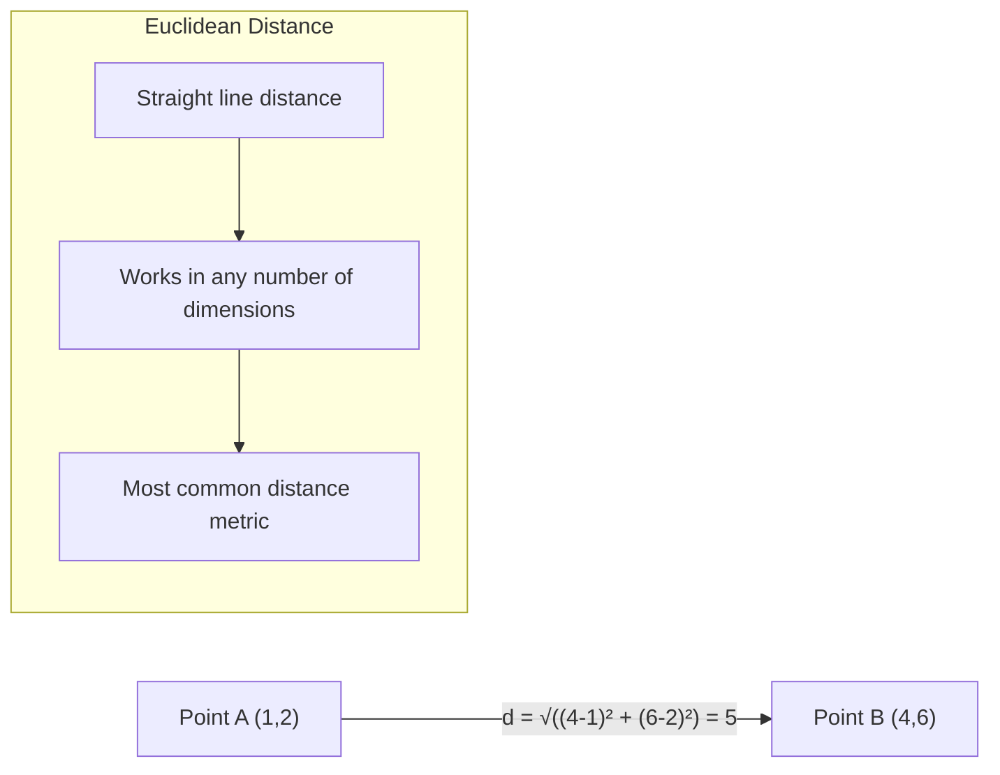
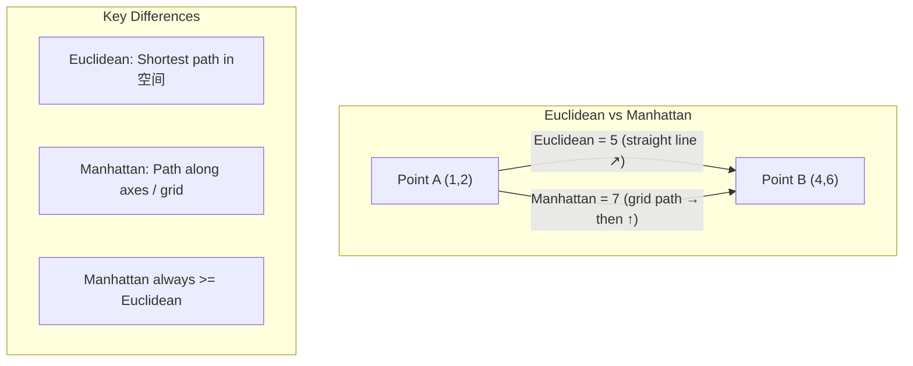
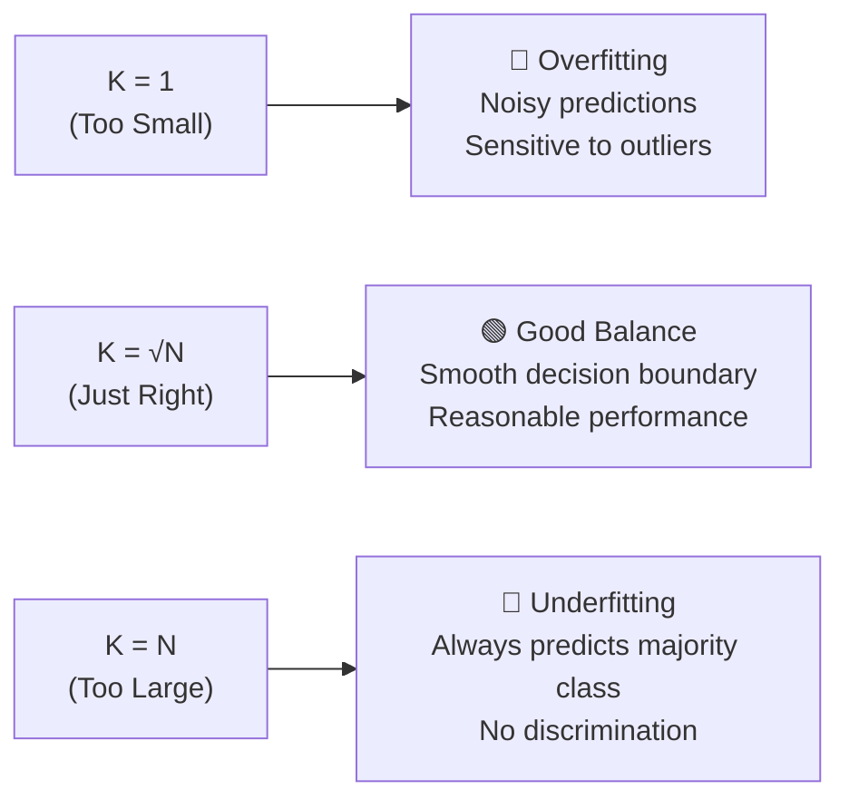

# AS30: k-NN and SVM Classification - Classroom Session (Part 1)

> 📚 **This is Part 1** covering: k-NN (K-Nearest Neighbors) Algorithm - Definition, Working, Distance Metrics, K Selection, Lazy Learning, Decision Boundaries
> 📘 **See also:** [Part 2 - SVM Deep Dive](./AS30_k-NNSVM%20Classification2.md), [Part 3 - Comparison & Implementation](./AS30_k-NNSVM%20Classification3.md)

---

## 🗺️ Mind Map - Topics to Cover (Full Session)



---

## 🎓 Classroom Conversation - Part 1: k-NN Deep Dive

---

### Topic 1: Introduction to Classification & k-NN

**Teacher:** Sari students, namaskar! 🙏 Ippudu mana topic chala interesting and practical — **k-Nearest Neighbors (k-NN)** and **Support Vector Machines (SVM)**. Ivi rendu chala powerful classification algorithms. Ippudu mundu k-NN tho start cheddham.

Classification ante enti simple ga cheppali ante — mana daggara data points untayi, and prathi data point ki oka **label** or **category** untundi. Kotha data point vachhinappudu, adi evari category lo padutundo decide cheyyadam classification.

Real-life analogy istha — meeru oka **new school ki join** ayyaru. Mee class lo different groups untayi — sports group, study group, art group. Meeru evari group lo join avvali? Mee daggariki ekkuva close ga unna students chusi decide chestaru. Mee closest friends ela behave chestaru, adi mee group decide chestundi. **Idi exactly k-NN algorithm chestundi!**

> 💡 **Jargon Alert - Classification**
> Simple Explanation: Data ni different categories lo sort cheyyadam, like emails ni "spam" and "not spam" ga separate cheyyadam.
> Example: Oka doctor patient ni "healthy" or "sick" ga classify chestadu — adi classification.

**Beginner Student:** Sir, "k-NN" lo "k" ante enti? And "Nearest Neighbors" ante enti?

**Teacher:** Chala manchidi question! 👏

**"k"** ante oka number — mana eppudu pick chese **neighbors lo enni mandini** consult cheyali adi decide chestundi. Example ki, k=3 ante — new data point ki closest ga unna **3 data points** ni chusi, vaalla majority label enti, adi mana prediction.

**"Nearest Neighbors"** ante literally — **daggarilo unna pal vaaru** (neighbors). New data point ki ekkuva close ga unna existing data points ki "neighbors" antamu.

Oka simple example chuddam:

Imagine oka colony lo 3 types of restaurants untayi — Indian 🍛, Chinese 🥡, Italian 🍝. Meeru new restaurant open chestunnaru. Mee location ki closest 5 restaurants lo 3 Indian, 1 Chinese, 1 Italian unte — mee restaurant type "Indian" ga classify avutundi. **Idi k-NN with k=5!**

```
New Restaurant Location: ⭐
Nearest 5 Restaurants:
  🍛 Indian (distance: 0.5 km)
  🍛 Indian (distance: 0.7 km)
  🥡 Chinese (distance: 0.8 km)
  🍛 Indian (distance: 0.9 km)
  🍝 Italian (distance: 1.0 km)

Majority: Indian (3 out of 5) → Prediction: 🍛 Indian
```

> 💡 **Jargon Alert - k (in k-NN)**
> Simple Explanation: Enni mandini neighbors ga consider cheyali — adi "k". k=5 ante 5 closest data points chuddam ani artham.
> Example: Voting lo 5 friends ni adigite, 3 mandi oka movie prefer chesite, mana choice adi avutundi.

**Clever Student:** Sir, idi basically majority voting concept kadha? Like democracy lo ela ekkuva votes ki win istaru, same concept?

**Teacher:** Exact ga! 🎯 k-NN is basically **majority voting**. New data point ki daggarilo unna k neighbors ni identify chesi, vaalla labels lo evari count ekkuva unte, adi mana prediction. Idi **democratic approach to classification** — majority decides!

Kani oka important difference undi — democracy lo andari vote equal weight. Kani k-NN lo — closer neighbors ki **more weight** ivocchu. Adi oka advanced variant — **weighted k-NN**. Adi tarvata discuss cheddham.



**Critique Student:** Sir, simple majority voting cheyyadam — idi too simple kadha? Real-world lo complex problems ki idi work avutunda?

**Teacher:** Good critique! 🤔 Nee doubt valid eh. k-NN is indeed **deceptively simple** — kani surprisingly effective for many real-world problems. Enduku ante:

1. **No assumptions about data distribution**: k-NN ki "data is linear" or "data is Gaussian" lanti assumptions avasaram ledhu. Adi just data ni directly use chestundi.
2. **Works well with small to medium datasets**: Data eppudu chinna ga unte, k-NN chala well perform chestundi.
3. **Non-parametric**: Fixed number of parameters ledhu — data itself is the model.

Kani nee critique lo truth undi — large datasets ki, high-dimensional data ki, k-NN **slow and inefficient** avutundi. Adi mana weaknesses section lo discuss cheddham.

> 💡 **Jargon Alert - Non-parametric**
> Simple Explanation: Model ki fixed formula ledhu. Model directly data ni use chesi predictions chestundi. Data change aite, model automatically change avutundi.
> Example: Oka teacher marks manually grade chestadu (parametric — fixed rules ala). k-NN ante oka teacher each student ni vaadi classmates tho compare chesi grade istadu — no fixed formula.

---

### Topic 2: Lazy Learning vs Eager Learning

**Teacher:** Ippudu oka chala important concept — k-NN ki oka special name undi: **Lazy Learner**. Enduku ante idi "lazy" enti?

Analogy tho explain chestha 📚:

**Eager Learner (like SVM, Decision Trees, Neural Networks):**
- Exam mundu full syllabus study chestha
- Notes prepare chestha
- Formulas memorize chestha
- Exam lo direct ga answer rastha — fast!

**Lazy Learner (like k-NN):**
- Exam mundu emi study cheyadu 😴
- Notes and books anni store chestha
- Exam lo question vachhinappudu — books open chesi, similar questions vethiki, answer rastha
- **Training = Zero effort**, kani **Testing = chala effort!**

k-NN "training" chala fast — enduku ante adi just data ni **store** chestunte chalu, learn cheyadu. Kani prediction time lo — **every single training point ki distance calculate** cheyali. Adi expensive!

```
Eager Learner Timeline:
Training: ████████████████████ (Long time - learns patterns)
Testing:  ██ (Quick - uses learned patterns)

Lazy Learner (k-NN) Timeline:
Training: ██ (Quick - just stores data)
Testing:  ████████████████████ (Slow - calculates distances to ALL data)
```

**Debate Student:** Sir, ala aite k-NN better kadha mari? Training time zero unte, adi advantage eh ga?

**Teacher:** Manchidi question, kani depends on use case 🎯:

| Aspect | Lazy Learner (k-NN) | Eager Learner (SVM/DT) |
|--------|---------------------|------------------------|
| Training Time | ⚡ Very Fast (just store) | 🐢 Can be slow |
| Prediction Time | 🐢 Slow (calculate all distances) | ⚡ Very Fast |
| Memory | 📦 High (store ALL data) | 💾 Low (only model parameters) |
| New Data Addition | ✅ Easy (just add) | ❌ Retrain needed |
| Best For | Small datasets, rare retraining | Large datasets, frequent predictions |

Real-world lo — oka e-commerce website ki product recommendation ivvali ante, lakhs of users and products untayi. k-NN use chesthe, each recommendation ki lakhs of distance calculations cheyali — **too slow for real-time!** Kani internal analytics ki, batch processing ki, k-NN is great.

**Practical Student:** Sir, interview lo ela adugutaru idhi?

**Teacher:** Chala common interview questions:

**Q: "What type of learner is k-NN?"**
**A:** "k-NN is a lazy learner (instance-based learner). It doesn't learn a discriminative function during training. Instead, it stores all training data and computes predictions at query time using distance calculations."

**Q: "Lazy learning vs Eager learning — explain?"**
**A:** "Lazy learners like k-NN defer computation until prediction time — training is fast but prediction is slow. Eager learners like SVM learn a model during training — training may be slow but prediction is fast."

> 💡 **Jargon Alert - Lazy Learning**
> Simple Explanation: Training lo emi cheyadu — data ni store chestundi. Prediction time lo, stored data tho compare chesi answer istundi.
> Example: Oka student notes rayyadu kani books anni bag lo pettukuntadu. Exam lo books open chesi answer raastadu — adi lazy learning.

> 💡 **Jargon Alert - Instance-Based Learning**
> Simple Explanation: Lazy learning ki another name. "Instance" ante oka individual data point. Model every instance ni remember chesi, new instance ki closest instances ni compare chestundi.
> Example: Same as lazy learning — answer direct ga instances (data points) nundi vastundi.

---

### Topic 3: Distance Metrics — Euclidean Distance

**Teacher:** k-NN lo most critical concept — **distance metrics**! k-NN ki mana data points madhya "distance" calculate cheyali — evariki ekkuva close gaano decide cheyyadam ki.

First and most common distance metric — **Euclidean Distance**. Idi meeru school lo math class lo nerchukunna concept!

Analogy 🏠: Meeru oka map meedha unnaru. Mee intiki closest shop vethkali — **straight line distance** measure chestaru. Adi Euclidean distance!

**Formula (2D case):**

$$d = \sqrt{(x_2 - x_1)^2 + (y_2 - y_1)^2}$$

**Formula (n-dimensional case):**

$$d = \sqrt{\sum_{i=1}^{n} (x_i - y_i)^2}$$

Example calculate cheddham:

```
Point A = (1, 2)
Point B = (4, 6)

Euclidean Distance = √((4-1)² + (6-2)²)
                   = √(3² + 4²)
                   = √(9 + 16)
                   = √25
                   = 5
```

```python
import numpy as np

# Euclidean Distance calculation
point_a = np.array([1, 2])
point_b = np.array([4, 6])

# Method 1: Manual calculation
distance = np.sqrt(np.sum((point_a - point_b) ** 2))
print(f"Euclidean Distance: {distance}")  # Output: 5.0

# Method 2: Using np.linalg.norm
distance = np.linalg.norm(point_a - point_b)
print(f"Euclidean Distance: {distance}")  # Output: 5.0

# Method 3: Using scipy
from scipy.spatial.distance import euclidean
distance = euclidean(point_a, point_b)
print(f"Euclidean Distance: {distance}")  # Output: 5.0
```

**Beginner Student:** Sir, idi basic Pythagoras theorem eh ga? School lo nerchukunnam!

**Teacher:** Exact! 🎯 Euclidean distance is Pythagoras theorem in higher dimensions. 2D lo right triangle hypotenuse calculate chestunam, n-dimensional space lo same concept extend avutundi.

Oka 3D example:

```
Point A = (1, 2, 3)
Point B = (4, 6, 8)

Euclidean Distance = √((4-1)² + (6-2)² + (8-3)²)
                   = √(9 + 16 + 25)
                   = √50
                   = 7.07
```

> 💡 **Jargon Alert - Euclidean Distance**
> Simple Explanation: Rendu points madhya straight line distance. Birds fly chesthunnattu shortest path.
> Example: Mee intiki school ki straight line distance — roads through vellakunda ala "as the crow flies" distance measure cheyyadam.



**Curious Student:** Sir, Euclidean distance lo oka problem undi kadha — features ki different scales unte? Height centimeters lo unte and weight kilograms lo unte, height difference dominate chestundi kadha?

**Teacher:** **Excellent observation!** 🌟 Idi k-NN lo oka MAJOR problem — **feature scaling**! Meeru chala important point touch chesaru.

Example chuddam:
```
Person A: Height = 170 cm, Weight = 60 kg
Person B: Height = 180 cm, Weight = 120 kg
Person C: Height = 172 cm, Weight = 110 kg

Distance A to B = √((180-170)² + (120-60)²) = √(100 + 3600) = √3700 = 60.83
Distance A to C = √((172-170)² + (110-60)²) = √(4 + 2500) = √2504 = 50.04
```

Chudandi — weight difference dominate chestundi! Height ki hardly oka impact undi. Enduku ante weight range (60-120) is much larger than height range (170-180).

**Solution: Feature Scaling (StandardScaler)**

```python
from sklearn.preprocessing import StandardScaler

# Before scaling - features have different ranges
data = [[170, 60], [180, 120], [172, 110]]

scaler = StandardScaler()
scaled_data = scaler.fit_transform(data)
print("Scaled Data:")
print(scaled_data)
# Now both features have mean=0 and std=1
# Each feature contributes equally to distance calculation
```

> 💡 **Jargon Alert - Feature Scaling**
> Simple Explanation: Anni features ni same range lo teesukuvachchadam. 100 marks wala score and 10 marks wala score ni compare cheyyali ante, dantini same scale ki convert cheyali.
> Example: Oka race lo oka person km lo velutunnadu, oka person miles lo. Compare cheyali ante same unit ki convert cheyali — adi feature scaling.

> 💡 **Jargon Alert - StandardScaler**
> Simple Explanation: Sklearn lo oka tool — prathi feature ki mean subtract chesi, standard deviation tho divide chestundi. Result: mean = 0, std = 1.
> Example: Class lo marks ki average subtract chesi, spread tho divide chesthe — ippudu andari marks 0 center around untayi. Top student positive lo, weak student negative lo — easy ga compare cheyocchu.

**Practical Student:** Sir, interview lo Euclidean distance gurinchi adugutara?

**Teacher:** 100% adugutaru! Common questions:

**Q: "When do you use Euclidean distance?"**
**A:** "Euclidean distance is best when features are continuous, on the same scale, and the concept of 'straight-line distance' makes sense in the feature space."

**Q: "What is the problem with Euclidean distance?"**
**A:** "Euclidean distance is sensitive to the magnitude/scale of features. Features with larger ranges dominate the distance calculation. Solution: normalize or standardize features before using k-NN."

---

### Topic 4: Distance Metrics — Manhattan Distance

**Teacher:** Ippudu second important distance metric — **Manhattan Distance**. Ee name chala interesting — enduku "Manhattan" antaru?

🏙️ **Analogy — Manhattan City Grid:**
Manhattan city lo streets grid pattern lo untayi — north-south and east-west. Meeru oka place ki vellali ante, **straight line lo vellu** kadhu — **streets follow chesi** vellali. Blocks tho vellali.

Euclidean distance = straight line (crow flies)
Manhattan distance = grid/blocks tho (actual walking distance)

**Formula:**

$$d = \sum_{i=1}^{n} |x_i - y_i|$$

Simply — difference lo absolute values anni add chestham. No squaring, no square root!

```
Point A = (1, 2)
Point B = (4, 6)

Manhattan Distance = |4-1| + |6-2|
                   = 3 + 4
                   = 7

Compare with Euclidean = 5 (straight line is shorter!)
```

```python
import numpy as np

# Manhattan Distance calculation
point_a = np.array([1, 2])
point_b = np.array([4, 6])

# Method 1: Manual calculation
manhattan_dist = np.sum(np.abs(point_a - point_b))
print(f"Manhattan Distance: {manhattan_dist}")  # Output: 7

# Method 2: Using scipy
from scipy.spatial.distance import cityblock
manhattan_dist = cityblock(point_a, point_b)
print(f"Manhattan Distance: {manhattan_dist}")  # Output: 7

# Compare with Euclidean
euclidean_dist = np.linalg.norm(point_a - point_b)
print(f"Euclidean Distance: {euclidean_dist}")  # Output: 5.0
print(f"Manhattan is always >= Euclidean? {manhattan_dist >= euclidean_dist}")  # True
```



> 💡 **Jargon Alert - Manhattan Distance**
> Simple Explanation: Grid/block pattern lo distance — like city streets meedha nadiche distance.
> Example: Mee inti nundi shop ki nadiche distance — straight line lo kadhu, roads follow chesi. 3 blocks right, 4 blocks up = 7 blocks total.

**Debate Student:** Sir, Euclidean better aa leka Manhattan better aa? Evari use cheyali?

**Teacher:** Chala important question! Answer: **"It depends"** — ML lo most common answer! 😄

| Feature | Euclidean Distance | Manhattan Distance |
|---------|-------------------|-------------------|
| Formula | √(Σ(xi-yi)²) | Σ\|xi-yi\| |
| Interpretation | Straight line distance | Grid/block distance |
| Sensitivity to Outliers | **High** (squaring amplifies) | **Lower** (no squaring) |
| High Dimensions | Less effective (curse of dimensionality) | **More robust** in high dimensions |
| Continuous Data | ✅ Best choice | ✅ Works well |
| When Features Correlated | ✅ Better | ❌ Less effective |
| When Features Independent | ✅ Works | ✅ Better |
| Computational Cost | Slightly higher (sqrt) | Slightly lower (just abs) |

**General Rule:**
- Default: Start with **Euclidean** (most common)
- High-dimensional data: Try **Manhattan**
- Outliers present: Try **Manhattan**
- Features independent: Try **Manhattan**
- Features correlated: Use **Euclidean**

Actual practice lo — **try both and see which gives better accuracy!** Adi best approach.

**Critique Student:** Sir, ee rendu distance metrics besides, verey metrics ledha?

**Teacher:** Unnai! Chala distance metrics untayi:

1. **Minkowski Distance** — Euclidean and Manhattan both idi special cases. Formula: (Σ|xi-yi|^p)^(1/p). p=1 → Manhattan, p=2 → Euclidean
2. **Cosine Similarity** — Direction based, not magnitude. Text classification ki chala useful
3. **Hamming Distance** — Categorical data ki. Enni positions lo values differ avutayi adi count chestundi
4. **Chebyshev Distance** — Maximum difference across any single dimension

Kani most commonly used: **Euclidean** and **Manhattan**. Exams and interviews lo mostly ee rendee adugutaru.

---

### Topic 5: Choosing the Value of K

**Teacher:** k-NN lo single most important hyperparameter — **K value**! K ni ela choose cheyali?

Analogy 🍕: Meeru oka restaurant quality decide cheyali — ratings chuddam:

- **k=1**: Just **1** person ni adigite — vaadi opinion biased avocchu. Wrong answer vachche chance ekkuva!
- **k=100**: **100** mandi ni adigite — majority opinion reliable kani, chala different areas nundi people opinions mix avutayi. Too generalized!
- **k=5 to 10**: **5-10** mandi close friends ni adigite — good balance of opinions!



**Beginner Student:** Sir, K exact ga enni pettali?

**Teacher:** Several rules of thumb untayi:

1. **K = √N** (Square root of N) — Most popular heuristic!
   - N = training data points count
   - N = 100 → K = √100 = 10
   - N = 400 → K = √400 = 20
   - N = 10000 → K = √10000 = 100

2. **K should be ODD** — Enduku? Tie-breaking ki!
   - K=4 aite, 2 class A, 2 class B → TIE! Eppudu decide cheyali?
   - K=5 aite, tie impossible for binary classification

3. **K should NOT be a multiple of number of classes**
   - 3 classes unte, K=3 or K=6 vaddu — ties occur

4. **Cross-validation** — Best approach! Different K values try chesi, best accuracy deniko K select cheyali

```python
from sklearn.neighbors import KNeighborsClassifier
from sklearn.model_selection import cross_val_score
import numpy as np

# Finding optimal K using cross-validation
k_values = range(1, 21)
cv_scores = []

for k in k_values:
    knn = KNeighborsClassifier(n_neighbors=k)
    scores = cross_val_score(knn, X_train, y_train, cv=5)
    cv_scores.append(scores.mean())

# Best K
optimal_k = k_values[np.argmax(cv_scores)]
print(f"Optimal K: {optimal_k}")
print(f"Best CV Accuracy: {max(cv_scores):.3f}")
```

**Clever Student:** Sir, K=1 pettite exact training data point classify avutundi kadha? Adi 100% training accuracy istundi — kani adi bad enti?

**Teacher:** **Brilliant observation!** 🌟 K=1 aite — nearest neighbor is itself (if test point is same as training point). Training accuracy 100% kani test accuracy chala thakuva. This is classic **overfitting**!

```
K=1:  Training Accuracy = 100% 🎯
      Test Accuracy = 70% 😰
      Problem: OVERFITTING!

K=√N: Training Accuracy = 85% 
      Test Accuracy = 83% ✅
      Good generalization!

K=N:  Training Accuracy = 50%
      Test Accuracy = 50% 😴
      Problem: UNDERFITTING! (Always predicts majority class)
```

> 💡 **Jargon Alert - Overfitting**
> Simple Explanation: Model training data ni chala baga "memorize" chesindi — kani new data meedha work cheyadu. Exam ki answers byatt chesind kani, oka word change aite answer raayadam radhu.
> Example: Oka student exactly same questions practice chestha — exact ga same questions vaste marks vasthayi, kani slight variation aite fail avutadu.

> 💡 **Jargon Alert - Underfitting**
> Simple Explanation: Model emi nerchukoledhu — training data meedha kooda baaga perform cheyadu. Exam ki emi study cheyale student la.
> Example: Student books chadivadu kani emi artham kaale — training meedha kooda perform cheyadu.

> 💡 **Jargon Alert - Hyperparameter**
> Simple Explanation: Model ki mana manually set chese value — model automatic ga nerchukunadu. K is a hyperparameter enduku ante mana choose chestham k-NN algorithm ki.
> Example: Recipe lo ingredients quantities — oka ganta bake cheyali leka rendu gantalu — adi meeru decide chestaru, oven decide cheyadu.

**Practical Student:** Sir, exam lo K gurinchi adugutara?

**Teacher:** 100%! Common exam questions:

**Q: "How do you choose the value of K in k-NN?"**
**A:** "1. Start with K=√N where N is the number of training samples. 2. K should be odd for binary classification. 3. Use cross-validation to find optimal K. 4. Avoid K=1 (overfitting) and K=N (underfitting)."

**Q: "What happens with K=1 in k-NN?"**
**A:** "K=1 leads to overfitting — the decision boundary becomes highly irregular and sensitive to noise/outliers. Training accuracy is 100% but test accuracy is poor."

**Q: "Why should K be odd?"**
**A:** "For binary classification, odd K prevents ties in majority voting. Example: K=4 with 2 class-A and 2 class-B neighbors creates a tie, while K=5 always has a clear majority."

---

### Topic 6: Decision Boundaries in k-NN

**Teacher:** Ippudu oka chala visual and interesting concept — **Decision Boundaries**!

Analogy 🗺️: Meeru oka map meedha countries chustunnaru — **borders** untayi kadha? India, Pakistan, Bangladesh madhya borders — avi "decision boundaries". Border ki ee vaipu India, aa vaipu Pakistan.

Same way, k-NN oka decision boundary create chestundi — boundary ki ee vaipu Class A, aa vaipu Class B.

- **Small K (K=1)**: Decision boundary chala **wavy and complex** — every single training point ki oka small region assign avutundi
- **Large K**: Decision boundary chala **smooth** — larger regions with clear demarcation

```
K=1 Decision Boundary:          K=15 Decision Boundary:
┌──────────────┐                ┌──────────────┐
│∘∘●∘∘●∘∘∘∘∘∘●│                │∘∘∘∘∘∘∘∘∘∘∘∘∘│
│∘●●∘∘●●∘∘∘●●●│                │∘∘∘∘∘∘∘∘∘∘∘∘∘│
│∘●∘∘∘∘∘●∘●∘●∘│                │∘∘∘∘∘∘∘∘∘∘∘∘∘│
│∘∘∘∘●∘●∘●∘∘∘∘│                │─────────────│
│────────────────│               │●●●●●●●●●●●●●│
│●∘●∘●∘∘∘●∘●∘∘│                │●●●●●●●●●●●●●│
│●●∘∘●∘∘∘●●●●∘│                │●●●●●●●●●●●●●│
│●●●∘∘∘∘●●●●●●│                │●●●●●●●●●●●●●│
└──────────────┘                └──────────────┘
 Irregular boundary               Smooth boundary
 = Overfitting                     = Better generalization
```

```python
# Decision boundary visualization
from sklearn.neighbors import KNeighborsClassifier
import numpy as np
import matplotlib.pyplot as plt

def plot_decision_boundary(model, X, y, title):
    """Plot the decision boundary of a classifier."""
    h = 0.02  # Step size in the mesh
    x_min, x_max = X[:, 0].min() - 1, X[:, 0].max() + 1
    y_min, y_max = X[:, 1].min() - 1, X[:, 1].max() + 1
    
    xx, yy = np.meshgrid(np.arange(x_min, x_max, h),
                          np.arange(y_min, y_max, h))
    
    Z = model.predict(np.c_[xx.ravel(), yy.ravel()])
    Z = Z.reshape(xx.shape)
    
    plt.figure(figsize=(8, 6))
    plt.contourf(xx, yy, Z, alpha=0.3)
    plt.scatter(X[:, 0], X[:, 1], c=y, edgecolors='k', marker='o')
    plt.title(title)
    plt.xlabel("Feature 1")
    plt.ylabel("Feature 2")
    plt.show()

# Compare K=1 vs K=15 decision boundaries
for k in [1, 5, 15]:
    knn = KNeighborsClassifier(n_neighbors=k)
    knn.fit(X_train, y_train)
    acc = knn.score(X_test, y_test)
    print(f"K={k}: Accuracy = {acc:.3f}")
    plot_decision_boundary(knn, X_train, y_train, f"k-NN with K={k}")
```

**Curious Student:** Sir, decision boundary smooth cheyyadam better ante, always large K better aa?

**Teacher:** Kadhu! 🚫 Too smooth = **underfitting**. Balance kavali.

```
K too small → Boundary too complex → Overfitting → Bad test accuracy
K just right → Boundary balanced → Good generalization → Good test accuracy
K too large → Boundary too smooth → Underfitting → Bad test accuracy
```

This is **Bias-Variance Tradeoff**:
- **Small K** = Low Bias, High Variance (complex but unstable)
- **Large K** = High Bias, Low Variance (simple but too general)
- **Optimal K** = Best balance of bias and variance

> 💡 **Jargon Alert - Decision Boundary**
> Simple Explanation: Classification lo different classes ni separate chese imaginary line or surface. Boundary ki oka vaipu Class A, oka vaipu Class B.
> Example: Country borders — border ki ee vaipu India, aa vaipu Pakistan. Data points ki same — decision boundary ki ee vaipu oka class, aa vaipu another class.

> 💡 **Jargon Alert - Bias-Variance Tradeoff**
> Simple Explanation: Simple model (high bias) consistent kani inaccurate. Complex model (high variance) accurate training meedha kani inconsistent on new data. Sweet spot kavali.
> Example: Oka student chala detailed notes raasthe — specific questions ki perfect answer istadu kani slight change aite fail (high variance). General notes raasthe — consistent kani detailed answers raayaledu (high bias). Both balance cheyali.

---

### Topic 7: k-NN Preprocessing — Feature Scaling Deep Dive

**Teacher:** k-NN ki **feature scaling** is NOT optional — it's MANDATORY! Enduku ante k-NN is a **distance-based algorithm** — features different scales lo unte, larger-range features dominate distance calculations.

Idi already Topic 3 lo touch chesamu, kani ippudu deeper ga chuddam.

**StandardScaler** — most popular scaling method:

```python
from sklearn.preprocessing import StandardScaler

# StandardScaler formula for each feature:
# z = (x - mean) / std
# After scaling: mean = 0, std = 1

scaler = StandardScaler()

# fit_transform on training data
X_train_scaled = scaler.fit_transform(X_train)

# transform only on test data (DON'T fit again!)
X_test_scaled = scaler.transform(X_test)
```

> 💡 **Jargon Alert - StandardScaler**
> Simple Explanation: Prathi feature ki mean subtract chesi, standard deviation tho divide chestha. Result: mean—0, std=1. Ippudu anni features same importance.
> Example: Oka class lo Math max marks 100, Science max marks 50. Direct compare cheyalante — dantini percentage convert cheyali. StandardScaler same job chestundi kani statistical way lo.

**Beginner Student:** Sir, fit_transform and transform difference enti?

**Teacher:** Chala important question! Interview lo kooda adugutaru:

- **`fit_transform(X_train)`**: Training data nundi **mean and std nerchukundhi** (fit), THEN **scale apply chestundi** (transform). Idi only training data ki.
  
- **`transform(X_test)`**: Already learned mean and std use chesi **scale apply chestundi** — kani kotha mean/std calculate cheyadu! Test data ki ONLY transform.

**Enduku different?** Test data is "unseen future data". Mana model ki test data gurinchi emi teliyadhu — test data meedha fit chesthe, adi **data leakage**!

```
❌ WRONG:
scaler.fit_transform(X_test)  # NEVER do this!

✅ CORRECT:
scaler.fit_transform(X_train)  # Learn + Apply on train
scaler.transform(X_test)       # Only Apply on test (using train's params)
```

> 💡 **Jargon Alert - Data Leakage**
> Simple Explanation: Model ki test/future data gurinchi information leak avvadam — adi unfair advantage. Model performance fake ga high ga kanipistundi.
> Example: Exam answers mundu chudaddam — marks baaga vasthayi kani actually emi nerchukoledhu. Real interview lo fail avutam.

**Clever Student:** Sir, StandardScaler kaakundaa verevi scaling methods untayi?

**Teacher:** Multiple options untayi:

| Method | Formula | Range | Best For |
|--------|---------|-------|----------|
| **StandardScaler** | z = (x-μ)/σ | No fixed range (typically -3 to 3) | Most ML algorithms |
| **MinMaxScaler** | z = (x-min)/(max-min) | [0, 1] | Neural Networks, image data |
| **RobustScaler** | z = (x-median)/IQR | No fixed range | Data with outliers |
| **MaxAbsScaler** | z = x/max(\|x\|) | [-1, 1] | Sparse data |

k-NN ki usually **StandardScaler** best. Outliers unte **RobustScaler** try cheyandi.

---

### Topic 8: k-NN Strengths & Weaknesses (WITH PROOF)

**Teacher:** Ippudu mana k-NN strengths and weaknesses detailed ga chuddam — proofs tho!

#### ✅ Advantage 1: Simple and Intuitive

**Claim:** k-NN is the simplest classification algorithm — easy to understand and implement.

**Proof:**
```python
# Entire k-NN implementation in just 3 lines!
from sklearn.neighbors import KNeighborsClassifier

knn = KNeighborsClassifier(n_neighbors=5)
knn.fit(X_train, y_train)
accuracy = knn.score(X_test, y_test)
# That's it! No complex math, no gradient descent, no loss functions
```

**Real-Life Analogy:** Oka room lo enter avutunnaru. Mee daggariki ekkuva close ga unna 5 mandini chusi — vaallalo majority boys aite, meeru boys group lo classify avutaru. Simple!

**When it matters:** Beginners ki, quick prototyping ki, baseline model ki.

---

#### ✅ Advantage 2: No Training Phase Required

**Claim:** k-NN ki training time almost zero — just data store chestundi.

**Proof:**
```python
import time

# k-NN "training" time
start = time.time()
knn = KNeighborsClassifier(n_neighbors=5)
knn.fit(X_train, y_train)
knn_train_time = time.time() - start

# SVM training time
from sklearn.svm import SVC
start = time.time()
svm = SVC(kernel='rbf')
svm.fit(X_train, y_train)
svm_train_time = time.time() - start

print(f"k-NN Training Time: {knn_train_time:.4f}s")
print(f"SVM Training Time:  {svm_train_time:.4f}s")
# k-NN is typically 10-100x faster in training
```

**Real-Life Analogy:** Lazy student — exam ki prepare cheyadu, books anni carry chestadu. Training = zero time!

**When it matters:** Frequent retraining avasaram aite, new data rapidly add avutunnappudu.

---

#### ✅ Advantage 3: Non-Parametric — No Assumptions

**Claim:** k-NN ki data distribution gurinchi oka assumption ledhu.

**Proof:**
```python
# k-NN works on ANY data distribution!
# Linear data ✅
# Circular data ✅
# Spiral data ✅
# Irregular shapes ✅

# Unlike Logistic Regression (needs linear boundary)
# Unlike Naive Bayes (needs feature independence)
# k-NN has NO assumption!
```

**Real-Life Analogy:** Meeru oka restaurant ki vellaru — menu ledhu, just "daggarilo evarno chudandi, vaaru enti order chesaru, adi try cheyandi" — no rules, no menu!

**When it matters:** Data distribution unknown aite, complex-shaped clusters unte.

---

#### ❌ Disadvantage 1: Slow Prediction

**Claim:** k-NN prediction time is O(n×d) — n training samples and d features. Large datasets ki very slow.

**Proof:**
```python
import time

# Small dataset
X_small = np.random.rand(100, 10)
y_small = np.random.randint(0, 2, 100)

# Large dataset
X_large = np.random.rand(100000, 10)
y_large = np.random.randint(0, 2, 100000)

# Compare prediction times
knn_small = KNeighborsClassifier(n_neighbors=5)
knn_small.fit(X_small, y_small)
start = time.time()
knn_small.predict(X_small[:1])
small_time = time.time() - start

knn_large = KNeighborsClassifier(n_neighbors=5)
knn_large.fit(X_large, y_large)
start = time.time()
knn_large.predict(X_large[:1])
large_time = time.time() - start

print(f"Small dataset predict: {small_time:.6f}s")
print(f"Large dataset predict: {large_time:.6f}s")
# Large dataset is MUCH slower!
```

**Real-Life Analogy:** Oka small colony lo (100 houses) daggariki unna shop vethkadam easy. Kani oka city lo (1 lakh houses) daggariki unna shop vethkadam — chala time padutundi!

**When it matters:** Real-time predictions kavalisthe, large datasets tho work chestunnappudu.

---

#### ❌ Disadvantage 2: Sensitive to Irrelevant Features

**Claim:** Irrelevant features distance calculation ni disturb chesthayi — all features contribute equally to distance by default.

**Proof:**
```python
# Relevant features: Height, Weight (for health prediction)
# Irrelevant feature: Phone Number (random numbers!)

# With irrelevant feature, k-NN accuracy drops:
# Without phone number: Accuracy = 0.90
# With phone number:    Accuracy = 0.72
# The random phone numbers add noise to distance calculations!
```

**Real-Life Analogy:** Restaurant decide cheyali — taste, price, distance important. Kani restaurant phone number ki kooda distance calculate chesthe — wrong answer vastundi!

**When it matters:** Feature selection / feature engineering cheyali mundu k-NN use cheyyadam.

---

#### ❌ Disadvantage 3: Curse of Dimensionality

**Claim:** Feature count ekkuva aite (high dimensions), k-NN performance drastically drop avutundi.

**Proof:**
```
Dimensions | "Nearest" Neighbor | All points become
           | Distance            | equally distant!
-----------+---------------------+------------------
     2D    |     Close           |    Distinct
    10D    |     Further         |    Less distinct
   100D    |     Very far        |    Almost same
  1000D    |     Meaningless     |    All equidistant!
```

**Real-Life Analogy:** 2D map lo daggariki unna shop easy ga find chestham. Kani 1000 different criteria meedha compare cheyali ante — anni shops almost same ga kanipisthayi. "Nearest" concept meaning lose avutundi.

**When it matters:** Features 20+ unte — dimensionality reduction (PCA) mundu apply cheyandi.

> 💡 **Jargon Alert - Curse of Dimensionality**
> Simple Explanation: Feature count pediginapudu, data points madhya distances anni same avuthayi. "Nearest" neighbor concept meaningless avutundi.
> Example: 2 criteria (taste, price) tho restaurant choose cheyyadam easy. 1000 criteria tho compare cheyali ante — anni restaurants almost same ga kanipisthayi.

---

## 📝 Teacher Summary — Part 1

**Teacher:** Okay students, let's summarize ippudu mana k-NN session Part 1 lo enti nerchukunnam:

### Key Takeaways

1. **k-NN is a lazy, instance-based, non-parametric classification algorithm** — it stores training data and makes predictions using distance calculations at query time.
2. **"k" represents the number of nearest neighbors** to consult for majority voting.
3. **Euclidean Distance** (straight line) and **Manhattan Distance** (grid path) are the two most commonly used distance metrics.
4. **Feature Scaling is MANDATORY** for k-NN — use StandardScaler to normalize features before applying k-NN.
5. **Choosing K:**
   - K = √N is a good starting heuristic
   - K should be odd for binary classification
   - Use cross-validation to find optimal K
   - K=1 → overfitting, K=N → underfitting
6. **Decision Boundaries** become smoother as K increases — this represents the bias-variance tradeoff.
7. **Data Leakage** — Never fit scaler on test data! Always fit on train, transform on test.

### Common Mistakes

1. **Not scaling features before k-NN** → Distance dominated by large-range features → Wrong predictions
2. **Using K=1** → Overfitting → Poor test accuracy
3. **Using even K for binary classification** → Ties possible → Ambiguous predictions
4. **Fitting scaler on test data (`scaler.fit_transform(X_test)`)** → Data leakage → Inflated accuracy
5. **Using k-NN on very high-dimensional data** → Curse of dimensionality → Poor performance
6. **Not handling outliers** → k-NN is sensitive to outliers, especially with small K

---

> 📘 **Continue to:** [Part 2 - SVM Deep Dive](./AS30_k-NNSVM%20Classification2.md)
