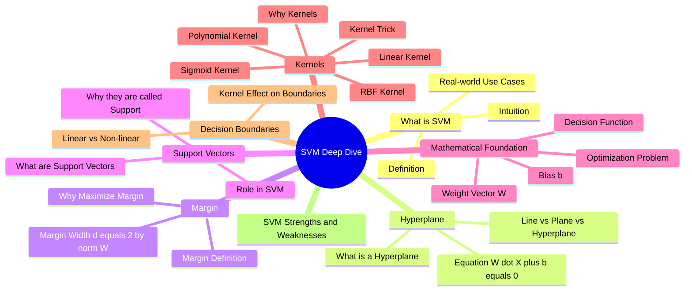
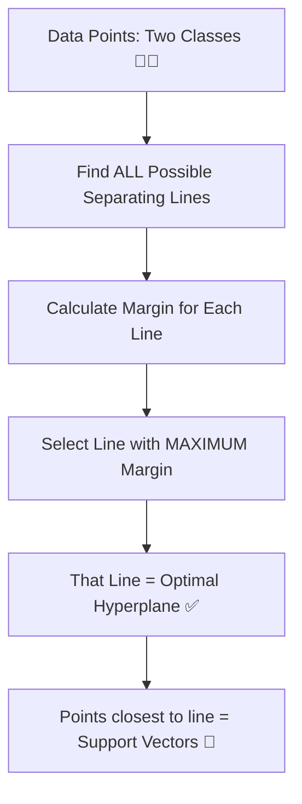
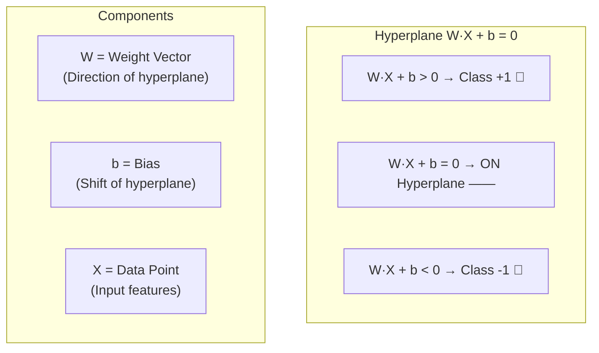
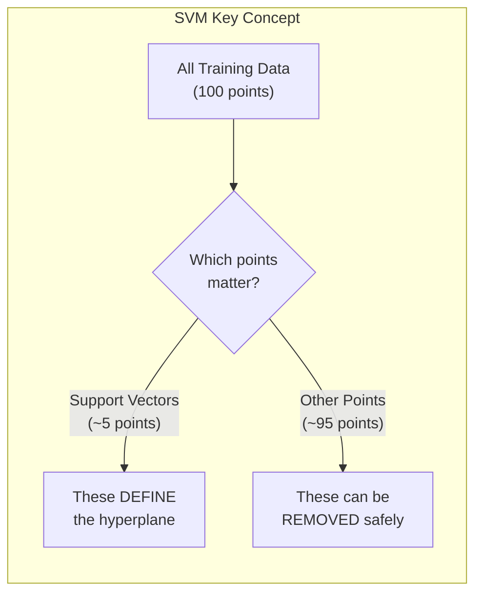
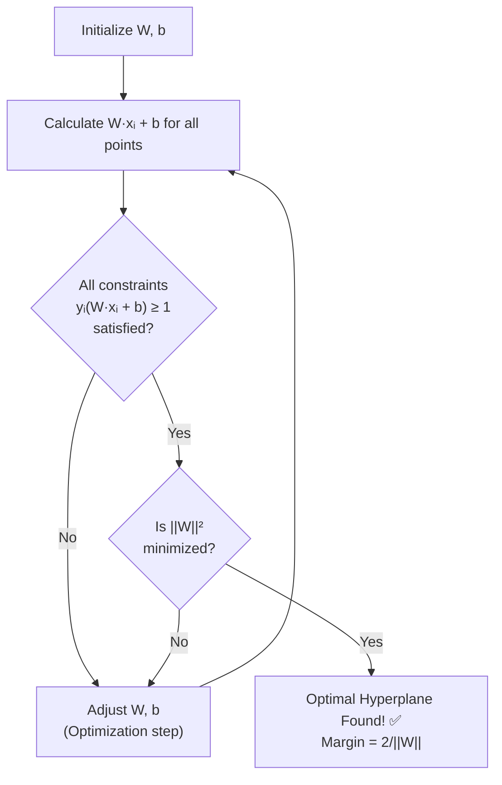
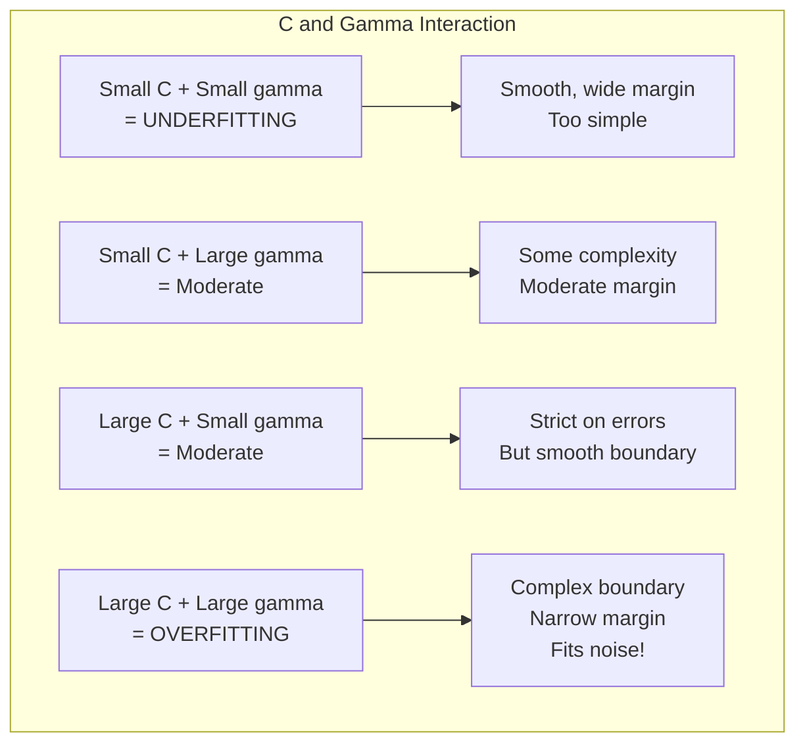

# AS30: k-NN and SVM Classification - Classroom Session (Part 2)

> 📚 **This is Part 2** covering: SVM (Support Vector Machines) — Hyperplane, Margin, Support Vectors, Mathematical Foundations, Kernels, Decision Boundaries
> 📘 **Previous:** [Part 1 - k-NN Deep Dive](./AS30_k-NNSVM%20Classification1.md)
> 📘 **Next:** [Part 3 - Comparison & Implementation](./AS30_k-NNSVM%20Classification3.md)

---

## 🗺️ Mind Map - Part 2 Topics



---

## 🎓 Classroom Conversation - Part 2: SVM Deep Dive

---

### Topic 1: Introduction to SVM

**Teacher:** Okay students, k-NN chala baga nerchukunnam! Ippudu mana second powerful classification algorithm — **Support Vector Machine (SVM)** chuddam.

SVM oka **chala elegant and powerful** algorithm. Idi classification problems ki widely used — text classification, image recognition, bioinformatics, face detection — everywhere!

Real-life analogy tho start cheddham 🏠:

Imagine meeru oka **playground supervisor**. Playground lo **cricket lovers** oka side unnaru, **football lovers** oka side unnaru. Meeru vaari madhya oka **rope** (boundary) veyali — eppudu vaaru separate avutaru.

Kani oka problem — rope **eka petta** vochchu? Chala possible positions untayi!

- Option 1: Cricket group ki chala close ga
- Option 2: Football group ki chala close ga
- Option 3: Exact madhya lo — **equal distance** from both groups

**SVM answer: Option 3!** — Rope ni exact madhya lo pettali, both groups nundi **maximum distance** maintain chesthu. **Idi SVM concept — margin maximization!**

> 💡 **Jargon Alert - Support Vector Machine (SVM)**
> Simple Explanation: Two classes ni separate chese "best possible line" vetike algorithm. "Best" ante — line ki closest points nundi maximum distance maintain chestundi.
> Example: Cricket and football teams separate chese rope — rope exact madhya lo unte, both teams nundi ekkuva gap maintain avutundi. SVM adhe chestundi.



**Beginner Student:** Sir, SVM ki "Support Vector" lo "vector" ante enti? And "support" enti?

**Teacher:** Manchidi question! 👏

**"Vector"** — math lo vector ante direction and magnitude unna quantity. Mana data points ni vectors gaa treat chestham — prathi data point ki oka position in feature space untundi.

**"Support"** — SVM lo **support vectors** ante — **decision boundary (hyperplane) ki closest ga unna data points**. Vaallani "support" antaru enduku ante — vaalle hyperplane ni **prop up** chestaru, **support** chestaru. If you remove these points, hyperplane change avutundi!

Analogy 🏗️: Oka tent imagine cheyandi. Tent fabric (hyperplane) ni hold chese **tent poles** (support vectors). Poles remove chesthe tent collapse avutundi! Support vectors = tent poles.

---

### Topic 2: Hyperplane — The Decision Boundary

**Teacher:** SVM lo first important concept — **Hyperplane**. Idi mana decision boundary.

Different dimensions lo hyperplane different ga kanipistundi:

| Dimensions | Data Space | Hyperplane |
|------------|-----------|------------|
| **1D** | Line (number line) | Point |
| **2D** | Plane (flat paper) | **Line** |
| **3D** | 3D Space (room) | **Plane** (flat surface) |
| **nD** | n-dimensional space | **(n-1)-dimensional surface** |

Most of the time, mana data 2D lo visualize chestham — so hyperplane oka **line**.

**Mathematical Equation:**

$$W \cdot X + b = 0$$

Ekkada:
- **W** = Weight vector (normal to the hyperplane) — hyperplane direction decide chestundi
- **X** = Data point (feature vector)
- **b** = Bias (intercept) — hyperplane ni shift chestundi
- **W · X** = Dot product of W and X

```
2D Example:
If W = [2, 3] and b = -1

Hyperplane equation: 2x₁ + 3x₂ - 1 = 0

Points where 2x₁ + 3x₂ - 1 > 0 → Class +1 (above line)
Points where 2x₁ + 3x₂ - 1 < 0 → Class -1 (below line)
Points where 2x₁ + 3x₂ - 1 = 0 → ON the hyperplane
```



> 💡 **Jargon Alert - Hyperplane**
> Simple Explanation: Data ni two parts ga divide chese line (2D lo), plane (3D lo), or surface (higher dimensions lo). SVM lo — idi decision boundary.
> Example: Oka paper ni two pieces ga cut chese line — paper ki oka side Class A, verey side Class B. Adi hyperplane!

> 💡 **Jargon Alert - Dot Product (W · X)**
> Simple Explanation: Two vectors ni element-wise multiply chesi anni results ni add cheyyadam. W = [2,3] and X = [1,4] aite → W·X = 2×1 + 3×4 = 2+12 = 14.
> Example: Meeru oka shop lo 2 apples (₹10 each) and 3 bananas (₹5 each) konukkuntunnaru. Total = 2×10 + 3×5 = 35. Idi dot product concept!

**Clever Student:** Sir, oka important question — W · X + b = 0 equation lo **infinitely many hyperplanes** possible kadha? SVM evari pick chestundi?

**Teacher:** **Exactly the right question!** 🌟 This is the CORE of SVM. Yes, infinitely many hyperplanes possible — kani SVM **ONE specific hyperplane** pick chestundi — the one with **MAXIMUM MARGIN**!

---

### Topic 3: Margin — The Key Innovation of SVM

**Teacher:** SVM lo **margin** ani oka chala important concept undi. Idi SVM ni other classifiers nundi different chestundi.

**Margin** = Distance between the hyperplane and the **closest data points** (support vectors) on **both sides**.

Analogy 🛣️: Oka road ki center line undi. Center line ki both sides lo lane markings untayi. **Margin = road width** — left lane marking nundi right lane marking varaku distance. **Wider road = safer driving!** Same way, **wider margin = better classification!**

```
Narrow Margin (Dangerous):              Wide Margin (Safe):
   🔴🔴                                    🔴🔴
   🔴  |  🔵                               🔴    |    🔵
   🔴🔴|🔵🔵                               🔴🔴  |  🔵🔵
       |                                          |
   Hyperplane                                Hyperplane
   Close to data points                      Far from data points
   = High risk of errors                     = Low risk of errors
```

**Mathematical Formula for Margin Width:**

$$d = \frac{2}{||W||}$$

Ekkada:
- **d** = Margin width (total distance between both boundaries)
- **||W||** = norm (magnitude) of weight vector W
- **||W|| = √(w₁² + w₂² + ... + wₙ²)**

**Important insight**: Margin **maximize** cheyali ante → d maximize → **||W|| minimize** cheyali! Because d = 2/||W|| lo — denominator chinna aite, fraction pedda avutundi.

```
If W = [3, 4]:
  ||W|| = √(3² + 4²) = √(9 + 16) = √25 = 5
  Margin = 2/5 = 0.4

If W = [1, 1]:
  ||W|| = √(1² + 1²) = √2 = 1.414
  Margin = 2/1.414 = 1.414

Smaller ||W|| → Larger Margin → Better SVM! ✅
```

> 💡 **Jargon Alert - Margin**
> Simple Explanation: Hyperplane ki closest points nundi total distance. Wide margin = better classifier.
> Example: Rope ki oka side cricket ground, oka side football ground. Ground ki rope madhya distance — adi margin. Distance ekkuva unte, players rope daatipodaru — safe!

> 💡 **Jargon Alert - Norm (||W||)**
> Simple Explanation: Vector length (magnitude). W = [3, 4] aite ||W|| = √(9+16) = 5. Idi Pythagoras theorem vector ki apply chesthe vastundi.
> Example: Meeru east ki 3 km, north ki 4 km nadicharu. Mee actual straight-line distance starting point nundi = 5 km. Adi vector norm!

**Curious Student:** Sir, margin maximize cheyyadam enduku important? Close to boundary points aite enti problem?

**Teacher:** Excellent question! 🤔

**Why maximize margin?**

1. **Better generalization**: Wide margin unte — new data points correctly classify avutayi probability ekkuva. Narrow margin unte — slight variation lo wrong prediction vachche chance ekkuva.

2. **Statistical Learning Theory**: Wider margin → lower VC dimension → lower generalization error. (This is proven mathematically!)

3. **Robustness to noise**: Noisy data ki wide margin resistant. Small perturbation lo classification change kaadu.

```
Scenario: New point arrives slightly off-center

Narrow Margin:
  🔴 x 🔵    ← New point 'x' is MISCLASSIFIED (crossed narrow boundary)!

Wide Margin:
  🔴    x   🔵    ← New point 'x' is CORRECTLY classified (within wide margin)!
```

---

### Topic 4: Support Vectors — The Critical Points

**Teacher:** Ippudu mana SVM lo most important concept — **Support Vectors**! Ee entire algorithm name lo undi!

**Support Vectors** = The data points that are **closest to the hyperplane** — the ones that **lie on the margin boundaries**.

Key Facts:
1. **Only support vectors matter** — SVM hyperplane ni only support vectors decide chesthayi
2. **Remove any non-support-vector** → Hyperplane change avvadu!
3. **Remove any support vector** → Hyperplane change avutundi!
4. **Support vectors are the most "difficult" points** — they are on the edge between classes

```
        Support Vectors (on margin boundaries)
                ↓           ↓
  🔴  🔴  [🔴]  |  [🔵]  🔵  🔵
  🔴        ↑   |   ↑        🔵
        On margin  On margin
        boundary   boundary

  [🔴] and [🔵] = Support Vectors
  🔴 and 🔵 = Regular data points (don't affect hyperplane)
  | = Hyperplane
```



> 💡 **Jargon Alert - Support Vectors**
> Simple Explanation: Hyperplane ki closest ga unna data points — vaalle hyperplane ni "hold up" chesthayi (support chesthayi). Vaallani remove chesthe hyperplane collapse avutundi.
> Example: Tent poles — tent fabric ni poles support chesthayi. Poles remove chesthe tent padipotundi. Support vectors = tent poles!

**Debate Student:** Sir, support vectors only few points kadha? Motta data ni SVM ignore chestundha?

**Teacher:** Exactly! Adi SVM advantage and disadvantage both!

**Advantage:** Computationally efficient — final model lo only support vectors matter. Even if you have millions of data points, maybe only hundreds are support vectors.

**Disadvantage:** If data is noisy and many points are on/near the boundary — too many support vectors → model becomes complex.

From mana source notebook, oka example chuddam:

```python
from sklearn.svm import SVC
import numpy as np

# Train SVM
svm = SVC(kernel='linear')
svm.fit(X_train, y_train)

# How many support vectors?
print(f"Number of support vectors: {len(svm.support_vectors_)}")
print(f"Total training points: {len(X_train)}")
print(f"Support vectors per class: {svm.n_support_}")

# Support vectors are stored in svm.support_vectors_
# You can visualize them to see they're on the margin boundaries
```

---

### Topic 5: SVM Mathematical Foundation — Optimization Problem

**Teacher:** Ippudu SVM math lo deeper ga dive cheddham. Exam and interview ki idi important!

SVM optimization problem:

**Goal:** Minimize ||W||² / 2 (which maximizes margin d = 2/||W||)

**Subject to constraints:**
- For every positive class point: W · xᵢ + b ≥ +1
- For every negative class point: W · xᵢ + b ≤ -1

Combined: **yᵢ (W · xᵢ + b) ≥ 1** for all i

Ekkada yᵢ = +1 for positive class, yᵢ = -1 for negative class.

```
The SVM Optimization:

Minimize:  (1/2) ||W||²

Subject to: yᵢ(W · xᵢ + b) ≥ 1,  for i = 1, 2, ..., n

This is a Quadratic Programming (QP) problem!
```

**Beginner Student:** Sir, idi chala complex ga undi. Simple ga explain chestara?

**Teacher:** Sure! Simple analogy 🎯:

Imagine meeru oka **exam paper design** chestunnaru:
- Questions should be **not too easy, not too hard** (maximize margin)
- Every good student should score **at least passing marks** (constraint: positive class ≥ +1)
- Every weak student should score **below passing marks** (constraint: negative class ≤ -1)
- The **gap between best weak student and worst good student** should be **maximum** (maximize margin)

SVM exact ade chestundi — best separator vetukutundi with maximum gap!

Step by step:

1. **Start** with random W and b
2. **Check** — all positive points satisfy W·x+b ≥ 1? All negative W·x+b ≤ -1?
3. **If not** — adjust W and b
4. **Among all valid separators** — pick the one where ||W|| is minimum (margin is maximum)
5. **Done!** Optimal hyperplane found.



**Practical Student:** Sir, ee math exam lo adugutara?

**Teacher:** Yes! Key exam points:

**Q: "What does SVM optimize?"**
**A:** "SVM minimizes ||W||²/2 subject to the constraint yᵢ(W·xᵢ + b) ≥ 1 for all training points. This is equivalent to maximizing the margin width d = 2/||W||."

**Q: "What is the margin width formula?"**
**A:** "d = 2/||W|| where ||W|| is the L2 norm of the weight vector W."

**Q: "What are support vectors in the optimization?"**
**A:** "Support vectors are the points where the constraint is active, i.e., yᵢ(W·xᵢ + b) = 1 (exactly on the margin boundary). They define the hyperplane."

---

### Topic 6: Kernels — The Magic of SVM

**Teacher:** Ippudu SVM lo most exciting and powerful concept — **Kernels**!

Real-world lo data always linearly separable undadu. Ala aite SVM eppudu work chestundi? Answer: **Kernel Trick!**

Analogy 🎯: Meeru oka coin toss chestunnaru — coin flat table meedha land avutundi — heads oka side, tails oka side. Kani oka magic — table ni **3D lo lift** cheste, coin meedha ki vellipotundi — ippudu heads and tails ni **horizontal plane** tho separate cheyochu!

Same way — data 2D lo linearly separable kadhu aite, kernel trick data ni **higher dimension** ki project chestundi — ekkada adi linearly separable avutundi!

```
Original 2D: Not linearly separable!
  🔵🔵🔵
  🔵🔴🔵     ← Red surrounded by Blue
  🔵🔵🔵        Can't draw a straight line!

After Kernel (projected to 3D):
       🔴  ← Red "lifted up" to 3D
      / | \
    🔵 🔵 🔵  ← Blue stays flat
    
Now a flat plane can separate them! ✅
```


> 💡 **Jargon Alert - Kernel Trick**
> Simple Explanation: Data ni higher dimension ki project chesi, ekkada linearly separable avutundo, akkada straight line tho separate cheyyadam. Actual ga data transform cheyaku — just distance calculation change chestham!
> Example: Oka paper meedha rendu colors mixed ga untayi — straight line tho separate cheyaledu. Kani paper ni fold chesthe (3D ki lift) — fold line tho separate avutundi!

> 💡 **Jargon Alert - Linearly Separable**
> Simple Explanation: Data ni oka straight line (2D) or flat plane (3D) tho perfectly separate cheyagaligite — adi linearly separable.
> Example: Football and cricket players separate sides lo unte — oka rope tho separate cheyochu = linearly separable. Kani mixed ga unte — rope work cheyadu = not linearly separable.

---

### Topic 7: Types of Kernels

**Teacher:** SVM lo 4 major kernels untayi. Prathi oka different type of decision boundary create chestundi:

#### 1. Linear Kernel

**Formula:** K(x, y) = x · y (just dot product!)

**When to use:** Data already linearly separable aite — no transformation needed.

```python
svm_linear = SVC(kernel='linear')
svm_linear.fit(X_train, y_train)
# Decision boundary: Straight line (2D) / Flat plane (3D)
```

**Characteristics:**
- Simplest kernel
- Fastest computation
- Best when data is linearly separable
- Works well with high-dimensional data (text classification!)

---

#### 2. RBF (Radial Basis Function) Kernel — MOST POPULAR!

**Formula:** K(x, y) = exp(-γ ||x - y||²)

**When to use:** Default choice! Works well for most problems where data is NOT linearly separable.

```python
svm_rbf = SVC(kernel='rbf', gamma='scale')
svm_rbf.fit(X_train, y_train)
# Decision boundary: Curved, flexible
```

**Key parameter — γ (gamma):**
- **High gamma** → Closer points influence → Complex boundary → Overfitting
- **Low gamma** → Faraway points also influence → Smooth boundary → Underfitting

```
gamma = 0.1 (Low):          gamma = 10 (High):
 ┌──────────────┐            ┌──────────────┐
 │🔵🔵🔵🔵🔵🔵🔵│            │🔵🔴🔵🔴🔵🔴🔵│
 │🔵🔵🔵🔵🔵🔵🔵│            │🔴🔵🔴🔵🔴🔵🔴│
 │──────────────│            │🔵🔴🔵🔴🔵🔴🔵│
 │🔴🔴🔴🔴🔴🔴🔴│            │🔴🔵🔴🔵🔴🔵🔴│
 │🔴🔴🔴🔴🔴🔴🔴│            │🔵🔴🔵🔴🔵🔴🔵│
 └──────────────┘            └──────────────┘
  Smooth (Underfitting?)       Complex (Overfitting!)
```

> 💡 **Jargon Alert - RBF Kernel**
> Simple Explanation: Data points madhya "similarity" measure chestundi based on distance. Close points ki high similarity, far points ki low similarity. "Radial" ante — center nundi anni directions lo same ga work chestundi.
> Example: Meeru oka lamp turn on chestaru — light lamp ki close ga bright untundi, door ki dim avutundi. RBF kernel same — close data points ki high value, far points ki low value.

> 💡 **Jargon Alert - Gamma (γ)**
> Simple Explanation: "Influence radius" — high gamma ante each point only very close points ni influence chestundi. Low gamma ante chala door points ni kooda influence chestundi.
> Example: High gamma = meeru only mee immediate neighbors tho matladutaru. Low gamma = meeru entire colony tho matladutaru.

---

#### 3. Polynomial Kernel

**Formula:** K(x, y) = (γ x·y + r)^d

**When to use:** Data lo polynomial relationships unte — curves, parabolas.

```python
svm_poly = SVC(kernel='poly', degree=3)
svm_poly.fit(X_train, y_train)
# Decision boundary: Polynomial curve
```

**Key parameter — degree:**
- degree=1 → Same as linear kernel
- degree=2 → Quadratic boundary (curves)
- degree=3 → Cubic boundary (more complex curves)
- Higher degree → More complex → Risk of overfitting

---

#### 4. Sigmoid Kernel

**Formula:** K(x, y) = tanh(γ x·y + r)

**When to use:** Similar to neural network's sigmoid activation. Rarely used in practice.

```python
svm_sigmoid = SVC(kernel='sigmoid')
svm_sigmoid.fit(X_train, y_train)
# Decision boundary: Similar to neural network
```

---

**All 4 Kernels Comparison:**

| Kernel | Formula | Best For | Decision Boundary | Speed |
|--------|---------|----------|-------------------|-------|
| **Linear** | x · y | Linearly separable, high-dim text | Straight line/plane | ⚡ Fastest |
| **RBF** | exp(-γ\|\|x-y\|\|²) | Default, most problems | Curved, flexible | 🔹 Medium |
| **Polynomial** | (γx·y+r)^d | Polynomial relationships | Polynomial curve | 🔸 Slower |
| **Sigmoid** | tanh(γx·y+r) | Neural network-like | Sigmoid curve | 🔸 Slower |

From mana source code, kernel comparison results:

```python
kernels = ['linear', 'rbf', 'poly']

for k in kernels:
    svm = SVC(kernel=k, gamma='scale', C=1.0)
    svm.fit(X_train, y_train)
    acc = svm.score(X_test, y_test)
    print(f"Kernel: {k:7s} | Accuracy: {acc:.3f}")

# Typical output (from Iris dataset):
# Kernel: linear  | Accuracy: 0.978
# Kernel: rbf     | Accuracy: 0.956
# Kernel: poly    | Accuracy: 0.978
```

**Practical Student:** Sir, interview lo kernels gurinchi ela adugutaru?

**Teacher:** Key interview Q&A:

**Q: "What is the kernel trick in SVM?"**
**A:** "The kernel trick allows SVM to find non-linear decision boundaries by implicitly mapping data to a higher-dimensional space without actually computing the transformation. It replaces dot products in the original space with kernel function evaluations."

**Q: "Which kernel should you use?"**
**A:** "Start with RBF kernel as the default. If data is high-dimensional (e.g., text), try linear kernel. Use cross-validation to compare kernel performance."

**Q: "What is the difference between linear and RBF kernel?"**
**A:** "Linear kernel creates a straight-line decision boundary (no transformation). RBF kernel creates a curved, flexible boundary by measuring similarity based on distance between points."

---

### Topic 8: SVM Hyperparameters — C and Gamma

**Teacher:** SVM lo two critical hyperparameters: **C** and **gamma**. Let's understand both:

#### Parameter C (Regularization)

**C** controls the **tradeoff between margin width and classification errors**.

- **Large C** → Penalize misclassifications heavily → Narrow margin, fewer errors on training → Overfitting
- **Small C** → Allow some misclassifications → Wider margin, more training errors → Better generalization

```
C = 0.01 (Small):                C = 1000 (Large):
  🔴    🔵                         🔴 🔵
  🔴  |  🔵                        🔴|🔵
  🔴  |  🔵  🔴(misclassified)     🔴|🔵 (NO misclassification)
  🔴  |  🔵                        🔴|🔵
     WIDE margin                    NARROW margin
     Some errors allowed            No errors (overfitting!)
```

> 💡 **Jargon Alert - C (Regularization Parameter)**
> Simple Explanation: "Strictness level" — high C ante teacher chala strict, oka mistake ki kooda marks cut chestadu (overfitting). Low C ante teacher lenient, few mistakes allow chestadu (better generalization).
> Example: C=0.01 = lenient teacher (few mistakes okay). C=1000 = strict teacher (no mistakes allowed).

#### Parameter Gamma (for RBF Kernel)

Already discuss chesamu — gamma controls "influence radius":

- **High gamma** → Each point has small influence radius → Complex boundary → Overfitting
- **Low gamma** → Each point has large influence radius → Smooth boundary → Underfitting

```python
# Testing different C and gamma values
from sklearn.svm import SVC

for C in [0.01, 1, 100]:
    for gamma in [0.001, 1, 100]:
        svm = SVC(kernel='rbf', C=C, gamma=gamma)
        svm.fit(X_train, y_train)
        train_acc = svm.score(X_train, y_train)
        test_acc = svm.score(X_test, y_test)
        print(f"C={C:6.2f}, gamma={gamma:6.3f} → "
              f"Train: {train_acc:.3f}, Test: {test_acc:.3f}")
```



---

### Topic 9: SVM Decision Boundaries — Visualization

**Teacher:** Ippudu different kernels ki decision boundaries visualize cheddham. Idi mana source notebook nundi directly:

```python
from sklearn.svm import SVC
from sklearn.preprocessing import StandardScaler
from sklearn.datasets import load_iris
import numpy as np
import matplotlib.pyplot as plt

# Load data (first 2 features for visualization)
iris = load_iris()
X = iris.data[:, :2]  # Only first 2 features
y = iris.target

# Scale features
scaler = StandardScaler()
X_scaled = scaler.fit_transform(X)

# Split data
from sklearn.model_selection import train_test_split
X_train, X_test, y_train, y_test = train_test_split(
    X_scaled, y, test_size=0.3, random_state=42
)

# Plot decision boundaries for different kernels
def plot_decision_boundary(model, X, y, title):
    h = 0.02
    x_min, x_max = X[:, 0].min() - 1, X[:, 0].max() + 1
    y_min, y_max = X[:, 1].min() - 1, X[:, 1].max() + 1
    xx, yy = np.meshgrid(np.arange(x_min, x_max, h),
                          np.arange(y_min, y_max, h))
    Z = model.predict(np.c_[xx.ravel(), yy.ravel()])
    Z = Z.reshape(xx.shape)
    plt.figure(figsize=(8, 6))
    plt.contourf(xx, yy, Z, alpha=0.3)
    plt.scatter(X[:, 0], X[:, 1], c=y, edgecolors='k')
    plt.title(title)
    plt.show()

kernels = ['linear', 'rbf', 'poly']
for k in kernels:
    svm = SVC(kernel=k, gamma='scale', C=1.0)
    svm.fit(X_train, y_train)
    acc = svm.score(X_test, y_test)
    print(f"Kernel: {k:7s} | Accuracy: {acc:.3f}")
    plot_decision_boundary(svm, X_train, y_train, f"SVM with {k.upper()} Kernel")
```

**Clever Student:** Sir, circular data — like inner ring one class, outer ring another class — adiki evari kernel best?

**Teacher:** **RBF kernel!** 🎯 Circular/concentric data ki RBF chala baga work chestundi. Enduku ante — RBF measures radial distance from center. Inner ring closer to center (small distance), outer ring far from center (large distance).

From mana lecture:

```python
from sklearn.datasets import make_circles

# Create non-linear data (circles)
X_circles, y_circles = make_circles(n_samples=200, noise=0.1, 
                                      factor=0.3, random_state=42)

# Linear kernel FAILS:
svm_linear = SVC(kernel='linear')
svm_linear.fit(X_circles, y_circles)
print(f"Linear: {svm_linear.score(X_circles, y_circles):.3f}")  # ~0.50 (random!)

# RBF kernel SUCCEEDS:
svm_rbf = SVC(kernel='rbf')
svm_rbf.fit(X_circles, y_circles)
print(f"RBF: {svm_rbf.score(X_circles, y_circles):.3f}")  # ~1.00 (perfect!)
```

---

### Topic 10: SVM Strengths & Weaknesses (WITH PROOF)

**Teacher:** Ippudu SVM strengths and weaknesses detailed ga chuddam — proofs tho!

#### ✅ Advantage 1: Effective in High-Dimensional Spaces

**Claim:** SVM works well even when number of features > number of samples.

**Proof:**
```python
# Text classification: 10,000 features (words), 1,000 documents
# SVM with linear kernel excels here!
# k-NN would suffer from curse of dimensionality
# SVM doesn't — because it only depends on support vectors
```

**Real-Life Analogy:** SVM exam paper lo only important questions (support vectors) meedha focus chestundi — fullsible syllabus nundi. Anduke high-dimensional data lo kooda work chestundi.

**When it matters:** NLP (text), genomics (DNA), image features.

---

#### ✅ Advantage 2: Memory Efficient

**Claim:** SVM uses only support vectors in final model — not all training data.

**Proof:**
```python
svm = SVC(kernel='rbf')
svm.fit(X_train, y_train)  # 1000 training points

print(f"Training points: {len(X_train)}")
print(f"Support vectors: {len(svm.support_vectors_)}")
# Typically: 1000 training points → ~50-100 support vectors
# Model stores ONLY support vectors → Memory efficient!
```

**Real-Life Analogy:** Teacher exam ki only important topics teach chestadu — full textbook memorize cheyadu!

**When it matters:** Large datasets where memory is limited.

---

#### ✅ Advantage 3: Versatile with Kernels

**Claim:** Different kernels use chesi any type of decision boundary create cheyochu.

**Proof:**
```
Linear data → Linear Kernel ✅
Circular data → RBF Kernel ✅  
Polynomial data → Poly Kernel ✅
Any shape → Custom Kernel ✅
```

**When it matters:** Complex, non-linear classification problems.

---

#### ❌ Disadvantage 1: Slow on Large Datasets

**Claim:** SVM training time is O(n² to n³) — very slow for large n.

**Proof:**
```
n = 1,000 → Training: 0.1 seconds
n = 10,000 → Training: 10 seconds  (100x slower!)
n = 100,000 → Training: 1000 seconds (10000x slower!)

Because SVM solves a quadratic programming problem!
```

**When it matters:** Datasets with more than ~100K samples → consider linear SVM or other algorithms.

---

#### ❌ Disadvantage 2: Poor Performance with Noisy Data

**Claim:** When classes overlap significantly, SVM struggles with hyperparameter tuning.

**Proof:**
```
Clean Data (well-separated):     Noisy Data (overlapping):
  🔴🔴   |   🔵🔵                🔴🔵🔴🔵🔵🔴
  🔴🔴   |   🔵🔵                🔵🔴🔵🔴🔴🔵
  Easy to find margin!            Hard to find good margin!
  High accuracy                   Low accuracy, sensitive to C
```

**When it matters:** Real-world data often has noise → careful hyperparameter tuning needed.

---

#### ❌ Disadvantage 3: No Direct Probability Output

**Claim:** SVM by default gives only class labels, not probabilities.

**Proof:**
```python
svm = SVC(kernel='rbf')
svm.fit(X_train, y_train)
svm.predict(X_test[:1])  # Returns: [0] — just class label!
# No probability!

# To get probabilities — set probability=True (uses Platt scaling, slow!)
svm_prob = SVC(kernel='rbf', probability=True)
svm_prob.fit(X_train, y_train)
svm_prob.predict_proba(X_test[:1])  # Returns: [[0.2, 0.8]]
# But this is slower and less reliable!
```

**When it matters:** Medical diagnosis lo "70% cancer probability" kavali — not just "cancer / not cancer." SVM direct ga probability ivvadu.

---

## 📝 Teacher Summary — Part 2

**Teacher:** Excellent work students! Let's summarize mana SVM session:

### Key Takeaways

1. **SVM finds the BEST separating hyperplane** — the one with maximum margin between classes.
2. **Hyperplane equation: W · X + b = 0** — W is weight vector, b is bias.
3. **Margin = 2/||W||** — SVM minimizes ||W|| to maximize margin.
4. **Support Vectors** — data points closest to the hyperplane. Only these define the hyperplane.
5. **Kernel Trick** — projects data to higher dimensions for non-linear separation. RBF is default choice.
6. **C parameter** — tradeoff between margin width and errors. High C = strict (overfitting), Low C = lenient (underfitting).
7. **Gamma parameter** — influence radius for RBF kernel. High gamma = complex boundary, Low gamma = smooth boundary.
8. **SVM is memory efficient** — only stores support vectors, not all training data.

### Common Mistakes

1. **Not scaling features before SVM** → Features with larger ranges dominate → Wrong hyperplane
2. **Using RBF kernel without tuning gamma** → Default may overfit or underfit
3. **Using SVM on very large datasets without considering time** → O(n²-n³) training time
4. **Forgetting that SVM doesn't give probabilities by default** → Need `probability=True`
5. **Thinking "more support vectors = better"** → Actually, fewer support vectors = simpler, more generalizable model
6. **Trying to manually shift the hyperplane** → SVM's optimization automatically finds the best one

---

> 📘 **Continue to:** [Part 3 - Comparison & Implementation](./AS30_k-NNSVM%20Classification3.md)
