# AS30: k-NN and SVM Classification - Classroom Session (Part 3)

> 📚 **This is Part 3** covering: k-NN vs SVM Comparison, Complete scikit-learn Implementation, Evaluation Metrics, Practical Tips
> 📘 **Previous:** [Part 1 - k-NN Deep Dive](./AS30_k-NNSVM%20Classification1.md), [Part 2 - SVM Deep Dive](./AS30_k-NNSVM%20Classification2.md)

---

## 🗺️ Mind Map - Part 3 Topics


---

## 🎓 Classroom Conversation - Part 3: Comparison & Implementation

---

### Topic 1: k-NN vs SVM — Head-to-Head Comparison

**Teacher:** Sari students! Parts 1 and 2 lo k-NN and SVM separate ga deeply nerchukunnam. Ippudu vaari madhya **direct comparison** cheddham — ee table chala important, exam and interview renditiki!

| Aspect | k-NN | SVM |
|--------|------|-----|
| **Type** | Instance-based (Lazy) | Model-based (Eager) |
| **Training Time** | ⚡ Almost zero (just store) | 🐢 O(n² to n³) — Slow |
| **Prediction Time** | 🐢 O(n×d) — Slow | ⚡ Fast (only support vectors) |
| **Memory** | 📦 High (store ALL data) | 💾 Low (only support vectors) |
| **Interpretability** | ✅ Easy to understand | ❌ Harder (kernel space) |
| **Feature Scaling** | MANDATORY | MANDATORY |
| **Non-linear Data** | ✅ Natural (no kernel needed) | ✅ With kernels |
| **High Dimensions** | ❌ Curse of dimensionality | ✅ Works well |
| **Outlier Handling** | ❌ Sensitive (small K) | ✅ Robust (only support vectors) |
| **Parameters** | K, distance metric | C, gamma, kernel |
| **Probability Output** | ✅ Natural (proportion) | ❌ Not direct (needs Platt) |
| **Large Datasets** | ❌ Very slow prediction | ❌ Very slow training |
| **Small Datasets** | ✅ Works well | ✅ Works well |
| **Best Use Case** | Recommendation systems, imputation | Text classification, image recognition |

```mermaid
flowchart TD
    A["Which Algorithm?"] --> B{"Data Size?"}
    B -->|"Small\n(< 10K)"| C{"Linearly\nSeparable?"}
    B -->|"Large\n(> 100K)"| D["Neither!\nUse Random Forest\nor Gradient Boosting"]
    C -->|"Yes"| E["SVM (Linear)\nor k-NN"]
    C -->|"No"| F{"High\nDimensions?"}
    F -->|"Yes\n(> 100 features)"| G["SVM (RBF)\n✅ Best choice"]
    F -->|"No\n(< 20 features)"| H["k-NN or SVM\nTry both!"]
```



**Debate Student:** Sir, ala aite general ga evari better — k-NN aa leka SVM aa?

**Teacher:** **"It depends!"** — ML lo golden answer! 😄 Kani few guidelines:

**Use k-NN when:**
- Dataset is small to medium
- You need quick model setup (no training)
- Features are few (< 20)
- You need probability estimates naturally
- New data frequently added (no retraining)
- Interpretability important (explain why — "because of 5 similar cases")

**Use SVM when:**
- Dataset is medium sized
- Features are many (text, genomics)
- Need best possible accuracy
- Data is non-linearly separable (use kernels)
- Prediction speed is important
- Outlier robustness needed

**Practical Student:** Sir, real industry lo konni companies evari use chestaru?

**Teacher:** Good question!

**k-NN in Industry:**
- Netflix/Amazon: Recommendation systems ("users similar to you also liked...")
- Healthcare: Disease prediction based on similar patient records
- Image recognition: Handwritten digit recognition (MNIST)
- Missing value imputation: Fill missing data with average of nearest neighbors

**SVM in Industry:**
- Email spam detection: Text classification with linear SVM
- Face detection: Image feature-based classification
- Bioinformatics: Gene classification, protein structure prediction
- Stock market: Trend prediction (with RBF kernel)
- Handwriting recognition: Postal mail sorting

> 💡 **Jargon Alert - Imputation**
> Simple Explanation: Missing values ni fill cheyyadam. k-NN imputation ante — missing value unna point ki daggarilo unna points average tho fill cheyyadam.
> Example: Class attendance sheet lo oka student marks missing unte — vaadi daggariki unna 5 students marks average pettadam.

---

### Topic 2: Complete scikit-learn Implementation — k-NN

**Teacher:** Ippudu complete code implementation chuddam — step by step. Mana source notebook nundi:

```python
# ============================================
# STEP 1: Import Libraries
# ============================================
import numpy as np
import matplotlib.pyplot as plt
from sklearn.datasets import load_iris
from sklearn.model_selection import train_test_split
from sklearn.preprocessing import StandardScaler
from sklearn.neighbors import KNeighborsClassifier
from sklearn.metrics import accuracy_score, classification_report, confusion_matrix

print("All libraries imported successfully! ✅")
```

> 💡 **Jargon Alert - sklearn (scikit-learn)**
> Simple Explanation: Python lo most popular ML library. Ready-made algorithms untayi — mana just data ivvali, model automatically train avutundi.
> Example: Oka toolkit — screwdriver, hammer, wrench anni ready-made untayi. We just pick the right tool and use it.

```python
# ============================================
# STEP 2: Load and Explore Data
# ============================================
iris = load_iris()
X = iris.data        # Features: sepal length, sepal width, petal length, petal width
y = iris.target      # Labels: 0 = setosa, 1 = versicolor, 2 = virginica

print(f"Features shape: {X.shape}")    # (150, 4) — 150 samples, 4 features
print(f"Labels shape: {y.shape}")      # (150,) — 150 labels
print(f"Feature names: {iris.feature_names}")
print(f"Class names: {iris.target_names}")
print(f"Unique classes: {np.unique(y)}")

# Use only first 2 features for visualization
X_vis = X[:, :2]  # sepal length, sepal width only
```

**Beginner Student:** Sir, iris dataset enti? Enduku idhi use chestaru?

**Teacher:** Iris dataset oka **classic ML dataset** — classification nerchukovadam ki perfect!

- **150 flower samples** — 3 types of iris flowers
- **4 features** — sepal length, sepal width, petal length, petal width
- **3 classes** — Setosa, Versicolor, Virginica
- **Perfectly balanced** — each class ki 50 samples
- **Real-world data** — actual flower measurements

Idi ML lo "Hello World" la! Every beginner first ee dataset tho practice chestaru.

```python
# ============================================
# STEP 3: Split Data into Train and Test
# ============================================
X_train, X_test, y_train, y_test = train_test_split(
    X_vis, y,           # data and labels
    test_size=0.3,      # 30% for testing, 70% for training
    random_state=42,    # reproducibility seed
    stratify=y          # maintain class balance in both sets
)

print(f"Training set: {X_train.shape}")  # (105, 2)
print(f"Test set: {X_test.shape}")       # (45, 2)
```

> 💡 **Jargon Alert - train_test_split**
> Simple Explanation: Data ni two parts ga divide cheyyadam — oka part nundi model nerchukundhi (train), oka part meedha test chestham (test). Like exam preparation — practice questions tho study, actual exam lo test.
> Example: 100 questions undi — 70 tho practice chesi, 30 meedha test raayadam.

> 💡 **Jargon Alert - stratify**
> Simple Explanation: Split lo class proportions maintain cheyyadam. Original lo 33% each class unte, train and test lo kooda 33% each undali.
> Example: Class lo 50% boys, 50% girls. Teams divide chesthe, each team lo kooda 50-50 undali — adi stratification.

> 💡 **Jargon Alert - random_state**
> Simple Explanation: Random process ki oka fixed seed — same seed use chesthe, same split vastundi everytime. Reproducibility!
> Example: Lucky draw lo chit pulling — same chit order kanali ante, same seed pettali.

```python
# ============================================
# STEP 4: Feature Scaling (MANDATORY for k-NN!)
# ============================================
scaler = StandardScaler()
X_train_scaled = scaler.fit_transform(X_train)  # fit + transform on train
X_test_scaled = scaler.transform(X_test)         # ONLY transform on test!

print("Before scaling:")
print(f"  Train mean: {X_train.mean(axis=0)}")
print(f"  Train std:  {X_train.std(axis=0)}")

print("\nAfter scaling:")
print(f"  Train mean: {X_train_scaled.mean(axis=0)}")  # ≈ [0, 0]
print(f"  Train std:  {X_train_scaled.std(axis=0)}")     # ≈ [1, 1]
```

```python
# ============================================
# STEP 5: Train k-NN Model
# ============================================
# sqrt(105) ≈ 10.2 → K=11 (odd number close to sqrt(N))
knn = KNeighborsClassifier(
    n_neighbors=5,       # number of neighbors (K)
    metric='euclidean',  # distance metric
    weights='uniform'    # all neighbors equal weight
)

knn.fit(X_train_scaled, y_train)
print("k-NN Model trained! ✅")
print(f"Training accuracy: {knn.score(X_train_scaled, y_train):.3f}")
```

> 💡 **Jargon Alert - KNeighborsClassifier**
> Simple Explanation: sklearn lo k-NN algorithm implement chese class. n_neighbors = K, metric = distance type, weights = voting type.
> Example: Oka voting machine — n_neighbors = enni mandini vote eskovali, metric = ela measure cheyali, weights = andari vote equal aa ledha close vaallaki ekkuva weight aa.

```python
# ============================================
# STEP 6: Make Predictions
# ============================================
y_pred = knn.predict(X_test_scaled)

# Compare predictions with actual
for i in range(5):
    print(f"Actual: {iris.target_names[y_test[i]]}, "
          f"Predicted: {iris.target_names[y_pred[i]]} "
          f"{'✅' if y_test[i] == y_pred[i] else '❌'}")
```

```python
# ============================================
# STEP 7: Evaluate Model
# ============================================
accuracy = accuracy_score(y_test, y_pred)
print(f"\nAccuracy: {accuracy:.3f}")
print(f"\nClassification Report:")
print(classification_report(y_test, y_pred, target_names=iris.target_names))
print(f"\nConfusion Matrix:")
print(confusion_matrix(y_test, y_pred))
```

**Clever Student:** Sir, different K values try chesi best K find cheyyadam ela?

**Teacher:** Cross-validation use chesi!

```python
# ============================================
# STEP 8: Find Optimal K
# ============================================
from sklearn.model_selection import cross_val_score

k_range = range(1, 31)
k_scores = []

for k in k_range:
    knn = KNeighborsClassifier(n_neighbors=k, metric='euclidean')
    scores = cross_val_score(knn, X_train_scaled, y_train, cv=5)
    k_scores.append(scores.mean())

# Plot K vs Accuracy
plt.figure(figsize=(10, 6))
plt.plot(k_range, k_scores, 'bo-')
plt.xlabel('K Value')
plt.ylabel('Cross-Validation Accuracy')
plt.title('Finding Optimal K')
plt.grid(True)
plt.show()

optimal_k = list(k_range)[np.argmax(k_scores)]
print(f"Optimal K: {optimal_k}")
print(f"Best CV Accuracy: {max(k_scores):.3f}")
```

---

### Topic 3: Complete scikit-learn Implementation — SVM

**Teacher:** Ippudu same data meedha SVM implementation chuddam:

```python
# ============================================
# SVM STEP 1: Import SVC
# ============================================
from sklearn.svm import SVC

# ============================================
# SVM STEP 2: Train SVM with Different Kernels
# ============================================
kernels = ['linear', 'rbf', 'poly']

for kernel in kernels:
    svm = SVC(kernel=kernel, gamma='scale', C=1.0)
    svm.fit(X_train_scaled, y_train)
    
    train_acc = svm.score(X_train_scaled, y_train)
    test_acc = svm.score(X_test_scaled, y_test)
    
    print(f"Kernel: {kernel:7s} | Train Acc: {train_acc:.3f} | "
          f"Test Acc: {test_acc:.3f} | "
          f"Support Vectors: {len(svm.support_vectors_)}")
```

> 💡 **Jargon Alert - SVC (Support Vector Classifier)**
> Simple Explanation: sklearn lo SVM classification implement chese class. key parameters: kernel (line type), C (strictness), gamma (influence radius).
> Example: SVC oka classification machine — kernel = evaru shape decision boundary, C = enni mistakes allow avutayi, gamma = prathi point enni door influence chestundi.

```python
# ============================================
# SVM STEP 3: Detailed Evaluation
# ============================================
# Best performing SVM
best_svm = SVC(kernel='linear', gamma='scale', C=1.0)
best_svm.fit(X_train_scaled, y_train)
y_pred_svm = best_svm.predict(X_test_scaled)

print(f"SVM (Linear) Accuracy: {accuracy_score(y_test, y_pred_svm):.3f}")
print(f"\nClassification Report:")
print(classification_report(y_test, y_pred_svm, target_names=iris.target_names))
print(f"\nConfusion Matrix:")
print(confusion_matrix(y_test, y_pred_svm))
```

---

### Topic 4: Evaluation Metrics Deep Dive

**Teacher:** Ippudu evaluation metrics detailed ga chuddam — ivi exam and interview lo chala important!

#### Accuracy

**Formula:** Accuracy = (Correct Predictions) / (Total Predictions)

```python
accuracy = accuracy_score(y_test, y_pred)
# Example: 43 correct out of 45 → Accuracy = 43/45 = 0.956
```

⚠️ **Problem with Accuracy**: Imbalanced data lo misleading avutundi!
```
Example: 95 spam, 5 not-spam
Model: Always says "spam" → Accuracy = 95/100 = 95%! 
But it NEVER finds non-spam — TERRIBLE model!
```

> 💡 **Jargon Alert - Accuracy**
> Simple Explanation: Total predictions lo enni correct avvayi — adi accuracy. 100 questions lo 85 correct → 85% accuracy.
> Example: Cricket match lo 10 balls ki 7 boundaries kottinadu → 70% accuracy.

---

#### Classification Report — Precision, Recall, F1-Score

**Teacher:** classification_report lo 3 key metrics untayi:

**Precision** = "Nenu positive annam lo, enni actually positive?"
$$Precision = \frac{TP}{TP + FP}$$

**Recall** = "Actually positive lo, enni ni nenu catch chesanu?"
$$Recall = \frac{TP}{TP + FN}$$

**F1-Score** = Precision and Recall madhya harmonic mean
$$F1 = 2 \times \frac{Precision \times Recall}{Precision + Recall}$$

```
Example Classification Report:
              precision    recall  f1-score   support

      setosa       1.00      1.00      1.00        15
  versicolor       0.93      0.93      0.93        15
   virginica       0.93      0.93      0.93        15

    accuracy                           0.96        45
```

Analogy 🎯:

**Precision** = "Nenu fire alarm press chesinapuddu, actual ga fire unnadha?" (False alarm rate ↓)

**Recall** = "Actual ga fire unnappudu, nenu alarm press chesana?" (Missed fire rate ↓)

**F1-Score** = "Overall balance baga unda — too many false alarms ledhu, too many missed fires ledhu?"

> 💡 **Jargon Alert - Precision**
> Simple Explanation: Model "positive" annappudu, enni actually positive? High precision = takkuva false alarms.
> Example: Doctor "cancer undi" annappudu, 10 lo 9 correct → Precision = 90%. 1 patient ki false alarm (cancer ledhu kani undi annadu).

> 💡 **Jargon Alert - Recall (Sensitivity)**
> Simple Explanation: Actually positive unna vaallo, model enni mandini catch chesindi? High recall = takkuva missed cases.
> Example: 10 cancer patients lo doctor 8 mandini identify chesadu → Recall = 80%. 2 patients miss ayyaru (dangerous!).

> 💡 **Jargon Alert - F1-Score**
> Simple Explanation: Precision and Recall madhya balance score. Both baga unte F1 high untundi.
> Example: Oka exam lo — some questions chala accurately answer chesanu (high precision), and most questions attempt chesanu (high recall) → F1-score baga untundi.

```mermaid
flowchart TD
    subgraph "Confusion Matrix"
        A["Actually Positive"] --> B["Model Says Positive\n= TRUE POSITIVE ✅"]
        A --> C["Model Says Negative\n= FALSE NEGATIVE ❌\n(Missed!)"]
        D["Actually Negative"] --> E["Model Says Negative\n= TRUE NEGATIVE ✅"]
        D --> F["Model Says Positive\n= FALSE POSITIVE ❌\n(False Alarm!)"]
    end
    subgraph "Metrics"
        G["Precision = TP / (TP + FP)"]
        H["Recall = TP / (TP + FN)"]
        I["F1 = 2 × (P × R) / (P + R)"]
    end
```



**Critique Student:** Sir, accuracy use cheyakundaa F1 use cheyali — eppudu?

**Teacher:** **Imbalanced classes** unte F1 better than accuracy!

```
Balanced dataset (50-50):
  Accuracy works fine ✅

Imbalanced dataset (95-5):
  Accuracy misleading ❌
  F1-score gives true picture ✅

Example:
  Disease detection: 99% healthy, 1% sick
  Model always says "healthy" → Accuracy 99% but Recall 0% (never detects sick!)
  F1-score would be very low → reveals bad model
```

---

### Topic 5: Decision Boundary Visualization — Side by Side

**Teacher:** Ippudu k-NN and SVM ki decision boundaries side-by-side compare cheddham:

```python
# ============================================
# Side-by-Side Decision Boundary Comparison
# ============================================
import matplotlib.pyplot as plt
import numpy as np

def plot_boundary(ax, model, X, y, title):
    h = 0.02
    x_min, x_max = X[:, 0].min() - 1, X[:, 0].max() + 1
    y_min, y_max = X[:, 1].min() - 1, X[:, 1].max() + 1
    xx, yy = np.meshgrid(np.arange(x_min, x_max, h),
                          np.arange(y_min, y_max, h))
    Z = model.predict(np.c_[xx.ravel(), yy.ravel()])
    Z = Z.reshape(xx.shape)
    ax.contourf(xx, yy, Z, alpha=0.3)
    ax.scatter(X[:, 0], X[:, 1], c=y, edgecolors='k', marker='o')
    ax.set_title(title)

fig, axes = plt.subplots(2, 3, figsize=(18, 12))

# Row 1: k-NN with different K values
for idx, k in enumerate([1, 5, 15]):
    knn = KNeighborsClassifier(n_neighbors=k)
    knn.fit(X_train_scaled, y_train)
    acc = knn.score(X_test_scaled, y_test)
    plot_boundary(axes[0, idx], knn, X_train_scaled, y_train, 
                  f'k-NN (K={k}) Acc={acc:.3f}')

# Row 2: SVM with different kernels
for idx, kernel in enumerate(['linear', 'rbf', 'poly']):
    svm = SVC(kernel=kernel, gamma='scale', C=1.0)
    svm.fit(X_train_scaled, y_train)
    acc = svm.score(X_test_scaled, y_test)
    plot_boundary(axes[1, idx], svm, X_train_scaled, y_train,
                  f'SVM ({kernel}) Acc={acc:.3f}')

plt.tight_layout()
plt.savefig('knn_vs_svm_boundaries.png', dpi=150, bbox_inches='tight')
plt.show()
```

**Curious Student:** Sir, non-linear data (circles data) ki SVM better pani chestunda compared to k-NN?

**Teacher:** Let's test!

```python
from sklearn.datasets import make_circles

# Generate circular (non-linear) data
X_circles, y_circles = make_circles(n_samples=300, noise=0.1, 
                                      factor=0.3, random_state=42)

X_train_c, X_test_c, y_train_c, y_test_c = train_test_split(
    X_circles, y_circles, test_size=0.3, random_state=42
)

# Scale
scaler_c = StandardScaler()
X_train_sc = scaler_c.fit_transform(X_train_c)
X_test_sc = scaler_c.transform(X_test_c)

print("=== Circular Data Results ===")

# k-NN
for k in [3, 5, 11]:
    knn = KNeighborsClassifier(n_neighbors=k)
    knn.fit(X_train_sc, y_train_c)
    print(f"k-NN (K={k:2d}): {knn.score(X_test_sc, y_test_c):.3f}")

# SVM
for kernel in ['linear', 'rbf', 'poly']:
    svm = SVC(kernel=kernel, gamma='scale')
    svm.fit(X_train_sc, y_train_c)
    print(f"SVM ({kernel:7s}): {svm.score(X_test_sc, y_test_c):.3f}")

# Expected results:
# k-NN (K= 3): ~0.95
# k-NN (K= 5): ~0.93
# k-NN (K=11): ~0.90
# SVM (linear ): ~0.50  ← FAILS! Can't draw straight line!
# SVM (rbf    ): ~1.00  ← PERFECT! RBF handles circles!
# SVM (poly   ): ~0.98  ← Very good!
```

**Key insight:** Linear SVM fails on circular data! k-NN naturally handles it (because it's distance-based, not hyperplane-based). But SVM with RBF kernel also handles it perfectly!

---

### Topic 6: Practical Tips and Common Pitfalls

**Teacher:** Last topic — practical tips for using k-NN and SVM:

#### ⚡ Tip 1: ALWAYS Scale Features

```python
# ❌ WRONG: Using k-NN/SVM without scaling
knn = KNeighborsClassifier()
knn.fit(X_train, y_train)  # Unscaled features!
# Result: Poor accuracy, features with larger range dominate

# ✅ CORRECT: Scale first
scaler = StandardScaler()
X_train_scaled = scaler.fit_transform(X_train)
X_test_scaled = scaler.transform(X_test)
knn.fit(X_train_scaled, y_train)  # Scaled!
# Result: Better accuracy, all features contribute equally
```

#### ⚡ Tip 2: Use Pipeline for Clean Code

```python
from sklearn.pipeline import Pipeline

# k-NN Pipeline
knn_pipeline = Pipeline([
    ('scaler', StandardScaler()),
    ('knn', KNeighborsClassifier(n_neighbors=5))
])
knn_pipeline.fit(X_train, y_train)
knn_pipeline.score(X_test, y_test)
# Pipeline automatically scales internally!

# SVM Pipeline
svm_pipeline = Pipeline([
    ('scaler', StandardScaler()),
    ('svm', SVC(kernel='rbf', C=1.0, gamma='scale'))
])
svm_pipeline.fit(X_train, y_train)
svm_pipeline.score(X_test, y_test)
```

> 💡 **Jargon Alert - Pipeline**
> Simple Explanation: Multiple preprocessing steps and model training ni oka chain lo connect cheyyadam. Automatically correct order lo execute avuthundi.
> Example: Factory assembly line — raw material → cutting → painting → assembly → testing. Each step automatically next step ki pass avutundi.

#### ⚡ Tip 3: Hyperparameter Tuning with GridSearchCV

```python
from sklearn.model_selection import GridSearchCV

# For k-NN
knn_params = {
    'n_neighbors': [3, 5, 7, 9, 11, 15],
    'metric': ['euclidean', 'manhattan'],
    'weights': ['uniform', 'distance']
}

knn_grid = GridSearchCV(KNeighborsClassifier(), knn_params, cv=5)
knn_grid.fit(X_train_scaled, y_train)
print(f"Best k-NN params: {knn_grid.best_params_}")
print(f"Best k-NN score: {knn_grid.best_score_:.3f}")

# For SVM
svm_params = {
    'kernel': ['linear', 'rbf', 'poly'],
    'C': [0.1, 1.0, 10.0],
    'gamma': ['scale', 'auto', 0.01, 0.1]
}

svm_grid = GridSearchCV(SVC(), svm_params, cv=5)
svm_grid.fit(X_train_scaled, y_train)
print(f"Best SVM params: {svm_grid.best_params_}")
print(f"Best SVM score: {svm_grid.best_score_:.3f}")
```

> 💡 **Jargon Alert - GridSearchCV**
> Simple Explanation: Anni possible hyperparameter combinations try chesi, best combination auto ga find chestundi. Cross-validation tho verify kooda chestundi.
> Example: Oka recipe ki — sugar 1/2/3 spoons, salt 1/2/3 pinches. All 9 combinations try chesi, best taste deniko select cheyyadam — adi GridSearch!

#### ⚡ Tip 4: k-NN Specific Tips

```python
# Tip: Use 'distance' weighting for better results
knn_weighted = KNeighborsClassifier(
    n_neighbors=7, 
    weights='distance'  # Closer neighbors get MORE weight!
)
# This often performs better than uniform weighting

# Tip: Use Manhattan distance for high-dimensional data
knn_manhattan = KNeighborsClassifier(
    n_neighbors=5,
    metric='manhattan'  # More robust in high dimensions
)
```

#### ⚡ Tip 5: SVM Specific Tips

```python
# Tip: For large datasets, use LinearSVC (faster!)
from sklearn.svm import LinearSVC
linear_svm_fast = LinearSVC(C=1.0, max_iter=10000)
# Much faster than SVC(kernel='linear') for large datasets

# Tip: For probability output
svm_prob = SVC(kernel='rbf', probability=True)
svm_prob.fit(X_train_scaled, y_train)
probabilities = svm_prob.predict_proba(X_test_scaled[:5])
# But slower! Only use if you NEED probabilities
```

---

### Topic 7: Complete End-to-End Example

**Teacher:** Finally, oka complete end-to-end comparison code:

```python
# ============================================
# COMPLETE k-NN vs SVM COMPARISON
# ============================================
import numpy as np
import matplotlib.pyplot as plt
from sklearn.datasets import load_iris
from sklearn.model_selection import train_test_split, cross_val_score
from sklearn.preprocessing import StandardScaler
from sklearn.neighbors import KNeighborsClassifier
from sklearn.svm import SVC
from sklearn.metrics import accuracy_score, classification_report

# Load data
iris = load_iris()
X, y = iris.data, iris.target

# Split
X_train, X_test, y_train, y_test = train_test_split(
    X, y, test_size=0.3, random_state=42, stratify=y
)

# Scale
scaler = StandardScaler()
X_train_s = scaler.fit_transform(X_train)
X_test_s = scaler.transform(X_test)

# ---- k-NN ----
print("=" * 50)
print("k-NN RESULTS")
print("=" * 50)

# Find optimal K
best_k, best_score = 1, 0
for k in range(1, 21, 2):  # Odd K only
    scores = cross_val_score(
        KNeighborsClassifier(n_neighbors=k), X_train_s, y_train, cv=5
    )
    if scores.mean() > best_score:
        best_score = scores.mean()
        best_k = k

print(f"Optimal K: {best_k}")
knn = KNeighborsClassifier(n_neighbors=best_k)
knn.fit(X_train_s, y_train)
y_pred_knn = knn.predict(X_test_s)
print(f"Test Accuracy: {accuracy_score(y_test, y_pred_knn):.3f}")
print(classification_report(y_test, y_pred_knn, target_names=iris.target_names))

# ---- SVM ----
print("=" * 50)
print("SVM RESULTS")
print("=" * 50)

# Find best kernel
best_kernel, best_score = 'linear', 0
for kernel in ['linear', 'rbf', 'poly']:
    scores = cross_val_score(
        SVC(kernel=kernel, gamma='scale'), X_train_s, y_train, cv=5
    )
    if scores.mean() > best_score:
        best_score = scores.mean()
        best_kernel = kernel

print(f"Best Kernel: {best_kernel}")
svm = SVC(kernel=best_kernel, gamma='scale')
svm.fit(X_train_s, y_train)
y_pred_svm = svm.predict(X_test_s)
print(f"Test Accuracy: {accuracy_score(y_test, y_pred_svm):.3f}")
print(classification_report(y_test, y_pred_svm, target_names=iris.target_names))

# ---- Comparison ----
print("=" * 50)
print("COMPARISON")
print("=" * 50)
print(f"k-NN Accuracy: {accuracy_score(y_test, y_pred_knn):.3f}")
print(f"SVM Accuracy:  {accuracy_score(y_test, y_pred_svm):.3f}")
```

---

## 📝 Teacher Summary — Part 3 & Overall Session

**Teacher:** Excellent students! Mana entire session summarize cheddham:

### Key Takeaways — Complete Session

**k-NN Key Points:**
1. Lazy learner — no training, all work at prediction time
2. Distance-based — Euclidean (default) and Manhattan (robust in high-dim)
3. K = √N is good starting point, must be odd for binary classification
4. Feature scaling is MANDATORY
5. Simple, intuitive, but slow on large datasets

**SVM Key Points:**
1. Finds maximum margin hyperplane (W·X + b = 0)
2. Margin = 2/||W|| — minimize ||W|| to maximize margin
3. Support vectors — only these define the hyperplane
4. Kernel trick — handles non-linear data (RBF is default)
5. C controls regularization, gamma controls RBF influence radius
6. Memory efficient (only support vectors), but slow training O(n²-n³)

**When to Use Which:**
1. Small dataset, few features → Try both! k-NN often wins
2. High-dimensional data → SVM with linear kernel
3. Non-linear data with medium size → SVM with RBF
4. Need quick model without training → k-NN
5. Need fast prediction → SVM
6. Need probability output → k-NN (natural) or SVM (with probability=True)

### Common Mistakes (ALL Combined)

1. **Not scaling features** for BOTH k-NN and SVM
2. **Using even K** for binary k-NN classification (ties!)
3. **Using K=1** in k-NN (extreme overfitting)
4. **Fitting scaler on test data** (data leakage!)
5. **Not trying different kernels** for SVM
6. **Not tuning C and gamma** for SVM
7. **Using SVM on very large datasets** without considering time
8. **Ignoring bias-variance tradeoff** — too simple or too complex
9. **Using accuracy alone** for imbalanced datasets (use F1!)
10. **Not using Pipeline** — forgetting to scale during prediction

---

> 📘 **Back to:** [Part 1 - k-NN Deep Dive](./AS30_k-NNSVM%20Classification1.md) | [Part 2 - SVM Deep Dive](./AS30_k-NNSVM%20Classification2.md)
