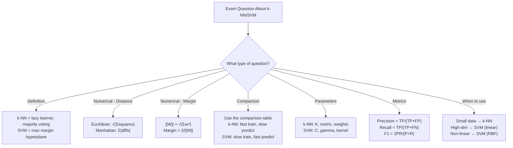

# AS30: k-NN and SVM Classification - Exam Preparation

---

## Section A: Multiple Choice Questions (MCQ) — 15 Questions

---

### MCQ 1
**Question:** k-NN algorithm oka _______ learner.

**Options:**
- A) Eager
- B) Lazy
- C) Semi-supervised
- D) Reinforcement

**✅ Correct Answer:** B) Lazy

**📖 Explanation:** k-NN is a lazy learner because it doesn't learn a discriminative function during training. It stores all training data and defers computation until prediction time, calculating distances to find nearest neighbors.

**❌ Why Others Are Wrong:**
- A) Eager learners (like SVM, Decision Trees) build a model during training. k-NN doesn't.
- C) Semi-supervised uses both labeled and unlabeled data. k-NN uses only labeled data.
- D) Reinforcement learning involves agents, rewards, and actions. Unrelated to k-NN.

---

### MCQ 2
**Question:** SVM lo margin formula enti?

**Options:**
- A) d = ||W|| / 2
- B) d = 2 / ||W||
- C) d = ||W||²
- D) d = 1 / ||W||²

**✅ Correct Answer:** B) d = 2 / ||W||

**📖 Explanation:** SVM margin width is d = 2/||W|| where ||W|| is the L2 norm of the weight vector. SVM minimizes ||W|| to maximize this margin, ensuring the widest possible separation between classes.

**❌ Why Others Are Wrong:**
- A) d = ||W||/2 — inverted formula. Would mean larger weights = larger margin (wrong!).
- C) d = ||W||² — this is the optimization objective (minimize ||W||²/2), not the margin itself.
- D) d = 1/||W||² — close but wrong. Margin is 2/||W||, not 1/||W||².

---

### MCQ 3
**Question:** k-NN lo K=1 aite enti avutundi?

**Options:**
- A) Underfitting
- B) Overfitting
- C) Perfect generalization
- D) No prediction possible

**✅ Correct Answer:** B) Overfitting

**📖 Explanation:** K=1 means the model uses only the single nearest neighbor for prediction. The decision boundary becomes very irregular, fitting to every noise point. Training accuracy = 100% but test accuracy is poor — classic overfitting.

**❌ Why Others Are Wrong:**
- A) Underfitting happens with very large K (K=N), not K=1.
- C) Perfect generalization would mean equal train/test accuracy — K=1 gives 100% train, poor test.
- D) Prediction is always possible with K=1 — just one neighbor determines the class.

---

### MCQ 4
**Question:** SVM lo hyperplane equation enti?

**Options:**
- A) W × X + b = 1
- B) W · X + b = 0
- C) W + X + b = 0
- D) W · X - b = 1

**✅ Correct Answer:** B) W · X + b = 0

**📖 Explanation:** The SVM hyperplane is defined by the equation W·X + b = 0, where W is the weight vector (normal to the hyperplane), X is the data point, and b is the bias term. Points where W·X + b > 0 belong to one class, and W·X + b < 0 to the other.

**❌ Why Others Are Wrong:**
- A) W × X + b = 1 — the "= 1" represents the margin boundary, not the hyperplane itself.
- C) W + X + b = 0 — simple addition, not dot product. Mathematically wrong.
- D) W · X - b = 1 — this describes a margin boundary, not the central hyperplane.

---

### MCQ 5
**Question:** K-NN ki evaru distance metric default ga use avutundi sklearn lo?

**Options:**
- A) Manhattan
- B) Cosine
- C) Minkowski (p=2, which is Euclidean)
- D) Hamming

**✅ Correct Answer:** C) Minkowski (p=2, which is Euclidean)

**📖 Explanation:** In sklearn's KNeighborsClassifier, the default metric is 'minkowski' with p=2, which is equivalent to Euclidean distance. Euclidean distance calculates the straight-line distance between two points.

**❌ Why Others Are Wrong:**
- A) Manhattan is Minkowski with p=1, not the default (p=2).
- B) Cosine similarity measures angle, not distance. Not default in k-NN.
- D) Hamming is for categorical/binary data, not continuous features.

---

### MCQ 6
**Question:** SVM lo "Support Vectors" ante enti?

**Options:**
- A) All training data points
- B) Points farthest from the hyperplane
- C) Points closest to the hyperplane (on margin boundaries)
- D) Points exactly on the hyperplane

**✅ Correct Answer:** C) Points closest to the hyperplane (on margin boundaries)

**📖 Explanation:** Support vectors are the data points that lie exactly on the margin boundaries (where yᵢ(W·xᵢ + b) = 1). They are the closest points to the hyperplane and are the ONLY points that define the hyperplane. Removing any other point won't change the hyperplane.

**❌ Why Others Are Wrong:**
- A) Not ALL training points — only the few on the margin boundary.
- B) Farthest points are irrelevant — they could be removed without affecting the hyperplane.
- D) Points ON the hyperplane (W·X+b=0) are ambiguous — support vectors are on the margin, not the hyperplane.

---

### MCQ 7
**Question:** k-NN lo optimal K value select chese popular heuristic enti?

**Options:**
- A) K = N (total data points)
- B) K = log(N)
- C) K = √N (square root of N)
- D) K = N/2

**✅ Correct Answer:** C) K = √N

**📖 Explanation:** The square root of N (training samples) is the most widely used heuristic for choosing K in k-NN. Example: N=100 → K=10, N=400 → K=20. This should be rounded to the nearest odd number for binary classification.

**❌ Why Others Are Wrong:**
- A) K=N means using ALL points — always predicts majority class (extreme underfitting).
- B) K=log(N) — not a standard heuristic for k-NN (used in some tree algorithms).
- D) K=N/2 — too large, leads to underfitting.

---

### MCQ 8
**Question:** SVM lo RBF kernel formula lo gamma (γ) parameter high aite enti avutundi?

**Options:**
- A) Smoother decision boundary (underfitting)
- B) More complex decision boundary (overfitting)
- C) Linear decision boundary
- D) No effect on boundary

**✅ Correct Answer:** B) More complex decision boundary (overfitting)

**📖 Explanation:** High gamma means each data point has a small influence radius — only very nearby points are considered. This creates highly complex, irregular decision boundaries that fit training data closely but generalize poorly = overfitting.

**❌ Why Others Are Wrong:**
- A) Smooth boundary comes from LOW gamma, not high.
- C) Linear boundary comes from the linear kernel, not from gamma.
- D) Gamma significantly affects the RBF kernel's decision boundary shape.

---

### MCQ 9
**Question:** Feature scaling k-NN ki enduku mandatory?

**Options:**
- A) Training speed improve cheyyadam ki
- B) Features with larger ranges dominate distance calculations
- C) To reduce number of features
- D) To increase K value automatically

**✅ Correct Answer:** B) Features with larger ranges dominate distance calculations

**📖 Explanation:** k-NN is distance-based. Without scaling, features with larger numeric ranges (e.g., salary in thousands vs age in tens) will dominate the distance calculation, making other features almost irrelevant. StandardScaler makes all features contribute equally.

**❌ Why Others Are Wrong:**
- A) Scaling doesn't significantly change k-NN training speed (it's already near-zero).
- C) Feature scaling doesn't reduce features — that's dimensionality reduction (PCA, etc.).
- D) K value is manually set — scaling doesn't change it.

---

### MCQ 10
**Question:** SVM lo C parameter ki oka low value (C=0.01) aite enti jarigistundi?

**Options:**
- A) Narrow margin, zero errors
- B) Wide margin, some misclassifications allowed
- C) No hyperplane found
- D) All points become support vectors

**✅ Correct Answer:** B) Wide margin, some misclassifications allowed

**📖 Explanation:** Low C means the model is lenient about misclassifications — it priorities a wider margin over perfectly classifying all training points. This typically leads to better generalization but may have some training errors.

**❌ Why Others Are Wrong:**
- A) Narrow margin with zero errors comes from HIGH C, not low C.
- C) Hyperplane is always found — C just controls the tradeoff.
- D) Low C typically means FEWER support vectors (simpler model), not all points.

---

### MCQ 11
**Question:** k-NN lo Manhattan Distance formula enti (2D)?

**Options:**
- A) √((x₂-x₁)² + (y₂-y₁)²)
- B) |x₂-x₁| + |y₂-y₁|
- C) max(|x₂-x₁|, |y₂-y₁|)
- D) (x₂-x₁)² + (y₂-y₁)²

**✅ Correct Answer:** B) |x₂-x₁| + |y₂-y₁|

**📖 Explanation:** Manhattan distance is the sum of absolute differences along each dimension. It's called "Manhattan" because it measures distance like walking along city grid streets — horizontal + vertical, no diagonal shortcuts.

**❌ Why Others Are Wrong:**
- A) This is Euclidean distance (straight line).
- C) This is Chebyshev distance (maximum difference in any single dimension).
- D) This is squared Euclidean distance (no square root, no absolute values).

---

### MCQ 12
**Question:** SVM lo evari kernel non-linear data ki default ga use cheyali?

**Options:**
- A) Linear
- B) Sigmoid
- C) RBF (Radial Basis Function)
- D) Polynomial (degree=10)

**✅ Correct Answer:** C) RBF

**📖 Explanation:** RBF kernel is the default and most commonly used kernel for non-linear classification in SVM. It measures similarity based on radial distance between points and can create flexible, curved decision boundaries. It's the best starting point before trying other kernels.

**❌ Why Others Are Wrong:**
- A) Linear kernel can only create straight lines — useless for non-linear data.
- B) Sigmoid kernel is rarely used and can behave unpredictably.
- D) Polynomial degree=10 is too complex — extreme overfitting risk.

---

### MCQ 13
**Question:** fit_transform() and transform() madhya difference enti?

**Options:**
- A) Both do the same thing
- B) fit_transform learns parameters AND applies transformation; transform only applies
- C) transform learns parameters; fit_transform only applies
- D) fit_transform is for test data; transform is for train data

**✅ Correct Answer:** B) fit_transform learns parameters AND applies transformation; transform only applies

**📖 Explanation:** fit_transform() = fit() + transform() — it learns the parameters (mean, std for StandardScaler) from DATA and then applies the transformation. transform() applies transformation using already-learned parameters. Use fit_transform on train, transform on test.

**❌ Why Others Are Wrong:**
- A) They are NOT the same — fit_transform learns, transform doesn't.
- C) Reversed! transform doesn't learn; fit_transform does.
- D) Reversed! fit_transform is for TRAIN data; transform is for TEST data.

---

### MCQ 14
**Question:** k-NN lo K value even (K=4) pettite binary classification lo enti problem vastundi?

**Options:**
- A) Model trains faster
- B) Tie possible (2 vs 2), no clear majority
- C) Always predicts one class
- D) No problem at all

**✅ Correct Answer:** B) Tie possible (2 vs 2), no clear majority

**📖 Explanation:** With even K in binary classification, ties can occur (e.g., K=4 with 2 Class-A and 2 Class-B neighbors). There's no clear majority for voting. That's why K should always be odd for binary classification to guarantee a majority.

**❌ Why Others Are Wrong:**
- A) K doesn't affect training speed (k-NN has no real training).
- C) It doesn't always predict one class — prediction depends on neighbors.
- D) Ties ARE a real problem — they lead to ambiguous, potentially random predictions.

---

### MCQ 15
**Question:** Oka dataset lo 100,000 samples untayi. k-NN and SVM ila compare avutayi?

**Options:**
- A) k-NN fast training, SVM fast prediction
- B) Both are equally fast
- C) Both are very slow — consider other algorithms
- D) k-NN fast prediction, SVM fast training

**✅ Correct Answer:** A) k-NN fast training, SVM fast prediction

**📖 Explanation:** k-NN has near-zero training time (just stores data) but O(n×d) prediction time — slow for 100K samples. SVM has O(n²-n³) training time — very slow for 100K — but fast prediction (only computes using support vectors). However, for 100K+ samples, both struggle — consider Random Forest or Gradient Boosting.

**❌ Why Others Are Wrong:**
- B) They are NOT equally fast — each excels in different phases.
- C) While both have limitations at 100K, they aren't equally "very slow." k-NN trains fast; SVM predicts fast.
- D) Reversed! k-NN has slow prediction, not fast. SVM has slow training, not fast.

---

## Section B: Multiple Select Questions (MSQ) — 12 Questions

---

### MSQ 1
**Question:** k-NN algorithm gurinchi correct statements evvi? (Select ALL that apply)

**Options:**
- A) It's a lazy learner — training phase lo emi nerchukoadu
- B) It uses distance calculations for classification
- C) It requires feature scaling for best results
- D) K=1 always gives best test accuracy
- E) It builds a decision tree internally

**✅ Correct Answers:** A, B, C

**📖 Explanation:**
- A) ✅ k-NN is lazy — stores data during training, computes distances during prediction
- B) ✅ Core mechanism is distance-based neighbor finding
- C) ✅ Without scaling, features with larger ranges dominate distances

**❌ Why Others Are Wrong:**
- D) K=1 leads to overfitting — 100% training accuracy but poor test accuracy
- E) k-NN doesn't use trees — it's purely distance-based. Decision trees are a different algorithm

---

### MSQ 2
**Question:** SVM support vectors gurinchi correct statements evvi? (Select ALL that apply)

**Options:**
- A) They are data points closest to the hyperplane
- B) They lie exactly on the margin boundaries
- C) Removing a support vector changes the hyperplane
- D) All training points are support vectors
- E) They define the optimal hyperplane position

**✅ Correct Answers:** A, B, C, E

**📖 Explanation:**
- A) ✅ Support vectors are the nearest points to the hyperplane
- B) ✅ They satisfy yᵢ(W·xᵢ + b) = 1 — exactly on the margin boundary
- C) ✅ Since they define the hyperplane, removal changes it
- E) ✅ Only support vectors determine hyperplane position — other points are irrelevant

**❌ Why Others Are Wrong:**
- D) Only a small subset of training points are support vectors — typically 1-10% of data

---

### MSQ 3
**Question:** Feature scaling evvari algorithms ki mandatory? (Select ALL that apply)

**Options:**
- A) k-NN
- B) SVM
- C) Decision Tree
- D) Random Forest
- E) Logistic Regression (with regularization)

**✅ Correct Answers:** A, B, E

**📖 Explanation:**
- A) ✅ k-NN uses distance calculations — unscaled features with large ranges dominate
- B) ✅ SVM's optimization is sensitive to feature magnitudes
- E) ✅ Regularized logistic regression penalizes coefficients — different scales cause unfair penalties

**❌ Why Others Are Wrong:**
- C) Decision Trees split on thresholds — scaling doesn't affect split quality
- D) Random Forest (ensemble of trees) — same as Decision Trees, scaling irrelevant

---

### MSQ 4
**Question:** SVM RBF kernel ki gamma parameter gurinchi correct statements? (Select ALL that apply)

**Options:**
- A) High gamma → complex boundary → overfitting
- B) Low gamma → smooth boundary → underfitting risk
- C) Gamma controls the influence radius of each data point
- D) Gamma only affects linear kernels
- E) gamma='scale' is the default in sklearn

**✅ Correct Answers:** A, B, C, E

**📖 Explanation:**
- A) ✅ High gamma = small influence radius per point = very complex, overfitting boundary
- B) ✅ Low gamma = large influence radius = overly smooth, underfitting
- C) ✅ Gamma defines how far the influence of a single point extends
- E) ✅ sklearn default is gamma='scale' which is 1/(n_features × var)

**❌ Why Others Are Wrong:**
- D) Gamma does NOT affect linear kernel — linear kernel has no gamma parameter. Gamma is for RBF, poly, sigmoid kernels

---

### MSQ 5
**Question:** k-NN lo K value choose chese methods evvi? (Select ALL that apply)

**Options:**
- A) K = √N (square root of training samples)
- B) Cross-validation with different K values
- C) K should be odd for binary classification
- D) Always use K = 1 for best results
- E) GridSearchCV for automated tuning

**✅ Correct Answers:** A, B, C, E

**📖 Explanation:**
- A) ✅ √N is the most popular heuristic for initial K selection
- B) ✅ Cross-validation tests multiple K values and picks the best
- C) ✅ Odd K prevents ties in binary majority voting
- E) ✅ GridSearchCV automates the K search with cross-validation

**❌ Why Others Are Wrong:**
- D) K=1 causes extreme overfitting — NEVER recommended as "best"

---

### MSQ 6
**Question:** SVM advantages evvi? (Select ALL that apply)

**Options:**
- A) Works well in high-dimensional spaces
- B) Memory efficient — only stores support vectors
- C) Versatile with different kernel functions
- D) Very fast training on large datasets
- E) Directly gives probability outputs

**✅ Correct Answers:** A, B, C

**📖 Explanation:**
- A) ✅ SVM excels when features > samples (text classification, genomics)
- B) ✅ Final model only uses support vectors, not all training data
- C) ✅ Linear, RBF, Poly, Sigmoid kernels handle different data patterns

**❌ Why Others Are Wrong:**
- D) SVM training is O(n²-n³) — SLOW on large datasets
- E) SVM gives class labels only by default. Need probability=True for Platt scaling (which is slower and approximate)

---

### MSQ 7
**Question:** Euclidean distance gurinchi correct statements? (Select ALL that apply)

**Options:**
- A) Straight-line distance between two points
- B) Formula: √(Σ(xᵢ - yᵢ)²)
- C) Always less than or equal to Manhattan distance
- D) Sensitive to feature scaling
- E) Based on Pythagoras theorem

**✅ Correct Answers:** A, B, C, D, E

**📖 Explanation:**
- A) ✅ Euclidean = straight line ("as the crow flies")
- B) ✅ Correct formula with squaring, summing, and square root
- C) ✅ By triangle inequality, straight line ≤ grid path always
- D) ✅ Features with larger ranges dominate the calculation
- E) ✅ It's the n-dimensional generalization of Pythagoras theorem

---

### MSQ 8
**Question:** SVM lo C parameter high value (C=1000) aite enti jarigistundi? (Select ALL that apply)

**Options:**
- A) Narrow margin
- B) Very few misclassifications on training data
- C) Risk of overfitting
- D) Better generalization guaranteed
- E) More support vectors typically

**✅ Correct Answers:** A, B, C, E

**📖 Explanation:**
- A) ✅ High C penalizes errors heavily → narrower margin to avoid errors
- B) ✅ High C forces near-zero training errors
- C) ✅ Fitting too closely to training data → overfitting
- E) ✅ More points fall on/near the narrower margin → more support vectors

**❌ Why Others Are Wrong:**
- D) High C does NOT guarantee better generalization — it typically HURTS it (overfitting)

---

### MSQ 9
**Question:** Classification report lo evvi metrics untayi? (Select ALL that apply)

**Options:**
- A) Precision
- B) Recall
- C) F1-Score
- D) Support
- E) R² Score

**✅ Correct Answers:** A, B, C, D

**📖 Explanation:**
- A) ✅ Precision = TP/(TP+FP) — accuracy of positive predictions
- B) ✅ Recall = TP/(TP+FN) — coverage of actual positives
- C) ✅ F1 = harmonic mean of precision and recall
- D) ✅ Support = number of actual samples per class

**❌ Why Others Are Wrong:**
- E) R² is a regression metric (not classification). Classification uses accuracy, precision, recall, F1

---

### MSQ 10
**Question:** k-NN ki disadvantages evvi? (Select ALL that apply)

**Options:**
- A) Slow prediction time (O(n×d))
- B) Sensitive to irrelevant features
- C) Curse of dimensionality in high dimensions
- D) Requires large memory (stores all training data)
- E) Cannot handle multi-class classification

**✅ Correct Answers:** A, B, C, D

**📖 Explanation:**
- A) ✅ Must compute distance to ALL training points for each prediction
- B) ✅ All features contribute equally — irrelevant features add noise
- C) ✅ In high dimensions, all points become equidistant → "nearest" loses meaning
- D) ✅ Stores entire training dataset in memory (lazy learner)

**❌ Why Others Are Wrong:**
- E) k-NN handles multi-class naturally via majority voting — no special modification needed

---

### MSQ 11
**Question:** SVM kernels lo correct matching evvi? (Select ALL that apply)

**Options:**
- A) Linear kernel → K(x,y) = x · y
- B) RBF kernel → K(x,y) = exp(-γ||x-y||²)
- C) Polynomial kernel → K(x,y) = (γx·y + r)^d
- D) Sigmoid kernel → K(x,y) = x² + y²
- E) RBF kernel is the most commonly used default kernel

**✅ Correct Answers:** A, B, C, E

**📖 Explanation:**
- A) ✅ Linear kernel is just the dot product — simplest kernel
- B) ✅ RBF uses exponential of negative squared distance
- C) ✅ Polynomial raises the shifted dot product to degree d
- E) ✅ RBF is default and most versatile for non-linear data

**❌ Why Others Are Wrong:**
- D) Sigmoid kernel formula is tanh(γx·y + r), NOT x² + y²

---

### MSQ 12
**Question:** StandardScaler gurinchi correct statements? (Select ALL that apply)

**Options:**
- A) Formula: z = (x - mean) / std
- B) After scaling, mean ≈ 0 and std ≈ 1
- C) fit_transform on training data, transform on test data
- D) fit_transform on test data is correct approach
- E) Essential for distance-based algorithms (k-NN, SVM)

**✅ Correct Answers:** A, B, C, E

**📖 Explanation:**
- A) ✅ StandardScaler subtracts mean and divides by standard deviation
- B) ✅ Result: features centered at 0 with unit variance
- C) ✅ Learn parameters from train, apply to test — prevents data leakage
- E) ✅ Both k-NN and SVM are sensitive to feature magnitudes

**❌ Why Others Are Wrong:**
- D) NEVER fit on test data! It causes data leakage — model gets unfair advantage

---

## Section C: Numerical/Calculation Questions — 8 Questions

---

### Numerical 1
**Question:** Points A = (1, 2) and B = (4, 6) madhya Euclidean distance entha?

**Given:**
- Point A = (1, 2)
- Point B = (4, 6)

**Solution Steps:**
1. Formula: d = √((x₂-x₁)² + (y₂-y₁)²)
2. d = √((4-1)² + (6-2)²)
3. d = √(3² + 4²)
4. d = √(9 + 16)
5. d = √25

**✅ Final Answer:** 5.0 units


---

### Numerical 2
**Question:** Points A = (1, 2) and B = (4, 6) madhya Manhattan distance entha?

**Given:**
- Point A = (1, 2)
- Point B = (4, 6)

**Solution Steps:**
1. Formula: d = |x₂-x₁| + |y₂-y₁|
2. d = |4-1| + |6-2|
3. d = 3 + 4

**✅ Final Answer:** 7 units

**Note:** Manhattan distance (7) ≥ Euclidean distance (5) — always true!

---

### Numerical 3
**Question:** SVM model lo W = [3, 4] aite margin width entha?

**Given:**
- Weight vector W = [3, 4]

**Solution Steps:**
1. ||W|| = √(w₁² + w₂²) = √(3² + 4²) = √(9 + 16) = √25 = 5
2. Margin = 2 / ||W|| = 2 / 5

**✅ Final Answer:** Margin = 0.4 units

---

### Numerical 4
**Question:** Training data lo N = 225 samples untayi. k-NN optimal K value ki √N heuristic use chesthe K entha?

**Given:**
- N = 225 training samples
- Binary classification

**Solution Steps:**
1. K = √N = √225 = 15
2. 15 is odd ✅ → Good for binary classification!

**✅ Final Answer:** K = 15

---

### Numerical 5
**Question:** SVM model lo W = [1, 1] aite margin width entha?

**Given:**
- Weight vector W = [1, 1]

**Solution Steps:**
1. ||W|| = √(1² + 1²) = √2 ≈ 1.414
2. Margin = 2 / ||W|| = 2 / 1.414 ≈ 1.414

**✅ Final Answer:** Margin ≈ 1.414 units

**Comparison:** W=[3,4] gave margin 0.4; W=[1,1] gives margin 1.414. **Smaller ||W|| → Larger margin!**

---

### Numerical 6
**Question:** k-NN lo K=5, nearest 5 neighbors ki classes: [A, B, A, A, B]. Prediction enti?

**Given:**
- K = 5
- Neighbor classes: [A, B, A, A, B]

**Solution Steps:**
1. Count Class A: 3
2. Count Class B: 2
3. Majority: A (3 > 2)

**✅ Final Answer:** Prediction = Class A (majority voting: 3 out of 5)

---

### Numerical 7
**Question:** Classification report lo TP=40, FP=5, FN=10, TN=45 aite Precision, Recall, F1-Score calculate cheyandi.

**Given:**
- True Positives (TP) = 40
- False Positives (FP) = 5
- False Negatives (FN) = 10
- True Negatives (TN) = 45

**Solution Steps:**
1. Precision = TP / (TP + FP) = 40 / (40 + 5) = 40/45 ≈ 0.889
2. Recall = TP / (TP + FN) = 40 / (40 + 10) = 40/50 = 0.800
3. F1 = 2 × (P × R) / (P + R) = 2 × (0.889 × 0.800) / (0.889 + 0.800) = 2 × 0.711 / 1.689 ≈ 0.842
4. Accuracy = (TP + TN) / (TP + TN + FP + FN) = (40 + 45) / 100 = 0.850

**✅ Final Answers:**
- Precision = 0.889 (88.9%)
- Recall = 0.800 (80.0%)
- F1-Score = 0.842 (84.2%)
- Accuracy = 0.850 (85.0%)

---

### Numerical 8
**Question:** Point X = (2, 3), hyperplane equation 3x₁ + 4x₂ - 1 = 0 aite, X evari class lo untundi?

**Given:**
- Point X = (2, 3)
- Hyperplane: 3x₁ + 4x₂ - 1 = 0

**Solution Steps:**
1. Substitute: W·X + b = 3(2) + 4(3) - 1
2. = 6 + 12 - 1
3. = 17

**✅ Final Answer:** W·X + b = 17 > 0, so X belongs to **Class +1** (positive side of hyperplane)

---

## Section D: Fill in the Blanks — 10 Questions

---

### Fill 1
**Question:** k-NN is a _______ learner because it defers computation until prediction time.

**Answer:** **lazy** (or instance-based)

**Explanation:** k-NN doesn't learn during training — it stores all data and computes distances only when a new prediction is needed.

---

### Fill 2
**Question:** SVM margin width formula is d = _______.

**Answer:** **2 / ||W||**

**Explanation:** Margin width is inversely proportional to the weight vector norm. Smaller ||W|| = wider margin.

---

### Fill 3
**Question:** In k-NN, the popular heuristic for K is K = _______ where N is the number of training samples.

**Answer:** **√N** (square root of N)

**Explanation:** √N provides a good balance between overfitting (K too small) and underfitting (K too large).

---

### Fill 4
**Question:** SVM hyperplane equation is _______ = 0.

**Answer:** **W · X + b**

**Explanation:** W is the weight vector, X is the data point, b is the bias. Points above (>0) = Class +1, below (<0) = Class -1.

---

### Fill 5
**Question:** The data points closest to the SVM hyperplane are called _______.

**Answer:** **support vectors**

**Explanation:** These critical points define the hyperplane. Removing them changes the decision boundary.

---

### Fill 6
**Question:** For distance-based algorithms like k-NN and SVM, _______ is mandatory before training.

**Answer:** **feature scaling** (StandardScaler / normalization)

**Explanation:** Without scaling, features with larger ranges dominate distance calculations. StandardScaler standardizes to mean=0, std=1.

---

### Fill 7
**Question:** In SVM, the _______ trick allows the algorithm to handle non-linearly separable data.

**Answer:** **kernel**

**Explanation:** The kernel trick implicitly maps data to a higher-dimensional space where a linear hyperplane can separate the classes.

---

### Fill 8
**Question:** Manhattan distance is also known as _______ distance or L1 distance.

**Answer:** **city block** (or taxicab)

**Explanation:** Named after Manhattan's grid-like street layout — distance measured by walking along streets, not cutting diagonally.

---

### Fill 9
**Question:** In SVM, the C parameter controls the tradeoff between _______ and _______.

**Answer:** **margin width** and **classification errors** (or regularization and fitting accuracy)

**Explanation:** High C = narrow margin (few errors). Low C = wide margin (some errors allowed). Low C typically generalizes better.

---

### Fill 10
**Question:** F1-Score is the _______ mean of precision and recall.

**Answer:** **harmonic**

**Explanation:** F1 = 2 × (P × R) / (P + R). Harmonic mean penalizes extreme imbalance — if either P or R is low, F1 drops significantly.

---

## 📚 Quick Revision Points

### Key Formulas
| Formula | Expression | Use |
|---------|-----------|-----|
| Euclidean Distance | d = √(Σ(xᵢ-yᵢ)²) | Default k-NN distance |
| Manhattan Distance | d = Σ\|xᵢ-yᵢ\| | Robust in high dimensions |
| SVM Margin | d = 2/\|\|W\|\| | Maximum margin = best SVM |
| SVM Hyperplane | W·X + b = 0 | Decision boundary |
| Precision | TP/(TP+FP) | Positive prediction accuracy |
| Recall | TP/(TP+FN) | Positive coverage |
| F1-Score | 2×(P×R)/(P+R) | Balance of P and R |
| StandardScaler | z = (x-μ)/σ | Feature normalization |

### Key Concepts Summary
| Concept | One-Line Definition | When to Use |
|---------|---------------------|-------------|
| k-NN | Classify based on K nearest neighbors via majority voting | Small datasets, few features, quick baseline |
| SVM | Find maximum-margin hyperplane separating classes | Medium datasets, high dimensions, need accuracy |
| Euclidean Distance | Straight-line distance (L2 norm) | Continuous features, same scale |
| Manhattan Distance | Grid-path distance (L1 norm) | High dimensions, outlier-robust |
| Support Vectors | Points on the margin boundary defining the hyperplane | Understanding SVM model |
| Kernel Trick | Project data to higher dimensions for non-linear separation | Non-linearly separable data |
| RBF Kernel | Similarity based on radial distance (exp(-γ\|\|x-y\|\|²)) | Default for non-linear SVM |
| StandardScaler | Normalize to mean=0, std=1 | Before k-NN, SVM, logistic regression |

### Common Exam Traps
1. **Trap:** "k-NN training is slow" → **Correct:** Training is FAST (near zero). PREDICTION is slow.
2. **Trap:** "SVM stores all training data" → **Correct:** SVM only stores SUPPORT VECTORS, not all data.
3. **Trap:** "Higher K is always better" → **Correct:** Too high K causes underfitting. Need balance (√N).
4. **Trap:** "Euclidean distance is always larger than Manhattan" → **Correct:** Euclidean is always ≤ Manhattan.
5. **Trap:** "fit_transform on test data is correct" → **Correct:** NEVER fit on test data. Only transform.
6. **Trap:** "C=0 means no regularization" → **Correct:** C cannot be 0. Large C = less regularization.

---

## 🚀 Section E: Shortcuts & Cheat Codes for Exam

### ⚡ One-Liner Shortcuts
| Concept | Shortcut/Cheat Code | When to Use |
|---------|---------------------|-------------|
| k-NN type | "Lazy Learner = No Training" | When asked about k-NN training |
| SVM margin | "Margin = 2/norm(W)" | Any margin calculation |
| Optimal K | "K = √N, make it odd" | K selection questions |
| K=1 effect | "K=1 = Overfitting = 100% train, bad test" | Bias-variance questions |
| K=N effect | "K=N = Underfitting = always majority class" | Bias-variance questions |
| RBF kernel | "Default kernel for non-linear SVM" | Kernel selection questions |
| High C | "High C = Strict teacher = Narrow margin = Overfitting" | C parameter questions |
| Low C | "Low C = Lenient teacher = Wide margin = Better generalization" | C parameter questions |
| High gamma | "High gamma = Small radius = Complex boundary = Overfitting" | Gamma questions |
| Feature scaling | "Mandatory for k-NN and SVM" | Preprocessing questions |
| Precision | "How many positive predictions are actually positive?" | Metric questions |
| Recall | "How many actual positives did we catch?" | Metric questions |

### 🎯 Memory Tricks (Mnemonics)

1. **SVM = "Super Voter Machine"** → Finds the BEST dividing line via margin maximization → Helps remember: SVM is about optimal separation
2. **k-NN = "k Nearest Neighbors = Ask k friends"** → Like asking K closest friends for advice → Helps remember: Majority voting from closest points
3. **LAMP for distance metrics** → **L**1 = Manhattan (|absolute|), **L**2 = Euclidean (√square), **A**lways L2 ≤ L1, **M**andatory scaling → Helps remember: Distance metric properties
4. **SV in SVM = "Special Voters"** → Only special boundary points vote on hyperplane position → Helps remember: Support vectors are the critical few points
5. **C = "Control" parameter** → More C = More Control = More Strict = More Overfitting → Helps remember: C parameter effect

### 🔢 Quick Calculation Hacks
| Scenario | Hack/Shortcut | Example |
|----------|---------------|---------|
| Euclidean for (3,4) diffs | It's a 3-4-5 triangle! Answer = 5 | A=(0,0), B=(3,4) → d=5 |
| Manhattan distance | Just add absolute diffs — no sqrt needed | A=(1,2), B=(4,6) → 3+4=7 |
| Margin from W | Calculate ||W|| first (Pythagoras), then 2/||W|| | W=[3,4] → ||W||=5 → margin=0.4 |
| √N for K | Perfect squares: √100=10, √225=15, √400=20 | Memorize common perfect squares |
| F1 when P=R | F1 = P = R (harmonic mean of equal values = same value) | P=0.8, R=0.8 → F1=0.8 |

### 📝 Last-Minute Formula Sheet
```
📌 Euclidean Distance: d = √(Σ(xᵢ-yᵢ)²) → Use for: Default k-NN distance
📌 Manhattan Distance: d = Σ|xᵢ-yᵢ| → Use for: High-dim, outlier-robust
📌 SVM Hyperplane: W·X + b = 0 → Use for: Decision boundary equation
📌 SVM Margin: d = 2/||W|| → Use for: Margin width calculation
📌 SVM Constraint: yᵢ(W·xᵢ + b) ≥ 1 → Use for: Optimization problem
📌 Precision: TP/(TP+FP) → Use for: "Of predicted positives, how many correct?"
📌 Recall: TP/(TP+FN) → Use for: "Of actual positives, how many found?"
📌 F1-Score: 2PR/(P+R) → Use for: Balance between precision and recall
📌 StandardScaler: z = (x-μ)/σ → Use for: Feature normalization
📌 Optimal K: K ≈ √N (odd) → Use for: K selection in k-NN
```

### 🎓 Interview One-Liners
| Question Pattern | Safe Answer Template |
|------------------|---------------------|
| "What is k-NN?" | "k-NN is a lazy, non-parametric classifier that predicts by majority voting among K nearest neighbors using distance metrics." |
| "What is SVM?" | "SVM finds the optimal hyperplane that maximizes the margin between classes, using only support vectors." |
| "k-NN vs SVM?" | "k-NN is lazy (no training, slow prediction), SVM is eager (slow training, fast prediction). k-NN works naturally with non-linear data, SVM needs kernels." |
| "What is the kernel trick?" | "The kernel trick implicitly maps data to higher dimensions for linear separation without computing the actual transformation." |
| "When to use k-NN?" | "Use k-NN for small datasets, few features, when interpretability matters, and when you need quick model setup." |
| "When to use SVM?" | "Use SVM for medium datasets, high-dimensional data (text), when accuracy is priority, and when you need fast predictions." |
| "What is margin in SVM?" | "Margin is the distance between the hyperplane and the closest data points (support vectors). SVM maximizes this margin for best generalization." |
| "Why scale features?" | "Distance-based algorithms are sensitive to feature magnitudes. Without scaling, features with larger ranges dominate the distance calculations." |

### ⚠️ "If You Forget Everything, Remember This"
1. **Golden Rule 1**: k-NN = lazy learner (no training, majority voting of K nearest neighbors). SVM = margin maximizer (best separating hyperplane).
2. **Golden Rule 2**: Feature scaling is MANDATORY for both k-NN and SVM. Use StandardScaler. fit_transform on train, transform on test.
3. **Golden Rule 3**: K=√N for k-NN (odd). SVM margin = 2/||W||. RBF is default kernel. High C = overfitting, Low C = generalization.

### 🔄 Quick Decision Flowchart


### 🎯 Safe Answer Patterns
- **For "What is X?"** → Definition + One-line use case + Simple analogy
- **For "Explain X"** → Analogy first + Technical definition + Formula + Example
- **For "Compare X vs Y"** → Table with 4-5 key differences + "It depends on use case"
- **For "Calculate X"** → Formula written first + Step-by-step substitution + Final answer with units
- **For "Why X?"** → Problem it solves + What happens without it + Real-world consequence
- **For "When to use X?"** → Conditions list + Counter-example (when NOT to use)
